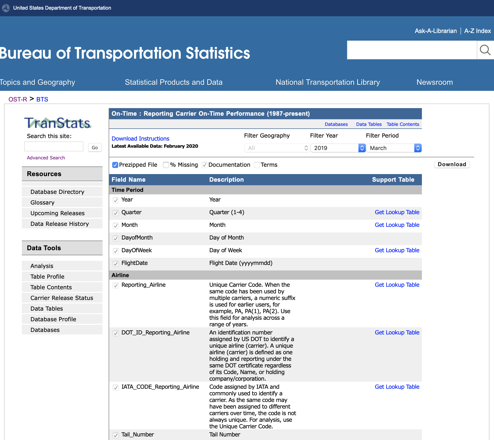
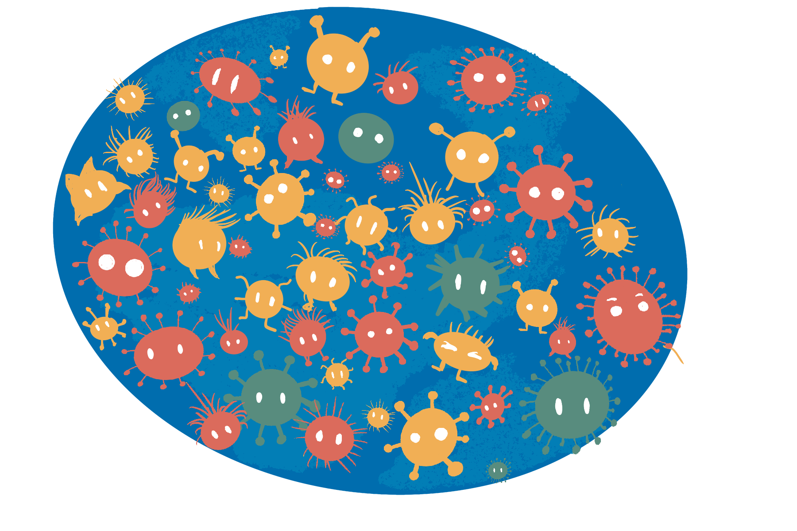
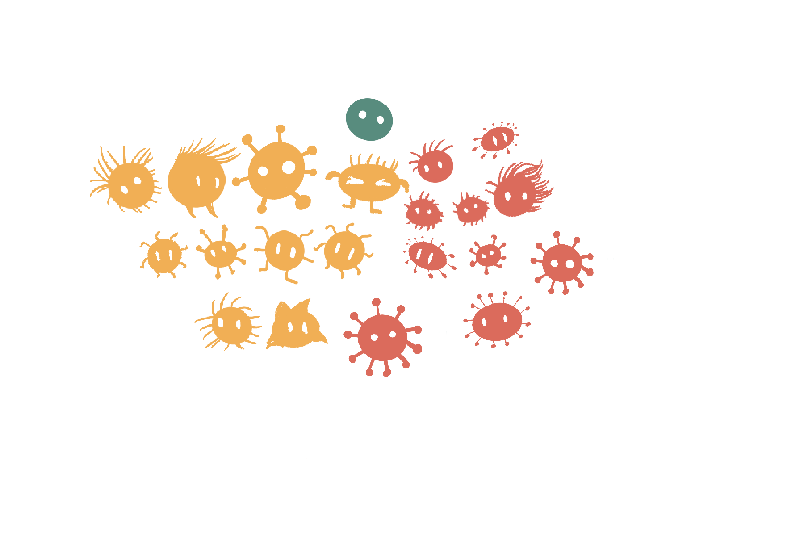
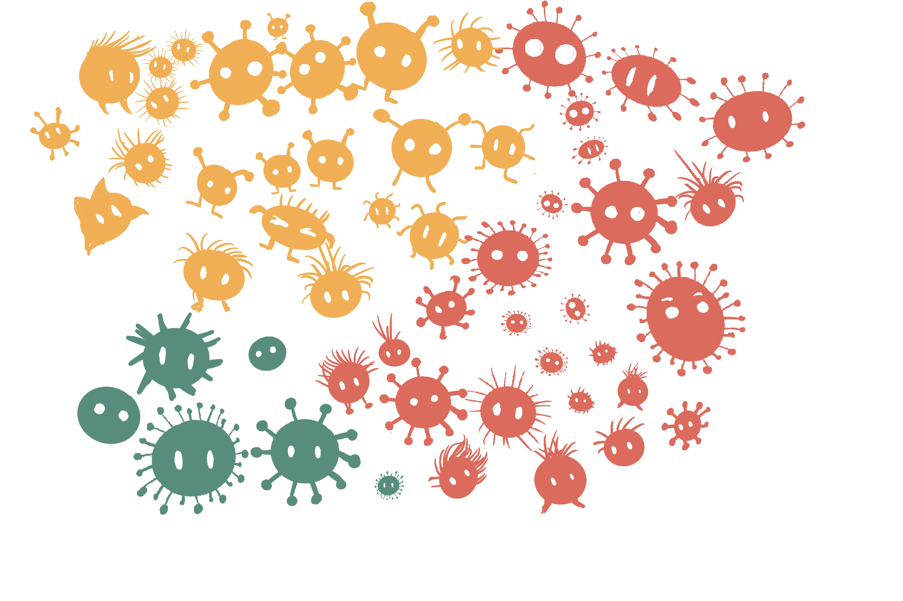

```{r, include = FALSE}
current_file <- knitr::current_input()
basename <- gsub(".Rmd$", "", current_file)

knitr::opts_chunk$set(
  fig.path = sprintf("images/%s/", basename),
  fig.width = 6,
  fig.height = 4,
  fig.align = "center",
  fig.retina = 3,
  echo = FALSE,
  warning = FALSE,
  message = FALSE,
  cache = FALSE,
  cache.path = "cache/"
)
```

```{r titleslide, child="assets/titleslide.Rmd"}
```


---

class: middle monash-bg-blue

.f-headline[**Starts with .white[curiosity]**]
--

<br> .grey[which is] <br>
--

.f-headline[** tempered with .white[skepticism]**]


---

# What would you be curious about ... ? 

.flex[
.w-80[

* ... about air travel in the USA?

<a href="https://www.transtats.bts.gov/DataIndex.asp">    </a>

]
]

???

* This is an example where the data has been already collected. 
* Interested in **data collection methods**

---

# What would you be curious about ... ? 

.flex[
.w-80[

* ... about people in Australia?

<iframe src="https://www.abs.gov.au/ausstats/abs@.nsf/Latestproducts/2916.0Main%20Features202016?opendocument&tabname=Summary&prodno=2916.0&issue=2016&num=&view=" width="100%" height="400px">
</iframe>

]
]

???

* Survey data


---

# What would you be curious about ... ? 

.flex[
.w-80[

* ... about how people vote in Australia?

<iframe src="https://results.aec.gov.au" width="100%" height="400px">
</iframe>

]
]

???
All of the population, plus sampling

---

# What would you be curious about ... ? 

.flex[
.w-80[

* ... About COVID in Victoria

<a href="https://www.coronavirus.vic.gov.au/victorian-coronavirus-covid-19-data"> 
</a>

]
]

???
Incidence data, but imperfect

---
class: middle monash-bg-blue

.f-headline[**Curiosity usually corresponds to asking  .white[questions]**]


---
background-image: url(images/art01.png)
background-size: 80%
background-position: 70% 50%

# Planet Cute Creatures

.absolute.w-40[

{{content}}
]


--

<div class="question-box">
How many yellow, green and red alien creatures?
</div>
{{content}}

--

<div class="question-box">
What is the distribution of the height of the alien creatures?
</div>
{{content}}
--

<div class="question-box">
Are yellow creatures more likely to have hair?
</div>
{{content}}
--

<div class="question-box">
Does the hair growth formula work on these creatures?
</div>

---

class: monash-bg-blue middle tr 

.pa5[
.f-headline[**Now that we have a .white[question] ...**]

]

---

class: monash-bg-blue middle tr 

.pa5[
.f-headline[**...we can find/use/collect .white[data] to obtain .white[answers].**]

]
---

class: no-logo

# How do we get the data?  

--


.flex[
.w-50[
.f2[What is the population?]




]
.w-50[
{{content}}

]
]

--

<div class="f2">It is rare to have resources to measure ALL of the population, take we a sample</div>


---

.flex[
.w-50[
Population:


Parameters (typically don't know the values): 

.cgreen[Green:] 6/53=0.113, .cyellow[Yellow:] 22/53=0.416,<br> .cred[Red:] 25/53=0.472
]
.w-50[
Sample:


The statistics:

.cgreen[Green:] 1/21=0.048, .cyellow[Yellow:] 10/21=0.476,<Br> .cred[Red:] 10/21=0.476, are estimates of parameters

]

]

---
# Sampling the population

.info-box.w-75[
Collecting data on the entire population is normally too expensive or infeasible! (If we can, it is called a .monash-orange2[census].)
]
--

* We therefore collect data only on a subset of the population.
--

* **How should we sample the population?**
--
 There are many sampling schemes.
---

count: false

# Sampling the population

.info-box.w-75[
Collecting data on the entire population is normally too expensive or infeasible! (If we can, call it a .monash-orange2[census].)
]

* We therefore collect data only on a subset of the population.

* **How should we sample the population?** There are many sampling schemes.


.idea-box.w-45[
**Simple random sampling**  
Every unit in the population has the same sample probability to be drawn.
<center>
 
</center>
]
--
 .idea-box.w-45[
**Stratified random sampling**  
Units are drawn from non-overlapping sub-populations.
<center>
 
</center>
]

???

* **Stratified random sampling** requires identifying different subpopulations and may involve SRS on subpopulation

---


# Goal of sampling schemes

.w-85[
.aim-box.w-70[   
The **goal of a sampling scheme** is to get accurate information from the sample in order to answer your question about the population.
]

{{content}}
]


--


* This involves identifying:
  * the **population of interest** (e.g. if studying about male baldness pattern, your population of interest is the biologically male population),
  * what **responses** (dependent variables) or **covariates** (explanatory or independent or predictor variables) to capture and how to measure it (e.g. do you collect their age? Which range of age they are in? Their hair count? The thickness of the hair?),
  * the **sample size** (how many samples do we need?),
  * any **structure** that will be in the data (e.g. population structures, repeated cross-sectional data, panel or longitudinal data), and 
  * any **restrictions** (e.g. ethical concerns, limitation on collecting data).

---

# Sampling strategies

.w-70[
* Sampling strategies combine knowledge about the population with statistical methods. 
{{content}}
]

--

* For example,
  * designing so your sample estimates give (theoretically) unbiased estimates of the population parameters,
  * sample so the data will be representative of the subpopulations (e.g.  stratified random sampling), or
  * oversampling or undersampling to compensate for imbalance in classes.
--

.think-box.w-60[
 What might go wrong with a simple random sampling of 10 creatures from this population?
]


---

# Random and non-random selections

* Units (population members) ideally are sampled *randomly*, but often selections are made in a non-random manner.<br>

--
.think-box.w-45[
If I survey every 10th household in a street, is that a random selection? 
] 
--
.think-box.w-45[
What do you think can go wrong if we don't sample randomly?
]
--

<br>

* What's wrong with these examples? 

.flex[
.work-box.w-45.clear-list[
* .li-aim[You want to know the attitude of the creatures about working at home.]
* .li-data[You call phone numbers listed in the order of telephone directory and stop when you have 20 observations.]
]
{{content}}
]
--
<div class="work-box w-45 clear-list">
<ul>
<li><span class="li-aim">You want to get the hair count distribution of the Planet Cute Creatures population.</span></li>
<li><span class="li-data">You sample creatures from the Society of Bald Extraterrestrials.</span></li>
</ul>
</div>

---

# Reality of data collection ... 

* .monash-ruby2[Designing a data collection is **_hard_**].
--

  * There may be unknown or hidden structures in the population.
--

  * It may add complex structural elements, e.g.
      * Cross-sectional, repeated cross-sectional (e.g. case-control), 
      * Panel or longitudinal (e.g. cohort studies), and so on.
      * Clusters or hierarchies (e.g. students in schools in states)
      
--

  * You may have introduce unintended or unknown structures in the data, e.g. confounded variables.
    
--

  * It's further complicated by:
      * Non-response, 
      * Missing data, 
      * Mis-measured data, 
      * Dropouts, and censoring,
      * ..... 😱

---

# Observational studies

* Sampling from a population typically yields data considered to be an .monash-blue[**observational studies**]. Almost all open data are from observational studies.

.info-box.w-75[
* An **observational study** aims to draw inferences about a population from a sample where independent variables are *not* intentionally allocated to units within the sample for the purpose of a study.
* Data considered in observational studies are **observational data**.  
]

--
  

Examples:

.flex[
.idea-box.w-33[
.clear-list[
* .li-aim[Who will win the 2022 Australian federal election?]
* .li-data[Survey households]
]]

.idea-box.w-33[
.clear-list[
* .li-aim[Where are the best schools?]
* .li-data[Government administrative data]
]]

.idea-box.w-33[
.clear-list[
* .li-aim[Who are buying my products?]
* .li-data[Customer database]
]]
]

---

# Experimental studies

* A scientific claim generally need to be validated by an *experimental study*. 

.info-box.w-80[
* In an **experimental study**, a causal variable of interest (referred to as *treatment*) is administered to recipients while holding other covariates at controlled settings to observe responses. 
* Data from an experiment are referred to as **experimental data**.
]

--

  

Examples:

.flex[
.idea-box.w-45[
.clear-list[
* .li-aim[Is the vaccine effective against flu?]
* .li-data[The data of whether the person who was administered the vaccine or placebo caught the flu afterwards.]
]]

.idea-box.w-45[
.clear-list[
* .li-aim[Which fertilizer brand is most effective for wheat yield?]
* .li-data[Yield data from crop field trial with plots treated with one of the three fertilizer brands.]
]]

]

---

# Experimental units

.info-box.w-70[
**Experimental units** are recipients of the allocated treatment such that no sub-division of it can receive another treatment independently.

]
--

.think-box.w-70[
* Prof Android delivers their lecture by reciting word-to-word from the text in a monotone. 
* Prof Alien delivers their lecture by transmitting the information directly to the students mind.
* You want to see if one of the methods is more effective. 
* Students in class 1, 3, 4, 7 and 10 have Prof Android.
* Students in class 2, 5, 6, 8 and 9 have Prof Alien.

**What are the experimental units?** {{content}}
]

--

It's the classes.

---

# Observational units

.info-box.w-70[
**Observational units** are units that you measure the response on.
]

.think-box.w-70[
Carrying on from the previous example... 
* Students all sit for the same exam. 
* You record the exam mark for each student.

**What are the observational units?** {{content}}

]

--

It's the students.

--

* Note: 
    - *observational unit* is not the *observation* (the response)!
    - Sometimes the experimental units  *are the same as* the observational units.

---
# Example: french fries (hot chips)

.flex[
.w-50[
This is data from a 10 week sensory experiment, 12 individuals assessed taste of french fries on several scales (how potato-y, buttery, grassy, rancid, paint-y do they taste?), fried in one of 3 different oils, replicated twice. 

<br><br>
Data is available in the deprecated R package [reshape](https://github.com/hadley/reshape)
and was one of the examples that inspired the tidyverse tools. ]

.w-50[
```{r fig.width=6, fig.height=7, out.width="80%"}
# Data from https://github.com/hadley/reshape/blob/master/data/french_fries.rda
library(tidyverse)
load(here::here("data/french_fries.rda")) 
french_fries <- french_fries %>%
  as_tibble() %>%
  rename(oil = treatment,
         week = time)

ggplot(french_fries, aes(x=rep, y=subject, 
                      fill=factor(rep), colour=oil)) +
  geom_tile(size=2) +
  facet_grid(oil~week) +
  theme_bw() +
  xlab("") +
  xlim(c(0.5, 2.5)) +
  scale_fill_brewer("", palette = "Set1") +
  theme(legend.position = "none", 
        axis.ticks.x = element_blank(),
        axis.text.x = element_blank())
```

```{r eval=FALSE}
# Visualise with deggust
library(deggust)
library(edibble)
french_fries %>% 
  dplyr::mutate(obs_id = 1:dplyr::n(), 
         # treatment is also treated as a unit that index obs id!! 
         # some context is stripped away, so can't tell
         trt = oil) %>% 
  as_edibble() %>% 
  set_units(rep, subject, week, obs_id, trt) %>% 
  set_trts(oil) %>% 
  allot_units(obs_id ~ crossed_by(rep, subject, week, trt)) %>% 
  deggust::autoplot()
```

]
]

---
# Example: french fries (hot chips)

.flex[
.w-50[
10 week sensory experiment, 12 individuals assessed taste of french fries on several scales, fried in one of 3 different oils, replicated twice. 

* The **treatment** is oil, and there are 3 of them.
* The **experimental units** are batches of chips.
* The **observational units** are the tasters.
* **Replication** is the two batches of each oil for each week.
* Weeks could be considered to be **blocks**, because the taste might change as the oil ages.
* The **outcome** or measured variable is the rating factor. There are five taste factors recorded.
* **Randomisation** applied to order of tasting (probably), but tasters should be **blind** to the type of oil. 
]

.w-50[
```{r fig.width=6, fig.height=7, out.width="80%"}
# Data from https://github.com/hadley/reshape/blob/master/data/french_fries.rda
library(tidyverse)
load(here::here("data/french_fries.rda")) 
french_fries <- french_fries %>%
  as_tibble() %>%
  rename(oil = treatment,
         week = time)

ggplot(french_fries, aes(x=rep, y=subject, 
                      fill=factor(rep), colour=oil)) +
  geom_tile(size=2) +
  facet_grid(oil~week) +
  theme_bw() +
  xlab("") +
  xlim(c(0.5, 2.5)) +
  scale_fill_brewer("", palette = "Set1") +
  theme(legend.position = "none", 
        axis.ticks.x = element_blank(),
        axis.text.x = element_blank())
```
]
]


```{r}
library(agridat)
filter <- dplyr::filter # curse you!!!
```


---

# Systematic Design of Experiments

> **Randomisation** applied to order of tasting (probably)

* Why don't we order the treatments in a **systematic order**?

--
* Isn't this easier to manage the experiment?

--
<br><br>
<div class="info-box w-90">
Systematic designs are prone to <b class="monash-blue">bias</b> and <b class="monash-blue">confounding</b>.
</div>

---

# Randomisation

.w-70[
* Treatments should be allocated *randomly* to experimental units. 
* This avoids:
  * .monash-blue[**systematic bias**] - e.g. all flu vaccine A tested in January (summer) and all flu vaccine B tested in July (winter).
  * .monash-blue[**selection bias**] - e.g. giving the treatment that you are testing to the sick patients and placebo to those that are healthy.
  * .monash-blue[**other bias**] - e.g. the lab technician giving the treatment to the first rat that is taken out of the cage. 

]


---

# Blocking

.info-box.w-50[
 .monash-blue[**Blocks**] are used to group the experimental units into alike units.
]
--
.w-70[
* If well done, blocking can lower the variance of treatment contrasts which increase power.
* A non-homogeneous block (i.e. units within block are *not* alike) can decrease the power of the experiment.

{{content}}

]

--

You can form blocks from:


* **Natural discrete divisions** between experimental units. <br>E.g. in experiments with people, the gender make an obvious block.
* Grouping experimental units with similar **continuous gradients**. <br>E.g., if the experiment is spread out in time or space and there exists no obvious natural boundaries, then an arbitrary boundary may be chosen to group experimental units that are contiguous in time or space. 

---

# The Salk Vaccine Field Trial

.footnote.f5[
Source: Freedman, Pisani & Purves (2010) Statistics. 4th edition
]
.w-50[
* The first polio epidemic hit the United States in 1916 claiming hundreds of thousands of victims, especially children.
* National Foundation for Infantile Paralysis (NFIP) was ready to test the vaccine developed by Jonas Salk in the real world.
* A controlled experiment was proposed to test the effectiveness of the vaccine on grade 1, 2 and 3 children at selected school districts though the country where the risk of polio was high.
* In total two million children were involved although not all parents consented to their children to be vaccinated.
]

---


.flex[
.w-45[
# Design for the NFIP Study

.color-box.monash-bg-blue.white[
Vaccinate all grade 2 children whose parents would consent, leaving children in grades 1 and 3 as controls.]

* Can grade 2 children whose parents did not consent be included as control?
* What are the potential issues with such a design?
* Polio is a contact disease. Would incidences of disease be higher in grade 2?
]
{{content}}
]
--

 <div class="w-45 pl4">

<h1>Randomised controlled trial</h1>

<div class="color-box monash-bg-blue white">
An alternate vaccine trial randomly assigned the vaccine and placebo to children.
</div>

</div>

---

# Vaccine Results

.flex[
```{r, echo = FALSE}
tibble(group = c("Vaccinated (Grade 2)", "Control (Grade 1 & 3)", "Not Vaccination<br> (Grade 2, no consent)", "Incomplete Vaccination<br>(Grade 2, incomplete)"),
       size = c("221,998", "725,173", "123,605", "9,904"),
       rate = c(25, 54, 44, 40)) %>% 
  knitr::kable(col.names = c("Group", "Participants", "Rate"),
               caption = "The NFIP Study",
                align = c("lrr"), escape = F) %>% 
  kableExtra::kable_styling(c("striped", "bordered"))
```


```{r, echo = FALSE}
tibble(group = c("Vaccinated", "Placebo", "Not Vaccination<br>(no consent)", "Incomplete Vaccination"),
       size = c("200,745", "201,229", "338,778", "8,484"),
       rate = c(28,71,46,24)) %>% 
  knitr::kable(col.names = c("Group", "Participants", "Rate"), 
               caption = "Randomised controlled trial",
               align = "lrr", escape = F) %>% 
  kableExtra::kable_styling()
```

]

* The rate is the number of polio cases per 100,000 in each group.
* RCT and NFIP trial sampled from school districts with similar exposures to the polio virus.

--

.think-box.w-90[
The groups labelled variously as Not Vaccination (no consent), Control and Placebo group did not receive the vaccine. Why is the rate of polio cases different?
]

---

# Possible explanations

.w-70[
* Higher income parents would more likely consent to treatment than lower-income parents.
{{content}}

]
--
* Children of higher income parents are more vulnerable to polio.
{{content}}
--
* Many forms of polio are hard to diagnose and in borderline cases.

---


# Limitations in (social) experiments

* Cooperation needed from participants 
* Ethical objections
* Substitution bias 
* Sample attrition 
* Hawthorne effect

--

.w-70[
.f1[Basically, designing and running experiments are *hard*.]
]

---
# Taxonomy of types of data studies

- **Experimental data**: the gold standard of data collection, but very difficult
- **Observational data**:
    - **census**: all (or close to all) members of the population are measured
    - **survey sample**: each member of the population has a known probability of being selected into the sample, eg cohort study, cross-sectional, case-control, cluster/hierarchical, multi-stage
    - **non-random sample**: it is not known how the sample relates to the population
    - **censored**: events might happen outside of observation interval, eg observed up to 30,000km but brake failure was at 45,000 km
    - **occurrences**: only when an incident is observed is it recorded, eg wildlife sightings, warranty claims, complaints
        

.info-box.w-100[
 Knowing how the sample of data relates to the population is an essential ingredient for making .monash-blue2[inferential statements] and making decisions with data.
]


---

class: transition 


# Pop Quizzes

---


# Observational (what type) or experimental data?


.question-box.w-50[
Airline traffic (on-time performance database) in the USA as available from https://www.bts.gov. Records on every commercial flight operated in the USA since the 1980s, that has carried passengers. 
]

--

.w-60[
.fr.animated.bounceIn.f1.small-caps[Observational, census]

<br><br><br><br>
Always ask yourself "What is missing?"

]

---

# Observational (what type) or experimental data?


.question-box.w-60[
National Longitudinal Survey of Youth 1979
https://www.nlsinfo.org/content/cohorts/NLSY79 Measures people born between 1957 and 1964. At the time of first interview, respondents' ages ranged from 14 to 22. 
]

--

.w-60[
.fr.animated.bounceIn.f1.small-caps[Observational, survey sample]

<br><br><br><br>
Always ask yourself "What is the population?"
]


---

# Observational (what type) or experimental data?


.question-box.w-80[
Atlas of Living Australia at https://www.ala.org.au. The Atlas of Living Australia (ALA) is a collaborative, digital, open infrastructure that pulls together Australian biodiversity data from multiple sources, making it accessible and reusable.

The ALA helps to create a more detailed picture of Australia’s biodiversity for scientists, policy makers, environmental planners and land managers, industry and the general public, and enables them to work more efficiently.
]

--

.w-90[
.fr.animated.bounceIn.f1.small-caps[Observational, occurrence]

<br><br><br><br>
Always ask yourself "What is missing?" and "What is the population?"
]

---

# Observational (what type) or experimental data?


.question-box.w-70[
The US National Institute of Health provides a catalog of medical studies including many COVID studies. Here is one that studies the ["Safety and Efficacy of C21 in Subjects With COVID-19"]((https://clinicaltrials.gov/ct2/show/NCT04452435?recrs=e&cond=covid&draw=2&rank=10). 
]

--

.flex[
.w-60[
.fr.animated.bounceIn.f1.small-caps[Experimental]

<br><br><br><br>
What are the treatments? Experimental units? Outcome measure? Randomisation?
]
]

---

class: transition

## Slides originally developed by Professor Di Cook and Dr Emi Tanaka, Slides maintained by Dr. Kate Saunders


---

```{r endslide, child="assets/endslide.Rmd"}
```


