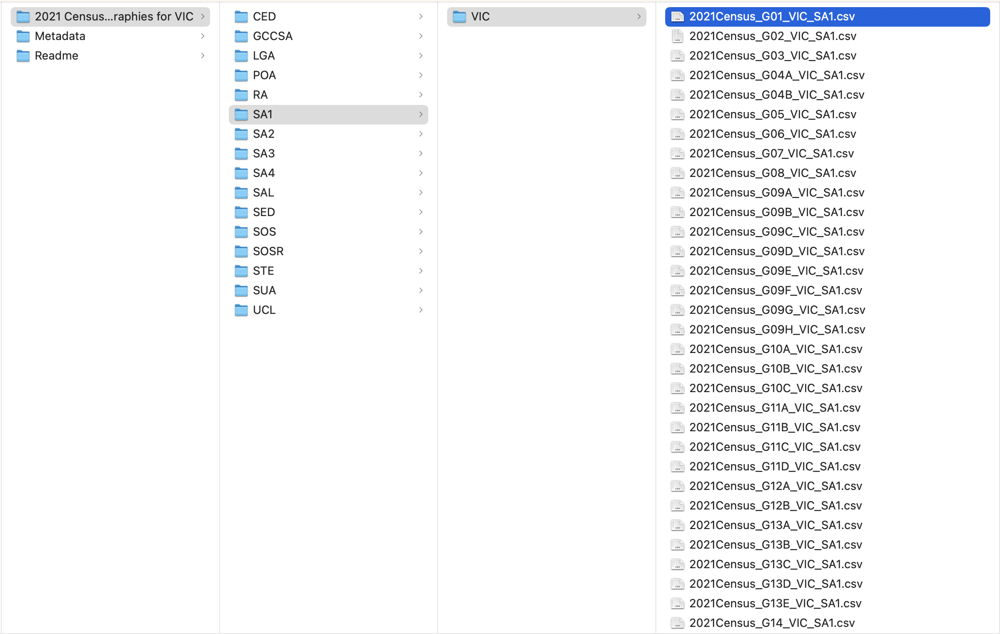

```{r, include = FALSE}
current_file <- knitr::current_input()
basename <- gsub(".Rmd$", "", current_file)

knitr::opts_chunk$set(
  fig.path = sprintf("images/%s/", basename),
  fig.width = 6,
  fig.height = 4,
  fig.align = "center",
  fig.retina = 3,
  echo = TRUE,
  warning = FALSE,
  message = FALSE,
  cache = FALSE,
  cache.path = "cache/"
)
```

```{r titleslide, child="assets/titleslide.Rmd"}
```

---

# Recall from lecture 2:

.blockquote[
Collecting data on the entire population is normally too expensive or infeasible!  

Therefore, we often can only collect data about a subset of the population.
]

--

<br><br>
<center>
If we can collect data about the entire population, that is called a .monash-blue[**census**]
</center>
---

class: bg-gray

.flex[
.w-50[
## Sample survey
]
.w-45[
## Census
]
]

<div class="w-10 absolute right-0 rotate" style="top:30%;">
<b>Advantages</b>
</div>

<div class=" w-10 absolute right-0 rotate" style="top:70%;">
<b>Disadvantages</b>
</div>


.flex.h-40[
.w-50.monash-bg-blue.pa2.white[
]
.w-45.bg-white[
]]

.flex.h-45[
.w-50.bg-white[
]
.w-45.monash-bg-blue.white[

]]


---

count: false


class: bg-gray

.flex[
.w-50[
## Sample survey
]
.w-45[
## Census
]
]

<div class="w-10 absolute right-0 rotate" style="top:30%;">
<b>Advantages</b>
</div>

<div class=" w-10 absolute right-0 rotate" style="top:70%;">
<b>Disadvantages</b>
</div>


.flex.h-40[
.w-50.monash-bg-blue.pa2.white[

* Reduces cost
* Timely collection of data


]
.w-45.bg-white[

* Data available, even for small geographical areas or subpopulations
* Statistics are not subject to sampling error
* Better accuracy and details

]]

.flex.h-45[
.w-50.bg-white[

* Lack of data on sub-population (particularly minorities) or small geographical areas
* Requires careful construction of sampling design
* Estimates are subject to sampling error
* The estimates may not be accurate or reliable 
* Estimating and communicating precision of estimates is difficult

]
.w-45.monash-bg-blue.white[

* Expensive or infeasible
* Time consuming to collect all data

]

]

---

class: center middle bg-gray

.aim-box.w-70.tl[
Today is all about the Australian Census: 

* Learn about what the census is and how it is collected 
* Learn what data on population demographics is collected
* Learn how the census data is stored and how to access it 

]

--

.aim-box.w-70.tl[
From a coding perspective:

* Learn about organising your data the **tidy data** way. 
* Learn to **manipulate strings** and a bit about regular expressions. 

]

---

## What is the Australian census? 

.flex[
.w-50[
* The first Australian census was held in 1911. 
{{content}}
]
.w-50.center[


]]

* Since 1961, the census occurs **every 5 years** in Australia  
{{content}}

<br>

--

* The next census is in 2026.
{{content}}
<br>

--

* Counts **every person and household** in Australia.  
*(well almost everyone, the 2021 census had a 96% participation rate but that is very high.)*
{{content}}

<br>

--

* Comprehensive snapshot of the country and **tells the story of how we are changing**. 
{{content}}

<br>

--

* The Australia Bureau of Statistics (ABS) is legislated to collect and disseminate census data under the *ABS Act 1975* and *Census and Statistics Act 1905*. 
{{content}}

--

* For more details refer to the [ (ABS) Website](https://www.abs.gov.au/census/about-census/australian-census).
{{content}}

---

# What is the Australian Bureau of Statistics (ABS)? 

.flex[
.w-65[

* ABS is the independent statistical agency of the Government of Australia. 
{{content}}

]
.w-30.center[


]]

--

* If you are from outside Australia, find the statistical government agency in your country <i class="fas fa-wrench gray"></i>, e.g. 
  * in 🇯🇵 Japan, this is the [Statistics Bureau of Japan](https://www.stat.go.jp/english/),
  * in 🇨🇳 China, the [National Bureau of Statistics of China](http://www.stats.gov.cn/english/),
  * in 🇮🇳 India, the [Ministry of Statistics and Programme Implementation](https://www.mospi.gov.in/), and
  * in 🇳🇿 New Zealand, the [Statistics New Zealand](https://www.stats.govt.nz/).

{{content}}
--

* ABS provides key statistics on a wide range of economic, population, environmental and social issues, to assist and encourage informed decision making, research and discussion within governments and the community.

---

## Why do we do a census? 

* The census is not cheap to do. The 2021 census **cost of $565 million**. That's roughly $22 per person.

<br>

--

* However the **census provides value for money and it is important**.

<br>

--

* An [independent report](https://www.abs.gov.au/census/about-census/value-census) found that for every `$`1 invested in the Census, `$`6 of value is generated to the Australian economy.

<br>

--

* The census **data tells us about the economic, social and cultural** make-up of the country.

<br>

--

* Need census **data to make decisions and plan for the future** 

<br>

--

* It informs planning for schools, health care, transport and infrastructure. It is also used to help plan local services for individuals, families and communities.

---

## How is the census conducted? 

The ABS contacts households in a few different ways:

* **Letters and paper forms are delivered** in some areas
* In other areas, **visits were made to households**. 

<br>

--

Then households complete the Census form, either submitting it online or sending it back in the mail.

<br>

--

**ABS provides a range of supports and resources to help everyone to fill in the census**. 

<br>

--

.question-box.w-85[
Take a moment to think about .monash-blue[**what challenges might arise if you try to survey everyone**].  

*Hint: Think about smaller communities, their sub-groups and their different needs.*
 
]


---

## How can we survey everyone?

It is no small task! 

* Resources for people in the deaf/hard of hearing and blind/low vision communities  
*e.g. audio guides and braille information packs*

<br>
--

* To support Aboriginal and Torres Straight Islanders to fill in the census there are urban and regional pop-up hubs. 
*This includes extra face-to-face support*

<br>
--

* For migrants, refugees, and international visitors there are language supports available.

<br>
--

* Additional efforts are made to survey in locations to reach without a fixed address  
*e.g. FIFO workers (Fly in Fly Out), Grey Nomads, People experiencing homelessness.* 

<br>
--

More details on the ABS website: [here](https://www.abs.gov.au/census/about-census/2021-census-overview/participation-2021-census)

---

## What is in the census? 

.flex[
.w-35[

There are questions about: 

* age
* country of birth
* religion
* ancestry
* language used at home
* work 
* education

]
.w-60.center[

.idea-box.tl.w-100[
## Breakout Session
Investigate what data is collected in the census.  

Use the quick stats summary for Clayton  [here](https://www.abs.gov.au/census/find-census-data/quickstats/2021/SAL20569). 

*Are there any weird variables, or variables that surprise you? What do you learn about where you live?*

]

]]

---

# Getting the ABS Census Data 

## .animated.flash[<i class="fas fa-database"></i> https://www.abs.gov.au/census/find-census-data]

There are two main types of data that you can download:

* **DataPacks** <i class="fas fa-download"></i> https://www.abs.gov.au/census/find-census-data/datapacks
* **GeoPackages** <i class="fas fa-download"></i> https://www.abs.gov.au/census/find-census-data/geopackages


---

# Navigating ABS Census data

* DataPacks are only available for the 2011, 2016 and 2021 census.

--

* ABS aims for **census data to be comparable and compatible with previous censuses**. 

--

* Questions and classifications are reviewed to reflect changes in the Australian society.  
*e.g. In 2021, ABS did not to ask about home internet connection as people now have other options like mobile devices and that data was no longer considered relevant to society.*

--
* There are small differences in the available data between years.  
*Variables can be added, updated and removed.*

--
* There are also sometimes [data corrections](https://www.abs.gov.au/census/guide-census-data/2021-census-data-corrections) at a later date.
{{content}}

--
* Here are links to:   
[(i) what's new in 2021](https://www.abs.gov.au/census/guide-census-data/census-dictionary/2021/whats-new-2021) - there were 56 new additions!     
[(ii) consultation for changes in 2026](https://www.abs.gov.au/census/2026-census-topic-review/overview-2026-census-topic-review) and   
[(iii) an example of a 2026 proposed change]([https://www.sbs.com.au/news/article/why-more-robust-information-on-australias-sexuality-and-gender-identity-could-be-coming/5iqjqgryj])


---

## Reality of any data analysis 

<br>

<div class="idea-box">
Navigating data and deducing what it is often requires you to do some <b>"detective work"</b> 🕵️‍♀️</li>
</div>

<br>

--

* Much like real detective work, **just locating the data and understanding the data variables can take a long time**

<br>

--

* **Cleaning and wrangling of the data is not glamorous**;   
There's far more attention in "catching criminals" / praise for the cool discoveries from statistical analysis.

--

<br><br><br>
<center>
.monash-blue[**Let's get delve into 'grunt work' of an analysis with the census data!**]
</center>

---

class: transition

# Data Structure and what's in it?

---

## Datapack data structure 

.flex[
.w-65[



].w-35[

* The data is nested within folders.  
*Click on the folder name to see folders and files nested within.*
<br><br>

* Preserve the data in the original structure as much as you can!  
*Good practice not to modify the raw data and it's structure*
<br><br>

<center>
.monash-blue[Where do we get started??]
</center>

<br><br>
<center>
.monash-blue[What is stored in each of these folders/files??]
</center>


]]

---

## Read Me and Meta Data

Download the [2021 Census data](https://www.abs.gov.au/census/find-census-data/datapacks) containing the General Community Profile for all geographies in Victoria. 
<br>

--

We need some description or understanding of the variables.  
*It will be near impossible to extract meaningful information from the data without it.*

--

<br><center>
.idea-box.tl.w-80[
## Breakout Session

Then take some time to review the read me and the meta data folders.  

* Which folder contains demographic information about each suburb?  

* What is LGA short for?  

* Where can I find information about how much rent people pay?  

* What is contained in variable G17?  

]
</center>

---

# Table G17

There are few things to note:

* There are 201 columns in G17A and G17B and 81 columns in G17C. 

* Perhaps there is an export limitation for a data that contains more than 200 columns, thus it is broken up into different csv files.  

* Which means that you have to join the tables G17A, G17B and G17C as one  
*(you'll do this in the tutorial <i class="fas fa-wrench gray"></i>)*.

--

<br><br>

.question-box[
But what does the data show?
]

---

# Tables G17A-G17C

```{r, echo = F}
dfA <- read.csv(here::here("data/2021_GCP_ALL_for_Vic_short-header/2021 Census GCP All Geographies for VIC/STE/VIC/2021Census_G17A_VIC_STE.csv"))
dfB <- read.csv(here::here("data/2021_GCP_ALL_for_Vic_short-header/2021 Census GCP All Geographies for VIC/STE/VIC/2021Census_G17B_VIC_STE.csv"))
dfC <- read.csv(here::here("data/2021_GCP_ALL_for_Vic_short-header/2021 Census GCP All Geographies for VIC/STE/VIC/2021Census_G17C_VIC_STE.csv"))
```

.f3[.monash-gray80[2021Census_G17]A.monash-gray80[_VIC_STE.csv]]

```{r, echo = F}
# DT::datatable(dfA,
#               rownames = FALSE, 
#               options = list(lengthChange = FALSE, dom = "t",
#                              pageLength = nrow(dfA),
#                              scrollX = "100px"))
dfA[1,1:3]
```

<br>

.f3[.monash-gray80[2021Census_G17]B.monash-gray80[_VIC_STE.csv]]

```{r, echo = F}
# DT::datatable(dfB,
#               rownames = FALSE,
#               options = list(lengthChange = FALSE, dom = "t",
#                              scrollX = "100px"))
dfB[1,1:3]
```

<br>

.f3[.monash-gray80[2021Census_G17]C.monash-gray80[_VIC_STE.csv]]

```{r, echo = F}
# DT::datatable(dfC,
#               rownames = FALSE,
#               options = list(lengthChange = FALSE, dom = "t",
#                              scrollX = "100px"))
dfC[1, 1:3]
```

---

class: transition

# Tidy Data

---

# What is Tidy Data?

<br>

.info-box[

## Tidy Data Principles

1. Each variable must have its own column
2. Each observation must have its own row
3. Each value must have its own cell
]

{{content}}


.footnote[
Wickham (2014) Tidy Data. *Journal of Statistical Software* **59**
]

--

So what about the ABS Census Data?

* The table header in fact contains information!
* E.g. <span class="monash-blue2">`F_400_499_15_19_yrs`</span> is female aged 15-19 years old who earn $400-499 per week (in Victoria).
* The number in the cells are the **counts**.
* Is the data tidy?

---

# Tidying the ABS 2016 Census Data

* Ideally we want the data to look like:

<br>

```{r, echo = FALSE}
# DT::datatable(tibble::tibble(age_min = 15, age_max = 19, gender = "female", 
#                              income_min = 400, income_max = 499, count = 4020),
#               rownames = FALSE, 
#               options = list(lengthChange = FALSE, dom = "t"))
data_example = data.frame(age_min = 15, age_max = 19, gender = "female",                               income_min = 400, income_max = 499, count = 4020)
head(data_example)
```

* Putting data into a tidy format makes the data analysis easier.

* You can include other information, e.g. geography code (useful if combining with other geographical area) or average age/income.

* Note some categories do not have upper bounds, e.g. .monash-blue[`M_3000_more_85ov`]. In R, `-Inf` and `Inf` are used to represent $-\infty$ and $\infty$, respectively.  

* You'll wrangle the data into the tidy form in tutorial  <i class="fas fa-wrench gray"></i>

* This will require getting the pieces of information from the column names and organising them using string manipulation.

---

class: transition

# Manipulating strings 

---

# Manipulating strings 

* The `stringr` package provides a set of functions designed to help with string manipulation.

```{r}
library(tidyverse) # includes `stringr`
```

.footnote.f5[
Hadley Wickham (2019). stringr: Simple, Consistent Wrappers for
  Common String Operations. R package version 1.4.0.
  
Gagolewski M. and others (2020). R package stringi: Character
  string processing facilities.
]

--

* Main functions in `stringr` begin with the **prefix with `str_`**  and the first input into the functions is a string (or a vector of strings)

--

* What do you think `str_trim` and `str_squish` do?
```{r}
str_trim(c("    Apple ", "  Goji    Berry     "))
str_squish(c("    Apple ", "  Goji    Berry     "))
```

* [Click here](https://github.com/rstudio/cheatsheets/blob/main/strings.pdf) for a cheat sheet for `stringr` functions.

---

## Some other examples

These are `stringr` functions we'll need for our census application.

Splitting strings by a pattern:

```{r}
str_split(string = "Hi_everyone_in_ETC5512", pattern = "_")
```
Replacing parts of strings with a different pattern:

```{r}
str_replace(string = "we_want_fourwords", pattern = "rw", replace = "r_w")
```

Deleting parts of strings that aren't imporant: 

```{r}
str_remove(string = "we_want_to_remove_the_extra_stuff", pattern = "to_remove_the_extra_")
```

To get more control over the kinds of patterns we can match, we need regular expressions.

---

# Regular expressions .font_small[.font_small[Part] 1]

* **Regular expression**, or **regex**, is a string of characters that define a search pattern for text
--

* Regular expression is... 
--
hard
--
, but comes up often enough that it's worth learning
--

```{r}
ozanimals <- c("koala", "kangaroo", "kookaburra", "numbat")
```
--
**.circle.bg-orange.white[=] Basic match**
.flex[
.w-50.pr3[
```{r}
str_detect(ozanimals, "oo")
str_extract(ozanimals, "oo")
```

]
.w-50[
```{r}
str_match(ozanimals, "oo")
```

]

]

---

# Regular expressions .font_small[.font_small[Part] 2]

**.circle.bg-orange.white[=] Meta-characters**

* `"."` a wildcard to match any character except a new line
```{r}
str_starts(c("color", "colouur", "colour", "red-column"), "col...")
```
--

* `"(.|.)"` a marked subexpression with alternate possibilites marked with `|`
```{r}
str_replace(c("lovelove", "move", "stove", "drove"), "(l|dr|st)o", "ha")
```
--

* `"[...]"` matches a single character contained in the bracket 
```{r}
str_replace_all(c("cake", "cookie", "lamington"), "[aeiou]", "_")
```
---

# Regular expressions .font_small[.font_small[Part] 3]

**.circle.bg-orange.white[=] Meta-character quantifiers**


* `"?"` zero or one occurence of preceding element
```{r}
str_extract(c("color", "colouur", "colour", "red"), "colou?r")
```
--

* `"*"` zero or more occurence of preceding element
```{r}
str_extract(c("color", "colouur", "colour", "red"), "colou*r")
```
--

* `"+"` one or more occurence of preceding element
```{r}
str_extract(c("color", "colouur", "colour", "red"), "colou+r")
```

---

# Regular expressions .font_small[.font_small[Part] 4]

* `"{n}"` preceding element is matched exactly `n` times
```{r}
str_replace(c("banana", "bananana", "bana", "banananana"), "ba(na){2}", "-")
```
--

* `"{min,}"` preceding element is matched `min` times or more
```{r}
str_replace(c("banana", "bananana", "bana", "banananana"), "ba(na){2,}", "-")
```
--

* `"{min,max}"` preceding element is matched at least `min` times but no more than `max` times
```{r}
str_replace(c("banana", "bananana", "bana", "banananana"), "ba(na){1,2}", "-")
```

---

# Regular expressions .font_small[.font_small[Part] 5]

**.circle.bg-orange.white[=] Character classes**

* `[:alpha:]` or `[A-Za-z]` to match alphabetic characters
* `[:alnum:]` or `[A-Za-z0-9]` to match alphanumeric characters
* `[:digit:]` or `[0-9]` or `\\d` to match a digit
* `[^0-9]` to match non-digits  
* `[a-c]` to match a, b or c
* `[A-Z]` to match uppercase letters
* `[a-z]` to match lowercase letters
* `[:space:]` or `[ \t\r\n\v\f]` to match whitespace characters
* and more...

---

# View matches with regular expressions

.grid-row[
.item[
```{r}
str_view(c("banana", "bananana", "bana", "banabanana"), "ba(na){1,2}")
```

]
.item[
```{r}
str_view_all(c("banana", "bananana", "bana", "banabanana"), "ba(na){1,2}")
```
]
]

---

count: false

# View matches with regular expressions

.grid-row[
.item[
```{r}
str_view(c("banana", "bananana", "bana", "banabanana"), "ba(na){1,2}")
```

]
.item[
```{r}
str_view_all(c("banana", "bananana", "bana", "banabanana"), "ba(na){1,2}")
```
]
]

<div class="info-box" style="position:absolute;right:20px;margin-right:0px!important;top:140px;margin-left:0;width:900px;font-size: 20pt;">
<ul>
<li>When a function in <code>stringr</code> ends with <code>_all</code>, all matches of the pattern are considered</li>
<li>The one <i>without</i> <code>_all</code> only considers the first match</li>
</ul>
</div>

---

## Weird characters

Characters we use to define the regex, e.g. *,.,!,?,),] need to be defined differently when we are trying to match them.

This doesn't work:
```{r}
str_extract("Let's get the character and the brackets (A)", "([:alpha:])")
str_view("Let's get the character and the brackets (A)", "([:alpha:])")
```
But this does. 
```{r}
str_extract("Let's get the character and the brackets (A)", "\\([:alpha:]\\)" )
```
To match a bracket `(` we need to use `\\(` in stringr. 
It tells R we are looking for the bracket as part of the pattern and not to look for the backslash. The same goes for other special characters: 

---

class: transition 

# Back to Census

---

# Raw Data vs. Aggregated Data

* Although the data collected was from individual households, with each person in the household surveyed (see sample form [here](https://www.abs.gov.au/system/files/documents/12486ae64f0f0ea2d056ee6aa54adc34/Sample%202021%20Census%20Household%20Form%20%5B1.1MB%5D.pdf)), the downloaded data are .monash-blue[**aggregated**].
* Aggregate data presents summary statistics from the .monash-blue[**raw data**]. 
*(e.g. a common summary statistic is the mean)*. 
* When the summary statistics are counts then it is often called .monash-blue[**frequency data**].
* The raw data collected would be similar to the form

```{r, echo = FALSE}
DT::datatable(tibble::tibble(household_id = c(1, 1, 1, 1, 2, 2),
                             person = c("John Smith", "Jane Smith", "David Smith", "Mary Smith", "John Citizen", "Jane Citizen"),
                             gender = c("F", "M", "M", "F", "M", "F"),
                             age = c(40, 39, 10, 8, 32, 33),
                             maritial_status = c("Married", "Married", "Never married", "Never married", "Never married", "Never married"),
                             income_per_week = c("400-499", "300-399", "Nil", "Nil", "400-499", "1750-1999")),
              rownames = FALSE,
              options = list(lengthChange = FALSE, dom = "t"))
```

---

# What you lose in aggregate data

* For aggregate data, there are less scope for you to draw insights conditioned on other variables.   
* *e.g. Based on frequency data alone, you cannot answer questions like: How many middle income families have 2 children?*
* Raw data are desirable if you can get hold of it!
--


## Trust and skepticism


* By the way, did you notice anything odd about the dummy data presented in the last slide?
--


* John Smith was recorded as female and Jane Smith as male. Data may have been incorrectly recorded. 
--


* How much do you trust the aggregate data?

--

* Remember to have a healthy dose of skepticism in your data.


---

# Data Confidentiality

* The data is not just aggregated, but it is also .monash-blue[anonymised]
* E.g. in .monash-blue[`2021_GCP_Sequential_Template_R2.xlsx`], Sheet "G17", footnote says "*Please note that there are **small random adjustments** made to all cell values to protect the confidentiality of data. These adjustments may cause the sum of rows or columns to differ by small amounts from table totals.*"

--

.question-box.w-60[
Do you think that you'll get the same numbers if you use the ones from different geographical code? E.g. `SA1` and `STE`. 
]

--

* You can check this in the tutorial 🔧

---

class: bg-gray middle center


.idea-box.tl.w-70[
## Summary

* We went through how to locate and understand the data available in the 2021 Australian census.
* We know some limitations with this data. 
* We learnt about what tidy data is.
* We learnt a little about how to manipulate strings

]

---

## Answers to break out questions

* Which folder contains demographic information about each suburb?  
*In the file `2021AboutDataPacks_readme.txt` you find out that folders represent different geographical sub-regions. SAL represents suburbs and locaties and in the previous census was called SSC.* 

* What is LGA short for?    
*Local Government Areas*

* Where can I find information about how much rent people pay?  
*In the file `2021_GCP_Sequential_Template_R2` there is a list of variables and what is contained in each table. G40 contains the rental information (organised by landlord type).*

* What is contained in variable G17?  
*G17 contains information about the total personal income organised by age and sex.*

---

class: transition

#### Slides developed by Dr. Emi Tanaka and updated by Dr. Kate Saunders

---

```{r endslide, child="assets/endslide.Rmd"}
```

---

# .orange[Case study <i class="fas fa-search-plus"></i>] Aussie Local Government Area

```{r}
LGA <- ozmaps::abs_lga %>% pull(NAME)
LGA[1:7]
```

<center>
<table style="width:90%">
  <tr>
    <td>C = Cities</td>
    <td>A = Areas</td>
    <td>RC = Rural Cities</td>
    
  </tr>
  <tr>
    <td>B = Boroughs</td>
    <td>S = Shires</td>
    <td>DC = District Councils</td>
  </tr>
  <tr>
    <td>M = Municipalities</td>
    <td>T = Towns</td>
    <td>AC = Aboriginal Councils </td>
  </tr>
  <tr>
  <td>RegC = Regional Councils</td>
  </tr>
</table>
</center>

<br>
.center[
🎯 **Extract the LGA status from the LGA names**

{{content}}
]

.footnote[
Michael Sumner (2020). ozmaps: Australia Maps. R package version
  0.3.6. 
]

--

How?


---

name: lga

# Extracting the string


```{r}
str_extract(LGA, "\\(.+\\)") 
```

--

<div class="info-box" style="position:absolute;right:20px;margin-right:0px!important;bottom:50px;margin-left:0;width:900px;font-size: 20pt;">
<ul>
<li>What is <code>"\\(.+\\)"</code>???</li>
{{content}}
</ul>
</div>

--

<li>This is a pattern expressed as <b>regular expression</b> or <b>regex</b> for short</li>

{{content}}

--

<li>Note in R, you have to add an extra <code>\</code> when  <code>\</code> is included in the pattern <span class="font_small">(yes this means that you can have a lot of backslashes... just keep adding <code>\</code> until it works! Enjoy <a href="https://xkcd.com/1638/">this xkcd comic</a>.)</span></li>

{{content}}

--

<li>From R v4.0.0 onwards, you can use raw string to elimiate all the extra <code>\</code>, e.g. <code>r"(<span class="monash-blue">\(.+\)</span><code>)"</code> is the same as <code class="monash-blue">"\\(.+\\)"</code></li>

---

# .font_small[Back to] Extracting the string

```{r}
str_extract(LGA, "\\(.+\\)")
```

---

count: false

# .font_small[Back to] Extracting the string

```{r}
str_extract(LGA, "\\(.+\\)") %>% 
  table()
```

--

<blockquote>
Where the same Local Government Area name appears in different States or Territories, the State or Territory abbreviation appears in parenthesis after the name. Local Government Area names are therefore unique.<br>
<a href="https://www.abs.gov.au/ausstats/abs@.nsf/Lookup/by%20Subject/1270.0.55.003~June%202020~Main%20Features~Local%20Government%20Areas%20(LGAs)~3" style="float:right">-Australian Bureau of Statistics</a>
</blockquote>

---

# .font_small[Retry] Extracting the string

```{r}
str_extract(LGA, "\\([^)]+\\)") %>% 
  table()
```

---

count: false


# .font_small[Retry] Extracting the string


```{r}
str_extract(LGA, "\\([^)]+\\)") %>% 
  # remove the brackets
  str_replace_all("[\\(\\)]", "") %>% 
  table()
```

* `"[]"` for single character match
* We want to match `(` and `)` but these are meta-characters
* So we need to escape it to have it as a literal: `\(` and `\)`
* But we must escape the escape character... so it's actually `\\(` `\\)`


---

# .font_small[R v4.0.0] Extracting the string


<pre>
<code class="r hljs remark-code">
<div class="remark-code-line">str_extract(LGA, <span style="background-color:yellow">r<span class="hljs-string">"(</span></span><span class="hljs-string">\([^)]+\)<span style="background-color:yellow">)"</span></span>) %&gt;% </div>
<div class="remark-code-line">  <span class="hljs-comment"># remove the brackets</span></div>
<div class="remark-code-line">  str_replace_all(<span style="background-color:yellow">r<span class="hljs-string">"(</span></span><span class="hljs-string">[\(\)]<span style="background-color:yellow">)"</span></span>, <span class="hljs-string">""</span>) %&gt;% </div>
<div class="remark-code-line">  table()</div>
</code>
</pre>
<pre>
<code class="r hljs remark-code"><div class="remark-code-line"><span class="hljs-comment">## .</span></div>
<div class="remark-code-line"><span class="hljs-comment">##    A   AC    B    C   DC    M    R   RC RegC    S    T </span></div>
<div class="remark-code-line"><span class="hljs-comment">##  100    2    1  125   41   27   39    7    1  183   12</span></div>
</code>
</pre>


* If using R v4.0.0 onwards, you can use the raw string version instead

