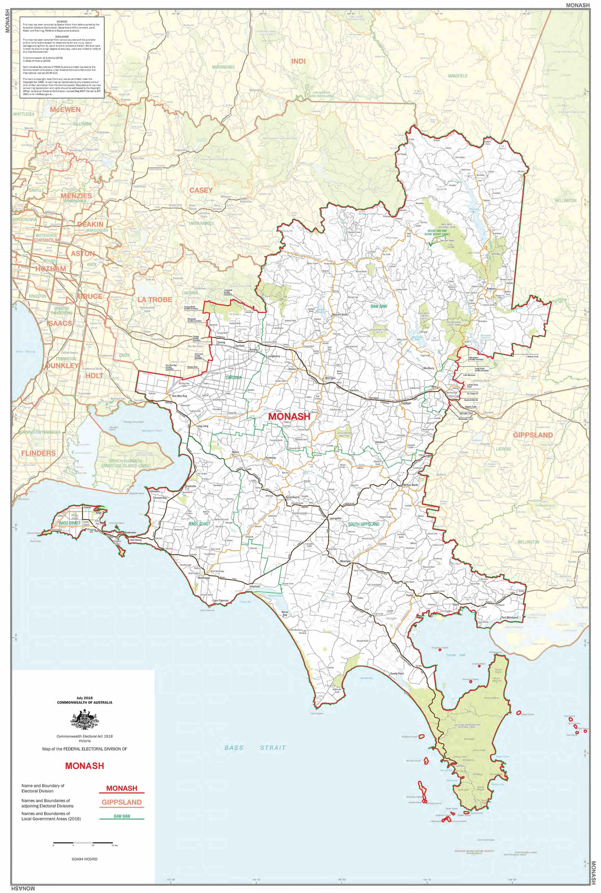
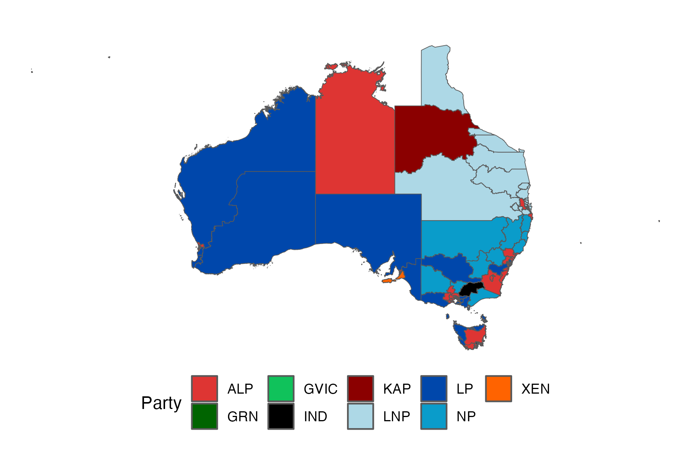
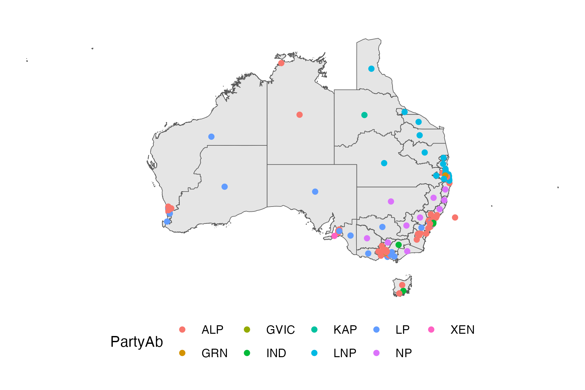
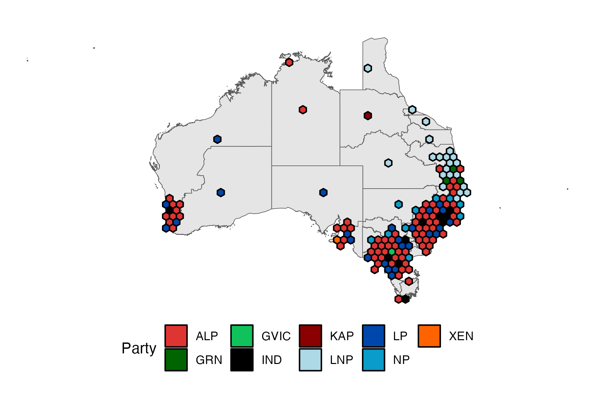
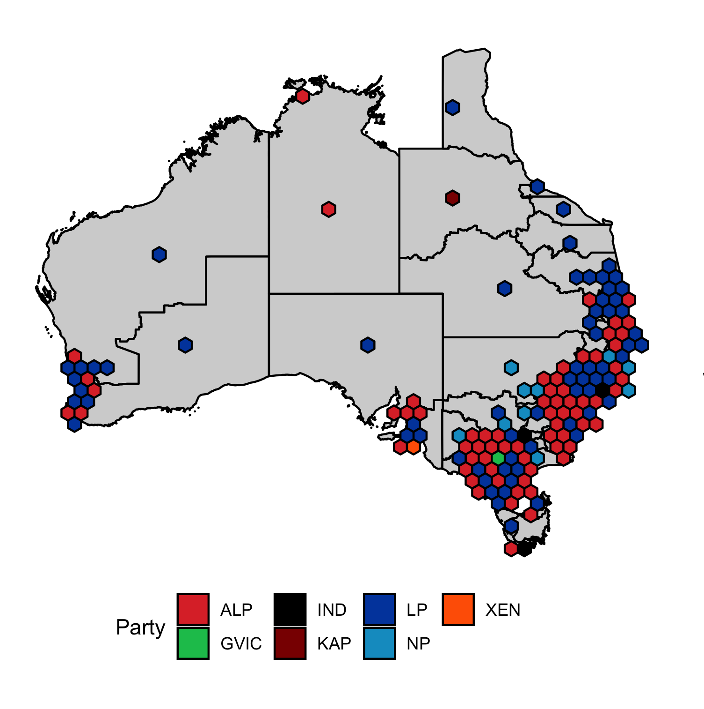

```{r, include = FALSE}
current_file <- knitr::current_input()
basename <- gsub(".Rmd$", "", current_file)

knitr::opts_chunk$set(
  fig.path = sprintf("images/%s/", basename),
  fig.width = 6,
  fig.height = 4,
  fig.align = "center",
  fig.retina = 3,
  echo = TRUE,
  warning = FALSE,
  message = FALSE,
  cache = TRUE,
  cache.path = "cache/"
)

# for speeding up geom_map for dorling map
if (!identical(getOption("bitmapType"), "cairo") && isTRUE(capabilities()[["cairo"]])) {
  options(bitmapType = "cairo")
}
```

```{r titleslide, child="assets/titleslide.Rmd"}
```


---

# Australian election data 

.w-70[

* Much like the census, .monash-blue[**election**] attempts to collect the data from the population.

{{content}}

]

--

* In Australia, it is compulsory by law to vote in elections if you are an Australian citizen <span class="f6">(or eligible British subject)</span> aged 18 years old or over and have lived in your address for at least one month.
{{content}}
--

* The Australian Electoral Commission (AEC) is an independent federal agency in charge of federal Australian elections and provides the geographical boundaries of the electoral divisions.
{{content}}

--

<div class="question-box">
<ol>
<li>When was the last federal election in Australia?</li>
<li>How often is the federal election conducted in Australia? </li>
<li>How many electoral divisions are there in the last federal election?</li>
<li>What is the population for the Australian federal election?</li>
</div>


---

class: center middle bg-gray

.aim-box.w-70.tl[
Today you will:

- Learn about Australian election data 
- Look at the 2022 election results
- Learn to visualise the election results spatially in a few ways
- Learn about reprojecting geographic data into different coordinate reference systems

]

--

.aim-box.w-70.tl[
From a coding perspecting:

- This will require learning about **mapping in R**.  
- You will also need to learn about different **mapping projections**

]


---

# 2022 Australian Federal Election

.flex.h-100[
.w-55[
* Parliament of Australia comprises two houses: 
  * **Senate** (upper house) comprising 76 senators
  * **House of Representatives** (lower house) comprising 151 members
* Government is formed by the party or coalition with majority of the seats in the lower house
* The 2022 Australian Federal Election was held on Sat 21st May 2022
* The next federal election will be likely be held in 2025


]
.w-45.monash-bg-gray10[

* Major parties in Australia:
  * Coalition:
      *  Liberal
      *  National 
  * Labor 
* Some minor parties in Australia:
  *  The Greens
  *  One Nation


]]

---

# Ballots

* **House of Representatives** uses the instant-runoff voting system
* Senate uses the single transferable voting system

<center>
.white[Senate]
</center>


---

# 2022 Australian Federal Election Data

* Get the distribution of preferences by candidate by division for the 2022 Australian Federal Election

.f2.center[
<i class="fas fa-download"></i> https://results.aec.gov.au
] 
<br>

.center[
.info-box.w-60.tl[

1. 2022 federal election
1. Downloads
1. Distribution of preferences by candidate by division

]]

* Or refer directly to the link:

.center[
https://results.aec.gov.au/27966/Website/Downloads/HouseDopByDivisionDownload-27966.csv

]

---

# House of Representative Voting Data

.f4[
```{r votes, message = FALSE, warning = FALSE}
library(tidyverse)
votes <- read_csv("https://results.aec.gov.au/27966/Website/Downloads/HouseDopByDivisionDownload-27966.csv", skip = 1)
glimpse(votes)
```
]


---

# Electoral district of .monash-blue[Monash]

* Let's have a look at the electoral district named "Monash"

.f4[

```{r echo = FALSE}
votes_monash = votes |> 
  filter(DivisionNm == "Monash")
glimpse(votes_monash)
```

]

<!-- .f4.overflow-scroll.h-80[ -->
```{r votes-table-view}
# votes %>%
#   filter(DivisionNm == "Monash") %>%
#   DT::datatable(width = 1160, height = 400, options = list(pageLength = 400))
```
<!-- ] -->


---


# District: Monash

.f4[

```{r votes-monash}
votes_monash <- votes %>%
  # get the preference count only
  filter(CalculationType == "Preference Count") %>%
  # get the Monash division
  filter(DivisionNm == "Monash")
glimpse(votes_monash)
```

]

```{r vote-monash-table, echo = FALSE}
# DT::datatable(votes_monash,
#   rownames = TRUE,
#   height = 300,
#   width = 900,
#   options = list(
#     lengthChange = FALSE, dom = "t",
#     pageLength = nrow(votes_monash),
#     scrollX = "100px", scrollY = "300px"
#   )
# )
```


---

# Visualising the counts

```{r vote-counts, fig.width = 12, fig.height = 4.5}
ggplot(votes_monash) +
  geom_col(aes(x = CalculationValue, y = Surname)) +
  geom_text(aes(label = paste("Count", CountNumber)),
    x = 10000, y = 3, size = 16, color = "#ee64a4",
    alpha = 0.4, hjust = "left"
  ) +
  facet_wrap(~CountNumber)
```

---

# ... but better to order candidates by counts 

```{r vote-counts-better, fig.width = 12, fig.height = 4.5}
mutate(votes_monash, Surname = fct_reorder(Surname, CalculationValue, sum)) %>% #<<
  ggplot() +
  geom_col(aes(x = CalculationValue, y = Surname)) +
  geom_text(aes(label = paste("Count", CountNumber + 1)),
    x = 10000, y = 3, size = 16, color = "#ee64a4", alpha = 0.4, hjust = "left"
  ) +
  facet_wrap(~CountNumber)
```

--

<div style="position:absolute;right:20px;bottom:20px">
<b>Winner</b>: <br>Russel<br> Broadbent<br>

</div>

---

# Where is the electoral district of .monash-blue[Monash]?

--

* ...*doesn't* include Monash Clayton campus

<center class="overflow-scroll h-80">

</center>

---

# Electoral district of .monash-blue[Hotham]

* *Does* include Monash Clayton campus

<center>

</center>

---

# Australian Electorates Divsions

There are 151 electorates in 2019.

.flex[
.w-60.center[

]
.w-40[

.info-box[
The **geographical boundaries of the electoral divisions** are determined by the [Redistribution Committee](https://www.aec.gov.au/footer/glossary.htm#redist-comm) and are [redrawn](https://www.aec.gov.au/Electorates/Redistributions/future.htm) every so often to ensure similar number of electors in each electoral division for a given state or territory.
]

{{content}}
]


]

--

<div class="warn-box">
This means that the geographical boundaries could be different across years.
</div>


---


# Federal electoral boundary GIS data

* GIS (Geographic Information System) is a framework that capture and inspect geographical data.
--

* This data is found at 

.center.f2[
<i class="fas fa-download"></i> https://www.aec.gov.au/electorates/gis/licence.htm
]
--


* Agree to the license to get to the download page
.blockquote[
The Licensee must make End-users aware the data was sourced from the Australian Electoral Commission and is used under licence.
]
.center[
Note: the federal electoral boundary is provided by Australian Electoral Commission

© Commonwealth of Australia (Australian Electoral Commission) 2021
]
--

* We download the ESRI zip file for Victoria.
--

* To work with spatial data, we use the `sf` R-package.

---

# Working with spatial data

.overflow-scroll.h-80[
```{r aec-map}
library(sf)
aec_map <- read_sf(here::here("data/vic-july-2021-esri/E_VIC21_region.shp"))
# aec_map
```
]

---

# Geometry object and visualisation in as `ggplot`


```{r aec-geometry, message = TRUE}
aec_map$geometry[[1]]
```
--


```{r plain-aec-map}
ggplot(aec_map) +
  geom_sf()
```


---

# Integrating data of election winners

.f5[
```{r winner-map}
winners <- votes %>%
  # get the winner
  filter(Elected == "Y" & CountNumber == 0 & CalculationType == "Preference Count") %>%
  # join the data
  right_join(aec_map, by = c("DivisionNm" = "Elect_div")) %>%
  select(DivisionNm, PartyAb, PartyNm, geometry)

ggplot(winners) +
  geom_sf(aes(fill = PartyAb, geometry = geometry))
```
]

--

.center[
Is there something wrong here?
]

---

# Investigating missing observation

.f5[
```{r}
winners %>%
  filter(is.na(PartyAb))
```
--

```{r}
votes %>%
  # approximate string matching (or fuzzy matching)
  filter(agrepl("Mcewen", DivisionNm))
```
]

--

.absolute.bottom-3.right-2.bg-white.ba.pa3[
So what went wrong here?
]

---

# Victoria map of election winners

.f4[
```{r winner-map-fix}
winners_fix <- votes %>%
  mutate(DivisionNm = ifelse(DivisionNm == "McEwen", "Mcewen", DivisionNm)) %>%
  # get the winner
  filter(Elected == "Y" & CountNumber == 0 & CalculationType == "Preference Count") %>%
  # join the data
  right_join(aec_map, by = c("DivisionNm" = "Elect_div")) %>%
  select(DivisionNm, PartyAb, PartyNm, geometry)

ggplot(winners_fix) +
  geom_sf(aes(fill = PartyAb, geometry = geometry))
```
]

---

class: transition 

# Maps visualisation

---

# National map of election winners

.f4[
```{r eval = FALSE}
ausmap <- read_sf(here::here("data/2021-Cwlth_electoral_boundaries_ESRI/2021_ELB_region.shp"))

all_winners <- votes %>%
  mutate(DivisionNm = case_when(
    DivisionNm == "McEwen" ~ "Mcewen",
    DivisionNm == "McPherson" ~ "Mcpherson",
    DivisionNm == "Eden-Monaro " ~ "Eden-monaro",
    DivisionNm == "McMahon" ~ "Mcmahon",
    DivisionNm == "O'Connor" ~ "O'connor",
    TRUE ~ DivisionNm
  )) %>%
  # Another way to select the winner
  filter(Elected == "Y") %>%
  group_by(DivisionID) %>%
  slice(1) %>%
  ungroup() %>%
  # then join the map data
  right_join(ausmap, by = c("DivisionNm" = "Elect_div"))
```
]

---

# Code fix for previous slide to remove NAs on map

.f4[
```{r}
ausmap <- read_sf(here::here("data/2021-Cwlth_electoral_boundaries_ESRI/2021_ELB_region.shp"))

# Wrangle vote data: Want the winner for each electoral division 
electoral_winners = votes |> 
  # Make everything capitals to fix mismatches 
  mutate(DivisionNm = toupper(DivisionNm)) |>
  # Filter to winners
  filter(Elected == "Y") |> 
  # Select only the key variables we need for plotting
  select(PartyAb, DivisionID, DivisionNm, Elected) |>
  # We get a copy of the winner for each count, only need one
  distinct()

# Wrangle map data
ausmap = ausmap |> 
  # Make everything capitals to fix mismatches 
  mutate(Elect_div = toupper(Elect_div))

#Combine map data and electoral winners
all_winners = electoral_winners |> 
  left_join(ausmap, by = c("DivisionNm" = "Elect_div"))
```
]

---


# Using colors wisely

.f5[
```{r electoral_map_wins}
auscolours <- c(
  "ALP" = "#DE3533", "LNP" = "#ADD8E6", "KAP" = "#8B0000",
  "GVIC" = "#10C25B", "XEN" = "#ff6300", "LP" = "#0047AB",
  "NP" = "#0a9cca", "IND" = "#000000", "GRN" = "#006400"
)
# update this from lecture to include Greens

aus_winners_chloropleth_map <- ggplot(all_winners) +
  geom_sf(aes(fill = PartyAb, geometry = st_zm(geometry))) +
  scale_fill_manual(name = "Party", values = auscolours) +
  theme_void() +
  theme(legend.position = "bottom")

ggsave(aus_winners_chloropleth_map, 
       file = "images/aus_winners_chloropleth_map.png")

# aus_winners_chloropleth_map
```
]

<center>

</center>

---

# .monash-blue[Choropleth Map]

Which party won from looking at this map and by how much?

```{r echo = FALSE, eval = TRUE, out.width="65%"}
# aus_winners_chloropleth_map
```

<center>

</center>

--

```{r echo = FALSE, eval = TRUE}
num_seats_won = all_winners %>% select(PartyAb) %>% group_by(PartyAb) %>% tally()

coalition_seats = num_seats_won |> filter(PartyAb %in% c("LNP", "LP", "NP")) |> pull(n) |> sum()
lab_seats = num_seats_won |> filter(PartyAb == "ALP") |> pull(n) |> sum()
greens_seats = num_seats_won |> filter(PartyAb %in% c("GRN", "GVIC")) |> pull(n) |> sum()
kap_seats = num_seats_won |> filter(PartyAb == "KAP") |> pull(n) |> sum()
xen_seats = num_seats_won |> filter(PartyAb == "XEN") |> pull(n) |> sum()
ind_seats = num_seats_won |> filter(PartyAb == "IND") |> pull(n) |> sum()
```


<div class="border-box bg-white" style="position:absolute;top:20%;right:10px;width:320px;padding:5px;font-size:18pt;">
<span class="blue">Liberal/National Coalition: 
<b>
`r coalition_seats`
</b></span><br>
<span class="red">Labor: 
<b>`r lab_seats`
</b></span><br>
<span class="green">Greens: 
<b>`r greens_seats`
</b></span><br>
Katter's Australian: <b>`r kap_seats`</b><br>
Centre Alliance: <b>`r xen_seats`</b><br>
Independents: <b>`r ind_seats`</b>
</div>

---

# Mapping the centroids

.f4[
```{r dorling-map}
all_winners_centroid <- all_winners %>%
  # some issues with a duplicate edge
  # slice(-79,-80) |> # for original code
  slice(-93, -94) |>  # for update post lecture
  mutate(centroid = st_centroid(geometry))

aus_winners_centroid_map <- ggplot(all_winners_centroid) +
  geom_sf(aes(geometry = st_zm(geometry))) +
  geom_sf(aes(geometry = centroid, color = PartyAb)) +
  theme_void() +
  theme(legend.position = "bottom")

ggsave(aus_winners_centroid_map, 
       file = "images/aus_winners_centroid_map.png")

# aus_winners_centroid_map
```
]

<center>

</center>

---

# .monash-blue[Non-Contiguous, Dorling Cartogram]

<center>

</center>

```{r echo = FALSE, eval = TRUE, out.width="65%"}
# aus_winners_centroid_map
```


---

# Improving the national map of election winners

.f4.oveflow.overflow-scroll.h-90[
```{r sugarbag-map, eval = TRUE}
library(sugarbag)

centroids <- all_winners_centroid %>%
  bind_cols(sf::st_coordinates(all_winners_centroid$centroid)) %>%
  select(DivisionNm, longitude = X, latitude = Y)

grid <- create_grid(centroids = centroids, hex_size = 0.9, buffer_dist = 5)

hex_allocated <- allocate(
  centroids = centroids,
  sf_id = "DivisionNm",
  hex_grid = grid,
  hex_size = 0.9, # same size used in create_grid
  hex_filter = 10,
  focal_points = capital_cities,
  width = 30, verbose = TRUE
) 

hex_map <- hex_allocated %>%
  fortify_hexagon(hex_size = 0.9, sf_id = "DivisionNm") |>
  left_join(all_winners_centroid, by = "DivisionNm") 

aus_winners_hex_map <- ggplot(hex_map) +
  geom_sf(data = all_winners, aes(geometry = geometry)) +
  geom_polygon(aes(long, lat, fill = PartyAb, group = DivisionNm), color = "black") +
  scale_fill_manual(name = "Party", values = auscolours) +
  theme_void() +
  theme(legend.position = "bottom")

ggsave(aus_winners_hex_map, 
       file = "images/aus_winners_hex_map.png")

# aus_winners_hex_map

```
]

<center>

</center>


---

# .monash-blue[Tessellated Hexagon Map] 

<center>

</center>

```{r echo = FALSE, eval = TRUE, out.width="65%"}
# aus_winners_hex_map
```

<!-- <center> -->
<!--  -->
<!-- </center> -->

.bottom_abs.font_small.width100[
Kobakian, Stephanie (2020) New Algorithms For Effectively Visualising Australian Spatio-Temporal Disease Data. <br>Supervised by Dianne Cook. *Master of Philosophy (Statistics), Queensland University of Technology*.
]

---

class: transition 

# Coordinate reference system (CRS)


---

# Geographic coordinate reference systems

* **Geographic CRSs** identify a location on the Earth's surface by *longitude* and *latitude*.
* **Longitude** is the East-West direction in angular distance from the Prime Meridian plane.
* **Latitude** is the angular distance North or South of the equatorial plane.

<center>

</center>

---

# Projected coordinate reference systems

.flex[
.w-50[
* All projected CRSs are based on a geographic CRS.
* Map projections convert the three-dimensional surface of the Earth into Easting and Northing (x and y) values (typically meters) in a projected CRS. 
* These projected CRSs are based on Cartesian coordinates on a implicitly flat surface.
* Some deformations are introduced in the process, e.g. area, direction, distance or shape, while preserving one or two of these properties. 

]
.w-50[

```{r world-maps, echo = FALSE, fig.height = 3.5}
library(maps)
world1 <- st_as_sf(map("world", plot = FALSE, fill = TRUE))
world2 <- st_transform(
  world1,
  "+proj=laea +y_0=0 +lon_0=155 +lat_0=-90 +ellps=WGS84 +no_defs"
)
pt <- data.frame(x = 0, y = 0) %>%
  st_as_sf(coords = 1:2, crs = st_crs(world1)) %>%
  st_transform(st_crs(world2))

ggplot() +
  geom_sf(data = world2) +
  geom_sf(data = pt, color = "red", size = 3)

ggplot() +
  geom_sf(data = world1) +
  annotate("point",
    x = 0, y = 0, color = "red",
    size = 3
  )
```

]
]


.footnote.f4[
[Lovelace, Robin, Jakub Nowosad and Jannes Muenchow (2019). Geocomputation with R. The R Series. CRC Press.](https://geocompr.robinlovelace.net/spatial-class.html#crs-intro)
]

---

# Well Known Text (WKT)

* Open Geospatial Consortium (OGC) developed an open standard format for describing CRSs called [**WKT**](https://portal.opengeospatial.org/files/18-010r7)

.f4[
.overflow-scroll.h5[
```{r}
st_crs(ausmap)
```
]


```{r ausmap, fig.height = 3}
ggplot(ausmap) +
  geom_sf(aes(fill = Area_SqKm))
```
]

---

# Changing map projections

* Map projections may be modified in multiple methods (it's beyond this unit to delve deep into this).
* Below uses the Lambert azimuthal equal-area projection centered on the longitude and latitude of (rough) Melbourne coordinates via [`proj4string`](https://proj.org/index.html):

```{r ausmap-proj}
ausmap %>%
  st_transform(crs = "+proj=laea +x_0=0 +y_0=0 +lon_0=145 +lat_0=-38") %>%
  ggplot() +
  geom_sf(aes(fill = Area_SqKm))
```


---

class: bg-gray middle center


.idea-box.tl.w-70[

## Summary

* We had a look a the 2022 federal election data
* We looked at visualising this data spatially in various ways 
* We learnt more about mapping in R
* We looked at reprojecting geographic data into different coordinate reference systems

]

---

class: transition

#### Slides developed by Dr. Emi Tanaka and updated by Dr. Kate Saunders

---

```{r endslide, child="assets/endslide.Rmd"}
```


