```{r titleslide, child="components/titleslide.Rmd"}
```

```{r setup, include = FALSE}
options(width = 600)
library(tidyverse)
filter <- dplyr::filter
```


---

class: refresher middle 


# What is wild-caught data?

--

* data can be freely used 
--

* data can be modified 
--

* data can be shared by anyone for any purpose
--

* data source is traceable
--

* data collection is transparent 
--

* data are updated as new measurements arrive
--

* if any data processing, the process is clearly described and reproducible


---

class: refresher middle

# Observational data

<br>

.info-box[
**Population** is the whole set of units (such as people, animal, place etc) to which the question or experiment pertains to.


**Sample** is a subset of population that (hopefully) represents the population.
]

---

class: motivator middle

# Sample or population?

<br>

.info-box[
Vò is a small town in northern Italy with .blue[3,300] inhabitants. All inhabitants of the town were tested and retested for COVID-19. On 6th March, there were .blue[89] infected in Vò. There are .blue[4,636] known cases of infection out of about .blue[60 million] people in Italy on 6th March. As of 31st March, there are no longer new cases of infection in Vò and .blue[101,739] known cases in all of Italy.

]

.bottom_abs.font_small.width100[
Source: https://www.worldometers.info/ and https://www.abc.net.au/news/2020-03-21/one-italian-town-is-bucking-the-countrys-coronavirus-curve/12075048
]

--

* Depends on the question of interest!
--

* We have the population data for Vò but for the whole of Italy, the number of known infection cases would be a sample. 


---


class: motivator middle

# Aim

This week we are interested in extracting and studying the .yellow[**personal income data**] from the 2016 Australian census and the .yellow[**election data**] from the 2019 Australian federal election.

<br>

# You'll learn about .yellow[tidy data].

---

class: transition center middle

# Australian Bureau of Statistics

# Census Data 2016


---

# Australian Bureau of Statistics (ABS) 

* ABS is the independent statistical agency of the Government of Australia. 
* If you are from outside Australia, find the statistical government agency in your country <i class="fas fa-wrench gray"></i>, e.g. in Japan, this is the [Statistics Bureau of Japan](https://www.stat.go.jp/english/).
* ABS provides key statistics on a wide range of economic, population, environmental and social issues, to assist and encourage informed decision making, research and discussion within governments and the community.

<br>


.center[

]

---


# ABS Census Data

.grid[
.item[
* The first Australian census was held in 1911. 
* Since 1961, the census occurs every 5 years in Australia.
* The last census was in 2016 at a *cost of $440 million*.
* The next census will be held in 2021.
* The ABS is legislated to collect and disseminate census data under the ABS Act 1975 and Census and Statistics Act 1905. 
* Similar legislation are in place in many countries. 
]
.item.center[


]]


---


class: transition middle

## Get the ABS 2016 Census Data 

# <i class="fas fa-download"></i>

## https://datapacks.censusdata.abs.gov.au/datapacks/

<br>

```
> 2016 Census Datapacks
> General Community Profile 
> All geographies
> Vic 
```

---

class: center


---

# Wild Data


<br><br><br>

<center>
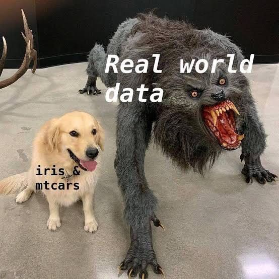
</center>

And if you thought koala was cuddly and cute... [<i class="fab fa-youtube"></i>](https://www.youtube.com/watch?v=J6hLIP06I_8)


---

background-image: url("images/anticipating-pain.gif")
background-size: cover
class: white


Anticipate pain


---

count: false


# Navigating ABS Census data


* First, pray hard that there is some description!

<center>

</center>

--

* Without some description or understanding of the variables, it will be near impossible to extract meaningful information from the data. 

---

# Navigating ABS Census data


```
2016_GCP_ALL_for_Vic_short-header
├── 2016 Census GCP All Geographies for VIC
├── Metadata
└── Readme
```

* Readme is a good place to start here (phew!)

<blockquote>
"About DataPacks_readme.md - "Read Me" documentation containing helpful information for users about the data and how it is structured (.md)"
</blockquote>

* *But there is no `DataPacks_readme.md`??*

---

# Navigating ABS Census data


```
2016_GCP_ALL_for_Vic_short-header/Readme
├── 2016POA_readme.txt
├── AboutDatapacks_readme.txt
├── CreativeCommons_Licensing_readme.txt
├── Formats_readme.txt
├── Summary_of_Changes.txt
├── esri_arcmap_readme.txt
└── mapinfo_readme.txt
```

* There is no `DataPacks_readme.md` but there is .monash-blue[`AboutDatapacks_readme.txt`].
* But it's not helpful in locating the income data...
* We can try going through other files in the Readme.


---

# Navigating ABS Census data


We could also try going through the meta-data.

```
2016_GCP_ALL_for_Vic_short-header/Metadata
├── 2016Census_geog_desc_1st_2nd_3rd_release.xlsx
├── 2016_GCP_Sequential_Template.xlsx
└── Metadata_2016_GCP_DataPack.xlsx
```

--

.monash-blue[`Metadata_2016_GCP_DataPack.xlsx`]

<br>

```{r, echo = F}
DT::datatable(tibble::tibble(`Table number` = c("G17", "G28", "G29", "..."), `Table name` = c("Total Personal Income (Weekly) by Age by Sex", "Total Family Income (Weekly) by Family Composition", "Total Household Income (Weekly) by Household Composition", "..."), `Table population` = c("Persons aged 15 years and over ", "Families in family households", "Occupied private dwellings", "...")),
              height = 200,
              rownames = FALSE,
              options = list(lengthChange = FALSE, dom = "t", scrollY = "100px"))

```

---

class: font_smaller

# Navigating ABS Census data

Where is Table G17?

```
2016_GCP_ALL_for_Vic_short-header/2016 Census GCP All Geographies for VIC/
├── CED
├── GCCSA
├── LGA
├── POA
├── RA
├── SA1
├── SA2
├── SA3
├── SA4
├── SED
├── SOS
├── SOSR
├── SSC
├── STE
├── SUA
└── UCL
```

---

# Navigating ABS Census data

Back to metadata

```
2016_GCP_ALL_for_Vic_short-header/Metadata
├── 2016Census_geog_desc_1st_2nd_3rd_release.xlsx
├── 2016_GCP_Sequential_Template.xlsx
└── Metadata_2016_GCP_DataPack.xlsx
```

Let's open

.monash-blue[`2016Census_geog_desc_1st_2nd_3rd_release.xlsx`]

--

... and there are the region names of each geographical code.

--

<br>

Let's go with the easy one: .monash-blue[`STE` Victoria].


---

class: font_small

# Navigating ABS Census data

```
STE/VIC/
├── ...
├── 2016Census_G17A_VIC_STE.csv
├── 2016Census_G17B_VIC_STE.csv
├── 2016Census_G17C_VIC_STE.csv
├── 2016Census_G18_VIC_STE.csv
├── ...
```

* G17A, G17B, G17C?

<br>
.center[
.box[Why is the table organised like this?]
]

<br>

* Examine the files `2016Census_G17A_VIC_STE.csv`, `2016Census_G17B_VIC_STE.csv` and `2016Census_G17C_VIC_STE.csv` <i class="fas fa-wrench gray"></i>

---

# Tables G17A-G17C

```{r, echo = F}
dfA <- read.csv("../data/2016_GCP_ALL_for_Vic_short-header/2016 Census GCP All Geographies for VIC/STE/VIC/2016Census_G17A_VIC_STE.csv")
dfB <- read.csv("../data/2016_GCP_ALL_for_Vic_short-header/2016 Census GCP All Geographies for VIC/STE/VIC/2016Census_G17B_VIC_STE.csv")
dfC <- read.csv("../data/2016_GCP_ALL_for_Vic_short-header/2016 Census GCP All Geographies for VIC/STE/VIC/2016Census_G17C_VIC_STE.csv")
```

##  .monash-gray80[2016Census_G17]A.monash-gray80[_VIC_STE.csv]

```{r, echo = F}
DT::datatable(dfA,
              rownames = FALSE, 
              options = list(lengthChange = FALSE, dom = "t",
                             pageLength = nrow(dfA),
                             scrollX = "100px"))
```

<br>

##  .monash-gray80[2016Census_G17]B.monash-gray80[_VIC_STE.csv]

```{r, echo = F}
DT::datatable(dfB,
              rownames = FALSE,
              options = list(lengthChange = FALSE, dom = "t",
                             scrollX = "100px"))
```

<br>

## .monash-gray80[2016Census_G17]C.monash-gray80[_VIC_STE.csv]

```{r, echo = F}
DT::datatable(dfC,
              rownames = FALSE,
              options = list(lengthChange = FALSE, dom = "t",
                             scrollX = "100px"))
```

---

# Table G17

There are few things to note:

* There are 201 columns in G17A and G17B and 81 columns in G17C. 
* Perhaps there is an export limitation for a data that contains more than 200 columns, thus it is broken up into different csv files.
* Which means that you have to join the tables G17A, G17B and G17C as one (you'll do this in the tutorial <i class="fas fa-wrench gray"></i>).

<br>

.center[
.box[But what does the data show?]
]


---

# What is Tidy Data?

<br>

.info-box[

## Tidy Data Principles

1. Each variable must have its own column
2. Each observation must have its own row
3. Each value must have its own cell
]

So what about the ABS 2016 Census Data?

* The table header in fact contains information!
* E.g. .monash-blue2[`F_400_499_15_19_yrs`] is female aged 15-19 years old who earn $400-499 per week (in Victoria).
* The number in the cells are the **counts**.
* Is the data tidy?


.bottom_abs.width100.font_small[
Wickham (2014) Tidy Data. *Journal of Statistical Software* **59**
]

---

# Tidying the ABS 2016 Census Data

* Ideally we want the data to look like:

<br>

```{r, echo = FALSE}
DT::datatable(tibble::tibble(age_min = 15, age_max = 19, gender = "female", 
                             income_min = 400, income_max = 499, count = 4020),
              rownames = FALSE, 
              options = list(lengthChange = FALSE, dom = "t"))
```

* You can include other information, e.g. geography code (useful if combining with other geographical area) or average age/income.

* Note that some don't have upper bounds, e.g. .monash-blue[`M_3000_more_85ov`]. In R, `-Inf` and `Inf` are used to represent $-\infty$ and $\infty$, respectively.

* You'll wrangle the data into the tidy form in tutorial  <i class="fas fa-wrench gray"></i>

---

# Raw Data vs. Aggregated Data

* Although the data collected was from individual households surveying each person in the household (see sample form [here](https://www.abs.gov.au/ausstats/abs@.nsf/Lookup/2901.0Main%20Features802016/$FILE/2016%20Census%20Sample%20Household%20Form.pdf)), the downloaded data are .monash-blue[aggregated].
* Aggregated data presents summary statistics from the *raw data*. When the only summary statistics are counts then it is generally called *frequency data*.
* The raw data collected would be similar to the form

```{r, echo = FALSE}
DT::datatable(tibble::tibble(household_id = c(1, 1, 1, 1, 2, 2),
                             person = c("John Smith", "Jane Smith", "David Smith", "Mary Smith", "John Citizen", "Jane Citizen"),
                             gender = c("F", "M", "M", "F", "M", "F"),
                             age = c(40, 39, 10, 8, 32, 33),
                             maritial_status = c("Married", "Married", "Never married", "Never married", "Never married", "Never married"),
                             income_per_week = c("400-499", "300-399", "Nil", "Nil", "400-499", "1750-1999")),
              rownames = FALSE,
              options = list(lengthChange = FALSE, dom = "t"))
```

---

# What you lose in aggregate data

* For aggregate data, there are less scope for you to draw insights conditioned on other variables. 
* E.g. based on frequency data alone, you cannot answer questions like: how many middle income families with 2 children?
* Raw data are desirable if you can get hold of it!
--


## Trust and skepticism


* By the way, did you notice anything odd about the dummy data presented in the last slide?
--


* John Smith was recorded as female and Jane Smith as male. Data may have been incorrectly recorded. 
--


* How much do you trust the aggregate data?
* Have some healthy dose of skepticism in your data.


---

# Data Confidentiality

* The data is not just aggregated, but it is also .monash-blue[anonymised]
* E.g. in .monash-blue[`2016_GCP_Sequential_Template.xlsx`], Sheet "G 17a", footnote says "*Please note that there are **small random adjustments** made to all cell values to protect the confidentiality of data. These adjustments may cause the sum of rows or columns to differ by small amounts from table totals.*"

--


* Why is confidentiality of data important?
--

* 2013 New York City taxi data [<i class="fas fa-taxi"></i>](https://chriswhong.github.io/nyctaxi/):
  * [~20GB of data on over 170 million taxi trips](https://chriswhong.com/open-data/foil_nyc_taxi/) 
  * [anonymised taxi license numbers were easily decoded](https://tech.vijayp.ca/of-taxis-and-rainbows-f6bc289679a1)
  * [the taxi trips were matched with celebrities that have photos taken with the taxi license plate number and reveals how they tip](https://gawker.com/the-public-nyc-taxicab-database-that-accidentally-track-1646724546)


---

class: transition center middle

# Australian Federal Election 2019

---

class: transition middle center

### Get the distribution of preferences by candidate by division for the 2019 Australian Federal Election

# <i class="fas fa-download"></i>

#### https://results.aec.gov.au/

<br>

```
> 2019 federal election
> Downloads
> Distribution of preferences by candidate by division
```

---


# 2019 Australian Federal Election

.grid[
.item[
* Parliament of Australia comprises two houses: 
  * Senate (upper house) comprising 76 senators
  * House of Representatives (lower house) comprising 151 members
* Government is formed by the party or coalition with majority of the seats in the lower house
* The 2019 Australian Federal Election was held on Sat 18th May 2019
* Voting is compulsory if you are an Australian citizen


]
.item.monash-bg-gray10[

.custom-list[

* Major parties in Australia:
  * Coalition:
      *  Liberal
      *  National 
  * Labor 
* Some minor parties in Australia:
  *  The Greens
  *  One Nation
]

]]

---

class: wider 

# Ballots

* House of Representatives uses the instant-runoff voting system
* Senate uses the single transferable voting system

<center>
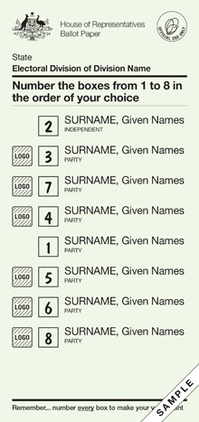.white[Senate]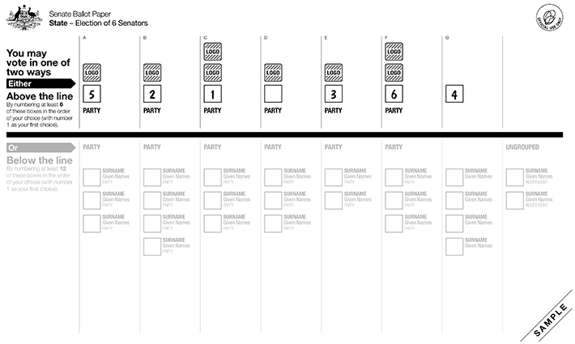
</center>

---

class: font_smaller 

# House of Representative Voting Data

.scroll-800[
```{r, message = FALSE, warning = FALSE}
library(tidyverse)
library(gganimate)
dat <- read_csv("https://results.aec.gov.au/24310/Website/Downloads/HouseDopByDivisionDownload-24310.csv", skip = 1)
glimpse(dat)
```
]

---

# Electoral district of .yellow[Monash]

* ...*doesn't* include Monash Clayton campus

<center>
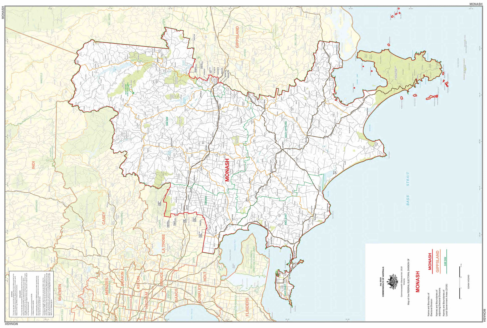
</center>

---

# Electoral district of .yellow[Hotham]

* *Does* include Monash Clayton campus

<center>
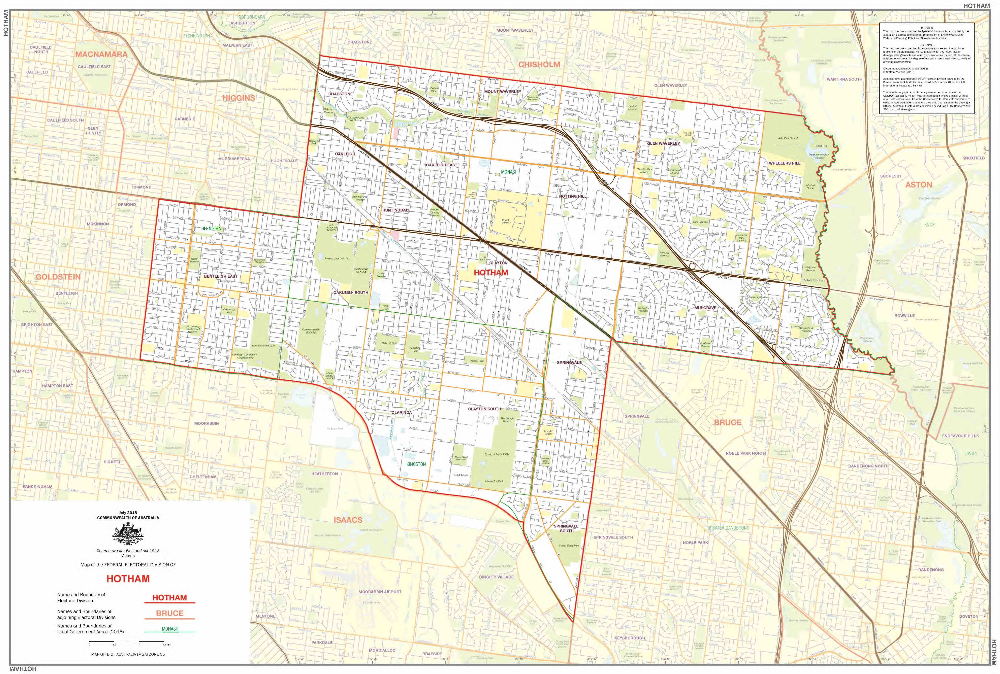
</center>


---

class: font_smaller wider

# District: Monash

```{r}
dat_monash <- dat %>% 
  # get the preference count only
  filter(CalculationType == "Preference Count") %>% 
  # get the Monash division
  filter(DivisionNm == "Monash")
```

```{r, echo = FALSE}
DT::datatable(dat_monash,
              rownames = TRUE,
              height = 300,
              width = 1000,
              options = list(lengthChange = FALSE, dom = "t",
                             pageLength = nrow(dat_monash),
                             scrollX = "100px", scrollY = "300px"))

```


---

class: font_smaller

# Visualising the counts

```{r, fig.width = 12, fig.height = 5}
dat_monash %>% 
  ggplot() + 
  geom_col(aes(x = CalculationValue, y = Surname)) +
  geom_text(aes(label = paste("Count", CountNumber)), 
            x = 10000, y = 3, size = 16, color = "#ee64a4", alpha = 0.4, hjust = "left") +
  facet_wrap(~CountNumber)
```

---

class: font_smaller

# ... but better to order candidates by counts 

```{r, fig.width = 12, fig.height = 5}
dat_monash %>% 
  mutate(Surname = fct_reorder(Surname, CalculationValue)) %>% #<<
  ggplot() + 
  geom_col(aes(x = CalculationValue, y = Surname)) +
  geom_text(aes(label = paste("Count", CountNumber + 1)), 
            x = 10000, y = 3, size = 16, color = "#ee64a4", alpha = 0.4, hjust = "left") +
  facet_wrap(~CountNumber)
```

--

<div style="position:absolute;right:20px;bottom:20px">
<b>Winner</b>: <br>Russel<br> Broadbent<br>

</div>


---

class: font_smaller

# House of Representative Voting Animation

```{r, echo = FALSE}
divisionNms <- c("Monash", "Hotham", "Melbourne", "Menzies", "La Trobe")
divisionNms_clean <- gsub(" ", "-", tolower(divisionNms))
anim_imgs <- here::here("slides", "images", paste0("anim-vote-", divisionNms_clean, ".gif"))
slickR::slickR(obj = anim_imgs, height = 570, width = "95%")
```


---

class: transition center middle

# Combining Australian Election and Census Data 


---

class: font_smaller


# `eechidna`

* `eechidna` (**E**xploring **E**lection and **C**ensus **H**ighly **I**nformative **D**ata **N**ationally for **A**ustralia) provides data from the Australian Federal elections from 2001-2019 and census information from 2001-2016.
* It also includes the map data! Read more about getting the shape files [here](https://docs.ropensci.org/eechidna/articles/getting-ozShapefiles.html).

```{r, eval = F}
library(eechidna)
nat_map19 <- nat_map_download(2019) 
ggplot(data=nat_map19) + 
  geom_polygon(aes(x = long, y = lat, group = group),
               color = "black") +
  theme_void() + 
  coord_equal() + 
  theme(legend.position="bottom")
```

--

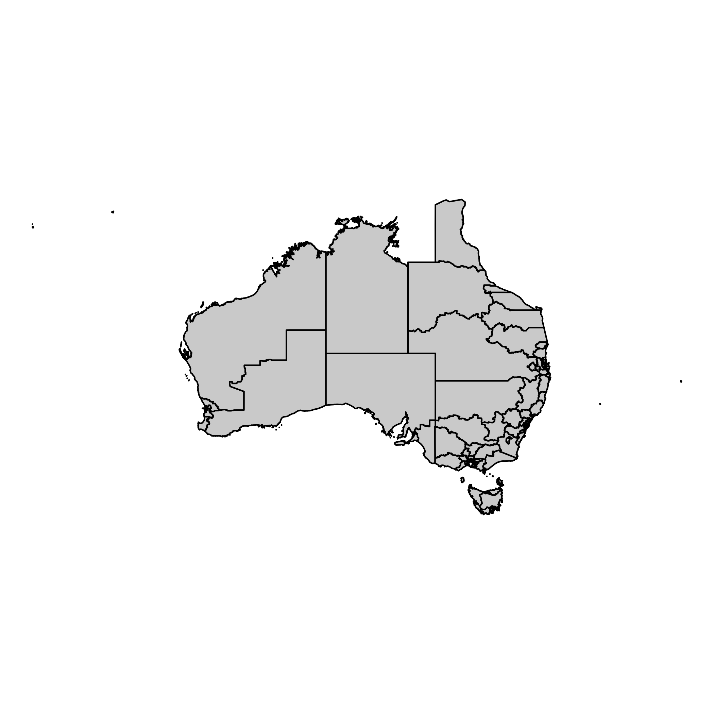

---

# Australian Electorates Divsions

There are 151 electorates in 2019.

<center>
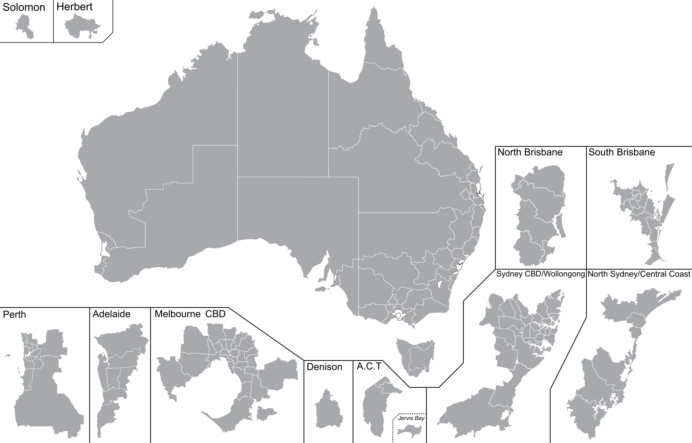
</center>

---

class: font_small wider


# Drawing .yellow[Chloropleth Map] with R

```{r, eval = F}
auscolours <- c("ALP" = "#DE3533", "LNP" = "#ADD8E6", "KAP" = "#8B0000", 
                "GVIC" = "#10C25B", "XEN" = "#ff6300", "LP" = "#0047AB", 
                "NP" = "#0a9cca", "IND" = "#000000")
map_winners <- fp19 %>% 
  mutate(elect_div = toupper(DivisionNm)) %>% 
  filter(Elected == "Y") %>% 
  select(elect_div, PartyAb, PartyNm) %>% 
  left_join(nat_map19, by = "elect_div")

ggplot(data = map_winners) + 
  geom_polygon(aes(x = long, y = lat, group = group, fill = PartyAb),
               color = "black") +
  scale_fill_manual(name = "Party", values = auscolours) +
  theme_void() + 
  coord_equal() + 
  theme(legend.position="bottom") 
```

--


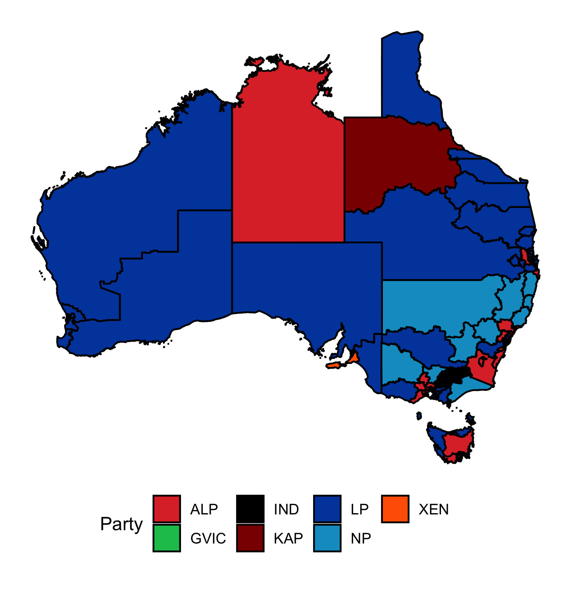


---

# Choropleth Map

Which party won from looking at this map and by how much?

<center>

</center>

--

<div class="border-box bg-white" style="position:absolute;top:20%;right:10px;width:320px;padding:5px;font-size:18pt;">
<span class="blue">Liberal/National Coalition: <b>77</b></span><br>
<span class="red">Labor: <b>68</b></span><br>
Greens: <b>1</b><br>
Katter's Australian: <b>1</b><br>
Centre Alliance: <b>1</b><br>
Independents: <b>3</b>
</div>


---

# Non-Contiguous, Dorling Cartogram


<center>
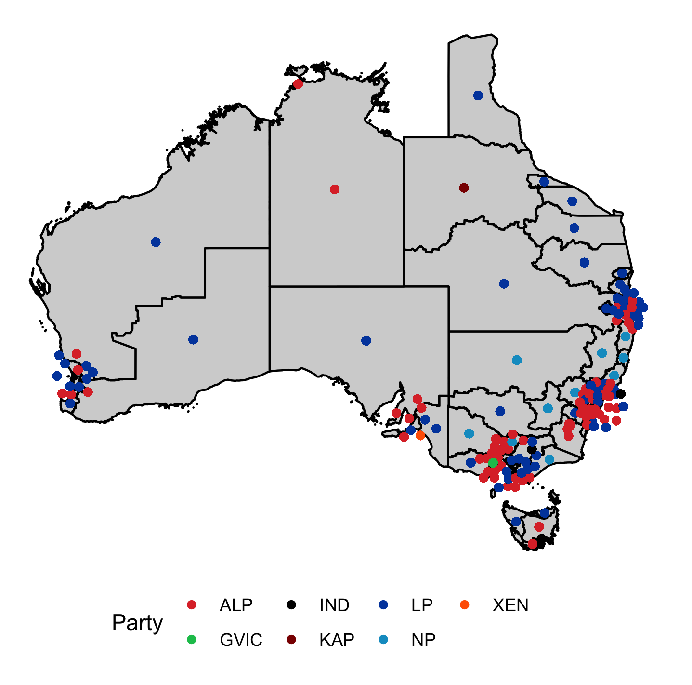
</center>

---

# Tessellated Hexagon Map 


<center>
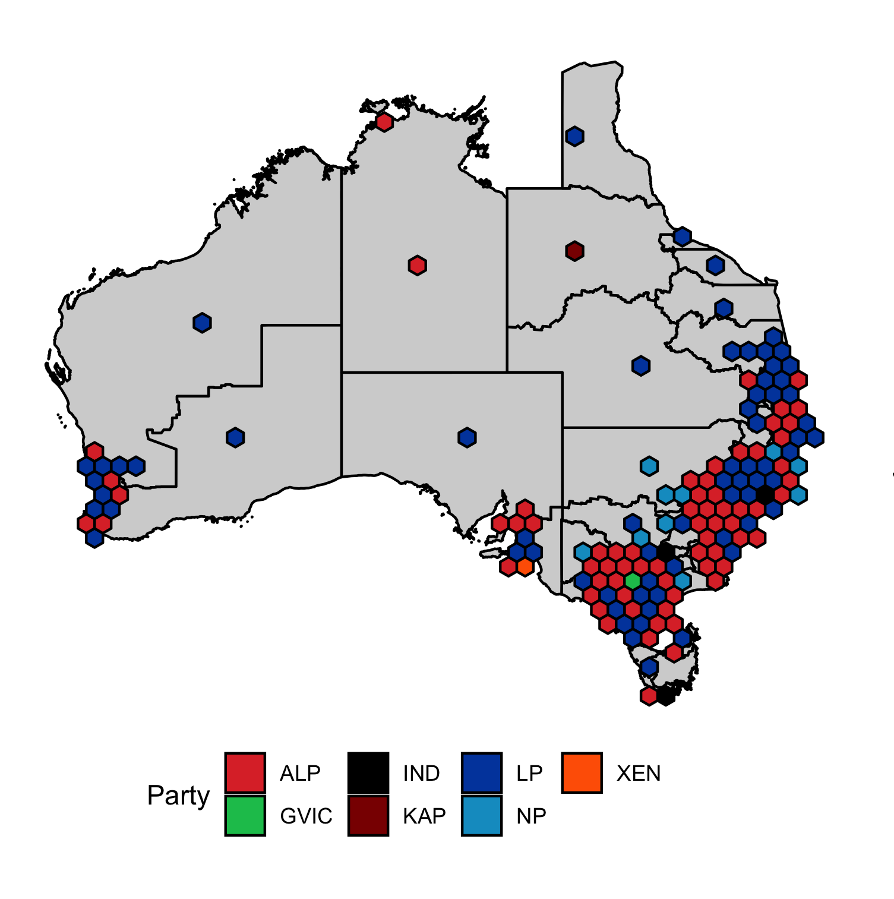
</center>

.bottom_abs.font_small.width100[
Kobakian, Stephanie (2020) New Algorithms For Effectively Visualising Australian Spatio-Temporal Disease Data. <br>Supervised by Dianne Cook. *Master of Philosophy (Statistics), Queensland University of Technology*.
]

---

count: false

# Electorate Map

Electorates that contain the Monash campuses
<br><br>

<center>
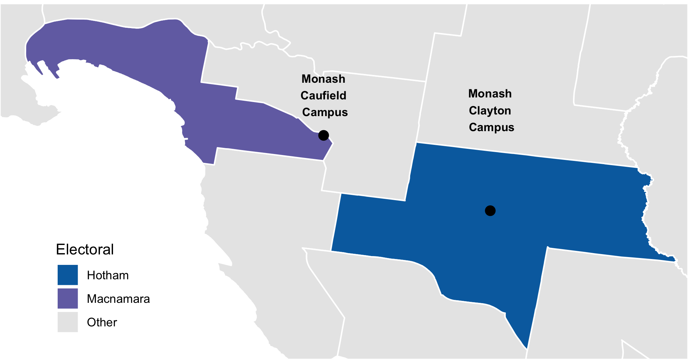
</center>

---

count: false

# Electorate Map 

Now superimposed with the centroids of the Statistical Area 1 (SA1) from 2016 Census

<center>
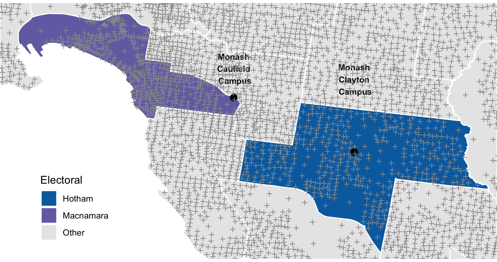
</center>

---

# Electorate Map 

Electorates that contain Monash campuses and the SA1 centroids from 2016 Census within it 

<center>
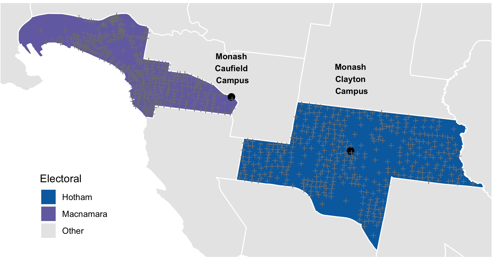
</center>


---

count: false

# Spatial distribution of age group 

<center>

</center>


---

# Spatial distribution of age group 


<center>
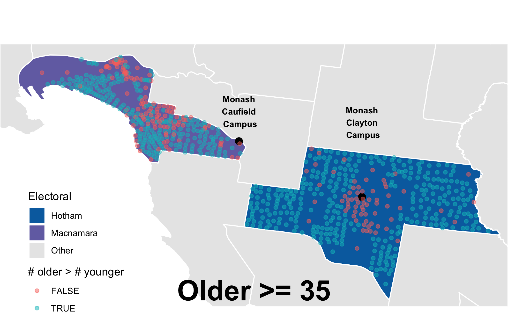
</center>

There is a clear cluster of younger people (< 35 years old) centered around Monash Clayton campus.

---

# References

* To install `eechinda` R-packages use 

```{r, eval = F}
devtools::install_github("emitanaka/eechidna")
```
Normally you should replace `emitanaka` with `ropenscilabs`, but current forked repo `@emitanaka` contains some (untested) bug fixes. 

* Check out the [vignettes](https://docs.ropensci.org/eechidna/) for `eechidna` for more details.
* Also check out the paper by [Forbes, Cook & Hyndman (2020) Spatial modelling of the two-party preferred vote in Australian federal elections: 2001–2016. *Australian & New Zealand Journal of Statisitcs* (to appear). ](https://www.monash.edu/business/ebs/research/publications/ebs/wp08-2019.pdf).
* The RStudio Cloud Project containing the code for the maps and animations can be found [here](https://rstudio.cloud/project/1223528). 

---

```{r endslide, child="components/endslide.Rmd"}
```
