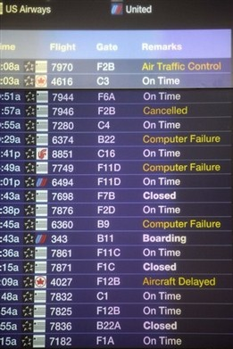
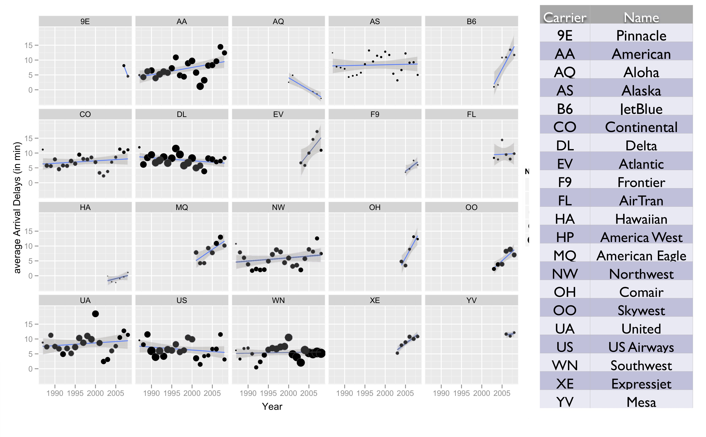
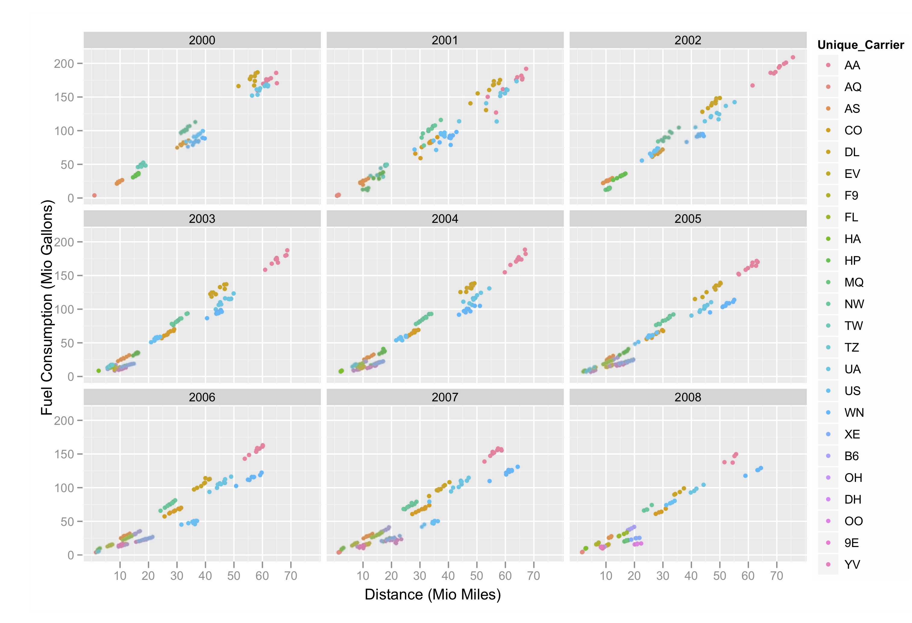
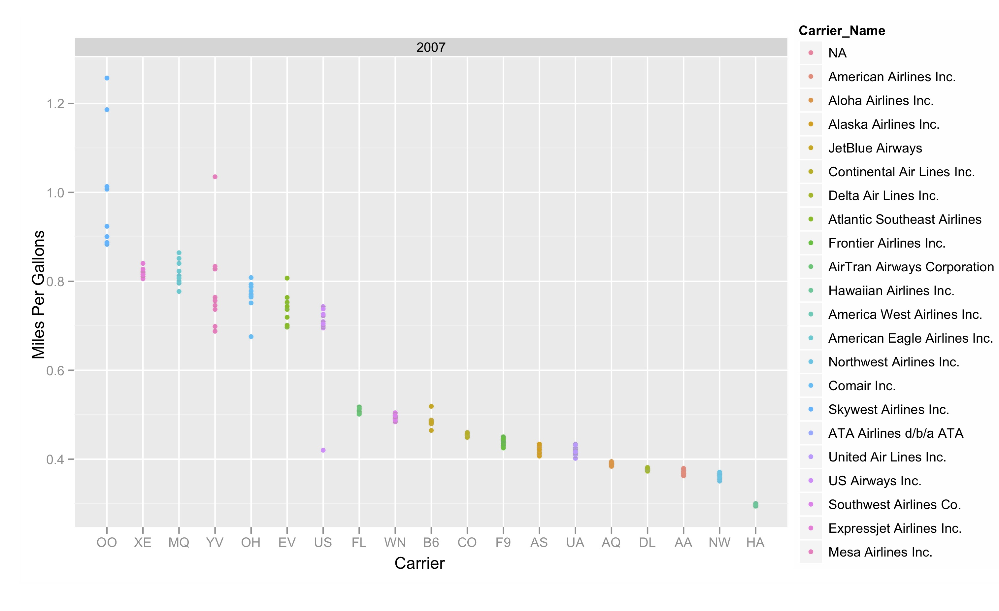
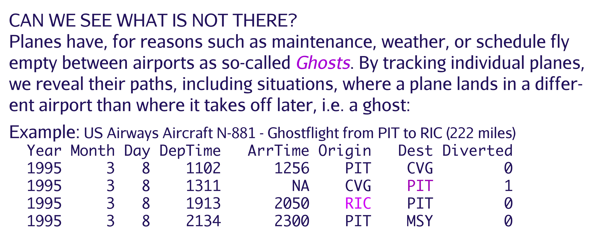

```{r titleslide, child="components/titleslide.Rmd"}
```

---
# Reading

- Learn about accessing databases in R: https://db.rstudio.com/databases/sqlite/

---

.grid[
.item[


]
.item[
# Motivation


[2009 data expo](https://community.amstat.org/jointscsg-section/dataexpo/new-item6)
]
]

---
# Data source

.grid[
.item[


Airline On-Time Performance Data from the United States Department of Transportation, Bureau of Transportation Statistics. 

Data is available from https://www.transtats.bts.gov/DataIndex.asp

]
.item[



]
]
---
# Accessing the data

- Data expo files
- Navigating the BTS web interface
    - Data available
    - Download
- R package NYCflight13

---
# What's in the data?

---
# Analysis overview

- Traffic patterns over time 
- Delays
- Ghost flights
- Mapping traffic

---
# Traffic patterns over time


Number of flights in millions per year: steadily increasing volume until 2001, with a big drop in 2002. Volume recovered in 2003, and flattens 2004-7, with another drop in 2008. What happened in 2001? What was happening in 2008?

---
# Traffic patterns at selected airports


---
# Delays


---
# Delays, by year


---
# Delays, by carrier



---
# Delays, by airport


---
# Delays, by day


---
# Fuel use by carrier



---
# Fuel efficiency



---
# Ghost flights



---
# Ghost flights, wasted fuel


---
# What tools were used and why

- sqlite database
- R packages: 

---
```{r endslide, child="components/endslide.Rmd"}
```
