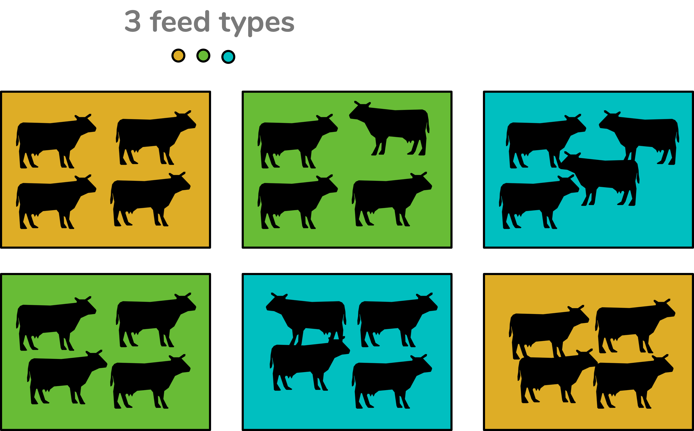
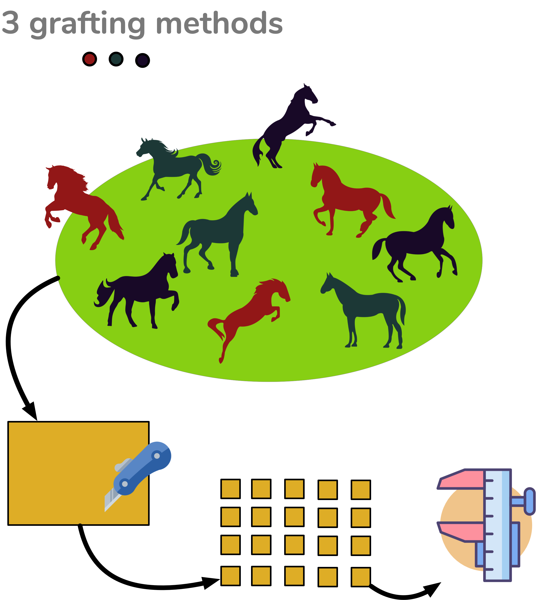
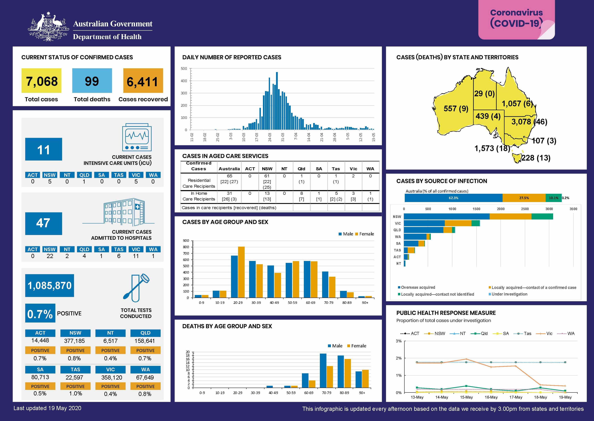
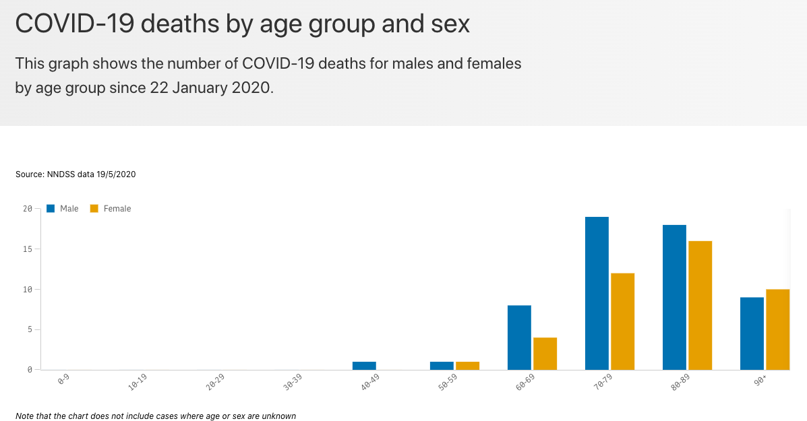
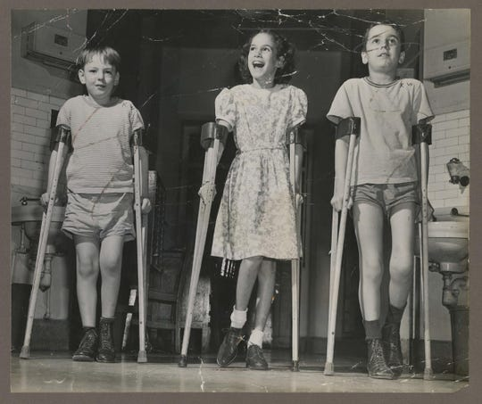

```{r titleslide, child="components/titleslide.Rmd"}
```

---

# <i class="fas fa-vial"></i> Experiments

* **Experiment** is a procedure that is carried out to test a hypothesis or understand a phenomenon.
* One of the most common experiment is a **comparative experiment** which compares different sets of conditions referred to as .monash-blue[**treatments**].
* These treatments are applied to .monash-blue[**experimental units**] - the smallest division of the experimental material such that any two units may receive different treatments in the actual experiment. 
* The smallest unit which the response is measured on is referred to as the .monash-blue[**observational unit**].
* Note that observational unit is *not* the observation nor the response!

---

class: transition middle

# Classical 
# .yellow[Design of Experiments]


---


# <i class="fas fa-seedling"></i> Wheat Yield Trial

.grid[
.item[
```{r, echo = FALSE, fig.height = 8.5, fig.width = 8.3, message = FALSE}
library(tidyverse)
library(agridat)
filter <- dplyr::filter # curse you!!!
ggplot(gilmour.serpentine, aes(col, row, label = str_sub(gen, 1, 5)))  + 
  geom_tile(color = "black", fill = "#DEB887", size = 1.5) + 
  geom_text(size = 3) + theme_void() 
```

]
.item[

* A selective breeding experiment with .monash-blue[107 wheat varieties] (or *genotypes*) were conducted in South Australia in a field with plots laid out in a rectangular array with 22 rows and 15 columns.
* The breeders want to find a variety with *high yield*.
* The **treatments** are the *107 wheat varieties*.
* The **experimental units** are the *330 plots*.
* The **observational units** are also the *330 plots*.


.bottom_abs.font_small[

Source: Gilmour et al. (1997) Accounting for natural and extraneous variation in the analysis of field experiments. *Journal of Agric Biol Env Statistics*, 2, 269-293.
]

]

]

---

class: font_smaller

# Wheat Yield Trial: Linear Model .circle-it[1A]


.grid[

.item.border-right[
```{r, message = FALSE, fig.height = 2.8, fig.width = 3, fig.align='center'}
library(agridat) # data package
head(gilmour.serpentine)
ggplot(gilmour.serpentine) + 
  geom_histogram(aes(x = yield)) 
```

]
.item[

* Assuming the experiment is unstructured, we may propose a linear model:
$$\texttt{yield} = \texttt{mean} + \texttt{gen} + \texttt{error},$$
where $\texttt{error} \sim N(0, \sigma^2)$.

* This model can be fitted in R as below.


```{r}
fit1 <- lm(yield ~ 1 + gen, 
           data = gilmour.serpentine)
```

* Note that `1` (for the $\texttt{mean}$) is included by default and can be omitted.

]
]


---

class: font_smaller

# Wheat Yield Trial: ANOVA .circle-it[1B]

.grid[
.item.border-right[

* Analysis of variance (ANOVA) is historically used in the analysis of experimental data to test if any treatment is significantly different from others:

$$H_0: \texttt{gen}_1 = ... = \texttt{gen}_{107} = 0.$$

* Although ANOVA is still used today, it is widely recognized as a special case of linear models.
* ANOVA table shows the decomposition of the total variation by source - we won't go into depth about ANOVA in this course.

]
.item[

```{r}
anova(fit1)

fit2 <- lm(yield ~ 1, data = gilmour.serpentine)
anova(fit2, fit1)

```


]

]

---

# <i class="fas fa-cubes"></i> Treatment Replications <i class="fas fa-cubes"></i>

.grid[.item[
```{r, echo = FALSE}
ggplot(gilmour.serpentine, aes(col, row, label = str_sub(gen, 1, 5)))  + 
  geom_tile(color = "black", fill = "#DEB887", size = 1.5) + 
  geom_text(size = 3) + theme_void() + 
  geom_text(data = subset(gilmour.serpentine, gen == "RAC791"), 
            color = "white", size = 3, fontface = "bold") + 
  geom_text(data = subset(gilmour.serpentine, gen == "VF655"), 
            color = "yellow", size = 3, fontface = "bold") + 
  geom_text(data = subset(gilmour.serpentine, gen == "TINCURRIN"), 
            color = "red", size = 3, fontface = "bold") + 
  geom_text(data = subset(gilmour.serpentine, gen == "WW1477"), 
            color = "green", size = 3, fontface = "bold")
```

]
.item[

* The varieties `VF655`, `TINCURRIN` and `WW1477`  have a .monash-blue[**replication**] of 6, the remaining 104 varieties each have a replication of 3. 
* Treatment **replications are essential** in an experiment; without any replication, no treatment variation can be measured nor distinguished from unit variation.
* More replications are desirable for accuracy, however, there is always a tension to balance the cost of the experiment.  

]
]


---

# Systematic Design of Experiments

.grid[.item[
```{r, echo = FALSE}
dat <- gilmour.serpentine %>% 
  mutate(gen = sort(gen)) 
dat %>% 
  ggplot(aes(col, row, label = str_sub(gen, 1, 5)))  + 
  geom_tile(color = "black", fill = "#DEB887", size = 1.5) + 
  geom_text(size = 3) + theme_void() + 
  geom_text(data = subset(dat, gen == "RAC791"), 
            color = "white", size = 3, fontface = "bold") + 
  geom_text(data = subset(dat, gen == "VF655"), 
            color = "yellow", size = 3, fontface = "bold") + 
  geom_text(data = subset(dat, gen == "TINCURRIN"), 
            color = "red", size = 3, fontface = "bold") + 
  geom_text(data = subset(dat, gen == "WW1477"), 
            color = "green", size = 3, fontface = "bold")
```

]
.item[

<br>

* The treatments appear to be randomly ordered before.

<br>

* Why don't we order the treatments in a **systematic order** like on the left?

<br>


* Isn't this easier to manage the experiment?

<br>

{{content}}


]
]


--


* Systematic designs are prone to <span class="monash-blue">**bias**</span> and <span class="monash-blue">**confounding**</span>. 

---

# Randomisation

* Treatment must be allocated *randomly* to experimental units. 
* This avoids:
  * systematic bias - e.g. all flu vaccine A tested in January (summer) and all flu vaccine B tested in July (winter).
  * selection bias - e.g. giving the treatment that you are testing to the sick patients and placebo to those that are healthy.
  * other bias - e.g. the lab technician giving the treatment to the first rat that is taken out of the cage. 
  
--


* So how do we randomise?
* We can make a reproducible design using R.
* Be sure to use `set.seed` in the beginning of your script.


---

class: font_small

# Completely randomised design using R

.grid[
.item.border-right[

```{r crd, eval = FALSE}
set.seed(2020) # for reproducibility
# first create the field array
expand_grid(col = 1:15, row = 1:22) %>% 
  # create plot id (optional)
  mutate(plot = 1:n()) %>%  
  # genotype 1-104 has 3 reps
  # genotype 105-107 has 6 reps
  mutate(gen = c(rep(1:104, each = 3), 
                 rep(105:107, each = 6))) %>% 
  # now randomly permute the genotypes
  mutate(gen = sample(gen)) #<<
```

]
.item[
```{r crd, echo = FALSE}
```

]
]


---

# <i class="fas fa-th-large"></i> Blocking

.grid[
.item.border-right[
* .monash-blue[**Blocks**] are use to group the experimental units into alike units.
* If well done, blocking can lower the variance of treatment contrasts which increase power.
* Blocking reduces the residual degrees of freedom which can decrease power if the sample size is small.
* A non-homogeneous block (i.e. units within block are *not* alike) can decrease the power of the experiment.

]
.item[

You can form blocks from:


* **Natural discrete divisions** between experimental units. <br>E.g. in experiments with people, the gender make an obvious block.
* Grouping experimental units with similar **continuous gradients**. <br>E.g., if the experiment is spread out in time or space and there exists no obvious natural boundaries, then an arbitrary boundary may be chosen to group experimental units that are contiguous in time or space. 

]

]


---

# <i class="fas fa-th"></i> Blocking in field trial

.grid[.item[
```{r, echo = FALSE, fig.height = 8.5, fig.width = 8.5}
ggplot(gilmour.serpentine, aes(col, row, label = str_sub(gen, 1, 5)))  + 
  geom_tile(color = "black", aes(fill = rep), size = 1.5) + 
  geom_text(size = 3) + theme_void() + 
  geom_text(data = subset(gilmour.serpentine, gen == "RAC791"), 
            color = "white", size = 3, fontface = "bold")
```


]

.item[

* In agricultural field trials, it is common to have some underlying soil fertility trend.
* So contiguous plots may be grouped to form a block. 
* The wheat yield trial actually employed 3 blocks (as colored on left) as recorded in the variable `rep`. 
* The treatment is best to be balanced across the blocks.
* If possible, block sizes should have the same size.

]
]

---

class: font_smaller

# How to randomise design if there are blocks?

.grid[
.item.border-right[

```{r rcbd, eval = F}
set.seed(20052020)
expand_grid(col = 1:15, row = 1:22) %>% 
  mutate(plot = 1:n()) %>% 
  # 3 blocks -> 
  # block 1 is col 1-5, 
  # block 2 is col 6-10, 
  # block 3 is col 11-15
  mutate(rep = case_when(
    col %in% 1:5   ~ "block1",
    col %in% 6:10  ~ "block2",
    col %in% 11:15 ~ "block3"
  )) %>% 
  # every block contains:
  # - 1 replicate of gen 1-104
  # - 2 replicates of gen 105-107
  group_by(rep) %>%  #<<
  mutate(gen = c(1:107, 105:107)) %>% 
  # randomise within `rep`
  mutate(gen = sample(gen)) #<<
  
```


]
.item[
```{r rcbd, echo = F}
```

]
]


---

class: font_smaller

# Wheat Yield Trial: Analysis .circle-it[2A]

.grid[
.item.border-right[

* We take the block effect into account in our linear model:

```{r}
fitb <- lm(yield ~ 1 + rep + gen, 
           data = gilmour.serpentine)
```
* The ANOVA table takes into account block source of variation now:

```{r}
anova(fitb)
```


]
.item[

* Variation due to block is large!
* Take that into account, now the $p$-value for `gen` is small.
* This indicates that at least one variety has significantly different mean than others provided model assumptions are satisfied. <Br>.font_small[(The assumption is violated in this case, but we won't go into this.)]

]
]


---

class: font_smaller

# Wheat Yield Trial: Analysis .circle-it[2B]

.grid[
.item[
```{r, eval = TRUE}
broom::tidy(fitb) %>% 
  select(term, estimate) %>% 
  filter(str_detect(term, "gen")) %>% 
  arrange(-estimate)
```


]
.item[

* The variety `VG878` is performing the best according to the analysis.

```{r, echo = FALSE}
ggplot(gilmour.serpentine, aes(col, row)) + 
  geom_tile(aes(fill = yield), size = 1.5, color = "black") + 
  geom_tile(data = subset(gilmour.serpentine, gen=="VG878"), color = "red", size = 1, fill = "transparent") + 
  theme_void() + scale_fill_gradient2(low = "#A52A2A", mid = "yellow", high = "#006400")
```

]

]

---

# Replication vs Repetition

.grid[
.item.border-right[

<center>

</center>

* Three feed treatments are compared on 24 calves
* The calves are kept in 6 pens with 4 calves per pen
* Each feed is applied to two whole pens
* Every calf is weighed individually


]
.item[

* What are the experimental units? Observational units?
* How many replications of each treatment do we have?


{{content}}

]

]

--

* The pens are the experimental units. 
* The calves are the observational units. 
* In this experiment,
   * the **replication** of each treatment is 2, and 
   * the <span class="monash-blue">**repetition**</span> of each treatment is 8.
* Why do we need to distinguish this?


---

# Example: Grafting on horses

.grid[
.item[


.font_small[
* A surgeon is going to use 9 horses in an experiment
* He wants to compare 3 methods of grafting skin
* He intended to use 3 animals for each method
* After the graft was complete he would take a sample of new skin from each horse
* He would then cut each sample into 20 (tiny) pieces and use a precision instrument to measure the thickness of each piece

]

]
.item[

* **Treatments** are the 3 grafting methods. 
* **Experimental units** are the 9 horses
* **Observational units** are the 20 × 9 skin pieces

<br>

* If we assume that the grafting results in uniform thickness, then any variation in thickness of the 20 pieces from the same skin is a result of measurement error. 
* The variation of thickness between horse skins is variation due to grafting + residual variation.


]
]

---

class: font_smaller

# Simulation: Grafting on horses

.grid[
.item.border-right[
```{r sim}
set.seed(1)
# no difference between trts #<<
trt <- c(0, 0, 0) #<<
# random deviation for horse
hordev <- rnorm(9, 0, 20) 
# there are 9 horse
sim_df <- tibble(horse = 1:9) %>% 
  # 3 grafting with 3 reps
  mutate(graft = rep(1:3, 3)) %>% 
  # cut each grafted skin to 20 pieces
  mutate(piece = list(1:20)) %>% 
  # let each piece be one row
  unnest(piece) %>% 
  # now simulate the response
  mutate(y = 300 + # mean 
    trt[graft] +  # trt effect
    hordev[horse] + # horse dev
    rnorm(n(), 0, 5)) %>% # OU dev
  mutate_if(is.integer, as.factor)
```

]
.item[

* Note we don't need to randomise here as <br>we are doing a simulation and not a design.

```{r}
anova(lm(y ~ graft + horse, data = sim_df))
```

* The $p$-value for `graft` is small indicating<br> there is at least one grafting method is<br> significantly different!

]
]

---

class: font_smaller

# Pseudo-replication

.grid[
.item[

* From the simulation there should be no difference between grafting methods.
]
.item[

* The previous analysis treats skin pieces as replications of treatment.  
* The treatment that the skin pieces received are however not independent!
* The treatment of repetition as replication in the analysis is referred to as .monash-blue[**pseudo-replication**].

```{r}
summary(aov(y ~ graft + Error(horse/piece), data = sim_df))
```
]]

---

class: transition middle

# Case Study
# .yellow[Vaccine Field Trials]
# & 
# *infectious disease*

---


# Experimental vs. Observational Studies

<br>

.info-box[
In a **controlled experiment**, the investigators allocate the treatments to the units (that may be people, mice, plants, etc).
]


.info-box[
In an **observational study**, the investigators observe units without manipulation or intervention. 
]

<br>

.info-box[
In a .monash-blue[**well-controlled experiment**], the difference in response between treatment groups should be only due to the treatment.
]

---

class: wider


<center>
<a href="https://www.health.gov.au/resources/publications/coronavirus-covid-19-at-a-glance"></a>
</center>

---

class: wider


<a href="https://www.health.gov.au/resources/covid-19-deaths-by-age-group-and-sex"></a>

Is this an experimental or observational study?

---

# Claims from observational study

Based on previous graphs, which statements are true?

<br>

1. Age determines the risks of death from COVID-19.
2. Community transmission of coronavirus is rare. Most infected cases are from overseas or close contact with confirmed case.
3. Men are at a higher risk of death from COVID-19.
4. Children have a much higher immunity against coronavirus.
5. NSW has the highest number of coronavirus infected cases out of all the Australian states and territories. 
6. Australia started to go into lock-down from Sun 22/03/2020. The shutdown measures were effective.

---

# Correlation vs Causation


.info-box[
Correlation does not imply causation.
]

* Age may not be a defining factor that determines the risk of death from COVID-19. 
* There is increasing observations that those with *underlying health conditions* are at a higher risk of death from COVID-19.
* Many underlying health conditions, such as hypertension, is prevalent in elderly.
* It may be the combination of COVID-19 and other health conditions that is the causal factor of death.
* You can read more about this in this Conversation article: [Coronavirus: the puzzle of why the risk of death is greater for men and for the elderly](https://theconversation.com/coronavirus-the-puzzle-of-why-the-risk-of-death-is-greater-for-men-and-for-the-elderly-135176).


---

# What was the data collection procedure?

<blockquote>

Chief Medical Officer Brendan Murphy said there was no point in testing Australians simply because they had respiratory or cold and flu symptoms.<br><br>

Other than a "small and controlled" cluster of community transmission in Sydney, cases were largely confined to returned travelers.<br><br>

"If you're a returned traveler or you've been in contact with someone who has been a confirmed case, then you should be tested. But other Australians do not need testing and all they're doing is putting an unnecessary burden on the testing," he said.

</blockquote>

Read the article [here](https://www.canberratimes.com.au/story/6673342/no-testing-without-virus-contact-or-overseas-travel/).

---

# Statisticians urge random testing


* Nicholas Fisher (former chief scientist in statistics in CSIRO) and Dennis Teewin (Australian Statistician) urge random testing in Australia [<i class="fas fa-newspaper"></i>](https://www.afr.com/policy/health-and-education/why-random-testing-is-the-road-back-to-normal-20200413-p54j9e)
* Without an experimental study, it is hard to estimate the true level of community transmissions.
* In the beginning, the criteria for testing was for those who returned from overseas and those that were in close contact with a confirmed case. 
* It is not surprising then that the number of cases almost all belonged to those two categories in the beginning. 


---

# Control


.info-box[
A .monash-blue[**control**] is an experimental unit that did not receive any treatment.
]

* In order to know the effect of treatment, e.g. vaccine, we must compare with something, e.g. the control. 
* Confusingly, in experimental descriptions, some regard control as one of "treatments"; some when referring to treatments, exclude control; and then some use both with context needed to infer whether control is included or not.
* Note: you do not always need a control! 
* If there is already effective treatment that is applied as a standard, then testing should be compared with this standard treatment (as was the case for breeding trial).

--

* Is "do-nothing" treatment wise comparison though?

---

# Placebo 

* When people are enrolled in a trial to test a potential treatment, the control group may be aware that they are not receiving the treatment; likewise the treatment group are aware they are receiving treatment. 
* This may result in unconscious or conscious **bias** where the control group expects they will not get better and the treatment group expects that they will get better; thus the difference in the result may not be due to treatment but due to this bias.  

.info-box[
A .monash-blue[**placebo**] is a medical treatment or procedure designed to have no  therapeutic value.]

* All participants enrolled in a study then will be assigned to a treatment or placebo group but will not be told which group they belong to.

---

# Double-Blind Study

* In a randomised controlled study, the participants are **blind** to whether they are in the treatment or placebo group.
* The experimenters, however, can still bias the results if they know which group the participant belongs to. 

.info-box[
A .monash-blue[**double-blind study**] is an experimental study that neither the participants nor the experimenters know who is receiving which treatment. 
]

* This again helps to reduce any potential bias in the study.


---

# Confounding variable

<br>

.info-box[

A .monash-blue[**confounding variable**] is a variable that is associated with the variable of interest (usually the treatment) and the response. 

]


* E.g., consider the lab technician giving the diet treatment to the first rat that is taken out of the case and leaving the other rats as control.
* The first rat taken out of cage may be slower or lazier than other rats (hence easier to catch to take out of the cage). 
* In that case the genetics or character of the rat may be confounded with treatment.


---

# The Salk Vaccine Field Trial 

.grid[
.item.border-right[

* The first **polio epidemic** hit the United States in 1916 claiming hundreds of thousands of victims, especially children.
* National Foundation for Infantile Paralysis (NFIP) was ready to test the vaccine developed by Jonas Salk in the real world.
* A controlled experiment was proposed to test the effectiveness of the vaccine on grade 1, 2 and 3 children at selected school districts though the country where the risk of polio was high.

.bottom_abs.width100.font_small[
Source: Freedman, Pisani & Purves (2010) *Statistics*. 4th edition.
]

]
.item[

* In total two million children were involved although not all parents consented to their children to be vaccinated.

<center>

</center>

.font_small[[Photo: Historical Society of Pennsylvania](https://www.yorkdispatch.com/story/news/local/2020/04/21/retired-york-county-doctor-sees-parallels-between-coronavirus-polio-outbreaks/5145414002/)]
]
]


---


# Design for the NFIP Study


<br><br>

Vaccinate all grade 2 children whose parents would consent, leaving children in grades 1 and 3 as controls.

<br><br>


* Can grade 2 children whose parents did not consent be included as control?
* What are the potential issues with such a design?
* Polio is a contact disease. Would incidences of disease be higher in grade 2?


---

# Results from Salk vaccine trial of 1954


The rate is the number of polio cases per 100,000 in each group.

<br>

.grid[
.item[

```{r, include = FALSE}
iris %>% knitr::kable() %>% kableExtra::kable_styling()
```


```{r, echo = F, warning = FALSE}
tibble(group = c("Vaccinated", "Placebo", "Not Vaccination<br>(no consent)", "Incomplete Vaccination"),
       size = c("200,745", "201,229", "338,778", "8,484"),
       rate = c(28,71,46,24)) %>% 
  knitr::kable(col.names = c("Group", "Participants", "Rate"), 
               caption = "Randomised controlled experiment",
               align = "lrr", escape = F) 
```
]
.item[

```{r, echo = F}
tibble(group = c("Vaccinated (Grade 2)", "Control (Grade 1 & 3)", "Not Vaccination<br> (Grade 2, no consent)", "Incomplete Vaccination<br>(Grade 2, incomplete)"),
       size = c("221,998", "725,173", "123,605", "9,904"),
       rate = c(25, 54, 44, 40)) %>% 
  knitr::kable(col.names = c("Group", "Participants", "Rate"),
               caption = "The NFIP Study",
                align = c("lrr"), escape = F) 
```
]
]

.bottom_abs.width100.font_small[
Francis (1955) An evaluation of the 1954 poliomyelitis vaccine trials - summary report. *American Journal of Public Health* **45** 1-63.
]


---

# What does the result say?

.grid[
.item[

<br>

```{r, echo = F}
tibble(group = c("Vaccinated", "Placebo/Control", "Not Vaccination<br>(no consent)", "Incomplete Vaccination"),
       rate1 = c(28,71,46,24),
       rate2 = c(25, 54, 44, 40)) %>% 
  knitr::kable(col.names = c("Group", "RCT Rate", "NFIP Rate"), 
               align = "lrr", escape = F) 
```

<br>
* RCT and NFIP trial sampled from school districts with similar exposures to the polio virus. 

]
.item[


* Both the not vaccinated (no consent) and placebo/control group did not receive the treatment but why is the rate of polio cases less in the not vaccinated (no consent) group?

{{content}}

]
]

--

* Higher income parents would more likely consent to treatment than lower-income parents.
* Children of higher income parents are more vulnerable to polio.
* Many forms of polio are hard to diagnose and in borderline cases.


---


```{r endslide, child="components/endslide.Rmd"}
```
