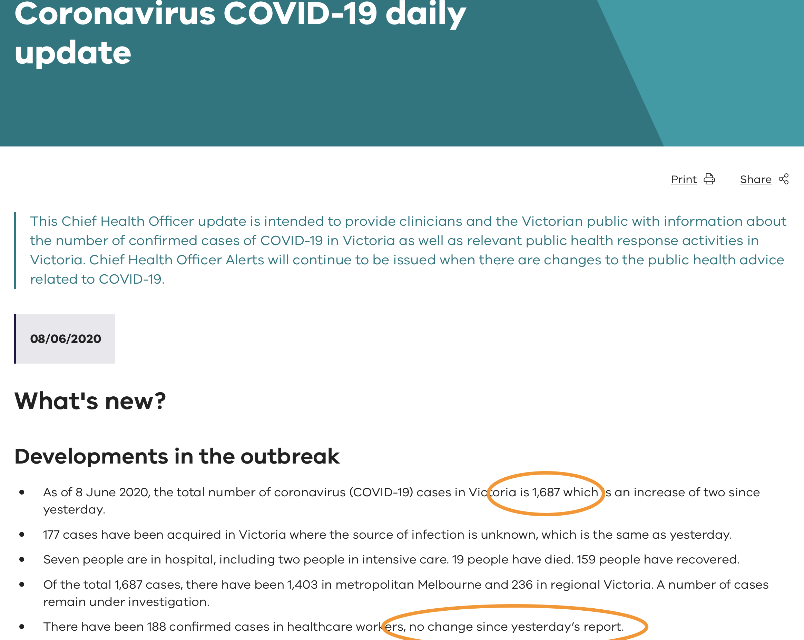
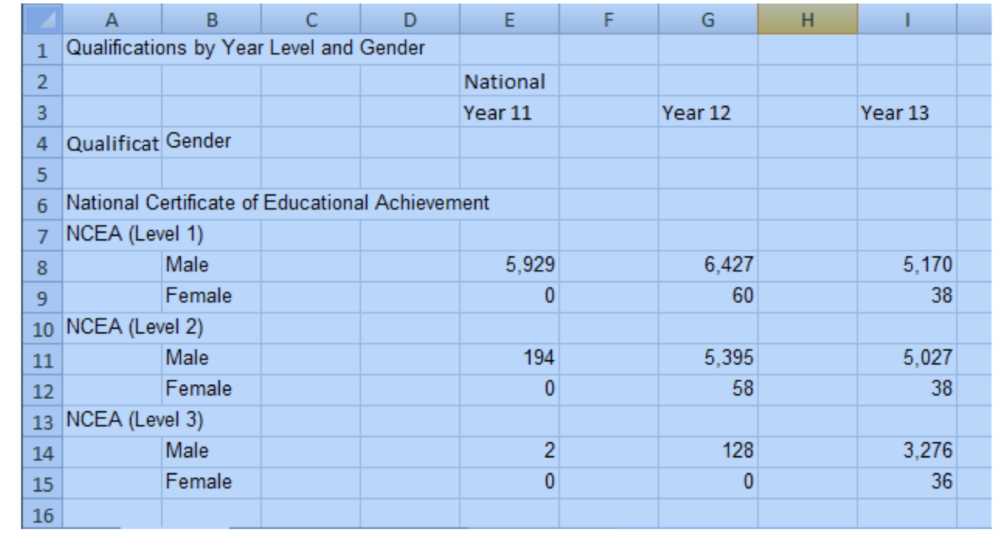
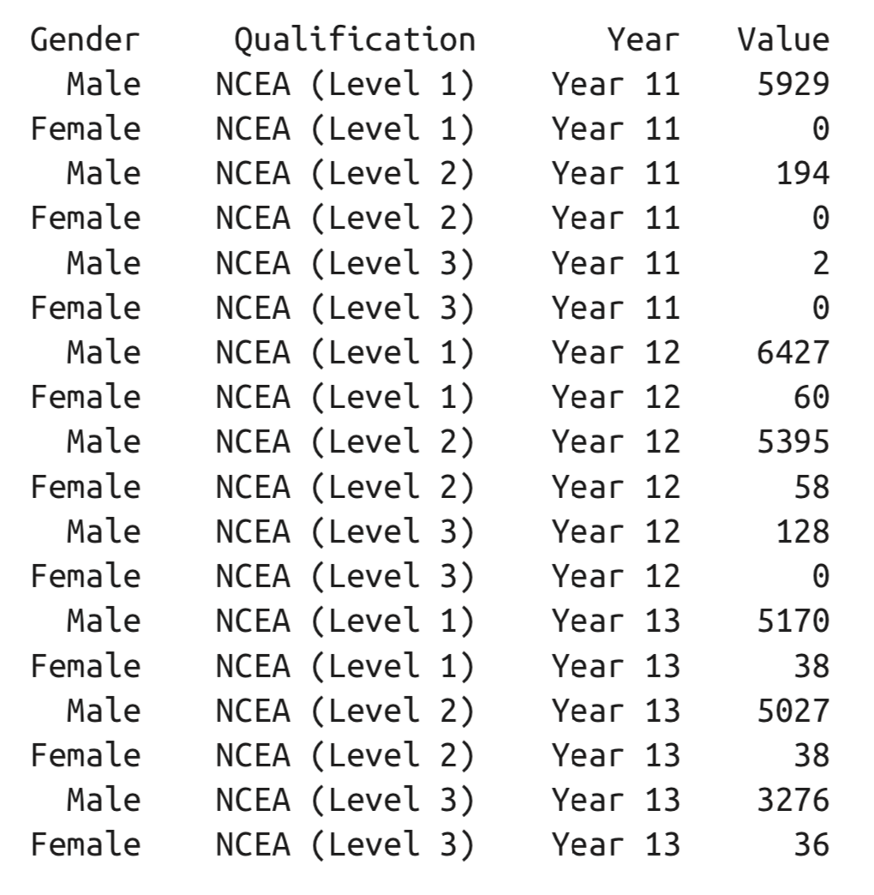
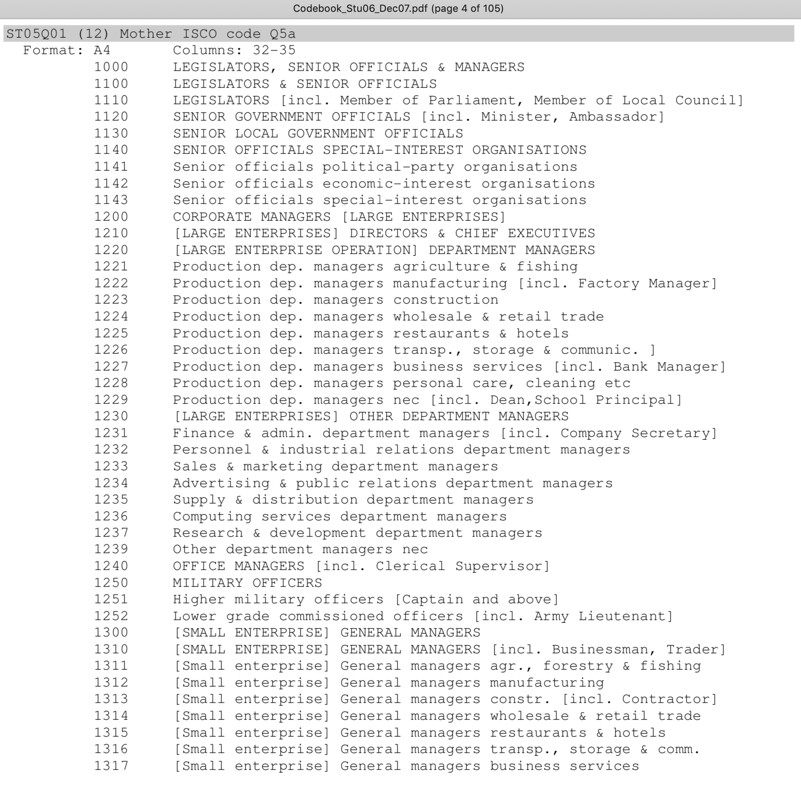

```{r titleslide, child="components/titleslide.Rmd"}
```

.footnote[Image source:  https://flickr.com/photos/34534185@N00/6081362690, via https://commons.wikimedia.org]

```{r setup, include=FALSE}
library(knitr)
knitr::opts_chunk$set(tidy = FALSE, 
                      message = FALSE,
                      warning = FALSE,
                      echo = FALSE, 
                      eval = FALSE,
                      fig.width=8,
                      fig.height=6,
                      fig.align = "center",
                      fig.retina = 4)
options(htmltools.dir.version = FALSE)
```

---
class: motivator 
# Time has come to wrap up this unit

Suppose you are the data curator. What should you know.

- Organising data into spreadsheets for analysis
- Rules for caring and feeding your data
- Realistic guide to making data available

---
class: refresher

# Open data is...

a raw material for the digital age but, 

unlike coal, timber or diamonds, 

it can be used by anyone and everyone at the same time.

<br><br><br><br>
https://www.europeandataportal.eu/elearning/en/module1/#/id/co-01

---
class: motivator 
# Example in the news

<blockquote class="twitter-tweet"><p lang="en" dir="ltr">Today, three of the authors have retracted &quot;Hydroxychloroquine or chloroquine with or without a macrolide for treatment of COVID-19: a multinational registry analysis&quot; Read the Retraction notice and statement from The Lancet <a href="https://t.co/pPNCJ3nO8n">https://t.co/pPNCJ3nO8n</a> <a href="https://t.co/pB0FBj6EXr">pic.twitter.com/pB0FBj6EXr</a></p>&mdash; The Lancet (@TheLancet) <a href="https://twitter.com/TheLancet/status/1268613313702891523?ref_src=twsrc%5Etfw">June 4, 2020</a></blockquote> <script async src="https://platform.twitter.com/widgets.js" charset="utf-8"></script>

---

background-image: \url(https://i.guim.co.uk/img/media/68b2cc3ee316f8a61e3df97b36954c1c6a20638c/0_0_4166_2500/master/4166.jpg?width=620&quality=45&auto=format&fit=max&dpr=2&s=e3358e1170461eb2904f7534dad4de8f)
background-size: cover

---

An article in Lancet, one of the oldest and best known journals that publishes general medical articles, "found Covid-19 patients who received the malaria drug, hydroxychloroquine, were dying at higher rates and experiencing more heart-related complications than other virus patients". Within days, the World Health Organization had halted its support for trials of hydroxychloroquine. Australian infectious disease researchers began questioning the published results very quickly. 

---

- An important point to note is *The data relied upon by researchers to draw their conclusions in the Lancet is not readily available in Australian clinical databases, leading many to ask where it came from*. 
- This is not the norm for research articles today, where most journals require the data and software to be made available so that others can verify the results. 
- The numbers for the Australian cases did not match the data that researchers here knew. So they made some phone calls. 

---
class: split-20

.column[


]

.column[
<blockquote class="twitter-tweet"><p lang="en" dir="ltr">Once I realised the data in That <a href="https://twitter.com/hashtag/LancetGate?src=hash&amp;ref_src=twsrc%5Etfw">#LancetGate</a> study was probably fabricated I couldn&#39;t do anything else and had to write a blog post about it. Not only is Surgisphere far too small to have software in 671 hospitals, their claimed awards are dodgy: <a href="https://t.co/Ro8vEvpZqc">https://t.co/Ro8vEvpZqc</a></p>&mdash; Peter Ellis (@ellis2013nz) <a href="https://twitter.com/ellis2013nz/status/1266739627701854208?ref_src=twsrc%5Etfw">May 30, 2020</a></blockquote> <script async src="https://platform.twitter.com/widgets.js" charset="utf-8"></script>

<blockquote class="twitter-tweet"><p lang="en" dir="ltr">Investigation from me in Melbourne and Stephanie Kirchgaessner in the US: Governments and WHO changed Covid-19 policy based on suspect data from tiny US company named Surgisphere: <a href="https://t.co/LtyG5UnldX">https://t.co/LtyG5UnldX</a></p>&mdash; Melissa Davey (@MelissaLDavey) <a href="https://twitter.com/MelissaLDavey/status/1268135649615310849?ref_src=twsrc%5Etfw">June 3, 2020</a></blockquote> <script async src="https://platform.twitter.com/widgets.js" charset="utf-8"></script>

]

---

The first to the National Notifiable Diseases Surveillance System, who confirmed that they were not the source of the data.  Next to health departments in NSW and Victoria, who also confirmed that they did not provide the data. And then to the hospitals themselves, which provoked this response 

*Dr Allen Cheng, an epidemiologist and infectious disease doctor with Alfred Health in Melbourne, said the Australian hospitals involved in the study should be named. He said he had never heard of Surgisphere, and no one from his hospital, The Alfred, had provided Surgisphere with data. "Usually to submit to a database like Surgisphere you need ethics approval, and someone from the hospital will be involved in that process to get it to a database," he said. He said the dataset should be made public, or at least open to an independent statistical reviewer. If they got this wrong, what else could be wrong?" Cheng said.*


---

class: split-20

.column[


]

.column[

<blockquote class="twitter-tweet"><p lang="en" dir="ltr">New piece on the <a href="https://twitter.com/hashtag/Surgisphere?src=hash&amp;ref_src=twsrc%5Etfw">#Surgisphere</a> saga from me: Unreliable data: how doubt snowballed over Covid-19 drug research that swept the world <a href="https://twitter.com/hashtag/opendata?src=hash&amp;ref_src=twsrc%5Etfw">#opendata</a> <a href="https://twitter.com/hashtag/openscience?src=hash&amp;ref_src=twsrc%5Etfw">#openscience</a> <a href="https://twitter.com/hashtag/hydroxychloroquine?src=hash&amp;ref_src=twsrc%5Etfw">#hydroxychloroquine</a> <a href="https://t.co/cI4VfcXeZy">https://t.co/cI4VfcXeZy</a></p>&mdash; Melissa Davey (@MelissaLDavey) <a href="https://twitter.com/MelissaLDavey/status/1268515172563341313?ref_src=twsrc%5Etfw">June 4, 2020</a></blockquote> <script async src="https://platform.twitter.com/widgets.js" charset="utf-8"></script>

<blockquote class="twitter-tweet"><p lang="en" dir="ltr">Retracted studies may have damaged public trust in science, top researchers fear <a href="https://t.co/hNsEM1hYnx">https://t.co/hNsEM1hYnx</a></p>&mdash; Melissa Davey (@MelissaLDavey) <a href="https://twitter.com/MelissaLDavey/status/1269058847039090688?ref_src=twsrc%5Etfw">June 6, 2020</a></blockquote> <script async src="https://platform.twitter.com/widgets.js" charset="utf-8"></script>
]

---
class: split-50
# Success story of open  data

.column[

<br>
<br>

- Data related to the COVID-19 pandemic has been collated by many organisations across the globe and made freely available.

<br>
<center> .font_large[`r emo::ji("woman_technologist_medium_skin_tone")` `r emo::ji("man_technologist_medium_skin_tone")` `r emo::ji("woman_technologist_medium_light_skin_tone")` `r emo::ji("man_technologist_medium_dark_skin_tone")`] </center>
<br>

- These numbers led to suspicions about the article's claims.

]
.column[
<br>
<br>



]

---
class: split-50

# Johns Hopkins COVID19 

.column[
<br>
<br>

- [COVID-19 Data Repository by the Center for Systems Science and Engineering (CSSE) at Johns Hopkins University](https://github.com/CSSEGISandData/COVID-19)
- Jan 23 (?) start of data collection 
- I used this data for my own flexdashboard, started in mid-March, but it didn't have detailed data for Australia. 
- [Nick Evershed and group at Guardian](https://www.theguardian.com/australia-news/datablog/ng-interactive/2020/jun/08/coronavirus-active-cases-covid-19-australia-state-data-update-how-many-new-numbers-today-map-stats-statistics-r-number-hotspots-postcode-corona-deaths-death-toll) 
- [Monash team](https://github.com/covid-19-au/covid-19-au.github.io)

]
.column[
<br>
<br>


<br>
<br>

Vast number of people and organisations collating data, often (others) cross-checking numbers between sites.

]

---
class: split-50

# Difficulties

.column[
<br>
<br>

- Changing formats!

> *... collated by Johns Hopkins University Center for Systems Science and Engineering (JHU CCSE) ... we will nevertheless scrape data from the relevant wikipedia pages, because it tends to be more detailed and better referenced than the equivalent JHU data ...* [Tim Churches blog](https://timchurches.github.io/blog/) Mar 1
]

.column[
<br>
<br>

- Changing links! (The link to the GBR data from assignment 2 has changed)
- So many links on the website - which data to use?
]

---
# Spreadsheets

.footnote[Source: Murrell (2013) Data Intended for Human Consumption]

.pull-left[
Human consumption



]

.pull-right[
Computer consumption



]

---
class: split-50
# Spreadsheets for computer consumption

.footnote[Broman and Woo (2018) Data Organization in Spreadsheets https://doi.org/10.1080/00031305.2017.1375989]

.column[
<br>
<br>

- write dates like YYYY-MM-DD,
- do not leave any cells empty, 
- put just one thing in a cell, 
- organize the data as a single rectangle (with subjects as rows and variables as columns, and with a single header row), 
- create a data dictionary, 

]

.column[
<br>
<br>

- do not include calculations in the raw data files, 
- do not use font color or highlighting as data, 
- choose good names for things, 
- make backups, 
- use data validation to avoid data entry errors, and 
- save the data in plain text files.
]

---
class: split-50

.pull-left[
<a href="https://imgs.xkcd.com/comics/iso_8601_2x.png">  </a>
]
.pull-right[

- [Microsoft Excel’s treatment of dates can cause problems in data](https://storify.com/kara_woo/excel-date-system-fiasco)
- It stores them internally as a number, with different conventions on Windows and Macs
- Excel also has a tendency to turn other things into dates. 

]

---
class: split-two

.row[
.pull-left[
<br>
<br>
.monash-blue[**The cells in your spreadsheet should each contain one piece of data. Do not put more than one thing in a cell.**]
]

.pull-right[

<br>
<br>
You might have a column with "plate position" as "plate-well", it would be better to separate this into "plate" and "well" columns 
]
]
.row[

- Remember, airlines data, time zone on one column, departure time in another. This is partly technical because multiple time zones can't be stored in a single column. 
- Also, the data is distributed as Year, Month, Day columns, which is safer across systems
]


---

.pull-left[
<br>
<br>
.monash-blue[**Create a data dictionary**]

Remember, the PISA data. Extensive data dictionary for each year distributed, giving variable names, and also explanation of levels in categorical variables. 
]

.pull-right[

<br>
 
 
]

---
class: refresher

background-image: \url(https://rmitconservationscience.files.wordpress.com/2016/08/feral-cat-and-phascogale-credit-fredy-mercay.jpg)
background-size: 70%

.box[Beware your spreadsheets don't bite your data!]

---
class: motivator middle

# You can validate the integrity of your csv file with

http://csvlint.io

---
class: motivator middle

# Goodman et al (2014) Ten Simple Rules for the Care and Feeding of Scientific Data

---

`r emo::ji("thinking")` As we look at these rules, think about what this implies for business and government data.

<br>
 


---

# Care and feeding

1. Love Your Data, and Help Others Love It, Too
--

2. Share Your Data Online, with a Permanent Identifier
--

3. Conduct Science with a Particular Level of Reuse in Mind
--

4. Publish Workflow as Context
--

5. Link Your Data to Your Publications as Often as Possible
--

6. Publish Your Code (Even the Small Bits)
--

7. State How You Want to Get Credit
--

8. Foster and Use Data Repositories
--

9. Reward Colleagues Who Share Their Data Properly
--

10. Be a Booster for Data Science
--

---
# Love Your Data, and Help Others Love It, Too

.pull-left[

<br>
<br>

# What are some ways to show your love?

<br>
<br>
.monash_orange[What data have we seen that isn't loved?]

]
.pull-right[
- Nurture: 
    - feed, 
    - hug, check on it
    - dress it nicely
    - give it a name
- Show it off: 
    - tell someone about it
    - demonstrate how it can be used
   
]

---
# Share Your Data Online, with a Permanent Identifier

.pull-left[

- Give is a name: digital object identifier (DOI)
- Adequate documentation and metadata
- Employing good curation practices

]

.pull-right[

Common resources:

- [Zenodo](http://zenodo.org/)
- [FigShare](http://figshare.com/)
- [Dataverse](http://thedata.org/)
- [Dryad](http://datadryad.org/)
]

---
# Conduct Science with a Particular Level of Reuse in Mind

Replace "science" with "data science", "data analysis", "analytics", "business intelligence". 

- keep careful track of versions of data and code
- to be fully reproducible, then *provenance* information is a must 
    - working pipeline analysis code, 
    - a platform to run it on, and
    - verifiable versions of the data. 
- what types of re-use do you think others might make of your work?

---
# Reward Colleagues Who Share Their Data Properly

.footnote[Source: https://www.aws.org.au/serventy/]

.pull-left[
- Build promotion and award systems that count data and code-sharing activities.
- Consider this activity an important part of your own data science work. 
- Clear guidelines for credit
]

.pull-right[


]

---
class: split-50

# Johns Hopkins COVID19 

.column[
<br>
<br>

What's really nice `r emo::ji("smile")`

- [Github page](https://github.com/CSSEGISandData/COVID-19)
- Compiled data from various sources, sources listed
- Update time stamp
- Versioning 
- Issues for two way conversations with users

]
.column[
<br>
<br>


]
---
class: informative
# Macroeconomic data

[Survey of Professional Forecasters](https://www.philadelphiafed.org/research-and-data/real-time-center/survey-of-professional-forecasters) (Assignment 1)

- Need to know what you are looking for, many links, and several clicks deep `r emo::ji("x")` 
- Regularly updated, time stamp `r emo::ji("white_check_mark")` 
- Web interface `r emo::ji("white_check_mark")` 
- API for other software, like ALFRED package, to extract subsets `r emo::ji("white_check_mark")` 
- `csv` file is nicely rectangular `r emo::ji("white_check_mark")` 

---
class: informative
# ABS Census Data

- updated regularly, for each census `r emo::ji("white_check_mark")` 
- data packs, easy to find `r emo::ji("white_check_mark")` 
- download has regular file structure `r emo::ji("white_check_mark")`
- finding  variable of interest is hard, though `r emo::ji("x")` 
- spreadsheet with a gazillion tables, and variables are coded into column headers `r emo::ji("x")`

---
class: informative
# OECD PISA

- nice web interface, now with simple queries and interactive plots `r emo::ji("white_check_mark")` 
- updated regularly `r emo::ji("white_check_mark")` 
- extensive documentation on data collection - very technical `r emo::ji("white_check_mark")` 
- data dictionary, extensive! `r emo::ji("white_check_mark")` 
- data from each available in various formats, with code to read it `r emo::ji("white_check_mark")`
- format for each year is different, variables collected differ (see [learningtower](https://ropenscilabs.github.io/learningtower/index.html))  `r emo::ji("x")`

---
background-image: \url(https://upload.wikimedia.org/wikipedia/commons/3/35/Grandpa_feeding_little_Beverley_Purd%27s_pet_kangaroo_%284461715862%29.jpg)
image-size: cover

.info-box[That's it from us! Happy adventures with your own wild data!]

.footnote[[Grandpa feeding little Beverley Purd's pet kangaroo, 1930, State Library of Queensland](https://upload.wikimedia.org/wikipedia/commons/3/35/Grandpa_feeding_little_Beverley_Purd%27s_pet_kangaroo_%284461715862%29.jpg)]
---
```{r endslide, child="components/endslide.Rmd"}
```
