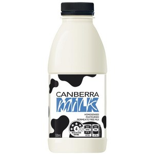

```{r titleslide, child="components/titleslide.Rmd"}
```

---
class: motivator middle
# Examples of open data?
https://www.globalforestwatch.org/

<!-- farmer in amazon  -->
<!-- worries about risk of fires -->
<!-- farmers use controlled fires- clear land and high nutrition in soil -->
<!-- can get out of hand with weather and ground conditions -->

<!-- open data: global forest watch -->
<!-- interactive map -->
<!-- risk of fire - historical data -->
<!-- keep family safe -->
<!-- controlled fires -->

---

class: informative middle
# Open data is...

a raw material for the digital age but, 

unlike coal, timber or diamonds, 

it can be used by anyone and everyone at the same time.

<br><br><br><br>
https://www.europeandataportal.eu/elearning/en/module1/#/id/co-01

---

# Why open data useful?
<br><br>
* Benefits to governments, businesses and individuals.
<br><br>
* Improves services, grows economies and protects our planet.
<br><br>
* Restrictions will limit its potential.

---

# What makes data open?
<!-- Open data is measured by what it can be used for, not by how it is made available. -->
<br>
* Limitations
    * No limitations that prevent particular uses.
    * Anyone free to use, modify, combine and share, even commercially.
<br>
* Cost
    * Free to use does not mean that it must be free to access.
    * Cost to creating, maintaining and publishing usable data.
    * Live data and big data can incur ongoing costs.
<br>
* Reuse
    * Free to use, reuse and redistribute it - even commercially.
    
---

# Definition open data
Open data can be freely used, modified, and shared by anyone for any purpose
<br><br>
There are two dimensions of data openness:
* The data must be legally open, which means they must be placed in the public domain or under liberal terms of use with minimal restrictions.
* The data must be technically open, which means they must be published in electronic formats that are machine readable and non-proprietary, so that anyone can access and use the data using common, freely available software tools. Data must also be publicly available and accessible on a public server, without password or firewall restrictions. 
<br><br>
http://opendefinition.org/

---
# Why license open data?
<br><br>
* Tells anyone that they can access, use and share data.
<br><br>
* Unless you have a licence, data may be 'publicly available', but users will not have permission to access, use and share it under copyright or database laws.

<!-- Organizations and governments use Open Data licenses to clearly explain the conditions under which their data may be used.  -->

---
# Open data licenses
<!-- Many licenses include both a summary version, intended to convey the most important concepts to all users, and a detailed version that provides the complete legal foundation. Examples include: -->

* Standard re-usable license: consistent and broadly recognized terms of use
  * Creative Commons, particularly CC-By and CC0 https://creativecommons.org/
  * Open Database License https://opendatacommons.org/licenses/odbl/
* Bespoke licenses: governments and international organizations developed 
  * UK Open Government License http://www.nationalarchives.gov.uk/doc/open-government-licence/version/3/
  * The World Bank Terms of Use https://data.worldbank.org/summary-terms-of-use

<!-- Standard licenses can offer several advantages over bespoke licenses, including greater recognition among users, increased interoperability, and greater ease of compliance. -->

---

# Open data Machine Readability

<br><br>
* Documents 
  * static and frozen in their format
  <br><br>
* Data 
  * dynamic and can be open to further processing
<br><br>
https://www.data.gov/developers/blog/primer-machine-readability-online-documents-and-data

---
# Open data Machine Readability

<br><br>
.grid[
.item[
<center>

</center>
]
.item[
<center>

</center>
]]

---

# Open data Machine Readability

<br><br>
.grid[
.item[
<center>

</center>
]
.item[
<center>

</center>
]]

---

# Metadata: data about data
<br><br>
Information necessary to use the data
<br><br>
* Source
* Structure
* Underlying methodology
* Topical
* Geographic and/or temporal coverage
* License
* When it was last updated 
* How it is maintained 

---

# Metadata: data about data
<br><br>
* Dublin Core Metadata Initiative (DCMI) provides a framework and core vocabulary of metadata terms.
  * https://www.dublincore.org/
  <br><br>
* Governments develop metadata models to provide further uniformity to government-wide Open Data initiatives. 
  * https://project-open-data.cio.gov/v1.1/schema/
  
---
class: informative middle

# Metadata: example

* https://open.canada.ca/data/en/dataset/4a1b260a-7ac4-4985-80a0-603bfe4aec11
<br><br>
* https://data.worldbank.org/ 

<!-- Title: what data contains and where it comes from. -->
<!-- Description: details to quickly understand whether data is relevant to you -->
<!-- publisher: dataset originated, who is repsonsible for maintaining, credibility -->
<!-- license: -->
<!-- contact information: questions or incomplete metadata -->
<!-- frequency: interval data is updated. check for updates? data out of date? -->
<!-- date modified: relevant for your work? -->
<!-- spatial coverage: geographic area data is relevant -->
<!-- temporal coverage: -->
<!-- open data formats -->

<!-- Maternal mortality world bank data lesson 2-->
<!-- look at different download formats -->
---

# Open data quality
<br><br>
Legal requirements:
<br><br>
* Protect sensitive information like personal data.
* Preserve the rights of data owners.
* Promote correct use of the data.

<!-- In addition to the open licence, there are three legal requirements that need to be considered. You must: -->

<!-- Refer to week 1 observational data. individual characteristics.  -->
  <!-- 538 : 41 percent of fliers think you are rude. airline travel data.  -->
  
---
# Open data quality

<br><br>
Practical requirements:
<br><br>
* Link to the data from their website.
* Update the data regularly if it changes.
* Commit to continue to make the data available.


---
# Open data quality
<br><br>
Technical requirements:
<br><br>
* The format in which the data is published.
* The structure of the data.
* The channels through which the data is available.

---

# Five star open data scheme
<br><br>
* 1 star - An open license
* 2 stars - Re-usable format
* 3 stars - Open format 
* 4 stars - use URIs
* 5 stars - Link data
<br><br><br><br>
https://5stardata.info/en/

---
# Cleaning data
<br><br>
Common pittfalls wild data.
<br><br>
* Mixed date formats
    american/european
* Multiple representations
    differences in abbreviations, capitalisation, spacing
* Duplicate records
* Redundant data
* Mixed numerical scales 
* Spelling errors
* Missing values

---

# Why do we need open data?


* Help make governments more transparent.
    * Open data allowed citizens in Canada to save the government billions in fraudulent charitable donations
* Building new business opportunities
    * Transport for London has released open data that developers have used to build over 800 transport apps.
* Protecting the planet
    * Open data about weather can provide an early warning system for environmental disasters
    * Open data is also helping consumers to understand their personal impacts on the environment

<br><br><br><br>   
https://opendatahandbook.org/guide/en/why-open-data/

---
class: informative middle

# Open data sources
<br><br> 
* http://dataportals.org/search 
<br><br> 
* http://data.un.org/
<br><br> 
* https://datacatalog.worldbank.org/

---
# Open data Australia: 
<br><br> 
* http://www.opendata500.com/au/
<br><br> 
* https://opendataimpactmap.org/eap

---

# Government data 
<br><br> 
* http://www.data.gov.au/
<br><br> 
* https://www.data.vic.gov.au/
<br><br> 
* https://data.melbourne.vic.gov.au/

<!-- Metadata with good example -> develop case in lecture with australian data (for instance https://data.gov.au/data/dataset/australia-s-merchandise-trade-by-country-and-sitc-to-fy2017) -->
<!-- and go over metadata and licenses. -->

---
class: informative middle

# Open data
<br><br> 
Open data can be freely used, modified, and shared by anyone for any purpose
<br><br> 

---
class: informative middle
# Flavours of open data

How to tell if the open data is not so good to consume

---
background-image: url(https://upload.wikimedia.org/wikipedia/commons/thumb/e/e2/Food_on_shelf.jpg/1600px-Food_on_shelf.jpg)
background-size: cover

# Long shelf life, highly processed

<br>
<br>
<br>
<br>
.tip[
- Convenient, but contains unhealthy ingredients, and is a bad habit
- eg iris, mtcars, titanic, handwritten digits
- Found at eg [UCI Machine learning archive](https://archive.ics.uci.edu/ml/datasets.php)
]
---
background-image: url(https://upload.wikimedia.org/wikipedia/commons/thumb/a/ae/Abandoned_Car_%282654024518%29.jpg/1600px-Abandoned_Car_%282654024518%29.jpg)
background-size: cover

# Orphans

<br>
<br>
<br>
<br>
<br>
<br>

.tip[
- File dumped on an archive 
- Stale, could date your results  
- Found in places like [https://data.gov.au](https://data.gov.au)
]

---
background-image: url(https://upload.wikimedia.org/wikipedia/commons/thumb/0/03/Artificial_Putting_Green.JPG/1134px-Artificial_Putting_Green.JPG)
background-size: cover
# Synthetic

<br>
<br>
<br>
<br>

.tip[
- Used primarily these days for privacy protection
- Correct up to the model used to simulate the data - misse interesting structure in data not captured by model
- Very pretty, very consistent, but it can burn you
- eg [OECD Programme for International Student Assessment](https://www.oecd.org/pisa/data/)  A generalised linear model is fitted to the scores, with predictors such as school, gender, ... Model is used to simulate a score for each student. 
]

---
background-image: url(https://m.media-amazon.com/images/M/MV5BZmVkNTAwZjctZDI4Yy00YWMyLWEwZmUtNGFlNDY2NGJiNDAyXkEyXkFqcGdeQXVyMTc0NzI3MDQ@._V1_.jpg)
background-size: cover
# Wild

<br>
<br>
<br>
<br>
<br>
<br>

.tip[
- Fresh, interesting, exciting, challenging
- eg [US Bureau of Transportation Statistics air traffic database](https://www.transtats.bts.gov/DL_SelectFields.asp?Table_ID=236)
]

.footnote[Image: Reese Witherspoon, Wild (2014) IMDb]

---
background-image: url(https://upload.wikimedia.org/wikipedia/commons/thumb/a/a1/South_Melbourne_market_outside_1a.jpg/1056px-South_Melbourne_market_outside_1a.jpg)
background-size: 70%
# Fresh and local

<br>
<br>
<br>

.tip[
- Wild data, collected locally, and impacting our own lives
- eg [Melbourne pedestrian counts](https://cran.r-project.org/web/packages/rwalkr/index.html)
]


---
class: refresher middle

# Wild-caught data

The data can be freely used, modified, and shared by anyone for any purpose
<br><br> 
AND
<br><br> 
The data source is traceable, the data collection is transparent, and the data is updated as new measurements arrive. In case of data processing, the process is clearly described and reproducible. 

<br>
.tip[This will be our working definition of wild-caught data]
---

```{r endslide, child="components/endslide.Rmd"}
```
