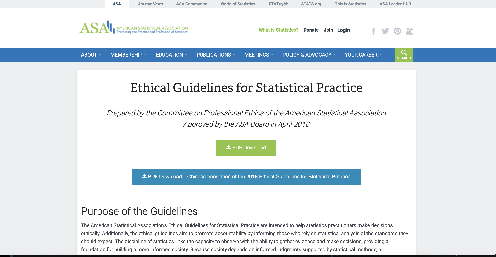
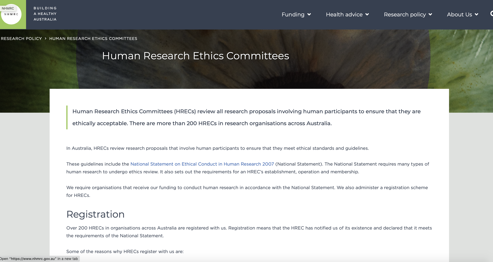
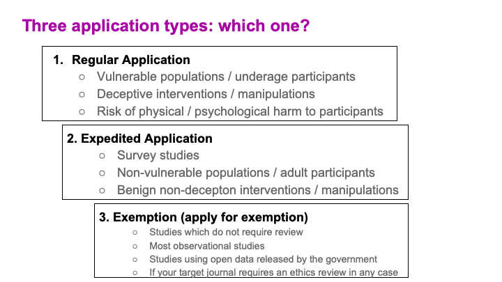
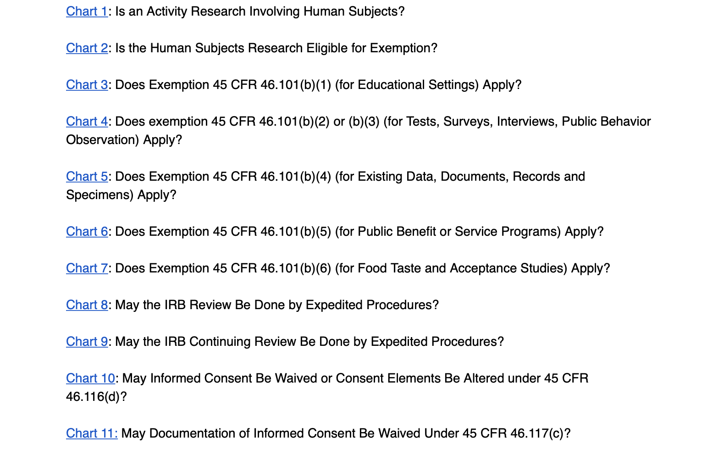
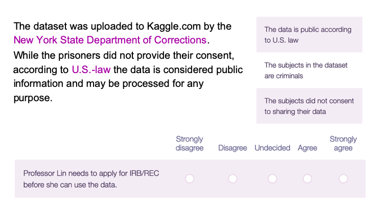
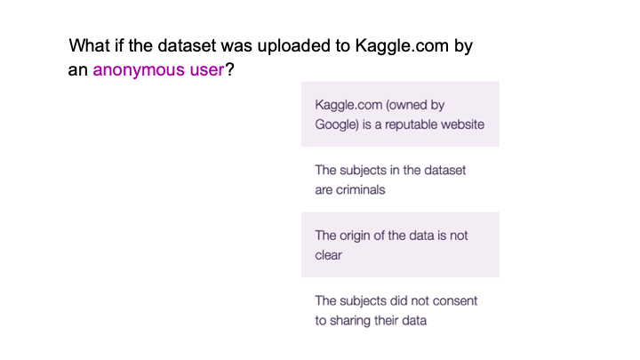
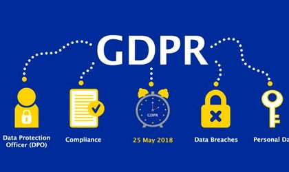
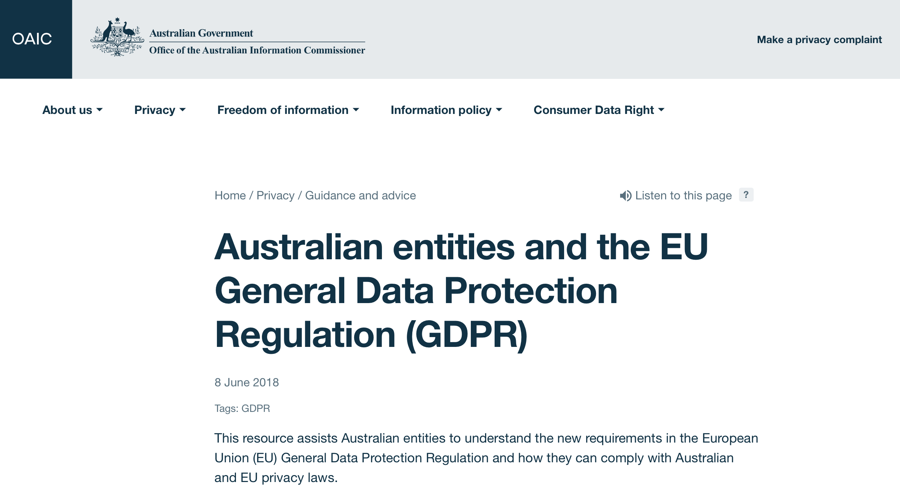
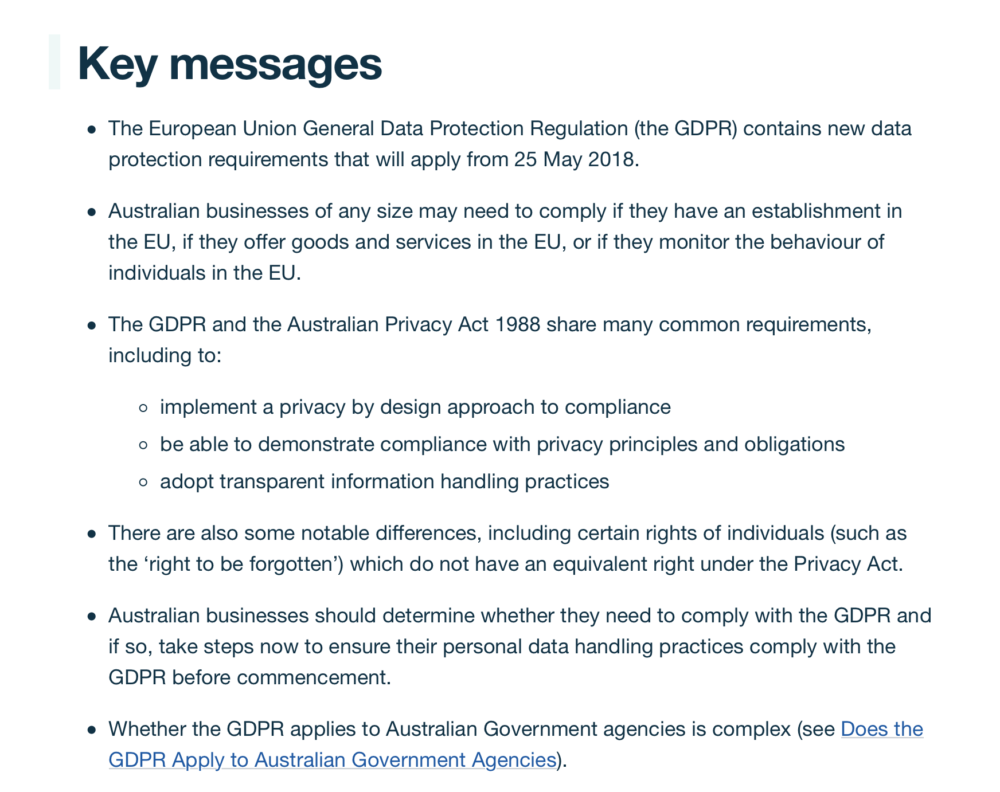
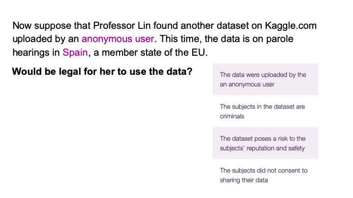

```{r titleslide, child="components/titleslide.Rmd"}
```

```{r}
library(tidyverse)
library(readr)
library(leaflet)
library(ggmap)
```


---
# Today's lecture
- Talk about ethics in statistical research
- Research and human subject research
- Data protection
- Ethics and AI
- The internet of things


---
class: motivator middle
# Statistics and ethics


---
# Statistics and ethics

"The principle that one should present data as honestly as possible
is a fine starting point but does not capture the dynamic nature of
science communication: audiences interpret the statistics (and the
paragraphs) they read in the context of their understanding of the
world and their expectations of the author, who in turn has various
goals of exposition and persuasion – and all of this is happening
within a competitive publishing environment, in which authors of
scientific papers and policy reports have incentives to make dramatic claims."

**Reading ** .blue[Gelman, Andrew. "Ethics in statistical practice and 
communication: Five recommendations." (2018).]


---
# Statistics and ethics 
- Open data and open methods
- Be clear about the information that goes
into statistical procedures
- Create a culture of respect for data
- Publication of criticisms
- Respect the limitation of statistics

**Reading ** .blue[Gelman, Andrew. "Ethics in statistical practice and 
communication: Five recommendations." (2018).]


---

# JASA statistical ethical practises

Ethical Guidelines for Statistical Practice are intended
to help statistics practitioners make decisions ethically

```{r out.width = '60%', echo = FALSE}

```
https://www.amstat.org/ASA/Your-Career/Ethical-Guidelines-for-Statistical-Practice.aspx
https://www.amstat.org/asa/files/pdfs/EthicalGuidelines.pdf

---

# JASA statistical ethical practises

- Profesional integrity and accountability
- Integrity of data and methods
- Responsibilities to Science/Public/Funder/Client
- Responsibilities to Research Subjects
- Responsibilities to Research Team Colleagues
- Responsibilities to Other Statisticians or Statistics Practitioners
- Responsibilities Regarding Allegations of Misconduct
- Responsibilities of Employers, Including Organizations,
Individuals, Attorneys, or Other Clients Employing Statistical Practitioners


---
class: motivator middle
# Human Research


---
class: left, center
# Research and human subjects research?

- Definition of research?
- What do you understand by subjects research?


---
class: left, middle
# Legal definitions

- Internationally widely accepted definition: Federal Policy for the Protection
of Human Subjects also known as Common Rule (45 CFR 46)

   + .bold[Research] means a systematic investigation, including research development, 
testing, and evaluation, designed to develop or contribute to generalizable 
knowledge.


---

# Legal definitions

- **Human subject**  means a living individual about whom an investigator 
(whether professional or student) conducting research: 

   + (i) Obtains information or biospecimens through intervention or interaction
   with the individual, and, uses, studies, or analyzes the information or 
   biospecimens; or 
   + (ii) Obtains, uses, studies, analyzes, or generates identifiable private
   information or identifiable biospecimens.

** Different countries** might have their own specific definition.
---
class:left , middle
# Studies on people

Consider a study that has been done using data on **people**:

- Is that study **"human subject research"**?


---
# How do we know if our study is "human subjects research"?

.grid[

.item[.blue[Examples:]
    - All surveys
    - All experiments involving humans
    - Many quasi-experiments
    - Some observational studies
**How to figure it out?**
    - Use HHS decision chart
    - Consult social science researchers
    - Consider policies of your 
    target journal or 
    top journal in your research area
]
.item[
```{r out.width = '100%', echo = FALSE}
knitr::include_graphics("images/HsubResearch.png")
```

]
]

---
class: left middle
# Be careful with!

-We don't need to do this in Australia

-But it's just a survey!


---

# Why does human subjects require more?

- Nuremberg Code 1947
- Declaration of Helsinki, Recommendations Guiding Medical
Doctors and Biomedical Research Involving Human Subjects 1964
- Henry Beecher (Harvard anestheisologists), 1966: "Well-meaning
doctors can behave unethically
- Tuskegee Syphlis study 1932-1972


---

# Why does human subjects require more?

.blue[Non-medical troubling experiments]

- Milgram Obedience to Authority study 1963
- Tearoom trade 1970
- Stanford Prison STudy 1971


---

# Three Ethical Principles

## Belmont Report and Federal Regulations

- Belmont Report 1979: Three ethical principles to guide
human subjects research
   * REspect for persons
   * Beneficence
   * Justice
   
## Federal Regulations - Implementation of Belmont report:
- Specify what research must be approved
- Specify criteria for approval of research


---
class: middle, center
# Five Unethical experiments Ethical Principles

<center>
<iframe width="560" height="315" src="https://www.youtube.com/embed/86zWBjDaXPk" frameborder="0" allow="accelerometer; autoplay; encrypted-media; gyroscope; picture-in-picture" allowfullscreen></iframe>
</center>

---
# In practice

.blue[Universities and organizations conducting government funded 
research havea an  ethics committee/s]:

- .blue[IRB]->Insitutional review board
- .blue[REC] -> Research ethics Committee
- .blue[HREC]-> Human Research Ethics Coimmitee) ]

### Ethics committee

1. **Responsible for overseeing research with human subjects**
2. **Researchers must submit proposal to HREC before collecting data**
3. **Review designed to protect subjects, researchers and institutions**


---

# Australia


```{r out.width = '100%', echo = FALSE}

```

---

# Australia

## Department of Health Human Research Ethics

Human Research Ethics (HRECs) play a central role in the Australian system of ethical
oversight of research involving humans. HRECs review research proposals involving human
participants to ensure that they are thically acceptable and in accordance with relevant
standards and guidelines.
Any research involving humans or equiring access to personal information, requires approval 
form a Human Research Ethics Committee (HREC) that is registered with the 
National Health and Medical REsearch Council (NHMRC)


---
class: left, middle
# Australia

In June 2018, the ARC, National Health and Medical Researcj Council (NHMRC) and
Universities Australia (the co-authors) issued the Australian Code for the Responsible
Conduct of Research 2018 (the Code) and the Guide to Managing and Investigating Potential
Breaches of the Code (The investigation guide)


---
# Code of Federal Regulations

- Risks to subjects are minimize (beneficence).
- Riks are reasonable in relation to benefits (beneficence).
- Selection of subjects is equitable (justice)
- Provisions are adequate to monitor the data and ensure its 
confidentiality and the safety of subjects (beneficence).

---
# Code of Federal Regulations

- Informed consent obtained (*) (respect for persons)
   + Information
   + Comprehension
   + Voluntary agreement
- Infomred consent documented (respect for persons)
- Safeguards for vulnerable populations (respect for persons)

(*May be waved or altered)

---

# Ethics in statistical studies

```{r out.width = '100%', echo = FALSE}
knitr::include_graphics("images/asa.png")
```


---

# Ethics applications (source??)

```{r out.width = '100%', echo = FALSE}

```

---

# Excemptions

"Research activities in which the only involvement of 
human subjects will be: educational tests, survey procedures or observation of 
public behaviour" are .red[exempt] unless

- Info is recorded in such a way that human subjects can be identified
- Any disclosure of the human subjects' responses ... could reasonably 
place subjects at risk of criminal or civil liability or be damaging
to the subjects' financial standin, employability or reputation


---
# Practical case:

Consider a study that has been done using data on human subjects.

Would the study need an HREC application? (reg/expedited/exempt)

https://www.hhs.gov/ohrp/regulations-and-policy/decision-charts


---
# Three application types: Regular/Expedited/Exempt

```{r out.width = '100%', echo = FALSE}

```
https://www.hhs.gov/ohrp/regulations-and-policy/decision-charts


---
# Regular

--- 
# Expedited

---
# Exempt


---
# Scenario

Bonny Lin is a statistics professor at an Australian university.
She would like to apply for a research grant on "Machine Learning
for Government Applications", and needs to collect initial data for
writing her proposal.Professor Lin found a dataset on Kaggle.com
that particularly raised her interest. Someone has uploaded parole
hearing data from New York State. Parole hearings are scheduled when
a prisoner becomes eligible for parole. The dataset includes the names,
ID numbers, race, criminal offence and conviction of prisoners.

---
# Scenario

```{r out.width = '100%', echo = FALSE}
knitr::include_graphics("images/table.jpg")
```

---
# Scenario

```{r out.width = '100%', echo = FALSE}

```

---
# Scenario

```{r out.width = '100%', echo = FALSE}

```


---
class: motivator middle

# Globally: data protection regulation

---

# General Data Protection Regulation (GDPR)

In May 25, 2018 the European Union agreed on introducing the General Data Protection Regulation (GDPR) framework.
This new framework approved by all the member states is designed to modernise the laws that protect the personal information of individuals living in the EU and constitude one of the strongest date protection rule in the world.


```{r out.width = '60%', echo = FALSE}

```

---

# Implications: General Data Protection Regulation 
Under this new framework:

- Companies are accountable for the handling of people's personal information.
- Including data protection policies, data protection impact assessments as well as providing relevant documentation on
how indivuals date is processed and used.
- Under this new framework EU regulators can fine business that do not comply with the regulation. Also if there is a breach 
in data security companies can be fined.

---
# Europe

Europe is now covered by the world's strongest data protection rules. The mutually agreed General Data Protection Regulation (GDPR) came into force on May 25, 2018, and was designed to modernise laws that protect the personal information of individuals.

That affects to all the parties working with any of the members of the EU.

https://gdpr-info.eu

---

# Global effect: GCPR in Australia

.grid[

.item[
```{r out.width = '100%', echo = FALSE}

```
https://www.oaic.gov.au/privacy/guidance-and-advice/australian-entities-and-the-eu-general-data-protection-regulation/

]
.item[
```{r out.width = '100%', echo = FALSE}

```
]]


---
# Scenario

```{r out.width = '100%', echo = FALSE}

```

---
class: motivator middle
# Ethics and AI


---

# Ethics and Artifitial Intelligence (AI)

<center>
<iframe src="http://content.jwplatform.com/players/fEYhsgl2-QdSUjqI8.html" width="480" height="270" frameborder="0" scrolling="auto"></iframe>
</center>


https://partners.wsj.com/intel/the-ethics-of-artificial-intelligence/
https://bigthink.com/Intel-The-Nantucket-Project/future-of-artificial-intelligence


---
# Ethics of AI
**Scenario**
- Imagine, in the near future, a bank using a machine learning algorithm to recommend mortgage applications for approval.
-A rejected applicant brings a lawsuit against the bank, alleging that the algorithm is discriminating racially against mortgage applicants. 
- The bank replies that this is impossible, since the algorithm is deliberately blinded to the race of the applicants. 
- What could possibly be happening?
- Finding an answer may not be easy --> it might boiled than to understand the methods (neural network/genetic algorithm/ decision tres/bayesian networks)


https://intelligence.org/files/EthicsofAI.pdf


---
# Food for thought
- "But when AI algorithms take on cognitive work with social dimensions-cognitive
tasks previously performed by humans—the AI algorithm inherits the social requirements. "
- "It will also become increasingly important that AI algorithms be robust against manipulation"

https://intelligence.org/files/EthicsofAI.pdf

---
# Ethics and AI

.blue[The Centre for Data Ethics and Innovation, UK:]

- Data: Do organizations and regulators have access to the dat they require to adequately identify and mitigate bias?
- Tools and techniques: What statistical nd technical solutions are available now or will be required in fgure to identify and mitigate bias and which represent best practise?
- Governance: Who should be responsible for governing, auditing and assuring these algorithm decision-making systems?

https://www.gov.uk/government/publications/interim-reports-from-the-centre-for-data-ethics-and-innovation/interim-report-review-into-bias-in-algorithmic-decision-making


