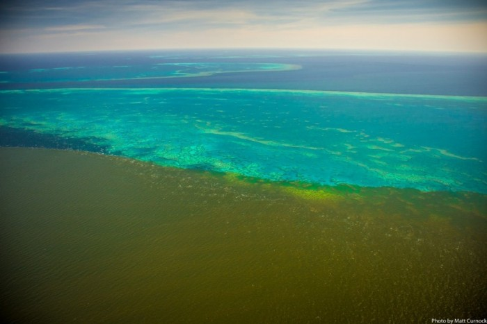
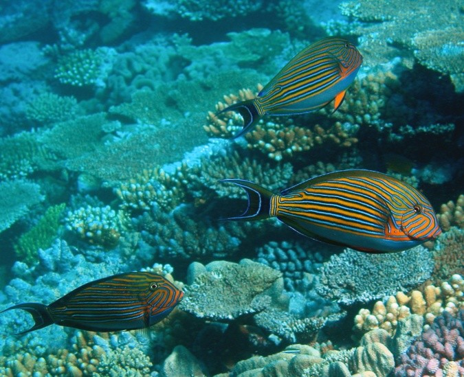
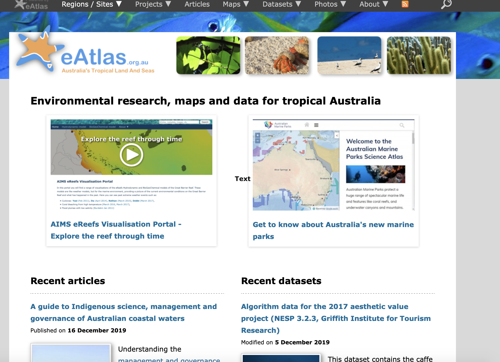

```{r titleslide, child="components/titleslide.Rmd"}
```
```{r}
library(tidyverse)
library(readr)
library(leaflet)
library(ggmap)
```

---

# The magnificent Great Barrier Reef

* The Australian Great Barrier Reef is one the world natural wonders and source of XX to the Australia 
economy

.grid[

.item[

https://eatlas.org.au/rrmmp/gbr-jcu-water-quality
]
.item[

https://eatlas.org.au/media/2
]
]

---

# Reef managment: Marine Monitoring

- Coral cover trends over time
- Fish abundance
- Reef condition
- Crown of Thorn Star fish

---

# Context and background reading

* Monitoring the Great Barrier Reef, why and how?
https://www.aims.gov.au/docs/research/monitoring/reef/reef-monitoring.html

* Sampling methods
https://www.aims.gov.au/docs/research/monitoring/reef/sampling-methods.html

https://www.aims.gov.au/reef-monitoring/cape-grenville-2019


---

# Data eatlas of Australia



---

# Obtaining data I

* eatlas: Long term marine monitoring program (LTMP):

https://eatlas.org.au/gbr/ltmp-data

* Metadata : 

https://apps.aims.gov.au/metadata/view/5bb9a340-4ade-11dc-8f56-00008a07204e

---

# Monitoring locations on

```{r , echo = FALSE}
manta <- read_csv("Data/manta-tow-by-reef/manta-tow-by-reef.csv", col_types = cols())

cb_bbox <- make_bbox(lon = manta$LONGITUDE, 
                     manta$LATITUDE, f = 0.9) 

leaflet() %>%
  # Base group
  addProviderTiles(providers$Esri.WorldImagery, group="Satellite") %>%
  # Add reciever location data
  addCircles(
    lng = manta$LONGITUDE, 
    lat = manta$LATITUDE, 
    fill=TRUE, color="sienna",
    weight=1,
    radius = 1,
    #color = ~pal(col),
    stroke = FALSE, fillOpacity = 0.5)
```

---

# Data --> Long term marine monitoring program (LTMP)

```{r , echo = FALSE}
ggplot(data = manta,
       aes(
         x = LONGITUDE,
         y = LATITUDE, 
         color = SECTOR)
       ) +
  geom_point() +
  theme_bw()
  
```
---

---

# Understanding the GBR structure

```{r , echo = FALSE}
manta %>%
  distinct(SECTOR, SHELF, REEF_NAME) %>%
  head()
```
---

# Data --> Reefs and location in the shelf

```{r , echo = FALSE, font = 10 }
manta %>% 
  dplyr::select(REEF_NAME, SHELF) %>%
  distinct() %>%
  head()
  
```


---

# Obtaining data II

* eatlas: Marine monitoring program (MMP)

https://eatlas.org.au/gbr/ltmp-data

* Metadata : https://apps.aims.gov.au/metadata/view/5bb9a340-4ade-11dc-8f56-00008a07204e

---

# Long term monitoring program

```{r , echo = FALSE}
mmp <- read_csv("Data/mmp_hc_sc_a_by_site/mmp_hc_sc_a_by_site.csv", col_types = cols())
names(mmp)
```

---

# Marine Monitoring program
```{r , echo = FALSE}
names(mmp)
```
---

# Marine Monitoring program

```{r , echo = FALSE}
 mmp %>%
  group_by(NRM_REGION) %>%
  ggplot(aes(x = NRM_REGION, y = COVER, color = GROUP_CODE)) +
  geom_boxplot() +
  facet_wrap(~ GROUP_CODE) +
  xlab("REGION") +
  ylab("COVER")
  
```

---


# Marine Monitoring program

```{r , echo = FALSE}
 mmp %>%
  filter(NRM_REGION == "Burdekin", GROUP_CODE == "Hard Coral", SITE_NO == "1") %>%
  group_by(YEAR_CODE, MMP_SITE_NAME, DEPTH)  %>%
  ggplot(aes(x = YEAR_CODE, y = COVER, color = MMP_SITE_NAME)) +
  geom_line() +
  geom_point() +
  facet_wrap(~ DEPTH)
  
  
```

---


# Monash Brand Colors

.grid[

.item[

## Primary colors

* <div class="monash-bg-blue inline-box"></div> monash-bg-blue
* <div class="monash-bg-gray80 inline-box"></div> monash-bg-gray80
* <div class="monash-bg-gray50 inline-box"></div> monash-bg-gray50
* <div class="monash-bg-gray10 inline-box"></div> monash-bg-gray10
* <div class="monash-bg-black inline-box"></div> monash-bg-black 
* <div class="monash-bg-white inline-box"></div> monash-bg-white 

Removing the "`bg-`" will change the text color instead.
E.g. .monash-blue[monash-blue].

]
.item[

## Secondary colors

* <div class="monash-bg-blue2 inline-box"></div> monash-bg-blue2
* <div class="monash-bg-purple2 inline-box"></div> monash-bg-purple2
* <div class="monash-bg-fuchsia2 inline-box"></div> monash-bg-fuchsia2
* <div class="monash-bg-ruby2 inline-box"></div> monash-bg-ruby2
* <div class="monash-bg-pink2 inline-box"></div> monash-bg-pink2 
* <div class="monash-bg-red2 inline-box"></div> monash-bg-red2 
* <div class="monash-bg-orange2 inline-box"></div> monash-bg-orange2
* <div class="monash-bg-umber2 inline-box"></div> monash-bg-umber2
* <div class="monash-bg-olive2 inline-box"></div> monash-bg-olive2 
* <div class="monash-bg-green2 inline-box"></div> monash-bg-green2 


]
]


---


```{r endslide, child="components/endslide.Rmd"}
```
