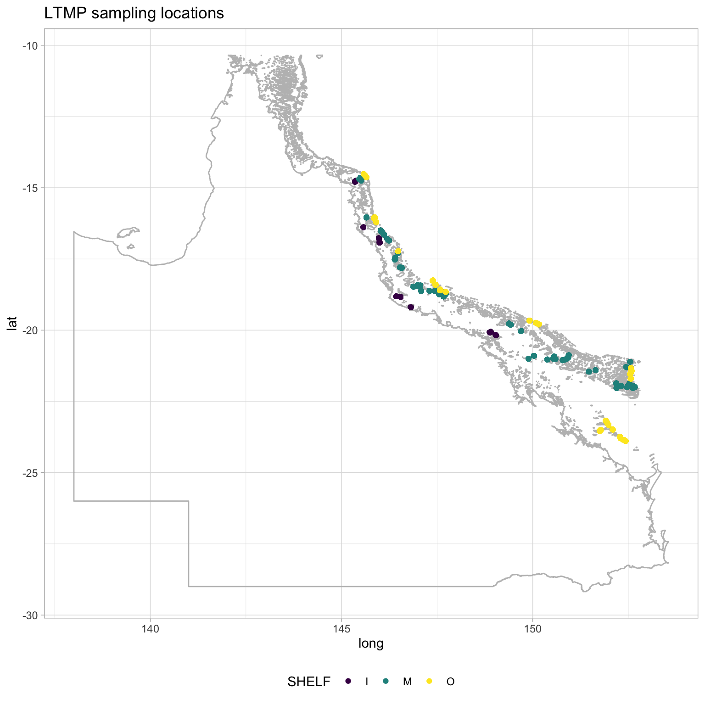
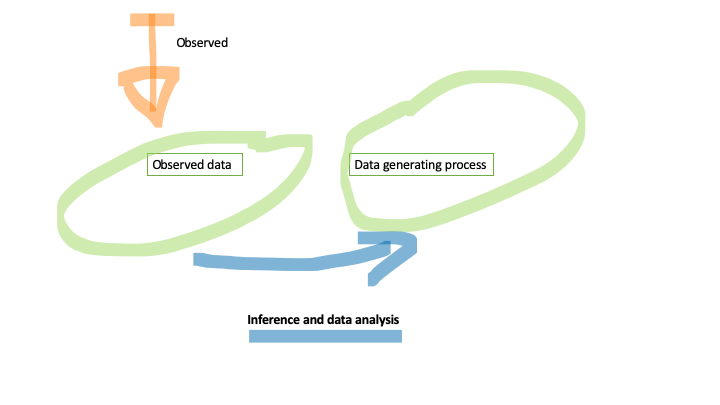
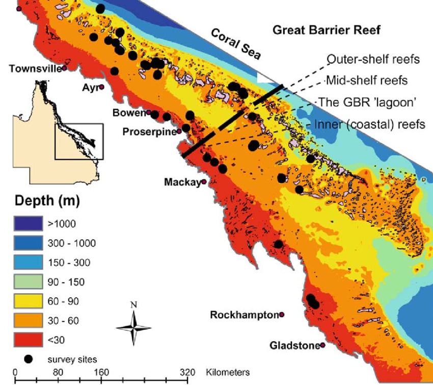
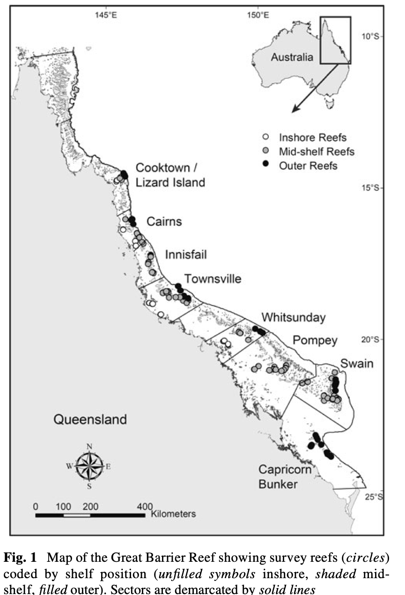
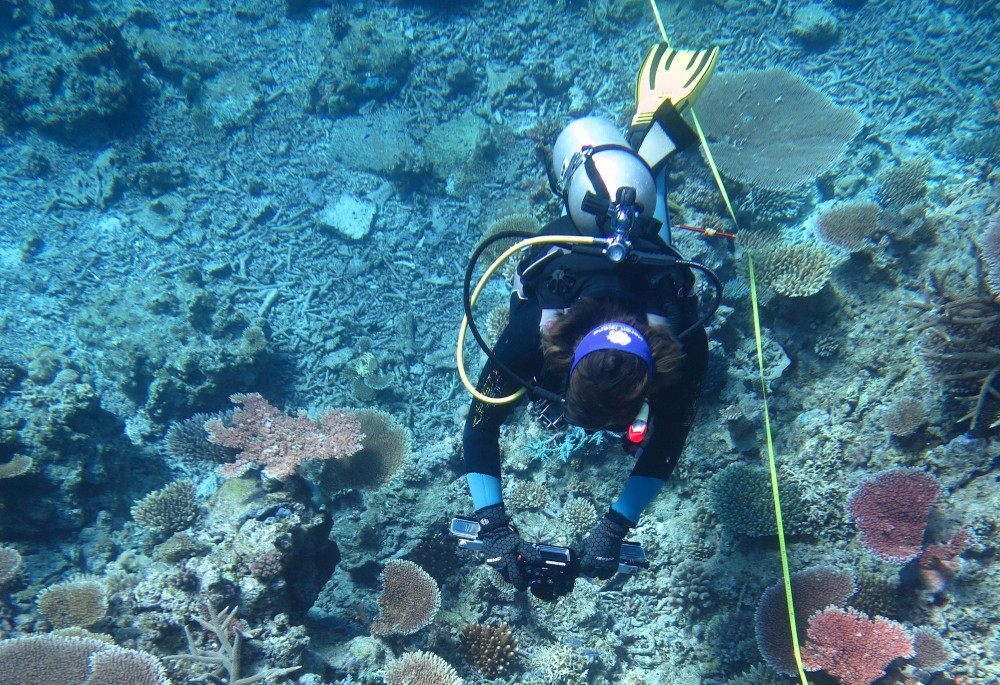

```{r titleslide, child="components/titleslide.Rmd"}
```


```{r , echo = FALSE, warning = FALSE, message = FALSE}
library(tidyverse)
library(readr)
library(leaflet)
library(ggmap)
library(knitr)
library(kableExtra)
library(aimsdataplatform)
library(lubridate)
library(gridExtra)
```


---
background-image: url("images/GBR.jpg")
background-size: cover


---
# Two monitoring programs in the GBR
<br><br>

- LTMP: For over 30 years, AIMS has been surveying the health of 47 midshore and offshore reefs across 
the Great Barrier Reef region. The Long-term Monitoring Program represents the longest continuous record 
of change in reef communities. 

- MMP: Inshore reefs (those that can be reached from shore by a small boat) are vulnerable to 
more threats than those further from shore. 32 inshore reefs are monitored under the Great Barrier 
Reef Marine Park Authority’s Marine Monitoring Program.


---
# Learnt to use leaflet for mapping


```{r , echo = FALSE, fig.align = "center", cache = TRUE}
library("tidyverse")
library(leaflet)

ltmp <- read_csv(file = "data/ltmp_hc_sc_a_by_site/ltmp_hc_sc_a_by_site.csv", col_types = cols())
mmp <- read_csv(file = "data/mmp_hc_sc_a_by_site/mmp_hc_sc_a_by_site.csv", col_types = cols())

cb_bbox <- make_bbox(lon = ltmp$LONGITUDE, 
                     ltmp$LATITUDE, f = 0.9) 

leaflet(data = ltmp) %>%
  # Base group
  addProviderTiles(providers$Esri.WorldImagery, group="Satellite") %>%
  # Add reciever location data
  addCircles(
    lng = ltmp$LONGITUDE, 
    lat = ltmp$LATITUDE, 
    fill=TRUE, color="sienna",
    weight=1,
    radius = 1,
    #color = ~pal(col),
    stroke = FALSE, fillOpacity = 0.5)
```


---
# Learnt to create maps using shape files
<br><br>

```{r out.width = '60%', echo = FALSE, fig.align = "center"}

```

---
# This week 
<br>
<br>
- Simple inference 
- Understand variability
- Visualization
- Linear regression

---
# Data and inference

```{r out.width = '100%', echo = FALSE}

```

---
# Time series: measurements over time
Hard coral cover for Cairns sector for sites 1 and 2

```{r , echo = FALSE, fig.alig = "center"}
ltmp %>% dplyr::filter(GROUP_CODE == "Hard Coral",
                           SECTOR == "CA",
                           SITE_NO %in% c("1", "2")) %>%
  mutate(REEF_NAME = as.factor(REEF_NAME)) %>%
ggplot(aes( x= SAMPLE_DATE, y = COVER, color = REEF_NAME)) +
  geom_line() +
  facet_wrap(~SITE_NO, ncol = 1)  +
  xlab("Year") +
  ylab("Hard Coral Cover") +
  theme(legend.position="bottom") +
  ggtitle("Cairns sector")
  
```


---
# What is a time series?
<br><br>
- Observations taken over time.
- More  formally:
<br><br>
.info-box[
   A time series is a set of time-ordered observations measuring a quantitative characteristic of a process taken at consecutive  periods or  points of timeline (equally or unequally spaced).
   ]
- Typically in this kind of data there is a time dependency. .blue[Why? What does that mean?]


---
background-image: url("images/GBR.jpg")
background-size: cover
# Visualizing time series
<br><br>
- Graphs enable us to visualize the features of the data, including patterns, unusual observations, changes over time, and relationships between variables.
- For time series data, we should start with a time plot where the observations are plotted against the time of observation, with consecutive observations joined by straight lines.


---
# Choosing the right plot is crucial!

Question: Is this an informative figure?
```{r , echo = FALSE, fig.align = "center"}
fig1 = ltmp %>% dplyr::filter(GROUP_CODE == "Hard Coral",
                           SHELF == "O",
                           SITE_NO %in% c("1")) %>%
  mutate(REEF_NAME = as.factor(REEF_NAME)) %>%
ggplot(aes( x= SAMPLE_DATE, y = COVER, color = REEF_NAME)) +
  geom_line() +
  facet_wrap(~SITE_NO, ncol = 1)  +
  theme(legend.position="none") +
  xlab("Year") +
  ylab("Hard Coral Cover") +
  ggtitle("GBR Outer shelf")
 
fig1 
```


---
# Time series patterns
<br>

 - Trend:
  A trend exists when there is a long-term increase or decrease in the data. It does not have to be linear. Sometimes we refer to a trend as “changing direction”, when it might go from an increasing trend to a decreasing trend. 
 [Hyndman and Athanasopoulos, 2016](https://otexts.com/fpp2/)

 - There are others patterns in time series that such as seasonal and cycles.
 - In this lecture we are focusing in trends.


---
# Positions in the shelf 
<br>
```{r out.width = '50%', echo = FALSE, fig.align = "center", message = FALSE}

```

---
# Positions in the sectors
<br>
```{r out.width = '40%', echo = FALSE, fig.align = "center", message = FALSE}

```


---
# Summarizing data
Hard coral cover condition in the outer shelf:

```{r , echo = FALSE, fig.align= "center", fig.width= 14}
fig2 =ltmp %>% dplyr::filter(GROUP_CODE == "Hard Coral",
                           SHELF == "O",
                           SITE_NO %in% c("1", "2", "3")) %>%
  mutate(REEF_NAME = as.factor(REEF_NAME),
         Year = year(SAMPLE_DATE)) %>%
  group_by(SHELF, Year) %>%
  summarize_at(vars(COVER), list(covermean = mean, coversd = sd)) %>%
  ggplot(aes( x= Year, y = covermean)) +
  geom_line(color = "blue", size = 1.2) +
  theme(legend.position="none") +
  xlab("Year") +
  ylab("Hard Coral Cover") +
  ggtitle("GBR outer Shelf")
  
grid.arrange(fig1, fig2, ncol = 2)
```


---
# Hard coral cover condition in the CB and WH regions

GBR condition:

```{r , echo = FALSE, fig.align = "center"}
fig2 =ltmp %>% dplyr::filter(GROUP_CODE == "Hard Coral",
                             SECTOR == "CB") %>%
  mutate(REEF_NAME = as.factor(REEF_NAME),
         Year = year(SAMPLE_DATE)) %>%
  group_by(SHELF, SECTOR, Year) %>%
  summarize_at(vars(COVER), list(covermean = mean, coversd = sd)) %>%
  ggplot(aes( x= Year, y = covermean)) +
  geom_line(color = "blue", size = 1.2) +
  facet_wrap(~SHELF) +
  theme(legend.position="none") +
  xlab("Year") +
  ylab("Hard Coral Cover") +
  ggtitle("Cape Bunkerregion")


fig3 =ltmp %>% dplyr::filter(GROUP_CODE == "Hard Coral",
                             SECTOR == "SW") %>%
  mutate(REEF_NAME = as.factor(REEF_NAME),
         Year = year(SAMPLE_DATE)) %>%
  group_by(SHELF, SECTOR, Year) %>%
  summarize_at(vars(COVER), list(covermean = mean, coversd = sd)) %>%
  ggplot(aes( x= Year, y = covermean)) +
  geom_line(color = "blue", size = 1.2) +
  facet_wrap(~SHELF) +
  theme(legend.position="none") +
  theme_bw() +
   xlab("Year") +
  ylab("Hard Coral Cover") +
  ggtitle("Swain region")

grid.arrange(fig2, fig3, ncol = 1)
```


---
# Algae condition in the Swain and Whitsunday regions

```{r , echo = FALSE, fig.align = "center"}
fig4 =ltmp %>% dplyr::filter(GROUP_CODE == "Algae",
                             SECTOR == "WH") %>%
  mutate(REEF_NAME = as.factor(REEF_NAME),
         Year = year(SAMPLE_DATE)) %>%
  group_by(SHELF, SECTOR, Year) %>%
  summarize_at(vars(COVER), list(covermean = mean, coversd = sd)) %>%
  ggplot(aes( x= Year, y = covermean)) +
  geom_line(color = "blue", size = 1.2) +
  facet_wrap(~SHELF) +
  theme(legend.position="none") +
  xlab("Year") +
  ylab("Hard Coral Cover") +
  ggtitle("Algae abundance in the Whitsunday region")


fig5 =ltmp %>% dplyr::filter(GROUP_CODE == "Algae",
                             SECTOR == "CB") %>%
  mutate(REEF_NAME = as.factor(REEF_NAME),
         Year = year(SAMPLE_DATE)) %>%
  group_by(SHELF, SECTOR, Year) %>%
  summarize_at(vars(COVER), list(covermean = mean, coversd = sd)) %>%
  ggplot(aes( x= Year, y = covermean)) +
  geom_line(color = "blue", size = 1.2) +
  facet_wrap(~SHELF) +
  theme(legend.position="none") +
  xlab("Year") +
  ylab("Hard Coral Cover") +
  ggtitle("Algae abundance in the Cape Bunker region")

grid.arrange(fig4, fig5, ncol = 1)
```


---
# Focus: research question
<br> <br>
- For your data analysis --> it is essential to have a research question or questions.
- A research question will enable you to focus on the right data and context.
- Most likely you will need to do a fair bit of data wrangling --> which is essential!
- Visualize the data first!


---
# Example: LTMP reports
```{r out.width = '80%', echo = FALSE, fig.align = "center"}

```
[LTMP reports](https://www.aims.gov.au/docs/research/monitoring/reef/latest-surveys.html)

---
# Let's talk about sample means
<br><br>
Are means enough to explain the GBR condition the GBR?
<br><br>
- Sample mean --> summary statistic --> statistical inference.
- Do we have any information about the data variability by just studying the mean?


---
# Time series measurements: replicates
<br>
Replicates?
<br>
```{r , echo = FALSE, fig.align = "center"}
ltmp %>% dplyr::filter(GROUP_CODE == "Hard Coral",
                           REEF_NAME %in% c("HAVANNAH REEF",
                                            "FITZROY ISLAND REEF",
                                            "MOORE REEF",
                                            "LIZARD ISLAND"), 
                           SITE_NO %in% c("1", "2", "3")) %>%
  mutate(SITE_NO = as.factor(SITE_NO)) %>%
  mutate(REEF_NAME = as.factor(REEF_NAME)) %>%
ggplot(aes( x= SAMPLE_DATE, y = COVER,  color = SITE_NO)) +
  geom_line() +
  facet_wrap(~REEF_NAME, ncol = 1)
  
```

---
# Why do we need replicates?

<br><br>
- Replication is the repetition of an experimental condition so that the variability associated with the phenomenon can be estimated. 
<br>
```{r out.width = '50%', echo = FALSE, fig.align = "center"}

```


---
# Which information can we obtain from the replicates?
Variability! BOX PLOT figure

```{r , echo = FALSE, fig.align = "center"}
values = c(rep(100, 100), rnorm(100, sd = 2))
gr = factor(c(rep(1, 100), rep(2,100)))
x  = rep(1:100, 2)

dat = data.frame(x = x, values = values,gr = gr)

p1= ggplot(dat) +
  geom_boxplot(aes(x = x, y = values, group = gr), stat = "boxplot") +
  facet_wrap(~ gr, scales ="free")

p1
```
---
## Variability intuition


- .blue[Sample] of size 3 $x_1, x_2, x_3$ $\rightarrow$ sample mean $\frac{x_1 + x_2 + x_3}{3}$
-  $x_1= 1, x_2 = 1, x_3 = 1$ $\rightarrow$ sample mean $\frac{x_1 + x_2 + x_3}{3} = 1$
- .blue[Variance] $\rightarrow$ measure of variability in my sample $\rightarrow$ 0
-  $x_1= 1, x_2 = 2, x_3 = 3$ $\rightarrow$ sample mean $\frac{x_1 + x_2 + x_3}{3} = 2$
- .blue[Variance] $\rightarrow$ measure of variability in my sample $\rightarrow$ 1 (*var()*)
-  The .blue[standard deviation] (often called sd --> *sd()*) is the square mean of the variance and  
measures of variability reported in the same units as our data.


---
# Overall mean trend for the CA sector 

Considering 3 sites, here we display the overall mean trend together with a measure of variability.


```{r , echo = FALSE, fig.align = "center"}
library(lubridate)

plot1dat = ltmp %>% dplyr::filter(GROUP_CODE == "Hard Coral",
                           SECTOR == "CA",
                           SITE_NO %in% c("1", "2", "3")
                           ) %>%
  mutate(REEF_NAME = as.factor(REEF_NAME),
         Year = year(SAMPLE_DATE)) %>%
  group_by(SECTOR, SHELF, Year) %>%
  summarize_at(vars(COVER), list(covermean = mean, coversd = sd))

ggplot(plot1dat, aes( x= Year, y = covermean)) +
  geom_line() +
  facet_wrap(~SHELF, ncol = 1)
  
```


---
# Overall trend for CA sector with uncertainty

```{r , echo = FALSE, fig.align = "center"}

plot2dat = ltmp %>% dplyr::filter(GROUP_CODE == "Hard Coral",
                           SECTOR == "CA",
                           SITE_NO %in% c("1", "2", "3")
                           ) %>%
  mutate(REEF_NAME = as.factor(REEF_NAME),
         Year = year(SAMPLE_DATE)) %>%
  group_by(SECTOR, SHELF, Year) %>%
  #summarize_at(vars(COVER), funs(mean, sd)) %>%
  summarize_at(vars(COVER), list(covermean = mean, coversd = sd)) %>%
  mutate(upper = covermean + coversd,
         lower = covermean - coversd)


ggplot(plot2dat, aes( x = Year, y = covermean)) +
  geom_line() +
  geom_pointrange(aes(ymin=lower, ymax=upper)) +
  facet_wrap(~SHELF, ncol = 1)
```


---
# Is there anything missing in the calculations?

Standard errors --> *sd/sqrt(n)* with *n* being the number of samples used to calculate the mean.

```{r , echo = FALSE, fig.align = "center"}

plot2dat = ltmp %>% dplyr::filter(GROUP_CODE == "Hard Coral",
                           SECTOR == "CA",
                           SITE_NO %in% c("1", "2", "3")
                           ) %>%
  mutate(REEF_NAME = as.factor(REEF_NAME),
         Year = year(SAMPLE_DATE)) %>%
  group_by(SECTOR, SHELF, Year) %>%
  #summarize_at(vars(COVER), funs(mean, sd)) %>%
  summarize_at(vars(COVER), list(covermean = mean, coversd = sd)) %>%
  mutate(samplesize = n()) %>%
  mutate(upper = covermean + coversd/sqrt(samplesize),
         lower = covermean - coversd/sqrt(samplesize))


ggplot(plot2dat, aes( x = Year, y = covermean)) +
  geom_line() +
  geom_pointrange(aes(ymin=lower, ymax=upper)) +
  facet_wrap(~SHELF, ncol = 1)
```


---
# Overall trend for CA sector with variability

```{r , echo = FALSE, fig.align = "center"}

plot2dat = ltmp %>% dplyr::filter(GROUP_CODE == "Hard Coral",
                           SECTOR == "CA",
                           SITE_NO %in% c("1", "2", "3")
                           ) %>%
  mutate(REEF_NAME = as.factor(REEF_NAME),
         Year = year(SAMPLE_DATE)) %>%
  group_by(SECTOR, SHELF, Year) %>%
  summarize_at(vars(COVER), list(covermean = mean, coversd = sd)) %>%
  mutate(upper = covermean + coversd,
         lower = covermean - coversd)


ggplot(plot2dat, aes( x = Year, y = covermean)) +
  geom_line() +
  geom_ribbon(aes(ymin = lower, ymax = upper), fill = "blue", alpha = 0.4) +
  facet_wrap(~SHELF, ncol = 1)
```

---
# Overall trend for CA sector: variability standard errors

```{r , echo = FALSE, fig.align = "center"}

plot2dat = ltmp %>% dplyr::filter(GROUP_CODE == "Hard Coral",
                           SECTOR == "CA",
                           SITE_NO %in% c("1", "2", "3")
                           ) %>%
  mutate(REEF_NAME = as.factor(REEF_NAME),
         Year = year(SAMPLE_DATE)) %>%
  group_by(SECTOR, SHELF, Year) %>%
  summarize_at(vars(COVER), list(covermean = mean, coversd = sd)) %>%
  mutate(samplesize = n()) %>%
  mutate(upper = covermean + coversd/sqrt(samplesize),
         lower = covermean - coversd/sqrt(samplesize))


ggplot(plot2dat, aes( x = Year, y = covermean)) +
  geom_line() +
  geom_ribbon(aes(ymin = lower, ymax = upper), fill = "blue", alpha = 0.4) +
  facet_wrap(~SHELF, ncol = 1)
```


---
# Remember: Using the right visualizations 

## Example: What happened in Fitzroy island?

```{r , echo = FALSE, fig.align = "center"}
ltmp %>% dplyr::filter(GROUP_CODE %in% c("Algae", "Hard Coral"),
                           REEF_NAME == "FITZROY ISLAND REEF", 
                           SITE_NO %in% c("1", "2", "3")) %>%
  mutate(SITE_NO = as.factor(SITE_NO)) %>%
  mutate(REEF_NAME = as.factor(REEF_NAME)) %>%
ggplot(aes( x= SAMPLE_DATE, y = COVER,  color = SITE_NO)) +
  geom_line() +
  facet_wrap(~GROUP_CODE, ncol = 1)
  
```


---
# Modelling: relationship between different variables 

Here we study the relationship between algae and hard coral cover yearly means.
Comments?

```{r , echo = FALSE, fig.align = "center"}

regdata = ltmp %>% dplyr::filter(GROUP_CODE %in% c("Hard Coral", "Algae"),
                       REEF_NAME == "FITZROY ISLAND REEF") %>%
                   mutate(Year = year(SAMPLE_DATE)) %>%
                   group_by(Year, GROUP_CODE) %>%
                   summarize_at(vars(COVER), list(covermean = mean, coversd = sd), na.rm = TRUE) 


ggplot(regdata, aes(x =  Year, y = covermean)) +
  geom_line() +
  facet_wrap(~GROUP_CODE)
```


---
# Modelling: relationship between algae and hard coral cover

What can we say about this figure? Is the relation clearer here?

```{r , echo= FALSE, fig.align = "center"}
regdataWF = ltmp %>% dplyr::filter(GROUP_CODE %in% c("Hard Coral", "Algae"),
                       REEF_NAME == "LOW ISLANDS REEF") %>%
                   mutate(Year = year(SAMPLE_DATE)) %>%
                   group_by(Year, GROUP_CODE) %>%
                   summarize_at(vars(COVER), list(covermean = mean), na.rm = TRUE) %>%
          pivot_wider(names_from = GROUP_CODE, values_from = covermean) 


ggplot(regdataWF, aes(x = `Hard Coral`, y = Algae)) +
  geom_point() 
 
```


---
# Simple linear regression for prediction

$Y = X\times\beta + \epsilon$

## Using R:
<br>
```{r}
HardCoralcover= regdataWF$`Hard Coral` 

reg = lm(Algae ~ HardCoralcover, data = regdataWF )

```

---
# Simple regression for prediction

```{r ,echo = FALSE, fig.align = "center", message = FALSE, warning= FALSE}

library(effects)
dat.eff <- allEffects(reg)
dat.eff <- data.frame(dat.eff[[1]])
ggplot(dat.eff, aes(y=fit, x= HardCoralcover)) +
  geom_ribbon(aes(ymin = lower, ymax = upper), fill = "blue", alpha = 0.3) +
  geom_line(aes()) +
  theme_bw()+
  theme(legend.position=c(1,0), legend.justification=c(1,0)) 
```


---
# Predicting data

```{r} 

regdataWF$predicted <- predict(reg)
regdataWF$residuals <- residuals(reg)

head(regdataWF)
```

---
# Fit

```{r , echo = FALSE, fig.align = "center"}
ggplot(regdataWF, aes(x = HardCoralcover, y = Algae)) +
  geom_smooth(method = "lm", se = FALSE, color = "lightblue") +
  geom_segment(aes(xend = HardCoralcover, yend = predicted), alpha = .2) +
  geom_point(aes(color = abs(residuals), size = abs(residuals))) + 
  scale_color_continuous(low = "#D19494", high = "#D92626") +
  guides(color = FALSE, size = FALSE) +  # Size legend also removed
  geom_point(aes(y = predicted), shape = 1) +
  theme_bw() +
  ggtitle("Understanding the linear regression")
```


---
# Prediction of algae coverage
<br>
<br>

```{r, echo = TRUE}
new.dat <- data.frame(HardCoralcover = c(15, 19, 20))

predict(reg, newdata = new.dat)
```

---
```{r endslide, child="components/endslide.Rmd"}
```


           


