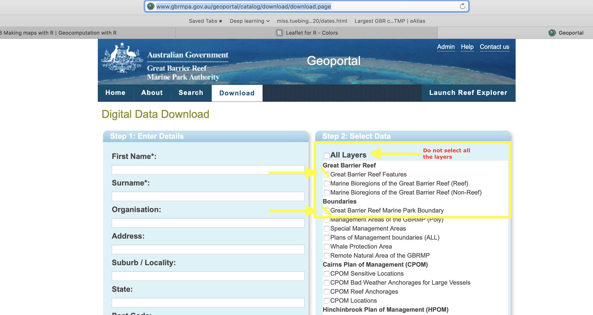

```{r setup, include=FALSE}
knitr::opts_chunk$set(echo = TRUE)
```
\clearpage

\section*{Tutorial Objectives}

- Go through the official channels to get government data from different sources. Both from the Great Barrier Reef Marine Park Authority and the Australian Institute of Marine Science.
- Understand the structure of the Great Barrier Reef monitoring programs using publicly available data. 
- Learn how to produce interactive maps and maps using shape files.
- Produce maps as those reported by the Great Barrier Reef Marine Park Authority  and the Australian Institute of Marine Science both in their official reports and in their scientific papers.
- Have fun and please participate!


# Exercise 1: Getting the data 

## Please visit the following sites to obtain the data sets for the tutorial:

- AIMS (ltmp and mmp): Please download the data for the Long term monitoring program and for the Marine monitor program as indicated in 
the figure below:

```{r out.width = '70%', echo = FALSE, fig.align = "center"}
knitr::include_graphics("Images/monitoring_data.png")
```
[Download link here](https://eatlas.org.au/gbr/ltmp-data)


- Shape files from the: Please select all the layers marked in the figure below.

```{r out.width = '70%', echo = FALSE, fig.align = "center"}

```

[Download link here](http://www.gbrmpa.gov.au/geoportal/catalog/download/download.page)


# Exercise 2: Create a report and read the data

- Create a reproducible Rmd file called *tutorial5.Rmd* that would render into html and make sure the figures that you produce will be automatically store into a folder called *Tutorial5_Images*
- Include relevant R libraries at the top of the file.
- Read data from the Marine monitoring program  (MMP) and form the Long Term Monitoring program (LTMP) and examine the data.
- Create three figures one for the MMP data and two for the LTMP data displaying the sampling locations as follows: Color the locations according to *NRM_Regions* and according to the *sectors*  and *self* as relevant for each data set. Make sure the figures have titles explaining which data set is being used.


# Exercise 3: Creating maps using leaflet

- Create an interactive map displaying sampling locations for the MMP data set. 
- Create an interactive map displaying sampling locations for the LMMP data set.
- Make sure you name the R code chunks so that the figures are stored with the appropriate names.
- Make sure the figures are save into *Tutorial5_Images*


# Exercise 4: Creating maps using shape files

- Using the shape files that you download in Exercise 1 display the sampling locations for the LTMP data set colored according to *SECTOR* (one map for each shape file = two maps)
- Using the shape files that you download in Exercise 1 display the sampling locations for the LTMP data set colored according to *SELF* (one map for each shape file = two maps)
- Make sure you name the R code chunks so that the figures are stored with the appropriate names.
- Make sure the figures are save into *Tutorial5_Images*
<!-- - Create a map for the LTMP sampling locations where the dots are proportional to the size of variable *COVER* and colored according to *SHELF* -->
<!-- - Create a map for the MMP sampling locations where the dots are proportional to the size of variable *COVER* and colored according to *NRM_REGION* -->
<!-- -  -->

