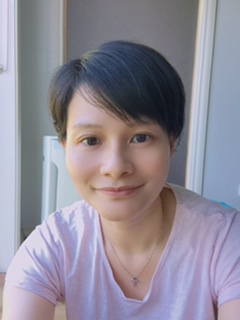

```{r, include = FALSE}
current_file <- knitr::current_input()
basename <- gsub(".Rmd$", "", current_file)

knitr::opts_chunk$set(
  fig.path = sprintf("images/%s/", basename),
  fig.width = 6,
  fig.height = 4,
  fig.align = "center",
  fig.retina = 3,
  echo = TRUE,
  warning = FALSE,
  message = FALSE,
  cache = FALSE,
  cache.path = "cache/"
)
```

```{r titleslide, child="assets/titleslide.Rmd"}
```

---

class: fullscreen

.flex.h-100[
.pa4.w-40.monash-bg-blue.br.white[
.circle-image-200.center[

]

<br>
  

# Di Cook 
*Professor of Business Analytics*  
Monash University

<br>

<i class="fas fa-globe"></i> https://dicook.org/

<i class="fas fa-envelope"></i> ETC5512.Clayton-x@monash.edu

<i class="fab fa-twitter"></i> @visnut

]

.pa5.w-60[

# About your instructor

* Prof Cook moved to Melbourne in Jul 2015 to start my job at Monash
* She has a PhD from Rutgers University, NJ, and a Bachelor of Science from University of New England, Armidale 
* She is a Fellow of the American Statistical Association, elected member of the International Statistical Insitute, an elected member of the R Foundation and the Editor-in-Chief for the R Journal.
* Her main  research is in data visualisation, statistical graphics and computing, with application to sports, ecology and bioinformatics. She likes to develop new methodology and software. 

]


]

---

class: fullscreen

.flex.h-100[
.pa4.w-40.monash-bg-blue.br.white[
.circle-image-200.center[

]

<br>

# Emi Tanaka
*Lecturer in Statistics*  
Monash University

<br>

<i class="fas fa-globe"></i> https://emitanaka.org/

<i class="fas fa-envelope"></i> ETC5512.Clayton-x@monash.edu

<i class="fab fa-twitter"></i> @statsgen

]

.pa5.w-60[

# About your instructor

* She moved to Melbourne in Jan 2020 to start her job at Monash
* She teaches R at university courses as well as use it daily for research and hobby 
* If you ever wonder who answers those stackoverflow questions, she's one of those magic fairies 

<center>
<a href="https://stackexchange/users/10113966/emi"></a>
</center>

* Her main statistical application is agriculture and bioinformatics; these days she does more software

]]

---

class: fullscreen

.flex.h-100[
.pa4.w-40.monash-bg-blue.br.white[
.circle-image-200.center[

]

<br>

# Lauren Kennedy  
*Lecturer in Statistics*  
Monash University

<br>

<i class="fas fa-globe"></i> https://jazzystats.com/

<i class="fas fa-envelope"></i> ETC5512.Clayton-x@monash.edu

<i class="fab fa-twitter"></i> @jazzystats

]

.pa5.w-60[

# About your instructor

]]

---


# Guest lecturers

.flex.h-100[

.pa3.w-33.b--dotted.bt-0.bl-0.bb-0.center[


.circle-image-200.center[

]

<br>

## Belinda Maher

*Senior Public Transport Planner*

Department of Transport, Melbourne

]

.pa3.w-33.b--dotted.bt-0.bl-0.bb-0.center[


.circle-image-200.center[

]

<br>


## Peter Ellis

*Chief Data Scientist*  
Nous Group

]

.pa3.w-33.center[

.circle-image-200.center[

]

<br>

## Will Mackey

*Senior Associate*  
Grattan Institute 


]

]


---

class: fullscreen

.flex.h-100[
.pa4.w-40.monash-bg-blue.br.white[
.circle-image-200.center[

]

<br>

# Sherry Zhang

*PhD student*  
Monash University

<br>

<i class="fas fa-globe"></i> https://huizezhangsh.netlify.app

<i class="fab fa-twitter"></i> @huizezhangsh

]

.pa5.w-60[

# About your tutor

- She did her Bachelor and Honours at Monash  University, and now a second-year PhD student (still at Monash!)
- She is working on the diagnostics of projection pursuit optimisation
- She sports (`r set.seed(12345); emo::ji("swim")`, `r set.seed(12345); emo::ji("badminton")`), reads, cooks, and sleeps.

]]

---

class: fullscreen

.flex.h-100[
.pa4.w-40.monash-bg-blue.br.white[
.circle-image-200.center[

]

<br>

# Joan Tan

*Teaching Associate*  
Monash University

]

.pa5.w-60[

# About your tutor

* She migrated to Australia 3 years ago and started her job as a data analyst in a bank prior to joining Monash University.

* She is a certified Analytics Professional (CAP). 

* She earned my PhD in Applied Econometrics from Monash University, Australia. Her educational background is in applied statistics in the field of social science.

* She has been using R in both her academics and analytics career. She loves playing around with data!

]]


---


# Introduce yourself in the chat!

.flex.h-100[

.w-15[

.circle-image-120[

] 
.circle-image-120[

]
.circle-image-120[

]
]
.w-15[

.circle-image-120[

] 
.circle-image-120[

]
.circle-image-120[

]
]
.w-15[

.circle-image-120[

] 
.circle-image-120[

]


]
.w-55[
* What was your undergraduate degree in?
* What's your profession or profession you are interested to get in?  
* Where do you live?
* What's your hobby? 
* What's one thing you want everyone to know (about you)? 

]

]


---


# Help!

.flex.h-100[

.w-40[

]
.w-60[

During the lecture, you can:

* write in the chat,

* ask direclty (unmute yourself first), or

* raise hand from zoom under Participants.

Otherwise, you can:

* post questions in Moodle discussion board,
* make use of consultation or tutorial period, or
* _only for private matters_, send email to <Br><a href="mailto:ETC5512.Clayton-x@monash.edu">ETC5512.Clayton-x@monash.edu</a> from your Monash email.
]]

---

# Course assessments

.flex.h-100[

.w-40[

]
.w-60[

* Weekly quizzes on FLUX **due before Weds 2PM** (25%)
* There are no quizzes during the midsemester break.
* Assignment 1 **due Week 6** (25%)
* Assignment 2 **due Week 10** (25%)
* Assignment 3 **due Week 12** (25%)
* No late submissions are accepted for any of the assessments. 

]]


---

```{r endslide, child="assets/endslide.Rmd"}
```
