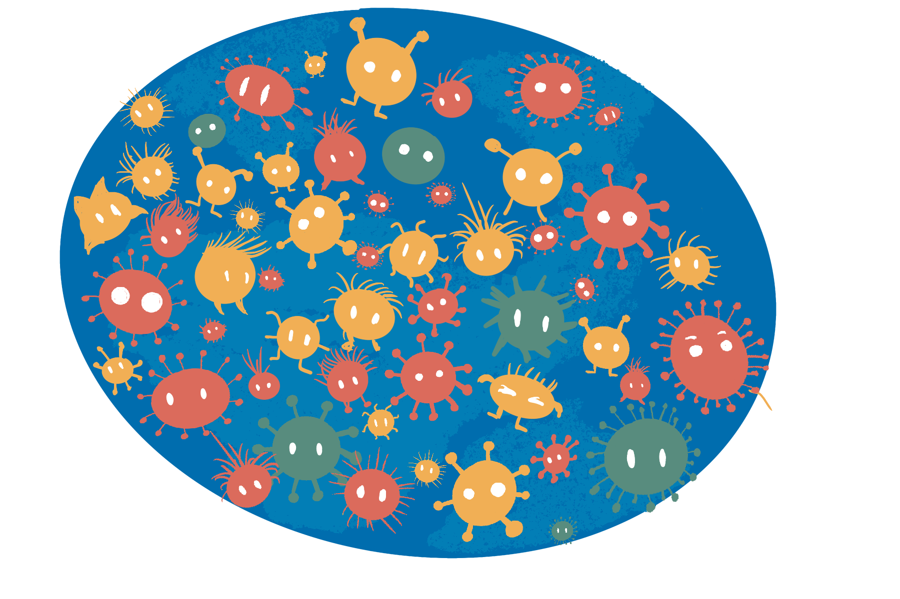
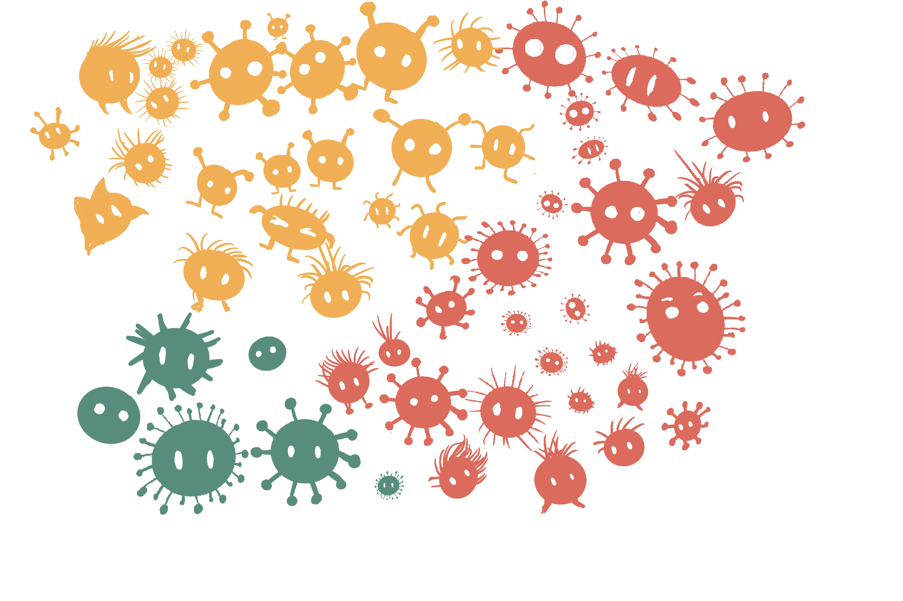

```{r, include = FALSE}
current_file <- knitr::current_input()
basename <- gsub(".Rmd$", "", current_file)

knitr::opts_chunk$set(
  fig.path = sprintf("images/%s/", basename),
  fig.width = 6,
  fig.height = 4,
  fig.align = "center",
  fig.retina = 3,
  echo = TRUE,
  warning = FALSE,
  message = FALSE,
  cache = FALSE,
  cache.path = "cache/"
)
```

```{r titleslide, child="assets/titleslide.Rmd"}
```


---

class: middle monash-bg-blue

.f-headline[**Starts with a .white[question]**]

---

# What questions do you have ... ? 

.flex[
.w-33[

* ... about a virus?

<iframe src="https://opendatahandbook.org/value-stories/en/open-sourcing-genomes/" width="100%" height="400px">
</iframe>

]
.w-33[

* ... forecasting the weather?

<iframe src="http://www.bom.gov.au/climate/data/" width="100%" height="400px">
</iframe>

]
.w-33[

* ... about the stock prices?

<iframe src="https://www.wsj.com/market-data" width="100%" height="400px">
</iframe>

]
]

???

* This is an example where the data has been already collected. 
* Interested in **data collection methods**

---

# Planet Monash

.absolute.w-40[

{{content}}
]




--

<div class="question-box">
How many yellow, green and red alien creatures?
</div>
{{content}}

--

<div class="question-box">
What is the distribution of the height of the alien creatures?
</div>
{{content}}
--

<div class="question-box">
Are yellow creatures more likely to have hair?
</div>
{{content}}
--

<div class="question-box">
Does the hair growth formula work on these creatures?
</div>

---

class: monash-bg-blue middle tr 

.pa5[
.f-headline[**Now that we have a .white[question] ...**]

]

---

class: no-logo

# What's the population of interest?  

--


.flex[
.w-50[
.f2[Population]


]
.w-50[
{{content}}

]
]

--

<div class="f2">Sample</div>


--

.flex[
.w-50[
Parameters: 

.cgreen[Green:] 6/53=0.113, .cyellow[Yellow:] 22/53=0.416,<br> .cred[Red:] 25/53=0.472
]
.w-50[

The statistics:

.cgreen[Green:] 1/21=0.048, .cyellow[Yellow:] 10/21=0.476,<Br> .cred[Red:] 10/21=0.476, are estimates of parameters

]

]

---
# Sampling the population

.info-box.w-50[
Collecting data on the entire population is normally too expensive or infeasible!
]
--

* We therefore collect data only on a subset of the population.
--

* **How should we sample the population?**
--
 There are many sampling schemes.
---

count: false

# Sampling the population

.info-box.w-50[
Collecting data on the entire population is normally too expensive or infeasible!
]

* We therefore collect data only on a subset of the population.

* **How should we sample the population?** There are many sampling schemes.


.idea-box.w-45[
**Simple random sampling**  
Every unit in the population has the same sample probability to be drawn.
<center>
 
</center>
]
--
 .idea-box.w-45[
**Stratified random sampling**  
Units are drawn from non-overlapping sub-populations.
<center>
 
</center>
]

???

* **Stratified random sampling** requires identifying different subpopulations and may involve SRS on subpopulation

---


# Goal of sampling schemes

.w-85[
.aim-box.w-70[   
The **goal of a sampling scheme** is to get accurate information from the sample in order to answer your question.
]

{{content}}
]


--


* This involves identifying:
  * the **population of interest** (e.g. if studying about male baldness pattern, your population of interest is the biologically male population),
  * what **responses** (dependent variables) or **covariates** (explanatory or independent variables) to capture and how to measure it (e.g. do you collect their age? Which range of age they are in? Their hair count? The thickness of the hair?),
  * the **sample size** (how many samples do we need?),
  * any **structure** that will be in the data (e.g. population structures, repeated cross-sectional data, panel or longitudinal data), and 
  * any **restrictions** (e.g. ethical concerns, limitation on collecting data).

---

# Sampling strategies

.w-70[
* Sampling strategies combine knowledge about the population with statistical methods. 
{{content}}
]

--

* For example,
  * designing so your sample estimates give (theoretically) unbiased estimates of the population parameters,
  * sample so the data will be representative of the subpopulations (e.g.  stratified random sampling), or
  * oversampling or undersampling to compensate for imbalance in classes.
--

.think-box.w-60[
 What might go wrong with a simple random sampling of 10 creatures from this population?
]


---

# Random and non-random selections

* Units ideally are sampled *randomly*, but more than often selections are non-random.
--
.think-box.w-45[
If I survey every 10th household in a street, is that a random selection? 
] 
--
.think-box.w-45[
What do you think can go wrong if we don't sample randomly?
]
--

<br>

* What's wrong with these examples? 

.flex[
.work-box.w-45.clear-list[
* .li-aim[You want to know the attitude of the creatures about working at home.]
* .li-data[You call phone numbers listed in the order of white pages and stop when you have 20 observations.]
]
{{content}}
]
--
<div class="work-box w-45 clear-list">
<ul>
<li><span class="li-aim">You want to get the hair count distribution of the Planet Monash population.</span></li>
<li><span class="li-data">You sample creatures from the Society of Bald Extraterrestrials.</span></li>
</ul>
</div>

---

# Reality of data collection ... 

* .monash-ruby2[Making an appropriate sampling design is **_hard_**].
--

  * There may be unknown or hidden structures in the population.
--

  * You may introduce intentional data structures, e.g.
      * Cross-sectional data,
      * Repeated cross-sectional data (e.g. case-control), 
      * Panel or longitudinal data (e.g. cohort studies), and so on.
--

  * You may have unintended or unknown structures in the data, e.g. confounded variables.
    
--

  * It's further complicated by:
      * Non-response, 
      * Missing data, 
      * Mis-measured data, 
      * Sample attrition, and so on. 😱

---

# Observational studies

* Studies mentioned so far has been .monash-blue[**observational studies**].

.info-box.w-75[
* An **observational study** aims to draw inferences about a population from a sample where independent variables are *not* intentionally allocated to units within the sample for the purpose of a study.
* Data considered in observational studies are **observational data**.  
]

--
  

Examples:

.flex[
.idea-box.w-33[
.clear-list[
* .li-aim[Who will win the 2022 Australian federal election?]
* .li-data[Survey households]
]]

.idea-box.w-33[
.clear-list[
* .li-aim[Where are the best schools?]
* .li-data[Government administrative data]
]]

.idea-box.w-33[
.clear-list[
* .li-aim[Who are buying my products?]
* .li-data[Customer database]
]]
]

---

# Experimental studies

* A scientific claim generally need to be validated by an *experimental study*. 

.info-box.w-80[
* In an **experimental study**, a causal variable of interest (referred to as *treatment*) is administered to recipients while holding other covariates at controlled settings to observe responses. 
* Data from an experiment are referred to as **experimental data**.
]

--

  

Examples:

.flex[
.idea-box.w-45[
.clear-list[
* .li-aim[Is the vaccine effective against flu?]
* .li-data[The data of whether the person who was administered the vaccine or placebo caught the flu afterwards.]
]]

.idea-box.w-45[
.clear-list[
* .li-aim[Which fertilizer brand is most effective for wheat yield?]
* .li-data[Yield data from crop field trial with plots treated with one of the three fertilizer brands.]
]]

]

---

# Experimental units

.info-box.w-70[
**Experimental units** are recipients of the allocated treatment such that no sub-division of it can receive another treatment independently.

]
--

.think-box.w-70[
* Prof Android delivers their lecture by reciting word-to-word from the text in a monotone. 
* Prof Alien delivers their lecture by transmitting the information directly to the students mind.
* You want to see if one of the methods is more effective. 
* Students in class 1, 3, 4, 7 and 10 have Prof Android.
* Students in class 2, 5, 6, 8 and 9 have Prof Alien.

**What are the experimental units?** {{content}}
]

--

It's the classes.

---

# Observational units

.info-box.w-70[
**Observational units** are units that you measure the response on.
]

.think-box.w-70[
Carrying on from the previous example... 
* Students all sit for the same exam. 
* You record the exam mark for each student.

**What are the observational units?** {{content}}

]

--

It's the students.

--

* Note: *observational unit* is not the *observation* (the response)!

---

# Wheat Yield Trial <i class="fas fa-seedling"></i> 

.flex[
```{r, echo = FALSE, fig.height = 7, fig.width = 8.3, message = FALSE}
library(tidyverse)
library(agridat)
filter <- dplyr::filter # curse you!!!
ggplot(gilmour.serpentine, aes(col, row, label = str_sub(gen, 1, 5)))  + 
  geom_tile(color = "black", fill = "#DEB887", size = 1.5) + 
  geom_text(size = 3) + theme_void() 
```

* A selective breeding experiment with 107 wheat varieties (or *genotypes*) were conducted in South Australia in a field with plots laid out in a rectangular array with 22 rows and 15 columns.
* The breeders want to find a variety with *high yield*.
{{content}}

]

.footnote.f6[

Source: Gilmour et al. (1997) Accounting for natural and extraneous variation in the analysis of field experiments. *Journal of Agric Biol Env Statistics*, 2, 269-293.
]

--
* The **treatments** are the *107 wheat varieties*.
* The **experimental units** are the *330 plots*.
* The **observational units** are also the *330 plots*.

---

# Replications

.flex[

```{r, echo = FALSE, fig.height = 7, fig.width = 8.3}
ggplot(gilmour.serpentine, aes(col, row, label = str_sub(gen, 1, 5)))  + 
  geom_tile(color = "black", fill = "#DEB887", size = 1.5) + 
  geom_text(size = 3) + theme_void() + 
  geom_text(data = subset(gilmour.serpentine, gen == "RAC791"), 
            color = "white", size = 3, fontface = "bold") + 
  geom_text(data = subset(gilmour.serpentine, gen == "VF655"), 
            color = "yellow", size = 3, fontface = "bold") + 
  geom_text(data = subset(gilmour.serpentine, gen == "TINCURRIN"), 
            color = "red", size = 3, fontface = "bold") + 
  geom_text(data = subset(gilmour.serpentine, gen == "WW1477"), 
            color = "green", size = 3, fontface = "bold")
```

* The varieties `VF655`, `TINCURRIN` and `WW1477`  have a **replication** of 6, the remaining 104 varieties each have a replication of 3. 
{{content}}

]
--
* Treatment **replications are essential** in an experiment; without any replication, no treatment variation can be measured nor distinguished from unit variation.
{{content}}
--
* More replications are desirable for accuracy, however, there is always a tension to balance between accuracy and the cost of the experiment.  

---

# Pseudo-replication 

.think-box.w-70[
Carrying on from the teaching example...
* Suppose there were 30 students in each class.
* The treatments were the two teaching method confounded with each professor. 
* There were two professors and 10 classes. 
* Each professor was randomly assigned to 5 classes, so each professor manages 150 students.

**What are the replications of each treatment?** {{content}}
]
--
It's 5.
--

.info-box.w-70[
The treament of repetition as replication in the analysis is referred to as **pseudo-replication**.
]

---

# Systematic Design of Experiments

.flex[
```{r, echo = FALSE, fig.height = 7, fig.width = 8.3}
dat <- gilmour.serpentine %>% 
  mutate(gen = sort(gen)) 
dat %>% 
  ggplot(aes(col, row, label = str_sub(gen, 1, 5)))  + 
  geom_tile(color = "black", fill = "#DEB887", size = 1.5) + 
  geom_text(size = 3) + theme_void() + 
  geom_text(data = subset(dat, gen == "RAC791"), 
            color = "white", size = 3, fontface = "bold") + 
  geom_text(data = subset(dat, gen == "VF655"), 
            color = "yellow", size = 3, fontface = "bold") + 
  geom_text(data = subset(dat, gen == "TINCURRIN"), 
            color = "red", size = 3, fontface = "bold") + 
  geom_text(data = subset(dat, gen == "WW1477"), 
            color = "green", size = 3, fontface = "bold")
```

* The treatments appear to be randomly ordered before.
{{content}}

]
--
* Why don't we order the treatments in a **systematic order** like on the left?
{{content}}
--
* Isn't this easier to manage the experiment?
{{content}}
--
<br><br>
<div class="info-box w-90">
Systematic designs are prone to <b class="monash-blue">bias</b> and <b class="monash-blue">confounding</b>.
</div>

---

# Randomisation

.w-70[
* Treatments should be allocated *randomly* to experimental units. 
* This avoids:
  * .monash-blue[**systematic bias**] - e.g. all flu vaccine A tested in January (summer) and all flu vaccine B tested in July (winter).
  * .monash-blue[**selection bias**] - e.g. giving the treatment that you are testing to the sick patients and placebo to those that are healthy.
  * .monash-blue[**other bias**] - e.g. the lab technician giving the treatment to the first rat that is taken out of the cage. 

]


---

# Blocking

.info-box.w-50[
 .monash-blue[**Blocks**] are used to group the experimental units into alike units.
]
--
.w-70[
* If well done, blocking can lower the variance of treatment contrasts which increase power.
* A non-homogeneous block (i.e. units within block are *not* alike) can decrease the power of the experiment.

{{content}}

]

--

You can form blocks from:


* **Natural discrete divisions** between experimental units. <br>E.g. in experiments with people, the gender make an obvious block.
* Grouping experimental units with similar **continuous gradients**. <br>E.g., if the experiment is spread out in time or space and there exists no obvious natural boundaries, then an arbitrary boundary may be chosen to group experimental units that are contiguous in time or space. 

---

# The Salk Vaccine Field Trial

.footnote.f5[
Source: Freedman, Pisani & Purves (2010) Statistics. 4th edition
]
.w-50[
* The first polio epidemic hit the United States in 1916 claiming hundreds of thousands of victims, especially children.
* National Foundation for Infantile Paralysis (NFIP) was ready to test the vaccine developed by Jonas Salk in the real world.
* A controlled experiment was proposed to test the effectiveness of the vaccine on grade 1, 2 and 3 children at selected school districts though the country where the risk of polio was high.
* In total two million children were involved although not all parents consented to their children to be vaccinated.
]

---


.flex[
.w-45[
# Design for the NFIP Study

.color-box.monash-bg-blue.white[
Vaccinate all grade 2 children whose parents would consent, leaving children in grades 1 and 3 as controls.]

* Can grade 2 children whose parents did not consent be included as control?
* What are the potential issues with such a design?
* Polio is a contact disease. Would incidences of disease be higher in grade 2?
]
{{content}}
]
--

 <div class="w-45 pl4">

<h1>Randomised controlled trial</h1>

<div class="color-box monash-bg-blue white">
An alternate vaccine trial randomly assigned the vaccine and placebo to children.
</div>

</div>

---

# Vaccine Results

.flex[
```{r, echo = FALSE}
tibble(group = c("Vaccinated (Grade 2)", "Control (Grade 1 & 3)", "Not Vaccination<br> (Grade 2, no consent)", "Incomplete Vaccination<br>(Grade 2, incomplete)"),
       size = c("221,998", "725,173", "123,605", "9,904"),
       rate = c(25, 54, 44, 40)) %>% 
  knitr::kable(col.names = c("Group", "Participants", "Rate"),
               caption = "The NFIP Study",
                align = c("lrr"), escape = F) %>% 
  kableExtra::kable_styling(c("striped", "bordered"))
```


```{r, echo = FALSE}
tibble(group = c("Vaccinated", "Placebo", "Not Vaccination<br>(no consent)", "Incomplete Vaccination"),
       size = c("200,745", "201,229", "338,778", "8,484"),
       rate = c(28,71,46,24)) %>% 
  knitr::kable(col.names = c("Group", "Participants", "Rate"), 
               caption = "Randomised controlled trial",
               align = "lrr", escape = F) %>% 
  kableExtra::kable_styling()
```

]

* The rate is the number of polio cases per 100,000 in each group.
* RCT and NFIP trial sampled from school districts with similar exposures to the polio virus.

--

.think-box.w-70[
Both the not vaccinated (no consent) and placebo/control group did not receive the treatment but why is the rate of polio cases less in the not vaccinated (no consent) group?
]

---

# Possible explanations

.w-70[
* Higher income parents would more likely consent to treatment than lower-income parents.
{{content}}

]
--
* Children of higher income parents are more vulnerable to polio.
{{content}}
--
* Many forms of polio are hard to diagnose and in borderline cases.

---


# Limitations in (social) experiments

* Cooperation needed from participants 
* Ethical objections
* Substitution bias 
* Sample attrition 
* Hawthorne effect

--

.w-70[
.f1[Basically, designing and running experiments are *hard*.]
]

---

class: transition 


# Pop Quizzes

---

# Observational or experimental data?

.question-box.w-50[
The Academic Performance Index is computed for all California schools based on standardised testing of students. The data sets contain information and characteristics for 100 schools.
]

--

.w-60[
.fr.animated.bounceIn.f1.small-caps[Observational]

]

---

# Observational or experimental data?


.question-box.w-50[
The response is the length of odontoblasts in 60 guinea pigs. Each animal received one of three dose levels of vitamin C by one of two delivery methods by the technician.

]

--

.w-60[
.fr.animated.bounceIn.f1.small-caps[Experimental]

]

---

# Observational or experimental data?


.question-box.w-50[
Can people really tell the difference between different flavours associated with the color of the skittles? You blind your friends so they can't see the color and collect data on their guess after giving them one skittle at a time.
]

--

.w-60[
.fr.animated.bounceIn.f1.small-caps[Experimental]

]

---

```{r endslide, child="assets/endslide.Rmd"}
```


