```{r, include = FALSE}
current_file <- knitr::current_input()
basename <- gsub(".Rmd$", "", current_file)

knitr::opts_chunk$set(
  fig.path = sprintf("images/week4/%s/", basename),
  fig.width = 6,
  fig.height = 4,
  out.width = "100%",
  fig.align = "center",
  dev.args = list(bg = 'transparent'),
  fig.retina = 3,
  echo = FALSE,
  warning = FALSE,
  message = FALSE,
  cache = FALSE,
  cache.path = "cache/"
)
```

```{r titleslide, child="assets/titleslide.Rmd"}
```


---
background-image: url(images/data-expo/take-off.jpg)
background-size: 100%
class: middle

# .monash-blue2[Ready to take off with wild data?]

---
class: transition

# This is a case study using the US airlines database


---
# Motivation

American Statistical Association Statistical Graphics and Computing Sections [2009 Data Expo](https://community.amstat.org/jointscsg-section/dataexpo/dataexpo2009) provided all of the commercial flight records for air travel in the USA from October 1987 to April 2008. 

<center>

</center>
  
---
# Questions provided

- When is the best time of day/day of week/time of year to fly to minimise delays?
--

- Do older planes suffer more delays?
--

- How does the number of people flying between different locations change over time?
--

- How well does weather predict plane delays?
--

- Can you detect cascading failures as delays in one airport create delays in others? Are there critical links in the system?
--

<br>
<br>
<br>

but participants could also decide for themselves what to analyse.
--

.w-60[
.fr.animated.bounceIn.f1.small-caps[Remember: Start with a question]
]
---

# About the data

.flex[
.w-45[
* nearly 120 million records
* 12Gb of space uncompressed
* 1.6Gb compressed

<br>
Organisers provided instructions on how to set up an .monash-orange2[**sqlite database**], and access from R.

]
.w-45[

<br><br><br><br><br><br><br><br><br>

Read about .monash-blue2[accessing databases from R] at this RStudio site https://db.rstudio.com/databases/sqlite/ is a good starting place to read about working with a sqlite database.

]
]

---
# The original data source

.grid[
.item[


]
.item[
<br>
<br>

* You can find the most current data at
 https://www.transtats.bts.gov/DataIndex.asp
* Look at the
 "On-Time Performance 1987-present" table.
<br>
<br>
* You can download data a month at a time
* There is a lag in records appearing on the site, currently of several months
* Data dictionary/explanations the variables
* Links at bottom of the site tells you what web site collects on you when you visit (Privacy Policy), but there is no clear license or policy on usage. 

]
]
---
# Accessing the data

- Data expo files: the data for the competition is still available because it was given a DOI: [https://doi.org/10.7910/DVN/HG7NV7](https://doi.org/10.7910/DVN/HG7NV7). `r emo::ji("cartwheel")`
- Navigating the [BTS web interface](https://www.transtats.bts.gov/DataIndex.asp)
    - What data is available
    - How do you download
    - Explanations of the records and variables
- R package `nycflights13`: provides a small domesticated data set.`r emo::ji("koala")` This is a good way to *dip your toes in the water* with the airline data - try this as a start before working with the full data.

```{r echo=TRUE}
library(nycflights13) #<<
data(airlines)
data(airports)
data(flights)
data(planes)
data(weather)
```

---
class: transition

# What does the data look like?

---

.scroll-box-16[
```{r}
library(tidyverse)
# Careful with file name here - and this dataset should only contain Jan 2020 data
flights_jan2020 <-
  read_csv(here::here("data/T_ONTIME_REPORTING.csv")) #%>%
  # select(-`...17`)
flights_jan2020 %>% 
  select(FL_DATE, OP_UNIQUE_CARRIER, TAIL_NUM, ORIGIN, DEST, DEP_TIME, ARR_TIME, ARR_DELAY) %>%
  slice_head(n=20)
```

]

<br><br>
- What's in a row?
- What type of data collection is this? (e.g. experimental or observational? Census, survey sampling or occurrence?) 

---
# How would you start to process the data to answer ...

- When is the best time of day/day of week/time of year to fly to minimise delays?
--

- Are some carriers operating more efficiently?
--

- Do some carriers operate more broadly than others?
--

- Do older planes suffer more delays?
--

---
class: transition

# What did the prize winners do?

---
class: motivator
# First prize `r emo::ji("trophy")`

<center>

</center>

.footnote[Rick Wicklin, Robert Allison]


---
layout: true
class: shuriken-300 white

.blade1.bg-red.content.center[
# Overview

Its good practice to show a useful view of entire data, to get a rough sense of major patterns.

]]
.blade2.bg-green[.content.vertical-rl.center[
# Temporal trend

A major component of this data is traffic patterns over time.

]]
.blade3.bg-deep-purple[.content.center[
# Spatial pattern

Airports are distributed across the country, explore how the traffic operates relative to this geography

]]
.blade4.bg-orange[.content.vmiddle[
# Carriers

Are some carriers operating more widely, or more efficiently?

]]
.hole.bg-black[.content.center.vmiddle[

]]
---

class: hide-blade2 hide-blade3 hide-blade4 hide-hole

---

class: hide-blade3 hide-blade4 hide-hole
count: false

---

class: hide-blade4 hide-hole
count: false

---
count: false

# Highlights

---
layout: false

.flex[
.w-25[
# Overview
]
.w-70[

]
]

---
.flex[
.w-25[
# Overview
]
.w-70[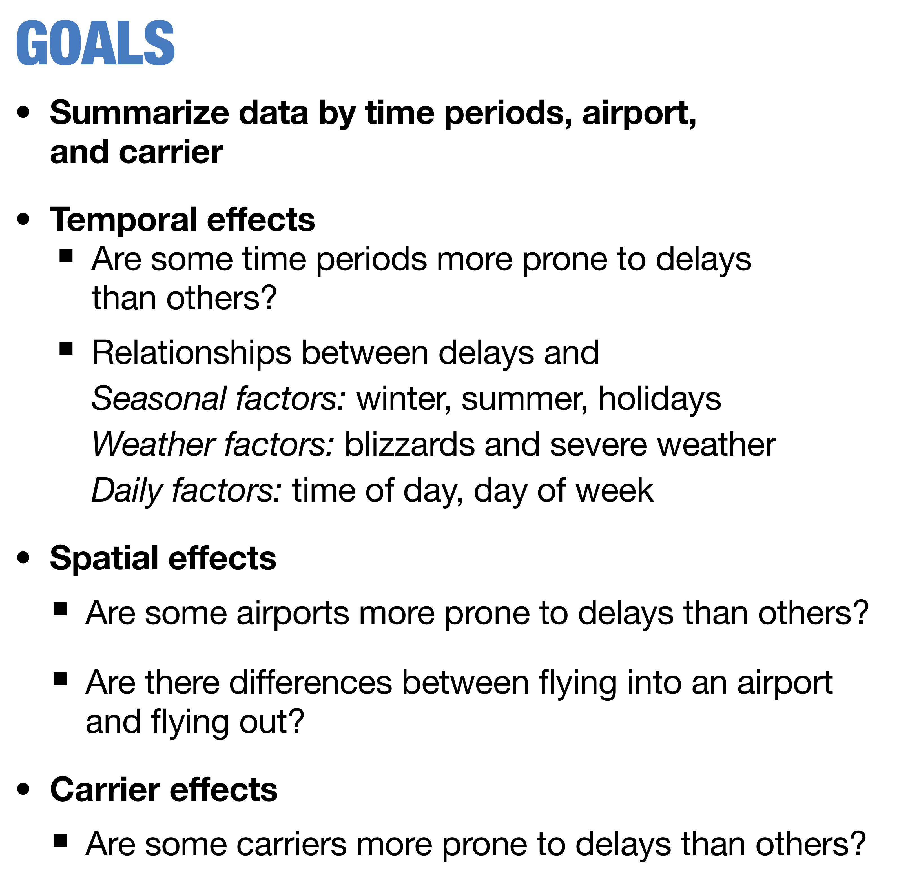
]
]
---
.flex[
.w-25[
# Overview
]
.w-70.scroll-box-32[
]
]
---
class: middle center

.think-box[
# Think about it `r emo::ji("thinking")`

.monash-orange2[Delay] was used in providing an overview.

- What other aggregates could have been used?
- Why was delay chosen?
]

---

# Temporal  trend


---

# Temporal  trend

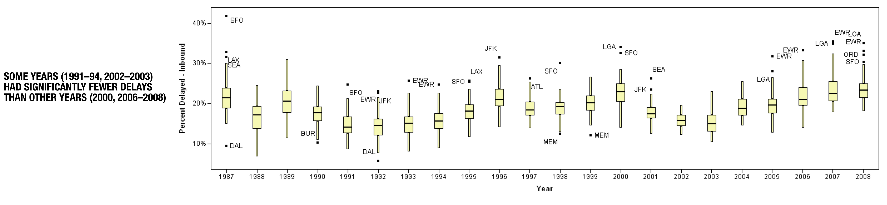

---
.flex[
.w-25[
# Spatial
]
.w-70[

.scroll-box-32[

]
]
]
---
# Carrier

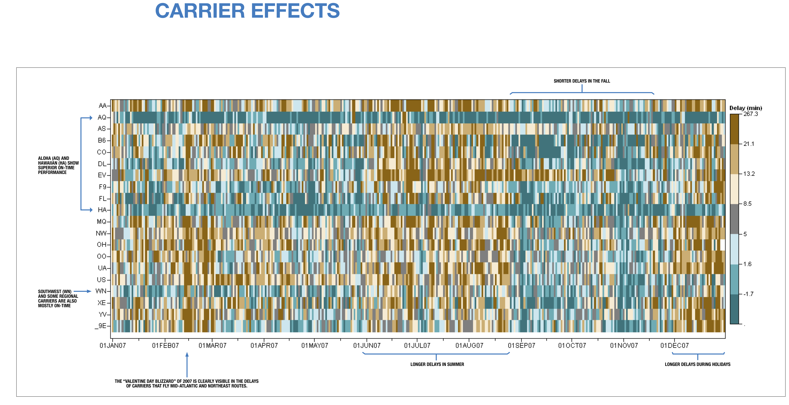

---
.flex[
.w-25[

# Highlights
]
.w-70[


]
]

---
class: motivator
# Second prize `r set.seed(5);emo::ji("medal")`

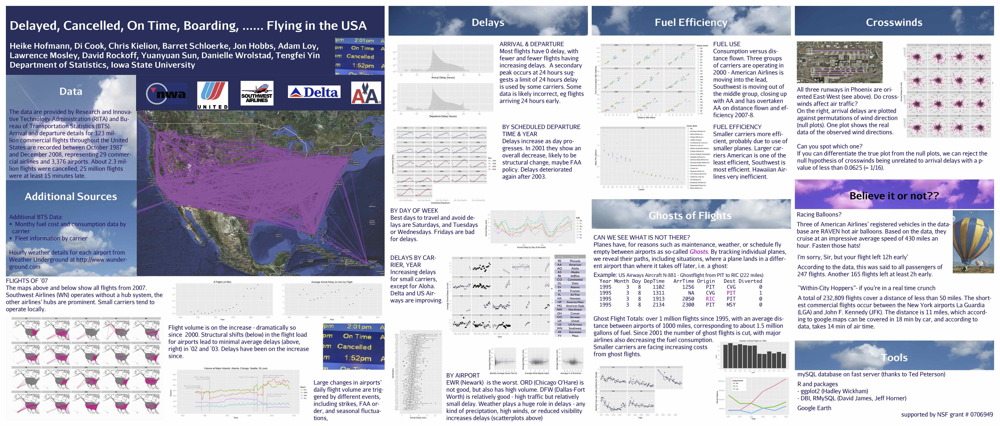

.footnote[[Hofmann, Cook, Kielion, Schloerke, Hobbs, Loy, Mosley, Rockoff, Sun, Wrolstad, Yin](https://amstat.tandfonline.com/doi/abs/10.1198/jcgs.2011.3de#.XsbqbS97G61)]

---
.flex[
.w-45[
# Analysis overview

- Overview: flight paths over country
- Analysis:
    - Traffic patterns over time, including 911, and strikes, bankruptcies
    - Delays over time, and by day, hour
    - Airport efficiency
    - Carrier efficiency
    - Ghost flights: what's a ghost flight?
    - Mapping traffic spatially, and animating
- Curious findings
]
.w-45[

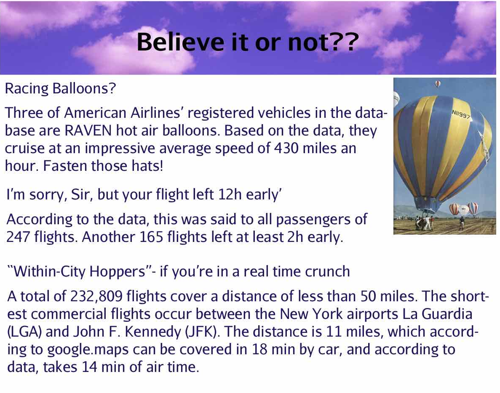

]
]

---
class: middle 

.think-box[
# As we work through the summary plots, think about 

- what needs to be done to the data to get to this summary
- what do you learn from each display, what's expected, what's surprising
- what other ways might the same information be presented, or other calculations made

]
---
# Traffic patterns over time

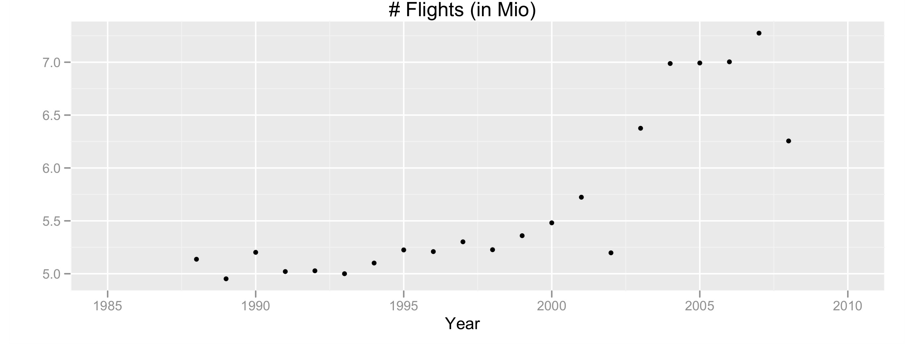

.smaller2[Number of flights in millions per year: steadily increasing volume until 2001, with a big drop in 2002. Volume recovered in 2003, and flattens 2004-7, with another drop in 2008. What happened in 2001? What was happening in 2008?]

---
# Traffic patterns at selected airports

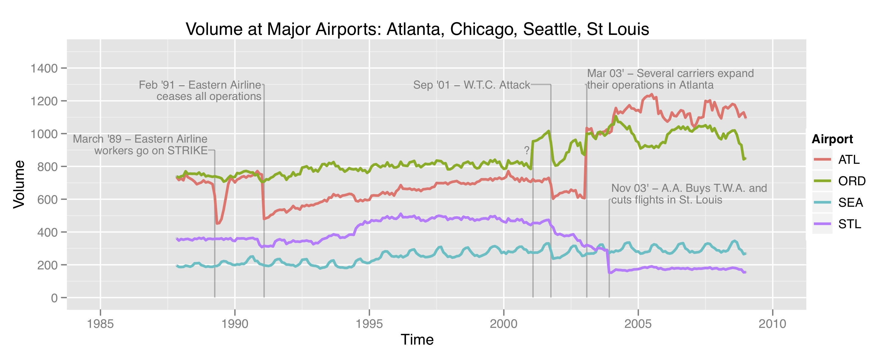

---
.flex[
.w-25[
# Delays
]
.w-70[
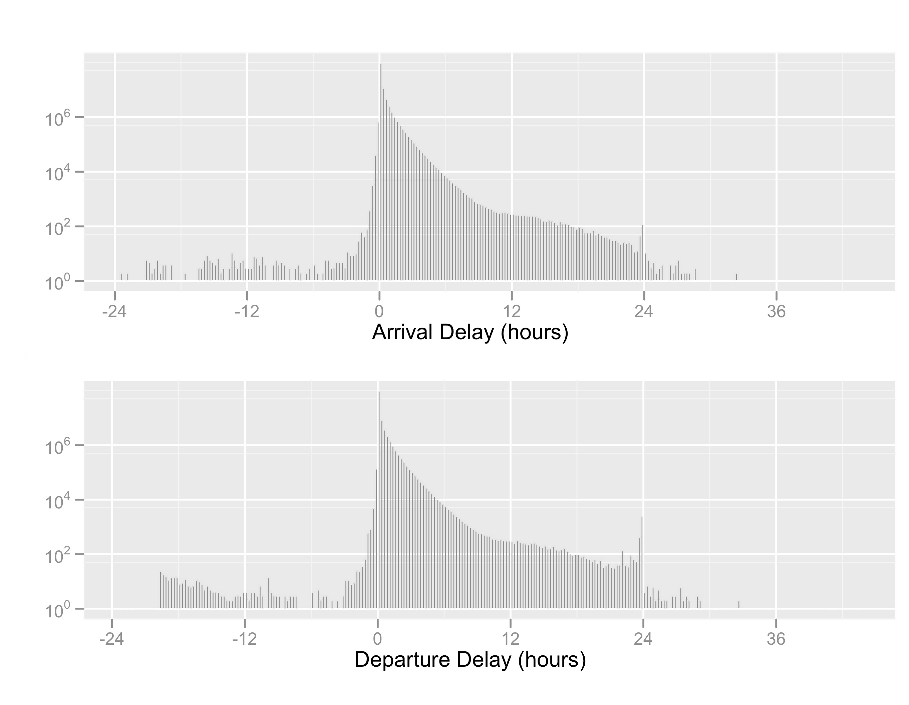
]]
---
.flex[
.w-25[
# Delays, by year
]
.w-70[

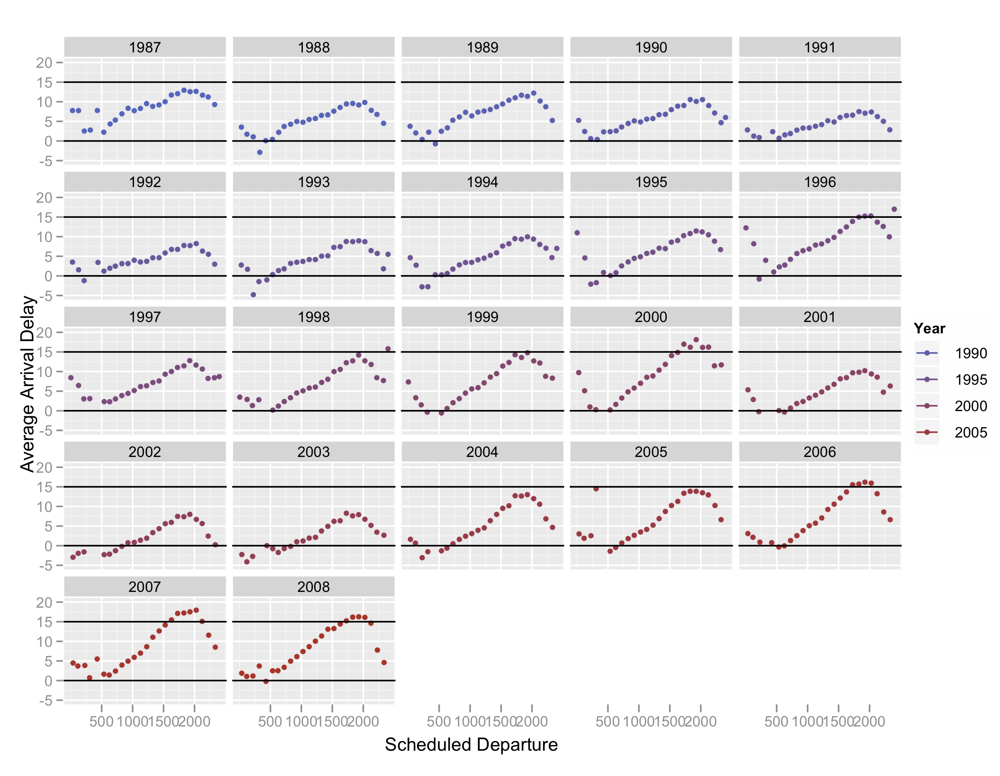
]]

---
.flex[
.w-15[
# Delays, by carrier
]
.w-80[

]]

---
.flex[
.w-25[
# Delays, by airport
]
.w-70[

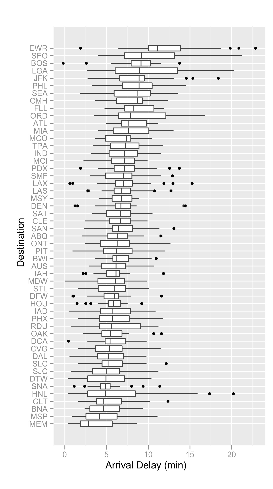
]
]
---
# Delays, by day

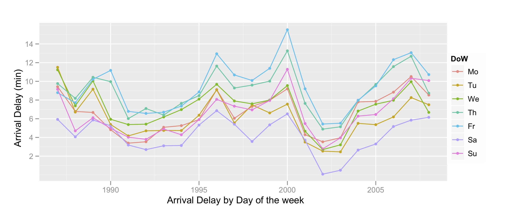

---
.flex[
.w-15[
# Fuel use by carrier
]
.w-80[

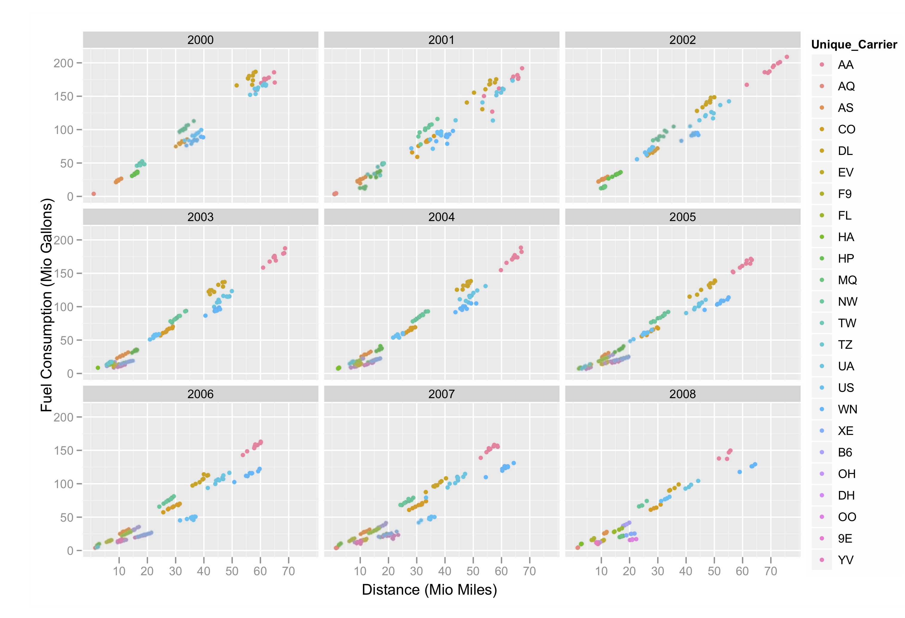
]]
---
.flex[
.w-15[
# Fuel <br> efficiency
]
.w-80[


]]

---
# Ghost flights


---
.flex[
.w-15[
# Ghost flights, wasted fuel
]
.w-80[


]
]
---
# What tools were used and why

A subset of the analysis materials including data and code can be downloaded from the [paper site](https://amstat.tandfonline.com/doi/suppl/10.1198/jcgs.2011.3de?scroll=top)

- sqlite database: Inspired by the guidelines provided by the organisers we created a `mysql` database, on a central server that all team members could access with a password. Each person accessed the data through R.
- R packages: `RMySQL`, `DBI`, `ggplot2`

---

class: transition

# A brief introduction to working with databases

---

# Databases

Working from these notes

https://db.rstudio.com/databases/sqlite/

<br>
<br>

Why should I use a database?
- The data is too large to load into memory, ie work directly with it in R
- Database can make more efficient calculations
- Only load the data needed for specific analysis tasks

---
# Connecting to an existing database

The packages `DBI`, `RMySQL`, `RPostgreSQL`, `RSQLite`, `bigrquery`, `odbc` enable connection to many different types of databases. The package `dbplyr` enables tidy style access to the databases.

<iframe src="https://db.rstudio.com/databases" title="List of databases available from R" width="100%" height="600px"> </iframe>

---
# Set up connection, using SQLite

```{r echo=TRUE, eval=TRUE}
# Set up connection
library(DBI)
library(RSQLite)
con <- dbConnect(RSQLite::SQLite(), "flights_database") 
```

This creates the link between R and the database.

---

# Suppose we want to set up a database

We want to add some data. 

One month of air traffic data is quite manageable in an R session. We can use this to get started and to practice.

```{r echo=TRUE, eval=FALSE}
# Download a month of data and read into R
library(tidyverse)
flight_data_from_csv <- read_csv("../data/On_Time_Reporting_Carrier_On_Time_Performance_1987_present_2020_2/On_Time_Reporting_Carrier_On_Time_Performance_(1987_present)_2020_2.csv")
```

---

# Practice adding data to the database 

Add the flight data to our SQLite database. For this you can use

.font_smaller[
```{r echo=TRUE, eval=FALSE}
copy_to(con, flight_data_from_csv, "flights",
  temporary = FALSE,
  indexes = list(
    c("FlightDate",
    "Reporting_Airline",
    "Tail_Number",
    "Origin",
    "Dest"
  )
))
```
]

Here we named the data we uploaded "flights".

Note setting up the indexes makes it faster to process data on the database.


---

There are other approaches we can use to add data to a database using DBI functions

.font_smaller[
```{r echo=TRUE, eval=FALSE}
dbWriteTable(con, "flights", flight_data_from_csv)
dbListTables(con)
```
]

You can use the function tbl() to pull data from the database. 
Below shows an example, where we practice retrieving the flights data we uploaded before. 

.font_smaller[
```{r echo=TRUE, eval=FALSE}
flight_data_from_db <- tbl(con, "flights")
flight_data_from_db
```
]

---

# Getting data from the database

Using `tbl()` lets you look at what is stored, but does not pull the data back into memory yet. For that you need `collect()`.

This allows us to do operations on our data and identify the subset we are interested in before we pull the data back into computer memory. 

.font_smaller[
```{r echo=TRUE, eval=FALSE}
subset_of_flight_data <- flights_data_from_db  %>%
  filter(DayofMonth==1) %>%
  select(DayofMonth, Origin, Dest) %>%
  collect() #<<
subset_of_flight_data
```
]

or using dbSendQuery() with SQL 

.font_smaller[
```{r echo=TRUE, eval=FALSE}
dbListFields(con, "flights")
res <- dbSendQuery(con, "SELECT * FROM
                   flights WHERE DayofMonth=1")
firstday <- dbFetch(res)
```
]

---
# Add a table on airport details

Information about airport location and details is found in a different table at the BTS site:
https://www.transtats.bts.gov/Fields.asp?Table_ID=288 . We will download this and add to our database to use for plotting flights on a map.

.font_smaller[
```{r echo=TRUE, eval=FALSE}
airport_data_from_csv <- read_csv("data/402312038_T_MASTER_CORD.csv") %>%
  select(-X29)
copy_to(con, airport_data_from_csv, "airports",
  temporary = FALSE
  )
dbListTables(con)
```
]

---
# Its easy to forget what variables are in the table

You can check this with

.font_smaller[
```{r echo=TRUE, eval=FALSE}
dbListFields(con, "airports")
```
]

---
# Make a map of flights for Feb 1

.font_smaller[
```{r echo=TRUE, eval=FALSE}

airport_locations <- tbl(con, "airports") %>%
  filter(AIRPORT_IS_LATEST == 1, AIRPORT_COUNTRY_CODE_ISO == "US") %>%
  select(AIRPORT, DISPLAY_AIRPORT_NAME, LONGITUDE, LATITUDE) %>%
  collect() #<<

feb1_flights <- feb1 %>%
  left_join(airport_locations, by=c("Origin" = "AIRPORT")) %>%
  rename(Origin_lon = LONGITUDE, Origin_lat = LATITUDE,
         Origin_name = DISPLAY_AIRPORT_NAME) %>%
  left_join(airport_locations, by=c("Dest" = "AIRPORT")) %>%
  rename(Dest_lon = LONGITUDE, Dest_lat = LATITUDE,
         Dest_name = DISPLAY_AIRPORT_NAME)
```
]

---

.font_smaller[
```{r echo=TRUE, eval=FALSE}
# OLD CODE / WILL REQUIRE API KEY NOW TO RUN
# REFER TO TUTORIAL CODE INSTEAD
library(ggmap)
usa_bbox <- c(-130, # min long
              20, # min lat
              -60, # max long
              50) # max lat
usa_map <- get_map(location = usa_bbox, source = "osm")
ggmap(usa_map)
```
]

---

.font_smaller[
```{r echo=TRUE, eval=FALSE}
# OLD CODE - WILL REQUIRE API KEY TO GET MAP
# REFER TO TUTORIAL CODE INSTEAD
library(ggthemes)
ggmap(usa_map) + geom_segment(data=feb1_flights,
                     aes(x=Origin_lon,
                         xend=Dest_lon,
                         y=Origin_lat,
                         yend=Dest_lat),
                     colour="#9651A0", alpha=0.01) +
  geom_point(data=feb1_flights, aes(x=Origin_lon, Origin_lat),
             colour="#746FB2", alpha=0.1, size=1) +
  theme_map()
```
]

---


---
# Animating flights for one day

<center>
<iframe src="https://player.vimeo.com/video/161681018?title=0&byline=0&portrait=0" width="640" height="400" frameborder="0" allow="autoplay; fullscreen" allowfullscreen></iframe>
<p><a href="https://vimeo.com/161681018">Data Visualization and Statistical Graphics in Big Data Analysis: Video 1</a> from <a href="https://vimeo.com/annualreviews">Annual Reviews</a> on <a href="https://vimeo.com">Vimeo</a>.</p>
</center>

[Code is here](https://github.com/tidyverse/ggplot2/wiki/Flying-over-the-usa)

---
class: transition

# Summary

---
background-image: url(images/wild_vs_domesticated3.jpeg)
background-size: 70%
background-position: 50% 100%
class: hide-slide-number

.fill-box[
# Working with wild data can be daunting!

1. Start with questions that might be answered using the data.
2. Map out a pipeline to process the data, to address the question.
3. Think about what might be expected, so results can be "externally validated".
]

---

class: transition

## Slides originally developed by Professor Di Cook and maintained by Dr Kate Saunders

---

```{r endslide, child="assets/endslide.Rmd"}
```
