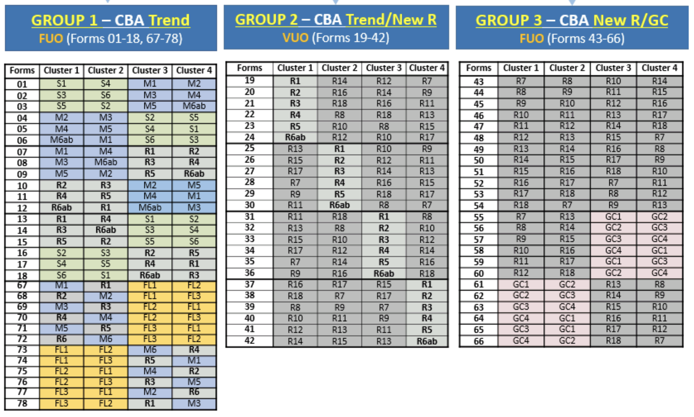

```{r, include = FALSE}
current_file <- knitr::current_input()
basename <- gsub(".Rmd$", "", current_file)

knitr::opts_chunk$set(
  fig.path = sprintf("images/%s/", basename),
  fig.width = 6,
  fig.height = 4,
  fig.align = "center",
  fig.retina = 2,
  echo = TRUE,
  warning = FALSE,
  message = FALSE,
  cache = TRUE,
  cache.path = "cache/"
)
```

```{r titleslide, child="assets/titleslide.Rmd"}
```

---

class: transition 

# Your turn

## You are interested in studying the workforce readiness of highschool students in multiple countries across the world. What things do you need to consider?


.footnote[
`class: transition`
]

---

# This lecture:

* Take a deep look at the Programme for International Student Assessment (PISA)
--

* Measurement 
--

* Complex sampling design
--

* Mean estimation with non-representative data 
--

* Variance estimation with non-representative data
--

* Exploring gender differences using the PISA
---

# What is .yellow[PISA]?

* The Programme for International Student Assessment (PISA) is a 	triennial	survey 	conducted	by the	 Organization	for	Economic	Cooperation	and	Development	(OECD)	on  assessment measuring 15-year-old student performances in .monash-blue[reading], .monash-blue[mathematics] and .monash-blue[science].
--

* The	goal	of	the	PISA	 survey	is	to	assess	the	workforce	readiness	of	15-year	old	students and used as a global metric for	quality,	equity	and	efficiency	in	school	education.
--

* In 2018, PISA involved 79 countries and economies with assessment of about 600,000 students worldwide as a sample of 32 million 15-year olds in school. 14,000 students from Australia participated. 
--

* One domain is tested in detail for every PISA. In 2018, this was *reading* with mathematics and science as minor areas of assessment.
--

* Read more about the Programme [here](http://www.oecd.org/pisa/aboutpisa/).

---

class: wider

# PISA 2018 Assessment and Analytical Framework

* **Reading literacy** is defined as students’ capacity to understand, use, evaluate, reflect on and engage with texts in order to achieve one’s goals, develop one’s knowledge and potential, and participate in society.
--

* **Mathematics literacy** is defined as students’ capacity to formulate, employ and interpret mathematics in a variety of contexts. It includes reasoning mathematically and using mathematical concepts, procedures, facts and tools to describe, explain and predict phenomena.
--

* **Science literacy** is defined as the ability to engage with science-related issues, and with the ideas of science, as a reflective citizen. A scientifically literate person is willing to engage in reasoned discourse about science and technology, which requires the competencies to explain phenomena scientifically, evaluate and design scientific enquiry, and interpret data and evidence scientifically.


---

class: transition middle 

# Download the data from 

http://www.oecd.org/pisa/data/2018database/

<br>
> SPSS (TM) Data Files (compressed)


> Student questionnaire data file 


 The file is 494 MB so it will take a while to download. 
 Keep a local copy for later use. 

---

class: font_small wider

# Data in .yellow[proprietary formats]

* The PISA data are provided in proprietary formats (SAS and SPSS).
--

* This means that the data are stored in a particular encoding scheme, designed  so that decoding and reading the data is accomplished by particular software or hardware.
--

* In R, you can use the `haven` package to import the PISA data.


```{r pisa2018, cache = TRUE, cache.lazy = FALSE, eval = FALSE}
library(tidyverse)
library(haven)
pisa2018 <- read_sav(here::here("data/lecture-06", "CY07_MSU_STU_QQQ.sav")) %>% 
                as_factor()  # swap code and labels for labelled factors
dim(pisa2018)
```
```{r save-pisa2018, include = FALSE, eval = FALSE}
pisa2018 %>% 
  select(CNT, ST003D02T, ST003D03T, ST004D01T, BOOKID, PV1MATH:PV10SCIE, SENWT, CNT, W_FSTUWT:W_FSTURWT80) %>% 
  saveRDS("data/lecture-06/pisa2018.rds")
```

```{r load-pisa2018, echo = FALSE, message = FALSE}
library(tidyverse)
library(haven)
library(here)
pisa2018 <- readRDS("data/lecture-06/pisa2018.rds")
```
--

* Since the data is big, it will take a while to read the data in.
--

* Every row corresponds to a student.

---
# Data documentation

* Survey data often (particularly the larger surveys and official surveys) come with an associate data dictionary (or code book)and other assorted documentation 
--

* Reading and using this documentation is essential for the proper use of survey data. Larger surveys will often staff a survey statistician to document procedures and guides for use - never assume it will be the same as what you have read before! 
--

* The PISA documentation is available [here](https://www.oecd.org/pisa/pisaproducts/pisadataanalysismanualspssandsassecondedition.htm). It includes information on the design of the survey and advise on how to use the data. 
--

* The PISA also provide copies of questionaires and codebooks available with data download (https://www.oecd.org/pisa/data/2018database/). These should always be used alongside the data. 

---
class: transition 

# Measurement

---
class: transition 

# Your turn: 
## If we have more questions than a student can answer in a feasible time, what do you think we should do?

---
# Adaptive testing

* One option implemented in 2015 and 2018 is adaptive testing
--

* This is an increasingly popular methodology for testing in education contexts
--

* The idea is that the questions that are given at time $t$ depend on the responses of students at times ${ 1,...,t-1}$. 
--

* The implication for this is that students see items that best assess their ability (rather than wasting time completing items that are much too easy or much too difficult).
--

* Reading was the focus of the 2018 PISA, and is assessed with an adaptive methodology. 
--

* All students complete a core reading stage (30 minuutes) plus two 15 minute modules that are chosen *adaptively* based on how students performed in the core reading stage. 
--

* This means we have better measurement precision with the same amount of testing time. 
--

* This can only be offered using computer assisted testing (using computers to assist testing) and wasn't implemented in the pen and paper versions

---
# Different question clusters

* Another option is to only allocate certain portions of the test to certain students
--


* In the 2018 PISA, students all recieve 1 hour reading assessment, and then are tested on one or two other subjects (mathematics, sciece and global competence).
--

* In addition, there are multiple clusters (collections of test questions that are collected together), to measure each subject (e.g., maths had six different test banks)
--

* There's a balance between the *number of test clusters* and the *number of students* who do each test bank. More than one bank increases the construct coverage, but that means less students do each bank. In 2018 the maths component was measured with six clusters. 
--

* The PISA also has test clusters that are new in that year, or "trend" clusters that only include questions (or units) from previous years. In 2018, the science module only included the new clusters in the computer version of the test. 

---

# Assessment Design

.font_small[Sourced from [PISA 2018 Integratated Design](https://www.oecd.org/pisa/pisaproducts/PISA-2018-INTEGRATED-DESIGN.pdf).] Scroll down to see more information.

.scroll-900[




* R1-R18 are Reading clusters
* M1-M6ab are Math clusters
* S1-S6 are Science clusters
* GC1-GC4 are Global Competence clusters
* FL1-FL3 are Financial Literacy clusters

<br><br><br><br><br><br>

]

---

class: font_small

# Interrogating the data

* So students who have `BOOKID` as Form 1-12 or 67-78 would have had mathematics component in their test.

.grid[.item[


```{r interrogate}
pisa2018 %>% 
  filter(BOOKID == "Form 13") %>% 
  select(CNT, ST004D01T, BOOKID, PV1MATH)
```

]
.item[

{{content}}

]]

--

* But there is a mathematics score for students who did not even sit a test with mathematics component!
* You will compare the math gender gap with all students vs. the subset of students who did sit the mathematics component during the tutorial `r emo::ji("wrench")` 

---

# What does the data look like (Domain assessment scores)

* `PV1MATH` = Plausible Value 1 in Mathematics
* `PV1READ` = Plausible Value 1 in Reading
* `PV1SCIE` = Plausible Value 1 in Science


.grid[
.item[

```{r math-scores, eval = FALSE, cache = TRUE}
pisa2018 %>% 
  select(PV1MATH:PV10MATH) %>% 
  pivot_longer(PV1MATH:PV10MATH, 
               names_to = "Number", 
               values_to = "Value") %>% 
  # reorder factor so it is PV1MATH, ..., PV10MATH
  mutate(Number = fct_reorder(Number, Number, 
         function(x) unique(parse_number(x)))) %>% 
  ggplot(aes(x = Value, y = Number)) + 
  labs(y = "") + 
  ggridges::geom_density_ridges() +  
    theme_classic(base_size = 18)
```
]


.item[
```{r math-scores, echo = FALSE, warning = FALSE, message = FALSE, fig.height = 5.5, fig.width = 6}
```
.center[
Perfect bell curves!
]]]

---

# Domain score distribution by plausible value number


.grid[
.item[

* Wait... is it too perfect?
--

* There are no outliers or unusual characteristics for the values.
--

* Also why are there 10 values?

]


.item[
```{r pisa2018-dist, cache = TRUE, echo = FALSE, warning = FALSE, message = FALSE, fig.height = 6, fig.width = 11.8}

pisa2018 %>% 
  select(PV1MATH:PV10SCIE) %>% 
  pivot_longer(PV1MATH:PV10SCIE, 
               names_to = "Number", 
               values_to = "Value") %>% 
  mutate(
    Subject = case_when(
      str_detect(Number, "PV[0-9]*MATH") ~ "Mathematics",
      str_detect(Number, "PV[0-9]*READ") ~ "Reading",
      str_detect(Number, "PV[0-9]*SCIE") ~ "Science"
    ),
    Number = paste0("PV", parse_number(Number))) %>% 
  mutate(Number = fct_reorder(Number, Number, 
         function(x) unique(parse_number(x)))) %>% 
  ggplot(aes(x = Value, y = Number)) + 
  labs(y = "") + 
  ggridges::geom_density_ridges() +  
    theme_classic(base_size = 18) + 
    facet_grid( . ~ Subject)

```
]]


---

class: wider

# What are "plausible values"?

* School assessments are typically concerned with accurately assessing **individual performance** for the purpose of *diagnosis*, *selection* or *ranking*.
--

* The goal of PISA is to compare the skills and knowledge of 15-year-old students across countries and economies.
--

* PISA supplies data for individual students but the assessment values are *not* raw data. 
--

* The raw data are first quality checked and then used for **scaling** and **population modelling**. 
--

* In brief, the **plausible values are generated from a model** that *capture sub-population or population characteristics*. 
--

* Hence why the PISA data do not display individual characteristics. 
--

* Thus PISA data should not be used to make precise inferences about individuals' domain performances.

---

# Brief technical explanation of "plausible values"

1. *Item response theory scaling* of the cognitive responses estimates the item parameters that provide comparable latent scales across countries and cycles for each domain 
--

2. *Multivariate latent regression* is fitted using item parameters estimates from 1.
--

3. For each student and each domain, *10 plausible values are drawn from posterior distribution* using the estimated model parameters in 2. 


* This is the gist of how the values are generated but the *technical details are beyond the scope of this course*.
--

* For those interested, you can find detailed technical explanation from [PISA 2018 Technical Report Chapter 9 Scaling PISA Data](http://www.oecd.org/pisa/data/pisa2018technicalreport/Ch.09-Scaling-PISA-Data.pdf).

---

background-image: url("images/lecture-06/pisa-data-workflow.jpg")
background-size: 100%

# PISA Data Management

.bottom_abs.font_small.width100[
Diagram from [PISA 2018 Technical Report Chapter 10 Data Management](http://www.oecd.org/pisa/data/pisa2018technicalreport/PISA2018%20TecReport-Ch-10-Data-Management.pdf)
]


---

class: middle transition

# Examining the gender gap across countries

This section is based on [upcoming book by Hofmann, Cook, Vanderplas and Wang](https://github.com/heike/data-technologies).


---

class: font_small wider

# Are girls worse in maths than boys?

* The gender gap in mathematics is a common discussion, with the concern being that girls tend to score lower than boys on average in standardized math tests. 
--

* The PISA data provides an opportunity to explore the gender gap across numerous countries.
--

* In the `pisa2018` data, the gender of the student is in variable `ST004D01T` and the country/region is in variable `CNT`. 
--

* Let's rename these to sensible names, e.g. `gender` and `country`.
--

* We'll also modify some country names so that it can be joined with the map data later.
--

* We will begin by focussing on using `PV1MATH`, and consider the other plausible values later when we consider variance estimation.

---

class: font_smaller

# Code to clean PISA data

```{r clean-pisa}
pisa2018c <- pisa2018 %>% 
  mutate(CNT = as_factor(CNT)) %>%
  mutate(gender = as_factor(ST004D01T)) %>%
  rename(country = CNT) %>% 
  filter(!is.na(gender)) %>% # filter two Canadian students where gender is missing
  filter(!is.na(PV1MATH)) %>%  # Vietnam is missing scores
  mutate(country = case_when(
    country == "Brunei Darussalam" ~ "Brunei",
    country == "United Kingdom" ~ "UK",
    country %in% c("Hong Kong", "B-S-J-Z (China)") ~ "China",
    country == "Korea" ~ "South Korea",
    country == "North Macedonia" ~ "Macedonia",
    country == "Baku (Azerbaijan)" ~ "Baku",
    country %in% c("Moscow Region (RUS)", "Tatarstan (RUS)", 
                   "Russian Federation") ~ "Russia",
    country == "Slovak Republic" ~ "Slovakia",
    country == "Chinese Taipei" ~ "Taiwan",
    country == "United States" ~ "USA", 
    TRUE ~ as.character(country)))
```

---

class: font_smaller

# <i class="fas fa-exclamation-triangle"></i> Plot 1: Gender difference in math scores by country


.grid[
.item[

```{r plot1, eval = FALSE}
pisa2018c %>% 
  group_by(gender, country) %>% 
  summarise(avg = mean(PV1MATH)) %>% 
  ungroup() %>% 
  mutate(gender = as_factor(gender)) %>%
  pivot_wider(country, names_from = gender, 
              values_from = avg) %>% 
  mutate(diff = Female - Male,
         country = fct_reorder(country, diff)) %>% 
  ggplot(aes(x = diff, y = country)) + 
  geom_point() + 
  geom_vline(xintercept = 0, color = "red") + 
  labs(y = "Country", 
       x = "Difference in mean PV1 (girl - boy)") + 
  theme_bw(base_size = 14)
```

--

* But wait how is the data collected?

---

class: transition 

# Sampling Design
---

class: wider

# Sample survey data 

* PISA data is collected from a complex multi-stage design which results in *different* inclusion probabilities of certain student/school characteristics.
--

* Complex designs are often used in surveys to increase efficiency and for practical reasons.
--

* In this case, the sampling design two stage: within a country, eligible schools were sampled. Some schools might choose not to participate. Within each school, eligible students were invited to apply. Some students might choose not to participate. 
--

* Some units were sampled with higher or lower probability to ensure representation and acceptable levels of precision. For example, in Australia, all indigeneous students (the minority group) are asked to participate.
--

* Sampling weights account both the probability of being selected in a sample, and the probability of participation at both the school and student level. 
--

* Futher discussion of weights creation for complex surveys is beyond the scope of this course, but a good entry reference is Lohr (2007, and other editions).

---
# Weights

* Sampling weights are almost always released with a survey that is designed to be representative. 
--

* They are sometimes calculated using sensitive information (like geographic location or a particular minority status) that cannot be released publically. 
--

* They almost always incorporate detailed information about the sampling design and are created for specific uses. 
--

* Unless you are a methodologist (interested in the decisions made in weight creation) or  a survey expert, it is generally best to use the provided weights. 

---
#Survey weights in the PISA

.footnote[
Jerrim et al. (2017) “What Happens When Econometrics and Psychometrics Collide? An Example Using the PISA Data.” Economics of Education Review 61 (December): 51–58.`
`class: transition`
]

* PISA data comes with two sets of weights: 
--

* Final student weights (`W_FSTUWT`). These scale the sample up to the size of the population within each country. If the unit of interest is the population of students within subset of countries, use this. 
--
  
* Senate weights (`SENWT`). These weights sum up to the same constant value, therefore each country will contribute equally to the analysis. If the unit of interest is the countries then use this. 
--
  
* Without applying weights, students or schools with particular characteristics may be either under/over represented within the analysis.


---

class: wider

# Why accounting for sampling weights is important


```{r why-weights, echo = FALSE}
male <- "<td><i class='fas fa-male'></i></td>"
female <- "<td><i class='fas fa-female'></i></td>"
sel_male <- "<td><i class='fas fa-male blue'></i></td>"
sel_female <- "<td><i class='fas fa-female purple'></i></td>"
set.seed(4)
boy_num_scores <- sample(0:9, size = 20, replace = T)
boy_scores <- paste0("<td>", boy_num_scores, "</td>")

male_lineup1 <- sample(rep(c(male, sel_male), times = c(20 - 5, 5)))
female_lineup1 <- sample(rep(c(female, sel_female), times = c(3, 1)))

male_lineup2 <- sample(rep(c(male, sel_male), times = c(20 - 3, 3)))
female_lineup2 <- sample(rep(c(female, sel_female), times = c(1, 3)))


# generate girl scores such that first 3 chosen randomly
# but last one chosen so that the average score by girls
# is roughly the same as average score as boys  + 5
# of course you can get a number greater than > 9
# or even negative here... just change seed number till
# you get what you want
girl_num_scores <- sample(4:9, size = 3, replace = T)
girl_num_scores <- c(girl_num_scores, 5 + round(4 * mean(boy_num_scores) - sum(girl_num_scores)))
girl_scores <- paste0("<td>", girl_num_scores, "</td>")


avg_boy1 <- mean(boy_num_scores[str_detect(male_lineup1, "blue")])
avg_boy2 <- mean(boy_num_scores[str_detect(male_lineup2, "blue")])
avg1 <- mean(c(boy_num_scores[str_detect(male_lineup1, "blue")],
               girl_num_scores[str_detect(female_lineup1, "purple")]))
avg2 <- mean(c(boy_num_scores[str_detect(male_lineup2, "blue")],
               girl_num_scores[str_detect(female_lineup2, "purple")]))
avg_girl1 <- mean(girl_num_scores[str_detect(female_lineup1, "purple")])
avg_girl2 <- mean(girl_num_scores[str_detect(female_lineup2, "purple")])

```

* Suppose we have a class of 24 students with 20 boys and 4 girls. 

<center>
<table style="width:70%; font-size: 24pt;">
<tr>`r paste(c(rep(male, 20), rep(female, 4)), collapse= "")`</tr>
<tr>`r paste(c(boy_scores, girl_scores), collapse= "")`</tr>
</table>
</center>

The population average of this class is .green[`r round(mean(c(boy_num_scores, girl_num_scores)), 2)`] with .blue[`r mean(boy_num_scores)`] for boys and .purple[`r mean(girl_num_scores)`] for girls.


---

count: false
class: wider

# Why accounting for sampling weights is important

* Suppose we have a class of 24 students with 20 boys and 4 girls. 

<center>
<table style="width:70%; font-size: 24pt;">
<tr>`r paste(c(male_lineup1, female_lineup1), collapse= "")`</tr>
<tr>`r paste(c(boy_scores, girl_scores), collapse= "")`</tr>
</table>
</center>

The population average of this class is .green[`r round(mean(c(boy_num_scores, girl_num_scores)), 2)`] with .blue[`r mean(boy_num_scores)`] for boys and .purple[`r mean(girl_num_scores)`] for girls.

* If we randomly select 6 students to participate in the survey, we expect 5 boys and 1 girl on average (Selected boys are `r which(str_detect(male_lineup1, "blue"))` and girl is `r which(str_detect(female_lineup1, "purple"))`). The sample average score of selected boys is .blue[`r avg_boy1`] and girls is .purple[`r avg_girl1`], and total sample average is .green[`r round(avg1, 2)`].


---

count: false
class: wider

# Why accounting for sampling weights is important

* Suppose we have a class of 24 students with 20 boys and 4 girls. 

<center>
<table style="width:70%; font-size: 24pt;">
<tr>`r paste(c(male_lineup2, female_lineup2), collapse= "")`</tr>
<tr>`r paste(c(boy_scores, girl_scores), collapse= "")`</tr>
</table>
</center>

The population average of this class is .green[`r round(mean(c(boy_num_scores, girl_num_scores)), 2)`] with .blue[`r mean(boy_num_scores)`] for boys and .purple[`r mean(girl_num_scores)`] for girls.

* If we randomly select 6 students to participate in the survey, we expect 5 boys and 1 girl on average (Selected boys are `r which(str_detect(male_lineup1, "blue"))` and girl is `r which(str_detect(female_lineup1, "purple"))`). The sample average score of selected boys is .blue[`r avg_boy1`] and girls is .purple[`r avg_girl1`], and total average is .green[`r round(avg1, 2)`].


* But having equal number of boys and girls in the survey is important then the inclusion probability for a boy is 3/20 while for a girl is 3/4. (Now say selected boys are `r which(str_detect(male_lineup2, "blue"))` and girls are `r which(str_detect(female_lineup2, "purple"))`). The sample average score of selected boys is .blue[`r avg_boy2`] and girls is .purple[`r round(avg_girl2, 2)`], and total sample average is .green[`r round(avg2, 2)`].
--

* The sample average score (.green[`r round(avg2, 2)`]) is higher than it should be due to over-representation of the girls in the sample. 

---

class: wider

# Taking into weights into account

* In this case, the sampling weights are the inverse of the inclusion probability (20/3 for boys and 4/3 for girls).
--
   
* A weighted mean, $\hat{\mu}$, for values $x_1, ..., x_n$ with corresponding weights $w_1, ..., w_n$ is computed as 
--

$$\hat{\mu} = \dfrac{1}{\sum_{i=1}^nw_i}\sum_{i=1}^n w_ix_i.$$
--

* So the class population mean can be estimated as  $\dfrac{20 / 3 \times  `r avg_boy2` + 4/3 \times `r avg_girl2`}{20/3 + 4/3} = `r (20/3 * avg_boy2 + 4/3 * avg_girl2)/(24/3)`.$ <br><br>Notice that the estimate is closer to the class population mean.
--

* Or you can use the `weighted.mean` function in R.   


---

class: font_smaller

# <i class="fas fa-exclamation-triangle"></i> Plot 2: Gender difference in math scores by country


.grid[
.item[

```{r plot1_ests}
mathdiff_df <- pisa2018c %>% 
  mutate(gender = as_factor(gender))%>%
  group_by(gender, country) %>% 
  summarise(math = weighted.mean(PV1MATH, 
                                 w = SENWT)) %>%  #<<
  ungroup() %>% 
  pivot_wider(country, names_from = gender, 
              values_from = math) %>% 
  mutate(diff = Female - Male,
         country = fct_reorder(country, diff)) 

ggplot(mathdiff_df, aes(x = diff, y = country)) + 
  geom_point() + 
  geom_vline(xintercept = 0, color = "red") + 
  labs(y = "Country", 
       x = "Difference in mean PV1 (girl - boy)") + 
  theme_bw(base_size = 14)
```

]
.item[
```{r plot2, echo = FALSE, warning = FALSE, fig.height = 8.3}
```

]]

---

class: font_smaller

# <i class="fas fa-globe"></i> Mapping the math score differences by gender


```{r map1, warning = FALSE, fig.height = 6, fig.width = 11, fig.align="center"}
map_data("world") %>% # function from ggplot2
  left_join(mathdiff_df, by = c("region" = "country")) %>% 
  ggplot(aes(long, lat, group = group, fill = diff)) + 
   geom_polygon(color = "black") + theme_void(base_size = 18) +
      scale_fill_gradient2("Math Gap", na.value="grey90",
                         low="#1B9E77", high="#D95F02", mid="white") 
```


---

class: transition middle

# Estimating variance

---
Caution point estimates

.grid[.item[

```{r plot2, echo = FALSE, fig.align = "center", fig.height = 8}
```
]
.item[

* Non-zero point estimate does not mean that there is a *significant* difference in performance for mathematics by gender!
--

* There is uncertainty for every estimate (and prediction).
--

* The plot we saw before will be more useful if we plot the error bar, that represents the uncertainty, for each point estimate.
--

* But how do we calculate this uncertainty?


]]

---

class: transition middle

# Your turn: 

## Where does uncertainty come from when estimating the mean in this example?

---
# Replicate weights

* Calculating uncertainty with complex sampling designs can be quite difficult. 
--

* In all but random sampling, the sampling design needs to be incorporated into the confidence intervals. 
--

* A 95% confidence interval can be interpreted as "95% of all 95% confidence intervals contain the true value".
--

* With surveys, for this to be true, we need to incorpoate the *sampling design* when we calculate the confidence interval. 
--

* For some sampling designs (like random sampling) there is an analytic solution to calculate this. 
--

* For complex sampling designs, some surveys will provide *replicate weights* to assist with the acceptable calculation of confidence intervals. 
--

* When compared to standard confidence intervals, confidence intervals that incorporate replicate weights will generally (but not always) be slightly wider. 

---
# Replicate weights using the Balanced Repeated Replication method

* The PISA provides replicate weights using the *Balanced Repeated Replication* method
--

* Calculating replicate weights is beyond the scope of this class, but the basic idea is:

1. The schools are grouped into stratum (or pseudo stratum) so that each stratum has two schools in it.
--
 
2. Within each stratum, randomly select one school. Assign this weight to be 0 and reweight the other school so that the summed stratum weight remains the same. (e.g., if both schools have a weight of one initially, one school will be randomly given a weight of 0 and the other a weight of 2).
--
 
3. Repeat many times over to create multiple (80 for the PISA) sets of replicate weights 
--
 
4. The PISA applies the Fay correction so that instead of assigning a weight of one, they instead reduce the weight of one school by a deflating factor (*k*) and increase the weight of the other school by (2-*k*). This is better for estimation in smaller cells. 
 
---
# Using the replicate weights with the PISA

* You can think of replicate weights as recalculating your estimate over and over with slightly different samples assuming the sampling design. 
--

* With random sampling, we calculate the variance of our estimate of the mean as

$$
\sigma_{\hat{\mu}} = \frac{\sigma}{\sqrt{n}}\sqrt{\frac{N-n}{N-1}}
$$


* The last ratio tends to 1 as the population grows increasingly large. This is known as the *finite population* correction, and can be removed for large populations

$$
\sigma_{\hat{\mu}} = \frac{\sigma}{\sqrt{n}}
$$
--

* $\sigma$ is the population variance calculated as

$$
  \sigma = \frac{1}{n}\sum_{i=1}^{n}(x_i - \bar{x})^2
$$
---
# Using the replicate weights with the PISA

* Assuming with have 80 replicates and our Fay correction *k* = .5, the formula for the variance of our estimate is:

$$
\sigma^2_{\hat{\mu}} = \frac{1}{80(1-.5)^2}\sum_{i=1}^{80} (\hat{\mu}_i - \hat{\mu})^2
$$

* Basically we're finding the average squared difference between the estimate of the mean estimated with each replicate weight $\hat{\mu}_i$ and the mean estimated with the original weights $\hat{\mu}$. 
 
---
# Uncertainty due to the plausible values

.footnote[
http://www.oecd.org/pisa/data/pisa2018technicalreport/Ch.09-Scaling-PISA-Data.pdf
`class: transition`
]


* But wait! There's another source of uncertainty - uncertainty due to the plausible values. 
--

* Fortunately it's not too much extra work to incorporate the uncertainty. For each plausible value (1 - 10) of a particular domain (*j*) calculate the mean $\hat{\mu_j}$ and the variance $\sigma_{\hat{\mu_j}}$
--

* Then the overall estimate of the mean is the average of the mean from each plausible value

$$
\hat{\mu} = \frac{\sum{\hat{\mu_j}}}{10}
$$

* And the estimnate for the overall variance uses Rubin's rules

$$
\sigma_{\hat{mu}} = \frac{\sum_{j=1}^{10} \sigma_{\hat{\mu},j}^2}{10} + \Bigg(1 + \frac{1}{10}\Bigg)\frac{\sum_{j=1}^{10} (\hat{\mu_j} - \hat{\mu})^2}{10-1} 
$$

---

First for each replicate weight calculate the mean of each plausible math score for each gender in each country

```{r plot1_confints_code1, eval = FALSE}

pisa2018c %>% 
  mutate(gender = as_factor(gender)) %>%
  pivot_longer(cols = PV1MATH:PV10MATH, 
               names_to = "math_plaus_val", 
               values_to = "math_score") %>%
  group_by(gender, country, math_plaus_val)%>%  #<<
  summarise(dplyr::across(c(W_FSTUWT,W_FSTURWT1:W_FSTURWT80), ~ weighted.mean(math_score, w = .x ))) %>%  #<<
  ungroup() %>%
```


---

Then calculate the difference between female and male students for each country, for each replicate weight, for each plausible value. Also calculate weighted difference using the original weights
```{r plot1_confints_code2, eval = FALSE}
  pivot_longer(cols = W_FSTURWT1:W_FSTURWT80, 
               names_to = "replicate_ests",
               values_to = "maths_score") %>%
  pivot_wider(id_cols = c(country,math_plaus_val, replicate_ests,W_FSTUWT),
              names_from = gender, 
              values_from = c(maths_score, W_FSTUWT)) %>% 
    mutate(rep_female_male_diff = maths_score_Female - maths_score_Male, #<<
           wtd_female_male_diff = W_FSTUWT_Female - W_FSTUWT_Male)%>% #<<
```

---

For each plausible value, calculate the mean and the sampling variance

```{r plot1_confints_code3, eval = FALSE}
  group_by(country, math_plaus_val) %>%
  summarise(math_dif_samp_var = 1/20*sum((rep_female_male_diff - wtd_female_male_diff)^2), #<<
            math_dif_est = mean(wtd_female_male_diff)) %>% #<<
    ungroup() %>%
```

---

Finally calculate the variance from measurement and the total variance. Add this as error bars to the plot.

```{r plot1_confints_code4, eval = FALSE}
  
    group_by(country) %>%
    summarise(math_dif_est_avg = mean(math_dif_est),  
              math_dif_samp_var = mean(math_dif_samp_var), 
              math_dif_meas_var = sum((math_dif_est - math_dif_est_avg)^2)/9*(1+1/10), #<<
              math_dif_total_var = math_dif_samp_var+ math_dif_meas_var) %>% #<<
  ungroup() %>%
  mutate(country = fct_reorder(country, math_dif_est_avg)) %>% 
  ggplot(aes(x = math_dif_est_avg, y = country)) + 
  geom_point() + 
  geom_errorbar(aes(xmin = math_dif_est_avg - 1.96*sqrt(math_dif_total_var),  #<<
                    xmax = math_dif_est_avg + 1.96*sqrt(math_dif_total_var))) + #<<
  geom_vline(xintercept = 0, color = "red") + 
  labs(y = "Country", 
       x = "Difference in mean PV1 (girl - boy)") + 
  theme_bw(base_size = 14)
```

---
```{r plot1_confints, eval = TRUE, echo = FALSE, cache = TRUE,  fig.width = 12, fig.height = 8}
pisa2018c %>% 
  mutate(gender = as_factor(gender)) %>%
  pivot_longer(cols = PV1MATH:PV10MATH, 
               names_to = "math_plaus_val", 
               values_to = "math_score") %>%
  group_by(gender, country, math_plaus_val) %>% 
  summarise(dplyr::across(c(W_FSTUWT,W_FSTURWT1:W_FSTURWT80), ~ weighted.mean(math_score, w = .x ))) %>% 
  ungroup() %>% 
  pivot_longer(cols = W_FSTURWT1:W_FSTURWT80, 
               names_to = "replicate_ests",
               values_to = "maths_score") %>%
  pivot_wider(id_cols = c(country,math_plaus_val, replicate_ests,W_FSTUWT),
              names_from = gender, 
              values_from = c(maths_score, W_FSTUWT)) %>% 
    mutate(rep_female_male_diff = maths_score_Female - maths_score_Male,
           wtd_female_male_diff = W_FSTUWT_Female - W_FSTUWT_Male)%>%
  group_by(country, math_plaus_val) %>%
  summarise(math_dif_var = 1/20*sum((rep_female_male_diff - wtd_female_male_diff)^2),
            math_dif_est = mean(wtd_female_male_diff)) %>%
    ungroup() %>%
    group_by(country) %>%
    summarise(math_dif_est_avg = mean(math_dif_est),
              math_dif_samp_var = mean(math_dif_var),
              math_dif_meas_var = sum((math_dif_est - math_dif_est_avg)^2)/9*(1+1/10),
              math_dif_total_var = math_dif_samp_var+ math_dif_meas_var) %>%
  ungroup() %>%
  mutate(country = fct_reorder(country, math_dif_est_avg)) %>% 
  ggplot(aes(x = math_dif_est_avg, y = country)) + 
  geom_point() + 
  geom_errorbar(aes(xmin = math_dif_est_avg - 1.96*sqrt(math_dif_total_var),  #<<
                    xmax = math_dif_est_avg + 1.96*sqrt(math_dif_total_var))) +
  geom_vline(xintercept = 0, color = "red") + 
  labs(y = "Country", 
       x = "Difference in mean PV1 (girl - boy)") + 
  theme_bw(base_size = 14)
```

---
# Final notes

* In this lecture we took a deep look at the PISA's structure, and used it to investigate gender differences between students in maths ability
--

* To do so, we had to use information from the PISA documentation to understand the survey design, the measurement design and the sampling design. 
--

* To use this information, we had to learn about how to use survey weights to make population estimates. 
--

* Estimating uncertainty was complicated because we had to incorporate uncertainty from the sampling design, and uncertainty from the measurement. 
--

* In you tutorials you will have a chance to explore this data further. Please make sure you have downloaded the data ahead of time. You will consider the simpler case in youe tutorials of just focussing on one plausible value, which means you only need to take into account sampling uncertainty. 
--

* Later in the semester we will talk more about how plausible values are constructed and where you will see them (by different names) in open data. 

---
```{r endslide, child="assets/endslide.Rmd"}
```

---
