```{r, include = FALSE}
current_file <- knitr::current_input()
basename <- gsub(".Rmd$", "", current_file)

knitr::opts_chunk$set(
  fig.path = sprintf("images/%s/", basename),
  fig.width = 6,
  fig.height = 4,
  fig.align = "center",
  fig.retina = 2,
  echo = TRUE,
  warning = FALSE,
  message = FALSE,
  cache = TRUE,
  cache.path = "cache/"
)
```

```{r titleslide, child="assets/titleslide.Rmd"}
```


---
class: transition

## Have you ever gotten a loan from the bank? 

--

## Do banks offer the same interest rate?

--

## Ever wondered why banks often do not interest rate match?   
## (think of it like price match!)

--

# .yellow[CREDIT RISK]


---
# Credit Risk


--

<div style="position:absolute;right:20px;bottom:40%">
<b>Bank</b> <br>

</div>

--

<div style="position:absolute;left:40%;top:15%">
<b>Mortgage</b> <br>

</div>

--

<div style="position:absolute;left:10%;bottom:25%">
<center><b>Lender</b><br></center>

</div>

--

<div style="position:absolute;left:40%;bottom:15%">
<b>Repayment/Money</b> <br>

</div>

--

<div style="position:absolute;left:40%;bottom:15%">

</div>


--

<div style="position:absolute;top:10%;left:70%">

</div>

---

class: center middle bg-gray

.aim-box.tl.w-70[
Today you will:

- Look at a credit risk case study
- Use the Fannie Mae data set containing US loan data 
- Learn some tricks for doing an analysis using big data

]

--

.aim-box.tl.w-70[
Coding Perspective:

- learn methods for wrangling a large data set
- learn about how to read / deal with zip files
- touch very briefly on functions
- learn about storage in R

]

---
class: transition

# 🗃 Fannie Mae and Freddie Mac


---
# Fannie Mae

--
- established in 1938  

--
- Federal National Mortgage Association (U.S.)

--
- Fannie Mae is regulated by the Federal Housing Finance Agency (FHFA) and is a publicly traded company on the New Yock Stock Exchange (NYSE).

--
- initially it was a government sponsored enterprise in US and later switched to a private enterprise.

--
- Purpose: make loans and loan guarantees to low or middle income families.

--
- Purchases mortgages from lenders, which frees up the bank capital, allowing the bank to offer more loans and mortgages. Then later packages them into mortgage-backed securities, which are sold to investors on the secondary market.

--
- By purchasing mortgages from lenders and providing liquidity to the mortgage market, Fannie Mae helps to make homeownership more affordable and accessible for Americans.

---
# Freddie Mac

--
- created in 1970

--
- Federal Home Mortgage Loan Corporation.

--
- same function as Fannie Mae.

--
- it is created to end Fannie Mae's monopoly on the secondary mortgage market.

.info-box[
Both are the two largest financial institutions in the world with the combined total mortgage assets of $1.4 trillion (as of 2020)
]


---
# How they operate?

--
- Both of them own or guarantee just under half the total value of home loans in the U.S.

--
- They sell their mortgages as bonds and charge a fee.

--
- This bonds is called __Mortgage Backed Securities__.
  - an investment products that are created by pooling together a large number of individual mortgage loans into a single security.  
  - the securities are then sold to investors on the secondary market.  
  - the value of MBS depends on the underlying pool of mortgages 

--
.warn-box[
The more banks are able to sell mortgages to Fannie Mae and Freddie Mac, the more money banks can make!
]


---
# What went wrong?

- Bank began making ___junk___ loans without checking the creditworthiness of the borrowers by simply selling it to the government sponsored enterprise to make more profits. 

--
- Individuals can easily get loan regardless of they affordability.

--
- As the economy melt down, this caused the Government Sponsored Enterprise (GSE) to cover the difference for the investors and make a huge loss as more mortgage loan defaulted.

--
- Both GSE neared bankruptcy because of the sub-prime mortgage (sub-prime mortgage - the practice of lending money to people with low credibility at a high interest rate.)


---
# Fannie Mae and Freddie Mac in COVID-19

- The federal government launched the Coronavirus Aid, Relief, and Economic Security (CARES) Act.

--
- This mortgage relief act offered protections for homeowners with mortgages backed by these GSE.

--
- This act expired on 31st July 2021. However, the borrowers under these GSE are eligible for 18 months of total forbearance as long as their plan is active by 28th February 2021.

--
- Due to this, you will observe "artificially" low default rate during the pandemic! The same happens in Australia!


---
class: transition

# Fannie Mae Data (Big Data!)

---
# Fannie Mae Data Set

- Provides loan performance data on a portion of its single-family mortgage loans

--
- How can it helps? to gain insights into the drivers of mortgage default risk!

--
- The Single-Family Fixed Rate Mortgage (primary) dataset contains a subset of Fannie Mae's 30-year and less, fully amortizing, full documentation, single-family, conventional fixed-rate mortgages. 

--
- Data available from 2000 onwards, mortgage loans originated prior to 1999 are excluded.

--
- Every quarter following the initial release, Fannie Mae updates acquisition and performance data as of the previous quarter. 

--
- Fannie Mae releases updated information on or after the 20th of the month following the end of the quarter.

--
- Currently, they have about .red[100GB] 😲 of historical data! 

.question-box[
What type of data is this?
]


---
# Fannie Mae Single Family Loan Data


<i class="fas fa-download"></i> [Fannie Mae Single-Family Loan Performance Data](https://capitalmarkets.fanniemae.com/credit-risk-transfer/single-family-credit-risk-transfer/fannie-mae-single-family-loan-performance-data)

<i class="fa fa-database" aria-hidden="true"></i> Primary dataset: acquisition and performance data (~ 50 Gb)

<i class="fa fa-registered"></i> Register a free account!  

<i class="fa fa-angle-down"></i> Download data for 2016 Q1 to 2023Q3 (zip files much smaller)

.info-box[This data set is for mortgage loans, which is very similar to the bank's mortgage data. This helps you to understand how to estimate credit risk (at least as a start point 😁)]

---
class: transition

# Digress

## Names and Values in R

---
# Names vs Values

```{r}
x <- c(1, 2, 3)
```

--

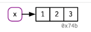

--

```{r}
y <- x
```

-- 

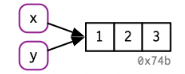


---
# Copy on modify

```{r}
x <- c(1, 2, 3)
y <- x

y[[3]] <- 4
x
y
```

--


---
# List

```{r}
l1 <- list(1, 2, 3)
```

--

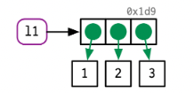

--

```{r}
l2 <- l1
```

--

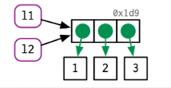

---
# List (cont.)

```{r}
l2[[3]] <- 4
```

--


---
# Data Frames

```{r}
d1 <- data.frame(x = c(1, 5, 6), y = c(2, 4, 3))
```

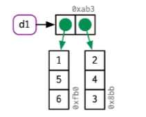

---
# Data Frames (cont.)

```{r}
d2 <- d1
d2[, 2] <- d2[, 2] * 2
```

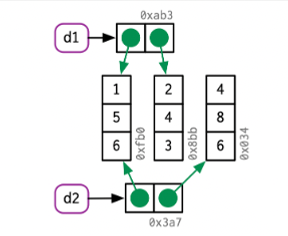

---
# Data Frames (cont.)

```{r}
d3 <- d1
d3[1, ] <- d3[1, ] * 3
```

--


---
# Character vectors

```{r}
x <- c("a", "a", "abc", "d")
```

--

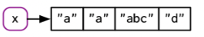

--


---

# Some more tips

If you have big data it can be very important to think about how to fast your code runs. This requires understanding which parts take a *llllooooonnnnnnnngggggggg* time.

--

<br><br>
* A useful [function](howhttps://www.rdocumentation.org/packages/utils/versions/3.6.2/topics/object.size) for checking how big an object is in R (S3) is `object.size()`.

* You can also time parts of your code to see which parts take time  - [here are 5 different examples](https://www.r-bloggers.com/2017/05/5-ways-to-measure-running-time-of-r-code/)

--

<br><br><center>
**Now back to Fannie Mae**
</center>

---

# Getting Started

.info-box[
We will only use the single family fixed rate mortgage (primary) data set not the HARP!
]

1. Read the overview in the main page to get an idea about the data - [Fannie Mae Single-Family Loan Performance Data](https://capitalmarkets.fanniemae.com/credit-risk-transfer/single-family-credit-risk-transfer/fannie-mae-single-family-loan-performance-data)

2. Understanding the variables. Choose the "Glossary and File Layout" file in the homepage (either csv or pdf, I prefer csv as it is easier to navigate, but the choice is yours!).

3. Read their FAQs. 

4. Take a look at their data set using the sample provided in their website (sample File).


---
# Fannie Mae Data Sample

```{r fm-data, echo=FALSE}
library(data.table)
lppub_column_names <- c("POOL_ID", "LOAN_ID", "ACT_PERIOD", "CHANNEL", "SELLER", "SERVICER",
                        "MASTER_SERVICER", "ORIG_RATE", "CURR_RATE", "ORIG_UPB", "ISSUANCE_UPB",
                        "CURRENT_UPB", "ORIG_TERM", "ORIG_DATE", "FIRST_PAY", "LOAN_AGE",
                        "REM_MONTHS", "ADJ_REM_MONTHS", "MATR_DT", "OLTV", "OCLTV",
                        "NUM_BO", "DTI", "CSCORE_B", "CSCORE_C", "FIRST_FLAG", "PURPOSE",
                        "PROP", "NO_UNITS", "OCC_STAT", "STATE", "MSA", "ZIP", "MI_PCT",
                        "PRODUCT", "PPMT_FLG", "IO", "FIRST_PAY_IO", "MNTHS_TO_AMTZ_IO",
                        "DLQ_STATUS", "PMT_HISTORY", "MOD_FLAG", "MI_CANCEL_FLAG", "Zero_Bal_Code",
                        "ZB_DTE", "LAST_UPB", "RPRCH_DTE", "CURR_SCHD_PRNCPL", "TOT_SCHD_PRNCPL",
                        "UNSCHD_PRNCPL_CURR", "LAST_PAID_INSTALLMENT_DATE", "FORECLOSURE_DATE",
                        "DISPOSITION_DATE", "FORECLOSURE_COSTS", "PROPERTY_PRESERVATION_AND_REPAIR_COSTS",
                        "ASSET_RECOVERY_COSTS", "MISCELLANEOUS_HOLDING_EXPENSES_AND_CREDITS",
                        "ASSOCIATED_TAXES_FOR_HOLDING_PROPERTY", "NET_SALES_PROCEEDS",
                        "CREDIT_ENHANCEMENT_PROCEEDS", "REPURCHASES_MAKE_WHOLE_PROCEEDS",
                        "OTHER_FORECLOSURE_PROCEEDS", "NON_INTEREST_BEARING_UPB", "PRINCIPAL_FORGIVENESS_AMOUNT",
                        "ORIGINAL_LIST_START_DATE", "ORIGINAL_LIST_PRICE", "CURRENT_LIST_START_DATE",
                        "CURRENT_LIST_PRICE", "ISSUE_SCOREB", "ISSUE_SCOREC", "CURR_SCOREB",
                        "CURR_SCOREC", "MI_TYPE", "SERV_IND", "CURRENT_PERIOD_MODIFICATION_LOSS_AMOUNT",
                        "CUMULATIVE_MODIFICATION_LOSS_AMOUNT", "CURRENT_PERIOD_CREDIT_EVENT_NET_GAIN_OR_LOSS",
                        "CUMULATIVE_CREDIT_EVENT_NET_GAIN_OR_LOSS", "HOMEREADY_PROGRAM_INDICATOR",
                        "FORECLOSURE_PRINCIPAL_WRITE_OFF_AMOUNT", "RELOCATION_MORTGAGE_INDICATOR",
                        "ZERO_BALANCE_CODE_CHANGE_DATE", "LOAN_HOLDBACK_INDICATOR", "LOAN_HOLDBACK_EFFECTIVE_DATE",
                        "DELINQUENT_ACCRUED_INTEREST", "PROPERTY_INSPECTION_WAIVER_INDICATOR",
                        "HIGH_BALANCE_LOAN_INDICATOR", "ARM_5_YR_INDICATOR", "ARM_PRODUCT_TYPE",
                        "MONTHS_UNTIL_FIRST_PAYMENT_RESET", "MONTHS_BETWEEN_SUBSEQUENT_PAYMENT_RESET",
                        "INTEREST_RATE_CHANGE_DATE", "PAYMENT_CHANGE_DATE", "ARM_INDEX",
                        "ARM_CAP_STRUCTURE", "INITIAL_INTEREST_RATE_CAP", "PERIODIC_INTEREST_RATE_CAP",
                        "LIFETIME_INTEREST_RATE_CAP", "MARGIN", "BALLOON_INDICATOR",
                        "PLAN_NUMBER", "FORBEARANCE_INDICATOR", "HIGH_LOAN_TO_VALUE_HLTV_REFINANCE_OPTION_INDICATOR",
                        "DEAL_NAME", "RE_PROCS_FLAG", "ADR_TYPE", "ADR_COUNT", "ADR_UPB")

lppub_column_classes <- c("character", "character", "character", "character", "character", "character",
                          "character", "numeric", "numeric", "numeric", "numeric",
                          "numeric", "numeric", "character", "character", "numeric", "numeric",
                          "numeric", "character", "numeric", "numeric", "character", "numeric",
                          "numeric", "numeric", "character", "character", "character",
                          "numeric", "character", "character", "character", "character",
                          "numeric", "character", "character", "character", "character",
                          "numeric", "character", "character", "character", "character",
                          "character", "character", "numeric", "character", "numeric",
                          "numeric", "numeric", "character", "character", "character",
                          "numeric", "numeric", "numeric", "numeric", "numeric", "numeric",
                          "numeric", "numeric", "numeric", "numeric", "numeric", "character",
                          "numeric", "character", "numeric", "numeric", "numeric", "numeric",
                          "numeric", "numeric", "character", "numeric", "numeric", "numeric",
                          "numeric", "character", "numeric", "character", "numeric", "character",
                          "numeric", "numeric", "character", "character", "numeric", "numeric",
                          "numeric", "numeric", "numeric", "numeric", "numeric", "numeric",
                          "numeric", "numeric", "numeric", "numeric", "numeric", "character",
                          "character", "character", "character", "character",
                          "character", "numeric", "numeric")

sample.data <- fread(here::here("data", "week 7", "sf-loan.csv"), sep = "|", col.names = lppub_column_names, colClasses = lppub_column_classes)
```

.overflow-scroll.h-75[
```{r readgrad-output, echo=FALSE}
knitr::kable(sample.data)
```
]

---

# Fannie Mae Data 

.aim-box.tl.w-70[
Breakout session

- What's is stored in each zip file?
- What are the variable names and what do they mean?
- Is there anything in the FAQs I need to be aware of? 

]

---

# Fannie Mae Data

.question-box[
How to make the data at account level? One account one row!
]

### Steps:

1. For each quarter make the file smaller by reducing the current transactional level data to single account data.
2. Read the raw data quarter by quarter. 

#### R script that are used:  
1. `00_read_data.R`. 
2. `01_import_data.R`. 
3. `02_combine.R`. 

---
# Cont.

Step 1:  Load the raw data and split it into acquisition table and performance table.

--

.overflow-scroll.h-75[
.f6[
```{r eval=FALSE}
####################################################################
# Here the Loan Performance data is modified into a one-loan-per-row dataset including key analytic data fields.
# We encourage exploration of this code to understand how certain fields in the statistical summary are derived.
####################################################################

#----Setup----
library(data.table)
library(tidyverse)

load_lppub_file <- function(filename, col_names, col_classes){
  file <- unzip(paste0("raw data/", filename))
  df <- fread(file, sep = "|", col.names = col_names, colClasses = col_classes)
  file.remove(paste0(substr(filename, 1, 6), ".csv"))
  return(df)
}

#----Define Tables----

lppub_column_names <- c("POOL_ID", "LOAN_ID", "ACT_PERIOD", "CHANNEL", "SELLER", "SERVICER",
                        "MASTER_SERVICER", "ORIG_RATE", "CURR_RATE", "ORIG_UPB", "ISSUANCE_UPB",
                        "CURRENT_UPB", "ORIG_TERM", "ORIG_DATE", "FIRST_PAY", "LOAN_AGE",
                        "REM_MONTHS", "ADJ_REM_MONTHS", "MATR_DT", "OLTV", "OCLTV",
                        "NUM_BO", "DTI", "CSCORE_B", "CSCORE_C", "FIRST_FLAG", "PURPOSE",
                        "PROP", "NO_UNITS", "OCC_STAT", "STATE", "MSA", "ZIP", "MI_PCT",
                        "PRODUCT", "PPMT_FLG", "IO", "FIRST_PAY_IO", "MNTHS_TO_AMTZ_IO",
                        "DLQ_STATUS", "PMT_HISTORY", "MOD_FLAG", "MI_CANCEL_FLAG", "ZERO_BAL_CODE",
                        "ZB_DTE", "LAST_UPB", "RPRCH_DTE", "CURR_SCHD_PRNCPL", "TOT_SCHD_PRNCPL",
                        "UNSCHD_PRNCPL_CURR", "LAST_PAID_INSTALLMENT_DATE", "FORECLOSURE_DATE",
                        "DISPOSITION_DATE", "FORECLOSURE_COSTS", "PROPERTY_PRESERVATION_AND_REPAIR_COSTS",
                        "ASSET_RECOVERY_COSTS", "MISCELLANEOUS_HOLDING_EXPENSES_AND_CREDITS",
                        "ASSOCIATED_TAXES_FOR_HOLDING_PROPERTY", "NET_SALES_PROCEEDS",
                        "CREDIT_ENHANCEMENT_PROCEEDS", "REPURCHASES_MAKE_WHOLE_PROCEEDS",
                        "OTHER_FORECLOSURE_PROCEEDS", "NON_INTEREST_BEARING_UPB", "PRINCIPAL_FORGIVENESS_AMOUNT",
                        "ORIGINAL_LIST_START_DATE", "ORIGINAL_LIST_PRICE", "CURRENT_LIST_START_DATE",
                        "CURRENT_LIST_PRICE", "ISSUE_SCOREB", "ISSUE_SCOREC", "CURR_SCOREB",
                        "CURR_SCOREC", "MI_TYPE", "SERV_IND", "CURRENT_PERIOD_MODIFICATION_LOSS_AMOUNT",
                        "CUMULATIVE_MODIFICATION_LOSS_AMOUNT", "CURRENT_PERIOD_CREDIT_EVENT_NET_GAIN_OR_LOSS",
                        "CUMULATIVE_CREDIT_EVENT_NET_GAIN_OR_LOSS", "HOMEREADY_PROGRAM_INDICATOR",
                        "FORECLOSURE_PRINCIPAL_WRITE_OFF_AMOUNT", "RELOCATION_MORTGAGE_INDICATOR",
                        "ZERO_BALANCE_CODE_CHANGE_DATE", "LOAN_HOLDBACK_INDICATOR", "LOAN_HOLDBACK_EFFECTIVE_DATE",
                        "DELINQUENT_ACCRUED_INTEREST", "PROPERTY_INSPECTION_WAIVER_INDICATOR",
                        "HIGH_BALANCE_LOAN_INDICATOR", "ARM_5_YR_INDICATOR", "ARM_PRODUCT_TYPE",
                        "MONTHS_UNTIL_FIRST_PAYMENT_RESET", "MONTHS_BETWEEN_SUBSEQUENT_PAYMENT_RESET",
                        "INTEREST_RATE_CHANGE_DATE", "PAYMENT_CHANGE_DATE", "ARM_INDEX",
                        "ARM_CAP_STRUCTURE", "INITIAL_INTEREST_RATE_CAP", "PERIODIC_INTEREST_RATE_CAP",
                        "LIFETIME_INTEREST_RATE_CAP", "MARGIN", "BALLOON_INDICATOR",
                        "PLAN_NUMBER", "FORBEARANCE_INDICATOR", "HIGH_LOAN_TO_VALUE_HLTV_REFINANCE_OPTION_INDICATOR",
                        "DEAL_NAME", "RE_PROCS_FLAG", "ADR_TYPE", "ADR_COUNT", "ADR_UPB")
lppub_column_classes <- c("character", "character", "character", "character", "character", "character",
                          "character", "numeric", "numeric", "numeric", "numeric",
                          "numeric", "numeric", "character", "character", "numeric", "numeric",
                          "numeric", "character", "numeric", "numeric", "character", "numeric",
                          "numeric", "numeric", "character", "character", "character",
                          "numeric", "character", "character", "character", "character",
                          "numeric", "character", "character", "character", "character",
                          "numeric", "character", "character", "character", "character",
                          "character", "character", "numeric", "character", "numeric",
                          "numeric", "numeric", "character", "character", "character",
                          "numeric", "numeric", "numeric", "numeric", "numeric", "numeric",
                          "numeric", "numeric", "numeric", "numeric", "numeric", "character",
                          "numeric", "character", "numeric", "numeric", "numeric", "numeric",
                          "numeric", "numeric", "character", "numeric", "numeric", "numeric",
                          "numeric", "character", "numeric", "character", "numeric", "character",
                          "numeric", "numeric", "character", "character", "numeric", "numeric",
                          "numeric", "numeric", "numeric", "numeric", "numeric", "numeric",
                          "numeric", "numeric", "numeric", "numeric", "numeric", "character",
                          "character", "character", "character", "character",
                          "character", "numeric", "numeric")


#----Load Data----

lppub_file <- load_lppub_file(FileName, lppub_column_names, lppub_column_classes)

## Create AQSN_DTE field from filename
acquisition_year <- substr(FileName, 1, 4)
acquisition_qtr <- substr(FileName, 5, 6)
if(acquisition_qtr == 'Q1'){
  acquisition_month <- '03'
} else if(acquisition_qtr == 'Q2'){
  acquisition_month <- '06'
} else if(acquisition_qtr == 'Q3'){
  acquisition_month <- '09'
} else {
  acquisition_month <- '12'
}
acquisition_date <- paste(acquisition_year, acquisition_month, '01', sep = "-")

## Load the base file
lppub_base <- lppub_file |>
  select(
    LOAN_ID,
    ACT_PERIOD,
    CHANNEL,
    SELLER,
    SERVICER,
    ORIG_RATE,
    CURR_RATE,
    ORIG_UPB,
    CURRENT_UPB,
    ORIG_TERM,
    ORIG_DATE,
    FIRST_PAY,
    LOAN_AGE,
    REM_MONTHS,
    ADJ_REM_MONTHS,
    MATR_DT,
    OLTV,
    OCLTV,
    NUM_BO,
    DTI,
    CSCORE_B,
    CSCORE_C,
    FIRST_FLAG,
    PURPOSE,
    PROP,
    NO_UNITS,
    OCC_STAT,
    STATE,
    MSA,
    ZIP,
    MI_PCT,
    PRODUCT,
    DLQ_STATUS,
    MOD_FLAG,
    ZERO_BAL_CODE,
    ZB_DTE,
    LAST_PAID_INSTALLMENT_DATE,
    FORECLOSURE_DATE,
    DISPOSITION_DATE,
    FORECLOSURE_COSTS,
    PROPERTY_PRESERVATION_AND_REPAIR_COSTS,
    ASSET_RECOVERY_COSTS,
    MISCELLANEOUS_HOLDING_EXPENSES_AND_CREDITS,
    ASSOCIATED_TAXES_FOR_HOLDING_PROPERTY,
    NET_SALES_PROCEEDS,
    CREDIT_ENHANCEMENT_PROCEEDS,
    REPURCHASES_MAKE_WHOLE_PROCEEDS,
    OTHER_FORECLOSURE_PROCEEDS,
    NON_INTEREST_BEARING_UPB,
    PRINCIPAL_FORGIVENESS_AMOUNT,
    RELOCATION_MORTGAGE_INDICATOR,
    MI_TYPE,
    SERV_IND,
    RPRCH_DTE,
    LAST_UPB
  ) |>
  mutate(
    ORIG_RATE = as.numeric(ORIG_RATE),
    CURR_RATE = as.numeric(CURR_RATE),
    REPCH_FLAG = if_else(is.na(RPRCH_DTE) == FALSE, 1, 0),
    ACT_PERIOD = paste(substr(ACT_PERIOD, 3, 6), substr(ACT_PERIOD, 1, 2), '01', sep = "-"),
    FIRST_PAY = paste(substr(FIRST_PAY, 3, 6), substr(FIRST_PAY, 1, 2), '01', sep = "-"),
    ORIG_DATE = paste(substr(ORIG_DATE, 3, 6), substr(ORIG_DATE, 1, 2), '01', sep = "-")
  ) |>
  arrange(LOAN_ID, ACT_PERIOD)

rm(lppub_file)


# Notes: Split the data into static "Acquisition" variables and dynamic "Performance" variables

#----Data Split 1: Acquisition Data----
acquisitionFile <- lppub_base |>
  select(LOAN_ID, ACT_PERIOD, CHANNEL, SELLER, ORIG_RATE, ORIG_UPB,
         ORIG_TERM, ORIG_DATE, FIRST_PAY, OLTV,
         OCLTV, NUM_BO, DTI, CSCORE_B, CSCORE_C,
         FIRST_FLAG, PURPOSE, PROP, NO_UNITS, OCC_STAT,
         STATE, ZIP, MI_PCT, PRODUCT, MI_TYPE,
         RELOCATION_MORTGAGE_INDICATOR) |>
  rename(
    ORIG_CHN = CHANNEL,
    ORIG_RTE = ORIG_RATE,
    ORIG_AMT = ORIG_UPB,
    ORIG_TRM = ORIG_TERM,
    ORIG_DTE = ORIG_DATE,
    FRST_DTE = FIRST_PAY,
    FTHB_FLG = FIRST_FLAG,
    PROP_TYP = PROP,
    NUM_UNIT = NO_UNITS,
    ZIP_3 = ZIP,
    PROD_TYPE = PRODUCT,
    RELO_FLG = RELOCATION_MORTGAGE_INDICATOR
  )

acqFirstPERIOD <- acquisitionFile |>
  group_by(LOAN_ID) |>
  summarize(FIRST_PERIOD = min(ACT_PERIOD)) |>
  left_join(acquisitionFile, by = c("LOAN_ID" = "LOAN_ID", "FIRST_PERIOD" = "ACT_PERIOD")) |>
  select(
    LOAN_ID, ORIG_CHN, SELLER, ORIG_RTE, ORIG_AMT,
    ORIG_TRM, ORIG_DTE, FRST_DTE, OLTV,
    OCLTV, NUM_BO, DTI, CSCORE_B, CSCORE_C,
    FTHB_FLG, PURPOSE, PROP_TYP, NUM_UNIT, OCC_STAT,
    STATE, ZIP_3, MI_PCT, PROD_TYPE, MI_TYPE,
    RELO_FLG
  ) |>
  mutate(
    AQSN_DTE = acquisition_date,
    MI_TYPE = case_when(
      MI_TYPE == '1' ~ 'BPMI', #MI_TYPE is recoded to be more descriptive
      MI_TYPE == '2' ~ 'LPMI',
      MI_TYPE == '3' ~ 'IPMI',
      TRUE ~ 'None'
    ),
    OCLTV = if_else(is.na(OCLTV), OLTV, OCLTV) #If OCLTV is missing, we replace it with OLTV
  )

baseTable1 <- acqFirstPERIOD

rm(acqFirstPERIOD)

#----Data Split 2: Performance Data----
performanceFile <- lppub_base |>
  select(LOAN_ID, ACT_PERIOD, SERVICER, CURR_RATE, CURRENT_UPB,
         LOAN_AGE, REM_MONTHS, ADJ_REM_MONTHS, MATR_DT, MSA,
         DLQ_STATUS, MOD_FLAG, ZERO_BAL_CODE, ZB_DTE, LAST_PAID_INSTALLMENT_DATE,
         FORECLOSURE_DATE, DISPOSITION_DATE, FORECLOSURE_COSTS, PROPERTY_PRESERVATION_AND_REPAIR_COSTS, ASSET_RECOVERY_COSTS,
         MISCELLANEOUS_HOLDING_EXPENSES_AND_CREDITS, ASSOCIATED_TAXES_FOR_HOLDING_PROPERTY, NET_SALES_PROCEEDS, CREDIT_ENHANCEMENT_PROCEEDS, REPURCHASES_MAKE_WHOLE_PROCEEDS,
         OTHER_FORECLOSURE_PROCEEDS, NON_INTEREST_BEARING_UPB, PRINCIPAL_FORGIVENESS_AMOUNT, REPCH_FLAG, LAST_UPB) |>
  rename(
    PERIOD = ACT_PERIOD,
    CURR_RATE = CURR_RATE,
    ACT_UPB = CURRENT_UPB,
    REM_MTHS = REM_MONTHS,
    MATURITY_DATE = MATR_DT,
    MOD_IND = MOD_FLAG,
    Z_ZB_CODE = ZERO_BAL_CODE,
    LPI_DTE = LAST_PAID_INSTALLMENT_DATE,
    FCC_DTE = FORECLOSURE_DATE,
    DISP_DTE = DISPOSITION_DATE,
    FCC_COST = FORECLOSURE_COSTS,
    PP_COST = PROPERTY_PRESERVATION_AND_REPAIR_COSTS,
    AR_COST = ASSET_RECOVERY_COSTS,
    IE_COST = MISCELLANEOUS_HOLDING_EXPENSES_AND_CREDITS,
    TAX_COST = ASSOCIATED_TAXES_FOR_HOLDING_PROPERTY,
    NS_PROCS = NET_SALES_PROCEEDS,
    CE_PROCS = CREDIT_ENHANCEMENT_PROCEEDS,
    RMW_PROCS = REPURCHASES_MAKE_WHOLE_PROCEEDS,
    O_PROCS = OTHER_FORECLOSURE_PROCEEDS,
    NON_INT_UPB = NON_INTEREST_BEARING_UPB,
    PRIN_FORG_UPB = PRINCIPAL_FORGIVENESS_AMOUNT,
    ZB_UPB = LAST_UPB
  ) |>
  mutate(
    MATURITY_DATE = if_else(MATURITY_DATE != '', paste(substr(MATURITY_DATE, 3, 6), substr(MATURITY_DATE, 1, 2), '01', sep = '-'), MATURITY_DATE),
    ZB_DTE = if_else(ZB_DTE != '', paste(substr(ZB_DTE, 3, 6), substr(ZB_DTE, 1, 2), '01', sep = '-'), ZB_DTE),
    LPI_DTE = if_else(LPI_DTE != '', paste(substr(LPI_DTE, 3, 6), substr(LPI_DTE, 1, 2), '01', sep = '-'), LPI_DTE),
    FCC_DTE = if_else(FCC_DTE != '', paste(substr(FCC_DTE, 3, 6), substr(FCC_DTE, 1, 2), '01', sep = '-'), FCC_DTE),
    DISP_DTE = if_else(DISP_DTE != '', paste(substr(DISP_DTE, 3, 6), substr(DISP_DTE, 1, 2), '01', sep = '-'), DISP_DTE)
  )

rm(lppub_base)

#----Building base table----

## Create the second base table with the latest-available or aggregated data from the Performance fields
### Get the last activity date
last_act_dte_table <- performanceFile |>
  group_by(LOAN_ID) |>
  summarize(LAST_ACTIVITY_DATE = max(PERIOD))

### Get the Last UPB
last_upb_table <- performanceFile |>
  filter(!is.na(ACT_UPB) & ACT_UPB > 0) |>
  group_by(LOAN_ID) |>
  summarize(
    LAST_UPB_DATE = max(PERIOD)
  ) |>
  left_join(performanceFile, by = c("LOAN_ID" = "LOAN_ID", "LAST_UPB_DATE" = "PERIOD")) |>
  select(LOAN_ID, ACT_UPB) |>
  rename(LAST_UPB = ACT_UPB)

### Get the current rate
last_rt_table <- performanceFile |>
  filter(!is.na(CURR_RATE)) |>
  group_by(LOAN_ID) |>
  summarize(
    LAST_RT_DATE = max(PERIOD)
  ) |>
  left_join(performanceFile, by = c("LOAN_ID" = "LOAN_ID", "LAST_RT_DATE" = "PERIOD")) |>
  select(LOAN_ID, CURR_RATE) |>
  rename(LAST_RT = CURR_RATE) |>
  mutate(LAST_RT = round(LAST_RT, 3))

### Get the max ZB code
zb_code_table <- performanceFile |>
  filter(Z_ZB_CODE != '') |>
  group_by(LOAN_ID) |>
  summarize(ZB_CODE_DT = max(PERIOD)) |>
  left_join(performanceFile, by = c("LOAN_ID" = "LOAN_ID", "ZB_CODE_DT" = "PERIOD")) |>
  select(LOAN_ID, Z_ZB_CODE) |>
  rename(ZB_CODE = Z_ZB_CODE)

### Get the latest upb, interest rate and zb code
max_table <- last_act_dte_table |>
  left_join(performanceFile, by = c("LOAN_ID" = "LOAN_ID", "LAST_ACTIVITY_DATE" = "PERIOD")) |>
  left_join(last_upb_table, by = c("LOAN_ID" = "LOAN_ID")) |>
  left_join(last_rt_table, by = c("LOAN_ID" = "LOAN_ID")) |>
  left_join(zb_code_table, by = c("LOAN_ID" = "LOAN_ID"))

rm(last_act_dte_table)
rm(last_rt_table)
rm(last_upb_table)
rm(zb_code_table)

### Get the latest service date
servicer_table <- performanceFile |>
  filter(SERVICER != '') |>
  group_by(LOAN_ID) |>
  summarize(SERVICER_PERIOD = max(PERIOD)) |>
  left_join(performanceFile, by = c("LOAN_ID" = "LOAN_ID", "SERVICER_PERIOD" = "PERIOD")) |>
  select(LOAN_ID, SERVICER)

### Get the max non interest UPB
non_int_upb_table <- performanceFile |>
  mutate(NON_INT_UPB = if_else(is.na(NON_INT_UPB), 0, NON_INT_UPB)) |>
  group_by(LOAN_ID) |>
  summarize(NON_INT_UPB = max(NON_INT_UPB))

baseTable2 <- baseTable1 |>
  left_join(max_table |> select(!c(SERVICER, NON_INT_UPB)), by = "LOAN_ID") |>
  left_join(servicer_table, by = 'LOAN_ID') |>
  left_join(non_int_upb_table, by = 'LOAN_ID')

rm(max_table)
rm(servicer_table)
rm(non_int_upb_table)

## Create the third base table with the latest-available foreclosure/disposition data
fcc_table <- performanceFile |>
  filter(!is.na(LPI_DTE) & !is.na(FCC_DTE) & !is.na(DISP_DTE))

fcc_table <- fcc_table |>
  group_by(LOAN_ID) |>
  summarize(
    LPI_DTE = max(LPI_DTE),
    FCC_DTE = max(FCC_DTE),
    DISP_DTE = max(DISP_DTE)
  )

baseTable3 <- baseTable2 |> select(!c(LPI_DTE, FCC_DTE, DISP_DTE)) |>
  left_join(fcc_table, by = "LOAN_ID")

rm(baseTable2)
rm(fcc_table)

### Create the series of "first DQ occurrence" tables and loan modification tables
slimPerformanceFile <- performanceFile |>
  select(LOAN_ID, PERIOD, DLQ_STATUS, Z_ZB_CODE, ACT_UPB, ZB_UPB, MOD_IND, MATURITY_DATE, REM_MTHS) |>
  mutate(
    DLQ_STATUS = if_else(DLQ_STATUS == 'XX', '999', DLQ_STATUS),
    DLQ_STATUS = as.numeric(DLQ_STATUS)
  )

f30_table <- slimPerformanceFile |>
  filter(DLQ_STATUS >= 1 & DLQ_STATUS < 999, Z_ZB_CODE == '') |>
  group_by(LOAN_ID) |>
  summarize(F30_DTE = min(PERIOD)) |>
  left_join(slimPerformanceFile, by = c("LOAN_ID" = "LOAN_ID", "F30_DTE" = "PERIOD")) |>
  select(LOAN_ID, F30_DTE, ACT_UPB) |>
  rename(F30_UPB = ACT_UPB)

f60_table <- slimPerformanceFile |>
  filter(DLQ_STATUS >= 2 & DLQ_STATUS < 999, Z_ZB_CODE == '') |>
  group_by(LOAN_ID) |>
  summarize(F60_DTE = min(PERIOD)) |>
  left_join(slimPerformanceFile,  by = c("LOAN_ID" = "LOAN_ID", "F60_DTE" = "PERIOD")) |>
  select(LOAN_ID, F60_DTE, ACT_UPB) |>
  rename(F60_UPB = ACT_UPB)

f90_table <- slimPerformanceFile |>
  filter(DLQ_STATUS >= 3 & DLQ_STATUS < 999, Z_ZB_CODE == '') |>
  group_by(LOAN_ID) |>
  summarize(F90_DTE = min(PERIOD)) |>
  left_join(slimPerformanceFile, by = c("LOAN_ID" = "LOAN_ID", "F90_DTE" = "PERIOD")) |>
  select(LOAN_ID, F90_DTE, ACT_UPB) |>
  rename(F90_UPB = ACT_UPB)

f120_table <- slimPerformanceFile |>
  filter(DLQ_STATUS >= 4 & DLQ_STATUS < 999, Z_ZB_CODE == '') |>
  group_by(LOAN_ID) |>
  summarize(F120_DTE = min(PERIOD)) |>
  left_join(slimPerformanceFile, by = c("LOAN_ID" = "LOAN_ID", "F120_DTE" = "PERIOD")) |>
  select(LOAN_ID, F120_DTE, ACT_UPB) |>
  rename(F120_UPB = ACT_UPB)

f180_table <- slimPerformanceFile |>
  filter(DLQ_STATUS >= 6 & DLQ_STATUS < 999, Z_ZB_CODE == '') |>
  group_by(LOAN_ID) |>
  summarize(F180_DTE = min(PERIOD)) |>
  left_join(slimPerformanceFile, by = c("LOAN_ID" = "LOAN_ID", "F180_DTE" = "PERIOD")) |>
  select(LOAN_ID, F180_DTE, ACT_UPB) |>
  rename(F180_UPB = ACT_UPB)

fce_table <- slimPerformanceFile |>
  filter((Z_ZB_CODE == '02' | Z_ZB_CODE == '03' | Z_ZB_CODE == '09' | Z_ZB_CODE == '15') | (DLQ_STATUS >= 6 & DLQ_STATUS < 999)) |>
  group_by(LOAN_ID) |>
  summarize(FCE_DTE = min(PERIOD)) |>
  left_join(slimPerformanceFile, by = c("LOAN_ID" = "LOAN_ID", "FCE_DTE" = "PERIOD")) |>
  select(LOAN_ID, FCE_DTE, ACT_UPB, ZB_UPB) |>
  mutate(FCE_UPB = ZB_UPB + ACT_UPB) |>
  select(LOAN_ID, FCE_DTE, FCE_UPB)

fmod_dte_table <- slimPerformanceFile |>
  filter(MOD_IND == 'Y', Z_ZB_CODE == '') |>
  group_by(LOAN_ID) |>
  summarize(FMOD_DTE = min(PERIOD))

fmod_table <- slimPerformanceFile |>
  filter(MOD_IND == 'Y', Z_ZB_CODE == '') |>
  left_join(fmod_dte_table, by = c("LOAN_ID" = "LOAN_ID")) |>
  filter((((as.numeric(substr(PERIOD,1,4))*12) + as.numeric(substr(PERIOD,6,7)))  <=  ((as.numeric(substr(FMOD_DTE,1,4))*12) + as.numeric(substr(FMOD_DTE,6,7))) + 3)) |>
  group_by(LOAN_ID) |>
  summarize(FMOD_UPB = max(ACT_UPB)) |>
  left_join(fmod_dte_table, by = "LOAN_ID") |>
  left_join(slimPerformanceFile, by = c("LOAN_ID" = "LOAN_ID", "FMOD_DTE" = "PERIOD")) |>
  select(LOAN_ID, FMOD_DTE, FMOD_UPB, MATURITY_DATE)

rm(fmod_dte_table)

### Compute NUM_PERIODS_120 field (the number of PERIODs elapsed from origination to a loan becoming at least 120 days delinquent)
num_120_table <- f120_table |>
  left_join(acquisitionFile, by = 'LOAN_ID') |>
  mutate(
    Z_NUM_PERIODS_120 = (((as.numeric(substr(F120_DTE,1,4))*12) + as.numeric(substr(F120_DTE,6,7))) - ((as.numeric(substr(FRST_DTE,1,4))*12) + as.numeric(substr(FRST_DTE,6,7))) + 1)
  ) |>
  select(LOAN_ID, Z_NUM_PERIODS_120)

rm(acquisitionFile)

### Compute MODTRM_CHNG field (a flag for whether the term of a loan was changed as part of a loan modification)
orig_maturity_table <- slimPerformanceFile |>
  filter(!is.na(MATURITY_DATE)) |>
  group_by(LOAN_ID) |>
  summarize(MATURITY_DATE_PERIOD = min(PERIOD)) |>
  left_join(slimPerformanceFile, by = c("LOAN_ID" = "LOAN_ID", "MATURITY_DATE_PERIOD" = "PERIOD")) |>
  select(LOAN_ID, MATURITY_DATE) |>
  rename(ORIG_MATURITY_DATE = MATURITY_DATE)

trm_chng_table <- slimPerformanceFile |>
  group_by(LOAN_ID) |>
  mutate(
    PREV_REM_MTHS = lag(REM_MTHS, n = 1, order_by = PERIOD),
    TRM_CHNG = REM_MTHS - PREV_REM_MTHS,
    DID_TRM_CHNG = if_else(TRM_CHNG >= 0, 1, 0)
  ) |>
  filter(DID_TRM_CHNG == 1) |>
  group_by(LOAN_ID) |>
  summarize(TRM_CHNG_DT = min(PERIOD))

modtrm_table <- fmod_table |>
  left_join(orig_maturity_table, by = 'LOAN_ID') |>
  left_join(trm_chng_table, by = 'LOAN_ID') |>
  mutate(MODTRM_CHNG = if_else(MATURITY_DATE != ORIG_MATURITY_DATE | !is.na(TRM_CHNG_DT), 1, 0)) |>
  select(LOAN_ID, MODTRM_CHNG)

rm(orig_maturity_table)
rm(trm_chng_table)

### Compute MODTRM_UPB field (a flag for whether the balance of a loan was changed as part of a loan modification)
pre_mod_upb_table <- slimPerformanceFile |>
  left_join(fmod_table, by = 'LOAN_ID') |>
  filter(PERIOD < FMOD_DTE) |>
  group_by(LOAN_ID) |>
  summarize(PRE_MOD_PERIOD = max(PERIOD)) |>
  left_join(slimPerformanceFile, by = c("LOAN_ID" = "LOAN_ID", "PRE_MOD_PERIOD" = "PERIOD")) |>
  rename(PRE_MOD_UPB = ACT_UPB)

rm(slimPerformanceFile)

modupb_table <- fmod_table |>
  left_join(pre_mod_upb_table, by = 'LOAN_ID') |>
  mutate(MODUPB_CHNG = if_else(FMOD_UPB >= PRE_MOD_UPB, 1, 0)) |>
  select(LOAN_ID, MODUPB_CHNG)

rm(pre_mod_upb_table)

### Create the fourth base table by joining the first-DQ-occurence and loan modification tables
baseTable4 <- baseTable3 |>
  left_join(f30_table, by = 'LOAN_ID') |>
  left_join(f60_table, by = 'LOAN_ID') |>
  left_join(f90_table, by = 'LOAN_ID') |>
  left_join(f120_table, by = 'LOAN_ID') |>
  left_join(f180_table, by = 'LOAN_ID') |>
  left_join(fce_table, by = 'LOAN_ID') |>
  left_join(fmod_table, by = 'LOAN_ID') |>
  left_join(num_120_table, by = 'LOAN_ID') |>
  left_join(modtrm_table, by = 'LOAN_ID') |>
  left_join(modupb_table, by = 'LOAN_ID') |>
  mutate(
    F30_UPB = if_else(is.na(F30_UPB) & !is.na(F30_DTE), ORIG_AMT, F30_UPB),
    F60_UPB = if_else(is.na(F60_UPB) & !is.na(F60_DTE), ORIG_AMT, F60_UPB),
    F90_UPB = if_else(is.na(F90_UPB) & !is.na(F90_DTE), ORIG_AMT, F90_UPB),
    F120_UPB = if_else(is.na(F120_UPB) & !is.na(F120_DTE), ORIG_AMT, F120_UPB),
    F180_UPB = if_else(is.na(F180_UPB) & !is.na(F180_DTE), ORIG_AMT, F180_UPB),
    FCE_UPB = if_else(is.na(FCE_UPB) & !is.na(FCE_DTE), ORIG_AMT, FCE_UPB)
  )

rm(baseTable3)
rm(f30_table)
rm(f60_table)
rm(f90_table)
rm(f120_table)
rm(f180_table)
rm(fce_table)
rm(fmod_table)
rm(num_120_table)
rm(modtrm_table)
rm(modupb_table)

### Create the fifth base table by computing loan status fields according to specific rules
baseTable5 <- baseTable4 |>
  mutate(
    LAST_DTE = if_else(DISP_DTE != '', DISP_DTE, LAST_ACTIVITY_DATE),
    REPCH_FLAG = if_else(REPCH_FLAG == 'Y', 1, 0),
    PFG_COST = PRIN_FORG_UPB,
    MOD_FLAG = if_else(!is.na(FMOD_DTE), 1, 0),
    MODFG_COST = if_else(MOD_IND == 'Y', 0, NA_real_),
    MODFG_COST = if_else(MOD_IND == 'Y' & PFG_COST > 0, PFG_COST, 0),
    MODTRM_CHNG = if_else(is.na(MODTRM_CHNG), 0, MODTRM_CHNG),
    MODUPB_CHNG = if_else(is.na(MODUPB_CHNG), 0, MODUPB_CHNG),
    CSCORE_MN = if_else(!is.na(CSCORE_C) & CSCORE_C < CSCORE_B, CSCORE_C, CSCORE_B),
    CSCORE_MN = if_else(is.na(CSCORE_MN), CSCORE_B, CSCORE_MN),
    CSCORE_MN = if_else(is.na(CSCORE_MN), CSCORE_C, CSCORE_MN),
    ORIG_VAL = round(ORIG_AMT/(OLTV/100), digits = 2),
    DLQ_STATUS = if_else(DLQ_STATUS == 'X' | DLQ_STATUS == 'XX', '999', DLQ_STATUS),
    Z_LAST_STATUS = as.numeric(DLQ_STATUS),
    LAST_STAT = case_when(
      ZB_CODE == '09' ~ 'F',
      ZB_CODE == '03' ~ 'S',
      ZB_CODE == '02' ~ 'T',
      ZB_CODE == '06' ~ 'R',
      ZB_CODE == '15' ~ 'N',
      ZB_CODE == '16' ~ 'L',
      ZB_CODE == '01' ~ 'P',
      Z_LAST_STATUS < 999 & Z_LAST_STATUS >= 9 ~ '9',
      Z_LAST_STATUS == 8 ~ '8',
      Z_LAST_STATUS == 7 ~ '7',
      Z_LAST_STATUS == 6 ~ '6',
      Z_LAST_STATUS == 5 ~ '5',
      Z_LAST_STATUS == 4 ~ '4',
      Z_LAST_STATUS == 3 ~ '3',
      Z_LAST_STATUS == 2 ~ '2',
      Z_LAST_STATUS == 1 ~ '1',
      Z_LAST_STATUS == 0 ~ 'C',
      TRUE ~ 'X'
    ),
    FCC_DTE = if_else(FCC_DTE == '' & (LAST_STAT == 'F' | LAST_STAT == 'S' | LAST_STAT == 'N' | LAST_STAT == 'T'), ZB_DTE, FCC_DTE),
    COMPLT_FLG = if_else(DISP_DTE != '', 1, 0),
    COMPLT_FLG = if_else(LAST_STAT != 'F' & LAST_STAT != 'S' & LAST_STAT != 'N' & LAST_STAT != 'T', NA_real_, COMPLT_FLG),
    INT_COST = round(if_else(COMPLT_FLG == 1 & LPI_DTE != '', ((((as.numeric(substr(LAST_DTE,1,4))*12) + as.numeric(substr(LAST_DTE,6,7))) - ((as.numeric(substr(LPI_DTE,1,4))*12) + as.numeric(substr(LPI_DTE,6,7)))) * (((LAST_RT / 100) - 0.0035) / 12) * (LAST_UPB + (-1 * NON_INT_UPB))), NA_real_), digits = 2),
    INT_COST = if_else(COMPLT_FLG == 1 & is.na(INT_COST), 0, INT_COST),
    FCC_COST = if_else(COMPLT_FLG == 1 & is.na(FCC_COST), 0, FCC_COST),
    PP_COST = if_else(COMPLT_FLG == 1 & is.na(PP_COST), 0, PP_COST),
    AR_COST = if_else(COMPLT_FLG == 1 & is.na(AR_COST), 0, AR_COST),
    IE_COST = if_else(COMPLT_FLG == 1 & is.na(IE_COST), 0, IE_COST),
    TAX_COST = if_else(COMPLT_FLG == 1 & is.na(TAX_COST), 0, TAX_COST),
    PFG_COST = if_else(COMPLT_FLG == 1 & is.na(PFG_COST), 0, PFG_COST),
    CE_PROCS = if_else(COMPLT_FLG == 1 & is.na(CE_PROCS), 0, CE_PROCS),
    NS_PROCS = if_else(COMPLT_FLG == 1 & is.na(NS_PROCS), 0, NS_PROCS),
    RMW_PROCS = if_else(COMPLT_FLG == 1 & is.na(RMW_PROCS), 0, RMW_PROCS),
    O_PROCS = if_else(COMPLT_FLG == 1 & is.na(O_PROCS), 0, O_PROCS),

    NET_LOSS = round(if_else(COMPLT_FLG == 1, (LAST_UPB + FCC_COST + PP_COST + AR_COST + IE_COST + TAX_COST + PFG_COST + INT_COST + -1*NS_PROCS + -1*CE_PROCS + -1*RMW_PROCS + -1*O_PROCS), NA_real_), digits = 2),
    NET_SEV = round(if_else(COMPLT_FLG == 1, (NET_LOSS / LAST_UPB), NA_real_), digits = 6),
  )

rm(baseTable4)

### Compute MODIR_COST, MODFB_COST and other loan modification fields
modir_table <- baseTable1 |>
  left_join(performanceFile, by = 'LOAN_ID') |>
  filter(MOD_IND == 'Y') |>
  mutate(
    NON_INT_UPB = if_else(is.na(NON_INT_UPB), 0, NON_INT_UPB),
    MODIR_COST = round(if_else(MOD_IND == 'Y', (((ORIG_RTE - CURR_RATE) / 1200) * ACT_UPB), 0), digits = 2),
    MODFB_COST = round(if_else(MOD_IND == 'Y' & NON_INT_UPB > 0, (CURR_RATE / 1200) * NON_INT_UPB, 0), digits = 2)
  ) |>
  group_by(LOAN_ID) |>
  summarize(
    MODIR_COST = sum(MODIR_COST),
    MODFB_COST = sum(MODFB_COST)
  ) |>
  mutate(
    MODTOT_COST = round(MODFB_COST + MODIR_COST, 2)
  )

rm(baseTable1)
rm(performanceFile)

### Create the sixth base table by joining the remaining loan modifcation fields to the rest of our data
baseTable6 <- baseTable5 |>
  left_join(modir_table, by = 'LOAN_ID') |>
  mutate(
    COMPLT_FLG = as.character(COMPLT_FLG),
    COMPLT_FLG = if_else(is.na(COMPLT_FLG), '', COMPLT_FLG),
    NON_INT_UPB =if_else(COMPLT_FLG == '1' & is.na(NON_INT_UPB), 0, NON_INT_UPB),
    MODIR_COST = round(if_else(COMPLT_FLG == '1', MODIR_COST + ((((as.numeric(substr(LAST_DTE,1,4))*12) + as.numeric(substr(LAST_DTE,6,7))) - ((as.numeric(substr(ZB_DTE,1,4))*12) + as.numeric(substr(ZB_DTE,6,7)))) * ((ORIG_RTE - LAST_RT) / 1200) * LAST_UPB), MODIR_COST), 2),
    MODFB_COST = round(if_else(COMPLT_FLG == '1', MODFB_COST + ((((as.numeric(substr(LAST_DTE,1,4))*12) + as.numeric(substr(LAST_DTE,6,7))) - ((as.numeric(substr(ZB_DTE,1,4))*12) + as.numeric(substr(ZB_DTE,6,7)))) * (LAST_RT / 1200) * NON_INT_UPB), MODFB_COST), 2),
    COMPLT_FLG = as.numeric(COMPLT_FLG),
    ORIG_RTE <- round(as.numeric(ORIG_RTE),3)
  )

rm(baseTable5)
rm(modir_table)

gc()

### Create the seventh and final base table by selecting and reordering only the data fields we need for our statistical summary analysis
baseTable7 <- select(baseTable6,
                     LOAN_ID, ORIG_CHN, SELLER, LOAN_AGE, ORIG_RTE, ORIG_AMT,
                     ORIG_TRM, OLTV, OCLTV, NUM_BO, DTI,
                     CSCORE_B, FTHB_FLG, PURPOSE, PROP_TYP, NUM_UNIT,
                     OCC_STAT, STATE, ZIP_3, MI_PCT, CSCORE_C,
                     RELO_FLG, MI_TYPE, AQSN_DTE, ORIG_DTE, FRST_DTE,
                     LAST_RT, LAST_UPB, MSA, FCC_COST, PP_COST,
                     AR_COST, IE_COST, TAX_COST, NS_PROCS, CE_PROCS,
                     RMW_PROCS, O_PROCS, REPCH_FLAG, LAST_ACTIVITY_DATE,
                     LPI_DTE, FCC_DTE, DISP_DTE, SERVICER, F30_DTE,
                     F60_DTE, F90_DTE, F120_DTE, F180_DTE, FCE_DTE,
                     F180_UPB, FCE_UPB, F30_UPB, F60_UPB, F90_UPB,
                     MOD_FLAG, FMOD_DTE, FMOD_UPB, MODIR_COST, MODFB_COST,
                     MODFG_COST, MODTRM_CHNG, MODUPB_CHNG, Z_NUM_PERIODS_120, F120_UPB,
                     CSCORE_MN, ORIG_VAL, LAST_DTE, LAST_STAT, COMPLT_FLG,
                     INT_COST, PFG_COST, NET_LOSS, NET_SEV, MODTOT_COST)

rm(baseTable6)

### Export the dataframe as a .csv
baseTable7 |>
  dplyr::mutate_if(is.double, function(x) dplyr::if_else(is.na(x), NA_character_, format(x, scientific = FALSE, drop0trailing = TRUE, trim = TRUE))) |>
  data.table::fwrite(paste0("final data/", fileYear, fileQtr, "_stat.csv"), sep = ",", na = "NULL", logical01 = TRUE, scipen = 100, col.names = TRUE, row.names = FALSE)

rm(baseTable7)

rm(list=ls())

gc()
```
]
]

---
# Cont.

Step 2: Read the data quarter by quarter

.overflow-scroll.h-85[
.f6[
```{r eval=FALSE}
###################################################
# Obj: Read in Fannie Mae Data from large zip file
###################################################

#----Setup----

list.of.packages <- c("MASS", "data.table", "tidyverse", "here", "stringr",
                      "lubridate", "ggplot2", "usmap", "gganimate",
                      "glmnet")
new.packages <- list.of.packages[!(list.of.packages %in% installed.packages()[,"Package"])]
if(length(new.packages)) install.packages(new.packages)
invisible(lapply(list.of.packages, require, character.only = TRUE))

#----Importing data----

setwd(dirname(rstudioapi::getActiveDocumentContext()$path))

files <- list.files("raw data")

for (file in files){
  # Set up file names
  fileYear <- stringr::str_sub(file, 1, 4)
  fileQtr <- stringr::str_sub(file, 5, 6)
  FileName <- file
  flush.console()
  print(FileName)

  # Read data one by one
  source('00_read_data.R')
}
```

]
]

---
# Cont.

Step 3: Combine all quarters data into 1 file.

.overflow-scroll.h-75[
.f6[
```{r eval=FALSE}
########################################
# Obj: Combine all stat.csv files into 1
#      for analysis purposes
########################################

#----Define column headers and classes----
stat_column_names <- c(
  "LOAN_ID", "ORIG_CHN", "SELLER", "loan_age", "orig_rt", "orig_amt",
  "orig_trm", "oltv", "ocltv", "num_bo", "dti",
  "CSCORE_B", "FTHB_FLG", "purpose", "PROP_TYP", "NUM_UNIT",
  "occ_stat", "state", "zip_3", "mi_pct", "CSCORE_C",
  "relo_flg", "MI_TYPE", "AQSN_DTE", "ORIG_DTE", "FRST_DTE",
  "LAST_RT", "LAST_UPB", "msa", "FCC_COST", "PP_COST",
  "AR_COST", "IE_COST", "TAX_COST", "NS_PROCS", "CE_PROCS",
  "RMW_PROCS", "O_PROCS", "repch_flag", "LAST_ACTIVITY_DATE",
  "LPI_DTE", "FCC_DTE", "DISP_DTE", "SERVICER", "F30_DTE",
  "F60_DTE", "F90_DTE", "F120_DTE", "F180_DTE", "FCE_DTE",
  "F180_UPB", "FCE_UPB", "F30_UPB", "F60_UPB", "F90_UPB",
  "MOD_FLAG", "FMOD_DTE", "FMOD_UPB", "MODIR_COST", "MODFB_COST",
  "MODFG_COST", "MODTRM_CHNG", "MODUPB_CHNG", "z_num_periods_120", "F120_UPB",
  "CSCORE_MN", "ORIG_VAL", "LAST_DTE", "LAST_STAT", "COMPLT_FLG",
  "INT_COST", "PFG_COST", "NET_LOSS", "NET_SEV", "MODTOT_COST"
)

stat_column_classes <- c(
  "character", "character", "character", "numeric", "numeric", "numeric",
  "numeric", "numeric", "numeric", "numeric", "numeric",
  "numeric", "character", "character", "character", "numeric",
  "character", "character", "character", "numeric", "numeric",
  "character", "character", "character", "character", "character",
  "numeric", "numeric", "character", "numeric", "numeric",
  "numeric", "numeric", "numeric", "numeric", "numeric",
  "numeric", "numeric", "character", "character",
  "character", "character", "character", "character", "character",
  "character", "character", "character", "character", "character",
  "numeric", "numeric", "numeric", "numeric", "numeric",
  "character", "character", "numeric", "numeric", "numeric",
  "numeric", "character", "character", "numeric", "numeric",
  "numeric", "numeric", "character", "character", "character",
  "numeric", "numeric", "numeric", "numeric", "numeric"
)

#----Getting summary statistics----
files <- list.files("final data", pattern = "*.csv")

alldata <- data.frame()

for (file in files) {
  # Set up file names
  FileName <- paste0("final data/", file)

  # combine all
  data <- fread(FileName, sep = ",", col.names = stat_column_names, colClasses = stat_column_classes, na.strings = "NULL")
  alldata <- bind_rows(alldata, data)
}

saveRDS(alldata, paste0("final data/", "2016_22_data.rds"))
```
]
]

---
# Fannie Mae Data

.flex[
.border-box[**Default (Response variable):**
* .red[defaulted] is defined as if the borrower fails to pay back the money in .red[90 days]. 

**Notes:**
  * 90+ days past due shows borrower distress -> serious delinquencies.
  * However the definition of default can varies.
  * According to the law, once the payment is past due 60 days -> defaulted account.
]

.border-box[**Borrower Characteristics:** 🧑🏻‍🤝‍🧑🏾
* FICO scores  
* state  
* age  
* occupation
]

.border-box[**Loan/Property Information:** 🏠
* occupancy status 
* interest rate at origination  
* term of loan  
* loan to value ratio (LTV)
* debt to income ratio (DTI)  
* mortgage insurance percentage (LMI)
]
]


---
# What can you learn from the Fannie Mae data?

```{r img1, echo = FALSE, out.width = "50%"}
knitr::include_graphics("images/lecture-07/overallPlot.png")
```

--
.absolute.bottom-3.right-3.bg-white.ba.pa3[
- Look at year 2005 onwards! 👁️👁️
- There is a hint of crisis before year 2008!
]

---
# What can you learn from the Fannie Mae data (from our data set)?

```{r img2, echo = FALSE, out.width = "80%"}
knitr::include_graphics("images/lecture-07/def_rate_overtime.png")
```

--
.absolute.bottom-3.right-3.bg-white.ba.pa3[
- Look at year 2020! 👁️👁️
]

---
# Delinquency (from 2016 onwards)

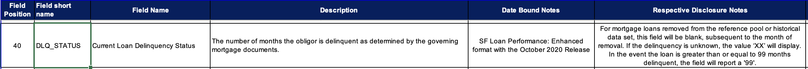

.pull-left[
.overflow-scroll.h-65[
.f6[
```{r delinquent, eval = FALSE}
f60_table <- performancefile %>%
  filter(dlq_status >= 2 & dlq_status < 999, z_zb_code == '') %>%
  group_by(LOAN_ID) %>%
  summarize(F60_DTE = min(period)) %>%
  left_join(performancefile,  by = c("LOAN_ID" = "LOAN_ID", "F60_DTE" = "period")) %>%
  select(LOAN_ID, F60_DTE, act_upb) %>%
  rename(F60_UPB = act_upb)
```
]
]
]

.pull-right[
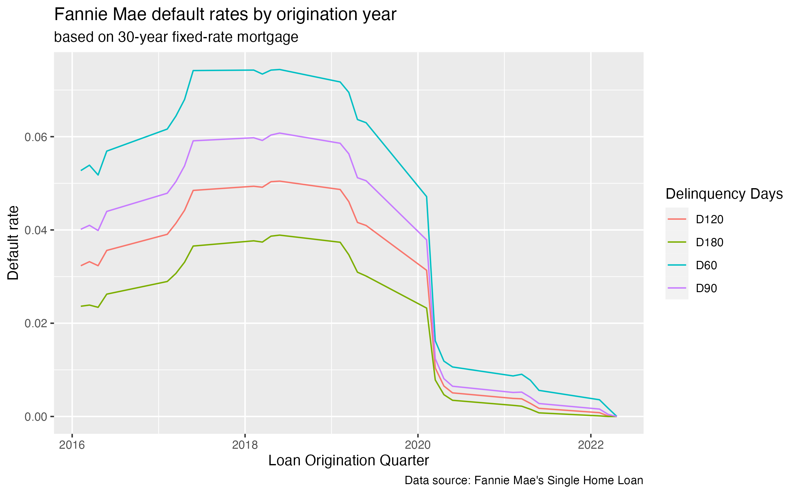
]


---
# Delinquency by Fico Scores

.pull-left[
.f6[
```{r fico, eval = FALSE}
ggplot(alldata %>% filter(orig_yr >= 2016),
       aes(x = CSCORE_B,
           group = orig_yr,
           )) +
  geom_histogram(fill = "red") +
  ggtitle("FICO scores distribution from year 2016 to 2021") +
  labs(subtitle = ("Year: {closest_state}"),
       ylab = "Frequency",
       xlab = "FICO Score") +
  transition_states(orig_yr,
                    transition_length = 6,
                    state_length = 1) -> plot1
anim_save("Ficohistogram.gif", plot1)
```
]
]

.pull-right[
```{r echo=FALSE}
knitr::include_graphics("images/lecture-07/Ficohistogram.gif")
```
]


---
# Default rate by States

.pull-left[
.f6[
```{r map, eval=FALSE}
#library(gganimate)
datamap <- alldata %>% 
  filter(orig_yq >= 2016.1) %>% 
  group_by(state, orig_yr) %>% 
  summarize(D90 = sum(!is.na(F90_DTE))/length(F90_DTE))

plot_usmap(
  data = datamap,
  labels = TRUE,
  values = "D90",
  color = "red"
) +
  scale_fill_continuous(name = "Delinquency by 90 days", low = "white", high = "red") +
  theme(legend.position = "right") -> mapPlot

transitionMap <- mapPlot +
  labs(title = "Delinquency 90 Days {as.integer(frame_time)}") +
  transition_time(orig_yr)

anim <- animate(transitionMap, fps = 10)
anim_save("map.gif", anim)
```
]
]

.pull-right[
```{r echo=FALSE}
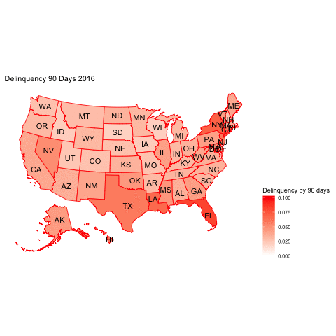
```

]

---
# Are borrowers with higher debt-to-income ratios more risky?

```{r img3, echo = FALSE, out.width = "70%"}
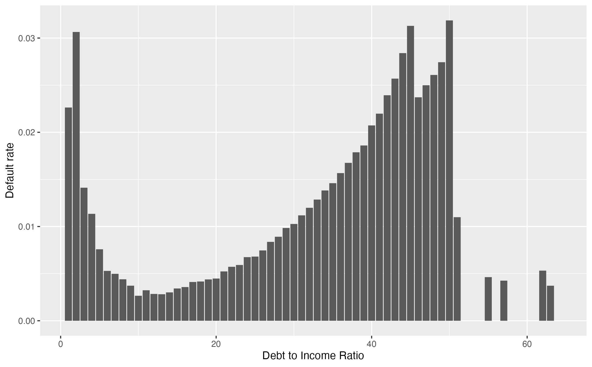
```

---
# Are those who borrow more as a proportion of their house values more risky?

```{r img4, echo = FALSE, out.width = "70%"}
knitr::include_graphics("images/lecture-07/LTV.png")
```

---

# Summary

<br><br><center>
.aim-box.tl.w-70[
What we learnt today:

- Introduced to credit risk data
- This was a big data case study
- Saw an example of how to wrangle different .zip files in R
- Learnt important lessons about memory constraints

]

</center>

---

class: transition

#### Slides updated and maintained by Dr. Kate Saunders. Previous maintainer was Dr. Joan Tan 

---
```{r endslide, child="assets/endslide.Rmd"}
```


