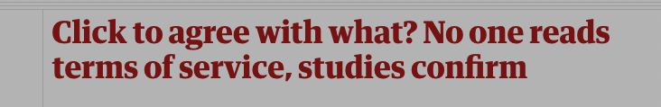
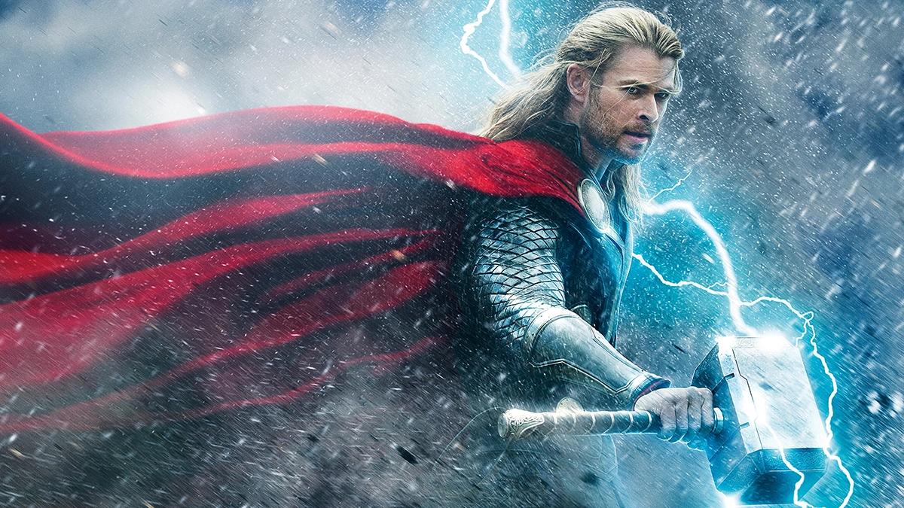

```{r, include = FALSE}
current_file <- knitr::current_input()
basename <- gsub(".Rmd$", "", current_file)

knitr::opts_chunk$set(
  fig.path = sprintf("images/%s/", basename),
  fig.width = 6,
  fig.height = 4,
  fig.align = "center",
  fig.retina = 3,
  echo = TRUE,
  warning = FALSE,
  message = FALSE,
  cache = FALSE,
  cache.path = "cache/"
)
```

```{r titleslide, child="assets/titleslide.Rmd"}
```
---
class: middle center

<iframe width="560" height="315" src="https://www.youtube.com/embed/yg16u_bzjPE" frameborder="0" allow="accelerometer; autoplay; encrypted-media; gyroscope; picture-in-picture" allowfullscreen></iframe>


---

class: monash-bg-blue middle tr 

.pa5[
.f-headline[**.white[What would you do? How did you decide what to do?**]]

]

---

class: center middle bg-gray

.aim-box.tl.w-70[
Today you will:

- Learn about different schools of ethical thought
- Examine case studies and examples in data ethics
- Understand our responsibility as ethical analysts

]

---

# Ethical Perspectives (School of Ethics)

1. Deontological Ethics (Immanuel Kant)
  * an ethical theory that says actions are good or bad according to a clear .red[set of rules].
  * Most can be explained by Kant theory (Immanuel Kant)
  * Focus on rights, principles, and duties
  * Preserve human autonomy and dignity, justice, fairness, transparency and many more. However, they can conflict with each other sometimes 😟
  * This dignity creates an ethical that prevents us from acting in certain ways either toward other people or toward ourselves
  * Rules should apply to everyone (universal ethical rules)

--

.idea-box[
* How might the dignity and fairness of each stakeholder be impacted by your project?  
* Is there any trust and justice are relevant to your project?  
* Does your project involve any conflicting moral duties to the participants or stakeholder rights?
]

???

Its name comes from the Greek word deon, meaning duty. Actions that align with these rules are ethical, while actions that don’t aren’t. https://ethics.org.au/ethics-explainer-deontology/

---

<div style="position:absolute;left:20px;top:10%">

</div>

--

<div style="position:absolute;right:20px;bottom:20%">

</div>

.footnote[https://www.theatlantic.com/technology/archive/2018/12/facebooks-failures-and-also-its-problems-leaking-data/578599/]

---

<div style="position:absolute;left:20px;top:10%">

</div>

--

<div style="position:absolute;right:20px;bottom:20%">

</div>

--

.absolute.bottom-3.left-3.bg-white.ba.pa3[
About half of Australia GDP in year 2020!  😲
]


--

<div style="position:absolute;left:20px;bottom:40%">

</div>


---

# Ethical Perspectives (School of Ethics)

2\. Consequentialist ethics and utilitarianism 
  * Consider the .red[outcomes] rather than the intentions
  * Two main examples of consequentialism: utilitarianism, hedonism
  * Utilitarianism judges consequences by a .red[greatest good for the greatest number] standard. 
  * Hedonism considers something is “good” if the consequence produces .red[pleasure] or avoids pain.

--
.idea-box[
* Which option will produce the most good and do the least harm?  
* Which option will best serves the community as a whole?
* For example: let’s suppose we will know the cause of a cancer and would cure million of patients, if we just have to sacrifice 1% of the cancer patient for the study.
]

---

# Ethical Perspectives (School of Ethics)

3\. Virtue Based Ethics (Plato, Aristotle, Confucius, Mencius)
  * Virtue ethics is a philosophy developed by Aristotle and other ancient Greeks 
  * It is the quest to understand and live a life of moral character and well-cultivated
  * Act in a way to be a better person (culturally based)
  * The same aim can lead to conflicting actions


---
class: middle center

Differences between these three major school of ethics

<iframe width="560" height="315" src="https://www.youtube.com/embed/NMblKpkKYao" title="YouTube video player" frameborder="0" allow="accelerometer; autoplay; clipboard-write; encrypted-media; gyroscope; picture-in-picture" allowfullscreen></iframe>


---
# The Avengers

.flex[
.border-box[**Iron Man**  

* Utilitarian  
* Bring the most happiness or well-being for the greatest number of people.
]

.border-box[**Captain America**

* Deontology
* Focus on right or wrong rather than better or worse.
]

.border-box[**Thor**

* Virture ethics
* Seek to be the best person he could be
]
]

.footnote[What would an Avenger Do? by Mark D. White. https://media.wiley.com/product_data/excerpt/72/11180745/1118074572-234.pdf
]
---

# Ethical Perspectives (School of Ethics)

.info-box[
**Differences between these school of ethics**  
* Virtue ethics emphasizes the moral character;  
* Deontologist emphasizes duties or rules;  
* Consequentialist emphasizes the consequences of actions.
]

.footnote[
O'Keefe, K., & Brien, D. O. (2018). Ethical data and information management: concepts, tools and methods. Kogan Page Publishers, chapter 2
]

---

# Ethical Perspectives
  
4\. Common good and justice based ethics
  * Action should contribute to some greater good
  
--

5\. Shareholder/stockholder theory (Milton Friedman)
  * Increase value to shareholders by maximizing profits
  
--
  
6\. Stakeholder theory
  * Organization responsible to stakeholders
  * Employees, stockholders, society, environment


---


# Applying different ethical practices

.question-box.w-100[
A large company surveys all of their current employees, measuring demographics and
personality factors. They hope to identify key personality factors that correspond with
a successful time with the company. Their hope is to use this data to identify which
prospective employees they should hire. 
]

--

.w-60[
.fr.animated.bounceIn.f1.small-caps[Stakeholder theory]

]

--

.w-60[
.fr.animated.bounceIn.f1.small-caps[Shareholder theory]

]

--

.w-60[
.fr.animated.bounceIn.f1.small-caps[Deontological Ethics]

]

---

# How do we decide what is ethical?

Example from the [news](https://www.youtube.com/watch?v=iXe9caLxxek): 

<center>
<iframe width="560" height="315" src="https://www.youtube.com/embed/oFdr1Iqfsfg?si=5db1SPYgbQcH862q" title="YouTube video player" frameborder="0" allow="accelerometer; autoplay; clipboard-write; encrypted-media; gyroscope; picture-in-picture; web-share" referrerpolicy="strict-origin-when-cross-origin" allowfullscreen></iframe>

.question-box.w-100[

# Breakout discussion 

What issues are raised with the data ethics of rewards programs in Australia currently? 

Were you aware of all of these?

]
</center>

---

#Why consider ethical data practices?

* Data is increasingly accessible and available
  * Can use for understanding our world
  * Can use to make decisions (data driven decision making)
  * Can use to inform policy decisions
--

* Research ethics is often discussed in experimental settings
  * The fundamental ethical concerns do not change
--

* Data has an increasing impact on our lives
  * Data for good initiatives
  * Unethical uses of data
  * Open data increases the reach of data but risks privacy


---
# Data Ethics

* Ethics behind data science ranges from data acquisition to modeling  

--
* Data science models affect everyone of us:
  * getting a job 
  * loan application
  * dating
  * social life
  * buying car insurance  
  * medical report  
  
--
* Data is constantly being collected; facebook track our voice while we .orange[open the app], .orange[social media studying our click and like], .orange[mobile app tracks your location and time], .red[cameras are everywhere] and the list goes on and on...


--
.w-100[
.fr.animated.bounceIn.f1.small-caps[Is your data has been ethically sourced?]

]

---

class: monash-bg-blue middle tr 

.pa5[
.f-headline[**.white[Ethics and Data**]]

]

---

.question-box.w-100[
**Data scientist's responsibility**
* Informed Consent
* Privacy
* Fairness
* Transparency
* Accountability
* Bias
]

.warn-box[
A good data scientist needs to understand the ethic issues from how the data being collected, data privacy, biasness in the data up to creating an accountable algorithm to evaluate its impact on people.
]


---
# Application of ethics for data scientist

1. Ethics on data
  * make sure data has informed consent from the participants
  * read the term and conditions
  * privacy screening has been done

--

2. Ethics on models/algorithm
  * make sure training data is representative  
  * past population is not representative of the future population  
  * algorithm that imposed fairness (no discrimination on any individual and aggregate outcome)


---
# Belmont report (1979)

--

* It was written by the National Commission for the Protection of Human Subjects of Biomedical and Behavioral Research.    

--
* It was created under the National Research Act of 1974.

--
* Identifies basic ethical principles and guidelines that address ethical issues arising from the conduct of reaseach with human subject  

--
* Application to demonstrate the use of these principles  


.footnote[https://www.hhs.gov/ohrp/regulations-and-policy/belmont-report/read-the-belmont-report/index.html#xbound]

---
# What constitutes as research?

.blockquote[
**Research**  
"an activity designed to test an hypothesis, permit conclusions to be drawn, and thereby to develop or contribute to generalizable knowledge
"
]
--
.blockquote[
**Practice**  
"interventions that are designed solely to enhance the well-being of an individual patient or client and that have a reasonable expectation of success"
]

.footnote[https://www.hhs.gov/ohrp/regulations-and-policy/belmont-report/read-the-belmont-report/index.html#xbound

]

---
#Basic Ethical Principles
.info-box.w-100[
Autonomy is about being able to deliberate and make personal goals, and then act upon them
]

1. Respect for Persons
 * Acknowledge and respect autonomy
 * Protect those with diminished autonomy
--
 
2. Beneficence
 * Do not cause harm
 * Minimize possible harms and maximise possible benefits
--
 
3. Justice
  * Who ought to receive the benefits of research and bear its burdens?


.footnote[https://www.hhs.gov/ohrp/regulations-and-policy/belmont-report/read-the-belmont-report/index.html#xbound

]

---
# Applications

1. Informed consent
  * Participants have a right to understand what is going to happen
  * Application of respect for persons
  
--

2. Assessment of Risks and Benefits
  * Are the risks justified?
  * Is the study well designed?
  * Are there alternative lower risk designs possible?
  * Are potential benefits and risks communicated to participants?
  * Application of beneficence
  
.footnote[https://www.hhs.gov/ohrp/regulations-and-policy/belmont-report/read-the-belmont-report/index.html#xbound

]

---
# Applications

3\. Selection of Subjects
  * Fairly offer research participation to all eligible 
  * Some subjects preferred to as best able to bear risk (e.g., adults)
  * "injustice arises from social, racial, sexual and cultural biases institutionalized in society"
  * Careful not to overburden vulnerable subjects
  
.footnote[https://www.hhs.gov/ohrp/regulations-and-policy/belmont-report/read-the-belmont-report/index.html#xbound
]


---
# Data Protection Laws and Regulations 

* **Australia:** Privacy Act 1988, which includes the Australian Privacy Principles (APPs) -- principal data protection legislation.  

--
* **Europe:** General Data Protection Regulation (GDPR) adopted by the European Parliament which regulates "personal data". 
    * Passed in 2018 to provide strong protection on the collections, use and management of data
    * Rights of the individual
      * Information and access - you can access your data and see how it is processed
      * Right to request erasure of data
  * In Australia, need to comply if you offer goods and services in EU, collect data from EU individuals or are established in the EU

.footnote[
https://iclg.com/practice-areas/data-protection-laws-and-regulations/australia  
https://gdpr-info.eu/
]

---
# General Data Protection Regulation (GDPR)

* one of the most influential data privacy regulations until today. 
* It defines 8 user rights under the law. IT serve as existing legal principles.  
  * The right to be informed. 
  * The right of access. 
  * The right to rectification. 
  * The right to erasure. 
  * The right to restrict processing. 
  * The right to data portability. 
  * The right to object. 
  * The right to avoid automated decision-making. 

.footnote[
https://www.freeprivacypolicy.com/blog/8-user-rights-gdpr/
]

---
# Your turn
.question-box.w-100[
A study investigates whether there has been an increased occurrence in loneliness during the COVID-19 lockdowns in Melbourne, Australia. The research method uses a survey administered during lockdown and non-lockdown periods to measure participant loneliness. What is one potential risk? How could this risk be minimized/managed/monitored? Are there benefits that justify this risk?
]

--

* **RISK:** Respondents reports extreme psychological stress
--

* **BENEFIT:** Understanding loneliness patterns can assist in providing preventitive and other mental health services
--

* **MITIGATION/MANAGEMENT:** Respondents are given a list of freely available mental health services to use if needed at the end of the study.

---
# Consent

.info-box.w-100[
**Belmont Report**
* Information
* Comprehension
* Voluntary (without cohersion)
]
--
.info-box.w-100[
**National Statement on ethical conduct in research involving humans**
"...consent should be a voluntary choice, and should
be based on sufficient information and adequate
understanding of both the proposed research and
the implications of participation in it."
]


---
# Justice, data sources and representation

* From the Belmont report we see that justice relates to the risks/benefits of the study at the same probability for all participants 
--

* They also note the need to be careful not to exhaust vulnerable populations by overstudying. 
--

* Big datasets often have challenges of representation - not everyone in the population has an equal chance of representation
--

* This can be one cause of biased predictions and unfair algorithms - the algorithms are less accurate for particular subsets of the population
--

* However, much of big data doesn't cost the participant to give - it's created through scraping etc, and the lack of representation reflects sociological and cultural power imbalances

---
#Your turn

.question-box.w-100[
A large company surveys all of their current employees, measuring demographics and
personality factors. They hope to identify key personality factors that correspond with
a successful time with the company. Their hope is to use this data to identify which
prospective employees they should hire. 
]

--

* Are there any concerns with the data source?
--

* Using existing employee data reinforces any previous discriminatory hiring patterns

--
.info-box.w-100[
Counterfactual: What would have happened if we hired people who were different to those previously hired?]


---
# Focussing on statistical and data practices

* So far we've focused on ethical and data practice in research generally.
--

* The basic principles apply to ALL research, but many of the examples focus on experimental research 
--

* How can we translate this principles to a more statistical/data focus?

---

# Ethical guidelines for statisticians

.footnote[https://www.amstat.org/asa/files/pdfs/EthicalGuidelines.pdf]

1. Professional Integrity and Accountability
--

2. Integrity of data and method
--

3. Responsibilities to Science/Public/Funder/Client 
--

4. Responsibilities to Research Subjects
--

5. Responsibilities to Research Team Colleagues
--

6. Responsibilities to Other Statisticians or Statistics Practitioners
--

7. Responsibilities Regarding Allegations of Misconduct

---

### Alternative view

.footnote[Gelman (2018). Ethics in statistical practice and communication: Five recommendations. Significance]

1. Prioritize open data and methods
--

2. Be clear about the information and assumptions that go into statistical methods
--

3. Respect for data
--

4. Publication of criticisms 
--

5. Respect the limitations of statistics


---
# Yet another perspective

.footnote[https://deon.drivendata.org/]

* Much of what we spent the first half of the lecture discussing surrounds data collection and modeling
--

* Identify other areas including:
 * Storage 
 * Analysis 
 * Deployment
--

* These areas are less likely to be mentioned, but are equally important. 

---
# How to be an ethical data scientist

1. Firstly ensure that you are following the ethical frameworks of the company you are in (e.g., I work for Monash so I ensure that my research conforms to Australian standards through Monash procedures)
--

2. Ensure you understand the different areas where unethical thinking/practices can be introduced
--

3. Checklists like https://deon.drivendata.org/#default-checklist can be useful!
--

4. Keep learning and exploring different perspectives to you own 
---

# Summary 

.aim-box.tl.w-70[
What we learnt:

- Developed an understanding for data ethics principles
- Developed some checks and balances for any future analysis
- Started our journey to towards conducting ethical analytics

]

---

class: transition

#### Slides updated and maintained by Dr. Kate Saunders. Previous maintainer was Dr. Joan Tan 

---

```{r endslide, child="assets/endslide.Rmd"}
```
