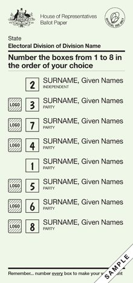
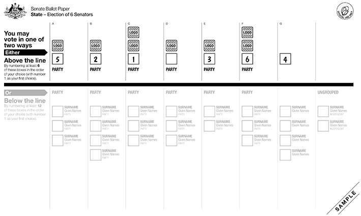
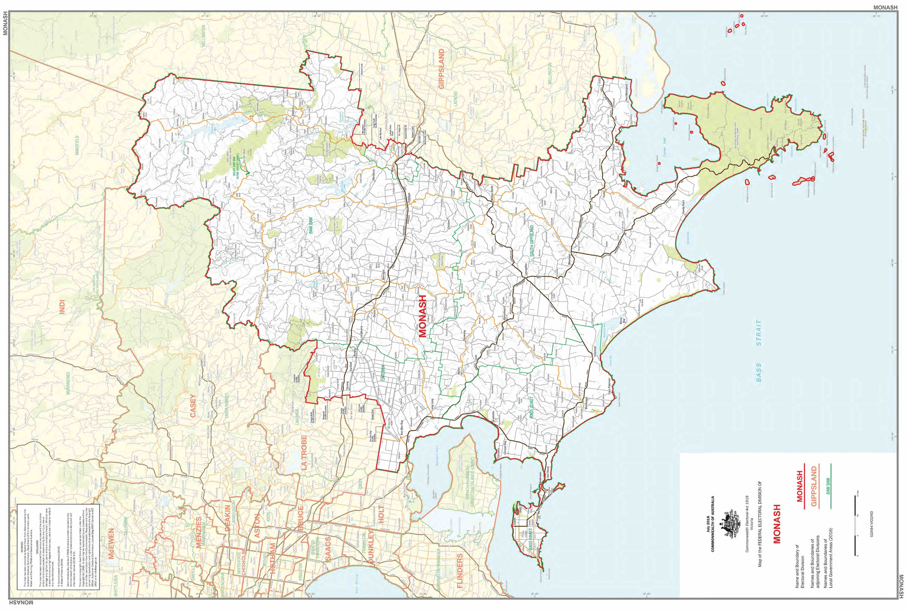
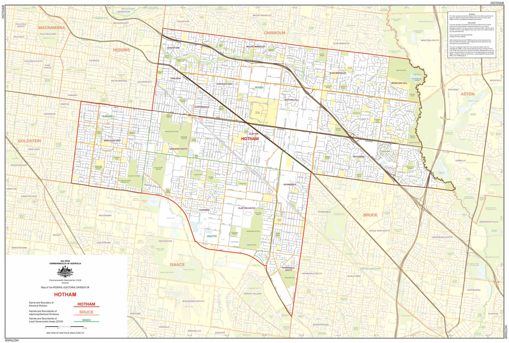
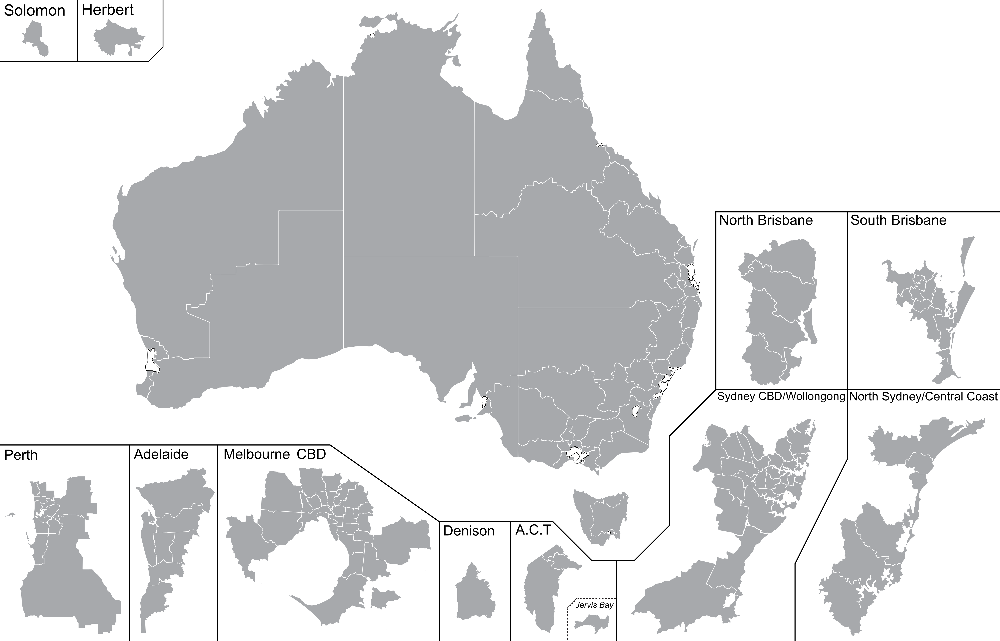
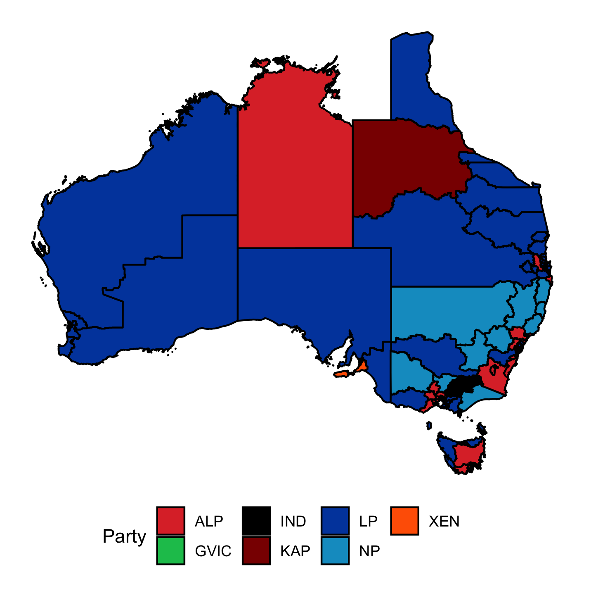
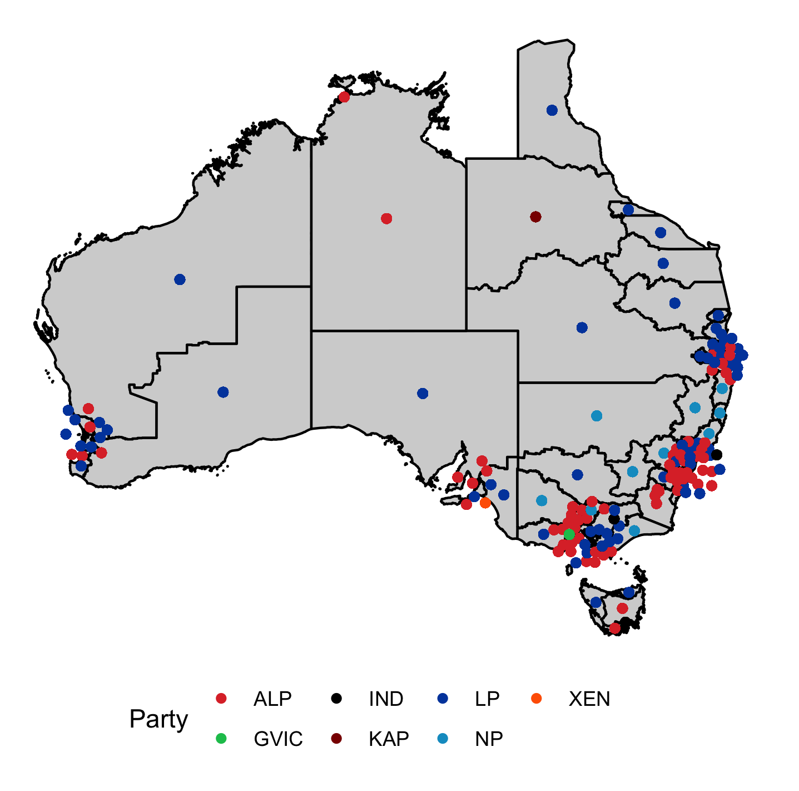
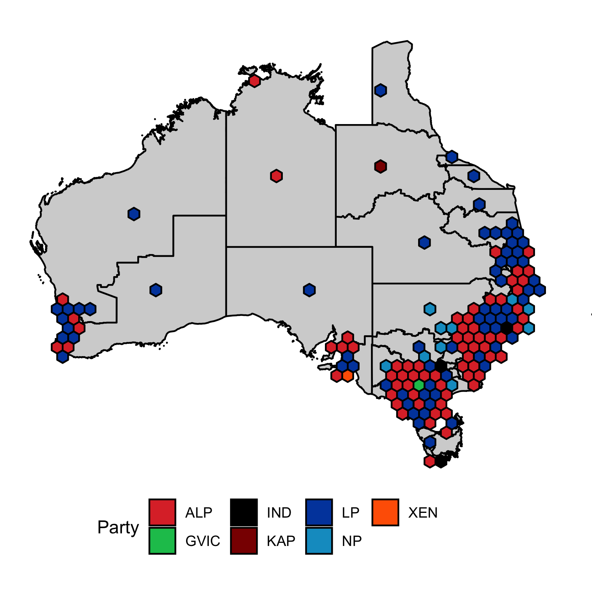
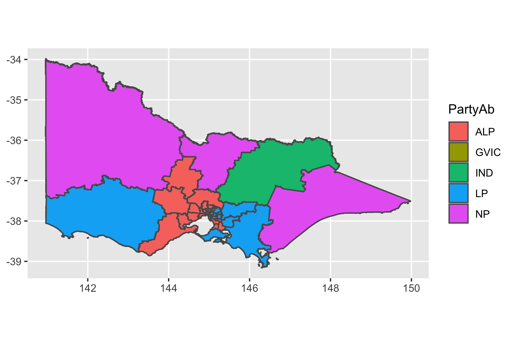

```{r, include = FALSE}
current_file <- knitr::current_input()
basename <- gsub(".Rmd$", "", current_file)

knitr::opts_chunk$set(
  fig.path = sprintf("images/%s/", basename),
  fig.width = 6,
  fig.height = 4,
  fig.align = "center",
  fig.retina = 3,
  echo = TRUE,
  warning = FALSE,
  message = FALSE,
  cache = TRUE,
  cache.path = "cache/"
)
```

```{r titleslide, child="assets/titleslide.Rmd"}
```


---

# Australian election data 

.w-70[

* Much like the census, .monash-blue[**election**] attempts to collect the data from the population.

{{content}}

]

--

* In Australia, it is compulsory by law to vote in elections if you are an Australian citizen <span class="f6">(or eligible British subject)</span> aged 18 years old or over and have lived in your address for at least one month.
{{content}}
--

* The Australian Electoral Commission (AEC) is an independent federal agency in charge of federal Australian elections and provides the geographical boundaries of the electoral divisions.
{{content}}

--

<div class="question-box">
<ol>
<li>When was the last federal election in Australia?</li>
<li>How often is the federal election conducted in Australia? </li>
<li>How many electoral divisions are there in the last federal election?</li>
<li>What is the population for the Australian federal election?</li>
</div>


---

# 2019 Australian Federal Election

.flex.h-100[
.w-55[
* Parliament of Australia comprises two houses: 
  * **Senate** (upper house) comprising 76 senators
  * **House of Representatives** (lower house) comprising 151 members
* Government is formed by the party or coalition with majority of the seats in the lower house
* The 2019 Australian Federal Election was held on Sat 18th May 2019
* The next federal election will be likely be held in 2022


]
.w-45.monash-bg-gray10[

* Major parties in Australia:
  * Coalition:
      *  Liberal
      *  National 
  * Labor 
* Some minor parties in Australia:
  *  The Greens
  *  One Nation


]]

---

# Ballots

* **House of Representatives** uses the instant-runoff voting system
* Senate uses the single transferable voting system

<center>
.white[Senate]
</center>


---

# 2019 Australian Federal Election Data

* Get the distribution of preferences by candidate by division for the 2019 Australian Federal Election

.f2.center[
<i class="fas fa-download"></i> https://results.aec.gov.au
] 
<br>

.center[
.info-box.w-60.tl[

1. 2019 federal election
1. Downloads
1. Distribution of preferences by candidate by division

]]

* Or refer directly to the link:

.center[
https://results.aec.gov.au/24310/Website/Downloads/HouseDopByDivisionDownload-24310.csv

]

---

# House of Representative Voting Data

.f4[
```{r votes, message = FALSE, warning = FALSE}
library(tidyverse)
votes <- read_csv("https://results.aec.gov.au/24310/Website/Downloads/HouseDopByDivisionDownload-24310.csv", skip = 1)
glimpse(votes)
```
]


---

# Electoral district of .monash-blue[Monash]

* Let's have a look at the electoral district named "Monash"

.f4[
```{r votes-table-view}
votes %>% 
  filter(DivisionNm=="Monash") %>% 
  DT::datatable(width = 1160, height = 400, options = list(pageLength = 400))
```
]


---


# District: Monash


```{r votes-monash}
votes_monash <- votes %>% 
  # get the preference count only
  filter(CalculationType == "Preference Count") %>% 
  # get the Monash division
  filter(DivisionNm == "Monash")
```

```{r vote-monash-table, echo = FALSE}
DT::datatable(votes_monash,
              rownames = TRUE,
              height = 300,
              width = 900,
              options = list(lengthChange = FALSE, dom = "t",
                             pageLength = nrow(votes_monash),
                             scrollX = "100px", scrollY = "300px"))

```


---

# Visualising the counts

```{r vote-counts, fig.width = 12, fig.height = 4.5}
ggplot(votes_monash) + 
  geom_col(aes(x = CalculationValue, y = Surname)) +
  geom_text(aes(label = paste("Count", CountNumber)), 
            x = 10000, y = 3, size = 16, color = "#ee64a4",
            alpha = 0.4, hjust = "left") +
  facet_wrap(~CountNumber)
```

---

# ... but better to order candidates by counts 

```{r vote-counts-better, fig.width = 12, fig.height = 4.5}
mutate(votes_monash, Surname = fct_reorder(Surname, CalculationValue)) %>% #<<
  ggplot() + 
  geom_col(aes(x = CalculationValue, y = Surname)) +
  geom_text(aes(label = paste("Count", CountNumber + 1)), 
            x = 10000, y = 3, size = 16, color = "#ee64a4", alpha = 0.4, hjust = "left") +
  facet_wrap(~CountNumber)
```

--

<div style="position:absolute;right:20px;bottom:20px">
<b>Winner</b>: <br>Russel<br> Broadbent<br>

</div>

---

# Where is the electoral district of .monash-blue[Monash]?

--

* ...*doesn't* include Monash Clayton campus

<center class="overflow-scroll h-80">

</center>

---

# Electoral district of .monash-blue[Hotham]

* *Does* include Monash Clayton campus

<center>

</center>

---

# Australian Electorates Divsions

There are 151 electorates in 2019.

.flex[
.w-60.center[

]
.w-40[

.info-box[
The **geographical boundaries of the electoral divisions** are determined by the [Redistribution Committee](https://www.aec.gov.au/footer/glossary.htm#redist-comm) and are [redrawn](https://www.aec.gov.au/Electorates/Redistributions/future.htm) every so often to ensure similar number of electors in each electoral division for a given state or territory.
]

{{content}}
]


]

--

<div class="warn-box">
This means that the geographical boundaries could be different across years.
</div>


---


# Federal electoral boundary GIS data

* GIS (Geographic Information System) is a framework that capture and inspect geographical data.
* This data is found at 

.center.f2[
<i class="fas fa-download"></i> https://www.aec.gov.au/electorates/gis/licence.htm
]

* Agree to the license to get to the download page
.blockquote[
The Licensee must make End-users aware the data was sourced from the Australian Electoral Commission and is used under licence.
]
.center[
Note: the federal electoral boundary is provided by Australian Electoral Commission

© Commonwealth of Australia (Australian Electoral Commission) 2021
]

* We download the ESRI zip file for Victoria.
* To work with spatial data, we use the `sf` R-package.

---

# Working with spatial data

.overflow-scroll.h-80[
```{r aec-map}
library(sf)
aec_map <- read_sf(here::here("data/vic-july-2018-esri/E_AUGFN3_region.shp"))
aec_map
```
]

---

# Geometry object and visualisation in as `ggplot`


```{r aec-geometry, message = TRUE}
aec_map$geometry[[1]]
```
--


```{r plain-aec-map}
ggplot(aec_map) + 
  # or geom_sf(aes(geometry = geometry))
  geom_sf() 
```


---

# Integrating data of election winners

.f4[
```{r winner-map}
winners <- votes %>% 
  # get the winner
  filter(Elected=="Y" & CountNumber==0 & CalculationType=="Preference Count") %>% 
  # join the data
  right_join(aec_map, by = c("DivisionNm" = "Elect_div")) %>% 
  select(DivisionNm, PartyAb, PartyNm, geometry)

ggplot(winners) + geom_sf(aes(fill = PartyAb, geometry = geometry)) 
```
]

--

.center[
Is there something wrong here?
]

---

# Investigating missing observation

```{r}
winners %>% 
  filter(is.na(PartyAb))
```
--

```{r}
votes %>% 
  # approximate string matching (or fuzzy matching)
  filter(agrepl("Mcewen", DivisionNm))
```

--

.absolute.bottom-3.right-2.bg-white.ba.pa3[
So what went wrong here?
]

---

# Victoria map of election winners

```{r winner-map-fix}
winners_fix <- votes %>% 
  mutate(DivisionNm = ifelse(DivisionNm=="McEwen", "Mcewen", DivisionNm)) %>% 
  # get the winner
  filter(Elected=="Y" & CountNumber==0 & CalculationType=="Preference Count") %>% 
  # join the data
  right_join(aec_map, by = c("DivisionNm" = "Elect_div")) %>% 
  select(DivisionNm, PartyAb, PartyNm, geometry)

ggplot(winners_fix) + geom_sf(aes(fill = PartyAb, geometry = geometry)) 
```

---

# Map of election winners

```{r}

ausmap <- read_sf(here::here("data/national-esri-fe2019/COM_ELB_region.shp"))

all_winners <- votes %>% 
  mutate(DivisionNm = case_when(DivisionNm=="McEwen" ~ "Mcewen",
                                DivisionNm=="McPherson" ~ "Mcpherson",
                                DivisionNm=="Eden-Monaro " ~ "Eden-monaro",
                                DivisionNm=="McMahon" ~ "Mcmahon",
                                DivisionNm=="O'Connor" ~ "O'connor",
                                TRUE ~ DivisionNm)) %>% 
  # another way to select the winner
  filter(Elected=="Y") %>% 
  group_by(DivisionID) %>% 
  slice(1) %>% 
  ungroup() %>% 
  # then join the map data
  right_join(ausmap, by = c("DivisionNm" = "Elect_div"))
```


---


# Drawing .monash-blue[Chloropleth Map] with R

.f4[
```{r electoral_map_wins}
auscolours <- c("ALP" = "#DE3533", "LNP" = "#ADD8E6", "KAP" = "#8B0000", 
                "GVIC" = "#10C25B", "XEN" = "#ff6300", "LP" = "#0047AB", 
                "NP" = "#0a9cca", "IND" = "#000000")

ggplot(all_winners) + 
  geom_sf(aes(fill = PartyAb, geometry = geometry)) +
  scale_fill_manual(name = "Party", values = auscolours) +
  theme_void() + 
  theme(legend.position="bottom") 
```
]

---

# Choropleth Map

Which party won from looking at this map and by how much?

<center>

</center>

--

<div class="border-box bg-white" style="position:absolute;top:20%;right:10px;width:320px;padding:5px;font-size:18pt;">
<span class="blue">Liberal/National Coalition: <b>77</b></span><br>
<span class="red">Labor: <b>68</b></span><br>
Greens: <b>1</b><br>
Katter's Australian: <b>1</b><br>
Centre Alliance: <b>1</b><br>
Independents: <b>3</b>
</div>

---

# Mapping the centroids

.f4[
```{r dorling-map}
all_winners_centroid <- all_winners %>% 
  mutate(centroid = map(geometry, ~setNames(st_centroid(.x), c("x", "y")))) %>%
  unnest_wider(centroid)

ggplot(all_winners_centroid) + 
  geom_sf(aes(geometry = geometry)) + 
  geom_point(aes(x, y, color = PartyAb)) +
  theme_void() + 
  theme(legend.position="bottom") 
```
]

---

# Non-Contiguous, Dorling Cartogram


<center>

</center>

---

# Improved map

.f4.oveflow.overflow-scroll.h-90[
```{r sugarbag-map}
library(sugarbag)
centroids <- all_winners_centroid %>%
  select(DivisionNm, longitude = x, latitude = y)
grid <- create_grid(centroids = centroids, hex_size = 0.9, buffer_dist = 5)
hex_allocated <- allocate(centroids = centroids,
                          sf_id = "DivisionNm",
                          hex_grid = grid,
                          hex_size = 0.9, # same size used in create_grid
                          hex_filter = 10,
                          focal_points = capital_cities,
                          width = 30, verbose = TRUE)


hex_map <- hex_allocated %>%
  fortify_hexagon(hex_size = 0.9, sf_id = "DivisionNm") %>%
  left_join(all_winners_centroid, by = "DivisionNm") 

ggplot(hex_map) + 
  geom_sf(data = all_winners, aes(geometry = geometry)) +
  geom_polygon(aes(longitude, latitude, fill = PartyAb, group = DivisionNm), color = "black") + 
  scale_fill_manual(name = "Party", values = auscolours) +
  theme_void() + 
  theme(legend.position = "bottom")
```
]

---

# Tessellated Hexagon Map 


<center>

</center>

.bottom_abs.font_small.width100[
Kobakian, Stephanie (2020) New Algorithms For Effectively Visualising Australian Spatio-Temporal Disease Data. <br>Supervised by Dianne Cook. *Master of Philosophy (Statistics), Queensland University of Technology*.
]

---

# Geo Data

```{r sa1-layers}
geopath <- here::here("data/Geopackage_2016_EIUWA_for_VIC/census2016_eiuwa_vic_short.gpkg")
st_layers(geopath)
```
---

# SA1 geographical boundaries 

```{r sa1-mapdata}
SA1map <- read_sf(geopath, layer = "census2016_eiuwa_vic_sa1_short")
```

.flex[
.w-50[
```{r sa1-map}
ggplot(SA1map) +
  geom_sf(aes(geometry = geom))
```

]
.w-50.pa3[
{{content}}

]
]

--

Remember this map?



<div class="question-box">
How are these two maps different?
</div>

---

# Comparing the SA1 and electoral boundaries

```{r zoomed-map, fig.width = 8}
ggplot(winners_fix) + 
  geom_sf(aes(fill = PartyAb, geometry = geometry), size = 2) +
  geom_sf(data = SA1map, aes(geometry = geom), fill = "transparent") +
  coord_sf(xlim = c(144.9, 145.21), ylim = c(-37.98, -37.82)) +
  scale_fill_manual(name = "Party", values = auscolours)
```

---

# Median age

```{r zoomed-map-income, fig.width = 8}
ggplot(winners_fix) + 
  geom_sf(aes(geometry = geometry), size = 2) +
  geom_sf(data = SA1map, aes(geometry = geom, fill = Median_age_persons)) +
  coord_sf(xlim = c(144.9, 145.21), ylim = c(-37.98, -37.82)) +
  scale_fill_viridis_c(name = "Median age", option = "magma")
```

---

# Dorling Cartogram 

```{r zoomed-map-income-dorling, fig.width = 8}
ggplot(winners_fix) + 
  geom_sf(aes(geometry = geometry), size = 2, fill = "grey60") +
  geom_point(data = SA1map %>% 
               mutate(centroid = map(geom, ~setNames(st_centroid(.x), c("x", "y")))) %>%
               unnest_wider(centroid), 
          aes(x, y, color = Median_age_persons), shape = 3) +
  coord_sf(xlim = c(144.9, 145.21), ylim = c(-37.98, -37.82)) +
  scale_color_viridis_c(name = "Median age", option = "magma")
```

---

# Electorate Map

Electorates that contain the Monash campuses

```{r monash-campuses, echo = FALSE, fig.height = 7, fig.width = 12}
ggplot(winners_fix) + 
  geom_sf(aes(geometry = geometry, 
              fill = ifelse(DivisionNm %in% c("Hotham", "Macnamara"), DivisionNm, "Other")), size = 2) +
  geom_point(data = SA1map %>% 
               mutate(centroid = map(geom, ~setNames(st_centroid(.x), c("x", "y")))) %>%
               unnest_wider(centroid), 
          aes(x, y, color = Median_age_persons), shape = 3) +
  coord_sf(xlim = c(144.9, 145.21), ylim = c(-37.98, -37.82)) +
  scale_color_viridis_c(name = "Median age", option = "magma") +
  scale_fill_manual(name = "Electoral",
                    breaks = c("Hotham", "Macnamara", "Other"),
                    values = c("#006DAE", "#746FB2", "#E8E8E8")) + 
  annotate("point", x = 145.1275, y = -37.9145, size = 10) + 
  annotate("text", x = 145.1275, y = -37.9145 + 0.05, label = "Monash\nClayton\n Campus", size = 6, fontface = "bold") + 
  annotate("point", x = 145.0449, y = -37.8771, size = 10) + 
  annotate("text", x = 145.0449, y = -37.8771 + 0.02, label = "Monash\nCaufield\n Campus", size = 6, fontface = "bold")  +
  theme_void() +
  theme(legend.position = c(.15, .2))
  
```


---


# References

.info-box.w-60[
Also check out the paper by [Forbes, Cook & Hyndman (2020) Spatial modelling of the two-party preferred vote in Australian federal elections: 2001–2016. *Australian & New Zealand Journal of Statisitcs* (to appear). ](https://onlinelibrary.wiley.com/doi/abs/10.1111/anzs.12292).
]


---

```{r endslide, child="assets/endslide.Rmd"}
```


