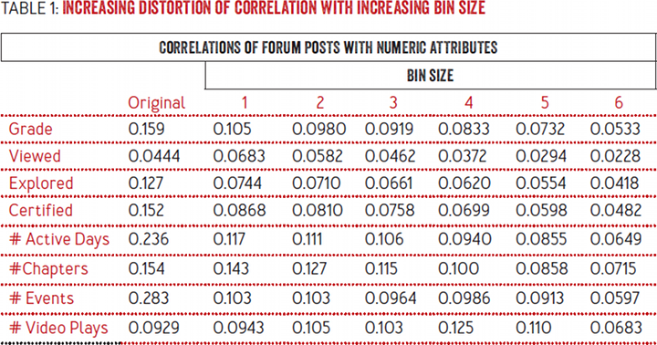

```{r, include = FALSE}
current_file <- knitr::current_input()
basename <- gsub(".Rmd$", "", current_file)

knitr::opts_chunk$set(
  fig.path = sprintf("images/%s/", basename),
  fig.width = 6,
  fig.height = 4,
  fig.align = "center",
  fig.retina = 2,
  echo = TRUE,
  warning = FALSE,
  message = FALSE,
  cache = TRUE,
  cache.path = "cache/"
)
```

```{r titleslide, child="assets/titleslide.Rmd"}
```

---

.pull-left[

]

.pull-right[
### Data Ethics Officers' role:

1. Privacy risk  
2. Exploitation/manipulation risk  
3. Algorithmic bias  
4. Opacity

]

.pull-right[
.blockquote[
One of the first things a CDEO should do is to create an ethical data-use framework that ensures all aspects of data collection, use, destruction, and disposal are done legally, morally, and fairly. (John Story, CDEO)
]
]

---

class: center middle bg-gray

.aim-box.tl.w-70[
Now we are all ethical analysts, we will:

- Further develop our understanding of privacy risk
- Become alert to common privacy pitfalls and challenges
- Learn about common methods for de-identifying data

]

.aim-box.tl.w-70[
Coding perspective:

- Review code examples for de-identifying data

]

---
class: transition

# Privacy risk


---
class: transition 

# If I were making a database of educators in Master of Business Analytics Programme, what information would make you identifiable?

---

# I surveyed the lecturers of Master of Business Analytics Programme

- Can you identify the individuals?

```{r, echo = FALSE}
kableExtra::kable(data.frame(
  Employer = rep("Monash University",4),
  TimeAtEmployer = c(NA,7.75,3.25, 4.50),
  FunFact = c("Love to play cricket", "Loves Tennis", "Helps out on stackoverflow","Love to bake")
))
```

---

# Can we augment this information with publically available information?


```{r echo=FALSE, out.height="100%", out.width= "80%"}
knitr::include_graphics("images/lecture-03/lecture09_intro.png")
```

---
# Where is our privacy?

```{r out.width="100%", echo=FALSE}
knitr::include_url("https://awards.journalists.org/entries/your-apps-know-where-you-were-last-night-and-theyre-not-keeping-it-secret")
```

[Click here](https://www.nytimes.com/interactive/2018/12/10/business/location-data-privacy-apps.html?mtrref=undefined&gwh=A68AEC04B982B92694E2050966A6A205&gwt=pay&assetType=PAYWALL)


---
class: middle center
# Where is our privacy?

<iframe width="560" height="315" src="https://www.youtube.com/embed/AU66C6HePfg" title="YouTube video player" frameborder="0" allow="accelerometer; autoplay; clipboard-write; encrypted-media; gyroscope; picture-in-picture" allowfullscreen></iframe>


---

# Australian Privacy Principles (APPs) in the Privacy Act 1988


.footnote[Australian Privacy Principle Guidelines, https://www.oaic.gov.au/assets/privacy/app-guidelines/app-guidelines-july-2019.pdf]

.blockquote[‘Personal information’ is defined as any ‘information or an opinion about an identified
individual, or an individual who is reasonably identifiable:  
  * whether the information or opinion is true or not; and  
  * whether the information or opinion is recorded in a material form or not’ (s 6(1))

Section B.85, Australian Privacy Principle Guidelines]

---

# Australian Privacy Principles (APPs) in the Privacy Act 1988


.footnote[Australian Privacy Principle Guidelines, https://www.oaic.gov.au/assets/privacy/app-guidelines/app-guidelines-july-2019.pdf]


.blockquote[
Common examples are an individual’s name, signature, address, telephone number, date of
birth, medical records, bank account details, employment details and commentary or
opinion about a person. 

Section B.86, Australian Privacy Principle Guidelines

]

--

.blockquote[The definition of ‘personal information’ in s 6(1) refers to information or an opinion about an
‘individual.’ An ‘individual’ means ‘a natural person’ (s 6(1)). The ordinary meaning of
‘natural person’ does not include deceased persons

Section B.95, Australian Privacy Principle Guidelines

]

--

- However, information about a deceased person can also include information about a living person.


---

# Australian Privacy Principles (APPs) in the Privacy Act 1988

.footnote[Australian Privacy Principle Guidelines, https://www.oaic.gov.au/assets/privacy/app-guidelines/app-guidelines-july-2019.pdf]

.blockquote[Personal information that has been de-identified will no longer be personal information.
Personal information is de-identified if the information is no longer about an identifiable
individual or an individual who is reasonably identifiable (see paragraph B.59). 

Section B.89, Australian Privacy Principle Guidelines]


---


# Australian Privacy Principles (APPs) in the Privacy Act 1988

.footnote[Australian Privacy Principle Guidelines, https://www.oaic.gov.au/assets/privacy/app-guidelines/app-guidelines-july-2019.pdf]

.blockquote[Whether an individual is ‘reasonably identifiable’ from particular information will depend on
considerations that include:  
- the nature and amount of information  
- the circumstances of its receipt  
- who will have access to the information  
- other information either held by or available to the APP entity that holds the information

Section B.91, Australian Privacy Principle Guidelines]

---

# Australian Privacy Principles (APPs) in the Privacy Act 1988

.footnote[Australian Privacy Principle Guidelines, https://www.oaic.gov.au/assets/privacy/app-guidelines/app-guidelines-july-2019.pdf]

.blockquote[
- whether it is possible for the individual or entity that holds the information to identify
the individual, using available resources (including other information available to that
individual or entity). Where it may be possible to identify an individual using available
resources, the practicability, including the time and cost involved, will be relevant to
deciding whether an individual is ‘reasonably identifiable’  
- if the information is publicly released, whether a reasonable member of the public who
accesses that information would be able to identify the individual

Section B.91, Australian Privacy Principle Guidelines (continued)]

---

# Life as a data custodian

.footnote[The De-Identification Decision-Making Framework, https://publications.csiro.au/rpr/download?pid=csiro:EP173122&dsid=DS3]

- Become a data custodian when you "collect" (not necessarily directly from the data subject) or "hold" personal information (CSIRO, The De-Identification Decision-Making Framework). 

--
- *All* data custodians have equal obligations under the Privacy Act

--
- Data custodians can only obtain personal information when it is reasonably necessary for the entity's function, and should share this information under the same principle. Only collect/hold what is "actually necessary" not what could "potentially be useful". 

---

# Linking back to ethics

.footnote[The De-Identification Decision-Making Framework, https://publications.csiro.au/rpr/download?pid=csiro:EP173122&dsid=DS3]

- Ethics is a balance of risk and benefit. 

--
  - De-identification is not a zero-risk endeavor, but rather a balance between risk (of identification) and benefit.  

--
- One of the three pillars of ethical framing is surrounding consent.  

--
.question-box[Sometimes the purpose of de-identification is to produce openly accessible data or to share data more broadly. How does the notion of consent impact this?]  

--
- (Some) things to consider include the relationship between data custodian and data subjects, the sensitivity of the variables, the population and the topic. 

---

# Aggregate vs unit record data

- Unit record data records the data about each subject. Examples include data where a subject is referenced with a subject id, or an organisation with organisation level data.   

--
- Challenges to unit record data is the difficulty in identifying what combinations of variables are sufficient to identify the unit within the environment context.  

--
- Aggregate level data records information about groups of units, typically in a release of table or figure. Examples include releasing data about particular the experiences of people in particular geographic areas or particular types of businesses.  

--
- Aggregation can be challenging because it's necessary to avoid cells that only represent a small number of units (some groups use a min of 5 per cell, but it is context dependent).  

--
- Other challenges associated with aggregation include releasing too many encompassing aggregations that might allow for disclosure by differencing or through inferring information (such as all people with attribute X also have attribute Y) in a process called attribute disclosure


---

# Examples

<div style="position:absolute;left:30px;top:15%">
 
<br>
.f6[Source: https://queue.acm.org/detail.cfm?id=2838930]
</div>

--

<div style="position:absolute;right:20px;bottom:20%">

<br>
.f6[Source: HHS]
</div>


---

# How much information is needed to identify?

- Recently there has been a research that focuses on how the intersection of common demographic information can aid identification in the data sets.  

--
- In the following link, we investigate how zipcode (like postcode in the US), birth day and a few other identifiers impact the ability to identify individuals in the population.  

  - https://cpg.doc.ic.ac.uk/individual-risk/


---

# Steps to protect data

- Always consider the context! These are general steps to think about but this process is context dependent  

--
- Remove direct identifiers. These include name, address, email address, government numbers like tax file numbers and medicare number. It might include other things like student ids, IP addresses and other unique identifiers.   

--
- Remove or alter other information that might allow the user to be identified (more on this shortly)  

--
- Putting controls on the data access environment (e.g., the who, how and why)  

---

# Reasonably identifiable 

- The nature and amount of information  

--
- Who will hold and have access to the information  

--
- The other information that is available to the person or people who will have access to the information    

--
- The practicality of using that information to identify an individual. Consider scenarios like:  

--
  - Identification from within the organisation and from outside the organisation  
  
--
  - Use of other publicly available information  
  
--
  - Use of other privately available information (could the user identify themselves?)  
  
--
  - Expertise of the data identification attempts (i.e., novice vs expert)  
  
.footnote[
`class: transition`https://www.oaic.gov.au/privacy/guidance-and-advice
]


---

# Utility vs de-Identification

- As with ethics, when we considered risk against benefit, when we consider deidentification we consider the utility of the resultant dataset against the risk of identification.  

--
- As data is modified to reduce the risk of identification, it is likely that the utility of the data might be lost.   

--
- The severity of this balance will be different in different data contexts.   

--
- Consider that for some data contexts, retaining a single quasi-identifying variable (e.g., profession) might drastically increase utility for the intended utility of this data, but this could be balanced by reducing the utility of other variables in the data (e.g., removing other key sensitive variables, using wider bins when aggregating or swapping)

---

# Data modification

.footnote[https://www.oaic.gov.au/privacy/guidance-and-advice/de-identification-and-the-privacy-act/#choice-of-de-identification-techniques]

1. Sampling

2. Choice of variables

3. Aggregation

4. Perturbation

5. Swapping

6. Manufacturing synthetic data

7. Encryption of identifiers

8. Top and bottom coding

---

# 1. Sampling 

<i class="fa fa-lightbulb"></i> Randomly sample a subset of total records for release. 

--

<i class="fa fa-thumbs-up"></i> Benefit -  Creates uncertainty whether any particular individual is in the data

--

<i class="fa fa-thumbs-down"></i> Disadvantage - Makes the number of individuals in any data category smaller.

--

<i class="fa fa-briefcase"></i> Use case - Potentially most useful to share reproducible code. Could be useful with larger data bases. 

--

<i class="fa fa-code"></i> Pseudo code (randomly sample 100 units)

```{r, eval = FALSE}
sample_data <- full_data %>%
  sample_n(N=100, replace = FALSE)
```

---

# 2. Choice of variables

<i class="fa fa-lightbulb"></i> Remove quasi - identifiers from the data (such as profession, income, significant dates etc) that are either unique to an individual or can be combined with other information within or outside of the data to uniquely identify an individual. 

--

<i class="fa fa-thumbs-up"></i> Benefit - One of the safest ways to reduce the risk of identification is to remove potentially identifying information

--

<i class="fa fa-thumbs-down"></i> Disadvantage - This method will also remove considerable utility of the data. It needs to be used in conjunction with the key aims of the data use. 

--

<i class="fa fa-briefcase"></i> Use case - Releasing data for a specific analysis for which other variables are superflous. 

--

<i class="fa fa-code"></i>Pseudo code (remove certain columns)

```{r, eval = FALSE}
sample_data <- full_data %>%
  select(!c("geography","income"))
```

---

# 3. Aggregation

<i class="fa fa-lightbulb"></i> Combine information that might be individually identifying into categories with multiple individuals per cell.

--

<i class="fa fa-thumbs-up"></i> Benefit: Good way of balancing risk without completely losing the utility by removing the information contained in that variable entirely. 

--

<i class="fa fa-thumbs-down"></i> Disadvantage: Care still needs to be taken to ensure combinations of aggregate variables don't uniquely identify an individual, loss of information at the individual level.

--

<i class="fa fa-briefcase"></i> Use case: Great to include demographic information, like age or geographic information

--

<i class="fa fa-code"></i> Pseudo code:

```{r, eval = FALSE}
sample_data <- full_data %>%
  mutate(age_group = cut(age, breaks = 5))%>%
  select(!age)
```

---

# 4. Perturbation

<i class="fa fa-lightbulb"></i> Modifying the observed values that are likely to identify an individual, such as by adding a small amount of noise. This is done with a notion of "tolerable error". 

--

<i class="fa fa-thumbs-up"></i> Benefit: Individual data is censored, which reduces the identification risk.

--

<i class="fa fa-thumbs-down"></i> Disadvantage: Can introduce noise or error in data. Still need to investigate using other methods to ensure the individuals are truly de-identified (e.g., a small perturbation on income might be sufficient at low - medium incomes, but not at higher incomes)

--

<i class="fa fa-briefcase"></i> Use case: Variables where a clear margin of error can be described

--

<i class="fa fa-code"></i> Pseudo code (excluding a calculation of margin of error):

```{r, eval = FALSE}
sample_data <- full_data %>%
  mutate(new_income = income + rnorm(n(),0,5000))%>%
  select(!income)
```

---

# 5. Swapping 

<i class="fa fa-lightbulb"></i> For a given individual, who through the combination of their demographics might be identifiable, swap data with a similar individual with slightly different demographics. 

--

<i class="fa fa-thumbs-up"></i> Benefits: Helps to obscure individual data, but without having to make distributional assumptions (as in perturbation)

--

<i class="fa fa-thumbs-down"></i> Disadvantages: Generally means there is a point at which summary statistics between demographics cells are not meaningful

--

<i class="fa fa-briefcase"></i> Use case: The American Community Survey implements swapping between groups of individuals in particular geographic areas. 

--

<i class="fa fa-code"></i> Pseudo code 
```{r, eval = FALSE}
sample_data <- full_data %>%
  group_by(age_group, gender) %>%
  mutate(new_income = sample(income,n(),replace = FALSE))%>%
  select(!income)
```

---

# 6. Synthetic data 

<i class="fa fa-lightbulb"></i> Use existing data to model relationships. Use these models to simulate new data so that overall totals, values and patterns are observed. 

--

<i class="fa fa-thumbs-up"></i> Benefits: Complex models allow the full dataset to be represented, and the analyses that would have been run on the real data can be replicated on existing data

--

<i class="fa fa-thumbs-down"></i> Disadvantages: Lose the interpretation at the individual level. Limit on how complex models are to avoid replicating rare or identifying information. Can be complex to include uncertainty, and doesn't include normal data features like outliers. 

--

<i class="fa fa-briefcase"></i> Use case: The Fannie-Mae data

--

<i class="fa fa-code"></i> Very simplified pseudo code (not fully representative of the actual algorithm, which is beyond the scope of this course. )

.overflow-scroll.h-25[
```{r, eval = FALSE}
fit_outcome <- full_data %>%
  lm(income ~ age_group + gender, .)

sample_data <- full_data %>%
  mutate(psuedo_outcome = predict(fit_outcome))%>%
  select(!income)
```
]


---

# 7. Top and bottom coding 

<i class="fa fa-lightbulb"></i>  Censor the top and/or bottom values of the distribution of a particular set of scores to limit the occurance of rare values

--

<i class="fa fa-thumbs-up"></i> Benefits: Allows distributions of mostly low risk data to be included, but with high risk individuals appropriately masked. 

--

<i class="fa fa-thumbs-down"></i> Disadvantages: Typically reduces the overall uncertainty in analyses. Can be obvious what the truncation values was. 

--

<i class="fa fa-briefcase"></i> Use cases: Very useful with skewed distributions like income

--

<i class="fa fa-code"></i> Pseudo code: 

```{r, eval = FALSE}
sample_data <- full_data %>%
  mutate(top_coded_income = ifelse(income>top_value,top_value,income))%>%
  select(!income)
```

---

# Controlling data access

- Open access (no restrictions)  

--
- Delivered access(users apply for access, generally with a statement on intended use)  

--
- On-site safe settings (access data in a particular location)  

--
- Secure virtual access (through a portal)  

.question-box[
Fannie Mae data set: Think of how they release the data?
]

---

# Re identification

- Public knowledge -  using commonly known facts about units (such as famous people) to identify them in data. Management can include releasing a sample, limiting access and adding restrictions or data modification

--
- Private knowledge - using facts that are known privately (such as about a friend) to identify them in data. Management can include releasing a sample, or limiting access to those who agree not to identify

--
- List matching - here multiple datasets are linked or connected. This can be through matching common identifiers (such as medicare number) or through comparing characteristics (like age, gender combinations). Solutions include data modification, secure facilities and only providing users with the data they need. 


.footnote[https://www.abs.gov.au/ausstats/abs@.nsf/Latestproducts/1160.0Main%20Features3Aug%202017?opendocument&tabname=Summary&prodno=1160.0&issue=Aug%202017&num=&view=]

---

# Consider context

- Agents (who can act with the data and in the data environment)  
- Government processes (how are data users managed with respect to their data use?)  
- Infrastructure (how does the wider environmental structures shape the data environment)  
- Other data - what other data exists and how does it overlap (is it of the same population? Is there possibility for people to occur in both datasets?)  

*Open data is out there forever.* The context is unlikely to remain static over time.  

---

# The five safes

.footnote[https://www.abs.gov.au/ausstats/abs@.nsf/Latestproducts/1160.0Main%20Features4Aug%202017]

- Safe projects (does the project have discrete aims, public benefit and within the ethical bounds of the data) - not required for open data  

--
- Safe people (is the researcher adequately authorised and equipped to use the data) - not required for open data.  

--
- Safe data (sufficient protections of data)  

--
- Safe settings (is the data used in a safe computing environment) - not required for open data  

--
- Safe outputs (check that any outputs do not disclose private information) - not required for open data  

---

# Disclosure risk 

.footnote[https://www.abs.gov.au/ausstats/abs@.nsf/Latestproducts/1160.0Main%20Features4Aug%202017]

```{r echo=FALSE, out.height="100%", out.width= "50%"}
knitr::include_graphics("images/lecture_11_disclosurerisk.png")
```

---

# Conclusions

<center>
.aim-box.tl.w-90[
# Summary:

-Choosing to make data open is a great gift  

-The utility of open data might be limited when compared to raw data  

-However this utility is balanced against lower identification risk  

-We looked at some of the challenges around this problem, and ways to reduce the risk of identification  

]

--

.aim-box.tl.w-90[
What next:

-In your tutorials you will attempt to reidentify data through linkage, before practicing de-identification  

-In assignment 3 you will de-identify data before storing it in a way that is accessible for others to use 

]
</center>

---

class: transition

#### Material updated and maintained by Dr. Kate Saunders. Previous maintainer Dr. Joan Tan

---

```{r endslide, child="assets/endslide.Rmd"}

```

