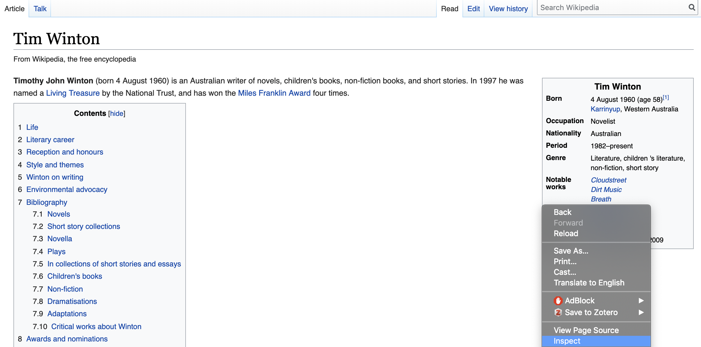
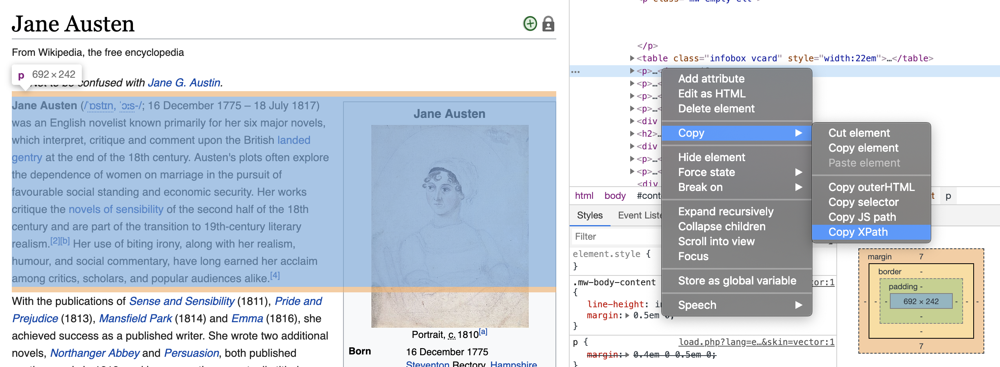

```{r, include = FALSE}
current_file <- knitr::current_input()
basename <- gsub(".Rmd$", "", current_file)

knitr::opts_chunk$set(
  fig.path = sprintf("images/%s/", basename),
  fig.width = 6,
  fig.height = 4,
  out.width = "100%",
  fig.align = "center",
  dev.args = list(bg = 'transparent'),
  fig.retina = 3,
  echo = FALSE,
  warning = FALSE,
  message = FALSE,
  cache = FALSE,
  cache.path = "cache/"
)
```


```{r setup, include = FALSE}
library(rvest)
library(tidyverse)
library(plotly)
```

```{r wrap-hook, echo = FALSE}
library(knitr)
hook_output = knit_hooks$get('output')
knit_hooks$set(output = function(x, options) {
  # this hook is used only when the linewidth option is not NULL
  if (!is.null(n <- options$linewidth)) {
    x = knitr:::split_lines(x)
    # any lines wider than n should be wrapped
    if (any(nchar(x) > n)) x = strwrap(x, width = n)
    x = paste(x, collapse = '\n')
  }
  hook_output(x, options)
})
```


```{r titleslide, child="assets/titleslide.Rmd"}
```

---

## Motivation

<center>
<blockquote class="twitter-tweet" data-lang="en"><p lang="en" dir="ltr">The most important thing I&#39;ve ever done for learning R is to paradoxically stop &quot;learning&quot; (e.g. classes and problem sets) and start doing. Take a problem you have at work or school or a dataset you find interesting and get to work. Then write it up and post on githib or a blog. <a href="https://t.co/9aQZJRrlFK">https://t.co/9aQZJRrlFK</a></p>&mdash; We are R-Ladies (@WeAreRLadies) <a href="https://twitter.com/WeAreRLadies/status/1110229736956067840?ref_src=twsrc%5Etfw">March 25, 2019</a></blockquote>
<script async src="https://platform.twitter.com/widgets.js" charset="utf-8"></script>

---

## After PhD - I wanted to read more!

<br><br><br><center>
<iframe src="https://giphy.com/embed/WoWm8YzFQJg5i" width="480" height="351" frameBorder="0" class="giphy-embed" allowFullScreen></iframe><p><a href="https://giphy.com/gifs/cartoons-comics-sea-reading-WoWm8YzFQJg5i"></a></p>
</center>

---

## Question

<br><br><br><center>
.idea-box.tl.w-70[

How should I choose what to read?

Am I reading diversely?

]
</center>

---

## Picking from lists

<center>  </center>

---

## Questions for our data

<br><br><br><center>
.info-box.tl.w-70[

Are lists like this biased?

]
</center>

---

class: center middle bg-gray

.aim-box.tl.w-70[
Today you will:

- Get to know the basics of webpages
- Look at some examples of webscraping
- Get some data to answer my questions

]

--

.aim-box.tl.w-70[
Coding Perspective:

- Learn how to read data from a webpage into R
- Do more string manipulation
- Learn about automating a scraper

]

---

## Packages we need

`rvest` is the [R package](https://rvest.tidyverse.org/articles/rvest.html) that we'll need to get started with learning the 101 of web scraping

```{r eval = FALSE, echo = TRUE}
library(rvest)
library(tidyverse)
```

* Good for static webpages 

---

class: transition

# Webpage basics

---

## Go to a webpage

https://en.wikipedia.org/wiki/Tim_Winton

<center>  </center>

---

## View html code in Chrome

* Right click the part of the page you want
* Select inpsect 
<center>  </center>

---

## Html code

* Brings up the html code
* Highlights the piece of html code related to your click
* Hover over html code to see other features of the web page
<center>  </center>

---

## Inpsect button

* Similarly, click the top left button in the side panel
* Explore related features of the webpage and html code
<center>  </center>

---

## Basic html types

By browsing you observe the basic **structure** of html webpages

<br> 

Opening and closing [tags](https://www.w3schools.com/tags/) wrapped around content to define its purpose and appearance on a webpage.  
  
e.g. < tag \> lorem ipsem text < /tag \>

<br> 

Some basic **tag types** are:

div - Division or section  

table - Table  

p - Paragraph elements  

h - Heading  

---

## Read a webpage

```{r echo = TRUE}
library(rvest)
author_url <- "https://en.wikipedia.org/wiki/Tim_Winton"
wiki_data <- read_html(author_url) # Read the webpage into R

str(wiki_data)

wiki_data
```

---

## How to scrape a table - html_table()

So we can read data from the website into R, but we need the data in a form we can use.

```{r echo = TRUE, eval = TRUE}
table_data <- wiki_data |>
  rvest::html_table(header = FALSE) #Get all tables on the webpage

length(table_data)

table_data[[1]]
  
```

---

## Other approaches - html_nodes()

```{r, echo = TRUE, eval = TRUE}
table_data_eg1 <- wiki_data |>
 rvest::html_nodes("table") |> # get all the nodes of type table
 purrr::pluck(1) |> #pull out the first one
 rvest::html_table(header = FALSE) #convert it to table type

table_data_eg1
```

---

## Other approaches - html_node()

Lots of functions in `rvest` give you the option to return the first match or to return all matches.

```{r echo = TRUE, eval = TRUE}
table_data_eg2 <- wiki_data |>
  rvest::html_node("table") |> # just get the first table match
  rvest::html_table(header = FALSE) #convert it to table type

table_data_eg2
```

---

## Get the Nationality

One more step - Need to get the nationality from the table

```{r echo = TRUE, eval = TRUE}
author_nationality = table_data_eg2 |>
  dplyr::rename(Category = X1, Response = X2) |>
  dplyr::filter(Category == "Nationality") |>
  dplyr::select(Response) |>
  as.character()

author_nationality
```

--

<center>
.idea-box.tl.w-50[

Now the real challenge: **Can we generalise?** 

]

---

# Breakout Session 

<center>
.aim-box.tl.w-70[
Try it yourself time:

- Pick your an author and find their wikipedia page
- Explore the structure of the webpage
- Download their infocard into R
- Can you get their nationality from the infocard?

]
</center>

---

## Let's try a different author

"https://en.wikipedia.org/wiki/Jane_Austen"

<center>  </center>

---

## Generalise the web page

```{r eval = TRUE, echo = TRUE}
author_first_name = "Jane"
author_last_name = "Austen"
author_url <- paste("https://en.wikipedia.org/wiki/", 
  author_first_name, "_", author_last_name, sep = "")
wiki_data <- read_html(author_url)
```

---

## Let's get that table

```{r eval = TRUE, echo = TRUE}
table_data <- wiki_data |>
  rvest::html_nodes(".infobox.vcard") |> #search for a class
  rvest::html_table(header = FALSE) |>
  purrr::pluck(1) 

head(table_data)
```

---

## Web scraping is tricky

```{r, echo = TRUE, eval = TRUE}
table_data |> dplyr::select(1) |> unlist() |> as.vector()
```

<center>
.aim-box.tl.w-80[

**No nationality** category in Jane Austen's infocard

]

--

.idea-box.tl.w-80[

Her nationality is in the webpage text.  
Let's scrape the nationality from there.

]

---

## Try another way

```{r echo = TRUE, eval = TRUE}
para_data <- wiki_data |>
  rvest::html_nodes("p") # get all the paragraphs
head(para_data)
```
<center>
.aim-box.tl.w-80[

But where exactly do we find her nationality in all this text?  
<br>
Let's go back to exploring the webpage.

]
</center>

---

## Get the text - html_text()

```{r echo = TRUE, eval = TRUE}
text_data <- para_data |>
  purrr::pluck(2) |> # get the second paragraph
  rvest::html_text() # convert the paragraph to text
head(text_data)
```

--

<center>
.aim-box.tl.w-80[

Let's look at two other ways we could do this.

]</center>

---

## Xpath Example

* Right click html code, copy, copy Xpath
<center>  </center>

---

## Using an Xpath

```{r, eval = TRUE, echo = TRUE}
para_xpath = '//*[@id="mw-content-text"]/div/p[2]'
text_data <- wiki_data |>
  rvest::html_nodes(xpath = para_xpath) |>
  rvest::html_text()
text_data
```

---

## JSpath Example

* Right click html code, copy, copy JS path
<center>  </center>

---

## Using CSS ID

```{r eval = TRUE, echo = TRUE}
para_css = "#mw-content-text > div > p:nth-child(5)"
text_data <- wiki_data |>
  rvest::html_nodes(css = para_css) |>
  rvest::html_text()
text_data
```

---

## Text Analysis

Still need to get her nationality, use `str_count`

```{r echo = TRUE, eval = TRUE}
possible_nationalities <- c("Australian", "Chinese", "Mexican", "English", "Ethiopian")

# Do any of these nationalities appear in the text?
count_values = str_count(text_data, possible_nationalities) 

count_values == TRUE # Which ones were matched 

possible_nationalities[count_values == TRUE] #Get the matching nationalities
```

<center>
.aim-box.tl.w-80[

- What do you think of my solution?
- Any guesses why I didn't use `str_match`?

]
</center>

---

<br><br><center>
.aim-box.tl.w-90[

## Learnt so far

- Know how to explore a web page with inspect
- Know some basics about how to get data

Also know:

- Can be hard to generalise 
- Formats aren't always standard

]</center>

---

class: transition

# Back to the original question

---

## Need to get our list

<center>  </center>

---

## Read the book list from a website

```{r echo = TRUE, eval = TRUE}
book_list_url <- "https://mizparker.wordpress.com/the-lists/1001-books-to-read-before-you-die/"
paragraph_data <- read_html(book_list_url) |> # read the web page
  rvest::html_nodes("p") # get the paragraphs
paragraph_data[1:12]
```

---

## Get the book list from the paragraphs 

This list is in pieces, but the format seems mostly consistent

```{r echo = TRUE, eval = TRUE}
book_string <- paragraph_data |>  
  purrr::pluck(4) |> # get the first part of the book list
  html_text(trim = TRUE) |> # convert it to text, remove excess white space
  str_replace_all("\n", "")

head(book_string)
```

---

## More string manipulations

Web scraping often means string handling

We want to split the string by any numbers followed by a full stop

Careful:  

  * don't want to split book titles with numbers, like Catch 22, 
  * don't want to split authors with full stops, like J.R.R Tolkien
  
Actually bit tricky!

--

<center>
.aim-box.tl.w-90[
### Resources:

   * Lecture 4 
   * stringr cheatsheet from RStudio
   * generative AI is also great resource
]
</center>

---

## Do some string handling

```{r, echo = TRUE, eval = TRUE}
eg_string = "9. book - author 10. book - author"

str_view(eg_string, "[:digit:]") #Match by any digit

str_view(eg_string, "[:digit:]+") #Match by one or more digits

str_view(eg_string, "\\.") #Match by fullstop
  
str_view(eg_string, "[[:digit:]]+?\\.") #Match digits followed by a fullstop 
```

---

## Get the list as a dataframe

```{r echo = TRUE, eval = TRUE}
books_df <- book_string |>
  str_split("[[:digit:]]+?\\.") |>
  as.data.frame(stringsAsFactors = FALSE)

names(books_df) = "Book_Author"

books_df = books_df |>
  dplyr::filter(Book_Author != "") |> # remove any empty rows
  tidyr::separate(Book_Author, sep = "\\–", into = c("book", "author")) # splits into two columns
    
```

---

## Result 

```{r}
head(books_df)
```

<center>
.aim-box.tl.w-70[

#### We are very lucky! 
  - Easily split our author and book into columns
  - Thanks to whoever coded this webpage using a long hash!

] 
</center>

---

## Need to repeat it: So wrap code in a function

```{r echo = TRUE, eval = TRUE}
Convert_book_string_to_df <- function(para_ind, pargraph_data){
  
  book_string <- paragraph_data |>  
  purrr::pluck(para_ind) |> 
  html_text(trim = TRUE) |> 
  str_replace_all("\n", "")
  
  books_df <- book_string |>
    str_split("[[:digit:]]+?\\.") |>
    as.data.frame(stringsAsFactors = FALSE)

  names(books_df) = "Book_Author"
  
  books_df = books_df |>
    dplyr::filter(Book_Author != "") |>
    tidyr::separate(Book_Author, sep = "\\–", into = c("book", "author"))
  
  return(books_df)}
```

---

## Get the final list

Need to run this function for every second paragraph starting from number 4 until paragraph 12.

```{r echo = TRUE, eval = TRUE}
book_data <- lapply(seq(4,12,2) %>% as.list(), 
                    Convert_book_string_to_df, paragraph_data) %>% 
  do.call(rbind, .) %>% 
  dplyr::mutate(author = str_trim(author))

nrow(book_data) # Has 1001 rows 
```

---

## Check what it looks like

Randomly pick 10 rows
```{r}
book_data |> sample_n(size = 10)
```
--

<center>
.aim-box.tl.w-50[
# Still not done 

Need the nationalities of all the authors!

]</center>

---

# Pseduo code 

Want a function to: 
1. Read the wiki webpage using the author name. 
2. Read the info card. 
3. Get the nationality from the infocard.   

If no nationality or infocard, want a function to:  
4. Find which html paragraphs have text in them. 
5. Guess the nationality from the text. 

6. A function that bring the above all together. 

---

## More wrapping of code chunks

Want a function to read the wiki webpage using the author name
```{r, eval = TRUE, echo = TRUE}
Read_wiki_page <- function(author_name){
  author_name_no_space = str_replace_all(author_name, "\\s+", "_")
  wiki_url <- paste("https://en.wikipedia.org/wiki/", 
    author_name_no_space, sep = "")
  wiki_data <- read_html(wiki_url)
  return(wiki_data)
}
```

---

## More wrapping of code chunks

Want a function to read the info card
```{r, eval = TRUE, echo = TRUE}
Get_wiki_infocard <- function(wiki_data){
  infocard <- wiki_data |>
    rvest::html_nodes(".infobox.vcard") |>
    rvest::html_table(header = FALSE) |>
    purrr::pluck(1)
  return(infocard)
}
```

---

## More wrapping of code chunks

Want a function to get the nationality from the infocard
```{r, eval = TRUE, echo = TRUE}
Get_nationality_from_infocard <- function(infocard){
  nationality <- infocard %>%
    dplyr::rename(Category = X1, Response = X2) %>%
    dplyr::filter(Category == "Nationality") %>%
    dplyr::select(Response) %>%
    as.character()
  return(nationality)
}
```

---

## More wrapping of code chunks

Need a function to find which html paragraphs have text in them
```{r, eval = TRUE, echo = TRUE}
Get_first_text <- function(wiki_data){
  paragraph_data <- wiki_data %>%
    rvest::html_nodes("p")
  i = 1
  no_text = TRUE
  while(no_text){
    text_data <- paragraph_data %>%
      purrr::pluck(i) %>% 
      rvest::html_text() 
    check_text = gsub("\\s+", "", text_data)
    if(check_text == ""){ 
      i = i + 1 
    }else{ 
      no_text = FALSE
    }
  }
  return(text_data)
}
```

---

## More wrapping of code chunks
Need another function to get the nationality from the text
```{r, eval = TRUE, echo = TRUE}
Guess_nationality_from_text <- function(text_data, possible_nationalities){
  
  num_matches <- str_count(text_data, possible_nationalities)
  prob_matches <- num_matches/sum(num_matches)
  
  i = which(prob_matches > 0)
  if(length(i) == 1){
    prob_nationality = possible_nationalities[i] 
  }else if(length(i) > 0){
    warning(paste(c("More than one match for the nationality:", 
                  possible_nationalities[i], "\n"), collapse = " "))
    match_locations = str_locate(text_data, possible_nationalities[i]) #gives locations of matches
    j = i[which.min(match_locations[,1])]
    prob_nationality = possible_nationalities[j] 
  }else{
    return(NA)
  }
  return(prob_nationality)
}
```

---

## More wrapping of code chunks

One function that brings that all together

```{r, eval = TRUE, echo = TRUE}
Query_nationality_from_wiki <- function(author_name, possible_nationalities){
  
  wiki_data <- Read_wiki_page(author_name)
  
  infocard <- Get_wiki_infocard(wiki_data)
  
 if(is.null(infocard)){
   
    # nationality <- "Missing infocard"
   first_paragraph <- Get_first_text(wiki_data)
    nationality <- Guess_nationality_from_text(first_paragraph,
      possible_nationalities)
    
   return(nationality)
    
 }
  
  if(any(infocard[,1] == "Nationality")){
    
    # info card exists and has nationality 
    nationality <- Get_nationality_from_infocard(infocard)
    
  }else{
    
    # find nationality in text
    first_paragraph <- Get_first_text(wiki_data)
    nationality <- Guess_nationality_from_text(first_paragraph,
      possible_nationalities)
  }
  
  return(nationality)
}
```

---

## Examples

```{r, eval = TRUE, echo = TRUE}
Query_nationality_from_wiki("Tim Winton", c("English", "British", "Australian"))

Query_nationality_from_wiki("Jane Austen" , c("English", "British", "Australian"))

Query_nationality_from_wiki("Zadie Smith", c("English", "British", "Australian"))

```
--

<center>
.aim-box.tl.w-90[

## Still not done

We need a list of nationalities to search for in our text

]</center>

---

## What nationalities to search for?

```{r echo = TRUE, eval = TRUE}
# Get table of nationalities
url <- "http://www.vocabulary.cl/Basic/Nationalities.htm"
xpath <- "/html/body/div[1]/article/table[2]"
nationalities_df <- url %>%
  read_html() %>%
  html_nodes(xpath = xpath) %>%
  html_table() %>% 
  as.data.frame()

possible_nationalities = nationalities_df[,2]
head(possible_nationalities)
```
---

## Manual fixing

```{r echo = TRUE, eval = TRUE}
fix_entry = "ArgentineArgentinian"
i0 = which(nationalities_df == fix_entry, arr.ind = TRUE)
new_row = nationalities_df[i0[1], ]
nationalities_df[i0] = "Argentine"
new_row[,2] = "Argentinian"
nationalities_df = rbind(nationalities_df, new_row)

fix_footnote1 = "Colombia *"
i1 = which(nationalities_df == fix_footnote1, arr.ind = TRUE)
nationalities_df[i1] = strsplit(fix_footnote1, split = ' ')[[1]][1]

fix_footnote2 = "American **"
i2 = which(nationalities_df == fix_footnote2, arr.ind = TRUE)
nationalities_df[i2] = strsplit(fix_footnote2, split = ' ')[[1]][1]

possible_nationalities = nationalities_df[,2]

saveRDS(possible_nationalities, "data/possible_nationalities.rds")
```

---

## Get Nationalities

```{r, echo = TRUE, eval = TRUE}
nationality_from_author = sapply(book_data$author[1:20],  
                                        function(author_name){
  nataionality = tryCatch( # Just in case!
     Query_nationality_from_wiki(author_name, 
                                 possible_nationalities),
    error = function(e) NA)
  }) %>% unlist()

nationality_from_author
```

---

class: transition

# How diversely do we read

---

## Run it!

```{r, eval = FALSE, echo = TRUE}
nationality_from_author = sapply(book_data$author |> unique(),  
                                        function(author_name){
  print(author_name)
                                          
  nationality = tryCatch( # Just in case!
     Query_nationality_from_wiki(author_name, 
                                 possible_nationalities),
    error = function(e) NA)
  
}) 

author_nationality_df <- data.frame(
  author = book_data$author |> unique(), 
  nationality = nationality_from_author) 

book_data_with_nationality <- book_data |>
  dplyr::left_join(author_nationality_df)
  
head(book_data_with_nationality)

saveRDS(book_data_with_nationality, "data/book_data.rds")
```

---

## Result

```{r}
book_data_with_nationality = readRDS("data/book_data.rds")

table_nationalities <- book_data_with_nationality |> 
  dplyr::select(author, nationality) |>
  dplyr::distinct() |>
  group_by(nationality) |>
  summarise(count = n()) |>
  ungroup() |> 
  arrange(desc(count))

head(table_nationalities)

```

---

## Let's take a look

```{r echo = TRUE, eval = TRUE, message = FALSE, warning = FALSE}
library(plotly)
pie_plot <- table_nationalities %>%
  plot_ly(labels = ~nationality, values = ~count) %>%
  add_pie(hole = 0.6) %>%
  layout(title = "Nationalities",  showlegend = F,
         xaxis = list(showgrid = FALSE, zeroline = FALSE, showticklabels = FALSE),
         yaxis = list(showgrid = FALSE, zeroline = FALSE, showticklabels = FALSE))
```

---

## Plotting result

```{r pie, echo = TRUE, eval = TRUE}

pie_plot

```

---

## A Few thoughts

<br><br>
.aim-box.tl.w-70[

- Many ways to approach this problem
- Approach here was to use the standard rvest toolbox
- Not perfect - much needed cleaning of nationality strings 
- A bit of quessing of nationalities

]

---

## What else could we have done

- Can scrape more data from goodreads website
- Goodreads has an API
- Check out the repository by famguy/rgoodreads to get started
- Using this API makes querying things like year or gender more straightforward
- But goodreads has no nationality, so this solution still is useful!

---

## What else for webscraping

* There are easier ways to answer this same question
* Namely, RSelenium for pages with javascript
* Learning the hard way can be good sometimes though!

--

We should stop before we start scraping and think about whether we should.

* Check the terms and conditions and terms of use
* Look for a data licence
* Consider ethics. Am I violating data privacy? 
* Be considerate of the volume of queries and query rate limit
* Can look at the robots.txt file for the website

---

class: center middle bg-gray

.aim-box.tl.w-70[
#Summary 

- We've learnt the basics of web scraping 
- Know how to scrape from a statics website in R
- Work towards an automating our web scraping 
- And we found out there are many challenges!

]

---

class: transition

## Slides developed by Dr Kate Saunders

---

```{r endslide, child="assets/endslide.Rmd"}
```
