```{r, include = FALSE}
current_file <- knitr::current_input()
basename <- gsub(".Rmd$", "", current_file)

knitr::opts_chunk$set(
  fig.path = sprintf("images/%s/", basename),
  fig.width = 6,
  fig.height = 4,
  fig.align = "center",
  fig.retina = 2,
  echo = TRUE,
  eval = TRUE,
  warning = FALSE,
  message = FALSE,
  cache = TRUE,
  cache.path = "cache/"
)

library(tidyverse)
library(scales)
library(readxl)
library(readabs)
library(here)
library(lubridate)
```

```{r titleslide, child="assets/titleslide.Rmd"}
```

---

# Hello!

- I am Will Mackey, an economist(?) and data scientist(?) at .orange[Grattan Institute] in Melbourne.

--

- I spend my days cleaning, analysing, and visualising data, as well as writing and communicating policy ideas.

--

- I spend a _lot_ of time using R.

--

- I recently helped found the [R Users Network for Australian Public Policy](https://runapp-aus.github.io/runapp_website/join.html): `runapp`.

--

- I wish I this course existed when I was at univeristy.

---

class: middle center transition


.idea-box.tl[
Today you will:

- learn about the superannuation guarantee
- source and join data from a range of sources
- use data and models to get inside the heads wage-setters
- model wage growth to inform policy-makers
]


---


# Superannuation  and wages

* .orange[**Motivation**]: what is this and why does it matter?
--

* .orange[**Theory**]: Tax incidence theory and literature: what is expected to happen to wages when the SG goes up?
--

* .orange[**Methodology**]: how do we measure the super-wages trade-off?
--

* .orange[**Results**]: what is the super-wages trade-off?
---


# The question

--
* What is the relationship between changes to the superannuation guarantee and nominal wage increases, as shown by federally-registered enterprise bargaining agreements?
--

* This matters!

--

  - If there **is no trade-off**: increasing the SG is free money for employees (and higher labour costs for employers)
  
--
  - If there **is a trade-off**: increasing the SG is forced savings for employees, meaning they have less take-home pay now (no change in labour costs for employers)
  
--
* Strong interest in this kind of question from economic academics

--

* Policy-relevant: a solid empirical answer can better inform policy decisions

---


# What is the superannuation guarantee?


.blockquote[
'Super is money put aside by your employer over your working life for you to live on when you retire from work.'
<br> - ATO
]

--

- Super is a 'defined contribution scheme'
  - you get out what you put in
  - different to age pension, where what you get doesn't depend on what you put in.
  
--

- The Superannuation Guarantee (SG) is paid by employers (the 'legislated burden')

--

- The SG is compulsory
  - employers of (almost all) workers must pay super on behalf on their employees.
  
---


# SG has increased bit-by-bit since the early 90s, and is slated to again from 2022

.pull-left[
* SG legislated in 1992. Some employers paying super before that.

* Current rate is 9.5% of 'ordinary time earnings'. 

* Legislated to go up to 12% by 2025. There have been many proposals/cancellations of
increases in its short history.
]

.pull-left[
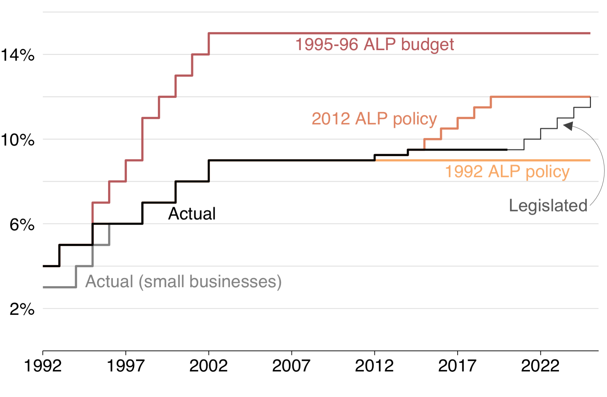
]

---

# So who _pays_ for super?

* Is there a 'super-wages' trade-off?

--

* An increase in the Super Guarantee increases the cost of employing a worker. This cost can be passed on to:

--

  * **Workers** through lower nominal wage growth (back-shifting)

--

  * **Consumers** through higher prices (forward-shifting)
  
--

  * **Investors** through lower profits, with potential flow-on impacts to investment and employment)
---

# A scenario:

* Employees of a company earn `r dollar(100e3)` each, plus super of `r percent(0.10)`:

```{r salary-example}
ind_salary <- 100e3
sg <- 0.10
ind_salary_super <- ind_salary * (1 + sg)
```
--

* The company employees 30 people:

```{r wage-bill-example}
employees <- 30
wage_bill <- ind_salary_super * employees
```
--

* Meaning their wage bill is `r scales::dollar(wage_bill)`

--

* .blue[**Activity**]: 
--

    * how much does the wage bill change if the SG rises from 10% to 11%?
--
    * if the cost of the SG increase is passed through to workers, by how much do their **salaries** change?
--
    * if the cost of the SG increase is passed through to workers, by how much does their **super contribution change**?


---

# .blue[**Activity**]: what happens when the SG rises to 10%? 

* how much does the **wage bill** change if the SG rises and salaries stay the same?

--

```{r sg-activity1}
new_sg <- 0.11
new_ind_salary_super <- ind_salary * (1 + new_sg)
new_wage_bill <- new_ind_salary_super * employees

dollar(new_wage_bill - wage_bill)
percent(new_wage_bill / wage_bill - 1, accuracy = .000001)
```

---

# .blue[**Activity**]: what happens when the SG rises to 10%? 

* if the cost of the SG increase is passed through to workers, by how much do their **salaries** change?
--

```{r sg-activity2, eval = FALSE}
(new_ind_salary * (1 + new_sg)) * employees = wage_bill
```

--

* rearrange to find the value for `new_ind_salary`:
--

```{r sg-activity3}
new_ind_salary = (wage_bill / employees) / (1 + new_sg)

dollar(new_ind_salary - ind_salary)
percent(new_ind_salary / ind_salary - 1, accuracy = .000001)
```

---

# .blue[**Activity**]: what happens when the SG rises to 10%? 

* if the cost of the SG increase is passed through to workers, by how much does their super contribution change?

--

```{r sg-activity4}
super_contribution <- ind_salary * sg
new_super_contribution <- new_ind_salary * new_sg

dollar(new_super_contribution - super_contribution)
percent(new_super_contribution / super_contribution - 1, accuracy = .000001)
```


---

# So who _pays_ for super?

* **No trade-off**: free increase in wages for workers and an additional cost for employers.

--

* **Full pass-through to wages**: forced savings via lower wages for workers now.

--

* The level of pass-through will affect analysis of the benefits of super.

--

* Important empirical question: who ultimately pays for super?

---

# What have others found?

- In a systematic review, [Bozio et al (2019)](https://poseidon01.ssrn.com/delivery.php?ID=717095022119089099024005027005071081019000032009017018022113061032029009052123102122017104066038058014089114097096118102119125124002127087020104101097100101071095028084026024116069&EXT=pdf&INDEX=TRUE) find that there is a relatively consistent full pass-through of benefits to wages .orange[**when there is strong linkage of benefits to employers**]:

--

.center[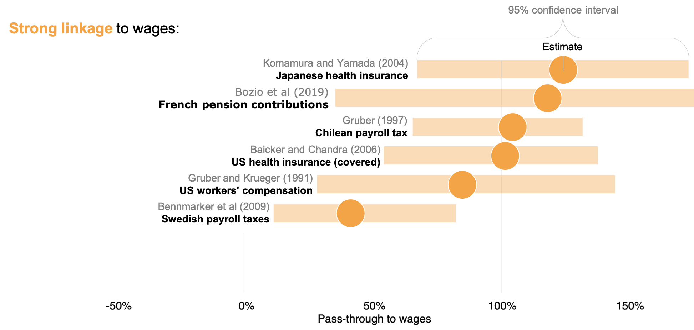]
---

# What have others found?

- Bozio et al (2019) also find that, where there is .light-blue[**weaker linkage of benefits to employers**], the pass-through to wages is far less certain:

--

.center[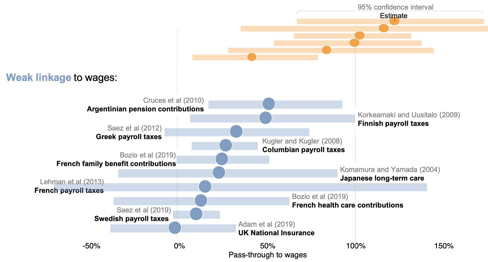]

---

# Using what have others found?

* Other research provides a few clues.

--

* But is superannuation 'strongly' linked to wages?
  - maybe yes? But hard to _prove_.

--

* Need to test empirically.

--

* _Can we test this empirically_?
 
---

# Could .orange[**we**] answer this question?

* Is it _answerable_?

--

* Is it answerable _with data_?

--

* Is that data collected and available?
--
 to us?
--

* What do we need to know about the data?

--

* What do we need to know about the _subject_?

--

* What analysis techniques do we need?


---

# The process

* **Read literature**: 
  * *how* have others tried to answer this question, or similar questions?
  * what economic conditions affect wage growth?
--

* **Identification strategy**: 
--

  - what model are we using, or what analysis can we do to explore our effect? 
  - _what data do we need to answer the question?_
--

* **Sourcing data**:
--

    - what data exists? (open free, paywalled, private, admin)
    - what have others used?
    - ABS alone has more than 100 current products, each with many _many_ series.
    - survey data
    - admin data (pretty please)
    - many other data sources exist - hard to keep track of them all!
---

# Thinking about a model

* When compulsory super changes, what happens to wages?
--
 or wage _growth_?

--

* Could realistically be expressed in a linear model:

--

  * $\Delta {wage}_i = \beta_0 + \beta_1 \Delta SG_i + \mathbf{\beta X_i}$
  
--

* What is the unit of observation?

--

  * Aggregated wage growth for **Australia**, per **quarter**?
  
--

  * Aggregated wage growth for each **state**, per **month**?
  
--

  * Wage growth for **each worker** in Australia, per **quarter**? 
--
per **month**? 
--
per **day**?


---

# Using workplace agreement-level microdata

- The Workplace Agreements Database has been maintained by the Attorney General's Department since 1991.
    - Made available on request in 2016
    - Told no-one
    
--

- Contains detailed information about federally registered enterprise bargaining agreements (EBAs).

--

  - Certification, start and end dates
  
--

  - All nominal wage increases
  
--
  - Industry, sector, union involvement
  
--

  - 120,000 agreements
  
--

  - ~400 variables

--

- We use 80,000 agreements spanning 1991-2018.

--

- These agreements are our unit of analysis (observations).


---

# Using workplace agreement-level microdata

- Dataset is lovingly maintained by the AG's Dept

--

- Has detailed data documentation on all variables

--

- Collected via Microsoft Access (?)

--

- Published, on request, in a series of Excel workbooks


---

# Using workplace agreement-level microdata

.pull-right[
.center[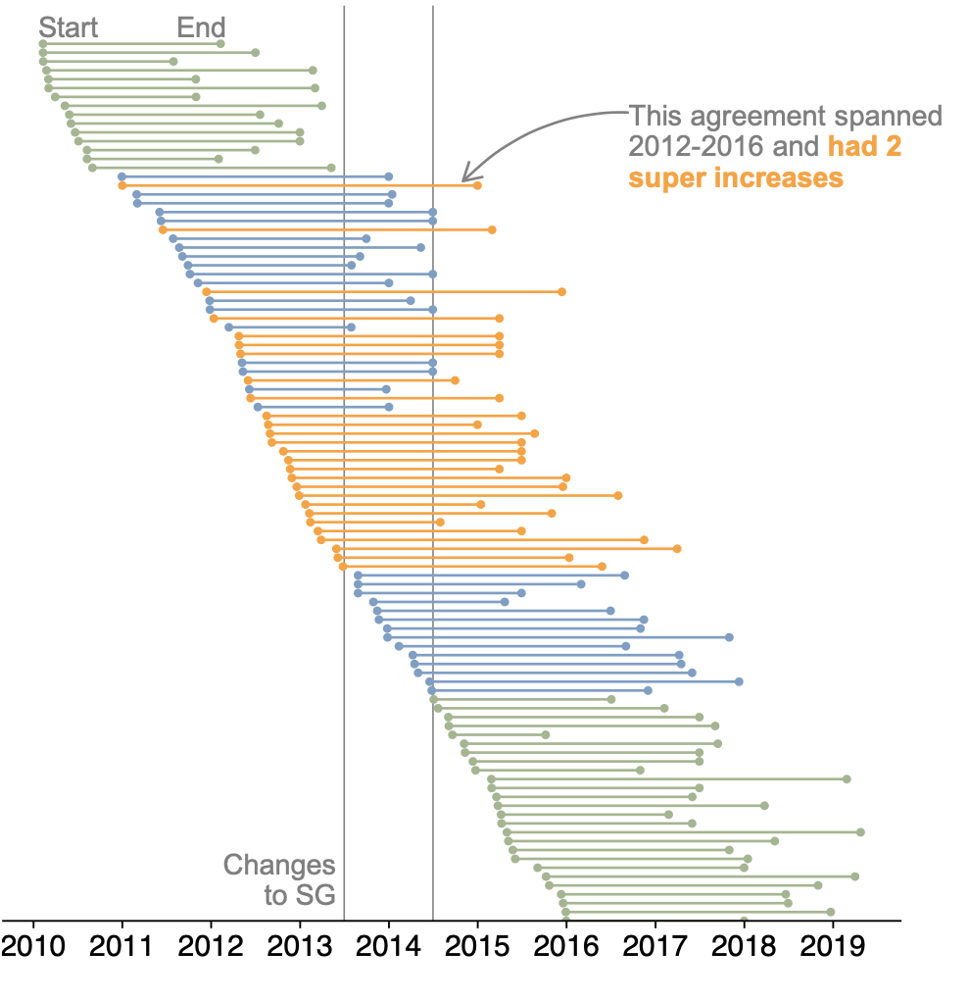]
]

--

.pull-left[

- An agreement that .blue[spans one **0.25ppt** SG increase] should, all else equal:
<br><br>
  - have higher wage rises than an agreement that spanned a .orange[**0.50ppt increase**]; and
<br><br>
  - have lower wage rises than an agreement that .green[**did not span an increase**].
]


---

# What data do we need?

1. Information about the level of and changes to the Super Guarantee at each point in time, and the expected change to wages with pass-through.

--

  - From legislation.

--

2. Nominal wage growth of each agreement.

--

  - From the WAD.

--

3. Specific characteristics of individual firms and agreements that affect wage growth

--

  - From the WAD.

--

4. Information about economic factors that might affect wage growth decisions

--

  - ABS, RBA, OECD

---


# Changes to SG and its effect on wages

- A full pass-through of SG to wages means keeping total labour cost constant. There is not a linear 'one-to-one' trade-off.

--

- Eg: when SG is 4% and worker has wages of `r dollar(100e3)`, employer pays super of `r dollar(100e3*0.04)`. **Total labour cost: `r dollar(100e3*1.04)`**. 

--

  - If SG goes up to 5%, keeping total labour cost constant means: 
  
--

  - Wages decrease 0.952% to `r dollar(99047)`.

--
    
  - Super contribution is now `r dollar(4953)`.

--

  - Total labour cost remains `r dollar(104000)`. 

--

- This can be expressed with the equation:

.center[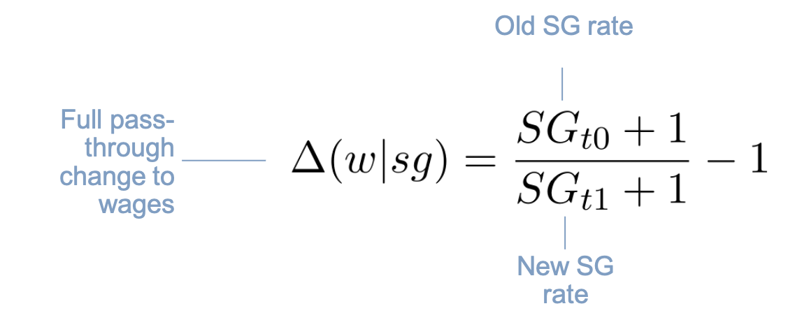]

---

# Changes to SG and its effect on wages

.center[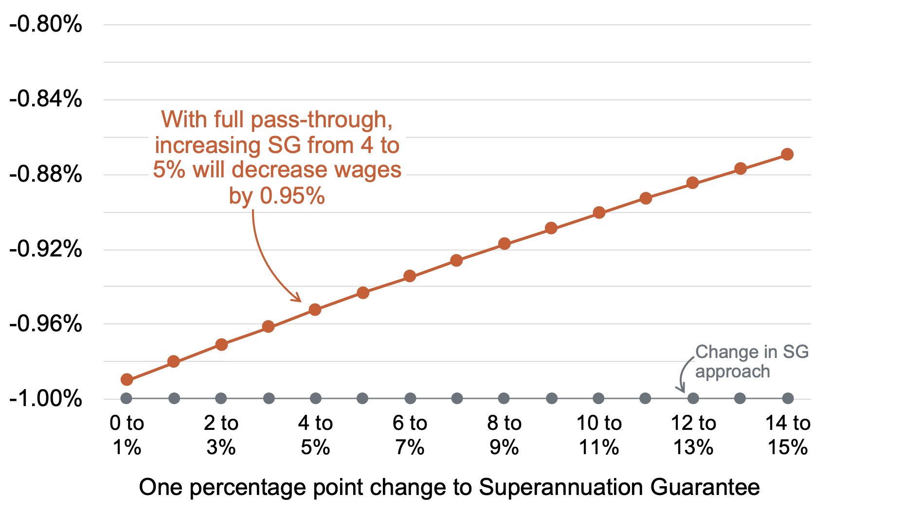]

---

# Changes to SG and effect on wages

Interpretation of $\Delta(w|sg)$ : 


- $\Delta(w|sg) = 1$ is a full pass-through of the Superannuation Guarantee to wages over the life of an agreement.

--

- $\Delta(w|sg) = 0.5$ is a half pass-through of the Superannuation Guarantee to wages over the life of an agreement.

--

- $\Delta(w|sg) = 0$ is zero pass-through of the Superannuation Guarantee to wages over the life of an agreement.

---

# Nominal wage increases

.pull-left[
- Each agreement has - in a separate Excel file - a list of wage rises over its life.

- A variable indicates whether these percentage rises are compounding or anchored to wages at beginning.

- This is important, as it changes _total_ rise over the life of the agreement.

- For example, consider a three-year agreement with annual wage rises of 3 per cent:

]

--

.pull-right[
```{r eg-rises}
rises <- tibble(
  year = c(1L, 2L, 3L),
  wage_rise = c(3, 3, 3)/100
)

rises
```
]

---

# Nominal wage increases

```{r eg-rises2}
rises <- tibble(
  year = c(1L, 2L, 3L),
  wage_rise = c(3, 3, 3)/100
)
```

--

- Wage increases will be different if the rises are compounding or non-compounding:

```{r eg-rises3}
rises %>% 
  mutate(non_compounding = cumsum(wage_rise),
         compounding = cumprod(1 + wage_rise) - 1)
```

---

# Nominal wage increases

.pull-left[
- Calculating the average annual wage increase ('AAWI') for:
  - each agreement
  - weighted by employees
    - .orange[**why?**]
]

.pull-right[

.center[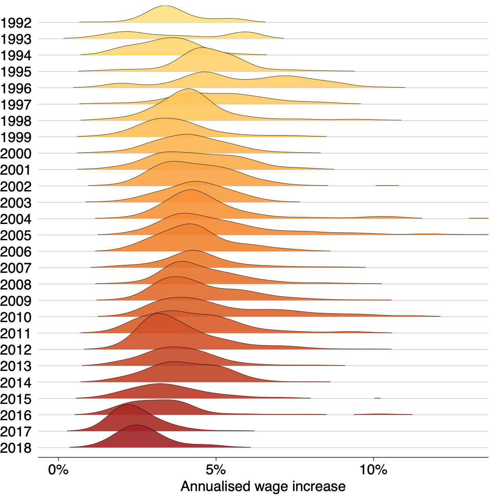]

]

---

# And that's it!

<br><br>

- Regress $\Delta wage = \Delta (w|sg)$ by:

<br><br>

```{r, eval = FALSE}
lm(aawi ~ delta_wsg)
```

<br><br>
--
.orange[(kidding)]

<br><br>

We need something more...

---

class: transition middle 

# Discussion

<br><br>

What is our model missing?
<br>

**What else should we include?**

---

# Information about firms and their agreements

- Specific characteristics of individual firms and agreements that affect wage growth

  - Employees covered
  
--

  - Industry
  
--

  - Union involvement
  
--

  - Sector

--

  - State

--

  - Multi-enterprise

--


- And how should these variables _enter_ our model?

---

# Economic conditions surrounding negotiations

- or '_getting inside the head of a decision-maker_'.

* The question here is: 

.blockquote[
when employers are deciding on their employee's wage rises over time, what are they taking into account? If the superannuation guarantee goes up, do they increase their employee's wages less than they _otherwise would have_?
]

* We need to get **inside their head** to best approximate this decision making.

---


# Generate the economic conditions that surrounded each decision

* What were **wages growth** _recently_?
--

* What has **economic growth** been recently?
--
 per capita?
--

* What is the **inflation rate**? 
--
or is _expected to be_? 
--
and _when_?
--

* What was the **unemployment rate**?
--
 compared to the
--
 **n**on-
--
**a**ccelerating
--
 **i**nflation 
--
 **r**ate 
--
 of
--
 **u**nemployment 
--
 (the **NAIRU**)?
--

* What was the **under**employment rate?

--

* _When_ were all of these things known?
  * 'Officially' or earlier through experience


---

# Sourcing data: AWOTE

* 'Average Weekly Ordinary Time Earnings'. Common measure of wages in Australia.

--

* We need AWOTE from 1990-2018. Collected by the ABS for this time, but stored annoyingly. 

--

* Quarterly data from before 1994 can be retrieved from the November 2008 release ([Cat 6302.0, table 2](https://www.abs.gov.au/AUSSTATS/abs@.nsf/DetailsPage/6302.0Nov%202008?OpenDocument))

--

```{r awote-94}
awote_pre_94 <- readabs::read_abs_local(
  filenames = "awote_pre_94.xls",
  path = here::here("lectures", "data", "lecture-10", "abs", "6302.0")
  )

head(awote_pre_94$date)
tail(awote_pre_94$date)
```

---

# Sourcing data: AWOTE

--

* Pre-2012 retrieved from the February 2012 release ([Cat 6302.0, table 2](https://www.abs.gov.au/Ausstats/abs@.nsf/0/38DEA08DD1A1ABDACA257A5B00121409?OpenDocument))

--

```{r awote-12}
awote_pre_12 <- readabs::read_abs_local(
  filenames = "awote_pre_12.xls",
  path = here::here("lectures", "data", "lecture-10", "abs", "6302.0")
  )

head(awote_pre_12$date)
tail(awote_pre_12$date)
```

---

# Sourcing data: AWOTE

--

* Recent data obtained from the latest release, using the [`readabs`](https://github.com/MattCowgill/readabs) package directly:

--

```{r awote-recent}
awote_recent <- read_abs("6302.0", table = 2)

head(awote_recent$date)
tail(awote_recent$date)
```

---

# Combining and cleaning AWOTE

- Each AWOTE `df` is has the same structure:

```{r}
names(awote_pre_94)
names(awote_pre_12)
names(awote_recent)
```

---

# Combining and cleaning AWOTE

- Create a function to _consistently_ tidy the AWOTE datasets before combining:

```{r}
tidy_awote <- function(df) {
  df %>%
    separate_series(remove_nas = TRUE, remove_totals = TRUE) %>%
    filter(series_2 == "Persons",
           series_3 == "Full Time",
           series_4 == "Adult",
           series_5 == "Ordinary time earnings") %>%
    mutate(release_year = case_when(table_no == "awote_pre_94" ~ 2007,
                                    table_no == "awote_pre_12" ~ 2012,
                                    TRUE ~ 2019)) %>%
    select(date, awote = value, release_year)
}

awote_combined <- map_dfr(list(awote_pre_12, awote_pre_94, awote_recent),
                          tidy_awote)
```

---

class: transition middle 

# Discussion

<br><br>

When might it be beneficial to write your own function to clean data?
<br>
What are some of the risks?

---


# Combining and cleaning AWOTE

- The three sources overlap; where we have more than one observation for a given month, keep only the one from the latest AWOTE release.

```{r}
awote_tidy <- awote_combined %>%
  group_by(date) %>%
  filter(release_year == max(release_year)) %>%
  ungroup() %>%
  mutate(cert_year = year(date),
         cert_quarter = quarter(date)) %>% 
  select(cert_year, cert_quarter, awote)
```

---

# Combining and cleaning AWOTE

- Build (or find!) functions for tasks _specific to your analysis_

--

- Linearly interpolate missing value from time-series:

```{r}
interpolate_missing_ts <- function(x) {
  if_else(is.na(x),
          (lag(x) + lead(x)) / 2,
          x)
}
```

--

- Get 12-month average function from quarters

```{r}
get_12month_av <- function(x) {
  1/4 * (x + 
         lag(x, 1) + 
         lag(x, 2) + 
         lag(x, 3))
}
```

---

# Combining and cleaning AWOTE

- Generate final AWOTE variables

```{r}
awote <- crossing(cert_year = seq(1988, 2018),
                  cert_quarter = seq(1, 4)) %>% 
         left_join(awote_tidy) %>% 
         mutate(
           # Interpolate
           awote = interpolate_missing_ts(awote),
           # Generate vars
           awote_growth1 = 100 * (awote / lag(awote) - 1),
           awote_growth1_12 = get_12month_av(awote_growth1),
           awote_growth1_lag1 = lag(awote_growth1),
           awote_growth1_12_lag1 = lag(awote_growth1_12))
```
---


# Sourcing data: GDP per capita

```{r, eval=FALSE}
nf_gdp_percap <- read_abs(series_id = "A2304372W") %>% 
  mutate(nf_gdp_percap_growth = value,
         nf_gdp_percap_growth12 = get_12month_av(nf_gdp_percap_growth),
         nf_gdp_percap_growth_1diff12 = nf_gdp_percap_growth - lag(nf_gdp_percap_growth), 
         cert_year = year(date),
         cert_quarter = quarter(date)) %>%
  filter(cert_year >= 1990) %>% 
  select(cert_year, cert_quarter, starts_with("nf_gdp")) 
```
---


# Sourcing data: unemployment rate


```{r, eval=FALSE}
unemp_base <- read_abs("6202.0", 1) %>% 
  separate_series() %>%
  filter(series_1 == "Unemployment rate",
         series_2 == "Persons",
         series_type == "Seasonally Adjusted") %>%
  select(date, unemp = value) %>% 
  mutate(cert_year = year(date),
         cert_month = month(date),
         unemp12 = get_12month_av_month(unemp),
         unemp_pc_change = 100 * (unemp / lag(unemp, 12) - 1))
```

---

# Sourcing data: NAIRU 

- From OECD Economic Outlook
- The NAIRU data is annual; expand it so we have quarterly observations
- Other sources?

```{r, eval=FALSE}
nairu_base <- OECD::get_dataset("EO", "AUS.NAIRU.A") %>% 
  select(year = obsTime, nairu = obsValue)

nairu <- crossing(cert_year = unique(nairu$year),
                  cert_month = c(1:12)) %>%
  right_join(nairu_base, by = c("cert_year" = "year")) %>% 
  mutate(cert_year = as.numeric(cert_year),
         nairu_change = nairu / lag(nairu, 3))
```

---

# Generating the NAIRU-gap

```{r eval=FALSE}
unemp <- unemp_base %>%
  left_join(nairu) %>% 
  mutate(nairu_gap = unemp - nairu,
         nairu_gap12 = get_12month_av_month(nairu_gap)) %>% 
  filter(cert_year >= 1990)
```


---

# Sourcing data: Industry unemployment

- Get unemployment by (last) broad industry from ABS

```{r, eval=FALSE}
ind_unemp <- readxl::read_excel("data/ABS/UQ2b.xlsx", sheet = 3, skip = 3) %>% 
  rename(date = 1,
         state = 2,
         industry1 = 3,
         unemployed_weeks = 4,
         unemployed_ft = 5,
         unemployed_pt = 6) %>% 
  mutate(state = strayr::strayr(state),
         cert_year = year(date),
         cert_quarter = quarter(date),
         ind_unemployed = unemployed_ft + unemployed_pt) %>% 
  select(cert_year, cert_quarter, 
         state, industry1, 
         ind_unemployed) %>% 
  filter(!industry1 %>% str_detect("Last worked|Has never"))
```

---

# Sourcing data: Industry unemployment

- Get employment by broad industry from ABS

```{r, eval=FALSE}
ind_employed <- readxl::read_excel("data/ABS/EQ06.xlsx", sheet = 3, skip = 3) %>% 
  select( #<<
    date = 1, sex = 2, state = 3, ind_long = 4, employed_ft = 5, employed_pt = 6) %>% 
  mutate( #<<
    state = strayr::strayr(state), cert_year = year(date), 
    cert_quarter = quarter(date), employed = employed_ft + employed_pt,
    industry = substr(ind_long, 5, 1e3) %>% str_remove_all(" nfd")) %>% 
  left_join(industry1_join) %>% #<<
  mutate(industry1 = case_when( #<<
    !is.na(industry1) ~ industry1,
    industry == "Pump, Compressor, Heating and Ventilation Equipment Manufacturing" ~ "Manufacturing", industry == "Private Households Employing Staff and Undifferentiated Goods- and Service-Producing Activities of Households for Own Use" ~ "Other Services", # odder tbh
    TRUE ~ industry
  )) %>% 
  group_by(cert_year, cert_quarter, state, industry1) %>%  #<<
  summarise(ind_employed = sum(employed)) #<<
```


---

# Combining and cleaning industry unemployment data

- Estimate unemployment rate by broad industry

```{r, eval=FALSE}
ind_ue <- ind_employed %>% 
  filter(cert_year >= 1991) %>% 
  left_join(ind_unemp) %>% 
  mutate(ind_ue_rate = 100 * ind_unemployed / (ind_employed + ind_unemployed))
```


---

# Joining data

* How should we join annual, quarterly and monthly data with agreements?

* Consider how wage negotiations play out:

.center[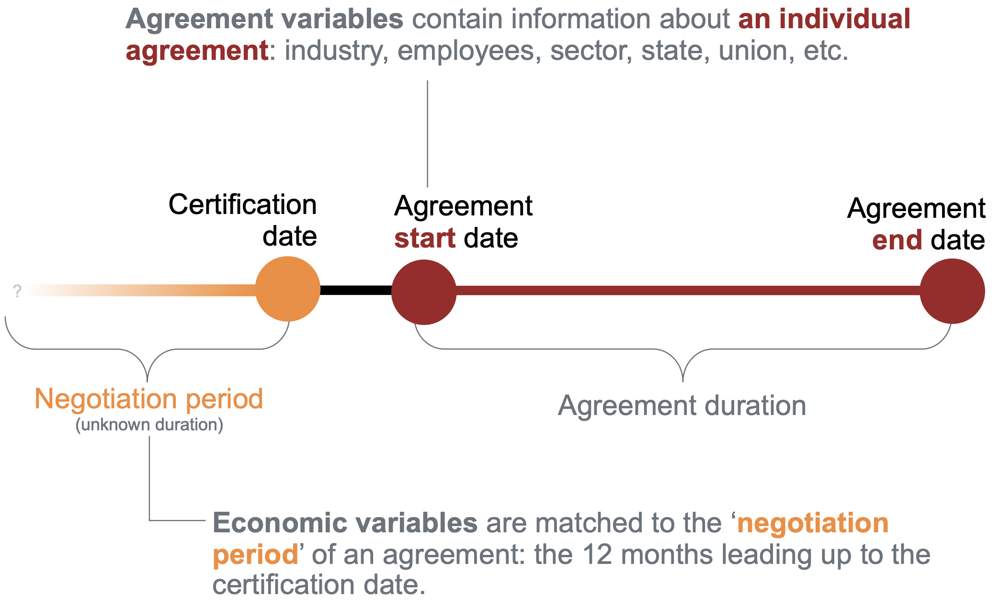]

---

# Joining data

* Idea: 

--

  * join on the agreement start date's `year`, `quarter`, `month` (where appropriate)
  
--
  
  * use lags in the model to recreate the 'negotiation period'

---

# Modelling

- Model (1) is:

.center[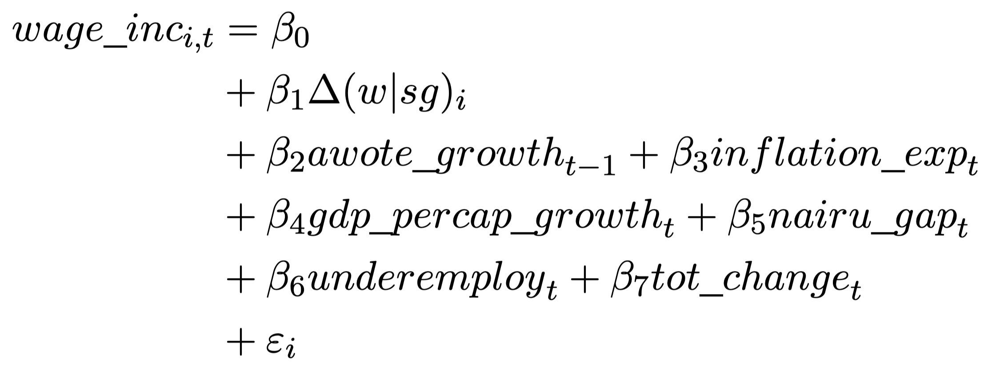]

--

- where $i$ is an agreement in the WAD certified during quarter $t$. ${wage\_inc}_{i,t}$ is the sum of nominal wage increases during the agreement, annualised over the duration of the agreement.

- $\Delta(w|sg)$ is the full pass-through effect on nominal wages resulting from a change to the SG between the start and end dates of the agreement, annualised over the duration of the agreement.

---

# Modelling

.pull-left[
- Model (2) uses the full suite of macroeconomic, industry-level economic and agreement-specific variables that are likely to explain wage growth.

- The $union_i$ variable is a vector of dummy variables for each of the 82 unions mentioned in agreements. Unions play an important role in wage setting, and play a direct role when wages are set by collective bargaining.
]

.pull-right[
.center[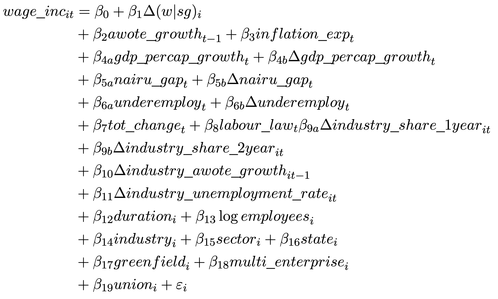]
]

---

# Modelling

.pull-left[
- Model (3) builds on Model (2) by adding three 'interaction terms'. 

- An interaction term, denoted by $\times$, allows a variable to have a different effect for different groups. For example, $industry_{i} \times {inflation\_exp}_{t}$ allows the inflation to affect wage growth in the accommodation industry differently to the administrative services industry.
]

.pull-right[
.center[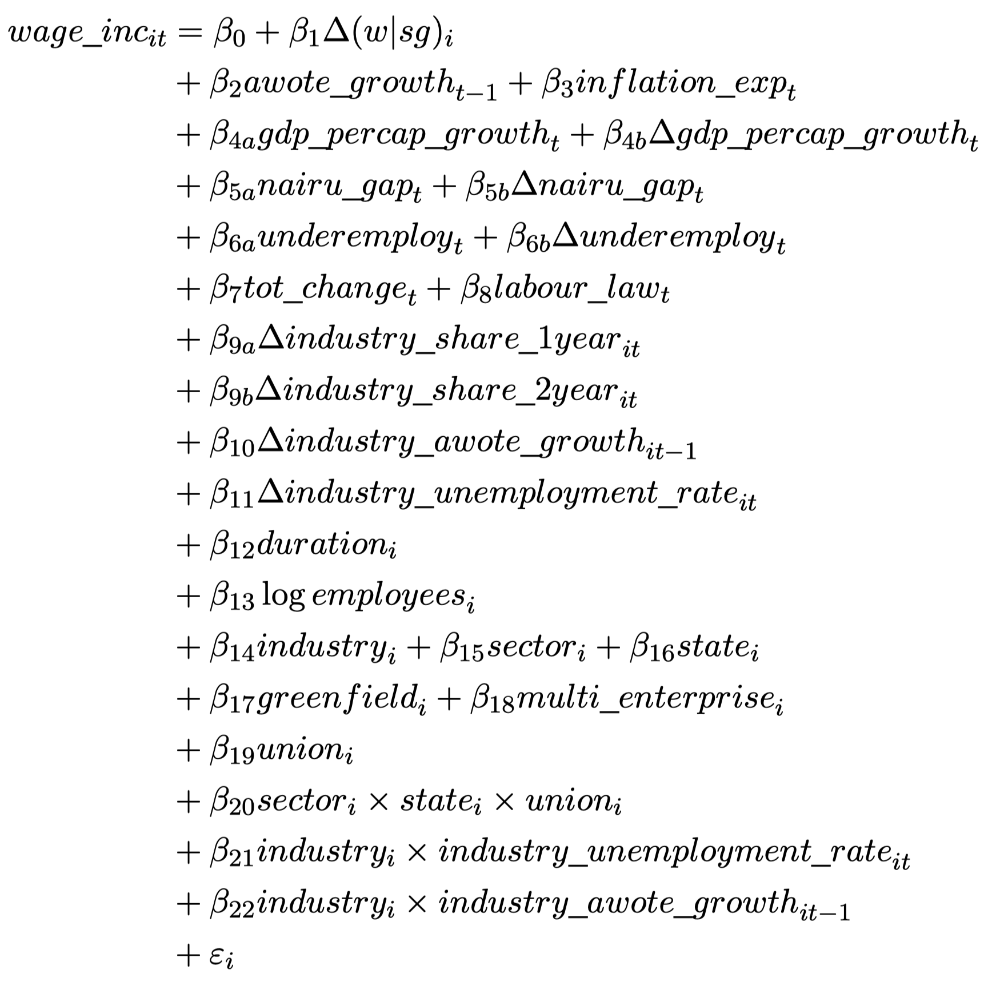]
]

---

.pull-left[
- Most of the cost of higher compulsory super comes from lower growth in workers wages.

- Coefficient on $\Delta (w|sg)$ is .orange[0.805] in our preferred specification (Model 3).

- Consistent results from simple to more complex models. 

- Heteroskedastic-corrected errors.

- Adjusted R2 of 0.479. 

]

.pull-right[
.center[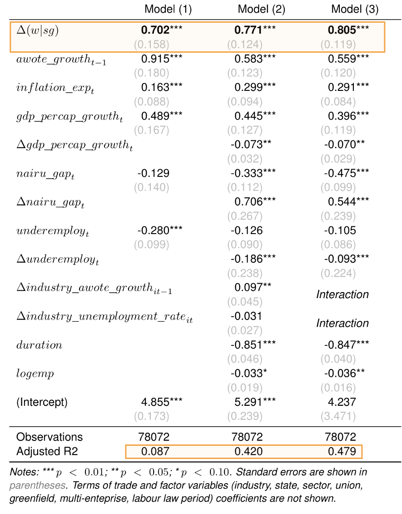]
]

---

.pull-left[

<br><br><br>
 
- Model (1) allows for neater interpretation of economic variables.

- .purple[Economic variables make sense].

]

.pull-right[
.center[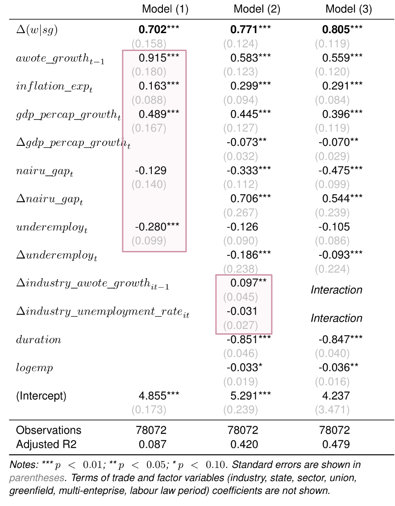]
]

---

.pull-left[

<br><br><br><br><br><br>

- Collinearity leads to some .red[unexpected results] in more complex model (2).

- Would have a different study design if these were variables of interest.

]

.pull-right[
.center[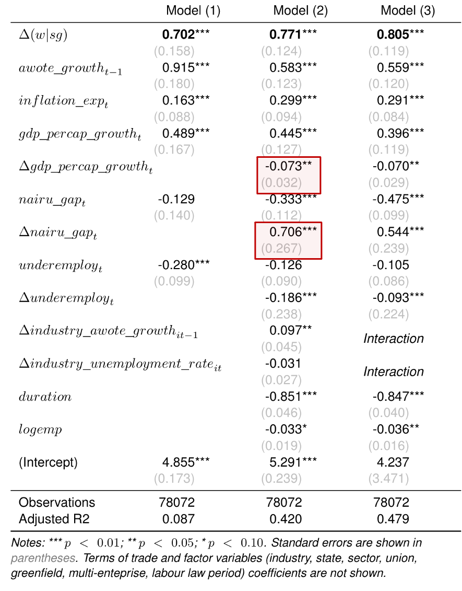]
]


---

# Diagnostics

.pull-left[
- `plot(model)`! 

- Can generate custom (nicer-looking) diagnostics plots for reports etc.
]

.pull-right[
.center[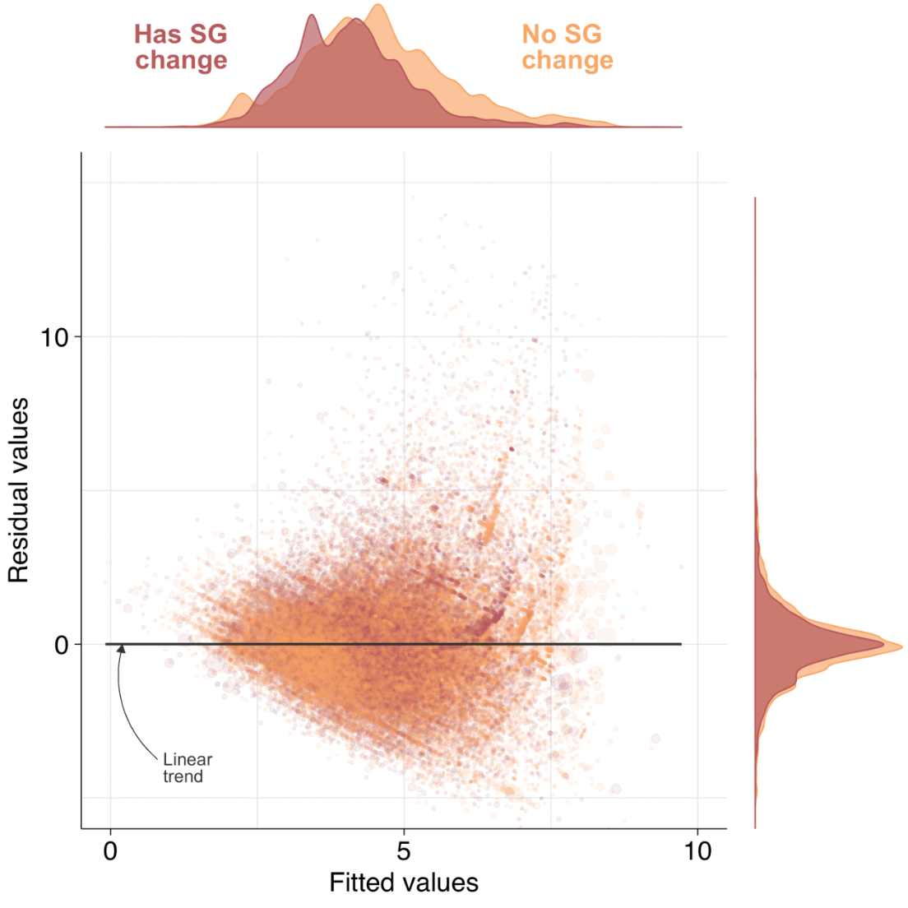]
]

---

# Causality?

.pull-left[
- Is there any systematic bias in super-change and non-super-change years?
- Doesn't look like it.
- What could make a causal interpretation of this result problematic?
- What might justify it?
]

.pull-right[
.center[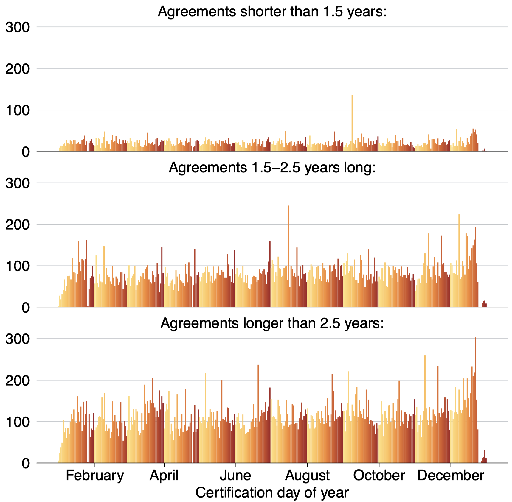]
]

---

# Robustness

- Model (3) is run with different covariates, different weighting, over different periods.

--

.pull-left[
.center[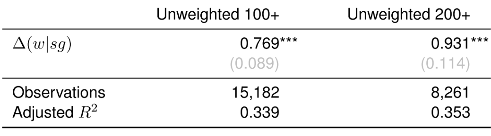]
]

.pull-right[
.center[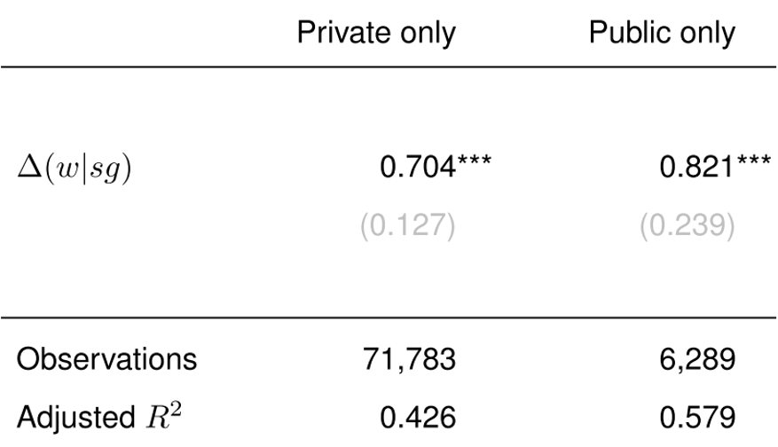]
]

---

# Robustness

- Model (3) is run with different covariates, different weighting, over different periods.

--

.pull-left[
.center[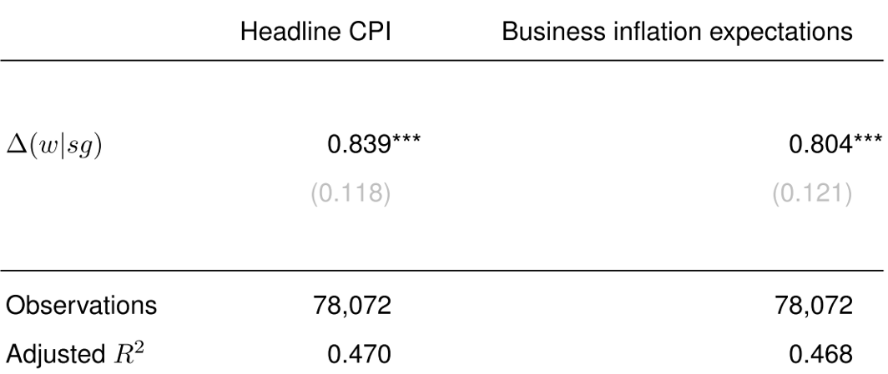]
]

.pull-right[
.center[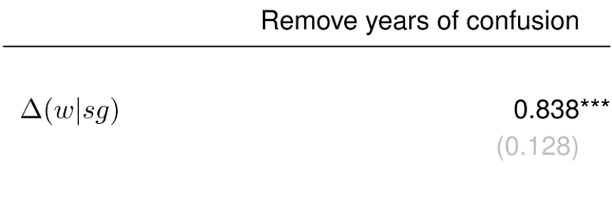]
]

---

# Robustness

- Model (3) is run with different covariates, different weighting, over different periods.

--

.pull-left[
.center[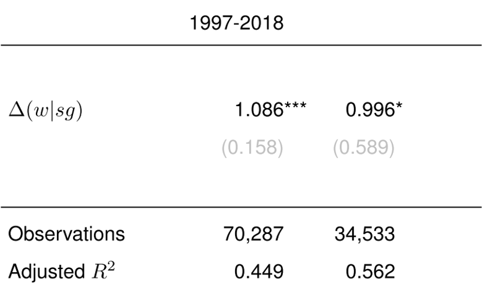]
]

.pull-right[
]


---


# Interpretation

- There is strong evidence of the superannuation guarantee being passed-through to workers covered by EBAs in the form of lower wage growth over the life of their agreement. 

- This is the short-to-medium term. 

- Our model can't capture longer-term pass-through.

- If a change to the SG leads to lower wage growth in future EBAs, our model will classify this change as being unrelated to the SG. 

- The coefficient of `0.805` is a lower-bound estimate over the longer term.


---

# Summary

.w-60[
* we went deep on the superannuation guarantee
* we found, cleaned and joined data from a range of sources
* we got inside the heads decision-makers
* we modelled wage growth to inform policy-makers
* and we did it all with relatively simple methods and publicly-available data

.info-box[
* Read Chapter 3 of [Coates, Mackey & Cowgill (2020) No free lunch: higher super means lower wages *Grattan Institute*. ](https://grattan.edu.au/wp-content/uploads/2020/02/No-free-lunch-Higher-superannuation-means-lower-wages.pdf) for a more detailed explanation of this empirical strategy.

* Read Sections 13.1 - 13.4 of [R for Data Science](https://r4ds.had.co.nz/relational-data.html).
]
]

---

```{r endslide, child="assets/endslide.Rmd"}
```


