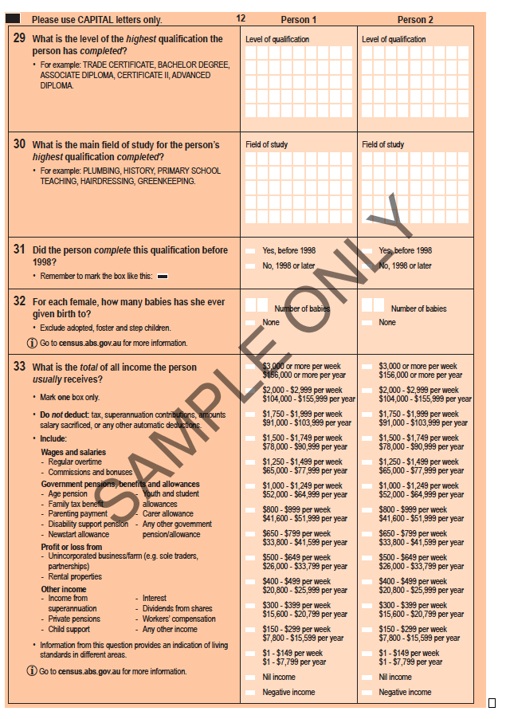
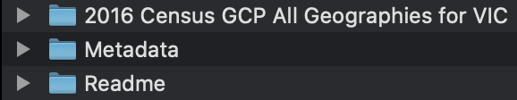

```{r titleslide, child="components/titleslide.Rmd"}
```

---

class: refresher middle 

# What is wild-caught data?

--

Data from the source

---

class: motivator middle

.info-box[
**Population** is the whole set of units (such as people, animal, place etc) to which the question or experiment pertains to.


**Sample** is a subset of population that (hopefully) represents the population.
]

Which of below is likely to be a sample or population?

1. Bla bla
1. Bla bla 


---

# Australian Bureau of Statistics (ABS) 

<div class="grid" style="grid: 1fr / 2fr 1fr;">

.item[
*  ABS is the independent statistical agency of the Government of Australia
* ABS provides key statistics on a wide range of economic, population, environmental and social issues, to assist and encourage informed decision making, research and discussion within governments and the community
]
.item.center[

]

</div>


---

# ABS Census Data

.grid[
.item[
* First Australian census was held in 1911. 
* Since 1961, the census occurs every 5 years in Australia.
* The last census was in 2016 and the next census will be held in 2021.
]
.item.center[



]]

---


class: motivator middle

# Aim

This lecture we are interested in extracting and studying the .yellow[**personal income data**] from the 2016 Australian census.


---


class: transition middle

# Get ABS Data at 

## https://datapacks.censusdata.abs.gov.au/datapacks/


---

class: center


---

# Navigating wild-caught data

* First, pray hard that there is some description!

<center>

</center>

--

Without some description or understanding of the variables, it will be near impossible to extract meaningful information from the data. 

---

# Navigating wild-caught data




* Readme is a good place to start here (phew!)

<blockquote>
"About DataPacks_readme.md - "Read Me" documentation containing helpful information for users about the data and how it is structured (.md)"
</blockquote>

* *But there is no `DataPacks_readme.md`??*

---

# Navigating wild-caught data


* There is no `DataPacks_readme.md` but there is .monash-blue[`AboutDatapacks_readme.txt`].

<center>

</center>

--

Okay but it's not helpful in locating the income data. 

We can try going through other files in the Readme.


---

# Navigating wild-caught data


We could also try going through the meta-data.


---

# Election Data


---

# Exploring Election and Census Data

* `eechidna` (Exploring Election and Census Highly Informative Data Nationally for Australia) provides data from the Australian Federal elections from 2001-2019 and census information from 2001-2016.

---


```{r endslide, child="components/endslide.Rmd"}
```
