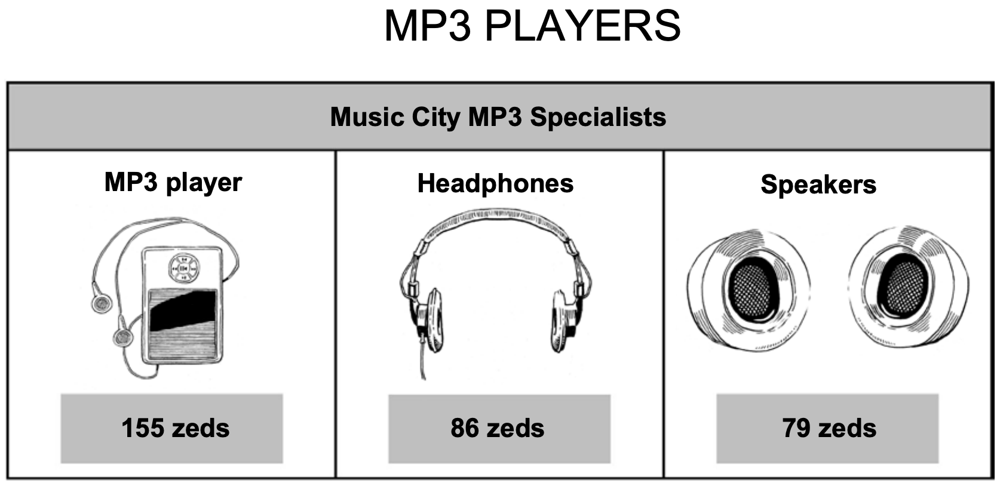
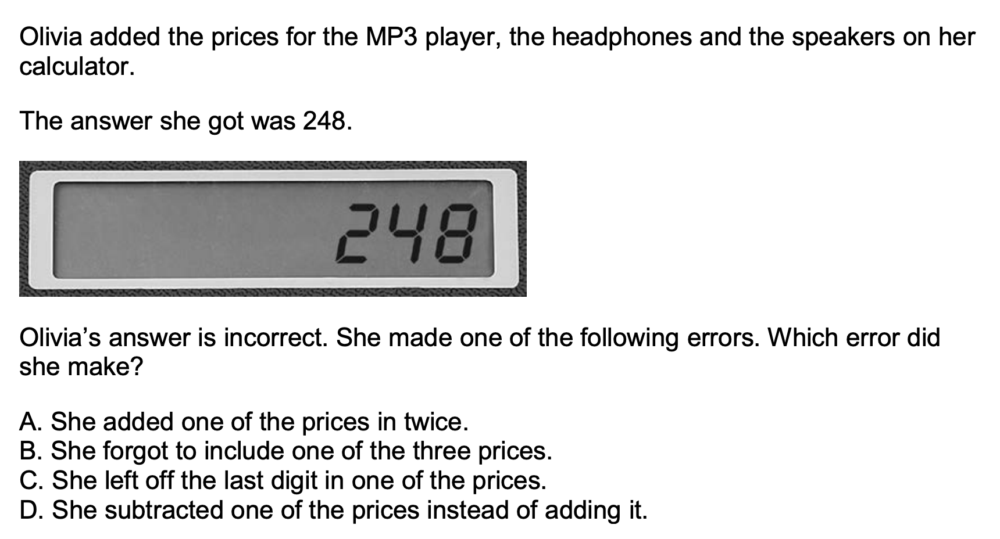
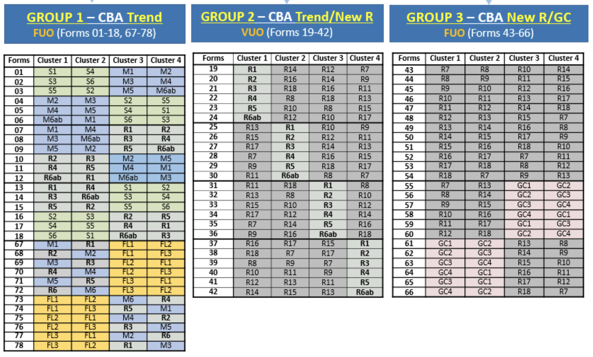
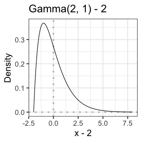

```{r titleslide, child="components/titleslide.Rmd"}
```
```{r setup, include = FALSE}
library(tidyverse)
library(haven)
filter <- dplyr::filter
knitr::opts_chunk$set(
  fig.path = "images/"
)
```


---

# What is .yellow[PISA]?

* The Programme for International Student Assessment (PISA) is a 	triennial	survey 	conducted	by the	 Organization	for	Economic	Cooperation	and	Development	(OECD)	on  assessment measuring 15-year-old student performances in .monash-blue[reading], .monash-blue[mathematics] and .monash-blue[science].
* The	goal	of	the	PISA	 survey	is	to	assess	the	workforce	readiness	of	15-year	old	students and used as a global metric for	quality,	equity	and	efficiency	in	school	education.
* In 2018, PISA involved 79 countries and economies with assessment of about 600,000 students worldwide as a sample of 32 million 15-year olds in school.
* One domain is tested in detail for every PISA. In 2018, this was *reading* with mathematics and science as minor areas of assessment.
* Read more about the Programme [here](http://www.oecd.org/pisa/aboutpisa/).

---

class: wider

# PISA 2018 Assessment and Analytical Framework

* **Reading literacy** is defined as students’ capacity to understand, use, evaluate, reflect on and engage with texts in order to achieve one’s goals, develop one’s knowledge and potential, and participate in society.

* **Mathematics literacy** is defined as students’ capacity to formulate, employ and interpret mathematics in a variety of contexts. It includes reasoning mathematically and using mathematical concepts, procedures, facts and tools to describe, explain and predict phenomena.

* **Science literacy** is defined as the ability to engage with science-related issues, and with the ideas of science, as a reflective citizen. A scientifically literate person is willing to engage in reasoned discourse about science and technology, which requires the competencies to explain phenomena scientifically, evaluate and design scientific enquiry, and interpret data and evidence scientifically.


---

# PISA 2018 Assessment 

.grid[

.item.bg-gray[

* Assessments are mostly computer-based that lasts a total of 2 hours. 
* The questions comprise a mixture of multiple choice and free entry.
* Different students may have different set of questions.
* Reading was tested for 1 hour and other topics for the remaining 1 hour. 
* You can find an example of the test questions [here](https://www.oecd.org/pisa/test/).


]

.item[

<center>


</center>

]


]


---

class: transition middle 

# Download the data from 

http://www.oecd.org/pisa/data/2018database/

<br>
> SPSS (TM) Data Files (compressed)


> Student questionnaire data file 


* The file is 494 MB so it will take a while to download. 
* Keep a local copy for later use. 

---

class: font_small wider

# Data in .yellow[proprietary formats]

* The PISA data are provided in proprietary formats (SAS and SPSS).
* This means that the data are stored in a particular encoding scheme, designed  so that decoding and reading the data is accomplished by particular software or hardware.
* In R, you can use the `haven` package to import the PISA data.


```{r pisa2018, cache = TRUE, cache.lazy = FALSE, eval = FALSE}
library(tidyverse)
library(haven)
pisa2018 <- read_sav(here::here("data", "CY07_MSU_STU_QQQ.sav")) %>% 
                as_factor()  # swap code and labels for labelled factors
dim(pisa2018)
```
```{r save-pisa2018, include = FALSE, eval = FALSE}
pisa2018_dim <- dim(pisa2018)
saveRDS(pisa2018_dim, file = here::here("data", "pisa2018_dim.rds"))
pisa2018 %>% 
  select(CNT, ST003D02T, ST003D03T, ST004D01T, BOOKID, PV1MATH:PV10SCIE, SENWT) %>% 
  saveRDS(file = here::here("data", "pisa2018.rds"))
```
```{r load-pisa2018, echo = FALSE, message = FALSE}
library(tidyverse)
library(haven)
pisa2018_dim <- readRDS(here::here("data", "pisa2018_dim.rds"))
pisa2018 <- readRDS(here::here("data", "pisa2018.rds"))
pisa2018_dim
```


* Since the data is big, it will take a while to read the data in.
* Every row corresponds to a student.

---

class: font_smaller 

# Domain assessment scores

* `PV1MATH` = Plausible Value 1 in Mathematics
* `PV1READ` = Plausible Value 1 in Reading
* `PV1SCIE` = Plausible Value 1 in Science


.grid[
.item[

```{r math-scores, eval = FALSE, cache = TRUE}
pisa2018 %>% 
  select(PV1MATH:PV10MATH) %>% 
  pivot_longer(PV1MATH:PV10MATH, 
               names_to = "Number", 
               values_to = "Value") %>% 
  # reorder factor so it is PV1MATH, ..., PV10MATH
  mutate(Number = fct_reorder(Number, Number, 
         function(x) unique(parse_number(x)))) %>% 
  ggplot(aes(x = Value, y = Number)) + 
  labs(y = "") + 
  ggridges::geom_density_ridges() +  
    theme_classic(base_size = 18)
```
]


.item[
```{r math-scores, echo = FALSE, warning = FALSE, message = FALSE, fig.height = 5.5, fig.width = 6}
```
.center[
Perfect bell curves!
]]]

---

# Domain score distribution by plausible value number


.grid[
.item[

* Wait... is it too perfect?
* There are no outliers or unusual characteristics for the values.
* Also why are there 10 values?

]


.item[
```{r pisa2018-dist, cache = TRUE, echo = FALSE, warning = FALSE, message = FALSE, fig.height = 6, fig.width = 11.8}

pisa2018 %>% 
  select(PV1MATH:PV10SCIE) %>% 
  pivot_longer(PV1MATH:PV10SCIE, 
               names_to = "Number", 
               values_to = "Value") %>% 
  mutate(
    Subject = case_when(
      str_detect(Number, "PV[0-9]*MATH") ~ "Mathematics",
      str_detect(Number, "PV[0-9]*READ") ~ "Reading",
      str_detect(Number, "PV[0-9]*SCIE") ~ "Science"
    ),
    Number = paste0("PV", parse_number(Number))) %>% 
  mutate(Number = fct_reorder(Number, Number, 
         function(x) unique(parse_number(x)))) %>% 
  ggplot(aes(x = Value, y = Number)) + 
  labs(y = "") + 
  ggridges::geom_density_ridges() +  
    theme_classic(base_size = 18) + 
    facet_grid( . ~ Subject)

```
]]


---

class: wider

# What are "plausible values"?

* School assessments are typically concerned with accurately assessing **individual performance** for the purpose of *diagnosis*, *selection* or *ranking*.
* The goal of PISA is to compare the skills and knowledge of 15-year-old students across countries and economies.
* PISA supplies data for individual students but the assessment values are *not* raw data. 
* The raw data are first quality checked and then used for **scaling** and **population modelling**. 
* In brief, the **plausible values are generated from a model** that *capture sub-population or population characteristics*. 
* Hence why the PISA data do not display individual characteristics. 
* Thus PISA data should not be used to make precise inferences about individuals' domain performances.

---

# Brief technical explanation of "plausible values"

1. *Item response theory scaling* of the cognitive responses estimates the item parameters that provide comparable latent scales across countries and cycles for each domain 
2. *Multivariate latent regression* is fitted using item parameters estimates from 1.
3. For each student and each domain, *10 plausible values are drawn from posterior distribution* using the estimated model parameters in 2. 


* This is the gist of how the values are generated but the *technical details are beyond the scope of this course*.
* For those interested, you can find detailed technical explanation from [PISA 2018 Technical Report Chapter 9 Scaling PISA Data](http://www.oecd.org/pisa/data/pisa2018technicalreport/Ch.09-Scaling-PISA-Data.pdf).


---

background-image: url("images/pisa-data-workflow.jpg")
background-size: 100%

# PISA Data Management

.bottom_abs.font_small.width100[
Diagram from [PISA 2018 Technical Report Chapter 10 Data Management](http://www.oecd.org/pisa/data/pisa2018technicalreport/PISA2018%20TecReport-Ch-10-Data-Management.pdf)
]


---

class: middle transition

# Examining the gender gap across countries

This section is based on [upcoming book by Hofmann, Cook, Vanderplas and Wang](https://github.com/heike/data-technologies).


---

class: font_small wider

# Are girls worse in maths than boys?

* The gender gap in mathematics is a common discussion, with the concern being that girls tend to score lower than boys on average in standardized math tests. 
* The PISA data provides an opportunity to explore the gender gap across numerous countries.
* In the `pisa2018` data, the sex of the student is in variable `ST004D01T` and the country/region is in variable `CNT`. 
* Let's rename these to sensible names, e.g. `sex` and `country`.
* We'll also modify some country names so that it can be joined with the map data later.
* We will focus on using `PV1MATH` and will not cover any analysis that require us to use all 10 plausible values in this course.

---

class: font_smaller

# Code to clean PISA data

```{r clean-pisa}
pisa2018c <- pisa2018 %>% 
  rename(sex = ST004D01T, country = CNT) %>% 
  filter(!is.na(sex)) %>% # filter two Canadian students where sex is missing
  filter(!is.na(PV1MATH)) %>%  # Vietnam is missing scores
  mutate(country = case_when(
    country == "Brunei Darussalam" ~ "Brunei",
    country == "United Kingdom" ~ "UK",
    country %in% c("Hong Kong", "B-S-J-Z (China)") ~ "China",
    country == "Korea" ~ "South Korea",
    country == "North Macedonia" ~ "Macedonia",
    country == "Baku (Azerbaijan)" ~ "Baku",
    country %in% c("Moscow Region (RUS)", "Tatarstan (RUS)", 
                   "Russian Federation") ~ "Russia",
    country == "Slovak Republic" ~ "Slovakia",
    country == "Chinese Taipei" ~ "Taiwan",
    country == "United States" ~ "USA", 
    TRUE ~ as.character(country)))
```

---

class: font_smaller

# <i class="fas fa-exclamation-triangle"></i> Plot 1: Gender difference in math scores by country


.grid[
.item[

```{r plot1, eval = FALSE}
pisa2018c %>% 
  group_by(sex, country) %>% 
  summarise(avg = mean(PV1MATH)) %>% 
  ungroup() %>% 
  pivot_wider(country, names_from = sex, 
              values_from = avg) %>% 
  mutate(diff = Female - Male,
         country = fct_reorder(country, diff)) %>% 
  ggplot(aes(x = diff, y = country)) + 
  geom_point() + 
  geom_vline(xintercept = 0, color = "red") + 
  labs(y = "Country", 
       x = "Difference in mean PV1 (girl - boy)") + 
  theme_bw(base_size = 14)
```

{{content}}

]
.item[
```{r plot1, echo = FALSE, warning = FALSE, fig.height = 8.3}
```

]]

--

* But wait how is the data collected?

---

class: wider

# Assessment Design

.font_small[Sourced from [PISA 2018 Integratated Design](https://www.oecd.org/pisa/pisaproducts/PISA-2018-INTEGRATED-DESIGN.pdf).] Scroll down to see more information.

.scroll-900[




* R1-R18 are Reading clusters
* M1-M6ab are Math clusters
* S1-S6 are Science clusters
* GC1-GC4 are Global Competence clusters
* FL1-FL3 are Financial Literacy clusters

<br><br><br><br><br><br>

]

---

class: font_small

# Interrogating the data

* So students who have `BOOKID` as Form 1-12 or 67-78 would have had mathematics component in their test.

.grid[.item[


```{r interrogate}
pisa2018 %>% 
  filter(BOOKID == "Form 13") %>% 
  select(CNT, ST004D01T, BOOKID, PV1MATH)
```

]
.item[

{{content}}

]]

--

* But there is a mathematics score for students who did not even sit a test with mathematics component!
* You will compare the math gender gap with all students vs. the subset of students who did sit the mathematics component during the tutorial `r emo::ji("wrench")` 


---

class: wider

# Sample survey data 


* PISA data is collected from a complex multi-stage design which results in *different* inclusion probabilities of certain student/school characteristics.
* For example, in Australia, all indigeneous students (the minority group) are asked to participate.
* PISA data comes with two sets of weights: 
  * Final student weights (`W_FSTUWT`). These scale the sample up to the size of the population within each country. If the unit of interest is the population of students within subset of countries, use this. 
  * Senate weights (`SENWT`). These weights sum up to the same constant value, therefore each country will contribute equally to the analysis. If the unit of interest is the countries then use this. 
* Without applying weights, students or schools with particular characteristics may be either under/over represented within the analysis.

.font_small.width100.bottom_abs[
Jerrim et al. (2017) “What Happens When Econometrics and Psychometrics Collide? An Example Using the PISA Data.” Economics of Education Review 61 (December): 51–58.
]


---

class: wider

# Why accounting for sampling weights is important


```{r why-weights, echo = FALSE}
male <- "<td><i class='fas fa-male'></i></td>"
female <- "<td><i class='fas fa-female'></i></td>"
sel_male <- "<td><i class='fas fa-male blue'></i></td>"
sel_female <- "<td><i class='fas fa-female purple'></i></td>"
set.seed(4)
boy_num_scores <- sample(0:9, size = 20, replace = T)
boy_scores <- paste0("<td>", boy_num_scores, "</td>")

male_lineup1 <- sample(rep(c(male, sel_male), times = c(20 - 5, 5)))
female_lineup1 <- sample(rep(c(female, sel_female), times = c(3, 1)))

male_lineup2 <- sample(rep(c(male, sel_male), times = c(20 - 3, 3)))
female_lineup2 <- sample(rep(c(female, sel_female), times = c(1, 3)))


# generate girl scores such that first 3 chosen randomly
# but last one chosen so that the average score by girls
# is roughly the same as average score as boys  + 5
# of course you can get a number greater than > 9
# or even negative here... just change seed number till
# you get what you want
girl_num_scores <- sample(4:9, size = 3, replace = T)
girl_num_scores <- c(girl_num_scores, 5 + round(4 * mean(boy_num_scores) - sum(girl_num_scores)))
girl_scores <- paste0("<td>", girl_num_scores, "</td>")


avg_boy1 <- mean(boy_num_scores[str_detect(male_lineup1, "blue")])
avg_boy2 <- mean(boy_num_scores[str_detect(male_lineup2, "blue")])
avg1 <- mean(c(boy_num_scores[str_detect(male_lineup1, "blue")],
               girl_num_scores[str_detect(female_lineup1, "purple")]))
avg2 <- mean(c(boy_num_scores[str_detect(male_lineup2, "blue")],
               girl_num_scores[str_detect(female_lineup2, "purple")]))
avg_girl1 <- mean(girl_num_scores[str_detect(female_lineup1, "purple")])
avg_girl2 <- mean(girl_num_scores[str_detect(female_lineup2, "purple")])

```

* Suppose we have a class of 24 students with 20 boys and 4 girls. 

<center>
<table style="width:70%; font-size: 24pt;">
<tr>`r paste(c(rep(male, 20), rep(female, 4)), collapse= "")`</tr>
<tr>`r paste(c(boy_scores, girl_scores), collapse= "")`</tr>
</table>
</center>

The population average of this class is .green[`r round(mean(c(boy_num_scores, girl_num_scores)), 2)`] with .blue[`r mean(boy_num_scores)`] for boys and .purple[`r mean(girl_num_scores)`] for girls.


---

count: false
class: wider

# Why accounting for sampling weights is important

* Suppose we have a class of 24 students with 20 boys and 4 girls. 

<center>
<table style="width:70%; font-size: 24pt;">
<tr>`r paste(c(male_lineup1, female_lineup1), collapse= "")`</tr>
<tr>`r paste(c(boy_scores, girl_scores), collapse= "")`</tr>
</table>
</center>

The population average of this class is .green[`r round(mean(c(boy_num_scores, girl_num_scores)), 2)`] with .blue[`r mean(boy_num_scores)`] for boys and .purple[`r mean(girl_num_scores)`] for girls.

* If we randomly select 6 students to participate in the survey, we expect 5 boys and 1 girl on average (Selected boys are `r which(str_detect(male_lineup1, "blue"))` and girl is `r which(str_detect(female_lineup1, "purple"))`). The sample average score of selected boys is .blue[`r avg_boy1`] and girls is .purple[`r avg_girl1`], and total sample average is .green[`r round(avg1, 2)`].


---

count: false
class: wider

# Why accounting for sampling weights is important

* Suppose we have a class of 24 students with 20 boys and 4 girls. 

<center>
<table style="width:70%; font-size: 24pt;">
<tr>`r paste(c(male_lineup2, female_lineup2), collapse= "")`</tr>
<tr>`r paste(c(boy_scores, girl_scores), collapse= "")`</tr>
</table>
</center>

The population average of this class is .green[`r round(mean(c(boy_num_scores, girl_num_scores)), 2)`] with .blue[`r mean(boy_num_scores)`] for boys and .purple[`r mean(girl_num_scores)`] for girls.

* If we randomly select 6 students to participate in the survey, we expect 5 boys and 1 girl on average (Selected boys are `r which(str_detect(male_lineup1, "blue"))` and girl is `r which(str_detect(female_lineup1, "purple"))`). The sample average score of selected boys is .blue[`r avg_boy1`] and girls is .purple[`r avg_girl1`], and total average is .green[`r round(avg1, 2)`].


* But having equal number of boys and girls in the survey is important then the inclusion probability for a boy is 3/20 while for a girl is 3/4. (Now say selected boys are `r which(str_detect(male_lineup2, "blue"))` and girls are `r which(str_detect(female_lineup2, "purple"))`). The sample average score of selected boys is .blue[`r avg_boy2`] and girls is .purple[`r round(avg_girl2, 2)`], and total sample average is .green[`r round(avg2, 2)`].

--


* The sample average score (.green[`r round(avg2, 2)`]) is higher than it should be due to over-representation of the girls in the sample. 

---

class: wider

# Taking into weights into account

* In this case, the sampling weights are the inverse of the inclusion probability (20/3 for boys and 4/3 for girls).
   
* A weighted mean, $\hat{\mu}$, for values $x_1, ..., x_n$ with corresponding weights $w_1, ..., w_n$ is computed as 

$$\hat{\mu} = \dfrac{1}{\sum_{i=1}^nw_i}\sum_{i=1}^n w_ix_i.$$

* So the class population mean can be estimated as  $\dfrac{20 / 3 \times  `r avg_boy2` + 4/3 \times `r avg_girl2`}{20/3 + 4/3} = `r (20/3 * avg_boy2 + 4/3 * avg_girl2)/(24/3)`.$ <br><br>Notice that the estimate is closer to the class population mean.

* Or you can use the `weighted.mean` function in R.   


---

class: font_smaller

# <i class="fas fa-exclamation-triangle"></i> Plot 2: Gender difference in math scores by country


.grid[
.item[

```{r plot2, eval = FALSE}
mathdiff_df <- pisa2018c %>% 
  group_by(sex, country) %>% 
  summarise(math = weighted.mean(PV1MATH, 
                                 w = SENWT)) %>%  #<<
  ungroup() %>% 
  pivot_wider(country, names_from = sex, 
              values_from = math) %>% 
  mutate(diff = Female - Male,
         country = fct_reorder(country, diff)) 

ggplot(mathdiff_df, aes(x = diff, y = country)) + 
  geom_point() + 
  geom_vline(xintercept = 0, color = "red") + 
  labs(y = "Country", 
       x = "Difference in mean PV1 (girl - boy)") + 
  theme_bw(base_size = 14)
```

]
.item[
```{r plot2, echo = FALSE, warning = FALSE, fig.height = 8.3}
```

]]

---

class: font_smaller

# <i class="fas fa-globe"></i> Mapping the math score differences by gender


```{r map1, warning = FALSE, fig.height = 6, fig.width = 11, fig.align="center"}
map_data("world") %>% # function from ggplot2
  left_join(mathdiff_df, by = c("region" = "country")) %>% 
  ggplot(aes(long, lat, group = group, fill = diff)) + 
   geom_polygon(color = "black") + theme_void(base_size = 18) +
      scale_fill_gradient2("Math Gap", na.value="grey90",
                         low="#1B9E77", high="#D95F02", mid="white") 
```


---

class: transition middle

# Bootstrap for estimating variance

---

# <i class="fas fa-exclamation-triangle"></i> Caution point estimates

.grid[.item[

```{r plot2, echo = FALSE, fig.align = "center", fig.height = 8}
```
]
.item[

* Non-zero point estimate does not mean that there is a *significant* difference in performance for mathematics by gender!
* There is uncertainty for every estimate (and prediction).
* The plot we saw before will be more useful if we plot the error bar, that represents the uncertainty, for each point estimate.
* But how do we calculate this uncertainty?


]]

---

# Bootstrap to measure uncertainty

* Bootstrap is a technique that uses **random sampling with replacement** of data to obtain properties of an estimator.
* Bootstrap is relatively **simple to apply**.
* Bootstrap can be **computationally expensive** as it requires a large number of times for the process to be applied (we will do 100 times but at least 200 times is recommended).
* In bootstrapping, it is assumed that the **observations are independent (or independent within blocks)**.
* For assessing the gender gap in mathematics scores across countries, we will be *resampling within country and gender*. 
* The resampling process should generate data with the same number of observations as the original data.

---

class: wider font_small

# Bootstrap using R: Part 1

There are a number of ways of doing this in R but we will use `sample_n` function in `dplyr` `r emo::ji("package")`. 

```{r boot-eg}
set.seed(2020) # for reproducibility
boot_sample1 <- pisa2018c %>% 
  group_by(country, sex) %>% 
  sample_n(size = n(), replace = TRUE)
```

We can then treat `boot_sample1` as we did before to obtain another set of estimates for the gender gap for mathematics score by country. 

```{r boot-sample1, include = FALSE}
boot_sample1 %>%
  summarise(avg = weighted.mean(PV1MATH, SENWT)) %>% 
  ungroup() %>% 
  pivot_wider(country, names_from = sex, values_from = avg) %>% 
  mutate(diff = Female - Male, country = fct_reorder(country, diff))
```

```{r flair1, echo = FALSE}
library(flair)
decorate("boot-sample1") %>% 
  flair("boot_sample1")
```

---

class: wider font_small

# Bootstrap using R: Part 2

* We need to repeat this process a reasonable number of times. 
* We will do 100 times. 
* To make this process easier, we will use the `map_dfr` function from `purrr` `r emo::ji("package")`.

```{r boot-repeat, include = FALSE, cache = TRUE}
boot_ests <- map_dfr(1:100, ~{
    pisa2018c %>% 
      group_by(country, sex) %>% 
      sample_n(size = n(), replace = TRUE) %>% 
      summarise(avg = weighted.mean(PV1MATH, SENWT)) %>% 
      ungroup() %>% 
      pivot_wider(country, names_from = sex, values_from = avg) %>% 
      mutate(diff = Female - Male, country = fct_reorder(country, diff)) %>% 
      mutate(boot_id = .x)
  })
```
```{r flair2, echo = FALSE}
decorate("boot-repeat") %>% 
  flair(".x")
```

* The `.x` is substituted from an element from the first argument in `map_dfr`.

---

class: font_small

# Bootstrap using R: Part 3

* We obtain a 90% confidence interval of mean differences by gender in mathematics score for each country by taking the 5% and 95% quantiles from the bootstrap estimates. 
* There are many other ways to do this. Week 8 lab solution will show a different way.

```{r bootdata, warning = FALSE}
mathdiff2_df <- boot_ests %>% 
  group_by(country) %>% 
  summarise(lower = sort(diff)[5], 
            upper = sort(diff)[95]) %>% 
  left_join(mathdiff_df, by = "country") %>% 
  mutate(country = fct_reorder(country, diff))
```


---

class: font_small

# <i class="fas fa-smile"></i> Plot 3: Gender difference in math scores by country


.grid[.item[

* A better plot is then to draw this 90% confidence interval on the plot.

```{r plot3, eval = FALSE}
ggplot(mathdiff2_df, aes(diff, country)) + 
  geom_point() + 
  geom_errorbar(aes(xmin = lower,  #<<
                    xmax = upper)) + #<<
  geom_vline(xintercept = 0, color = "red") + 
  labs(y = "Country", 
       x = "Difference in mean PV1 (girl - boy)") + 
  theme_bw(base_size = 14)
```

]
.item[

```{r plot3, echo = FALSE, warning = FALSE, fig.width = 5.5, fig.height = 8}
```

]]


---

class: transition middle

# Simulated data 

---

class: wider

# "Real" and "Fake" Data

.info-box[
* **Real data** are data where observations are direct measurements from real-world phenomena.
* **Synthetic data** are data where observations are artificially generated with similar statistical properties to the real data.
* **Simulated data** are data where observations (and covariates) are simulated from a model. 
]

* Data by default are assumed to be "real" so there is generally no need to explicitly refer data as real data. 
* The terms synthetic and simulated data may be used interchangeably in some literature. Synthetic data may be simulated data and vice versa.
* The purpose of simulated data is to often study a statistical method and is commonly used in statistical literature (both in teaching and research). 


---

class: wider font_small

# Data Generating Process: Simple Linear Model 

* Unlike typical data, the **data generating process is _known_** for simulated data.
* For example, we can generate a set of observation that is only linearly dependent on an independent continuous variable. 
* Mathematically, the data generating process is a simple linear model:
$$\color{blue}{y_{i}} = \color{red}{\beta_0} + \color{red}{\beta_1}\color{blue}{x_i} + e_{i},$$
where for $i = 1, ..., n$, $y_i$ is the $i$-th response, $x_i$ is the corresponding covariate, $e_i$ is a random error, $\beta_0$ is the intercept and $\beta_1$ is the slope. 
* Typically we assume that $e_i$s are independent and $e_i \sim N(0, \sigma^2)$.
* In practice, we only .blue[observe] those colored in blue and we .red[estimate] those colored in red (for simplicity assuming the data generating process is known but the model parameters are unknown). 

---

class: wider font_small

# Simulated Data in R: Simple Linear Model

Suppose that $n = 200$, $\beta_0 = 3$, $\beta_1 = -2$ and $\sigma^2 = 1$.

```{r sim1}
set.seed(2020) # for reproducibility
n <- 200 # sample size
b0 <- 3  # intercept
b1 <- -2 # slope
sim_df <- tibble(id = 1:n) %>%  # initialise data set
    mutate(x = runif(n(), 0, 10), # draw x from Uniform[0,10]
           y = b0 + b1 * x + rnorm(n(), 0, 1))
```

Obtain least squares estimates (or maximum likelihood estimate) for $\beta_0$ and $\beta_1$:

```{r fit1}
fit1 <- lm(y ~ x, data = sim_df)
coef(fit1)
```
The estimates are pretty close to the true values!


---

class: wider font_small

# Simulated Data in R: Simple Linear Model

* Suppose now that $e_i \sim \text{Gamma}(2, 1) - 2$. 
* How good are the estimates under least squares when the error is not normally distributed?

```{r sim2}
sim2_df <- tibble(id = 1:n) %>%  
    mutate(x = runif(n(), 0, 10), 
           y = b0 + b1 * x + rgamma(n(), 2, 1) - 2)
fit2 <- lm(y ~ x, data = sim2_df)
coef(fit2)
```

* The estimate of the slope is still good but the estimate of the intercept is not as good as before.
* In the tutorial, you will also learn to simulate data when the dependent variable is a categorical variable `r emo::ji("wrench")`

```{r gamma-dist, include = FALSE, fig.height = 4, fig.width = 4}
tibble(x = seq(0, 10, by = 0.05)) %>% 
  mutate(y = dgamma(x, 2, 1)) %>% 
  ggplot(aes(x - 2, y)) + 
    geom_vline(xintercept = 0, linetype="dotted", size = 1.5, color = 'grey') + 
    geom_hline(yintercept = 0, linetype="dotted", size = 1.5, color = 'grey') + 
    geom_line() + theme_bw(base_size = 18) + 
  labs(y = "Density", title = "Gamma(2, 1) - 2")
```



---


class: transition middle

# Visual Inference 

---

class: font_small

# Assessing estimates based on a scatter plot

.grid[
.item[

* We could also superimpose the least squares fit onto the scatter plot. 

```{r combine2, eval = FALSE}
combined_df <- sim2_df %>% 
  mutate(sim = "Simulation 1") %>% 
  rbind(mutate(sim_df, 
               sim = "Simulation 2"))
ggplot(combined_df, aes(x, y)) + 
  geom_point() + 
  geom_smooth(method = "lm", se = FALSE) + 
  facet_grid(sim ~ .) + 
  theme_bw(base_size = 18) 
```

* We could also do a formal statistical test for the slope (and intercept) but we have to validate our assumption.

]
.item[

```{r combine2, echo = FALSE, message = FALSE}
```

]]

---

class: font_small

# Assessing model assumption based on the residual plot


.grid[
.item[

* We assume that $e_i \sim N(0, \sigma^2)$.
* We assess the residual plot to check this assumption.

```{r resplot, eval = FALSE, fig.width = 3.5}
combined2_df <- combined_df %>% 
  mutate(residual = c(fit1$residuals, fit2$residuals))

ggplot(combined2_df, aes(x, residual)) + 
  geom_point() + 
  geom_hline(yintercept = 0, color = "red") + 
  facet_grid(sim ~ ., scales = "free") + 
  theme_bw(base_size = 18) 
```

* Generally, we check that there is "no pattern" in the residual plot.
* What do we mean by "no pattern"? 

]
.item[

```{r resplot, echo = FALSE, message = FALSE, fig.width = 5}
```

]]


---

class: wider font_small

# Null data


$$H_0: e_i \sim N(0, \hat{\sigma}^2)\qquad \text{vs.} \qquad H_1: \text{not }H_0$$

* $\hat{\sigma}$ is the estimate of $\sigma$ from the model fit. 

```{r sigmas}
c(summary(fit1)$sigma, summary(fit2)$sigma)
```

* We simulate observations of size $n = 200$ from $N(0, \hat{\sigma}^2)$. These are called **null data** as it is generated under the null hypothesis. 
* We draw a scatter plot with these observations against the original $x$-values. 
* We repeat this process $K = 19$ times then produce a **lineup** of the plots with the original residual plot randomly included into it. 


---

class:  font_small

# Null data using R

* The process of generating null data and lineups is facilitated by the `nullabor` `r emo::ji("package")`

```{r nullabor1, eval = FALSE}
library(nullabor)
method1 <- null_dist("residual", "norm", 
              params = 
                list(mean = 0, 
                     sd = summary(fit1)$sigma))
sim_df$residual <- fit1$residuals
null1_df <- lineup(method1, sim_df)
ggplot(null1_df, aes(x, residual)) + 
  geom_point() + 
  geom_hline(yintercept = 0, color = "red") + 
  facet_wrap(~.sample) + 
  theme_bw(base_size = 18) 
```


---

class: wider

# Line up for simulated data 1

```{r nullabor1, echo = FALSE, fig.height = 7, fig.width = 15}
```

---

class: wider

# Line up for simulated data 2

```{r nullabor2, echo = FALSE, fig.height = 7, fig.width = 15}
method2 <- null_dist("residual", "norm", 
              params = 
                list(mean = 0, 
                     sd = summary(fit2)$sigma))
sim_df$residual <- fit2$residuals
null2_df <- lineup(method2, sim_df)
ggplot(null2_df, aes(x, residual)) + 
  geom_point() + 
  geom_hline(yintercept = 0, color = "red") + 
  facet_wrap(~.sample) + 
  theme_bw(base_size = 18) 
```

---

# References

* In practice, you shouldn't show the data plot (also the test statistic in visual inference) before the lineup.
* You can read more about visual inference on the paper by [Buja et al. (2009)](https://royalsocietypublishing.org/doi/full/10.1098/rsta.2009.0120) but also one of your lecturers, Prof Di Cook, is a world leading expert on it! She is also the one of the authors of the paper, as well as, the maintainer of `nullabor` `r emo::ji("package")`.

---

```{r endslide, child="components/endslide.Rmd"}
```
