```{r titleslide, child="components/titleslide.Rmd"}
```

.footnote[Image source: https://commons.wikimedia.org/wiki/File:Another_Airplane!_(4676723312).jpg]


---
# Motivation

American Statistical Association Statistical Graphics and Computing Sections [2009 Data Expo](https://community.amstat.org/jointscsg-section/dataexpo/new-item6) provided all of the commercial flight records for airtravel in the USA from October 1987 to April 2008. 

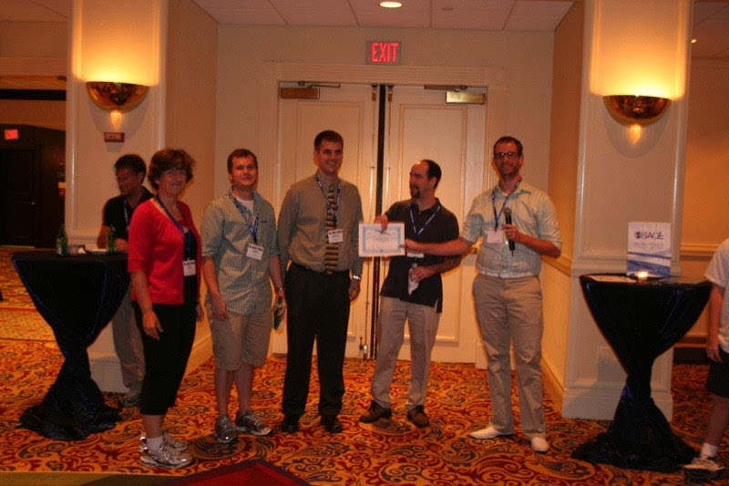

---
Questions provided

- When is the best time of day/day of week/time of year to fly to minimise delays?
--

- Do older planes suffer more delays?
--

- How does the number of people flying between different locations change over time?
--

- How well does weather predict plane delays?
--

- Can you detect cascading failures as delays in one airport create delays in others? Are there critical links in the system?
--

<br>
<br>
<br>

but participants could also decide for themselves what to analyse.
--

---

.grid2[
.item[

# About the data

]
.item[

* nearly 120 million records
* 1.6 gigabytes of space compressed
* 12 gigabytes when uncompressed

<br>
Organisers provided instructions on how to set up an .monash-orange2[**sqlite database**], and access from R.

]
]

---
# Read about accessing databases from R at

This RStudio site https://db.rstudio.com/databases/sqlite/ is a good starting place to read about working with a sqlite database.

---
# The original data source

.grid[
.item[


]
.item[
<br>
<br>

* You can find the most current data at 
 https://www.transtats.bts.gov/DataIndex.asp
* Look at the 
 "On-Time Performance 1987-present" table. 
<br>
<br>
* You can download data a month at a time
* Its about a month lag in records
* Explanations of the variables

]
]
---
# Accessing the data

- Data expo files: the data for the competition is [still available](https://community.amstat.org/jointscsg-section/dataexpo/new-item6) `r emo::ji("cartwheel")`
- Navigating the [BTS web interface](https://www.transtats.bts.gov/DataIndex.asp)
    - What data is available
    - How do you download
    - Explanations of the records and variables
- R package NYCflight13: provides a small domesticated data set.`r emo::ji("koala")` This is a good way to *dip your toes in the water* with the airline data - try this if working with the full data is too scary.  

---
class: motivator
# What did others do? First prize `r emo::ji("trophy")`

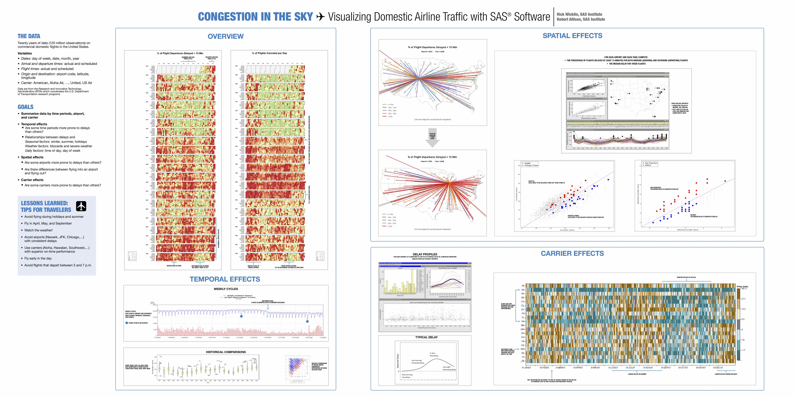

.footnote[Rick Wicklin, Robert Allison]

---
layout: true
class: shuriken-300 white 

.blade1.bg-red.content.center[
# Overview

Its good practice to show a useful view of entire data, to get a rough sense of major patterns.

]]
.blade2.bg-green[.content.vertical-rl.center[
# Temporal trend

A major component of this data is traffic patterns over time. 

]]
.blade3.bg-deep-purple[.content.center[
# Spatial pattern

Airports are distributed across the country, explore how the traffic operates relative to this geography

]]
.blade4.bg-orange[.content.vmiddle[
# Carriers 

Are some carriers operating more widely, or more efficiently?

]]
.hole.bg-black[.content.center.vmiddle[
{{content}}
]]

---

class: hide-blade2 hide-blade3 hide-blade4 hide-hole

---

class: hide-blade3 hide-blade4 hide-hole
count: false

---

class: hide-blade4 hide-hole
count: false

---
count: false

# Highlights

---
layout: false
# Overview

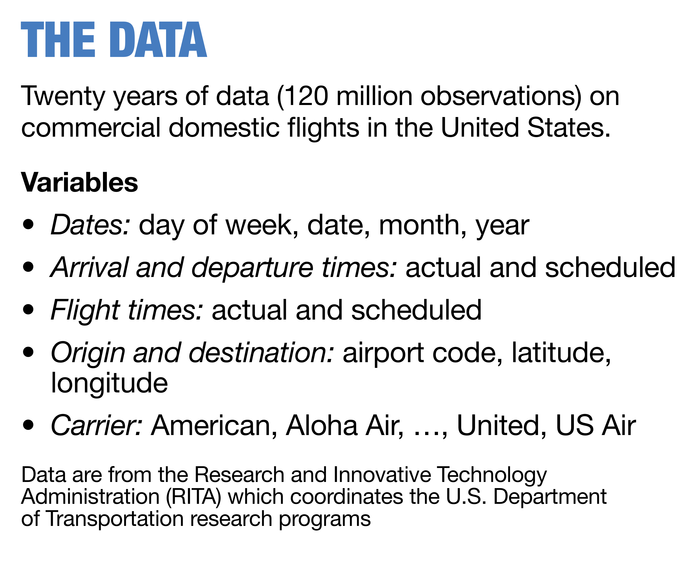

---
# Overview

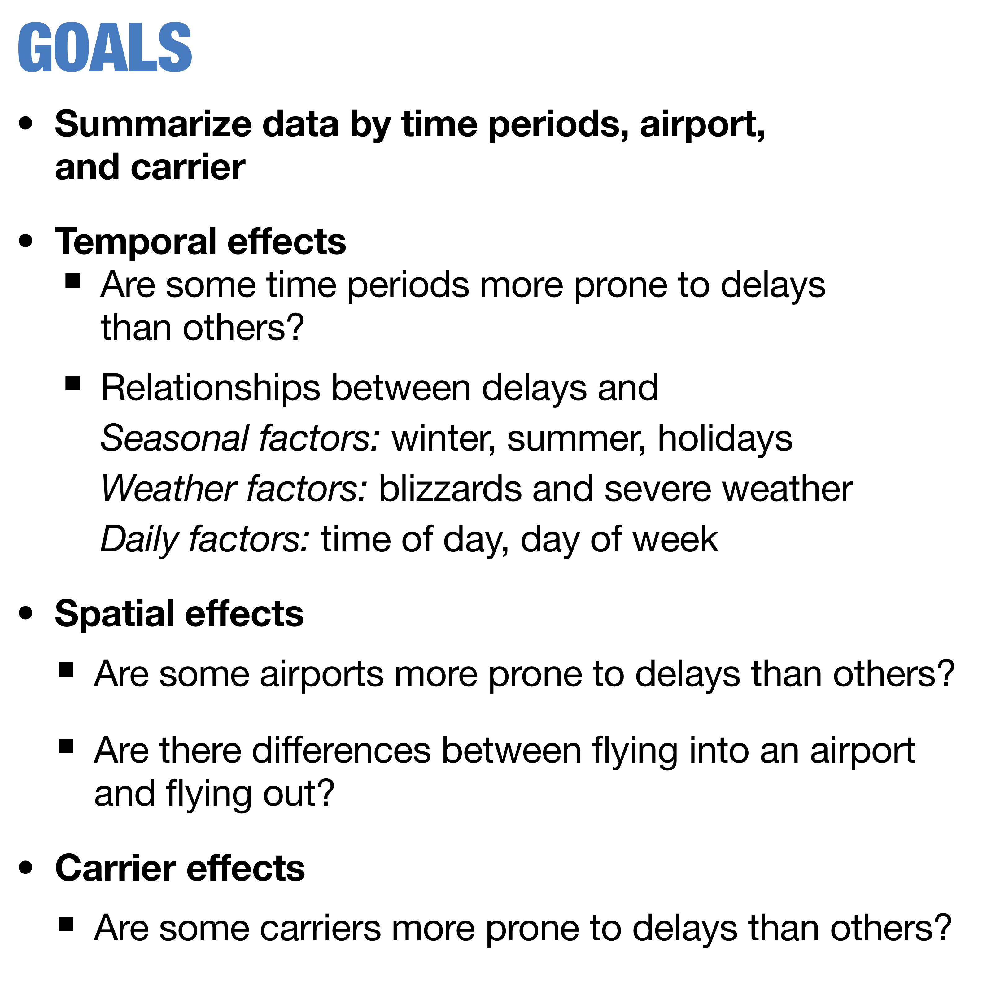

---
# Overview

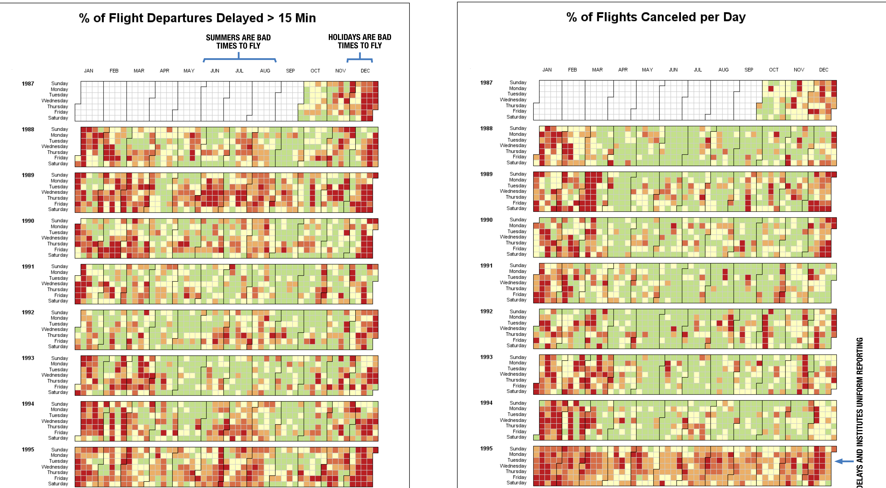

---
class: refresher
# Think about it `r emo::ji("thinking")`

.orange[Delay] was used in providing an overview. 

- What other aggregates could have been used?
- Why was delay chosen?


`r countdown::countdown(0, 30)`

---

# Temporal  trend

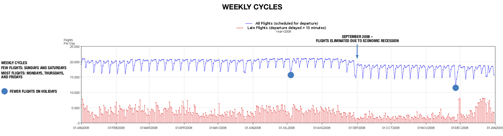

---
# Temporal  trend

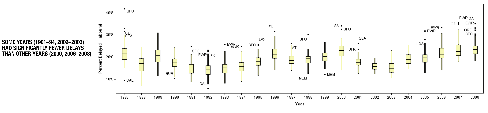

---
# Spatial

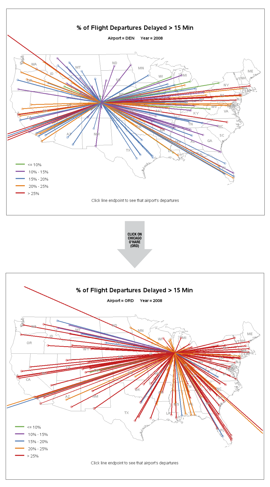

---
# Carrier

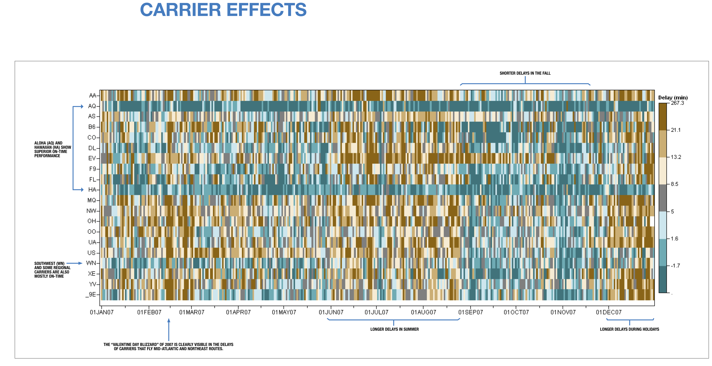

---
# Highlights


---
class: motivator
# What did others do? Second prize `r set.seed(5);emo::ji("medal")`

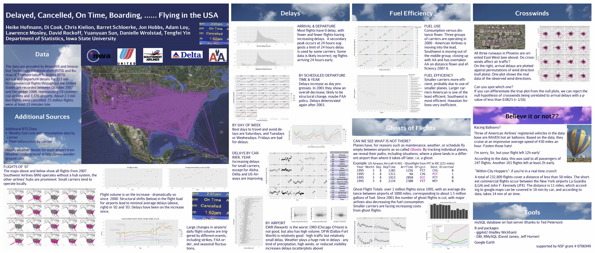

.footnote[[Hofmann, Cook, Kielion, Schloerke, Hobbs, Loy, Mosley, Rockoff, Sun, Wrolstad, Yin](https://amstat.tandfonline.com/doi/abs/10.1198/jcgs.2011.3de#.XsbqbS97G61)]


---
# Analysis overview

- Traffic patterns over time 
- Delays
- Ghost flights
- Mapping traffic

---
# Traffic patterns over time

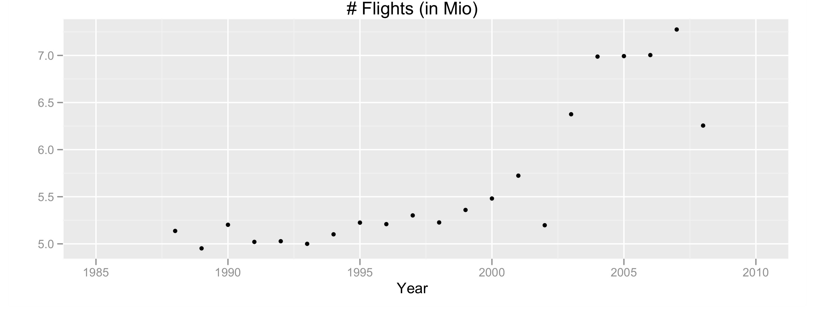

.font_small[Number of flights in millions per year: steadily increasing volume until 2001, with a big drop in 2002. Volume recovered in 2003, and flattens 2004-7, with another drop in 2008. What happened in 2001? What was happening in 2008?]

---
# Traffic patterns at selected airports

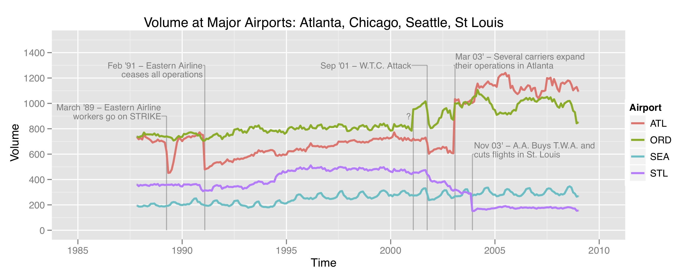

---
# Delays

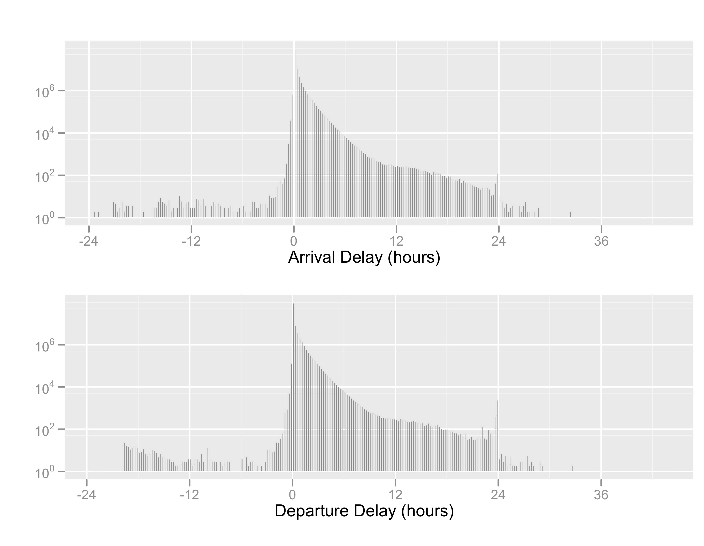

---
# Delays, by year

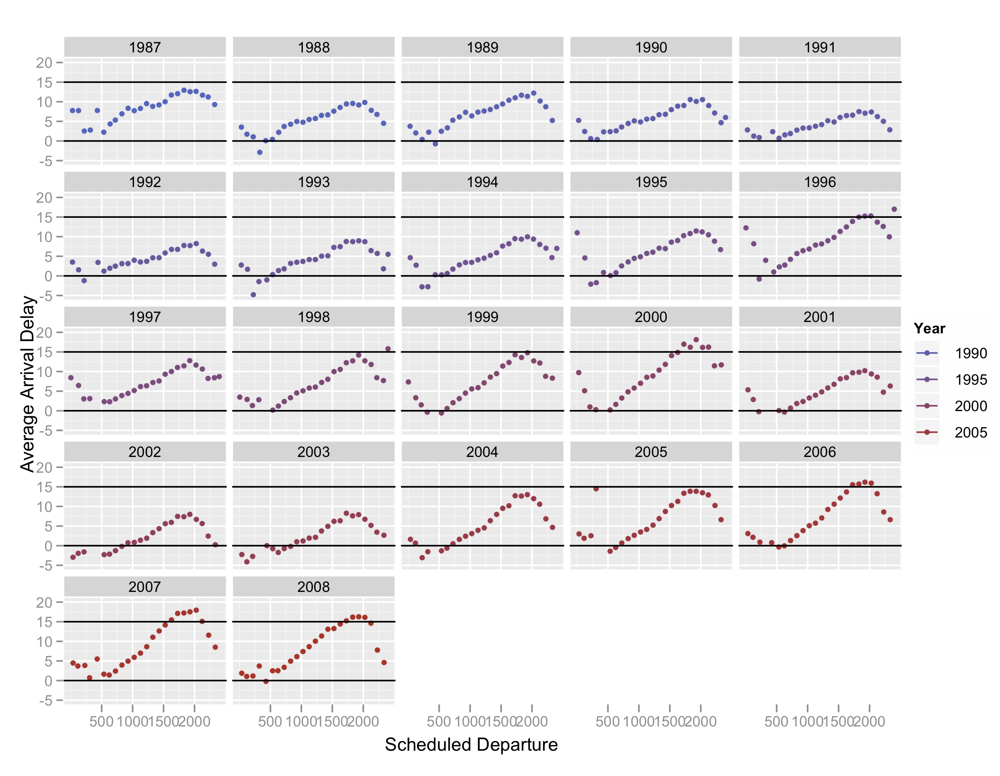

---
# Delays, by carrier


---
# Delays, by airport

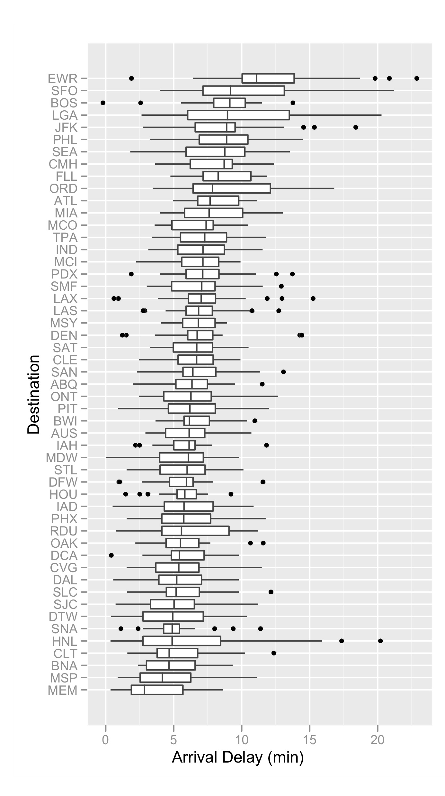

---
# Delays, by day

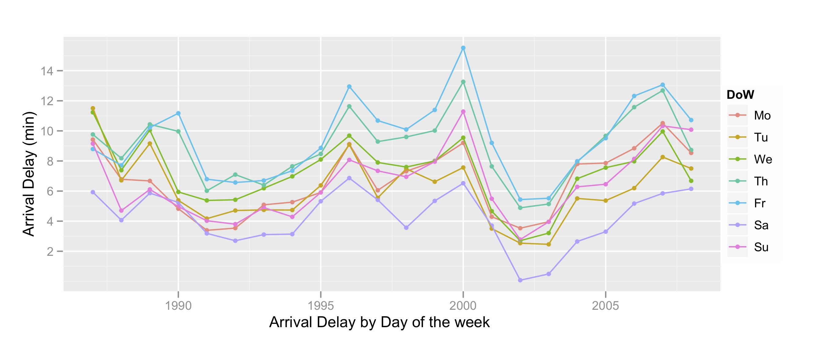

---
# Fuel use by carrier


---
# Fuel efficiency


---
# Ghost flights

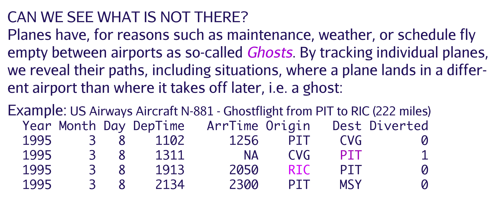

---
# Ghost flights, wasted fuel

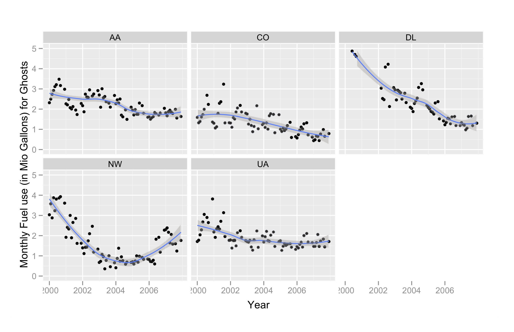

---
# What tools were used and why

A subset of the analysis materials including data and code can be downloaded from the [paper site](https://amstat.tandfonline.com/doi/suppl/10.1198/jcgs.2011.3de?scroll=top)

- sqlite database: Inspired by the guidelines provided by the organisers we created a `mysql` database, on a central server that all team members could access with a password. Each person accessed the data through R.
- R packages: `RMySQL`, `DBI`, `ggplot2`

---
# A brief introduction to working with databases

Working from these notes

https://db.rstudio.com/databases/sqlite/

<br>
<br>

Why should I use a database? 
- The data is too large to load into memory, ie work directly with it in R
- Database can make more efficient calculations 
- Only load the data needed for specific analysis tasks

---
# Connecting to an existing database

The packages `DBI`, `RMySQL`, `RPostgreSQL`, `RSQLite`, `bigrquery`, `odbc` enable connection to many different types of databases. The package `dbplyr` enables tidy style access to the databases.

<iframe src="https://db.rstudio.com/databases" title="List of databases available from R" width="100%" height="600px"> </iframe>

---
# Set up connection

Download the [supplementary material](https://www.tandfonline.com/doi/abs/10.1198/jcgs.2011.3de) for Hofmann et al (2012) and you will find:

.font_smaller[
```{r echo=TRUE, eval=FALSE}
library(RMySQL)
m <- dbDriver("MySQL")
co <- dbConnect(m, user="2009Expo", 
                password="R R0cks", #<<
                port=3306,  
                dbname="data_expo_2009", 
                host="headnode.stat.iastate.edu")
```
]

`r icon::fa("hand-paper", size=1, colour="#D93F00")` `r anicon::nia("Stop, read the Securing Credentials documentation", animate="shake", colour="#D93F00")`

---
# SQL

.font_smaller[
```{r echo=TRUE, eval=FALSE}
dtime <- dbGetQuery(co, "select Year, #<<
avg(CRSArrTime), avg(ArrTime), #<<
count(*) as count,avg(ArrDelay) from #<<
ontime group by Year, (CRSArrTime div 100)") #<<

qplot(`avg(CRSArrTime)`, `avg(ArrDelay)`, 
      geom="point", 
      data=subset(dtime, Year > 1998), 
      xlab="Scheduled Arrival", 
      ylab="Average Arrival Delay (in mins)") + 
  facet_wrap(facets=~Year, ncol=5) + 
  geom_hline(yintercept=c(0,15))
```
]
---
# Set up connection, using SQLite

```{r echo=TRUE, eval=FALSE}
# Set up connection
library(DBI)
library(RSQLite)
con <- dbConnect(RSQLite::SQLite(), ":flights:") #<<
```

This creates the link between R and the database.

---

# Suppose we want to set up a database

One month of air traffic data is quite manageable in an R session. We can use this to get started.


```{r echo=FALSE, eval=FALSE}
# Download a month of data and read into R
library(tidyverse)
d <- read_csv("../data/On_Time_Reporting_Carrier_On_Time_Performance_1987_present_2020_2/On_Time_Reporting_Carrier_On_Time_Performance_(1987_present)_2020_2.csv")
```


To populate our SQLite database with airlines data, you need

.font_smaller[
```{r echo=TRUE, eval=FALSE}
copy_to(con, d, "flights", 
  temporary = FALSE, 
  indexes = list(
    c("FlightDate", 
    "Reporting_Airline", 
    "Tail_Number",
    "Origin",
    "Dest"
  )
))
```
]

Setting up the indexes makes it faster to process data on the database.


---

Alternative approach using DBI database functions

.font_smaller[
```{r echo=TRUE, eval=FALSE}
dbWriteTable(con, "flights", d) 
dbListTables(con)
```
]

and check it

.font_smaller[
```{r echo=TRUE, eval=FALSE}
flights_db <- tbl(con, "flights")
flights_db
```
]

---

.font_smaller[
```{r echo=TRUE, eval=FALSE}
feb1 <- flights_db  %>%
  filter(DayofMonth==1) %>% 
  select(DayofMonth, Origin, Dest) %>%
  collect() #<<
feb1
```
]

or with SQL

.font_smaller[
```{r echo=TRUE, eval=FALSE}
dbListFields(con, "flights")
res <- dbSendQuery(con, "SELECT * FROM 
                   flights WHERE DayofMonth=1")
firstday <- dbFetch(res)
```
]

---
# Add a table on airport details 

Information about airport location and details is found in a different table at the BTS site: 
https://www.transtats.bts.gov/Fields.asp?Table_ID=288 . We will download this and add to our database to use for plotting flights on a map.

.font_smaller[
```{r echo=TRUE, eval=FALSE}
airports <- read_csv("data/402312038_T_MASTER_CORD.csv") %>%
  select(-X29)
copy_to(con, airports, "airports", 
  temporary = FALSE
  )
dbListTables(con)
```
]

---
# Its easy to forget what variables are in the table

You can check this with

.font_smaller[
```{r echo=TRUE, eval=FALSE}
dbListFields(con, "airports")
```
]

---
# Make a map of flights for Feb 1

.font_smaller[
```{r echo=TRUE, eval=FALSE}
airport_locations <- tbl(con, "airports") %>%
  filter(AIRPORT_IS_LATEST == 1, AIRPORT_COUNTRY_CODE_ISO == "US") %>%
  select(AIRPORT, DISPLAY_AIRPORT_NAME, LONGITUDE, LATITUDE) %>%
  collect() #<<
feb1_flights <- feb1 %>% 
  left_join(airport_locations, by=c("Origin" = "AIRPORT")) %>% 
  rename(Origin_lon = LONGITUDE, Origin_lat = LATITUDE, 
         Origin_name = DISPLAY_AIRPORT_NAME) %>%
  left_join(airport_locations, by=c("Dest" = "AIRPORT")) %>%
  rename(Dest_lon = LONGITUDE, Dest_lat = LATITUDE, 
         Dest_name = DISPLAY_AIRPORT_NAME)   
```
]

---

.font_smaller[
```{r echo=TRUE, eval=FALSE}
library(ggmap)
usa_bbox <- c(-130, # min long
              20, # min lat
              -60, # max long
              50) # max lat
usa_map <- get_map(location = usa_bbox, source = "osm")
ggmap(usa_map)
```
]

---

.font_smaller[
```{r echo=TRUE, eval=FALSE}
library(ggthemes)
ggmap(usa_map) + geom_segment(data=feb1_flights, 
                     aes(x=Origin_lon, 
                         xend=Dest_lon,
                         y=Origin_lat,
                         yend=Dest_lat), 
                     colour="#9651A0", alpha=0.01) +
  geom_point(data=feb1_flights, aes(x=Origin_lon, Origin_lat),
             colour="#746FB2", alpha=0.1, size=1) +
  theme_map()
```
]

---

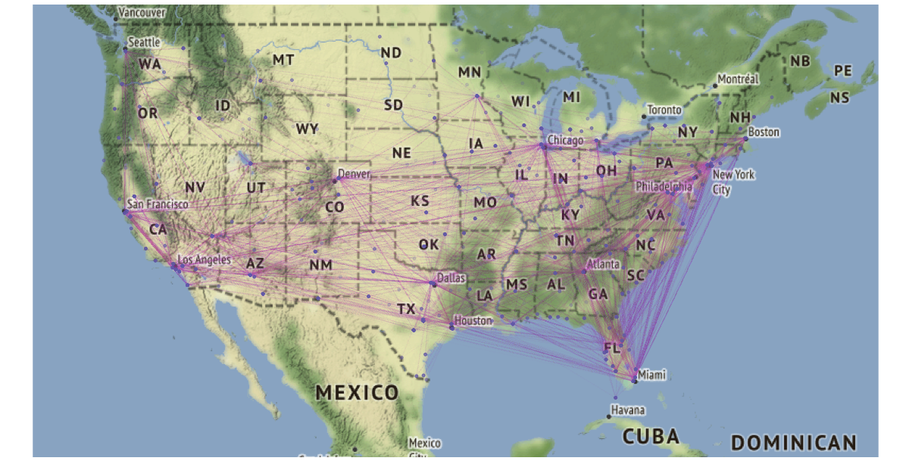

---
# Animating flights for one day

<iframe src="https://player.vimeo.com/video/161681018?title=0&byline=0&portrait=0" width="640" height="400" frameborder="0" allow="autoplay; fullscreen" allowfullscreen></iframe>
<p><a href="https://vimeo.com/161681018">Data Visualization and Statistical Graphics in Big Data Analysis: Video 1</a> from <a href="https://vimeo.com/annualreviews">Annual Reviews</a> on <a href="https://vimeo.com">Vimeo</a>.</p>

[Code is here](https://github.com/tidyverse/ggplot2/wiki/Flying-over-the-usa)


---
```{r endslide, child="components/endslide.Rmd"}
```
