```{r titleslide, child="components/titleslide.Rmd"}
```

.footnote[Image source: https://www.welcometocountry.org/digital-genocide-ash-bartys-race-repeatedly-removed/]

```{r setup, include=FALSE}
library(knitr)
knitr::opts_chunk$set(tidy = FALSE, 
                      message = FALSE,
                      warning = FALSE,
                      echo = FALSE, 
                      eval = FALSE,
                      fig.width=8,
                      fig.height=6,
                      fig.align = "center",
                      fig.retina = 4)
options(htmltools.dir.version = FALSE)
```

---
class: motivator two-column
# What about Barty!

.pull-left[
<a title="si.robi / CC BY-SA (https://creativecommons.org/licenses/by-sa/2.0)" href="https://commons.wikimedia.org/wiki/File:Barty_RG19_(9)_(48199405532).jpg"></a>
]

.pull-right[
* current ranking: 1
* singles titles: 8
* Prize Money: $17,594,569
* Win/Loss Singles: 252/94

<br>
<center>
`r anicon::nia("Home-grown champion", animate="ring", anitype="hover", speed="slow", bgcolor="#ee64a4")`
</center>
]

---
background-image: \url(https://cf.geekdo-images.com/camo/cf29dc3875d5d85966c87e346ce78159f2fdb412/687474703a2f2f7777772e636e732e696973632e65726e65742e696e2f7e6861726973686b2f686f62626573736b65746368322e6a7067)
background-size: cover
# Sports data

`r anicon::nia("There's a treasure trove of data on sports, buried in web sites.", animate="float", anitype="hover", speed="slow", bgcolor="#9651A0")`

.footnote[Images source: https://boardgamegeek.com/]
---
# WTA

`r include_url("https://www.wtatennis.com/stats", height="600px")`

.footnote[Source: https://www.wtatennis.com/stats]
---
# html source

.wider[
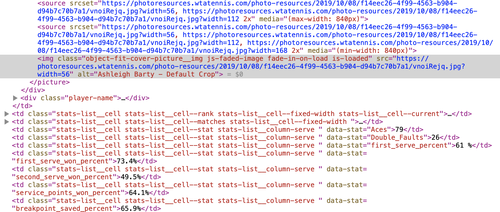
]
--
`html` is text, very long-winded, but nicely organised by tags. Web scraping allows harvesting data provided in web pages, by extracting the data components of the text. 

---

.font_smaller2[
```{r, eval=TRUE}
library(rvest)
library(tidyverse)
url <- "https://www.wtatennis.com/stats"

# Save web page source locally, because it contains javascript content
wta_html <- read_html("wta_rankings2.htm")
wta_rankings <- html_node(wta_html, "table") %>% html_table(fill=TRUE) # There is only one table in page so use html_node rather than html_nodes
wta_rankings <- wta_rankings %>% 
  janitor::remove_empty() %>% 
  as_tibble()

wta_rankings %>% 
  select(Player, Rank, Matches, Aces) %>% 
  top_n(21) %>% print(n=15)

```
]

---

<iframe src="https://giphy.com/embed/mA155PlFvQITe" width="643" height="540" frameBorder="0" class="giphy-embed" allowFullScreen></iframe><p><a href="https://giphy.com/gifs/phew-mA155PlFvQITe">via GIPHY</a></p>

---
class: motivator

That took me about a half day to work out. 

- The WTA (women's tennis) web site is difficult to scrape because the table content is dynamic. There are numerous javascripts which extract and load the data.
--

- The trick for a page like this is to save a local copy of the web page, and read it into R from this. Directly reading from the URL gets empty objects. 
--

- It's not easy to tell that a page is dynamic, and its hard to determine if its just stupid me. Need more practice.
--

- ATP (men's tennis site) is much easier - its just tables, even though the reader can choose to display different tables in the page. This format is easier to automate.

---

# ATP

`r include_url("https://www.atptour.com/en/rankings/singles", height="600px")`

.footnote[Source: https://www.atptour.com/en/rankings/singles]

---

```{r echo=TRUE, eval=TRUE}
library(rvest)
library(tidyverse)
url_atp <- "https://www.atptour.com/en/rankings/singles"
atp_html <- read_html(url_atp)
atp_rankings <- html_node(atp_html, "table") %>% 
  html_table(fill=TRUE)
```

---

.font_smaller2[
```{r eval=TRUE}
atp_rankings %>% 
  janitor::remove_empty() %>% 
  as_tibble() %>% 
  select(Player, Age, Points, `Tourn Played`, `Points Dropping`, `Next Best`) %>% 
  top_n(20) %>% 
  print(n=20)
```
]

---
class: informative
# Data will require more processing

Notice the format of variables:

- Points is interpreted as a character
- `Points dropping` is also a character

the "," in the field isn't read as a separator in a number. These columns will need to be converted to numeric, after stripping out the "," with a text substitution. 

---
class: motivator
background-image: \url(images/tennis/significance.png)
background-size: 80%

Budrus, Vanderplas, Cook (June 2013) Significance 
---
# Smashes win matches analysis

Data for women and men's singles matches was scraped from the 2012 Grand Slam web sites. Statistics for each match were recorded:

- Aces
- Fastest serve speed
- Winners
- Unforced errors
- Return games won
- First serve %
- Second serve %
- Receiving points win

---
# Smashes win matches analysis

.pull-left[
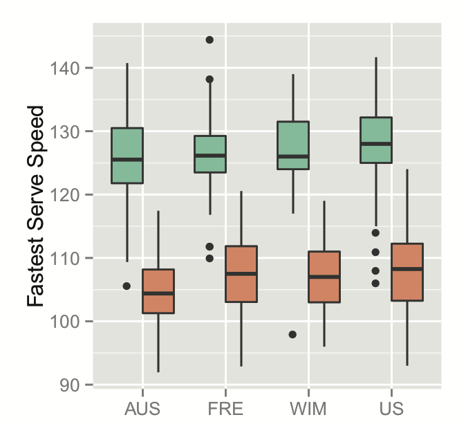
]

.pull-right[
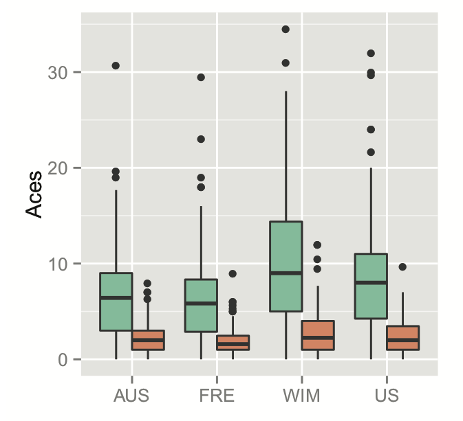
]

Fastest serve speed, and number of aces, in a match, by Grand Slam, and comparing men and women. 

---
# Smashes win matches analysis

.pull-left[
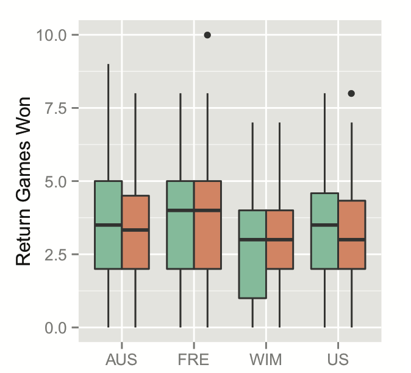
]

.pull-right[
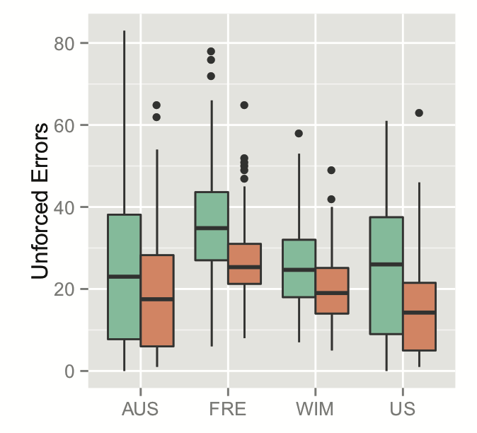
]

<br>
<center>
Return games won, and number of unforced errors. 
</center>

---

class: split-30

.column[
Higher Round number indicates player made it further in the tournament. Statistics for women's singles matches.
]

.column[
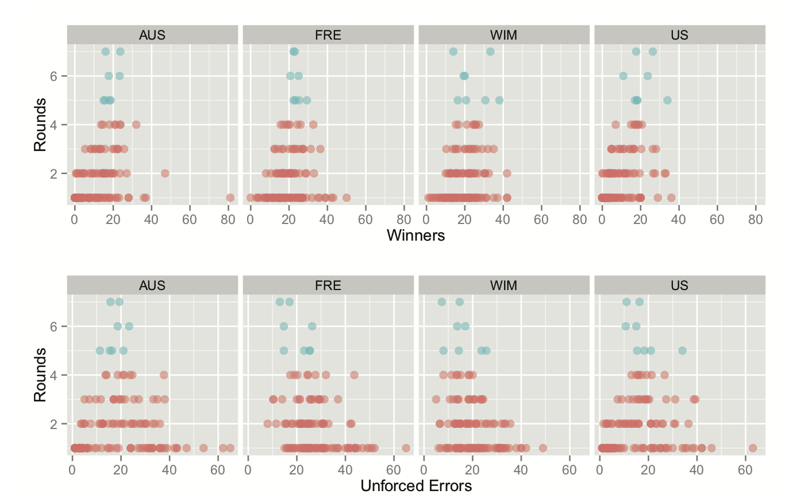
]

---

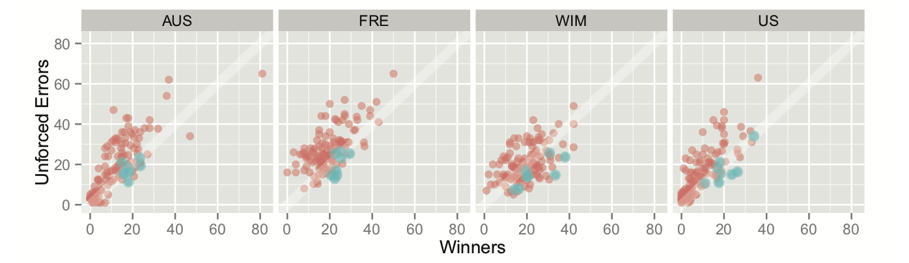

Generally, you want to have more winners than unforced errors. Too few winners might indicate that you are not working hard enough, to be able to win the match, and too many might indicate having to work too hard, so too risky, to win the match. 

Similar for men's matches.

---
class: split-30

.column[
# How important is serving?

Turns out, first serve not so much, as long as its reasonably good. The second serve % is a big indicator of progressing through a tournament, along with receiving points won.
]
.column[
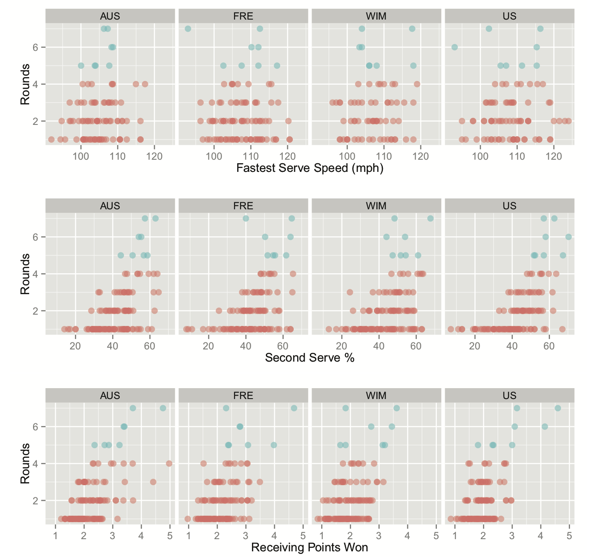
]

---
--- 


# Rules for tournament progression


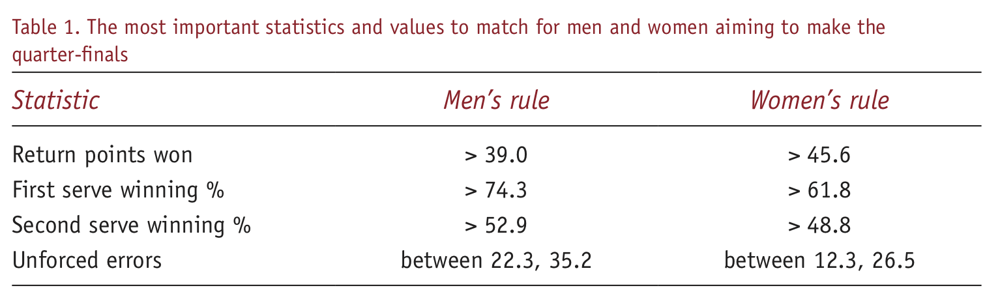


---
# Odds to win

Knowing the statistics of players in the first two rounds, gives pretty reliable odds of predicting the quarter finalists.

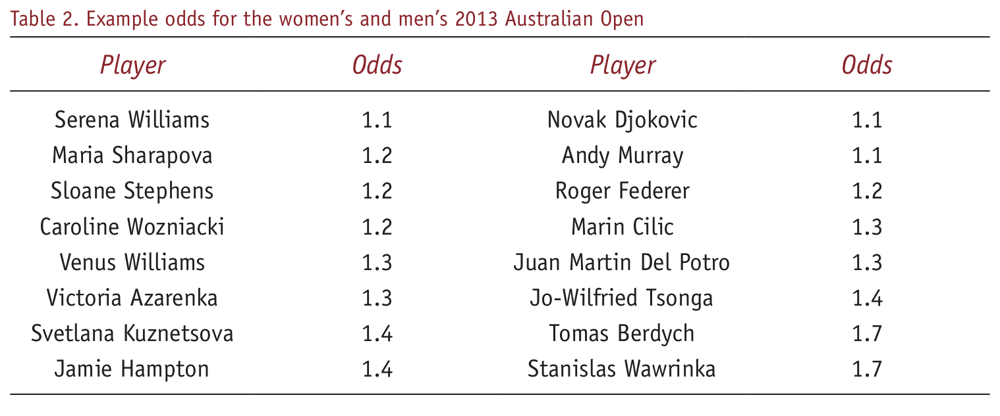

.font_small[Women:  .monash-orange2[S. Williams, Sharapova, Stephens, Azarenka, Kuznetsova], Radwańska, Na,  Makarova]

.font_small[Men: .monash-orange2[Djokovic, Murray, Federer, Tsonga, Berdych], Chardy, Almagro, Ferrer]
---
class: refresher
# Smashes win matches analysis

Smashes are important, but only up to a point! The players who are successful are those who force the pace of the game with smashes, but who do not overdo it. Defensive play is probably more important: being able to win points on the opponent’s serve, and winning points on one’s own second serve, correlates best with getting through to the quarter-finals and the big money prizes.

---
# Legality of scraping

- Is web scraping legal? Yes, unless you use it unethically. 
    - Search engines started as web scrapers, and it boost the visibility of the page, increasing the positive sentiment towards scraping.
- .monash-blue2[Copyright infringement]: if the data is copyright protected, you can't upload it to your own site, or use it for commercial purposes
- .monash-blue2[Violation of the Computer Fraud and Abuse Act]: unauthorised access, eg [jerk.com](http://arstechnica.com/tech-policy/2014/04/jerk-com-scammed-money-to-remove-facebook-scraped-profiles-says-ftc/)   
- .monash-blue2[Trespass to Chattel]: Don't make so many requests that you slow the web site's performance

.footnote[Source: https://www.import.io/post/6-misunderstandings-about-web-scraping/]
---

# ATP terms and conditions

<iframe src="https://www.atptour.com/en/terms-and-conditions" width="100%" height="600px"> </iframe>

---

What do you think are reasonable uses of scraping the ATP data?
--

- Pull the statistics of your next opponent to find their strengths and weaknesses
--

- Develop odds for a gambling enterprise
--

- Examine the statistics of a player prior to an injury to determine if it might be preventable
--

- Develop a player ranking to build the draw for a tournament


---
# Keep in mind

- Web scraping doesn't work forever
    - Web sites change, and code needs to be rewritten
- A web site can be made to be almost scrape-proof, but technically if its visible is scrapable
- Its more than just coding. Its pretty time-intensive to build a scraper, and then the data extracted needs to be wrangled into shape

.footnote[Source: https://www.import.io/post/6-misunderstandings-about-web-scraping/]

---
# Be polite!

.font_smaller[
```{r echo=TRUE, eval=TRUE}
library(polite)
tennis_bow <- bow(
  url = "https://www.atptour.com/en",  # base URL
  user_agent = "Wild-caught Data <https://wcd.numbat.space>",  # identify ourselves
  force = TRUE
)
tennis_bow
```
]
---
class: split-50

.column[.padtop50px[
# Hypertext Markup Language 

##  HTML Introduction

```
<!DOCTYPE html>
<html>
<body>
    This is my first web page
</body>
</html>
```
]]
.column[.padtop50px[

## Common tags

- _html_: opening tag  declaring everything between is html format
- _body_: main content appearing in the page
- _title_: title in browser border
- _table_, _tr_, _td_: table start, row and column starts
- _img_: insert an image here
- _a_: insert a link, could be external, or internal
- _h1_, _h2_, _h3_: headings in the document


]]

---

.row[.padtop50px[
# Attributes

.font_smaller[

```{r echo=TRUE, eval=FALSE}
<h1 style="color:Tomato;"> Bilby </h1>
```


```{r echo=TRUE, eval=FALSE}

```


```{r echo=TRUE, eval=FALSE}
<a title="my image" href="https://commons.wikimedia.org/wiki/image.jpg"> 
</a>
```
]

]]
.row[.padtop50px[
# Elements

- Bilby
- The image is the element in the third example
]]
---

# Beginners guide to html

<a href="https://htmldog.com/guides/html/beginner/"> 
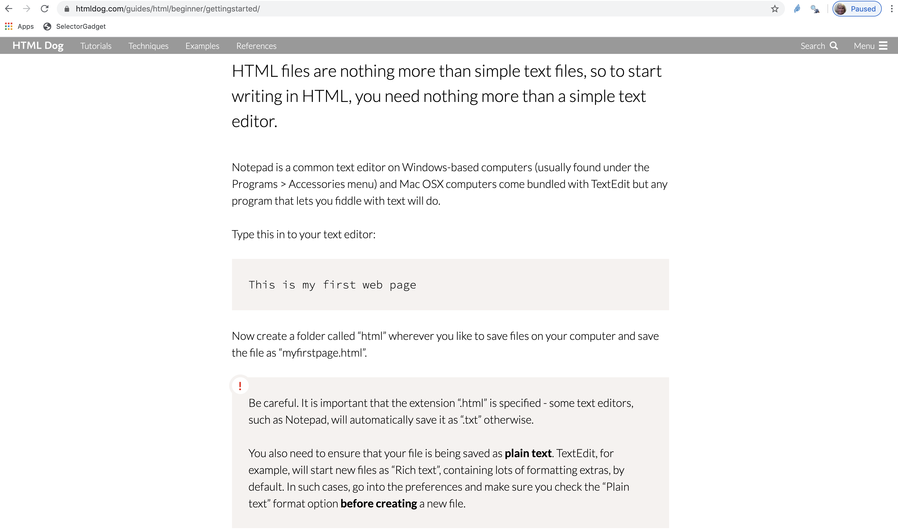 </a>

.footnote[Source: https://htmldog.com/guides/html/beginner/]

---
class: split-50
# Intro to Cascading Style Sheets (css)

.column[

<br>
<br>
<br>

- a way to style and present HTML.
- to understand parts of the html, requires knowledge of the styling components too
]
.column[

<br>
<br>
<br>

<iframe src="https://giphy.com/embed/ZsZmffS4YS5yw" width="480" height="312" frameBorder="0" class="giphy-embed" allowFullScreen></iframe><p><a href="https://giphy.com/gifs/car-80s-deal-with-it-ZsZmffS4YS5yw">via GIPHY</a></p>
]
---

# Intro to css

<a href="https://htmldog.com/guides/css/beginner/"> 
 </a>


<br>

Fun interactive way to learn about css selectors at http://flukeout.github.io/. 

 
---

# Learning to scrape with rvest

```{r echo=TRUE}
library(rvest)
library(tidyverse)
url_atp <- "https://www.atptour.com/en/rankings/singles"
atp_html <- read_html(url_atp) #<<
atp_rankings <- html_node(atp_html, "table") %>% #<<
  html_table(fill=TRUE) #<<
```

---
# Different selector

.font_smaller[
```{r echo=TRUE, eval=TRUE}
lego_movie <- read_html("http://www.imdb.com/title/tt1490017/")

rating <- lego_movie %>% 
  html_nodes("strong span") %>%
  html_text() %>%
  as.numeric()
rating
```
]

---

.font_smaller[
```{r echo=TRUE, eval=TRUE}
cast <- lego_movie %>%
  html_nodes("#titleCast .primary_photo img") %>%
  html_attr("alt")
cast
```
]

---
# When pages make it difficult

.font_smaller[
```{r echo=TRUE, eval=TRUE}
url <- "https://www.wtatennis.com/stats"
wta_html <- read_html(url)
wta_rankings <- html_node(wta_html, "table")
wta_rankings
```
]

---
# Download a copy first

.font_smaller[
```{r echo=TRUE, eval=TRUE}
wta_html <- read_html("wta_rankings2.htm")
wta_rankings <- html_node(wta_html, "table") %>% html_table(fill=TRUE) 
wta_rankings <- wta_rankings %>% 
  janitor::remove_empty() %>% 
  as_tibble()
wta_rankings
```
]

---
# Sports statistics scraping packages

- Tennis: deuce package (https://github.com/skoval/deuce)
- Cricket: cricketdata (https://github.com/ropenscilabs/cricketdata)
- AFL: fitzRoy (https://jimmyday12.github.io/fitzRoy/)
- baseball: Lahman, pitchRx 
- basketball: ballr
- soccer: https://github.com/statsbomb/open-data, https://github.com/JoGall/soccermatics

---
# deuce

```{r echo=TRUE, eval=FALSE}
# remotes::install_github("skoval/deuce")
library(deuce)
```

- Scrapes data from http://www.atpworldtour.com/, https://www.flashscore.com/tennis. 
- Developed by a Tennis Australia data scientist Stephanie Kovalchik. 

.footnote[NOTE: Some components broken.]

---
# cricketdata

```{r echo=TRUE, eval=TRUE}
# remotes::install_github("ropenscilabs/cricketdata")
library(cricketdata)
```

- Scrapes data from https://docs.ropensci.org/cricketdata/
- Developed by Rob Hyndman, Timothy Hyndman, Charles Gray, Sayani Gupta
- Interesting approach to getting the URLs for the data pages

---
# cricketdata

.font_smaller[https://stats.espncricinfo.com/ci/engine/stats/index.html?class=10;team=289;template=results;type=batting]

.font_smaller[
```{r echo=TRUE, eval=TRUE}
auswt20 <- fetch_cricinfo("T20", "Women", country="Aust")
auswt20
```
]

---
# fitzRoy

.font_smaller[
```{r echo=TRUE, eval=FALSE}
# From CRAN
# install.packages("fitzRoy")
# or from GitHub
# remotes::install_github("jimmyday12/fitzRoy")
library(fitzRoy)
aflw <- get_aflw_match_data(start_year = 2020)
```
]

- Gets statistics from https://womens.afl and https://afltables.com
- Developed by James Day, Robert Nguyen, Matthew Erbs, Oscar Lane, Jason Zivkovic
- Combination of scraping for men's data, and reading protected JSON data for women's by requesting a permission token

---

<a href="https://jacquietran.github.io/2019_may_rladies_akl/R/#1">   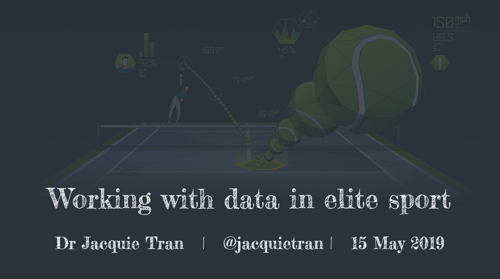 </a>

---
```{r endslide, child="components/endslide.Rmd"}
```

