```{r titleslide, child="components/titleslide.Rmd"}
```


```{r , echo = FALSE, warning = FALSE, message = FALSE}
library(tidyverse)
library(readr)
library(leaflet)
library(ggmap)
library(knitr)
library(kableExtra)
```

---

# The magnificent Great Barrier Reef

* The Australian Great Barrier Reef is one the world natural wonders and contributes $6.4 billion to Australia’s national economy 
as well as some 64,000 jobs.

.grid[

.item[
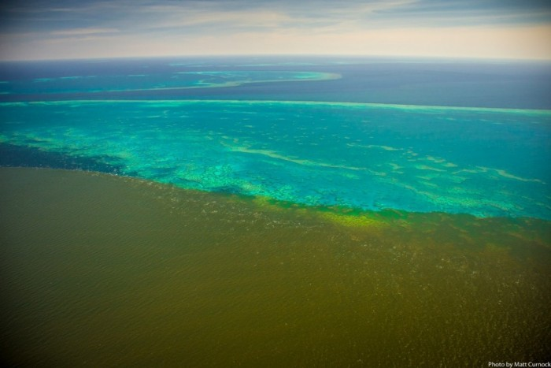
[Photo source](https://eatlas.org.au/rrmmp/gbr-jcu-water-quality)
]
.item[
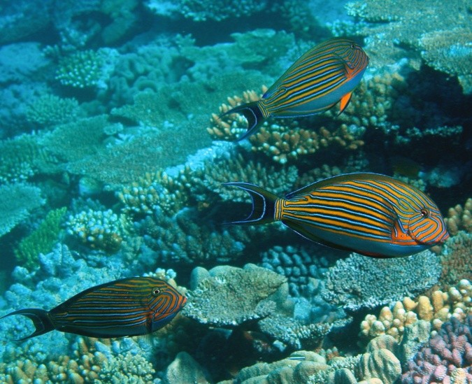
[Photo source](https://eatlas.org.au/media/2)
]
]

---
# Facts about the GBR
<br>
The Great Barrier Reef makes up about 10 per cent of the world's coral reef ecosystems:
- it covers 344,400 km2 in area and it is the world’s largest coral reef ecosystem
- it includes some 3000 coral reefs, 600 continental islands, 300 coral cays and about 150 inshore mangrove islands
- it extends south from the northern tip of Queensland in north-eastern Australia to just north of Bundaberg
- it is between 60 and 250 kilometres in width and it 
has an average depth of 35 metres in its inshore waters, while on outer reefs, continental slopes extend down to depths of more than 2000 metres

[Source](http://www.gbrmpa.gov.au/the-reef/reef-facts)

---
# The magnificent Great Barrier Reef
<br>
<center>
<iframe width="560" height="315" src="https://www.youtube.com/embed/DygyYL4dylU" frameborder="0" allow="accelerometer; autoplay; encrypted-media; gyroscope; picture-in-picture" allowfullscreen></iframe>
</center>


---
# Great Barrier Reef Marine Park Authority
<br>
- The authority has been managing the GBR since 1975
- It is in charge of the Marine Park policy and decision making
- Also about the planning and regulation that protects key values and enable ecologically 
sustainable use for a changing Reef.

### Threats
.info-box[
 - The greatest threat to the Reef is climate change. 
 - The other main threats are associated with coastal development,
 land-based run-off, and threats from direct human use of the Reef (such as illegal fishing).
]

---
# Reef managment: Marine Monitoring
<br>

- Coral cover trends over time
- Coral diseases
- Condition and trends of the water quality
- Health and resilience of seas grasses
- Fish abundance
- Reef condition
- Crown of Thorn Star fish
- Land-based run off
- ...


---
background-image: url("images/GBR.jpg")
background-size: cover

GBRMPA collaborates with industry, private companies and other government organizations.
In particular, .bold[the monitoring program] is being coordinated by the Great Barrier Reef Marine Park Authority 
and involves a range of partner organisations:

- Australian Institute of Marine Science (AIMS)
- Australian Government Department of Defence
- Australian Government Department of the Environment and Energy
- Association of Marine Park Tourism Operators
- Many others

<br>
For full list of partner organization please see [here](http://www.gbrmpa.gov.au/our-work/reef-strategies/reef-integrated-monitoring-and-reporting-program/program-delivery)
 

---
# Great Barrier Reef Monitoring
The Marine Monitoring Program (MMP) was established in 2005 to monitor 
the inshore health of the Great Barrier Reef. Part of the program is carried out the 
Australian Institute of Marine Science (AIMS).

The program will inform the development of the Reef 2050 Integrated Monitoring and Reporting Program.

## Monitors

- Water (AIMS)
- Seagrasses
- Coral (AIMS)

.bold[GBRMPA uses the information for tactical, operational and strategic planning, as well as for, quantifying management effectiveness and reporting.]


---
# Great Barrier Reef Monitoring: MMP
<br>

.grid[
.item[The Marine Monitoring Program is a collaborative partnership. Monitoring is conducted
by the Australian Institute of Marine Science, James Cook University, Howley Environmental
Consulting, the University of Queensland, Queensland Parks and Wildlife Service, Reef Catchments,
and community volunteers.]

.item[
```{r , fig.align = "center", echo = FALSE}
library(splines)
 set.seed(2020)

 n  <- 300
 x  <- seq(0,1,length=n)
 fx <- 10*x*sin(10*pi*x) + 3*cos(2*pi*x)
 y  <- rnorm(n,fx,1)

 fig = dat <- data.frame(x = x, y = y, fx = fx) %>%
   ggplot(aes(x = x, y = y)) +
   geom_point(color = "blue", alpha =0.5) +
   geom_line(aes(x = x, y = fx)) +
   theme_bw() +
   ggtitle("Understanding changes over time and space")
   
fig
```
]
]

---
# The Australian Institute of Marine Science 
<br>
The Australian Institute of Marine Science (AIMS) is Australia’s tropical marine research agency.
<br><br>
.info-box[
Provides large-scale, long-term and world-class research that helps governments, industry and the wider community 
to make informed decisions about the management of Australia’s marine estate.
]
<br>
AIMS is a Commonwealth statutory authority established by the Australian Institute of Marine Science Act 1972.
<br><br><br>
[AIMS](https://www.aims.gov.au/)


---
# AIMS
Headquaters Cape Ferguson (National Park) 50km from Townsville
```{r out.width = '70%', echo = FALSE, fig.align = "center"}
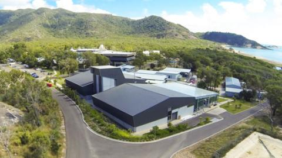
```
<br><br>
[Virtual tour to the Marine Sea Simulator where controlled experiments are run](https://www.aims.gov.au/seasim/seasim-virtual-tour)

---
background-image: url("images/dugon.jpg")
background-size: cover
# Why monitoring the GBR?
Understanding how the resilience of the Reef is affected by pressures is vital for management.
Monitoring the inshore health of the Reef has been routinely carried out since 2005 under this 
program. Annual monitoring enables us to analyse:
<br>
<br>
.info-box[
-Trends in water quality parameters (turbidity/water clarity, nutrients) relative to the  Water
Quality Guidelines for the Great Barrier Reef Marine Park
- The ecological risk of mixtures of pesticides to Reef ecosystems
- Wet-season river-derived pollutant exposure
- Coral cover, seagrass abundance and ecosystem health
]


---
# The GBR Shelf positions

```{r out.width = '50%', echo = FALSE, fig.align = "center"}
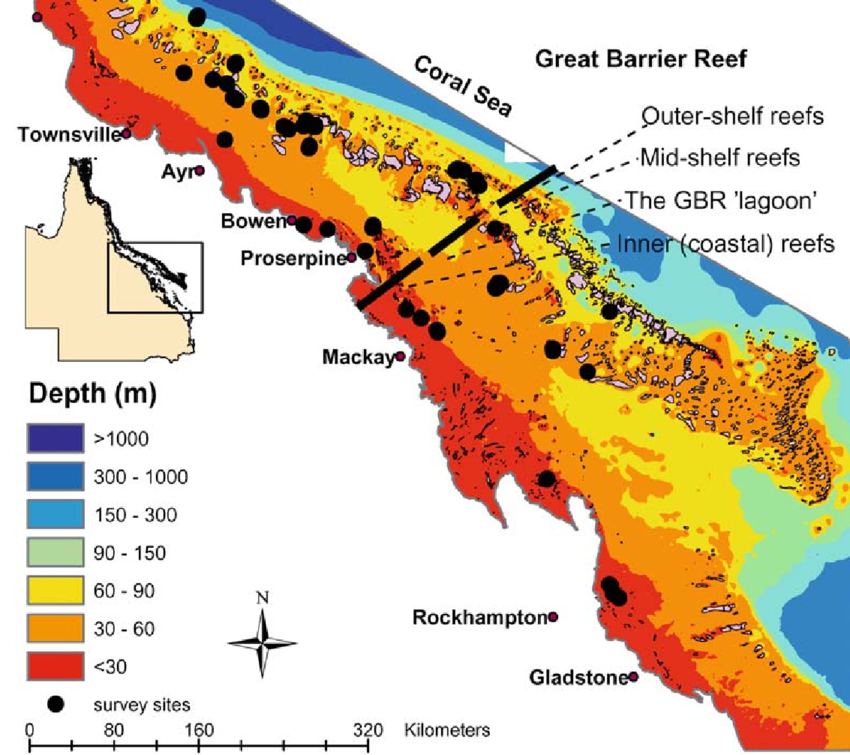
```

[Photo Reference here](https://link.springer.com/article/10.1007/s00338-003-0361-y)

---
# The GBR sector positions

```{r out.width = '30%', echo = FALSE, fig.align = "center"}
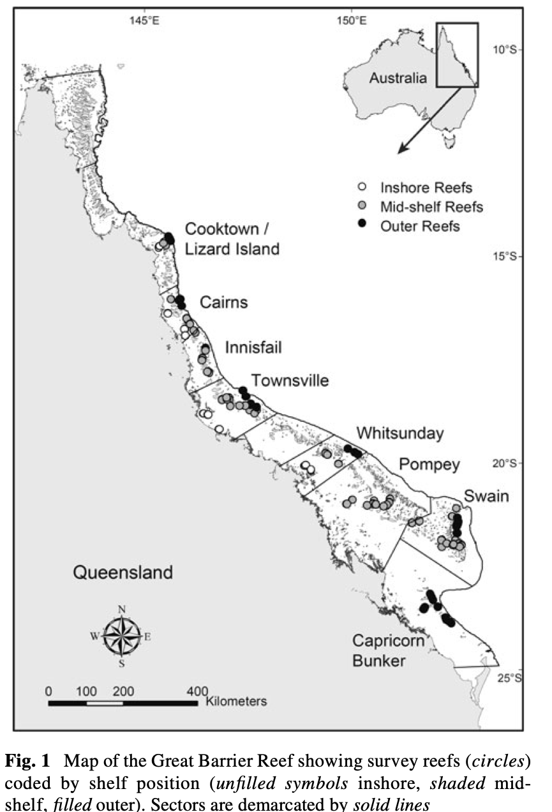
```

[Photo Reference here](https://link-springer-com.ezproxy.lib.monash.edu.au/content/pdf/10.1007/s00227-012-1893-x.pdf)

---
# Focus: Monitoring programs run by AIMS
## MMP (Inshore reefs)
<br>
.tip[
- MMP : Inshore reefs (those that can be reached from shore by a small boat) are vulnerable to 
more threats than those further from shore. 32 inshore reefs are monitored under the Great Barrier 
Reef Marine Park Authority’s Marine Monitoring Program.

- The Inshore Marine Monitoring Program (MMP) is designed to detect changes in reef 
communities adjacent to the Wet Tropics, Burdekin, Mackay, Whitsunday and Fitzroy Natural 
Resource Management Regions.

]


---
# Focus: Monitoring programs run by AIMS
## LTMP (Mid and outer shelf)
.tip[

- LTMP: For over 30 years, AIMS has been surveying the health of 47 midshore and offshore reefs across 
the Great Barrier Reef region. The Long-term Monitoring Program represents the longest continuous record 
of change in reef communities. 

- Data caputures natural variability of coral and fish populations, and documents effects of disturbances 
such as crown-of-thorns starfish outbreaks, cyclones and bleaching events.
Also it provides awareness of other threats to the Reef (such as outbreaks of coral disease) 
and other issues of concern to reef managers.
]


---
# AIMS: Sampling methods on the GBR

```{r out.width = '100%', echo = FALSE, fig.align = "center"}
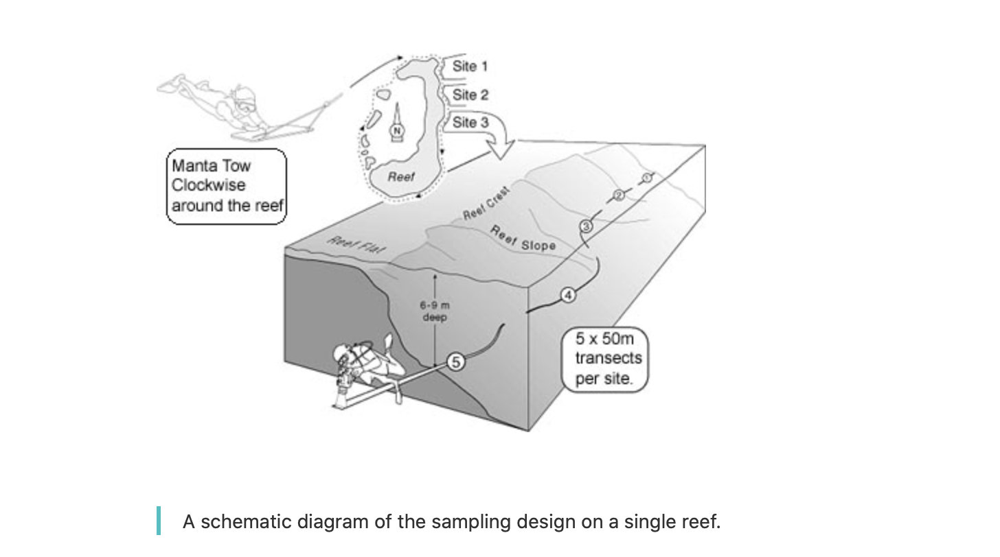
```
[More info on AIMS sampling techniques](https://www.aims.gov.au/docs/research/monitoring/reef/sampling-methods.html)


---
# Manta tows: Sampling methods on the GBR
.grid[

.item[

```{r out.width = '90%', echo = FALSE, fig.align = "center"}

```
```{r out.width = '60%', echo = FALSE, fig.align = "center"}
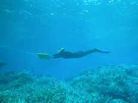
```
]

.item[
- The primary objective of the broadscale surveys is to detect and monitor populations of crown-of-thorns starfish. Manta tow surveys also provide estimates of percentage cover of living hard corals, living soft coral and recently dead hard coral, allowing assessment of the impact of starfish outbreaks and other large-scale disturbances.

]

]


---
# Sites: Sampling methods on the GBR
.grid[

.item[

```{r out.width = '100%', echo = FALSE, fig.align = "center"}

```
```{r out.width = '50%', echo = FALSE, fig.align = "center"}
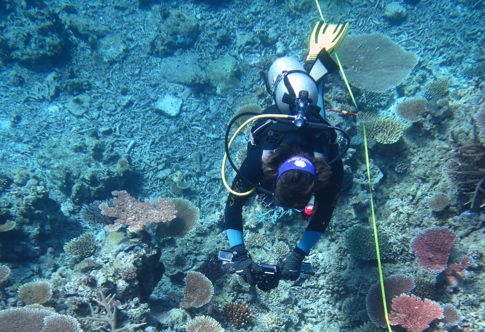
```
]

.item[
- Sites are at least 250 m apart where possible. Within each site, five 50 m transects
are laid along the reef slope parallel to the reef crest at about 6-9 m depth. 
- Transects are marked with a star picket at each end and with lengths of reinforcing rod at 10 m intervals.

]
]


[Sampling methods info ](https://www.aims.gov.au/docs/research/monitoring/reef/sampling-methods.html)

<!-- https://www.aims.gov.au/reef-monitoring/cape-grenville-2019 -->


---
# Monitoring
<br>

- The AIMS Long-term Monitoring Program (.blue[LTMP]) is designed to detect changes in reef communities at a subregional scale. In this context, a subregion encompasses inshore, mid-shelf and outer shelf reefs across the continental shelf within one band of latitude (a sector).

- The Inshore Marine Monitoring Program (.blue[MMP]) is designed to detect changes in reef communities adjacent to the Wet Tropics, Burdekin, Mackay, Whitsunday and Fitzroy Natural Resource Management Regions.

---

# AIMS: Data eatlas of Australia

Discover, learn, investigate and download environmental research and reference data for the Great Barrier Reef,
its catchments, the Wet Tropics and the Torres Strait regions.
The eAtlas is a website and mapping system for presenting environmental research data in an accessible 
form that promotes greater use of this information.
 
```{r out.width = '40%', echo = FALSE, fig.align = "center"}
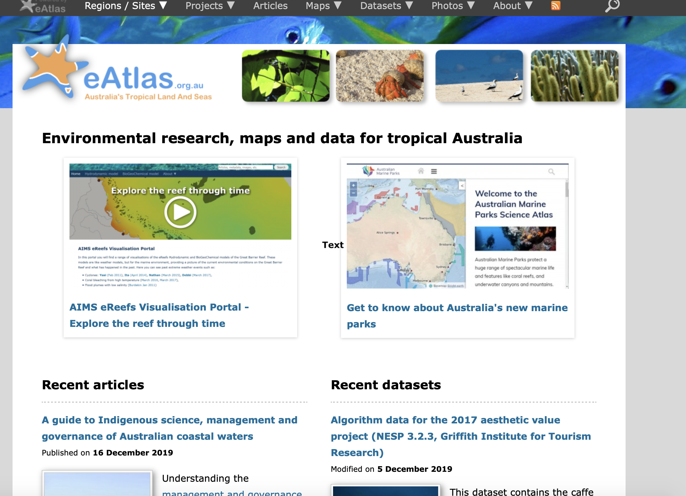
```

https://eatlas.org.au
---
# Obtaining data I
<br>
* eatlas: [LTMP and MMP data](https://eatlas.org.au/gbr/ltmp-data)
* Metadata : Contains descriptions of data  which allows users, including researchers, to identify potential data of use to them.
Data can then be downloaded (if available) or requested. Access to some data will be via legal data agreement.

```{r out.width = '50%', echo = FALSE, fig.align = "center"}
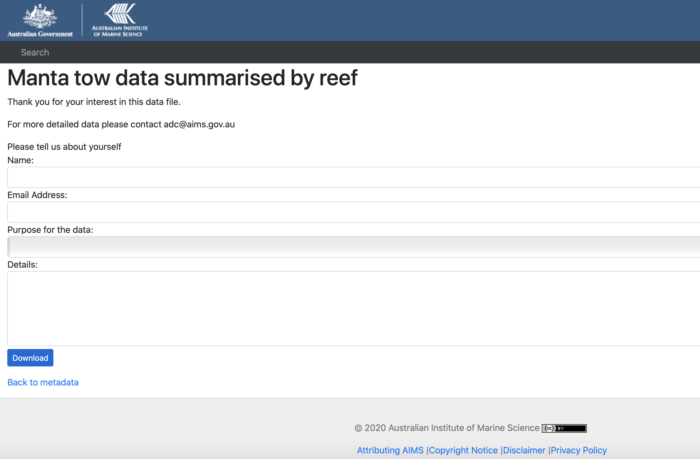
```


---
# Obtaining data II

## Crown-Of-Thorns Starfish And Benthos Manta Tow Data (Great Barrier Reef)

[Info](https://apps.aims.gov.au/metadata/view/5bb9a340-4ade-11dc-8f56-00008a07204e)

```{r out.width = '100%', echo = FALSE, fig.align = "center"}
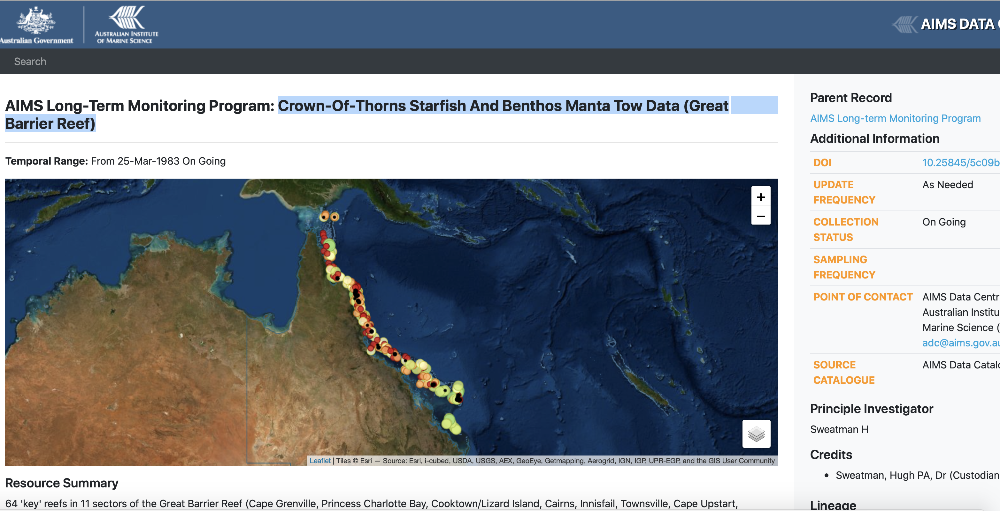
```


---
class: refresher middle

Let's start working with the data!


---
# GBR data


```{r out.width = '100%', echo = FALSE, fig.align = "center"}
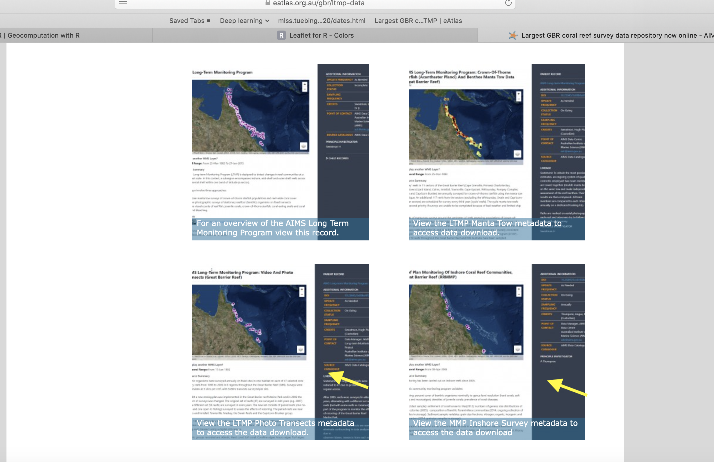
```


---
# Visualizing monitoring locations 
<br>
.info-box[
.blue[Leaflet] is one of the most popular open-source JavaScript libraries for
interactive maps. It’s used by websites ranging from The New York Times and 
The Washington Post to GitHub and Flickr, as well as GIS specialists like OpenStreetMap,
Mapbox, and CartoDB.
]

```{r out.width = '50%', echo = FALSE, fig.align = "center"}

```
<br>
[leaflet for R](https://rstudio.github.io/leaflet/)


---
# Installing leaflet in R
<br>

```{r , eval = FALSE}
install.packages("leaflet")
# to install the development version from Github, run
# devtools::install_github("rstudio/leaflet")
```

```{r , eval = FALSE}
library(leaflet)
library(ggmap)
```

## Read LTMP data
```{r , eval = FALSE}
ltmp <- read_csv(file = "Data/ltmp_hc_sc_a_by_site/ltmp_hc_sc_a_by_site.csv", col_types = cols())
```


---
# Visualizing monitoring locations using map widget
## Steps
<br>

 - Using the function make_bbox() from the ggmap package, we are
 going to create a bounding box for the longitude and latitude 
 collection in our data set.
 - Then using the leaflet() function, we will start creating the
 layers of our map. We will add a tile layer from a known map provider such as 
 googlemaps for example.
 - After that we will decide on the symbols that we want to use in our map to mark 
 our sampling locations

Then our leaflet map will be ready! Demo

---
# Visualizing LTMP monitoring locations using map widget


```{r , echo = FALSE, fig.alig = "center"}
ltmp <- read_csv(file = "Data/ltmp_hc_sc_a_by_site/ltmp_hc_sc_a_by_site.csv", col_types = cols())

cb_bbox <- make_bbox(lon = ltmp$LONGITUDE, 
                     ltmp$LATITUDE, f = 0.9) 

leaflet(data = ltmp) %>%
  # Base group
  addProviderTiles(providers$Esri.WorldImagery, group="Satellite") %>%
  # Add reciever location data
  addCircles(
    lng = ltmp$LONGITUDE, 
    lat = ltmp$LATITUDE, 
    fill=TRUE, color="sienna",
    weight=1,
    radius = 1,
    #color = ~pal(col),
    stroke = FALSE, fillOpacity = 0.5)
```


---
background-image: url("images/mangroves.jpg")
background-size: cover
# Monitoring MMP locations on the GBR
<br>
<br>
## R demo


---
# Data --> Long term marine monitoring program (LTMP)

## Regions

```{r , echo = FALSE, fig.align = "center"}
mmp <- read_csv(file = "Data/mmp_hc_sc_a_by_site/mmp_hc_sc_a_by_site.csv", col_types = cols())
ggplot(data = mmp,
       aes(
         x = LONGITUDE,
         y = LATITUDE, 
         color = NRM_REGION)
       ) +
  geom_point() +
  theme_bw() +
  ggtitle("MMP sampling locations")
  
```


---
# Data --> Long term marine monitoring program (LTMP)

## Shelf

```{r , echo = FALSE , fig.align = "center"}
ggplot(data = ltmp,
       aes(
         x = LONGITUDE,
         y = LATITUDE, 
         color = SHELF)
       ) +
  geom_point() +
  theme_bw() +
  ggtitle("LTMP sampling locations")
  
```

---
# Data --> Long term marine monitoring program (LTMP)

## Sector


```{r , echo = FALSE}
ggplot(data = ltmp,
       aes(
         x = LONGITUDE,
         y = LATITUDE, 
         color = SECTOR)
       ) +
  geom_point() +
  theme_bw() +
  ggtitle("LTMP sampling locations")
  
```

---
# Data --> Long term marine monitoring program (LTMP)

## Shelf


```{r , echo = TRUE, eval = FALSE}
ggplot(data = ltmp,
       aes(
         x = LONGITUDE,
         y = LATITUDE, 
         color = SHELF)
       ) +
  geom_point() +
  theme_bw() +
  ggtitle("LTMP sampling locations")
  
```


---
# Can we make nicer figures/visualization????

## Of course!!!
We can do that by incorporating a shape file in our figures!

```{r out.width = '50%', echo = FALSE, fig.align = "center"}
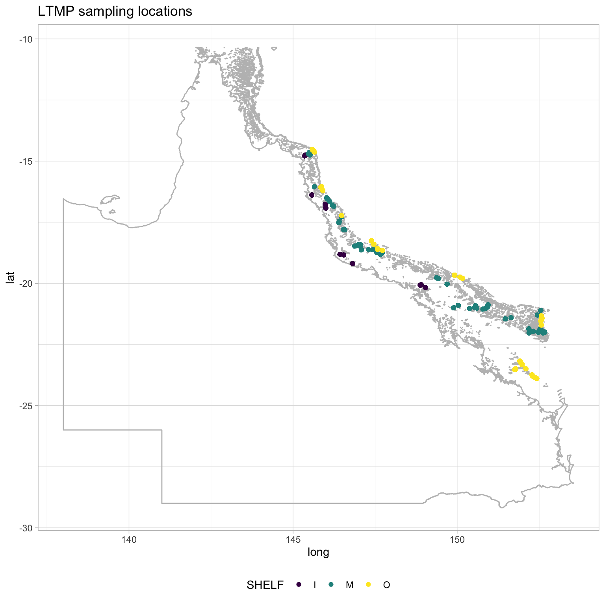
```


---
# Another example

Using a shape file in our figures to plot geographical areas.

```{r out.width = '50%', echo = FALSE, fig.align = "center"}
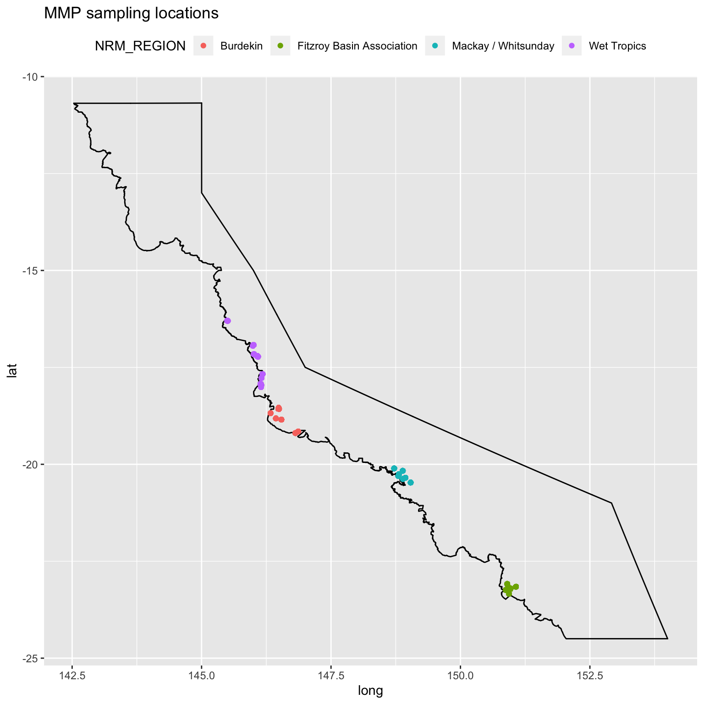
```


---
# Maps using shape files
## Shape files
<br>
.blue[Shapefiles] are a common way to store geospatial data. 
<br>
.info-box[
A shapefile is a simple, nontopological format for storing the geometric location and
attribute information of geographic features. Geographic features in a shapefile can be
represented by points, lines, or polygons (areas). The workspace containing shapefiles 
may also contain dBASE tables, which can store additional attributes that can be joined to a shapefile's features.
]

[More info](https://desktop.arcgis.com/en/arcmap/10.3/manage-data/shapefiles/what-is-a-shapefile.htm) 


---
# More on shape files
<br>
.info-box[
The term "shapefile" is quite common, but the format consists of a collection of files with a common filename prefix, stored in the same directory.
The three mandatory files have filename extensions .shp, .shx, and .dbf. The actual shapefile relates specifically to the .shp file, but alone is incomplete for distribution as the other supporting files are required. Legacy GIS software may expect that the filename prefix be limited to eight characters to conform to the DOS 8.3 filename convention, though modern software applications accept files with longer name
]

[Source](https://en.wikipedia.org/wiki/Shapefile)


---
background-image: url("images/mangroves.jpg")
background-size: cover
# Nicer maps
<br>
<br>
## R demo


---
# Understanding the GBR structure
<br><br>

LTMP sampling design
```{r , echo = FALSE }
tab1 <- ltmp %>%
  distinct(SECTOR, SHELF, REEF_NAME) %>%
  head() 

kable(tab1) %>% kable_styling("striped", full_width = F) 
```

---
# Data --> Reefs and location in the shelf
<br><br>

MMP sampling design
```{r , echo = FALSE}
tab2 <- mmp %>% 
  dplyr::select(MMP_SITE_NAME, NRM_REGION) %>%
  distinct() %>%
  head()

kable(tab2) %>%kable_styling("striped", full_width = F) 
  
```


---
# Marine Monitoring program

```{r , echo = FALSE, fig.align = "center"}
 mmp %>%
  group_by(NRM_REGION) %>%
  ggplot(aes(x = NRM_REGION, y = COVER, color = GROUP_CODE)) +
  geom_boxplot() +
  facet_wrap(~ GROUP_CODE) +
  theme(axis.text.x = element_text(angle = 90, hjust = 1)) +
  xlab("REGION") +
  ylab("COVER")
  
```

---
# MMMP hard coral cover trends 

For the Burdekin  region and site 1 by depth 

```{r , echo = FALSE, fig.align = "center"}
 mmp %>%
  filter(NRM_REGION == "Burdekin", GROUP_CODE == "Hard Coral", SITE_NO == "1") %>%
  group_by(YEAR_CODE, MMP_SITE_NAME, DEPTH)  %>%
  ggplot(aes(x = YEAR_CODE, y = COVER, color = MMP_SITE_NAME)) +
  geom_line() +
  geom_point() +
  facet_wrap(~ DEPTH)
```

---
background-image: url("images/mangroves.jpg")
background-size: cover
# Optional: Not needed for the tutorial!
<br>
<br>
## Optional
---
# Registering for Google maps API 
<br>
In order to be able to use all the capabilities from the *ggmaps* R package 
you would  need to create a Google maps API.

<br><br>
- For that you can use your monash email account (you will not have to pay)


---
# Get API

- Visit the Google Cloud Platform Console.
- Click the project drop-down and select or create the project for which you want to add an API key.
- Click the menu button  and select APIs & Services > Credentials.
- On the Credentials page, click Create credentials > API key.
- The API key created dialog displays your newly created API key.
- Click Close.
- The new API key is listed on the Credentials page under API keys.

[Google Cloud Platform console](https://cloud.google.com/free)

---
# Get API for free using a free  trial
<br>
.blue[Your API key is private and unique to you, so be careful not to share it online, for example in a GitHub issue or saving it in a shared R script file.]

<br><br>
-  To create a free API you can go to  https://cloud.google.com/free and use your Monash log in details
- Follow the instructions
- Then create a new projet
- More instructions here [Instructions page here](https://developers.google.com/maps/documentation/embed/get-api-key)

---
# Step 1

```{r out.width = '100%', echo = FALSE, fig.align = "center"}
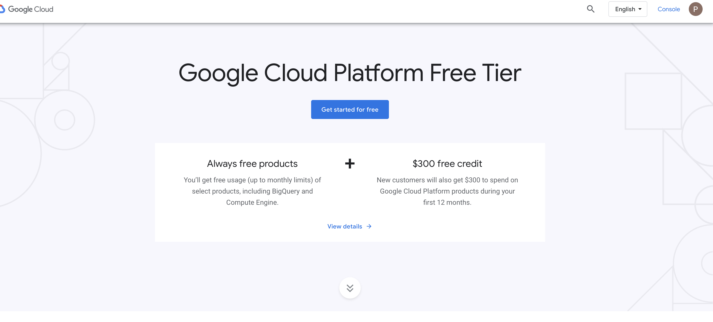
```

---
# Step 2

```{r out.width = '100%', echo = FALSE, fig.align = "center"}
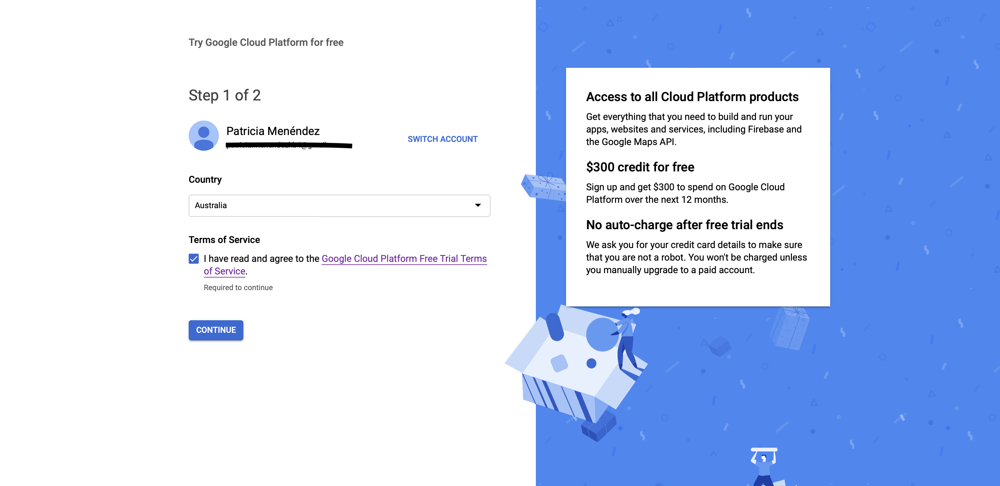
```


---
# Step 3

```{r out.width = '100%', echo = FALSE, fig.align = "center"}
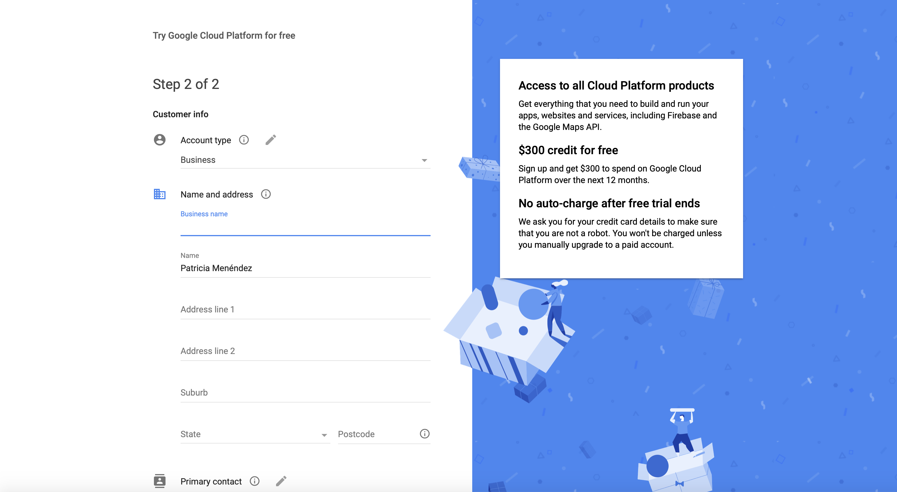
```

---
# Step 4
Create a new project and then 

```{r out.width = '100%', echo = FALSE, fig.align = "center"}

```

---
# Step 5

```{r out.width = '100%', echo = FALSE, fig.align = "center"}
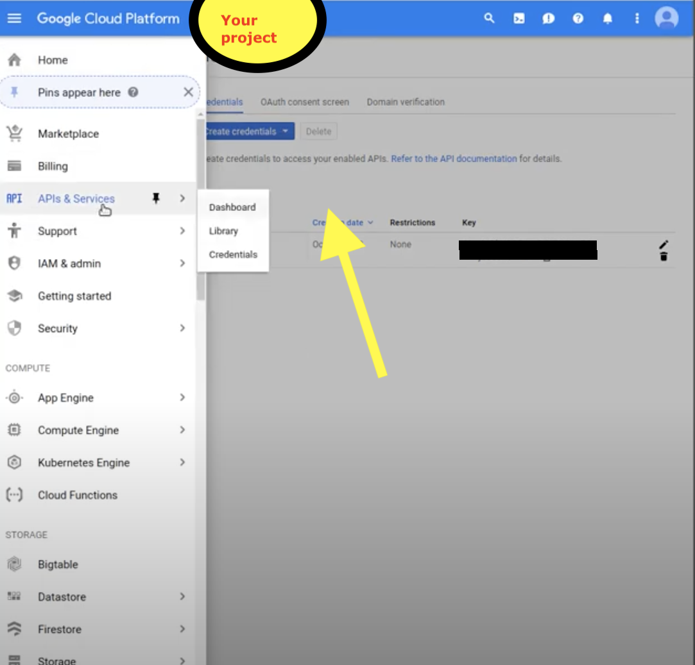
```

---
# Step 6

```{r out.width = '100%', echo = FALSE, fig.align = "center"}
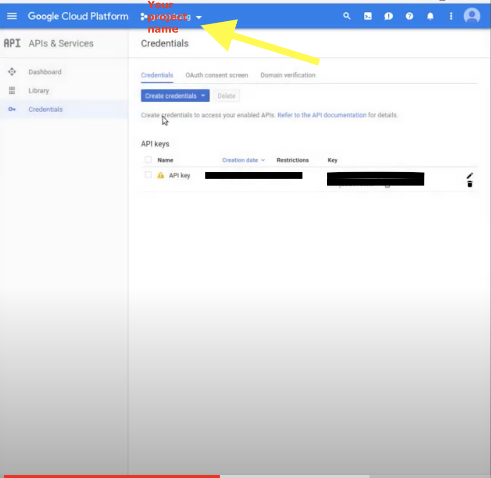
```

---
# Registering your API into ggmaps
<br><br>
- install the *ggmaps* R package
- load the library
- Type in your R console *register_google(key ="your key from Google API")*
- Then ggmap will be fully functional!
---

```{r endslide, child="components/endslide.Rmd"}
```
