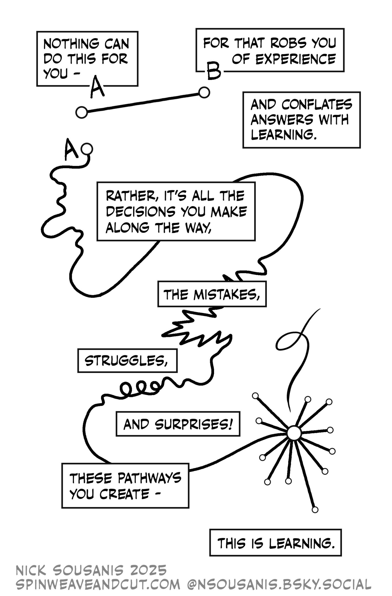
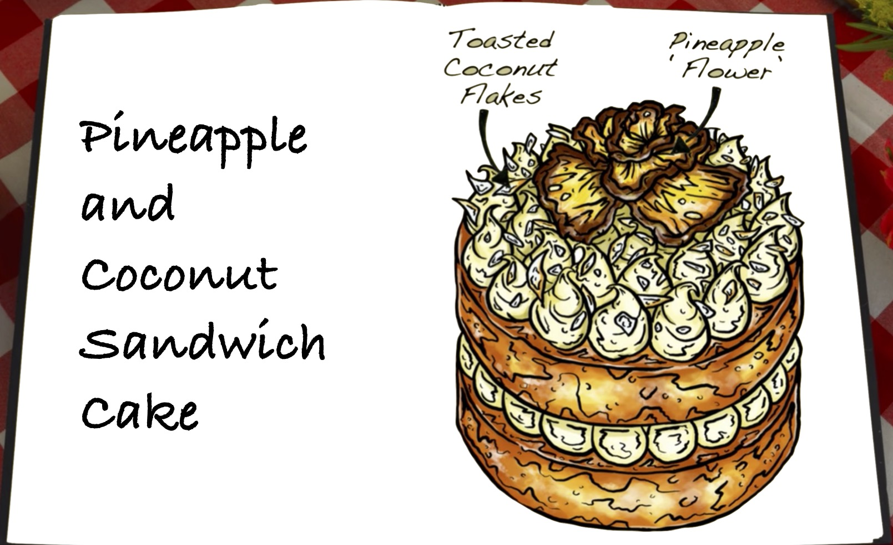

```{r}
if(!require(emoji))
  install.packages("emoji")
library(emoji)
```

## <br>[`r rmarkdown::metadata$pagetitle`]{.monash-blue} {#etc5523-title background-image="images/bg-01.png"}

### `r rmarkdown::metadata$subtitle`

Lecturer: *`r rmarkdown::metadata$author`*

`r rmarkdown::metadata$department`

::: tl
<br>

<ul class="fa-ul">

<li><i class="fas fa-envelope"></i>`r rmarkdown::metadata$email`</li>

<li><i class="fas fa-calendar-alt"></i>
`r rmarkdown::metadata$date`</li>

<li><i class="fas fa-globe"></i>\<a
href="`r rmarkdown::metadata[["unit-url"]]`"\>`r rmarkdown::metadata[["unit-url"]]`</a></li>

</ul>

<br>
:::

## Today's lecture

::: callout-note
## What we'll cover:

-   Unit overview and details

-   An Introduction to Open Data

    -   Societal importance of open data

    -   What makes high quality open data

    -   Learn about the different types of open data

-   Getting you set up in R (Drop In Session)
:::

## Acknowledgement of Country 

:::{.callout-note}
## Acknowledgement of Country

I wish to acknowledge the people of the Kulin Nations, on whose land we are gathered today. I pay my respects to their Elders, past and present.

In this unit, we will learn about how data can be transformed into information, and then into knowledge. And the many different types of data that can be used to understand our world.

Using data to understand our world isn't new. 

First nations peoples have been using data to understand country for generations. Through observing the same environment for thousands of years, they identified cause-and-effect relationships, such as subtle changes in ecosystems, and they have developed a deep understanding of native flora and fauna.

:::

See for example: [Indigenous Seasonal Calendar](https://www.bom.gov.au/resources/indigenous-weather-knowledge/indigenous-seasonal-calendars)

## Shout out to past contributors 

:::{.callout-note}
## Rome wasn't built in a day

This unit has been running since 2020.

Their have been many members of the staff who have contributed to the development of this unit including:

* Prof. Di Cook
* Dr. Emi Tanaka
* Dr. Patricia Menendez 
* Dr. Michael Lydeamore 
* Dr. Joan Tan 
* and many, many more ... 

:::


# Teaching Team {background-color="#006DAE"}

## About your Lecturer

::::: columns
::: {.column width="40%"}
<center></center>

**Kate Saunders**

Lecturer at Monash University

<!-- <i class="fas fa-envelope"></i> krisanat.anukarnsakulchularp@monash.edu -->
:::

::: {.column width="60%"}
-   `r emo::ji("graduation")` PhD in Statistics

-   `r emo::ji("globe")` Home State is Queensland

-   `r emo::ji("coder")` Research is in statistics of climate extremes

-   `r emo::ji("coder")` Passionate about open data, data visualisation
    and data ethics

-   `r emo::ji("coder")` Started R coding in 2012 (before tidyverse!)

-   `r emo::ji("heart")` Hobby is playing basketball.
:::
:::::

## About your Instructor

::::: columns
::: {.column width="40%"}
<center></center>

**Krisanat Anukarnsakulchularp**

PhD Student at Monash University

<!-- <i class="fas fa-envelope"></i> krisanat.anukarnsakulchularp@monash.edu -->
:::

::: {.column width="60%"}
-   `r emo::ji("graduation")` Graduated in Masters in Business Analytics

-   `r emo::ji("graduation")` Monash local since undergrad

-   `r emo::ji("globe")` Home Country is Thailand

-   `r emo::ji("coder")` PhD research is on network visualisation

-   `r emo::ji("coder")` Published an R package called animbook!

-   `r emo::ji("heart")` Hobby is playing music.
:::
:::::

## About your Instructor

::::: columns
::: {.column width="40%"}
<center></center>

**Maliny Po**

Graduated in Masters in Business Analytics
:::

::: {.column width="60%"}
<!-- -   `r emo::ji("graduation")` Graduated in Masters in Business Analytics -->

-   `r emo::ji("graduation")` Undergraduate degree in International
    Trade and Business Logistics.
    <!-- -   `r emo::ji("globe")` Home Country is Thailand -->

-   `r emo::ji("coder")` Former Student in Wild Caught Data.

-   `r emo::ji("coder")` Published a data viz package called
    Sugarglider, as part of the Google Summer of Code program.

-   `r emo::ji("heart")` Enjoys reading books, lego and a good cup of
    coffee.
:::
:::::

## Let's Get to Know Each Other!

::: callout-tip
### Breakout Sesson: Your turn

-   What was your undergraduate degree in?
-   What's your profession or profession you are interested to get in?\
-   What's your hobby?
-   What's a fun fact you want everyone to know (about you)?
-   If you could work with any data set what would it be?
:::

::: notes
Instructor notes: - Give students 2-3 minutes to think about answers -
Have them share in small groups first - Then ask for volunteers to share
with the whole group - Try to identify common interests or unique
backgrounds
:::

::: callout-tip
### Quick tip

Finding connections with your classmates now can lead to great project
collaborations later!
:::

# Unit Details {background-color="#006DAE"}

## About the unit

::: callout-note
## Unit Design

-   2 hours of seminars each week

-   1 hour tutorial each week

-   1 hour workshop each week
:::

. . .

::: callout-caution
-   Expect \~12 hours of contact and study each week

-   We are learning to code. You will need to keep up with the material.
:::

. . .

Coming to classes and consultations will help you!

## Learning Objectives

:::: callout-note
## At the end of this unit you will be able to:

::: incremental
1.  Understand the definitions, allowed usage, digital identification
    and licensing of open data

2.  Know about common open data sources, how they are used and
    effectively search for new sources

3.  Explain the differences between data collection methods and the
    limitations for data analysis

4.  Work with the range of different data formats of open data,
    including APIs

5.  Understand ethical constraints and privacy limits when working with
    open data

6.  Recognise the components of effective curation needed for open data.
:::
::::

## Workshops

:::: callout-note
## Online workshops

::: incremental
-   We'll use these to flesh out ideas from seminars

-   These will be recorded (tutorials will not be)

-   The workshop format will change week to week depending on unit
    needs.

-   Sometimes I'll run through examples and live code.

-   Sometimes I'll answer your questions.

-   Sometimes I'll run through topics to supplement your learning.
:::
::::

## Assessments

:::: callout-note
## Assignments

::: incremental
-   4 assignments worth 25% each (100% of your total grade)

-   Assignment 1 will cover content from weeks 1 to 3 (Due week 4)

-   Assignment 2 will cover content from weeks 4 to 6 (Due week 7)

-   Assignment 3 will cover content from weeks 7 to 9 (Due week 10)

-   Assignment 4 will cover content from weeks 1 to 12 (Due in exam
    block)

-   You'll get at least 2 weeks to complete each assignment.
:::
::::

. . .

::: callout-warning
-   Failure to submit and notify the CE accordingly will result in a
    zero score for the assignment.

-   If you miss two assignments you will need to re-take the unit at a
    later date.
:::

## Assessments

:::: callout-note
## Special Consideration

::: incremental
-   **Apply for [special
    consideration](https://www.monash.edu/students/admin/assessments/extensions-special-consideration)
    centrally.** This includes short extensions of 48 hours.

-   If you need special consideration, apply ASAP and no later than
    11.55 pm on the day your assessment is due.

-   If you miss an assignment through illness or personal difficulty,
    provided you've applied for special consideration there will be
    options for scaling or alternative assessment.
:::
::::

## Unit Resources

<br>

::: callout-note
## Locations

-   [Unit Website](https://wcd.numbat.space/): Everything is displayed
    on the same page and is easy to access

-   [Moodle](https://learning.monash.edu/course/view.php?id=27257):
    Where you submit your assignments, the discussion forum is located
    and I'll make unit announcements.

-   [Unit Github](https://github.com/numbats/wcd): Contains all the
    code, data etc to produce the unit content and website.
:::

# Getting Help {background-color="#006DAE"}

## What happens if you get stuck coding

:::::: columns
:::: {.column width="60%"}
::: {.callout-note minimal="true"}
## Struggle for a while!

Coding is a cycle:

-   Try something
-   Run it
-   Check the output
-   Look at the error message
-   Adjust

Progress comes from iteration!
:::
::::

::: {.column width="40%"}
{fig-align="center"}
:::
::::::

## Generative AI

:::::: columns
::: {.column width="40%"}

:::

:::: {.column width="60%"}
::: callout-tip
## You can use Generative AI in this unit.

-   In fact I encourage it!

-   It's a great tool for those learning to code

-   [Monash Guidance on Gen AI
    use](https://www.monash.edu/student-academic-success/build-digital-capabilities/create-online/using-artificial-intelligence)
:::
::::
::::::

## Generative AI

::::::: columns
::: {.column width="40%"}

:::

::::: {.column width="60%"}
::: callout-tip
## You can use Generative AI in this unit.

-   In fact I encourage it!

-   It's a great tool for those learning to code

-   [Monash Guidance on Gen AI
    use](https://www.monash.edu/student-academic-success/build-digital-capabilities/create-online/using-artificial-intelligence)
:::

::: callout-warning
## But

-   You must never copy and paste output from AI you don't understand or
    can not explain

-   You must always provide appropriate acknowledge of you AI use

-   You need to be careful not to short cut your learning
:::
:::::
:::::::

## Academic Integrity

::: callout-caution
## What does academic integrity mean to you?

<br> <br> <br> <br> <br> <br>
:::

. . .

::: callout-tip
## Still not sure - Monash Resources

What is academic integrity? [Click
here](https://www.monash.edu/students/study-success/academic-integrity)

What does maintaining academic integrity mean? [Click
here](https://www.monash.edu/student-academic-success/learnhq/maintain-academic-integrity)

What happens if I breach academic integrity? [Click
here](https://www.monash.edu/student-academic-success/maintain-academic-integrity/what-happens-if-i-breach-academic-integrity)
:::

## Where to go if you need help

:::::: columns
:::: {.column width="60%"}
::: callout-note
## Ask your peers

**Suitable for:**

<!-- ::: incremental -->

-   There is a discussion forum for general questions and clarifications
    <!-- about course materials, tutorials, R or assignment -->
    <!--     clarifications. -->

-   Emails on general matters will be redirected to the discussion
    forums

    -   Sharing helps you learn from each other!

    -   Prevents me answering the same question twice (three times, four
        times etc.)

-   [**Careful**]{style="color:red;"} about posting code from your
    assignments or any assignment hints to the discussion portal. I may
    deduct marks
:::
::::

::: {.column width="40%"}
{fig-align="center"}
:::
::::::

## Where else to go if you need help

:::::: columns
:::: {.column width="60%"}
::: callout-note
## Attend Consultation

**Suitable for:**

-   Get one-on-one help

-   Working through problems with your tutor

-   Ask questions about your assignments

-   Get help debugging your code

-   Get feedback on your assessments

-   Being really nerdy about the unit!
:::
::::

::: {.column width="40%"}
{fig-align="center"}
:::
::::::

## For personal and urgent inqueries

:::: callout-note
## Unit Email

**Suitable for:**

::: incremental
-   For personal questions or issues email
    ETC5512.Clayton-x\@monash.edu.

-   Response times are within 1 - 2 days but may vary during busy
    periods.

-   Also email if you notice issues with assessments or Moodle.

-   For remarking or to get feedback on your assessment ask your tutor
    and email within 10 days of receiving your marks.

-   [**Do not**]{style="color:red;"} direct emails to my staff account,
    I receive a high volume of high volume of emails and they risk going
    into a black hole and never being seen again!
:::
::::

# Unit Philosophy {background-color="#006DAE"}

## Raw Ingredients or Final Product?

::::: columns
::: {.column width="50%"}
Think about this unit in the way Dr Mine Çetinkaya-Rundel describes in
this talk: ["Let them eat cake
(first)"](https://speakerdeck.com/minecr/let-them-eat-cake-first-b18397a2-9fbd-4bd8-b4b5-a31600c02870?slide=2)

<br> Imagine you're [new to baking]{.monash-blue2}, and you're in a
baking class.

<br> There are two options: [which gives you better sense of the final
product?]{.monash-blue2}
:::

::: {.column width="50%"}
{width="80%"}

{width="80%"}
:::
:::::

## The Cooking Analogy

:::::: columns
:::: {.column width="50%"}
::: callout-note
## The Textbook Learner

-   Studies cuisine history and science first
-   Memorises ingredients and properties
-   Learns techniques one at a time
-   Reads recipes multiple times before attempting
-   Measures everything precisely
-   Understands the chemistry
-   Follows instructions to the letter
:::
::::

::: {.column width="50%"}
{width="80%"}
:::
::::::

## The Cooking Analogy

:::::: columns
:::: {.column width="50%"}
::: callout-note
## The Example Learner

-   Watches experienced cooks in action
-   Jumps in and recreates dishes they've seen
-   Learns through trial and error
-   Focuses on outcome rather than process
-   Builds intuition through observation
-   Develops "feel" through practice
-   Adapts recipes based on experience
:::
::::

::: {.column width="50%"}
{width="80%"}
:::
::::::

## How Do You Learn Best?

::: callout-caution
## Breakout Discussion

-   Which learning approach feels more natural to you?

-   Discuss the advantages of each

:::

## Unit Philosophy

<br>

:::: callout-tip
## Cakes and Case Studies

::: incremental
-   The case studies you will see in this unit are the cakes.

-   By showing you what these case studies look like (cakes), we are
    helping you learn how to perform your own data analysis studies by
    example!

-   This may be different to how you've learnt in the past.

-   Please approach this unit philosophy with openness.

-   And for textbook learners: Check out the [textbook R for data
    science](https://r4ds.hadley.nz/)
:::
::::

# Open Data {background-color="#006DAE"}

## Open Data is ...

<br><br>

::: callout-tip
## Open data is ... [^1]

-   a raw material for the digital age but,

-   it's unlike coal, timber or diamonds,

-   it can be used by anyone and everyone at the same time.
:::

[^1]: https://www.europeandataportal.eu/elearning/en/module1/#/id/co-01

## From the Open Data Institute

<br>

<center>

<iframe src="https://player.vimeo.com/video/129196637?h=075ff25ed2&amp;title=0&amp;byline=0&amp;portrait=0" width="640" height="360" frameborder="0" allow="autoplay; fullscreen; picture-in-picture" allowfullscreen>

</iframe>

<p><a href="https://vimeo.com/129196637">Open Data Institute - Dave
Tarrant - EDP Module 1</a> from
<a href="https://vimeo.com/theodiuk">Open Data Institute</a> on
<a href="https://vimeo.com">Vimeo</a>.</p>

</center>

## What makes data open?

::: {.callout-note appearance="minimal"}
**Open data is measured by what it can be used for, not by how it is
made available.**
:::

:::: callout-note
## Open Data Considerations

::: incremental
-   **No limitations** that prevent particular uses.

-   Anyone free to use, modify, combine and share, even commercially.

-   Free to use does not mean that it must be free to access.

-   **There is a cost** to creating, maintaining and publishing usable
    data.

-   Live data, big data and data from generative AI can incur ongoing
    costs.

-   **Free to use, reuse and redistribute** it - even commercially.
:::
::::

## Definition open data

::: {.callout-note appearance="minimal"}
Open data can be freely used, modified, and shared by anyone for any
purpose
:::

:::: callout-note
## Two types of data openness:

::: incremental
-   The **data must be legally open**, which means they must be placed
    in the public domain or under liberal terms of use with minimal
    restrictions.

-   The **data must be technically open**, which means they must be
    published in electronic formats that are machine readable and
    non-proprietary, so that anyone can access and use the data using
    common, freely available software tools. Data must also be publicly
    available and accessible on a public server, without password or
    firewall restrictions. [^2]
:::
::::

[^2]: http://opendefinition.org/

## Concept Check

<br><br>

::: callout-note
## Pop Quiz! `r emo::ji("heart")`

Try the quizzes
[here](https://www.europeandataportal.eu/elearning/en/module1/#/id/co-01)
:::

# More on Open Data {background-color="#006DAE"}

## Why do we need open data?

::: {.callout-note appearance="minimal"}
## Help make governments more transparent!

-   Open data allowed citizens in Canada to save the government billions
    in fraudulent charitable donations
:::

. . .

::: {.callout-note appearance="minimal"}
## Building new business opportunities

-   Transport for London has released open data that developers have
    used to build over 800 transport apps.
:::

. . .

::: {.callout-note appearance="minimal"}
## Protecting people and our environment

-   Open data can support early warning systems for environmental
    disasters
-   Open data is also helping consumers to understand their personal
    impacts on the environment
:::

[Resource](https://opendatahandbook.org/guide/en/why-open-data/)

## Where do I find Open Data?

::: callout-note
## Globally

-   http://dataportals.org/search
-   http://data.un.org/
-   https://datacatalog.worldbank.org/
-   https://data.gov/ (US)
-   https://opendataimpactmap.org/eap (EAP)
:::

::: callout-note
## Australian governement examples:

-   http://www.data.gov.au/
-   https://www.data.vic.gov.au/
-   https://data.melbourne.vic.gov.au/
:::

And so many more places ...

## Wait ...

<br>

How do I tell if data I find is open?

. . .

::: callout-important
## Licences!

Licences tells people how they can access, use and share data.
:::

## Why license open data?

::: callout-note
## Licenses

-   Without a licence, users may find themselves in a legal grey area.

-   Data may be 'publicly available', but users may not have permission
    to access, use and share it under general copyright or database
    laws.

-   An open data licence is an explicit permission to use the data for
    both commercial and non-commercial purposes.

-   Open data publishers should provide easy access to the licence for
    all datasets that are available to access, use and share.

-   Organisations and governments use Open Data licenses to clearly
    explain the conditions under which their data may be used.
:::

## Open data licenses

::: callout-note
## Examples include:

**Standard re-usable license:** consistent and broadly recognised terms
of use

-   Creative Commons, particularly CC-By and CC0
    https://creativecommons.org/

-   Open Database License https://opendatacommons.org/licenses/odbl/

**Bespoke licenses:** e.g. for governments, international organisations

-   UK Open Government License
    http://www.nationalarchives.gov.uk/doc/open-government-licence/version/3/
-   The World Bank Terms of Use
    https://data.worldbank.org/summary-terms-of-use
:::

. . .

::: callout-tip
## TLDR

Many licenses have a **summary version** that helps convey the most
important information to users **and** a **detailed version** that
provides the complete legal foundation.
:::

## Quick comment

<br>

::: callout-tip
## Licence type

-   Standard licenses can offer several advantages over bespoke
    licenses.

-   Standard licences have greater recognition among users, increased
    interoperability, and greater ease of compliance.
:::

## Concept Check

<br><br>

::: callout-note
## Pop Quiz! `r emo::ji("heart")`

Try the quizzes
[here](https://www.europeandataportal.eu/elearning/en/module4/#/id/co-01)
:::

# How do I tell if Open Data is any good? {background-color="#006DAE"}

## Metadata: data about data

::::::: columns
:::: {.column width="50%"}
::: callout-tip
## Information components

-   Source
-   Structure
-   Underlying methodology
-   Topical
-   Geographic and/or temporal coverage
-   License
-   When it was last updated
-   How it is maintained
:::
::::

:::: {.column width="50%"}
::: callout-note
## Standards frameworks

-   Dublin Core Metadata Initiative (DCMI) provides a framework and core
    vocabulary of metadata terms
    -   [dublincore.org](https://www.dublincore.org/)
-   Governments develop metadata models for uniformity
    -   [project-open-data.cio.gov](https://project-open-data.cio.gov/v1.1/schema/)
-   Australian government metadata standards
    -   [National
        Archives](https://www.naa.gov.au/information-management/information-management-standards/australian-government-recordkeeping-metadata-standard)
    -   [AIHW](https://www.aihw.gov.au/about-our-data/metadata-standards)
:::
::::
:::::::

## Examples from Canadian government

::::::: columns
:::: {.column width="40%"}
::: callout-tip
### Example datasets

-   [Resettled
    refugees](https://open.canada.ca/data/en/dataset/4a1b260a-7ac4-4985-80a0-603bfe4aec11)
-   [Canada emergency wage subsidy
    (CEWS)](https://open.canada.ca/data/en/dataset/f713389f-ab1c-4be4-bade-05f71ed110fe)
:::
::::

:::: {.column width="60%"}
::: callout-note
### Key metadata elements

-   **Title**: what data contains and where it comes from
-   **Description**: details to quickly understand relevance
-   **Publisher**: who originated and maintains the dataset
-   **License**: terms of use
-   **Contact information**: for questions or clarification
-   **Frequency**: interval data is updated
-   **Date modified**: last update timestamp
-   **Spatial coverage**: relevant geographic area
-   **Temporal coverage**: time period covered
-   **Open data formats**: available file formats
:::
::::
:::::::

## Machine Readable

::: callout-warning
## 'machine readable' is not the same as 'digitally accessible'

Historical efforts have focused on:

-   pushing static information about government programs and services to
    the web,

-   where the intended use is a human who can read, print, and take
    actions based on reading.

-   It's a narrow vision of the expected users and uses of the data.
:::

## Machine Readable

::: callout-note
## Machine Readable

-   Machine readable formats expand field of vision to new users and new
    uses and require technologies like XML and JSON
    -   😿 PDF is not suitably machine readable
    -   😀 CSV (or XLSX, XLS) is common, and universally accessible, but
        should be structured for analysis not for reading
    -   😸 XML, JSON is verbose, can contain metadata, but needs special
        readers
    -   🤩 API provides an interface that other software can utilise to
        automatically extract and process
:::

## Five star open data scheme

::: callout-note
## 5 `r emo::ji("star")` ratings:

This [web site](https://5stardata.info/en/) 5 `r emo::ji("star")`: Open
Data at provides a rating system for deploying open data.

-   `r emo::ji("star")` [An open license]{.monash-blue}.\
    *Make your stuff available on the Web (whatever format) under an
    open license*

-   `r rep(emo::ji("star"), 2)` [Re-usable format]{.monash-blue}.\
    *Make it available as structured data (e.g., A proprietary format
    like excel instead of image scan of a table.)*

-   `r rep(emo::ji("star"), 3)` [Open format]{.monash-blue}.\
    *Make it available in a non-proprietary open format (e.g., CSV
    instead of Excel)*

-   `r rep(emo::ji("star"), 4)` [use (Uniform Resource Identifiers
    (URIs)]{.monash-blue}.\
    *URIs help you reference your data, like a unique address and gives
    context to the values.*

-   `r rep(emo::ji("star"), 5)` [Linked data]{.monash-blue}\
    *Your data doesn't exist in isolation. Your data links/ connects to
    other relevant data sets.*
:::

## FAIR principles for scientific data

Learn more at [fair.org](https://www.go-fair.org/fair-principles/)

:::: callout-note
## FAIR Principles

::: incremental
-   **Findable** Metadata and data should be easy to find for both
    humans and computers. Machine-readable metadata are essential for
    automatic discovery of datasets and services.

-   **Accessible** Once the user finds the required data, they need to
    know how can they accessed that data, possibly including
    authentication and authorisation.

-   **Interoperable** The data usually need to be integrated with other
    data. In addition, the data need to interoperate with applications
    or workflows for analysis, storage, and processing.

-   **Reusable** The ultimate goal of FAIR is to optimise the reuse of
    data. To achieve this, metadata and data should be well-described so
    that they can be replicated and/or combined in different settings.
:::
::::

## Publishing data

::: callout-note
## Publishing Your Data

-   Research data is increasingly seen as part of the corpus of
    scholarly publications.

-   Publishers, funders and governments support researchers to publish
    their data outputs by various policies, guidelines and mandates.

-   Obtaining a Digital Object Identifier system (DOI) provides a
    persistent identifier, and can be used for data. Two services in
    Australia:

    -   [Australian Research Data Commons
        (ARDC)](https://ardc.edu.au/services/identifier/) can generate a
        DOI for you.
    -   [Australian National Data
        Service](https://www.ands.org.au/online-services/doi-service)

-   Many open data sets provide information on how to cite them, when
    used in other forms of publication.

-   See more guidelines at
    [ARDS](https://www.ands.org.au/working-with-data/publishing-and-reusing-data/publishing)
    and [ARDC](https://ardc.edu.au/services/research-data-australia/).
:::

## Open data quality

::: callout-caution
## Legal requirements:

-   Protect sensitive information like personal data
-   Preserve the rights of data owners
-   Promote correct use of the data
:::

. . .

::: callout-caution
## Practical requirements:

If you provide a link to the data on a website:

-   Update the data regularly if it changes
-   Commit to continuing to make the data available
:::

. . .

::: callout-caution
## Technical requirements:

-   Think about the structure/format in which the data is published
-   The channels through which the data is available
:::

## Common pitfalls with open data

::: callout-warning
## Watch out for:

-   Mixed date formats american/european
-   Multiple representations differences in abbreviations,
    capitalisation, spacing
-   Duplicate records
-   Redundant data
-   Mixed numerical scales
-   Spelling errors
-   Inconsistent naming
-   Missing values
:::

## What is hidden data?

<br>

<center>

<iframe src="https://player.vimeo.com/video/129197208?h=8f24e0dabc&amp;title=0&amp;byline=0&amp;portrait=0" width="640" height="360" frameborder="0" allow="autoplay; fullscreen; picture-in-picture" allowfullscreen>

</iframe>

<p><a href="https://vimeo.com/129197208">Open Data Institute - Dave
Tarrant - EDP Module 12</a> from
<a href="https://vimeo.com/theodiuk">Open Data Institute</a> on
<a href="https://vimeo.com">Vimeo</a>.</p>

</center>

Let's look at https://www.realestate.com.au/buy

## Concept Check

<br><br>

::: callout-note
## Pop Quiz! `r emo::ji("heart")`

Try the quizzes
[here](https://www.europeandataportal.eu/elearning/en/module12/#/id/co-01)
:::

## Some more examples of open data

:::{.callout-note appearance="minimal"}

-   Airline traffic in the USA https://www.bts.gov
    <!-- info about data policy https://www.transportation.gov/mission/digital-government-strategy-4 -->
-   Australian Bureau of Statistics http://stat.data.abs.gov.au
-   Australian Electoral Commission https://www.aec.gov.au
-   National Longitudinal Survey of Youth (NLSY)
    https://www.nlsinfo.org/investigator/pages/search?s=NLSY79
-   Atlas of Living Australia https://www.ala.org.au
-   Australian bushfires from satellite hotspot remote sensing
    https://www.eorc.jaxa.jp/ptree/registration_top.html (also see
    resulting analysis at https://ebsmonash.shinyapps.io/VICfire/)
-   John Hopkins Coronavirus tracking https://coronavirus.jhu.edu/data
-   OECD Programme for International Student Assessment
    http://www.oecd.org/pisa/data/
-   Melbourne pedestrian counting system
    http://www.pedestrian.melbourne.vic.gov.au/

:::

## In your own time

::: callout-note
## Exercise

Look at these open data examples:

-   Consider the interface

-   Look for licensing

-   Find explanations of what's in the data

-   Review the meta data
:::

# Flavours of Open Data {background-color="#006DAE"}

[This is Prof Di Cook's taxonomy!]{style="color: white;"}

##  {background-image="images/lecture-01/food_on_shelf.jpg" background-size="cover"}

<!-- https://upload.wikimedia.org/wikipedia/commons/thumb/e/e2/Food_on_shelf.jpg/1600px-Food_on_shelf.jpg -->

<br><br><br>

<center>

::: {.callout-note style="background-color: white; width: 50%;"}
## Long shelf life, highly processed

-   Convenient, but contains unhealthy ingredients, and is a bad habit
-   eg iris, mtcars, titanic, handwritten digits
-   Found at eg [UCI Machine learning
    archive](https://archive.ics.uci.edu/ml/datasets.php)
:::

</center>

##  {background-image="images/lecture-01/abandoned_car_CC.jpg" background-size="cover"}

<!-- https://upload.wikimedia.org/wikipedia/commons/thumb/a/ae/Abandoned_Car_%282654024518%29.jpg/1600px-Abandoned_Car_%282654024518%29.jpg -->

<br><br><br>

<center>

::: {.callout-note style="background-color: white; width: 50%;"}
## Orphans

-   File dumped on an archive
-   Stale, could date your results
-   Sadly often found in places like <https://data.gov.au>
:::

</center>

##  {background-image="images/lecture-01/Artificial_Putting_Green.jpg" background-size="cover"}

<!-- https://upload.wikimedia.org/wikipedia/commons/thumb/0/03/Artificial_Putting_Green.JPG/1134px-Artificial_Putting_Green.jpg -->

::: {.callout-note style="background-color: white; width: 50%;"}
## Synthetic

-   Used primarily these days for privacy protection
-   Correct up to the model used to simulate the data - misses
    interesting structure in data not captured by model
-   Very pretty, very consistent, but it can burn you
-   eg [OECD Programme for International Student
    Assessment](https://www.oecd.org/pisa/data/) A generalised linear
    model is fitted to the scores, with predictors such as school,
    gender, ... Model is used to simulate a score for each student.
-   eg Also be aware of fraud [Article in the Lancet
    (2020)](https://bit.ly/3IzOx4u)
:::

##  {background-image="images/lecture-01/Numbat_Full_Standing.jpg" background-size="cover"}

<!-- https://commons.wikimedia.org/wiki/File:Numbat_Full_Standing.jpg -->

<br><br><br><br><br>

::: {.callout-note style="background-color: white; width: 50%; float: right; clear: right;"}
## Wild

-   Fresh, interesting, exciting

-   But also challenging!

-   Real world data sets, with real world messiness

-   eg [US Bureau of Transportation Statistics air traffic
    database](https://www.transtats.bts.gov/DL_SelectFields.asp?Table_ID=236)
:::

##  {background-image="images/lecture-01/South_Melbourne_market_outside_1a.jpg" background-size="cover"}

<!-- https://upload.wikimedia.org/wikipedia/commons/thumb/a/a1/South_Melbourne_market_outside_1a.jpg/1056px-South_Melbourne_market_outside_1a.jpg -->

<br><br>

<center>

::: {.callout-note style="background-color: white; width: 50%;"}
## Fresh and local

-   Best kind of wild data

-   Collected locally, and about our own lives

-   eg [Melbourne pedestrian
    counts](https://cran.r-project.org/web/packages/rwalkr/index.html)
:::

</center>

## Wild-caught data

:::: callout-important
## Our working definition of **wild caught data** is:

::: incremental
-   data the can be freely used, modified, and shared by anyone for any
    purpose, AND

-   The data source is traceable, the data collection is transparent,
    and the data is updated as new measurements arrive, AND

-   In case of data processing, the process is clearly described and
    reproducible.
:::
::::

## What about your favourite datasets?

:::: callout-important
## Are they Wild?

::: incremental
-   `r emo::ji("check")` Freely available to be used and modified

-   `r emo::ji("check")` Can be shared

-   `r emo::ji("check")` Data provenance is clear

-   `r emo::ji("check")` How the data was collected is transparent

-   `r emo::ji("check")` Data is updated as new measurements become
    available

-   `r emo::ji("check")` Any processing of this data is clear
:::
::::

# Wrap Up {background-color="#006DAE"}

## Summary

:::: callout-note
## Open data: definitions, sources and examples

::: incremental
-   Introduced you to the Open Data Fundamentals\
    *eg. power for societal good, where to access, limitations,
    licences*

-   Data Quality Elements\
    *eg. meta data, machine readable, FAIR, five star ratings*

-   Wild Caught Data Meaning\
    *and other flavours of open data*

-   Teaching philosophy of cake first!
:::
::::

# Workshop Slides {background-color="#006DAE"}

## Learning R

::: callout-note

## Getting set up

-   By the end of this unit you'll be performing your own analytics case

    studies

-   Before you can do that we need to get you set up with the software

    you'll use in this unit

-   We'll now go through the steps to install R and RStudio

-   Think about R as the engine and RStudio as the dashboard and

    controls.

-   We need both to drive a car.

:::

## Installing R and RStudio

We'll open RStudio to perform data analytics using R.

::: callout-note

## Step 1: Install R

-   Got to https://www.r-project.org/

-   Click "download R"

-   Select a mirror (I use the Melbourne one)

-   Install for your operating system

:::

::: callout-note

## Step 2: Install RStudio

-   Got to https://www.rstudio.com/products/rstudio/download/ (you only

    need the free version)

-   Select download for your system

-   Follow the prompts to install

:::

## But Why?

::: callout-note

## Why do we need a Programming Language

-   It allows us to have reproducible steps, which can be applied for many different data sets

-   Make sure the analysis is not just point and click, you can work as a team on it on the same code

-   It also means we can more easily perform our own case studies in analytics

:::

::: callout-note

## Why do we use R?

-   It has been around for a while.

-   It is regularly maintained and is open source.

-   It is beginner friendly

-   Even if you use other languages, you might still use R for your data wrangling and visualisations

:::

## Getting Started in R

:::: callout-note

## Learning a new language is hard!

::: incremental

-   You need to think about grammar and structure, and how to communicate well in it!

-   You will make mistakes, lots of them.

-   Below you see code that plots points showing the GDP per capita against life expectancy. The points are coloured by country and the size of the points shows the population.

-   It might look impossible now, but by the end of this semester you will be able to write this yourself!

:::

::::

```{r, eval = FALSE, echo = TRUE}

library(tidyverse)

library(gapminder)

plot <- ggplot(data = gapminder) +

  geom_point(aes(x = gdpPercap, y = lifeExp, size = pop, colour = country)) +

  theme(legend.position = "none")

plot

```

## Check your understanding

:::callout-note

* R vs RStudio
* Console vs Script
* Assigning a variable
* Basic computation
* Naming variables 
* Installing and loading packages
* Setting up an R Project
* Reading in data

:::

## Code from today

```{r}
#| eval: false
#| echo: true

# create a file that I can save and use again

# assign a variable
x = 2
y <- 3

# what should I not call my variable
kates_coolest_variable <- 4 # snake_case
katescoolestvariable <- 4 # ok but not readable
KatesCoolestVariable <- 4 # ok but could be easier to read
123kate <- 5 # bad
@kate <- 5 # also bad

kates_awesome_variable <- 5
kate_loves_R <- 6

# what we learn:
# give variables files/intuitive names
# don't name variable starting with numbers or 
# or special characters 

# bunch of inbuilt functions 
sqrt(2)
1:10
mean(1:10)

# load in the functions
library(cowsay)

# check what they do
?cowsay
?say

# look at examples
say(what = "hot diggity", by = "frog")

say(what = "Happy Lunar New Year", 
    by = "endlesshorse")

# Summary: 
# Install the cowsay package (first time use)
# Load the library
# print out a say - with an animal and a message
# past into our meeting chat

# Reading in files 

# Can use the import dataset button
# but not advisable for reproducible reserach 

# Can also use a direct file path 
# But if you change the working directory 
# the data read fails
library(tidyverse)
file_path = "Documents/Git/dvac-SSA/assignments/data/tourism_data.csv"
tourism_data <- read_csv(file_path)
View(tourism_data)

# Instead set up the project
# Then the working directory will be that project
# No need for long path names
getwd()
tourism_data <- read_csv("data/tourism_data.csv")
View(tourism_data)
```

