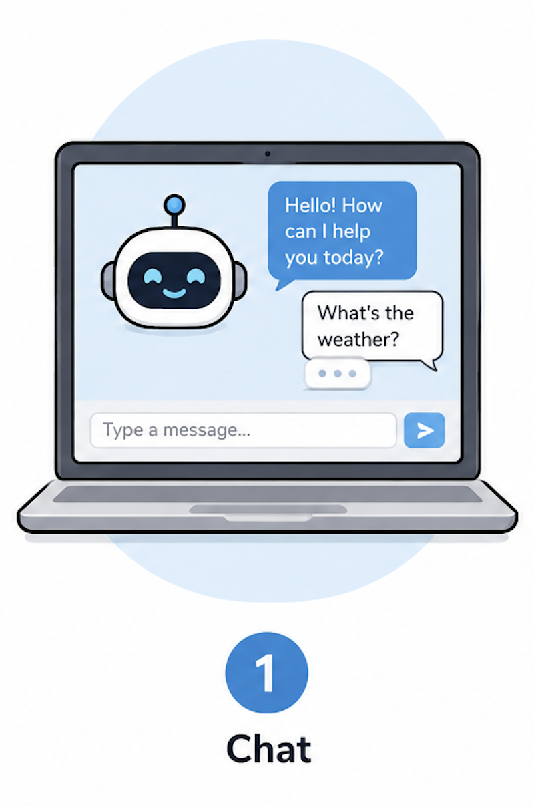
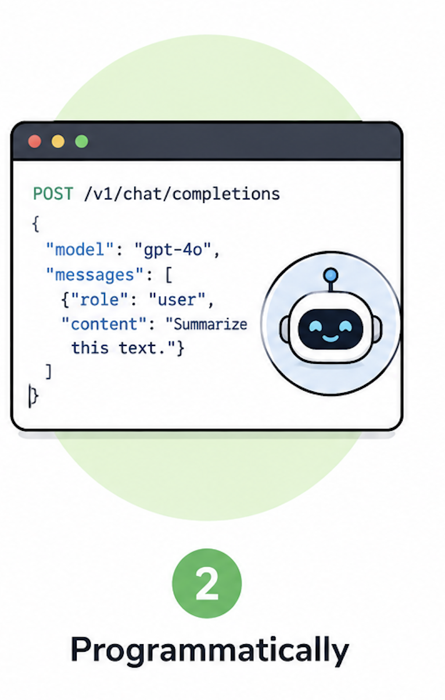
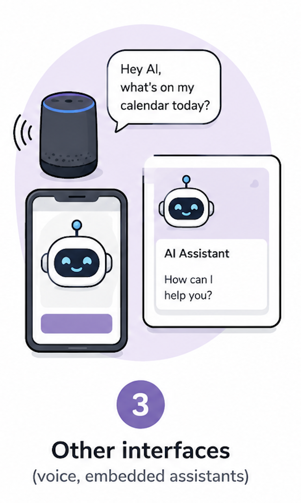
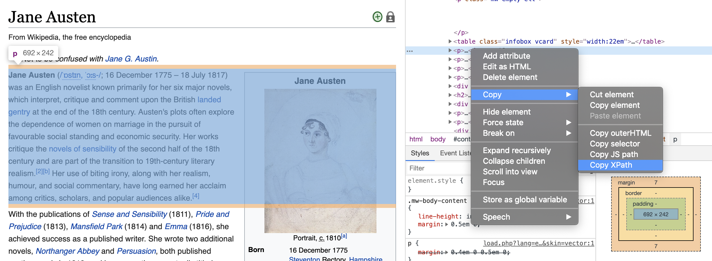

```{r}
library(tidyverse)
```

## <br>[`r rmarkdown::metadata$pagetitle`]{.monash-blue} {#etc5523-title background-image="images/bg-01.png"}

### `r rmarkdown::metadata$subtitle`

Lecturer: *`r rmarkdown::metadata$author`*

`r rmarkdown::metadata$department`

::: tl
<br>

<ul class="fa-ul">

<li><i class="fas fa-envelope"></i>`r rmarkdown::metadata$email`</li>

<li><i class="fas fa-calendar-alt"></i>
`r rmarkdown::metadata$date`</li>

<li><i class="fas fa-globe"></i>`r rmarkdown::metadata[["unit-url"]]`</li>

</ul>

<br>
:::

## Today's lecture

::: callout-note
## What we'll cover

We'll develop your understanding of: 

- What LLMs are

- Different types of data tasks that LLMs can help with

- How to use and check LLMs for specific data preparation tasks

:::

. . .

::: callout-note
## Coding Perspective:

Programmatically discuss:

- how to interact with LLMs in R using {ellmer}

:::

## Disclaimer 


The information presented in these slides reflects the state of AI technology at the time of creation. This field is evolving rapidly.


## Acknowledgement 

<br>
This lecture was adapted from a [guest lecture](https://github.com/cynthiahqy/lecture_llms-preparing-data-ellmer/blob/main/slides.qmd) developed and delivered by
[Dr. Cynthia Huang](https://github.com/cynthiahqy/lecture_llms-preparing-data-ellmer/blob/main/slides.qmd) for Wild Caught Data from 2025.

# About LLMs {background-color="#006DAE"}

## Generative AI and LLMs

::: {.columns}
::: {.column}
<!-- definitions generated with help from Claude AI -->

:::callout-note
## Generative AI refers to ... 

computer algorithms and systems that can generate content. 

Content includes text, images and sound 

This is based on patterns learnt from existing data

:::

::: {.callout-note appearance="minimal" .fragment}
Today, we will focus on **text** generation using Large Language Models (LLMs).
:::

:::
::: {.column}

:::
:::

## What are Large Language Models?

::: {.columns}

::: {.column}
::: {.callout-note appearance="minimal"}
We often understand tools by what they can do for us, not how they work. 
:::


:::{.fragment}
LLMs are...

::: incremental
- code writers?
- encyclopedias?
- assignment help?
- translators?
:::
:::

:::
::: {.column .fragment}

::: {.callout-note appearance="minimal"}
Consider a dishwasher: Do you know how it works? Or, do you know what does?
:::

<center>
{width=65%}
</center>

<!-- What does a dishwasher DO? vs. How does a dishwasher WORK? -->
:::
:::

## Which model should I use?

::: {.columns}
::: {.column}
LLM providers offer paid and free access to multiple models:

- **OpenAI**: [GPT-3 and 4, o-series](https://platform.openai.com/docs/models/compare), 
- **Anthroptic**: [Claude Haiku, Sonnet and Opus](https://docs.anthropic.com/en/docs/about-claude/models/overview)
- **Google**: [Gemini Flash and Pro](https://cloud.google.com/vertex-ai/generative-ai/docs/models)
- **Meta**: [Llama 3, Llama 4](https://www.llama.com/docs/model-cards-and-prompt-formats/)
- **Alibaba**: [Gwen 2.5, 3, Max, Plus and Turbo](https://www.alibabacloud.com/en/solutions/generative-ai/qwen?_p_lc=1--------)

:::
::: {.column}

:::{.callout-note .fragment}
## Different models are designed to be good at different things

::: incremental

- chain-of-thought reasoning vs. instruction following
- multimodal support: images, audio, video and text
- multilingual processing: translation, content generation
- specific domains: medicine, finance, legal

:::

:::
:::
:::

## Model differentiation

Learn more about picking the right tool:

- [🎙️ Beyond ChatGPT: The Rapidly evolving landscape of AI](https://www.therandomsample.com.au/podcast/beyond-chatgpt-ai-landscape/)
- [💡 Suggestions on provider/model choice in 'ellmer' docs](https://ellmer.tidyverse.org/index.html#providermodel-choice)
- [📖 OpenAI Model Selection Guide](https://cookbook.openai.com/examples/partners/model_selection_guide/model_selection_guide)
- [📖 Anthropic Claude Model Comparison Table](https://docs.anthropic.com/en/docs/about-claude/models/overview#model-comparison-table)


<!-- - domain-specific: biomedical ([bioBERT](https://academic.oup.com/bioinformatics/article/36/4/1234/5566506)), finance, legal, scientific)
- task-specific (summarisation, question-answering, content creation)
- multimodal models (text and images - incl. video)
- multilingual -->

## How can we interact with LLMs?

::: {.columns}
::: {.column width="45%"}
{width=65%}
:::
::: {.column width="55%"}

:::{.callout-note appearance="minimal"}
## 1. Web-based Chat Interface

- [ChatGPT](https://chatgpt.com), [Claude AI](https://claude.ai/), [Qwen Chat](https://chat.qwen.ai)
- offers additional formatting of outputs, access to tools, other 'quality of life' features

:::

:::

:::

## How can we interact with LLMs?

::: {.columns}
::: {.column width="45%"}
{width=65%}
:::
::: {.column width="55%"}

:::{.callout-note appearance="minimal"}

## 2. Programmatic Interfaces

- requires an API key
- interact using code with an LLM from within an R session

:::

:::

:::

## How can we interact with LLMs?

::: {.columns}
::: {.column width="45%"}
{width=65%}
:::
::: {.column width="55%"}

:::{.callout-note appearance="minimal"}

## 3. Other interfaces

- mobile (chat) applications
- voice assistants
- embedded LLMs (e.g. suggestions in Gmail)

:::

:::{.callout-note appearance="minimal" .fragment}
Today we will use web-based chat. e.g.

- [chatgpt.com](https://chatgpt.com)
- [claude.ai](https://claude.ai/),

And, we will demo how to programmatically access AI via [`{ellmer}`](https://ellmer.tidyverse.org)

:::

:::
:::


## How do we verify what LLMs are doing?

::: {.columns}
::: {.column}

For a dishwasher, we consider:

::: {.incremental fragment-index=1}
- **...are the dishes clean?**
- **is there any dirt on the dishes?**
:::

[For LLMs...?]{.fragment}

[It depends on the (data) task!]{.fragment}

:::
::: {.column}

{width=65%}
:::
:::

# Using LLMs for Data Analysis {background-color="#006DAE"}

## General analysis workflow 


> Wickham, H., & Grolemund, G. (2017). R for data science (Vol. 2). Sebastopol: O'Reilly.

## Closer look

:::callout-note 
## What are common WCD tasks?

::: incremental 

* **Import** - learning what data exists, its structure, how it was collected and its limitations

* **Tidying** — formatting your data ready for analysis 

* **Cleaning** - fixing errors, duplicates, missing values, inconsistencies 

* **Transforming** — reshaping, aggregating, summarising, creating new variables

* **Visualisation** - using plots to understand relationships in your data and share your findings

* **Analyse** — using statistical or descriptive methods, including hypothesis testing and building models

* **Documenting your data** - recording what your data contains, where it came from, how it was cleaned, and any decisions made along the way so others (and your future self) can understand and trust it!

:::

:::

## Break out discussion 

::: callout-note
## Discuss in groups

<!-- - What tasks are involved in preparing data for analysis? _List at least 3._ -->

- Which of these tasks might be more or less suitable for using with LLMs? Why?

<!-- - What would you think about when writing prompts (i.e. chatting with an LLM) for these tasks?  -->
:::

```{r}
#| fig-align: center

library(ggplot2)

ggplot() +
  geom_segment(
    data = data.frame(x = 1:1000),
    aes(x = x, xend = x + 1, y = 0, yend = 0, color = x),
    linewidth = 20
  ) +
  scale_color_gradient(low = "red", high = "green") +
  scale_x_continuous(
    breaks = c(1, 500, 1000),
    labels = c("Not suitable", "Moderate", "Highly suitable"),
    expand = expansion(mult = 0.15)
  ) +
  theme_minimal() +
  theme(
    axis.title = element_blank(),
    axis.text.y = element_blank(),
    axis.ticks.y = element_blank(),
    panel.grid = element_blank(),
    legend.position = "none",
    axis.text.x = element_text(size = 24)
  )
```

<!-- What tasks are involved in turning Wild Caught Data into analysis-ready data? -->

## Using LLMs for Data Preparation Tasks

:::{.callout-note appearance="minimal" .fragment}
## 1. Generating data wrangling code
- An "indirect" use — LLMs write the code that cleans your data, rather than touching the data directly
:::

:::{.callout-note appearance="minimal" .fragment}
## 2. Creating and converting data
- Generating example datasets (e.g. when documenting a custom R function)
- Converting data between formats (e.g. CSV to JSON)
:::

:::{.callout-note appearance="minimal" .fragment}
## 3. Modifying and augmenting existing data
- Filling in missing values (tutorial)
- Correcting typos or inconsistencies
- Deriving new columns from existing ones
:::

## Let's look at some examples

:::{.columns}

:::{.column}

:::{.callout-note appearance="minimal" .fragment}

## Filling in missing data:

  - **'look up' facts:** author nationality: `Jane Austen`
  - **suggesting values:** missing volume units for drinks: `300?`
  
::: 

:::{.callout-note appearance="minimal" .fragment}
## Correct typos or inconsistencies
  
  - **harmonise different abbreviations:** `{Victoria, VIC, Vic}` --> `{VIC}`
  
:::

:::

::: {.column}

:::{.callout-note appearance="minimal" .fragment}
## Creating new columns based on existing ones

  - **comparison and categorisation:** are `teachers` and `instructors` similar occupations?
  - **summarise text:** key points in free-form survey responses
  - **extract info**: name of the movie in a film review
  
:::

:::
:::

## Prompts for Data Preparation Tasks

::: {.columns}
::: {.column .incremental}
- prompts need to include:
  - instruction and data!
- responses would ideally:
  - return data of the expected type
  - and in a easy to import format
  
:::
::: {.column .fragment}
::: {.callout-note}
## Try yourself!

1. Pick a starting prompt from the next page
2. Fill in the necessary data.
3. Try the prompt in your choice of LLM chat (e.g. ChatGPT, Qwen Chat, Claude AI etc.). 
    - What output did you get in return?
    - Could you import it into R easily?
4. Modify the prompt to return the answer in a more useful format.

:::
:::
:::

## Starting Prompts

- **'look up' facts:** "What nationality is _the author_ `<author name>`?"
- **suggesting values:** "What is the likely volume unit _of a beverage of `<can>` with_ a volume of `<300>`?"
- **harmonise different abbreviations:** "Convert the following list of Australian states to all use three-letter state codes: `<list>`" <!-- -->
- **comparison:** "How similar are these two occupations: `<occupation A>`, `<occupation B>`?"
- **summary:** "Summarise the following survey response: `<text>`"
- **extraction**: "What movie is the follow review about": `<review text>`

## Requesting different output formats

::: incremental
- LLM can respond in many different 'text' formats.
- Some are more useful than others.
:::

::: {.fragment}
Let's look at an [example conversation with ChatGPT](https://chatgpt.com/share/6828bf20-3600-8000-b26d-830a9fde7728) for the following prompt

```
Convert the following list of Australian states to all use three-letter state codes (e.g. VIC, TAS):
- Victoria
- NSW
- N.T.
- ACT
- Queensland
```
:::

## Quick Comment: Large Datasets and LLMs

:::: {.columns}

::: {.column width="50%"}

:::{.callout-note appearance="minimal"}
## The Problems

- **Context window limits** — LLMs can only "see" ~10–20K rows at once
- **Expensive** — you pay per token; millions of rows = massive cost
- **Slow** — not built for bulk data throughput
- **Unreliable** — LLMs make errors databases never would

::: 

:::

::: {.column width="50%" .fragment}

:::{.callout-note appearance="minimal"}
## Reality 

LLMs are powerful on focused specific tasks, but they are not necessarily designed to process data at scale. 

:::

A alternative pipeline:

```
Millions of rows
       ↓
dplyr / data.table / SQL
(process, aggregate & filter)
       ↓
Small result set, sample
       ↓
LLM assists, like a co-pilot

```

:::

::::


## Overview

:::: {.columns}

::: {.column width="50%"}

:::callout-tip
## Where LLMs shine

- Messy, unstructured text
- Writing code from a plain-language description
- Explaining and documenting decisions
- Tasks where interpreting meaning matters more than exact matching
- Generating first drafts that a human then refines

:::

:::

::: {.column width="50%"}

::: callout-caution 
## Where LLMs struggle

- Tasks with one correct answer
- Precise numbers and calculations
- Working across a full large data-set
- High-stakes decisions where a wrong answer causes real harm
- Knowing what they don't know: LLMs can sound confident when they're wrong
:::
:::
::::

::: {.callout-note appearance="minimal"}
Most real tasks are a mix and context matters! You must also always verify the output
:::


# Verifying LLM Outputs {background-color="#006DAE"}

## Verifying success

::: {.columns}
::: {.column}

**Verification is the most important skill when using LLMs** 

It requires:

* Clearly defined tasks and expected outcomes
* Ways of checking the outcomes have been achieved

:::
::: {.column}
{width=65%}
:::
:::

::: notes
How can we check if the LLM output is accurate or valid?

First, you need to understand and define the task.

Next, consider **How would you check if a human completed this task correctly?**

One of the most important skills to develop when using LLMs is **verification**. 

But 'how' to verify an LLM output is not always clear.
:::

<!--- principle agent problem; management theory--> 

## Approaches to verification

::: {.columns}
::: {.column}

There are multiple ways to verify outcomes match expectations.

::: {.incremental}
* **Positive verification:** Define characteristics of 'success'
* **Negative verification:** Figure out signals or signs of 'failure'
* **Trust-based verification:** Seek assurance and confirmation of 'success'
:::

:::
::: {.column}
{width="65%"}
:::
:::

## Checking on the dishes

::: {.columns}
::: {.column}

There are multiple ways to verify outcomes match expectations.

* **Positive verification:** [Are the dishes clean?]{.fragment}
* **Negative verification:** [Is there any dirt on the dishes?]{.fragment}
* **Trust-based verification:** [Ask the machine if the dishes are clean...?]{.fragment}

:::
::: {.column}
{width="65%"}
:::
:::

## Example

:::callout-note
## Workshop 8: Verification Exercise 

We've already done a verification exercise and reviewed outputs from Generative AI. 

In [Workshop 8](https://wcd.numbat.space/week8/workshop/workshop-08.html) we used generative AI to tidy the data from assignment 1.

Remember we approached verification one code chunk at a time!

::: incremental 

* **Positive verification:** [Does the code execute correctly?]{.fragment} 

* **Positive verification:** [Do the columns appear correctly tidied?]{.fragment} 

* **Negative verification:** [Were there any arbitrary choices made?]{.fragment}

* **Trust-based verification:** [Ask the AI to evaluate it's work! Or ask each AI to evaluate the others work!]{.fragment} 

::: 

:::

. . . 

[Example of trust-based verification](https://claude.ai/chat/4f4544c0-910d-40e2-b0f3-56a129b6dc24)

# Using LLMs in R with {ellmer} {background-color="#006DAE"}

<!---image: web interface vs. API -->

## Beyond web-based interfaces

::: {.columns}

::: {.column width="60%"}

:::{.callout-note appearance="minimal"}
## Different interfaces mean different data preparation workflows:

::: {.incremental}
- LLM web-interface = copy/paste
- programmatic interfaces = code and variables
:::

:::

:::{.callout-note appearance="minimal"}
## Using the {ellmer} R package we can:

::: {.incremental}
- send prompts to that LLM from an R session
- construct prompts from with imported data
- systematically test different prompts BEFORE scaling up
- manipulate response content using code
:::

:::

:::

::: {.column width="40%"}

:::
:::

## Connecting {ellmer} to an LLM

The basic steps:

::: {.incremental}

- Installing [`{ellmer}`](https://ellmer.tidyverse.org/)
- Getting an API key from the LLM provider you want to use
  <!-- - _knock! knock! who's there? Cynthia's R session!_ -->
- Storing the API key where ellmer can find it
- Starting a chat session using the relevant `ellmer::chat_*()`
:::

_More details on getting started [ellmer docs](https://ellmer.tidyverse.org/articles/ellmer.html)_

<!-- [Today, we'll interact with the OpenAI API via [`ellmer::chat_openai()`](https://ellmer.tidyverse.org/reference/chat_openai.html)]{.fragment} -->

## LIVE DEMO: Chatting via {ellmer}

```r
## EXAMPLE 1: LETTER SAMPLING

library(ellmer)

## A session is like a chat conversation
session <- chat_anthropic()

question <- "How can I pick a random letter from A-Z."

## send a question to the 'chat'
session$chat(question)

## clarify your request
session$chat("Return R code only")

## inspect all turns in the session so far
session
```

[What if we *always* want the LLM to return R code?]{.fragment}


## LIVE DEMO: System Prompts

```r
## EXAMPLE 2: SYSTEM PROMPTS

library(ellmer)

session_tidy_expert <- chat_anthropic(system_prompt = "
  You are an expert R programmer
  who prefers the tidyverse.
  Only return code without explanation.
")

session_tidy_expert$chat(question)

session_tidy_expert
```

_Example adapted from [ellmer docs](https://ellmer.tidyverse.org/articles/prompt-design.html)_


## Sessions and system prompts

::: {.incremental}
- A **chat session** is a single conversation instance between a user and an LLM
- A **R session** is an active workspace where you're running the R programming language
- A **system prompt** is the behind-the-scenes instruction manual that tells an AI assistant:
  - what tone to use,
  - what information the system can access,
  - and how to handle different types of questions or requests
:::

## Revisiting Author Nationalities

Could we use an LLM to extract Jane Austen's nationality?


. . .

LLMs hold an advantage dealing with nationalities from text!

## LIVE DEMO: Extract Nationalities

```r
text <- "Jane Austen (/ˈɒstɪn, ˈɔːstɪn/ OST-in, AW-stin; 16 December 1775 – 18 July 1817)..."

session_read <- chat_anthropic("You are a data entry assistant.")

nationality_prompt <- "Nationality of person"
session_read$chat_structured(text, type = type_string(description = nationality_prompt))

std_prompt <- "Extract structured data of the nationality of person. Return only ISO 3-digit country code (e.g. GBR, USA)"
session_read$chat_structured(text, type = type_string(description = std_prompt))

```

[What if we don't have the extended text description available?]{.fragment}

## LIVE DEMO: Ask for Nationalities

```r
library(dplyr)

author_df <- readr::read_csv('data/author_df_scraped.csv')

short_prompt <- "Nationality of person only"
session_lib <- chat_anthropic(system_prompt = "You are a librarian with expert knowledge of popular authors.")

## let's ask about multiple authors
author_df |>
  tail(6) |>
  rowwise() |>
  mutate(nationality_llm = 
           session_lib$clone()$chat_structured(author_name,
                                            type = type_string(short_prompt))
  )
```

## LIVE DEMO: Ask for Nationalities

Output from claude-sonnet-4-5-20250929 18/05/2026 

```{r}
#| echo: false

library(readr)
read_csv("data/author_llm_live_demo.csv")
```


## Evaluation through agreement

Another way to verify data quality is via **consensus**.

::: {.fragment}
Here are nationalities returned by OpenAI's gpt-4o model on 18/05/2025:

```{r}
readr::read_csv("data/author_df_llm.csv") |> tail(6)
```
:::

[How could you use this information to assess your data quality?]{.fragment}

## How much do LLMs 'know'?

::: {.fragment}
What happens if we ask about less widely-known people?

```r
session <- chat_anthropic()
session$chat("List the instructors of Monash University's wild caught data course.")
```
:::

::: {.fragment}
Let's try again via the [Claude web interface](https://claude.ai/new)

```{.r code-line-numbers=false}
"List the instructors of Monash University's wild caught data course."
```
:::

::: {.fragment}
Why was Claude was able to answer this request via the web interface - see [demo chat?](https://claude.ai/chat/d1539485-5929-4200-959b-0be57273a3aa). See also [demo chat](https://chatgpt.com/c/6a069640-caf4-83ec-8113-a68513e3ac23).
:::

::: {.fragment}
Need to tell `ellmer` to let the session search the web

```
session <- chat_anthropic()
session$register_tool(claude_tool_web_search())
session$chat("List the instructors of Monash University's wild caught data course.")
```

:::
<!-- ## LLM agents, web search and more -->

<!-- :::: {.columns} -->
<!-- ::: {.column} -->

<!-- ::: {.fragment .incremental} -->
<!-- LLMs can be integrated with additional capabilities such as: -->

<!--   - search -->
<!--   - image generation -->
<!--   - gmail, gdrive and gcal search (e.g. in Claude AI) -->
<!-- ::: -->

<!-- [How do you think the ability to search affects verifying task success?]{.fragment} -->

<!-- ::: -->
<!-- ::: {.column} -->
<!--  -->
<!-- ::: -->
<!-- :::: -->

## Final Comments

Ethics and AI safety

::: {.callout-important}
## Generative AI acknowledgement

Generative AI was used in the following ways:

(i) generate definitions and suggested explanations for key concepts covered in this lecture. I used Claude AI to suggest definitions for terms like 'Generative AI', and 'System Prompt', and to generate lists of "top LLM providers in 2025" and "ways of interacting with LLMs".

(ii) chatGPT was used to create the cartoon images used in the talk

:::

# Wrap Up {background-color="#006DAE"}

## What we've learnt

::: {.callout-note}
## Key takeaways

- There are many LLM models and systems which generate text outputs: code and 'data'

- These are available via different types of user interfaces: chat vs. programmatic

- There are different 'wild caught data' tasks that LLMs are suited for - all require your moderation!

- Learnt how to interact with LLMs programmatically from R using {ellmer}

:::

. . . 

::: {.callout-important}
## Verifying Output - It's your responsibility!

When using LLMs for preparing data, think about:

- Breaking your larger, overall data preparation goal into *specific* tasks

- Ways to verify the LLM's performance on each task

:::

# Questions {background-color="#006DAE"}
