```{r}
if(!require(emoji))
  install.packages("emoji")
library(emoji)
```

## <br>[`r rmarkdown::metadata$pagetitle`]{.monash-blue} {#etc5512-title background-image="images/bg-01.png"}

### `r rmarkdown::metadata$subtitle`

Lecturer: *`r rmarkdown::metadata$author`*

`r rmarkdown::metadata$department`

::: tl
<br>

<ul class="fa-ul">

<li><i class="fas fa-envelope"></i>`r rmarkdown::metadata$email`</li>

<li><i class="fas fa-calendar-alt"></i>
`r rmarkdown::metadata$date`</li>

<li><i class="fas fa-globe"></i>
`r rmarkdown::metadata[["unit-url"]]`</li>

</ul>

<br>
:::

## Today's seminar

::: callout-note
## Back in week 1 we discussed ...

-   Societal importance of open data

-   What makes high quality open data

-   Learn about the different types of open data
:::

. . .

::: callout-note
## Learning Objectives

Today I hope to bring a realism to these topics by looking at your first
case study!

As we go through this case study think about where you could use the
skills you are building to innovate!
:::

#  {background-image="images/flooding.jpg"}

<br><br><br><br><br><br><br> [**Brisbane Floods**]{style="color: white"}
<br> [**February - March 2022**]{style="color: white"} <br>

## Predicted Extent {background-image="images/20220228_Brisbane_River_Flood_Forecast_map_4_0m_AHD.png"}

. . .

::: {.callout-note appearance="minimal"}
## Can you tell if these locations were at risk of flooding?

-   Queensland University of Technology
-   Queensland State Library
-   Royal Brisbane Women's and Childrens Hospital
-   If you say so cafe, Taringa

<!-- What if you worked there, could you go to work? -->
:::

## 

::: {.callout-important appearance="simple"}
Even zoomed in the map is still not useful for people understand their
exposure
:::

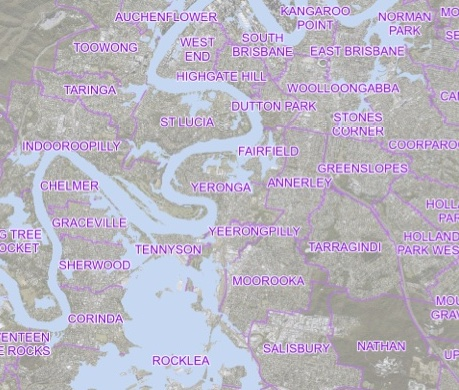{fig-align="center"}

<small>Source: https://www.brisbane.qld.gov.au/ (now expired)</small>

## 

::: {.callout-tip appearance="simple"}
There was a look up table to search addresses
:::

<center>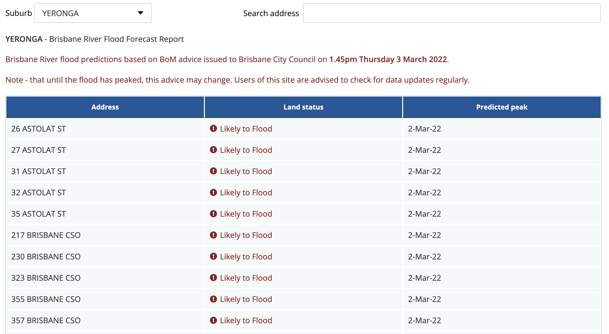{width="80%"}</center>

<small>Source: https://www.brisbane.qld.gov.au/ (now expired)</small>

## 

:::::: columns
:::: {.column width="30%"}
::: {.callout-warning appearance="simple"}
People interpret probabilistic words in differently <br><br>

Likely roughly corresponds to 50% - 70%.
:::

<br><br>

<small> Source:
https://hbr.org/2018/07/if-you-say-something-is-likely-how-likely-do-people-think-it-is
</small>
::::

::: {.column width="70%"}
<center>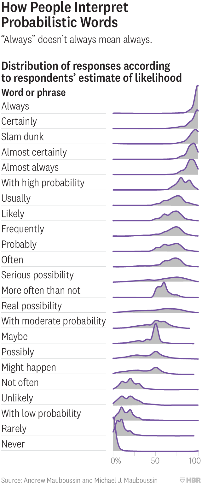{width="40%"}</center>
:::
::::::

## 

::: {.callout-warning appearance="simple"}
-   Let's say you did decide to evacuate, it was not clear how ...
-   Road traffic information was out of date, including Google and Uber
    stopped working
    <!-- -   Critically the design of this app is **not** for natural hazards -->
:::

<center>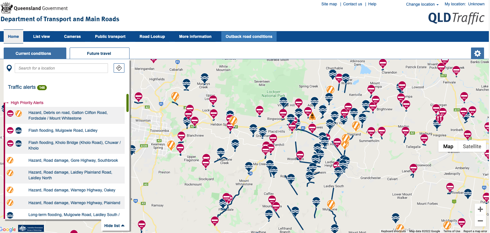{width="80%"}</center>

<small>Source: https://qldtraffic.qld.gov.au/ (now expired) </small>

## Clear Gaps

::: {.callout-warning appearance="simple"}
-   Will my home by impacted?

-   Will I be isolated by flood-waters?

-   When will I be impacted?

-   How badly will I be impacted?

-   Can I evacuate?
:::

. . .

::: {.callout-important appearance="simple"}
## So where did it go wrong?
:::

## Digital Mud Army: Online Hackathon

:::::: columns
:::: {.column width="30%"}
::: {.callout-tip appearance="simple"}
## Hackathon Topics

-   Visualising flood extents
-   Real-time social media data
-   Road closures
-   Comparing past events
-   Community vulnerability
:::
::::

::: {.column width="70%"}
<center>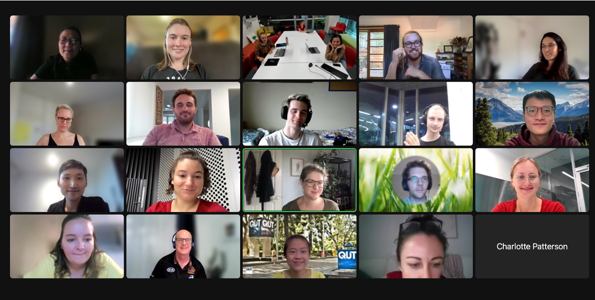{width="100%"}</center>

<small> People mucked in to help in lots of different ways - from
writing complex code to downloading data manually from webpages </small>
:::
::::::

<!-- ## Warning breakdown -->

<!-- ::: callout-important -->

<!-- ## So who's fault was it ?? -->

<!-- -  Breakdown in warning communication, but where exactly? -->

<!-- -  Clear failure in data usage underpinning the warning communication -->

<!-- -  What should we be doing better in hindsight?  -->

<!-- - Can we better meet people's expectations? -->

<!-- ::: -->

## Perspective Paper

<br>

::: {.callout-note appearance="simple"}
Following the hackathon we wrote a perspective paper.

[Saunders, K. R., Forbes, O., Hopf, J. K., Patterson, C. R., Vollert, S.
A., Brown, K., ... & Helmstedt, K. J. (2025). Data-driven
recommendations for enhancing real-time natural hazard warnings. *One
Earth*, *8*(5)
https://doi.org/10.1016/j.oneear.2025.101274.]{style="color: gray; font-size: 0.8em;"}
:::

. . .

We'll discuss this paper and other examples of natural hazards analytics
today


<!-- ::: incremental -->

<!-- -   What makes a good warning? -->

<!-- -   Data barriers to effective warnings -->

<!-- -   Data visualisation of warnings -->

<!-- -   Dealing with uncertainty -->

<!-- ::: -->

# Warning Complexity {background-color="#006DAE"}

## What statistically makes a good forecast

::: {.callout-tip appearance="simple"}
## Forecast Verification[^1]

-   Calibration: How well does the forecast match the observed
    frequency?

-   Sharpness: How confident are we in the forecast?

<!-- -   Accuracy: How good is our forecast accuracy based on scoring metrics? -->
:::

[^1]: Gneiting, T., & Katzfuss, M. (2014). Probabilistic forecasting.
    *Annual Review of Statistics and Its Application*, *1*(1), 125-151.

. . .

In practice there are other important factors, including timeliness and
the warning communication.

## Warning Value Chain

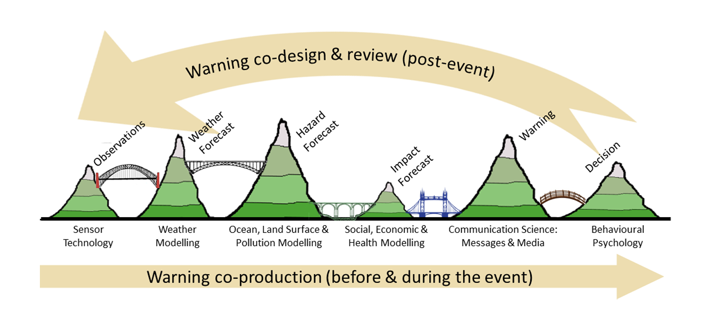{width="100%"}

[^2]

[^2]: Hoffmann, D., Ebert, E. E., Mooney, C., Golding, B., & Potter, S.
    (2023). Using value chain approaches to evaluate the end-to-end
    warning chain. *Advances in Science and Research*, *20*, 73-79.

## Risk Framework

<center>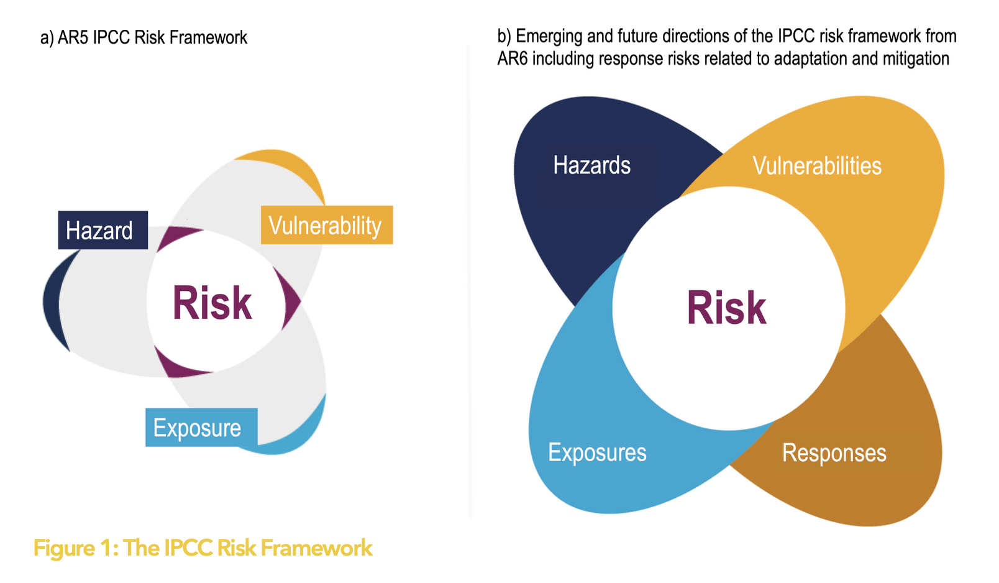{width="75%"} [^3]</center>

[^3]: Simpson, N.P. et al. (2022) ICSM CHC White Paper II: Impacts,
    vulnerability, and understanding risks of climate change for culture
    and heritage ...

# Data Deluge {background-color="#006DAE"} 

##

::: {.callout-important appearance="simple"}
## Suffering from a digital deluge

People delay taking preventative action while they piece together their
data-story
:::

<center>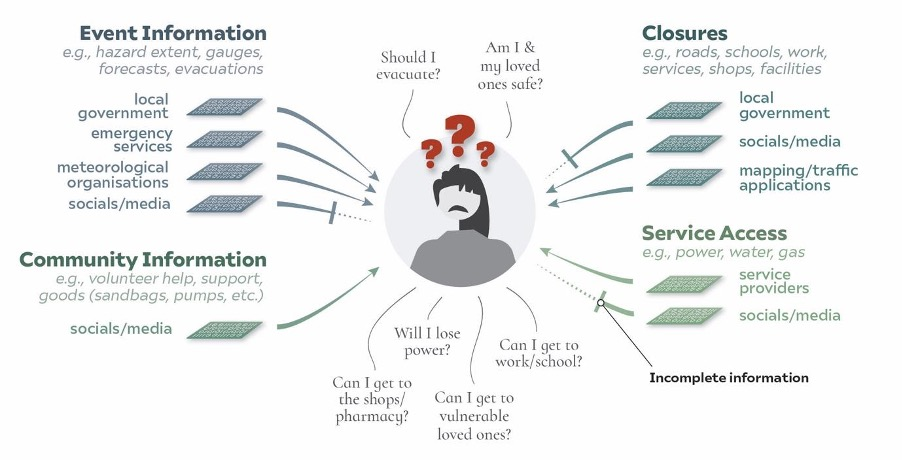{width="85%"}</center>

<!-- Undertaking adhoc exploration to piece together the data story relevant to them. -->

<!-- ## Revisting good warnings -->

<!-- ::: {.callout-important appearance="simple"} -->

<!-- The earlier Brisbane flood example felt more like a leaky data pipeline -->

<!-- :::  -->

<!-- . . .  -->

<!-- ::: {.callout-tip appearance="simple"} -->

<!-- ## Ask ourselves -->

<!-- -   What need to occur to meet people's expectations about their warning information? -->

<!-- -   What is the role of our statistical models in this chain of information? -->

<!-- -   What we need from our models to support communication and decision making? -->

<!-- -    -->

<!-- ::: -->

## Hazard warnings

<center>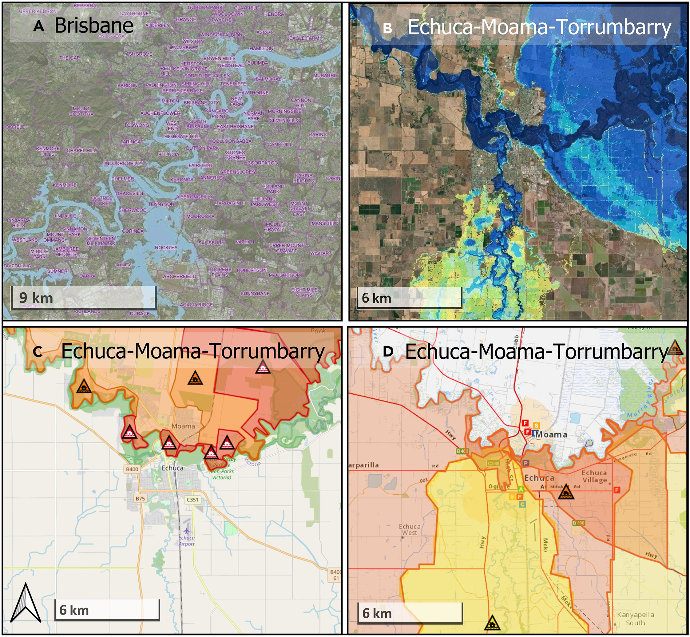{width="60%"}</center>

## Impact warnings

<center>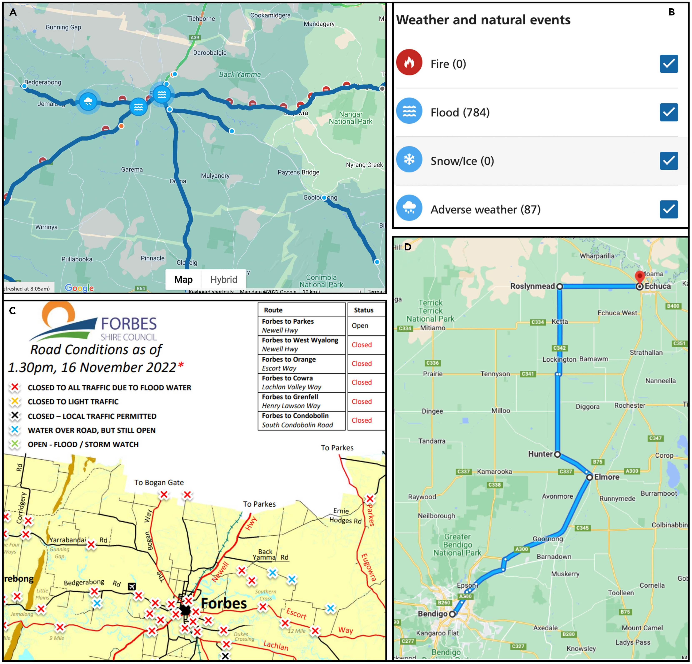{width="60%"}</center>

# Data Barriers {background-color="#006DAE"}

## Impact Forecasts

:::: {.callout-important appearance="simple"}
## Natural hazard interact with people's social and personal contexts

::: incremental
-   The same hazard will impact people differently
-   People also interpret risk from the same hazard differently
-   People need access to different information to understand their
    impacts
-   Indirect impacts from a hazard can still be life threatening
    <!-- -   People respond to warnings differently based on their own personal perception of risk -->
:::
::::

## What data?

<br><br>

::: callout-caution
## Take a moment to brainstorm

What are the different types of data you might want if you were issuing
a warning?

Who might be the different organisation involved in issuing a warning and how might they need to share data?

:::

## Impacts

:::: {.callout-note appearance="simple"}
## Broad variety of impacts that intersect with someone socio-personal context

::: incremental
-   Service utility outages [(eg. Water, sewerage, power, phone,
    internet.)]{style="color:gray;"}
-   Transport outages [(eg. Road closures , public transport outages,
    disruptions and outages of rideshare
    services.)]{style="color:gray;"}
-   Emergency services [(eg. Changed access to police, fire,
    ambulance.)]{style="color:gray;"}
-   Other essential services [(eg. Changed access to healthcare,
    hospitals, pharmacies, and supermarkets, including supply
    disruptions.)]{style="color:gray;"}
-   Support services [(eg. Changed access to supports for mental health,
    domestic violence, and drug and alcohol
    abuse.)]{style="color:gray;"}
:::
::::

. . .

We need interoperable data to understand how the hazard impacts

## Data barriers

:::: {.callout-warning appearance="simple"}
::: incremental
-   Too many of our important data sets are behind pay walls

-   Where possible data should be open for shared use

-   Sometimes data is open but there is no existing pipeline or
    mechanism to use it

-   This might mean it is not machine readable, its in propriety formats
    and not interoperable

-   The data is often not maintained or updated so is not fit for
    purpose
:::
::::

## 

::::: columns
::: {.column width="50%"}
NSW Hazard Watch 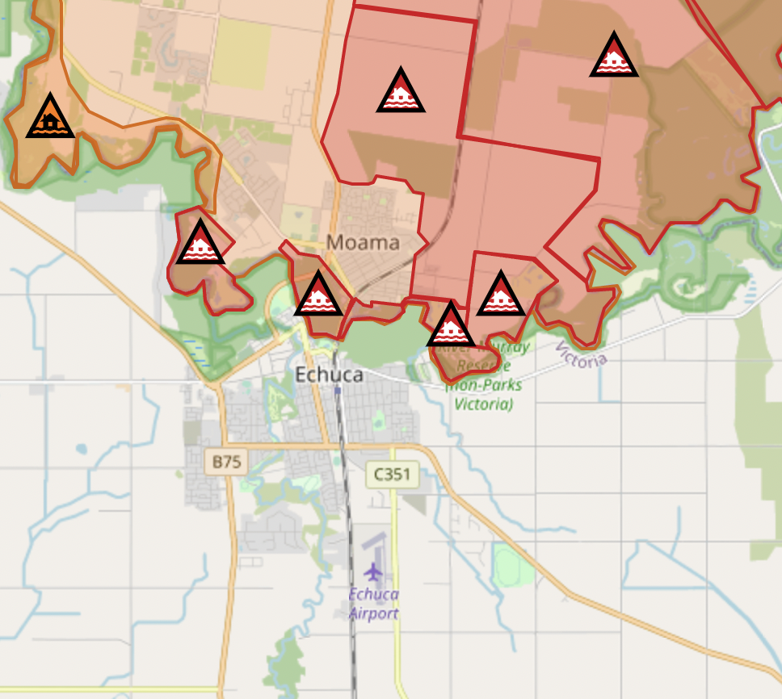{width="88%"}
:::

::: {.column width="50%"}
Vic Alert 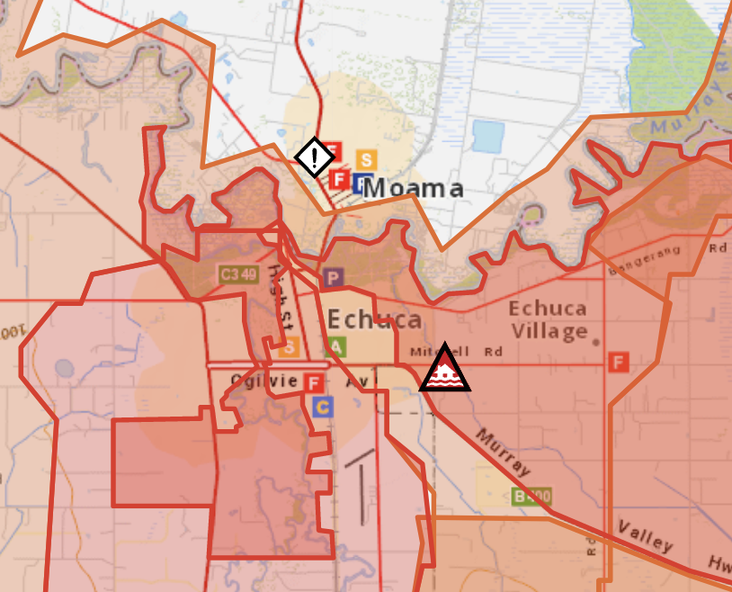{width="100%"}
:::
:::::

::: {.callout-important appearance="simple"}
## Avoiding data silos

Natural disasters do not adhere to institutional remits or geographic
borders!
:::

## Gold Standards in Data Science

::: {.callout-tip appearance="simple"}
## FAIR principles

-   **F**indable - **A**ccessbile - **I**nteroperable - **R**eusable
:::

. . .

::: {.callout-tip appearance="simple"}
## 5-star data

-   Appropriate license (Ideally Open!)
-   Machine-readable, structure format
-   Non-propriety formats
-   Digital Ojbect Identifier (Can be cited)
-   Links to other datasets
:::

. . .

::: {.callout-tip appearance="simple"}
We also need meta-data!
:::

## 

::: {.callout-warning appearance="simple"}
## Many warnings are not reproducible

If data disappears it is difficult to evaluate if warnings were reliable and
sufficient to act upon

:::

<center>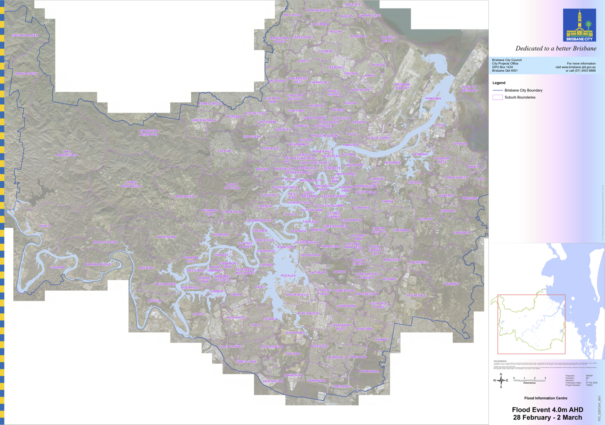{width="80%"}</center>

## 

::: {.callout-important appearance="simple"}
## Need to get our data talking!

Then we can have improved, more user-centric warnings
:::

<center>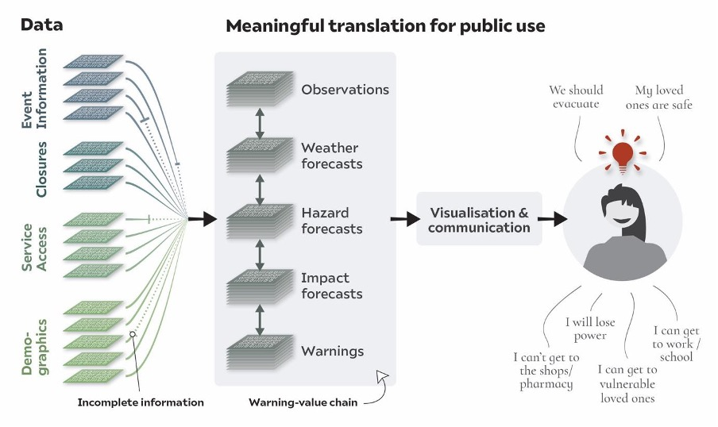{width="85%"}</center>

## Data equity 

<br><br>

:::callout-caution
## Breakout discussion: Time to think 

Some regions in Australia are better observed and have better data.

What should the government's policy be on warning communication: 

Should warnings be standardised statewide, or should some communities with better data have more detailed user-centric warnings?

:::

. . .

:::{.callout-caution appearance="minimal"}
## Speaking of equity 

In designing digital warning infrastructure, do we need to consider any specific community needs?

:::

<!-- # Data Visualisation for Hazard Forecasts {background-color="#006DAE"} -->

<!-- ##  -->

<!-- ::: {.callout-tip appearance="simple"} -->
<!-- ## VicAlert: 17th of October 2022 -->

<!-- An better example of a hazard visualisation -->
<!-- ::: -->

<!-- <center>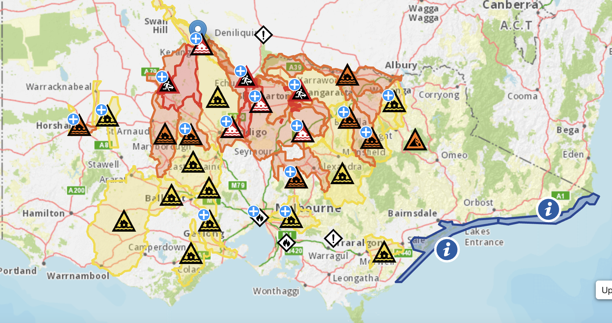{width="90%"}</center> -->

<!-- ##  -->

<!-- ::: {.callout-tip appearance="simple"} -->
<!-- ## VicAlert: 17th of October 2022 -->

<!-- Better communication of the the hazard warning -->
<!-- ::: -->

<!-- <center>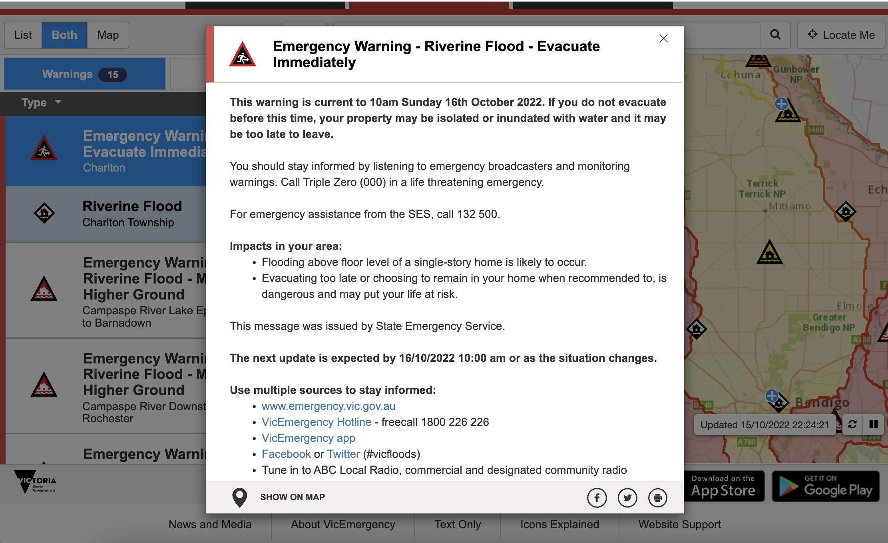{width="90%"}</center> -->

<!-- ##  -->

<!-- :::: {.callout-tip appearance="simple"} -->
<!-- ## Many design elements contribute to the effectiveness of this data communication -->

<!-- ::: incremental -->
<!-- -   Colour [(recongisable eg. red for stop, escalating hazards, -->
<!--     )]{style="color:gray;"} -->
<!-- -   Icons [(easily recognisable, quicker than -->
<!--     text)]{style="color:gray;"} -->
<!-- -   Polygons [(reduces the complexity of the data, better for -->
<!--     uncertainty)]{style="color:gray;"} -->
<!-- -   Map [(places warnings in context)]{style="color:gray;"} -->
<!-- -   Pop Up Messages [(controls the flow of -->
<!--     information)]{style="color:gray;"} -->
<!-- -   Flashing Icons [(draws attention)]{style="color:gray;"} -->
<!-- -   Interactivity [(reduces the cognitive load, enables data -->
<!--     discovery)]{style="color:gray;"} -->
<!-- ::: -->
<!-- :::: -->

<!-- ##  -->

<!-- :::::: columns -->
<!-- ::: {.column width="50%"} -->
<!-- <center>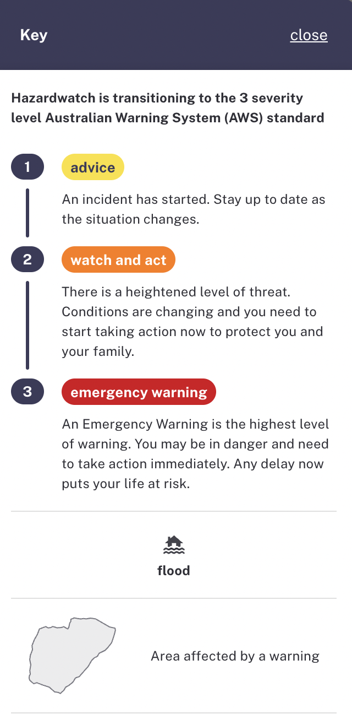{width="80%"}</center> -->

<!-- <small> https://hazardwatch.gov.au/ </small> -->
<!-- ::: -->

<!-- :::: {.column width="50%"} -->
<!-- ::: {.callout-important appearance="simple"} -->
<!-- ## People are not good at making decisions under stress -->
<!-- ::: -->
<!-- :::: -->
<!-- :::::: -->

<!-- ##  -->

<!-- ::::::: columns -->
<!-- ::: {.column width="50%"} -->
<!-- <center>{width="80%"}</center> -->

<!-- <small> https://hazardwatch.gov.au/ </small> -->
<!-- ::: -->

<!-- ::::: {.column width="50%"} -->
<!-- ::: {.callout-important appearance="simple"} -->
<!-- ## People are not good at making decisions under stress -->
<!-- ::: -->

<!-- ::: {.callout-tip appearance="simple"} -->
<!-- ## Categorical Data Helps -->

<!-- -   People are better at thinking in categories -->
<!-- -   Categories are less complex than probabilities -->
<!-- -   Categories can also help when communicating uncertainty -->
<!-- ::: -->
<!-- ::::: -->
<!-- ::::::: -->


<!-- # Uncertainty {background-color="#006DAE"} -->

<!-- ##  -->

<!-- ::: {.callout-note appearance="simple"} -->
<!-- There is always inherent uncertainty in a weather forecast -->
<!-- ::: -->

<!-- <center>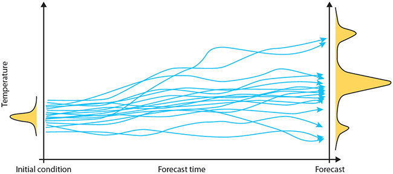{width="80%"}</center> -->

<!-- <small>https://www.ecmwf.int/en/about/media-centre/news/2017/how-pin-down-uncertainty-weather-forecasting -->
<!-- </small> -->

<!-- ##  -->

<!-- ::: {.callout-important appearance="simple"} -->
<!-- Need to propagate and communicate this uncertainty -->
<!-- ::: -->

<!--  -->

<!-- ##  -->

<!-- :::: {.callout-warning appearance="simple"} -->
<!-- ## Uncertainty is treated like a dirty word -->

<!-- ::: incremental -->
<!-- -   We should treating uncertainty as a rich source of information to -->
<!--     aide decision making![^4] -->

<!-- -   Ignoring uncertainty risks under-estimating impacts -->

<!-- -   Ignoring uncertainty delays the window for effective response -->

<!-- -   We know probabilistic forecasts are better for decision making than -->
<!--     deterministic forecasts -->
<!-- ::: -->
<!-- :::: -->

<!-- [^4]: Lucchesi, L. R., Kuhnert, P. M., & Wikle, C. K. (2021). Vizumap: -->
<!--     an R package for visualising uncertainty in spatial data. *Journal -->
<!--     of Open Source Software*, *6*(59), 2409. -->

<!-- ##  -->

<!-- :::: {.callout-caution appearance="simple"} -->
<!-- ::: incremental -->
<!-- -   Strong sentiment that the public doesn't understand uncertainty -->

<!-- -   Warnings are targeted at a year 10 level (mid high school) -->

<!-- -   That doesn't stop us for visualising uncertainty better in house! -->

<!-- -   There are also methods for effectively visualising uncertainty[^5] -->

<!-- -   Implementation requires co-design and education -->
<!-- ::: -->
<!-- :::: -->

<!-- [^5]: Lucchesi, L. R., Kuhnert, P. M., & Wikle, C. K. (2021). Vizumap: -->
<!--     an R package for visualising uncertainty in spatial data. *Journal -->
<!--     of Open Source Software*, *6*(59), 2409. -->

# Data Innovation {background-color="#006DAE"}

##  {background-image="images/kayak2.jpg"}

::: {.callout-tip style="background-color: white;"}
## Reminder: Why do we need open data ...

Open data has the ability to transform government businesses and society. 

:::

## 

:::{.callout-note appearance="minimal"}
## Open data allows us to build tools to solve problems in society
:::

<center>
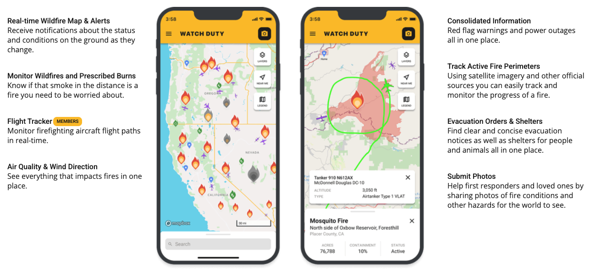{width="75%"}
</center>

[Guardian News Article](https://www.theguardian.com/technology/2025/jan/05/watch-duty-wildfire-app)

[Watch Duty Website](https://www.watchduty.org/)

## 

:::{.callout-note appearance="minimal"}
## Open data allows us to fact-check mis-information and dis-information
:::

:::{.callout-caution appearance="minimal"}
## Were the 2020 bushfires caused by arson? The answer is no!  

Open data helped us to understand - see [analysis submitted to UNDRR](https://www.preventionweb.net/news/open-data-shows-lightning-not-arson-was-likely-cause-most-victorian-bushfires-last-summer#:~:text=Open%20data%20shows%20lightning%2C%20not,can%20be%20attributed%20to%20arson.), [R Spotoroo Package](https://doi.org/10.32614/RJ-2023-022) and [Geoscience Australia Hotspot data](https://hotspots.dea.ga.gov.au/)

:::

<center>
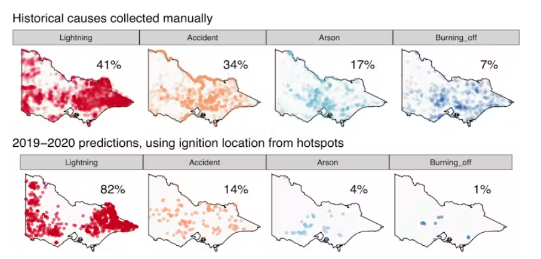{width="75%"}
</center>

## 

:::{.callout-note appearance="minimal"}
## Open data can also helps us to understand where we have knowledge gaps
:::

::: {.callout-important appearance="simple"}
## Current data

Large gaps in our observing network

Temporal frequency of data may be lower than the evolving hazard

Often don't know the on the ground conditions
:::

. . .

::: {.callout-tip appearance="simple"}
## For higher resolution data in space and time we need cultivate, novel data sources

-   Crowd-sourced weather data

-   Crowd-sourced text, photos and videos (drones)

-   Crowd-sourced reporting ([road closures](https://www.waze.com/discuss/t/external-data-third-party-sources-policy/375445), environment)
:::

## A comment

:::{.callout-note appearance="minimal"}
Government led innovation can be slow
:::

. . . 

:::{.callout-caution appearance="minimal"}
## Question

Can you think of why that might be? 

:::

<!-- ## User-centric warnings -->

<!-- <center>{width="100%"}</center> -->

# Wrap Up {background-color="#006DAE"}

## Perspective Paper Recommendations

::: {.callout-tip appearance="simple"}
## Going forward

1.  Work towards open, FAIR data and transparent models, particularly
    for hazard and impact forecasts

2.  Adhere to best practices in visualisation and appropriately
    integrate interactive elements

3.  Create data infrastructure so that novel data sources, like
    crowd-sourced data, can be used to support more localised warnings,
    and

4.  Better incorporate uncertainty into emergency decision-making,
    visualisation, and warning communication.
:::

<p style="color:#808080">

[Saunders, K. R., Forbes, O., Hopf, J. K., Patterson, C. R., Vollert, S.
A., Brown, K., ... & Helmstedt, K. J. (2025). Data-driven
recommendations for enhancing real-time natural hazard warnings. *One
Earth*, *8*(5)
https://doi.org/10.1016/j.oneear.2025.101274.]{style="color: gray; font-size: 0.8em;"}

</p>

## Calls for change

::: {.callout-note appearance="simple"}
## Parliamentary Inquiry into the 2022 Flood Event in Victoria

-   Based on the data barriers discussed, a submission was made on 5th June 2023

:::

<small>

> *There are three key points raised in relation to:*

> *1. Adequacy of warning information available for the October flooding on the state border.*

> *2. Our ability to evaluate if warnings were indeed effective given the transparency of the data and transparency of information about the models used to produce the warnings.*

> *3. Our ability to evaluate adequacy of warnings in hindsight given the lack of reproducibility in the warnings and general storage of the data.*

</small>

## 

::: {.callout-note appearance="simple"}
## Parliamentary Inquiry into the 2022 Flood Event in Victoria

-   Final report, [Finding and
    recommendations](https://www.parliament.vic.gov.au/4a2271/contentassets/a1a3e3c7d84c4a059b7f8ad12089af06/lcepc-60-02_2022-flood-event-in-vic_final-report.pdf)
    delivered 30th July 2024
    
- Below are findings and recommendations related to my submission 

:::

<center>

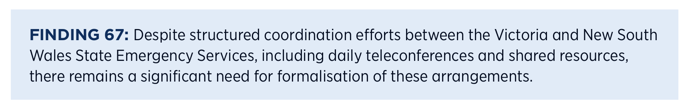{width="75%"}

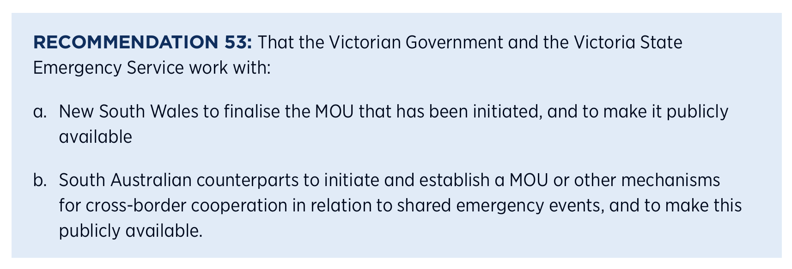{width="75%"}

</center>

## Takeaways

:::callout-note
## Summary

I want you to leave today: 

* With a deeper understanding for the societal importance of open data 

* Whether it be natural hazards, or something else, our world is complex!

* Data needs to works together seamlessly (adhere to data best practices!)

* Knowing the important role that open data plays in innovation

* Feel empowered to use open data to create change 

:::

# [Questions]{style="color: white"} {background-image="images/kayak.jpg"}

<!-- ## Impact Forecasts: Road closures -->

<!-- <center>{width="80%"}</center> -->

<!-- <small>https://www.livetraffic.com/incident-details/139477</small> -->

<!-- ## Criticism -->

<!-- -   Road closure based apps are designed for everyday use -->

<!-- -   Extreme events are system breakers (fire and floods) -->

<!-- -   Data is out of date (highly local impacts) -->

<!-- -   Display is crowded -->

<!-- <center>{width="40%"}</center> -->

<!-- ## Forbes Road closures -->

<!-- Forbes was cut in three by flooding - -->

<!-- <center>{width="80%"}</center> -->

<!-- <small>https://www.livetraffic.com/incident-details/139477</small> -->

<!-- ## Criticism -->

<!-- App isn't purpose build for: -->

<!-- -   Evacuation routing -->

<!-- -   Showing isolation risk -->

<!-- -   Displaying uncertainty with hazard evolution -->

<!-- ## Why all this matters?? -->

<!-- -   People need to know how to evacuate -->

<!-- -   People need to know when their window is evacuation -->

<!-- -   People need to know if they can reach essential services\ -->

<!--     eg Hospitals, Police Stations, Domestic Violence Shelters -->

<!-- ## Forbes Road closures -->

<!-- NSW Traffic directed to a more local source of information -->

<!-- <center>{width="80%"}</center> -->

<!-- ## Forbes -->

<!-- <center>{width="80%"}</center> -->

<!-- ## Safe routes -->

<!-- <center>{width="60%"}</center> -->

<!-- <center>{width="40%"}</center> -->

<!-- ###  WANT TO ADD -->

<!-- penalisation for collaboration (time, energy, papers) / but we need large inter-disciplinary teams (Fischer) -->

<!-- Add taggart, oesting citations -->

<!-- noel uncertainty, wilkie uncertainty -->
