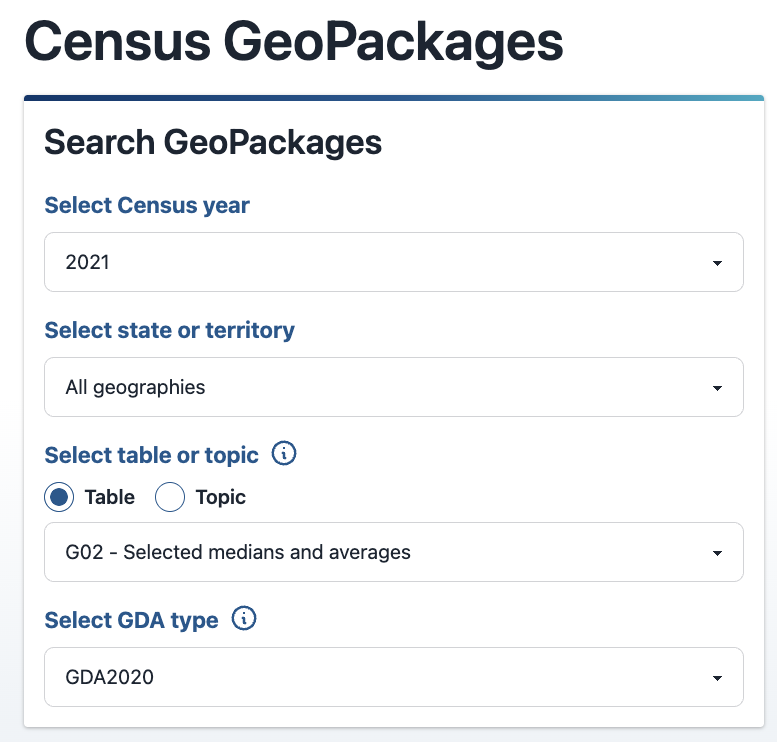
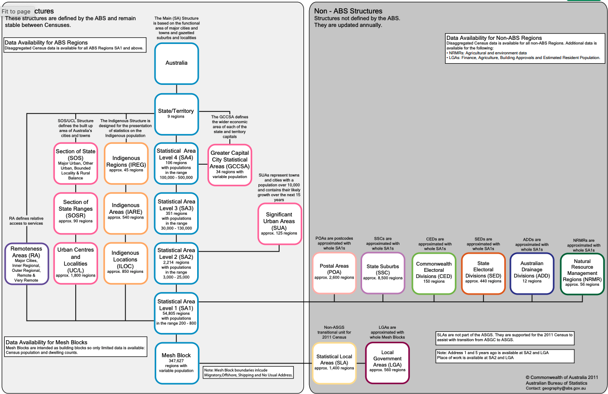
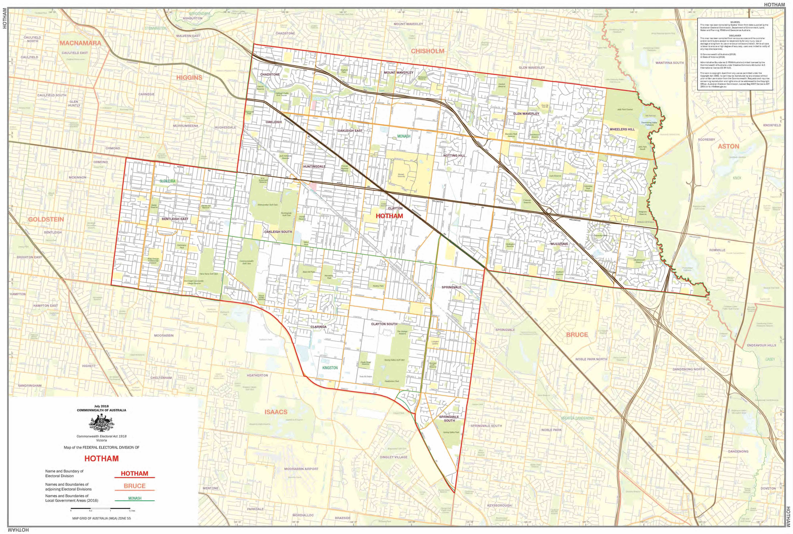

## <br>[`r rmarkdown::metadata$pagetitle`]{.monash-blue} {#etc5523-title background-image="images/bg-01.png"}

### `r rmarkdown::metadata$subtitle`

Lecturer: *`r rmarkdown::metadata$author`*

`r rmarkdown::metadata$department`

::: tl
<br>

<ul class="fa-ul">

<li><i class="fas fa-envelope"></i>`r rmarkdown::metadata$email`</li>

<li><i class="fas fa-calendar-alt"></i>
`r rmarkdown::metadata$date`</li>

<li><i class="fas fa-globe"></i>
`r rmarkdown::metadata[["unit-url"]]`</li>

</ul>

<br>
:::

## Today's Lecture

:::callout-note
## What we'll cover 

Today you will:

- look at the ABS geographical boundaries for the 2021 census
- integrate data from different sources (census and election) to make exploratory inferences

::: 

. . . 

:::callout-note
## From a coding perspective:

- Further expand our understanding of how to read and use spatial data in R
- Better understand how spatial data is organised 
- Learn how to intersect two spatial objections
- Practice re-projecting maps

:::

# Recap {background-color="#006DAE"}

## Recall Lecture 5: 2021 Federal Election Data

```{r aec-map}
#| eval: true
#| echo: true
#| output-height: 500px

library(tidyverse)
library(sf)

aec_map <- read_sf(here::here("data/vic-july-2021-esri/E_VIC21_region.shp")) 

votes <- read_csv("https://results.aec.gov.au/27966/Website/Downloads/HouseDopByDivisionDownload-27966.csv", skip = 1) 

electoral_winners = votes |> 
  mutate(DivisionNm = toupper(DivisionNm)) |>
  filter(Elected == "Y") |> 
  select(PartyAb, DivisionID, DivisionNm, Elected) |>
  distinct()

aec_map = aec_map |> 
  mutate(Elect_div = toupper(Elect_div))

winners_with_map = electoral_winners |> 
  left_join(aec_map, by = c("DivisionNm" = "Elect_div"))

aus_colours <- c(
  "ALP" = "#DE3533", "LNP" = "#ADD8E6", "KAP" = "#8B0000", "GVIC" = "#10C25B", "XEN" = "#ff6300",
  "LP" = "#0047AB", "NP" = "#0a9cca", "IND" = "#000000"
)

winners_plot <- ggplot(winners_with_map) +
  geom_sf(aes(fill = PartyAb, geometry = geometry)) +
  scale_fill_manual(values = aus_colours)

```

## Recall Lecture 5: 2021 Federal Election Data 

<br>

::: {.columns}

::: {.column width="50%"}

```{r}
winners_plot
```


:::

::: {.column width="50%"}

There are two sources of data:

1. Electoral boundary
2. The votes for candidates in each electorate

:::

:::

## Recall Lecture 6: 2021 ABS Census Data 

::: {.columns}

::: {.column width="50%"}

There are two main types of data that you can download.

* DataPacks: [https://www.abs.gov.au/census/find-census-data/datapacks](https://www.abs.gov.au/census/find-census-data/datapacks)

* GeoPackages: [https://www.abs.gov.au/census/find-census-data/geopackages](https://www.abs.gov.au/census/find-census-data/datapacks)

:::

::: {.column width="50%"}



:::

:::

# ABS Census 2021: GeoPackages {background-color="#006DAE"}

## GeoPackage

> A **GeoPackage** (GPKG) is an open, non-proprietary, platform-independent and standards-based data format for geographic information system implemented as a SQLite database container. Defined by the **Open Geospatial Consortium** (OGC) with the backing of the US military and published in 2014, GeoPackage has seen widespread support from various government, commercial, and open source organizations.
*https://en.wikipedia.org/wiki/GeoPackage*

<br>

Recall: OGC also defines the WKT (basically how the maps is drawn.)

## ABS GeoPackage (2021)

:::callout-note 
## Download the data

[https://datapacks.censusdata.abs.gov.au/geopackages/](https://datapacks.censusdata.abs.gov.au/geopackages/)

1. 2021
2. Victoria
3. Topic: Employment and Income or Table: G02 
4. GDA2020

:::

. . .

*You may also like to check out the [`strayr`](https://github.com/runapp-aus/strayr) R package!* 

## ABS GeoPackage (2021)

```{r g02-2021-geopackage}
#| output-height: 500px
#| echo: true

geopath_2021_G02 <- here::here("data/Geopackage_2021_G02_VIC_GDA2020/G02_VIC_GDA2020.gpkg")
st_layers(geopath_2021_G02)
```

## ABS GeoPackage (2016)

:::callout-note 
## Download the data (Notice it is stored differently)

[https://datapacks.censusdata.abs.gov.au/geopackages/](https://datapacks.censusdata.abs.gov.au/geopackages/)

1. 2016 
2. Victoria
3. Employment, Income and Unpaid Work (EIUW)
4. EIUW GeoPackage A

:::

## ABS GeoPackage (2016)

```{r g02-2016-geopackage}
#| echo: true
#| output-height: 500px

geopath_2016_eiuwa <- here::here("data/Geopackage_2016_EIUWA_for_VIC/census2016_eiuwa_vic_short.gpkg")
st_layers(geopath_2016_eiuwa)
```

## The Australian Statistical Geography Standard (ASGS)

<center>

</center>

## The number of regions for each layer

```{r}
#| echo: false
#| eval: true
st_layers(geopath_2021_G02) %>%
  tibble(!!!.) %>%
  dplyr::arrange(features)
```

## What is in a layer? 

```{r}
vicmap_ste_G02 <- read_sf(geopath_2021_G02, layer = "G02_STE_2021_VIC")
vicmap_ste_G02$geom
str(vicmap_ste_G02)

vicmap_ste = vicmap_ste_G02
```

## State or Territory (STE)

```{r map-ste}
#| echo: true
#| fig-align: center

vicmap_ste_G02 <- read_sf(geopath_2021_G02, layer = "G02_STE_2021_VIC")

ggplot(vicmap_ste_G02) +
  geom_sf(aes(geometry = geom, fill = Median_age_persons)) 

nrow(vicmap_ste)
```

## Breakout Session 

:::callout-note
## Try it yourself time

- Download the geopackage for the 2021 census and variable G02

- Look at how that spatial data is organised 

- Look at the different layers

**What are the differences between the regionalisations?**

**How does the median age change across the different regionalisations?**

:::


# A closer look at each region {background-color="#006DAE"}

## Greater Capital City Statistical Areas (GCCSA)

* Each region has a different population

```{r map-gccsa}
#| echo: true
#| fig-align: center

vicmap_gccsa_G02 <- read_sf(geopath_2021_G02, layer = "G02_GCCSA_2021_VIC")
ggplot(vicmap_gccsa_G02) +
  geom_sf(aes(geometry = geom, fill = Median_age_persons))

nrow(vicmap_gccsa_G02)
```

## Section of State (SOS)

* Major urban, other urban, bounded locally & rural balance

```{r map-sos}
#| echo: true
#| fig-align: center

vicmap_sos_G02 <- read_sf(geopath_2021_G02, layer = "G02_SOS_2021_VIC")
ggplot(vicmap_sos_G02) +
  geom_sf(aes(geometry = geom, fill = Median_age_persons))

nrow(vicmap_sos_G02)
```

## Remoteness Areas (RA)

```{r map-ra}
#| echo: true
#| fig-align: center

vicmap_ra_G02 <- read_sf(geopath_2021_G02, layer = "G02_RA_2021_VIC")
ggplot(vicmap_ra_G02) +
  geom_sf(aes(geometry = geom, fill = Median_age_persons))

nrow(vicmap_ra_G02)
```

## Section of State Ranges (SOSR)

```{r map-sosr}
#| echo: true
#| fig-align: center

vicmap_sosr_G02 <- read_sf(geopath_2021_G02, layer = "G02_SOSR_2021_VIC")
ggplot(vicmap_sosr_G02) +
  geom_sf(aes(geometry = geom, fill = Median_age_persons))

nrow(vicmap_sosr_G02)
```

## Statistical Area Level 4 (SA4)

* Each region with population of 100,000 - 500,000

```{r map-sa4}
#| echo: true
#| fig-align: center

vicmap_sa4_G02 <- read_sf(geopath_2021_G02, layer = "G02_SA4_2021_VIC")
ggplot(vicmap_sa4_G02) +
  geom_sf(aes(geometry = geom, fill = Median_age_persons))

nrow(vicmap_sa4_G02)
```

## Significant Urban Areas (SUA)

```{r map-sua}
#| echo: true
#| fig-align: center

vicmap_sua_G02 <- read_sf(geopath_2021_G02, layer = "G02_SUA_2021_VIC")
ggplot(vicmap_sua_G02) +
  geom_sf(aes(geometry = geom, fill = Median_age_persons))

nrow(vicmap_sua_G02)
```

## Commonwealth Electoral Division (CED)

```{r map-ced}
#| echo: true
#| fig-align: center

vicmap_ced_G02 <- read_sf(geopath_2021_G02, layer = "G02_CED_2021_VIC")
ggplot(vicmap_ced_G02) +
  geom_sf(aes(geometry = geom, fill = Median_age_persons))

nrow(vicmap_ced_G02)
```

## Statistical Area Level 3 (SA3)

* Each region with population of 30,000 - 130,000

```{r map-sa3}
#| echo: true
#| fig-align: center

vicmap_sa3_G02 <- read_sf(geopath_2021_G02, layer = "G02_SA3_2021_VIC")
ggplot(vicmap_sa3_G02) +
  geom_sf(aes(geometry = geom, fill = Median_age_persons))

nrow(vicmap_sa3_G02)
```

## Local Government Area (LGA)

```{r map-lga}
#| echo: true
#| fig-align: center

vicmap_lga_G02 <- read_sf(geopath_2021_G02, layer = "G02_SA3_2021_VIC")
ggplot(vicmap_lga_G02) +
  geom_sf(aes(geometry = geom, fill = Median_age_persons))

nrow(vicmap_lga_G02)
```

## State Electoral Division (SED)

```{r map-sed}
#| echo: true
#| fig-align: center

vicmap_sed_G02 <- read_sf(geopath_2021_G02, layer = "G02_SED_2021_VIC")
ggplot(vicmap_sed_G02) +
  geom_sf(aes(geometry = geom, fill = Median_age_persons))

nrow(vicmap_sed_G02)
```

## Urban Centres and Localities (UCL)

```{r map-ucl}
#| echo: true
#| fig-align: center

vicmap_ucl_G02 <- read_sf(geopath_2021_G02, layer = "G02_UCL_2021_VIC")
ggplot(vicmap_ucl_G02) +
  geom_sf(aes(geometry = geom, fill = Median_age_persons))

nrow(vicmap_ucl_G02)
```

## Statistical Area Level 2 (SA2)

* Each region with populations in the range of 3,000-25,000

```{r map-sa2}
#| echo: true
#| fig-align: center

vicmap_sa2_G02 <- read_sf(geopath_2021_G02, layer = "G02_SA3_2021_VIC")
ggplot(vicmap_sa2_G02) +
  geom_sf(aes(geometry = geom, fill = Median_age_persons))

nrow(vicmap_sa2_G02)
```

## Postal Areas (POA)

```{r map-poa}
#| echo: true
#| fig-align: center

vicmap_poa_G02 <- read_sf(geopath_2021_G02, layer = "G02_POA_2021_VIC")
ggplot(vicmap_poa_G02) +
  geom_sf(aes(geometry = geom, fill = Median_age_persons))

nrow(vicmap_poa_G02)
```

## State Area Localitites (SAL) (Formerly SSC)

```{r map-ssc}
#| echo: true
#| fig-align: center

vicmap_sal_G02 <- read_sf(geopath_2021_G02, layer = "G02_SAL_2021_VIC")
ggplot(vicmap_sal_G02) +
  geom_sf(aes(geometry = geom, fill = Median_age_persons))

nrow(vicmap_sal_G02)
```

## Statistical Area Level 1 (SA1)

* Each region with a population of range 200-800

```{r map-sa1, eval = TRUE}
#| echo: true
#| fig-align: center

vicmap_sa1_G02 <- read_sf(geopath_2021_G02, layer = "G02_SA1_2021_VIC")
ggplot(vicmap_sa1_G02) +
  geom_sf(aes(geometry = geom, fill = Median_age_persons))

nrow(vicmap_sa1_G02)
```

# Electorate boundary <br>vs <br> Census boundary {background-color="#006DAE"}

## Comparing SED 2021 and electorates divisions 2022

```{r zoomed-map, fig.width = 8}
#| echo: true
#| fig-align: center

ggplot() +
  geom_sf(data = vicmap_sed_G02, 
          aes(geometry = geom, fill = Median_age_persons),
    alpha = 1, color = "white", size = 2) +
  geom_sf(data = winners_with_map, aes(geometry = geometry),
    fill = "transparent", color = "red", size = 2) +
  coord_sf(xlim = c(144.95, 145.24), ylim = c(-38.05, -37.85)) + 
  theme_bw()
```

## Closer look: Hotham electorate 1

```{r}
#| echo: true
#| eval: false

electorate <- winners_with_map |>
  filter(DivisionNm == "HOTHAM") 

# Set projection to GDA1994 using EPSG:4283
st_crs(electorate$geometry,4283)
  
# Transform projection from GDA1994 to GDA2020 using EPSG:7844
electorate$geometry = st_transform(electorate$geometry, 7844) 

sed_intersect <- vicmap_sed_G02 |>
  filter(st_intersects(geom,
    electorate$geometry,
    sparse = FALSE
  )[, 1])

ggplot() +
  geom_sf(data = sed_intersect,
    aes(geometry = geom), color = "red", fill = "transparent") +
  geom_sf_text(data = sed_intersect,
    aes(label = SED_CODE_2021, geometry = geom), color = "red") +
  geom_sf(data = electorate, aes(geometry = geometry), fill = "transparent") +
  geom_sf_text(data = electorate, aes(geometry = geometry, label = DivisionNm))
```

## Closer look: Hotham electorate 1

```{r}
#| echo: false
#| eval: true
#| message: false
#| warning: false
#| fig-align: center

electorate <- winners_with_map |>
  filter(DivisionNm == "HOTHAM") 

# Set projection to GDA1994 using EPSG:4283
st_crs(electorate$geometry) <- 4283
  
# Transform projection from GDA1994 to GDA2020 using EPSG:7844
electorate$geometry <- st_transform(electorate$geometry, 7844) 

sed_intersect <- vicmap_sed_G02 |>
  filter(st_intersects(geom,
    electorate$geometry,
    sparse = FALSE
  )[, 1])

sed_map <- ggplot() +
  geom_sf(
    data = sed_intersect,
    aes(geometry = geom),
    color = "red", fill = "transparent"
  ) +
  geom_sf_text(
    data = sed_intersect,
    aes(
      label = SED_CODE_2021,
      geometry = geom
    ),
    color = "red"
  ) +
  geom_sf(data = electorate, aes(geometry = geometry), fill = "transparent") +
  geom_sf_text(data = electorate, aes(geometry = geometry, label = DivisionNm))

sed_map

```

## Closer look: Hotham electorate 2

```{r}
#| echo: true
#| eval: false

sed_intersect2 <- sed_intersect |> #<<
  mutate(
    geometry = st_intersection(geom, electorate$geometry), #<<
    perc_area = 100 * st_area(geometry) / st_area(geom), #<<
    perc_area = as.numeric(perc_area)
  ) |> #<<
  filter(perc_area > 5) 
  
ggplot(sed_intersect2, aes(geometry = geometry)) +
  geom_sf(data = electorate) +
  geom_sf_text(
    data = electorate,
    aes(label = DivisionNm)
  ) +
  geom_sf(color = "red", aes(fill = Median_age_persons)) +
  geom_sf_text(
    aes(
      label = glue::glue("{SED_CODE_2021}
                        ({scales::comma(perc_area, 1)}%, {Median_age_persons})")
    ),
    color = "red"
  ) +
  theme(legend.position = "bottom")
```

## Closer look: Hotham electorate 2

```{r}
#| echo: false
#| eval: true
#| message: false
#| warning: false

sed_intersect2 <- sed_intersect |> #<<
  mutate(
    geometry = st_intersection(geom, electorate$geometry), #<<
    perc_area = 100 * st_area(geometry) / st_area(geom), #<<
    perc_area = as.numeric(perc_area)
  ) |> #<<
  filter(perc_area > 5) 
  
sed_map2 <- ggplot(sed_intersect2, aes(geometry = geometry)) +
  geom_sf(data = electorate) +
  geom_sf_text(
    data = electorate,
    aes(label = DivisionNm)
  ) +
  geom_sf(color = "red", aes(fill = Median_age_persons)) +
  geom_sf_text(
    aes(
      label = glue::glue("{SED_CODE_2021}
                        ({scales::comma(perc_area, 1)}%, {Median_age_persons})")
    ),
    color = "red"
  ) +
  theme(legend.position = "bottom")

sed_map2
```

:::{.callout-note appearance="minimal"}

* There are `r nrow(sed_intersect2)` SED areas with at least 5% intersection with the electoral area.

* **How would you characterise the median age for Hotham?**

:::

## Closer look: Hotham electorate 3

::: columns

::: {.column width="50%"}
```{r}
#| echo: false
#| warning: false
#| message: false
sed_map2
```
:::

::: {.column width="50%"}

**Strategy 1**
```{r}
#| echo: true
sort(sed_intersect2$Median_age_persons)
```

**Strategy 2**
```{r}
#| echo: true

mean(sed_intersect2$Median_age_persons)
```

**Strategy 3**
```{r}
#| echo: true

weighted.mean(
  sed_intersect2$Median_age_persons,
  sed_intersect2$perc_area
)
```

:::

:::

## Closer look: Hotham electorate 4

::: columns

::: {.column width="50%"}

```{r sa1-intersect}
#| echo: true
#| eval: true 
#| message: false
#| warning: false

sa1_intersect <- vicmap_sa1_G02 %>% #<<
  filter(st_intersects(geom,
    electorate$geometry,
    sparse = FALSE
  )[, 1])

sa1_intersect2 <- sa1_intersect %>%
  mutate(
    geometry = st_intersection(geom, electorate$geometry),
    perc_area = 100 * st_area(geometry) / st_area(geom),
    perc_area = as.numeric(perc_area)
  ) %>% #<<
  filter(perc_area > 5)

ggplot(sa1_intersect) +
  geom_sf(color = "red", 
          aes( fill = Median_age_persons, geometry = geom)) +
  geom_sf(data = electorate, 
          color = "white", size = 2, fill = "transparent", 
          aes(geometry = geometry)) +
  theme(legend.position = "bottom")

```

:::

::: {.column width="50%"}

```{r sa1-intersect, echo = FALSE,fig.width = 6, fig.height = 6}
```

::: 

:::

## Closer look: Hotham electorate 5

::: columns

::: {.column width="50%"}

```{r sa1-intersect, echo = FALSE, fig.height = 6, fig.width = 6}
```

::: 

::: {.column width="50%"}

**Strategy 1**

```{r}
#| echo: true 

fivenum(sa1_intersect2$Median_age_persons)
```


**Strategy 2**

```{r}
#| echo: true 

mean(sa1_intersect2$Median_age_persons)
```


**Strategy 3**

```{r}
#| echo: true

weighted.mean(sa1_intersect2$Median_age_persons, sa1_intersect2$perc_area)
```

:::

:::

## Closer look: Hotham electorate 5

::: columns

::: {.column width="50%"}

```{r sa1-intersect, echo = FALSE, fig.height = 6, fig.width = 6}
```

::: 

::: {.column width="50%"}

**Strategy 4**

```{r sa1-region-histogram, fig.height=2}
#| echo: true

ggplot(sa1_intersect2, aes(x = Median_age_persons)) +
  geom_histogram(binwidth = 1)
```

:::

:::

## Closer look️: Zero median age

[Hotham 2022](https://www.aec.gov.au/profiles/vic/hotham.htm)

::: columns

::: {.column width="50%"}

```{r strange-result}
sa1_intersect2 %>%
  filter(Median_age_persons == 0) %>%
  ggplot() +
  geom_sf() +
  geom_sf(
    data = electorate, color = "red",
    fill = "transparent",
    aes(geometry = geometry)
  )
```

:::

::: {.column width="50%"}



:::

:::

##

::: columns

::: {.column width="50%"}

**BEFORE** (No Filter)

**Strategy 1**

```{r}
#| echo: true
fivenum(sa1_intersect2$Median_age_persons)
```

**Strategy 2**

```{r}
#| echo: true
mean(sa1_intersect2$Median_age_persons)
```

**Strategy 3**

```{r}
#| echo: true
weighted.mean(sa1_intersect2$Median_age_persons, sa1_intersect2$perc_area)
```

:::

::: {.column width="50%"}

**AFTER** (With Filter)

```{r}
#| echo: true
sa1_intersect3 <- sa1_intersect2 %>%
  filter(Median_age_persons != 0)
```

**Strategy 1**

```{r}
#| echo: true
fivenum(sa1_intersect3$Median_age_persons)
```


**Strategy 2**

```{r}
#| echo: true
mean(sa1_intersect3$Median_age_persons)
```


**Strategy 3**

```{r}
#| echo: true
weighted.mean(sa1_intersect3$Median_age_persons, sa1_intersect3$perc_area)
```

:::

:::

## Dorling Cartogram 

::: columns

::: {.column width="50%"}

```{r zoomed-map-income-dorling}
#| echo: true
#| 
sa1_intersect4 <- sa1_intersect %>%
  mutate(centroid = st_centroid(geom))

dorling_plot <- ggplot(sa1_intersect4) +
  geom_sf(
    data = electorate,
    aes(geometry = geometry), size = 4, fill = "grey60"
  ) +
  geom_sf(aes(geometry = centroid, color = Median_age_persons),
    size = 0.5, shape = 3
  ) +
  scale_color_viridis_c(name = "Median age", option = "magma")
```

::: 

::: {.column width="50%"}

```{r echo = FALSE}
dorling_plot
```

:::

:::

## Closer look: Hotham electorate 7 

**Filter out zero age electorates** 

```{r}
#| echo: true
sa1_intersect5 <- sa1_intersect4 %>%
  filter(st_intersects(centroid, electorate$geometry, sparse = FALSE)[, 1],
    Median_age_persons != 0)
```

**Strategy 1**

```{r}
#| echo: true
fivenum(sa1_intersect5$Median_age_persons)
```

**Strategy 2**

```{r}
#| echo: true
mean(sa1_intersect5$Median_age_persons)
```

**Strategy 4**

```{r sa1-region-histogram2, fig.height=2}
#| echo: true
ggplot(sa1_intersect5, aes(x = Median_age_persons)) +
  geom_histogram(binwidth = 1)
```

# Wrap Up {background-color="#006DAE"}

## Wrap Up 

:::{.callout-note}
## What did we learn

* Learnt about geopackages and different census boundaries 

* We mapped the 2021 census boundaries and projected a summary of the census variable (i.e. median age) onto a 2022 electoral district

* Found there are many approaches one can use to characterise an electorates demographics.

* Estimates of median age of an electorate are more reliable using SA1 map data than SED map data.

* Discovered some of the challenges with matching two different types of data! (Like zero age!)

:::

## For your assignment

:::{.callout-note}
## Takeaways 

* Be very clear about which boundaries you choose for your assignment and why

* Be sure to explain how you matched those boundaries - did you use area overlap, centroids, minimal area overlap criterion?

* Was there anything odd you encountered when joining your data? 

* Did you need to handle any locations with no demographic data? Tell us.

:::

## Every year 

:::callout-warning 
## CED regions are not the same as electoral boundaries!

They should be a close approximation, but they won't necesasrily be exact. Better check on your assignment! Remember I want you to justify any decisions.

:::

## Comparing CED 2021 and electorates divisions 2022

::: columns

::: {.column width="50%"}

```{r zoomed-mapa, fig.width = 8}

ggplot() +
  geom_sf(data = vicmap_ced_G02, 
          aes(geometry = geom, fill = Median_age_persons),
    alpha = 1, color = "white", size = 2) +
  geom_sf(data = winners_with_map, aes(geometry = geometry),
    fill = "transparent", color = "red", size = 2) +
  coord_sf(xlim = c(144.95, 145.24), ylim = c(-38.05, -37.85)) + 
  theme_bw()
```

:::

::: {.column width="50%"}

```{r zoomed-mapb, fig.width = 8}
#| echo: true
#| eval: false
 
ggplot() +
  geom_sf(data = vicmap_ced_G02, 
          aes(geometry = geom, fill = Median_age_persons),
    alpha = 1, color = "white", size = 2) +
  geom_sf(data = winners_with_map, aes(geometry = geometry),
    fill = "transparent", color = "red", size = 2) +
  coord_sf(xlim = c(144.95, 145.24), ylim = c(-38.05, -37.85)) + 
  theme_bw()
```

:::

:::

## Further reading 

:::{.callout-tip appearance="minimal"}
## Want to know more 

Read [Forbes, Cook & Hyndman (2020) Spatial modelling of the two-party preferred vote in Australian federal elections: 2001–2016. *Australian & New Zealand Journal of Statisitcs*. ](https://onlinelibrary.wiley.com/doi/abs/10.1111/anzs.12292) for a more sophisticated approach to studying the census variables and election results together.

:::


