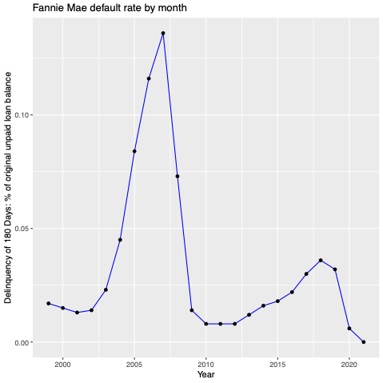
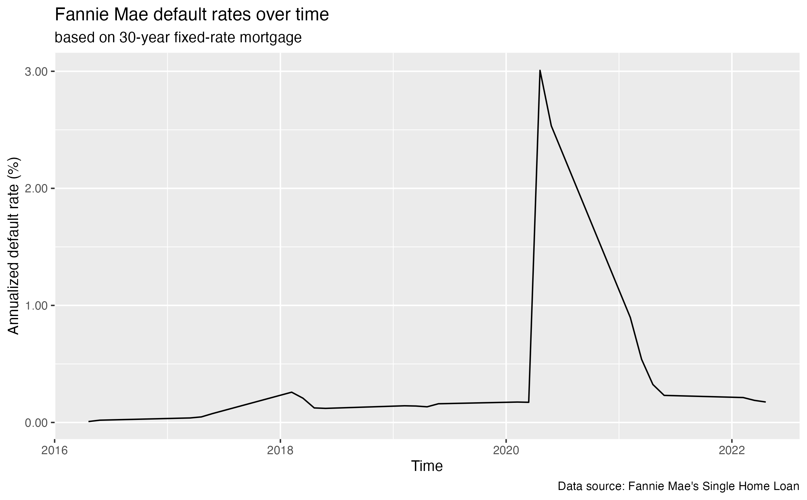
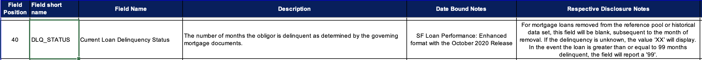
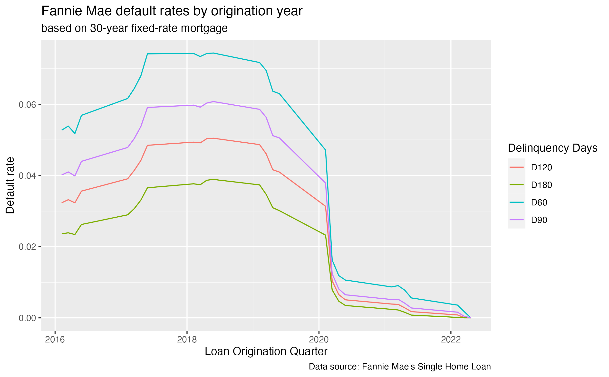
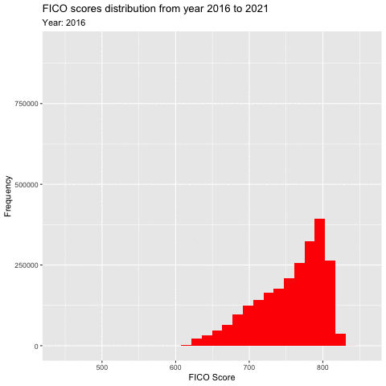
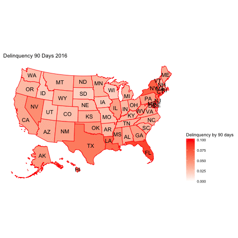
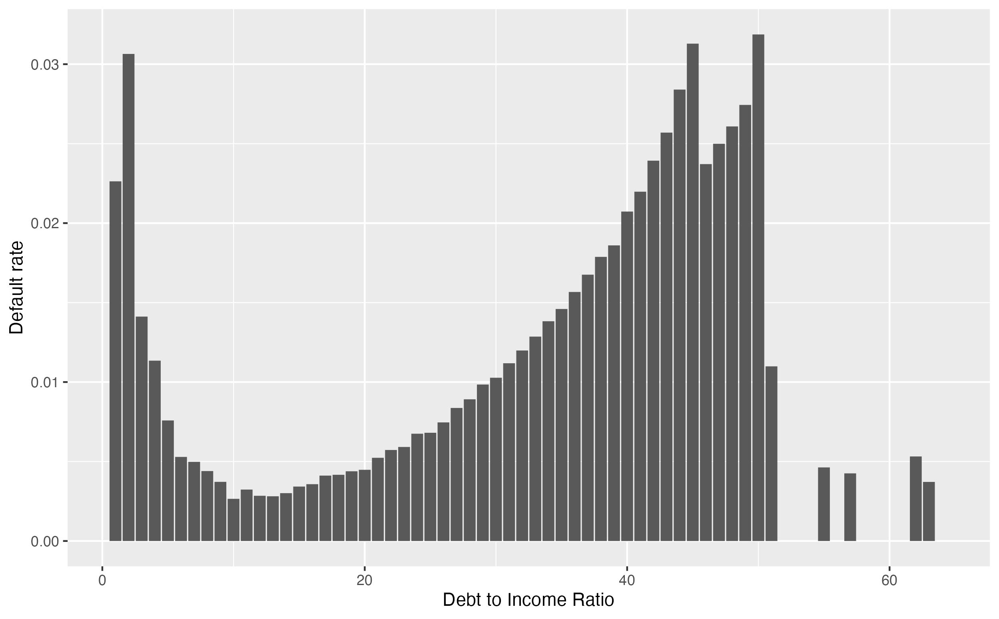
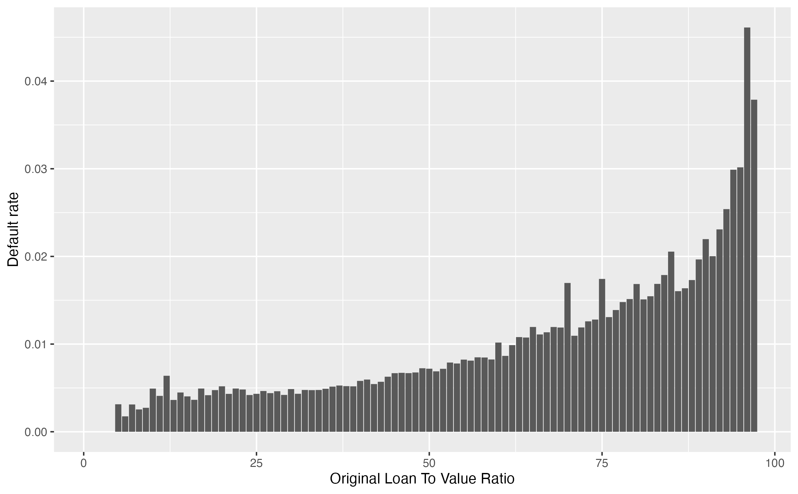

## <br>[`r rmarkdown::metadata$pagetitle`]{.monash-blue} {#etc5512-title background-image="images/bg-01.png"}

### `r rmarkdown::metadata$subtitle`

Lecturer: *`r rmarkdown::metadata$author`*

`r rmarkdown::metadata$department`

::: tl
<br>

<ul class="fa-ul">

<li><i class="fas fa-envelope"></i>`r rmarkdown::metadata$email`</li>

<li><i class="fas fa-calendar-alt"></i>
`r rmarkdown::metadata$date`</li>

<li><i class="fas fa-globe"></i>
`r rmarkdown::metadata[["unit-url"]]`</li>

</ul>

<br>
:::

## Ask yourself 

<br>

:::{.callout-note appearance="minimal"} 

:::incremental

* What do you need to get a loan from the bank?

* Do banks offer the same interest rate?

* Do banks price match interest rates? 

::: 

:::

. . . 

<br>

[**IT'S ALL ABOUT CREDIT RISK**]{style="color:orange;"}

## Credit Risk

::: {style="position:absolute;right:20px;bottom:40%"}
**Bank** <br>
{width="250px"}
:::

::: {.fragment style="position:absolute;left:40%;top:15%"}
**Mortgage** <br>
{width="250px"}
:::

::: {.fragment style="position:absolute;left:10%;bottom:25%"}
**Lender** <br>
{width="100px"}
:::

::: {.fragment style="position:absolute;left:40%;bottom:15%"}
**Repayment/Money** <br>
{width="250px"}
:::

::: {.fragment style="position:absolute;left:40%;bottom:15%"}
{width="180px"}
:::

::: {.fragment style="position:absolute;top:10%;left:70%"}
{width="180px"}
:::

## Learning Objectives {.center}

::: {.callout-note}
## Today you will:

- Look at a credit risk case study
- Use the Fannie Mae data set containing US loan data
- Discuss important considerations for inheriting someone's code 
:::

. . . 

::: {.callout-note}
## Coding Perspective:

- Learn about how code smells
- Learn some tips for wrangling a large data set
- Learn about how to read / deal with zip files
:::

# Fannie Mae and Freddie Mac {background-color="#006DAE"}

Data Context

## Fannie Mae 

:::{.callout-note}
## What is it? 

- Established in 1938
- **Fannie Mae** is short for Federal National Mortgage Association, U.S. (FNMA)
- Fannie Mae is regulated by the Federal Housing Finance Agency (FHFA) and is a publicly traded company on the New Yock Stock Exchange (NYSE).
- Initially it was a government sponsored enterprise in US and later switched to a private enterprise.

::: 

## Fannie Mae 

:::{.callout-note}
## Why is it important?

**Fannie Mae helps to make homeownership more affordable and accessible for Americans.**

:::incremental 

- Purpose: make loans and loan guarantees to low or middle income families.

- How does it do that: Purchases mortgages from lenders, which frees up the bank capital, allowing the bank to offer more loans and mortgages. Then later packages them into mortgage-backed securities, which are sold to investors on the secondary market.

- By purchasing mortgages from lenders and providing liquidity to the mortgage market Fannie Mae offers affordable and accessible loans.

::: 

:::

## Freddie Mac

:::{.callout-note}
## What is it? 

- Similar function to Fannie Mae.
- Created in 1970
- Federal Home Mortgage Loan Corporation.
- It was created to end Fannie Mae's monopoly on the secondary mortgage market.

:::

## How they operate?

:::{.callout-note}
## Mortgage Backed Securities

- They sell their mortgages as bonds and charge a fees

- This bonds is called **Mortgage Backed Securities**.

  - Investment products that are created by pooling together a large number of individual mortgage loans into a single security.
  
  - The securities are then sold to investors on the secondary market.
  
  - The value of MBS depends on the underlying pool of mortgages.

::: 


[Read more about Fannie Mae and Freddie Mac here ](https://www.fhfa.gov/about-fannie-mae-freddie-mac)

## What else do you need to know?

::: {.callout-note appearance="minimal"}
The more banks are able to sell mortgages to Fannie Mae and Freddie Mac, the more money banks can make!
:::

<br>

. . . 

::: {.callout-note appearance="minimal"}
Fannie Mae and Freddie Mac own or guarantee just under half the total value of home loans in the U.S.

:::

<br>

 . . . 
 
::: {.callout-warning  appearance="minimal"}

This seems like a great financial initiative right? 

Ask yourself what else might we need to know about this data?

:::

## Sub-prime mortgage crisis

> Sub-prime mortgage - the practice of lending money to people with low credibility at a high interest rate.

::: {.callout-note}
## Banks began making junk loans

- Loans were created without checking the creditworthiness of the borrowers by simply selling it to the government sponsored enterprise (GSE) to make more profits.

- Individuals could easily get a loan regardless of they affordability.

- With the economic melt down, this caused the Government Sponsored Enterprise to cover the difference for the investors and make a huge loss as more mortgage loans defaulted.

- Both GSE neared bankruptcy because of the sub-prime mortgages

::: 

## More recently

You will observe an "artificially" low default rate during the pandemic. The same happens in Australia data.

:::{.callout-note}
## Fannie Mae and Freddie Mac in COVID-19

- The federal government launched the Coronavirus Aid, Relief, and Economic Security (CARES) Act.

- This mortgage relief act offered protections for homeowners with mortgages backed by these GSE.

- This act expired on 31st July 2021. However, the borrowers under these GSE are eligible for 18 months of total forbearance as long as their plan is active by 28th February 2021.

:::

# Fannie Mae Data {background-color="#006DAE"}

Downloading and processing the Data

## Fannie Mae Single Family Loan Data


::: {.callout-note}
## Where to download it?

- Go to the website: [Fannie Mae Single-Family Loan Performance Data](https://capitalmarkets.fanniemae.com/credit-risk-transfer/single-family-credit-risk-transfer/fannie-mae-single-family-loan-performance-data)

- Register a free account

- The primary data set contains acquisition and performance data (~ 50 Gb)

- Don't download this data all at once! 

- There are `.zip` files available to download for each quarter

:::

## Why are we using this data?

::: {.callout-note}
## Proxy for real bank data

* This data set contains mortgage loans, which is very similar to the bank's mortgage data. 

* We can use this to understand how to estimate credit risk (at least as a start point)

* This will also help us gain insights into the drivers of mortgage default risk!

* In tutorials you will use a pre-processed version of this data.

:::

. . . 

::: {.callout-caution appearance="minimal"}

We will use the **single family fixed rate mortgage (primary) data** set not the HARP!

:::

## Fannie Mae Data Set

:::{.callout-note}
## What is in the data?

- Provides loan performance data on a portion of its single-family mortgage loans

- The Single-Family Fixed Rate Mortgage (primary) dataset contains a subset of Fannie Mae's 30-year and less, fully amortizing, full documentation, single-family, conventional fixed-rate mortgages.

- Data available from 2000 onwards, mortgage loans originated prior to 1999 are excluded.

- Every quarter following the initial release, Fannie Mae updates acquisition and performance data as of the previous quarter.

- Fannie Mae releases updated information on or after the 20th of the month following the end of the quarter.

- Currently, they have about [100GB]{style="color:red;"} of historical data!

:::

. . . 

::: {.callout-note appearance="minimal"}
## What type of data is this? (Census, Sample, Occurrence, Experimental?)
:::

## Getting Started with the data

:::callout-note 
## Where to start 

1. Read the overview in the main page to get an idea about the data - [Fannie Mae Single-Family Loan Performance Data](https://capitalmarkets.fanniemae.com/credit-risk-transfer/single-family-credit-risk-transfer/fannie-mae-single-family-loan-performance-data)

2. Next we need to get a handle on the variables. Choose the "Glossary and File Layout" file in the homepage (either csv or pdf, I prefer csv as it is easier to navigate, but the choice is yours!).

3. There are also FAQs that help you understand the data and variables.

4. Take a look at the sample file provided.

:::

## Fannie Mae Data Sample

```{r fm-data}
#| echo: FALSE
#| eval: TRUE

library(data.table)
lppub_column_names <- c("POOL_ID", "LOAN_ID", "ACT_PERIOD", "CHANNEL", "SELLER", "SERVICER",
                        "MASTER_SERVICER", "ORIG_RATE", "CURR_RATE", "ORIG_UPB", "ISSUANCE_UPB",
                        "CURRENT_UPB", "ORIG_TERM", "ORIG_DATE", "FIRST_PAY", "LOAN_AGE",
                        "REM_MONTHS", "ADJ_REM_MONTHS", "MATR_DT", "OLTV", "OCLTV",
                        "NUM_BO", "DTI", "CSCORE_B", "CSCORE_C", "FIRST_FLAG", "PURPOSE",
                        "PROP", "NO_UNITS", "OCC_STAT", "STATE", "MSA", "ZIP", "MI_PCT",
                        "PRODUCT", "PPMT_FLG", "IO", "FIRST_PAY_IO", "MNTHS_TO_AMTZ_IO",
                        "DLQ_STATUS", "PMT_HISTORY", "MOD_FLAG", "MI_CANCEL_FLAG", "Zero_Bal_Code",
                        "ZB_DTE", "LAST_UPB", "RPRCH_DTE", "CURR_SCHD_PRNCPL", "TOT_SCHD_PRNCPL",
                        "UNSCHD_PRNCPL_CURR", "LAST_PAID_INSTALLMENT_DATE", "FORECLOSURE_DATE",
                        "DISPOSITION_DATE", "FORECLOSURE_COSTS", "PROPERTY_PRESERVATION_AND_REPAIR_COSTS",
                        "ASSET_RECOVERY_COSTS", "MISCELLANEOUS_HOLDING_EXPENSES_AND_CREDITS",
                        "ASSOCIATED_TAXES_FOR_HOLDING_PROPERTY", "NET_SALES_PROCEEDS",
                        "CREDIT_ENHANCEMENT_PROCEEDS", "REPURCHASES_MAKE_WHOLE_PROCEEDS",
                        "OTHER_FORECLOSURE_PROCEEDS", "NON_INTEREST_BEARING_UPB", "PRINCIPAL_FORGIVENESS_AMOUNT",
                        "ORIGINAL_LIST_START_DATE", "ORIGINAL_LIST_PRICE", "CURRENT_LIST_START_DATE",
                        "CURRENT_LIST_PRICE", "ISSUE_SCOREB", "ISSUE_SCOREC", "CURR_SCOREB",
                        "CURR_SCOREC", "MI_TYPE", "SERV_IND", "CURRENT_PERIOD_MODIFICATION_LOSS_AMOUNT",
                        "CUMULATIVE_MODIFICATION_LOSS_AMOUNT", "CURRENT_PERIOD_CREDIT_EVENT_NET_GAIN_OR_LOSS",
                        "CUMULATIVE_CREDIT_EVENT_NET_GAIN_OR_LOSS", "HOMEREADY_PROGRAM_INDICATOR",
                        "FORECLOSURE_PRINCIPAL_WRITE_OFF_AMOUNT", "RELOCATION_MORTGAGE_INDICATOR",
                        "ZERO_BALANCE_CODE_CHANGE_DATE", "LOAN_HOLDBACK_INDICATOR", "LOAN_HOLDBACK_EFFECTIVE_DATE",
                        "DELINQUENT_ACCRUED_INTEREST", "PROPERTY_INSPECTION_WAIVER_INDICATOR",
                        "HIGH_BALANCE_LOAN_INDICATOR", "ARM_5_YR_INDICATOR", "ARM_PRODUCT_TYPE",
                        "MONTHS_UNTIL_FIRST_PAYMENT_RESET", "MONTHS_BETWEEN_SUBSEQUENT_PAYMENT_RESET",
                        "INTEREST_RATE_CHANGE_DATE", "PAYMENT_CHANGE_DATE", "ARM_INDEX",
                        "ARM_CAP_STRUCTURE", "INITIAL_INTEREST_RATE_CAP", "PERIODIC_INTEREST_RATE_CAP",
                        "LIFETIME_INTEREST_RATE_CAP", "MARGIN", "BALLOON_INDICATOR",
                        "PLAN_NUMBER", "FORBEARANCE_INDICATOR", "HIGH_LOAN_TO_VALUE_HLTV_REFINANCE_OPTION_INDICATOR",
                        "DEAL_NAME", "RE_PROCS_FLAG", "ADR_TYPE", "ADR_COUNT", "ADR_UPB")

lppub_column_classes <- c("character", "character", "character", "character", "character", "character",
                          "character", "numeric", "numeric", "numeric", "numeric",
                          "numeric", "numeric", "character", "character", "numeric", "numeric",
                          "numeric", "character", "numeric", "numeric", "character", "numeric",
                          "numeric", "numeric", "character", "character", "character",
                          "numeric", "character", "character", "character", "character",
                          "numeric", "character", "character", "character", "character",
                          "numeric", "character", "character", "character", "character",
                          "character", "character", "numeric", "character", "numeric",
                          "numeric", "numeric", "character", "character", "character",
                          "numeric", "numeric", "numeric", "numeric", "numeric", "numeric",
                          "numeric", "numeric", "numeric", "numeric", "numeric", "character",
                          "numeric", "character", "numeric", "numeric", "numeric", "numeric",
                          "numeric", "numeric", "character", "numeric", "numeric", "numeric",
                          "numeric", "character", "numeric", "character", "numeric", "character",
                          "numeric", "numeric", "character", "character", "numeric", "numeric",
                          "numeric", "numeric", "numeric", "numeric", "numeric", "numeric",
                          "numeric", "numeric", "numeric", "numeric", "numeric", "character",
                          "character", "character", "character", "character",
                          "character", "numeric", "numeric")

sample.data <- fread(here::here("data", "week 7", "sf-loan.csv"), sep = "|", col.names = lppub_column_names, colClasses = lppub_column_classes)
```

::: {style="max-height: 400px; overflow-y: auto;"}
```{r readgrad-output}
#| echo: FALSE
#| eval: TRUE
knitr::kable(sample.data, format = "html")
# head(sample.data)
```
:::

## Your Turn

::: {.callout-warning}
## Breakout session

- What is stored in each zip file?

- What are the variable names and what do they mean?

- Is there anything in the FAQs to be aware of before you start?

:::

## Big data tips

:::callout-tip 

If you have big data it can be very important to think about how to fast your code runs. 

This requires understanding which parts take a *llllooooonnnnnnnngggggggg* time.

- A useful [function](https://www.rdocumentation.org/packages/utils/versions/3.6.2/topics/object.size) for checking how big an object is in R (S3) is `object.size()`.

- You can also time parts of your code to see which parts take time. 

- [Here are 5 different examples of timing code](https://www.r-bloggers.com/2017/05/5-ways-to-measure-running-time-of-r-code/)

::: 

. . . 

**Now back to Fannie Mae**

## Fannie Mae Data: Processing

::: {.callout-note appearance="minimal"}
We want one account one row! How do we make the data at account level? 
:::

. . . 

:::{.callout-note}
## Steps:

1. For each quarter make the file smaller by reducing the current transactional level data to single account data.

2. Read the raw data quarter by quarter. 

**R script that are used:**
1. `00_read_data.R`. 
2. `01_import_data.R`. 
3. `02_combine.R`. 

:::

## Cont.

**Step 1:**  Load the raw data and split it into acquisition table and performance table.

```{r}
#| eval: false
#| echo: true
#| code-overflow: scroll

####################################################################
# Here the Loan Performance data is modified into a one-loan-per-row dataset including key analytic data fields.
# We encourage exploration of this code to understand how certain fields in the statistical summary are derived.
####################################################################

#----Setup----
library(data.table)
library(tidyverse)

load_lppub_file <- function(filename, col_names, col_classes){
  file <- unzip(paste0("raw data/", filename))
  df <- fread(file, sep = "|", col.names = col_names, colClasses = col_classes)
  file.remove(paste0(substr(filename, 1, 6), ".csv"))
  return(df)
}

#----Define Tables----

lppub_column_names <- c("POOL_ID", "LOAN_ID", "ACT_PERIOD", "CHANNEL", "SELLER", "SERVICER",
                        "MASTER_SERVICER", "ORIG_RATE", "CURR_RATE", "ORIG_UPB", "ISSUANCE_UPB",
                        "CURRENT_UPB", "ORIG_TERM", "ORIG_DATE", "FIRST_PAY", "LOAN_AGE",
                        "REM_MONTHS", "ADJ_REM_MONTHS", "MATR_DT", "OLTV", "OCLTV",
                        "NUM_BO", "DTI", "CSCORE_B", "CSCORE_C", "FIRST_FLAG", "PURPOSE",
                        "PROP", "NO_UNITS", "OCC_STAT", "STATE", "MSA", "ZIP", "MI_PCT",
                        "PRODUCT", "PPMT_FLG", "IO", "FIRST_PAY_IO", "MNTHS_TO_AMTZ_IO",
                        "DLQ_STATUS", "PMT_HISTORY", "MOD_FLAG", "MI_CANCEL_FLAG", "ZERO_BAL_CODE",
                        "ZB_DTE", "LAST_UPB", "RPRCH_DTE", "CURR_SCHD_PRNCPL", "TOT_SCHD_PRNCPL",
                        "UNSCHD_PRNCPL_CURR", "LAST_PAID_INSTALLMENT_DATE", "FORECLOSURE_DATE",
                        "DISPOSITION_DATE", "FORECLOSURE_COSTS", "PROPERTY_PRESERVATION_AND_REPAIR_COSTS",
                        "ASSET_RECOVERY_COSTS", "MISCELLANEOUS_HOLDING_EXPENSES_AND_CREDITS",
                        "ASSOCIATED_TAXES_FOR_HOLDING_PROPERTY", "NET_SALES_PROCEEDS",
                        "CREDIT_ENHANCEMENT_PROCEEDS", "REPURCHASES_MAKE_WHOLE_PROCEEDS",
                        "OTHER_FORECLOSURE_PROCEEDS", "NON_INTEREST_BEARING_UPB", "PRINCIPAL_FORGIVENESS_AMOUNT",
                        "ORIGINAL_LIST_START_DATE", "ORIGINAL_LIST_PRICE", "CURRENT_LIST_START_DATE",
                        "CURRENT_LIST_PRICE", "ISSUE_SCOREB", "ISSUE_SCOREC", "CURR_SCOREB",
                        "CURR_SCOREC", "MI_TYPE", "SERV_IND", "CURRENT_PERIOD_MODIFICATION_LOSS_AMOUNT",
                        "CUMULATIVE_MODIFICATION_LOSS_AMOUNT", "CURRENT_PERIOD_CREDIT_EVENT_NET_GAIN_OR_LOSS",
                        "CUMULATIVE_CREDIT_EVENT_NET_GAIN_OR_LOSS", "HOMEREADY_PROGRAM_INDICATOR",
                        "FORECLOSURE_PRINCIPAL_WRITE_OFF_AMOUNT", "RELOCATION_MORTGAGE_INDICATOR",
                        "ZERO_BALANCE_CODE_CHANGE_DATE", "LOAN_HOLDBACK_INDICATOR", "LOAN_HOLDBACK_EFFECTIVE_DATE",
                        "DELINQUENT_ACCRUED_INTEREST", "PROPERTY_INSPECTION_WAIVER_INDICATOR",
                        "HIGH_BALANCE_LOAN_INDICATOR", "ARM_5_YR_INDICATOR", "ARM_PRODUCT_TYPE",
                        "MONTHS_UNTIL_FIRST_PAYMENT_RESET", "MONTHS_BETWEEN_SUBSEQUENT_PAYMENT_RESET",
                        "INTEREST_RATE_CHANGE_DATE", "PAYMENT_CHANGE_DATE", "ARM_INDEX",
                        "ARM_CAP_STRUCTURE", "INITIAL_INTEREST_RATE_CAP", "PERIODIC_INTEREST_RATE_CAP",
                        "LIFETIME_INTEREST_RATE_CAP", "MARGIN", "BALLOON_INDICATOR",
                        "PLAN_NUMBER", "FORBEARANCE_INDICATOR", "HIGH_LOAN_TO_VALUE_HLTV_REFINANCE_OPTION_INDICATOR",
                        "DEAL_NAME", "RE_PROCS_FLAG", "ADR_TYPE", "ADR_COUNT", "ADR_UPB")
lppub_column_classes <- c("character", "character", "character", "character", "character", "character",
                          "character", "numeric", "numeric", "numeric", "numeric",
                          "numeric", "numeric", "character", "character", "numeric", "numeric",
                          "numeric", "character", "numeric", "numeric", "character", "numeric",
                          "numeric", "numeric", "character", "character", "character",
                          "numeric", "character", "character", "character", "character",
                          "numeric", "character", "character", "character", "character",
                          "numeric", "character", "character", "character", "character",
                          "character", "character", "numeric", "character", "numeric",
                          "numeric", "numeric", "character", "character", "character",
                          "numeric", "numeric", "numeric", "numeric", "numeric", "numeric",
                          "numeric", "numeric", "numeric", "numeric", "numeric", "character",
                          "numeric", "character", "numeric", "numeric", "numeric", "numeric",
                          "numeric", "numeric", "character", "numeric", "numeric", "numeric",
                          "numeric", "character", "numeric", "character", "numeric", "character",
                          "numeric", "numeric", "character", "character", "numeric", "numeric",
                          "numeric", "numeric", "numeric", "numeric", "numeric", "numeric",
                          "numeric", "numeric", "numeric", "numeric", "numeric", "character",
                          "character", "character", "character", "character",
                          "character", "numeric", "numeric")


#----Load Data----

lppub_file <- load_lppub_file(FileName, lppub_column_names, lppub_column_classes)

## Create AQSN_DTE field from filename
acquisition_year <- substr(FileName, 1, 4)
acquisition_qtr <- substr(FileName, 5, 6)
if(acquisition_qtr == 'Q1'){
  acquisition_month <- '03'
} else if(acquisition_qtr == 'Q2'){
  acquisition_month <- '06'
} else if(acquisition_qtr == 'Q3'){
  acquisition_month <- '09'
} else {
  acquisition_month <- '12'
}
acquisition_date <- paste(acquisition_year, acquisition_month, '01', sep = "-")

## Load the base file
lppub_base <- lppub_file |>
  select(
    LOAN_ID,
    ACT_PERIOD,
    CHANNEL,
    SELLER,
    SERVICER,
    ORIG_RATE,
    CURR_RATE,
    ORIG_UPB,
    CURRENT_UPB,
    ORIG_TERM,
    ORIG_DATE,
    FIRST_PAY,
    LOAN_AGE,
    REM_MONTHS,
    ADJ_REM_MONTHS,
    MATR_DT,
    OLTV,
    OCLTV,
    NUM_BO,
    DTI,
    CSCORE_B,
    CSCORE_C,
    FIRST_FLAG,
    PURPOSE,
    PROP,
    NO_UNITS,
    OCC_STAT,
    STATE,
    MSA,
    ZIP,
    MI_PCT,
    PRODUCT,
    DLQ_STATUS,
    MOD_FLAG,
    ZERO_BAL_CODE,
    ZB_DTE,
    LAST_PAID_INSTALLMENT_DATE,
    FORECLOSURE_DATE,
    DISPOSITION_DATE,
    FORECLOSURE_COSTS,
    PROPERTY_PRESERVATION_AND_REPAIR_COSTS,
    ASSET_RECOVERY_COSTS,
    MISCELLANEOUS_HOLDING_EXPENSES_AND_CREDITS,
    ASSOCIATED_TAXES_FOR_HOLDING_PROPERTY,
    NET_SALES_PROCEEDS,
    CREDIT_ENHANCEMENT_PROCEEDS,
    REPURCHASES_MAKE_WHOLE_PROCEEDS,
    OTHER_FORECLOSURE_PROCEEDS,
    NON_INTEREST_BEARING_UPB,
    PRINCIPAL_FORGIVENESS_AMOUNT,
    RELOCATION_MORTGAGE_INDICATOR,
    MI_TYPE,
    SERV_IND,
    RPRCH_DTE,
    LAST_UPB
  ) |>
  mutate(
    ORIG_RATE = as.numeric(ORIG_RATE),
    CURR_RATE = as.numeric(CURR_RATE),
    REPCH_FLAG = if_else(is.na(RPRCH_DTE) == FALSE, 1, 0),
    ACT_PERIOD = paste(substr(ACT_PERIOD, 3, 6), substr(ACT_PERIOD, 1, 2), '01', sep = "-"),
    FIRST_PAY = paste(substr(FIRST_PAY, 3, 6), substr(FIRST_PAY, 1, 2), '01', sep = "-"),
    ORIG_DATE = paste(substr(ORIG_DATE, 3, 6), substr(ORIG_DATE, 1, 2), '01', sep = "-")
  ) |>
  arrange(LOAN_ID, ACT_PERIOD)

rm(lppub_file)


# Notes: Split the data into static "Acquisition" variables and dynamic "Performance" variables

#----Data Split 1: Acquisition Data----
acquisitionFile <- lppub_base |>
  select(LOAN_ID, ACT_PERIOD, CHANNEL, SELLER, ORIG_RATE, ORIG_UPB,
         ORIG_TERM, ORIG_DATE, FIRST_PAY, OLTV,
         OCLTV, NUM_BO, DTI, CSCORE_B, CSCORE_C,
         FIRST_FLAG, PURPOSE, PROP, NO_UNITS, OCC_STAT,
         STATE, ZIP, MI_PCT, PRODUCT, MI_TYPE,
         RELOCATION_MORTGAGE_INDICATOR) |>
  rename(
    ORIG_CHN = CHANNEL,
    ORIG_RTE = ORIG_RATE,
    ORIG_AMT = ORIG_UPB,
    ORIG_TRM = ORIG_TERM,
    ORIG_DTE = ORIG_DATE,
    FRST_DTE = FIRST_PAY,
    FTHB_FLG = FIRST_FLAG,
    PROP_TYP = PROP,
    NUM_UNIT = NO_UNITS,
    ZIP_3 = ZIP,
    PROD_TYPE = PRODUCT,
    RELO_FLG = RELOCATION_MORTGAGE_INDICATOR
  )

acqFirstPERIOD <- acquisitionFile |>
  group_by(LOAN_ID) |>
  summarize(FIRST_PERIOD = min(ACT_PERIOD)) |>
  left_join(acquisitionFile, by = c("LOAN_ID" = "LOAN_ID", "FIRST_PERIOD" = "ACT_PERIOD")) |>
  select(
    LOAN_ID, ORIG_CHN, SELLER, ORIG_RTE, ORIG_AMT,
    ORIG_TRM, ORIG_DTE, FRST_DTE, OLTV,
    OCLTV, NUM_BO, DTI, CSCORE_B, CSCORE_C,
    FTHB_FLG, PURPOSE, PROP_TYP, NUM_UNIT, OCC_STAT,
    STATE, ZIP_3, MI_PCT, PROD_TYPE, MI_TYPE,
    RELO_FLG
  ) |>
  mutate(
    AQSN_DTE = acquisition_date,
    MI_TYPE = case_when(
      MI_TYPE == '1' ~ 'BPMI', #MI_TYPE is recoded to be more descriptive
      MI_TYPE == '2' ~ 'LPMI',
      MI_TYPE == '3' ~ 'IPMI',
      TRUE ~ 'None'
    ),
    OCLTV = if_else(is.na(OCLTV), OLTV, OCLTV) #If OCLTV is missing, we replace it with OLTV
  )

baseTable1 <- acqFirstPERIOD

rm(acqFirstPERIOD)

#----Data Split 2: Performance Data----
performanceFile <- lppub_base |>
  select(LOAN_ID, ACT_PERIOD, SERVICER, CURR_RATE, CURRENT_UPB,
         LOAN_AGE, REM_MONTHS, ADJ_REM_MONTHS, MATR_DT, MSA,
         DLQ_STATUS, MOD_FLAG, ZERO_BAL_CODE, ZB_DTE, LAST_PAID_INSTALLMENT_DATE,
         FORECLOSURE_DATE, DISPOSITION_DATE, FORECLOSURE_COSTS, PROPERTY_PRESERVATION_AND_REPAIR_COSTS, ASSET_RECOVERY_COSTS,
         MISCELLANEOUS_HOLDING_EXPENSES_AND_CREDITS, ASSOCIATED_TAXES_FOR_HOLDING_PROPERTY, NET_SALES_PROCEEDS, CREDIT_ENHANCEMENT_PROCEEDS, REPURCHASES_MAKE_WHOLE_PROCEEDS,
         OTHER_FORECLOSURE_PROCEEDS, NON_INTEREST_BEARING_UPB, PRINCIPAL_FORGIVENESS_AMOUNT, REPCH_FLAG, LAST_UPB) |>
  rename(
    PERIOD = ACT_PERIOD,
    CURR_RATE = CURR_RATE,
    ACT_UPB = CURRENT_UPB,
    REM_MTHS = REM_MONTHS,
    MATURITY_DATE = MATR_DT,
    MOD_IND = MOD_FLAG,
    Z_ZB_CODE = ZERO_BAL_CODE,
    LPI_DTE = LAST_PAID_INSTALLMENT_DATE,
    FCC_DTE = FORECLOSURE_DATE,
    DISP_DTE = DISPOSITION_DATE,
    FCC_COST = FORECLOSURE_COSTS,
    PP_COST = PROPERTY_PRESERVATION_AND_REPAIR_COSTS,
    AR_COST = ASSET_RECOVERY_COSTS,
    IE_COST = MISCELLANEOUS_HOLDING_EXPENSES_AND_CREDITS,
    TAX_COST = ASSOCIATED_TAXES_FOR_HOLDING_PROPERTY,
    NS_PROCS = NET_SALES_PROCEEDS,
    CE_PROCS = CREDIT_ENHANCEMENT_PROCEEDS,
    RMW_PROCS = REPURCHASES_MAKE_WHOLE_PROCEEDS,
    O_PROCS = OTHER_FORECLOSURE_PROCEEDS,
    NON_INT_UPB = NON_INTEREST_BEARING_UPB,
    PRIN_FORG_UPB = PRINCIPAL_FORGIVENESS_AMOUNT,
    ZB_UPB = LAST_UPB
  ) |>
  mutate(
    MATURITY_DATE = if_else(MATURITY_DATE != '', paste(substr(MATURITY_DATE, 3, 6), substr(MATURITY_DATE, 1, 2), '01', sep = '-'), MATURITY_DATE),
    ZB_DTE = if_else(ZB_DTE != '', paste(substr(ZB_DTE, 3, 6), substr(ZB_DTE, 1, 2), '01', sep = '-'), ZB_DTE),
    LPI_DTE = if_else(LPI_DTE != '', paste(substr(LPI_DTE, 3, 6), substr(LPI_DTE, 1, 2), '01', sep = '-'), LPI_DTE),
    FCC_DTE = if_else(FCC_DTE != '', paste(substr(FCC_DTE, 3, 6), substr(FCC_DTE, 1, 2), '01', sep = '-'), FCC_DTE),
    DISP_DTE = if_else(DISP_DTE != '', paste(substr(DISP_DTE, 3, 6), substr(DISP_DTE, 1, 2), '01', sep = '-'), DISP_DTE)
  )

rm(lppub_base)

#----Building base table----

## Create the second base table with the latest-available or aggregated data from the Performance fields
### Get the last activity date
last_act_dte_table <- performanceFile |>
  group_by(LOAN_ID) |>
  summarize(LAST_ACTIVITY_DATE = max(PERIOD))

### Get the Last UPB
last_upb_table <- performanceFile |>
  filter(!is.na(ACT_UPB) & ACT_UPB > 0) |>
  group_by(LOAN_ID) |>
  summarize(
    LAST_UPB_DATE = max(PERIOD)
  ) |>
  left_join(performanceFile, by = c("LOAN_ID" = "LOAN_ID", "LAST_UPB_DATE" = "PERIOD")) |>
  select(LOAN_ID, ACT_UPB) |>
  rename(LAST_UPB = ACT_UPB)

### Get the current rate
last_rt_table <- performanceFile |>
  filter(!is.na(CURR_RATE)) |>
  group_by(LOAN_ID) |>
  summarize(
    LAST_RT_DATE = max(PERIOD)
  ) |>
  left_join(performanceFile, by = c("LOAN_ID" = "LOAN_ID", "LAST_RT_DATE" = "PERIOD")) |>
  select(LOAN_ID, CURR_RATE) |>
  rename(LAST_RT = CURR_RATE) |>
  mutate(LAST_RT = round(LAST_RT, 3))

### Get the max ZB code
zb_code_table <- performanceFile |>
  filter(Z_ZB_CODE != '') |>
  group_by(LOAN_ID) |>
  summarize(ZB_CODE_DT = max(PERIOD)) |>
  left_join(performanceFile, by = c("LOAN_ID" = "LOAN_ID", "ZB_CODE_DT" = "PERIOD")) |>
  select(LOAN_ID, Z_ZB_CODE) |>
  rename(ZB_CODE = Z_ZB_CODE)

### Get the latest upb, interest rate and zb code
max_table <- last_act_dte_table |>
  left_join(performanceFile, by = c("LOAN_ID" = "LOAN_ID", "LAST_ACTIVITY_DATE" = "PERIOD")) |>
  left_join(last_upb_table, by = c("LOAN_ID" = "LOAN_ID")) |>
  left_join(last_rt_table, by = c("LOAN_ID" = "LOAN_ID")) |>
  left_join(zb_code_table, by = c("LOAN_ID" = "LOAN_ID"))

rm(last_act_dte_table)
rm(last_rt_table)
rm(last_upb_table)
rm(zb_code_table)

### Get the latest service date
servicer_table <- performanceFile |>
  filter(SERVICER != '') |>
  group_by(LOAN_ID) |>
  summarize(SERVICER_PERIOD = max(PERIOD)) |>
  left_join(performanceFile, by = c("LOAN_ID" = "LOAN_ID", "SERVICER_PERIOD" = "PERIOD")) |>
  select(LOAN_ID, SERVICER)

### Get the max non interest UPB
non_int_upb_table <- performanceFile |>
  mutate(NON_INT_UPB = if_else(is.na(NON_INT_UPB), 0, NON_INT_UPB)) |>
  group_by(LOAN_ID) |>
  summarize(NON_INT_UPB = max(NON_INT_UPB))

baseTable2 <- baseTable1 |>
  left_join(max_table |> select(!c(SERVICER, NON_INT_UPB)), by = "LOAN_ID") |>
  left_join(servicer_table, by = 'LOAN_ID') |>
  left_join(non_int_upb_table, by = 'LOAN_ID')

rm(max_table)
rm(servicer_table)
rm(non_int_upb_table)

## Create the third base table with the latest-available foreclosure/disposition data
fcc_table <- performanceFile |>
  filter(!is.na(LPI_DTE) & !is.na(FCC_DTE) & !is.na(DISP_DTE))

fcc_table <- fcc_table |>
  group_by(LOAN_ID) |>
  summarize(
    LPI_DTE = max(LPI_DTE),
    FCC_DTE = max(FCC_DTE),
    DISP_DTE = max(DISP_DTE)
  )

baseTable3 <- baseTable2 |> select(!c(LPI_DTE, FCC_DTE, DISP_DTE)) |>
  left_join(fcc_table, by = "LOAN_ID")

rm(baseTable2)
rm(fcc_table)

### Create the series of "first DQ occurrence" tables and loan modification tables
slimPerformanceFile <- performanceFile |>
  select(LOAN_ID, PERIOD, DLQ_STATUS, Z_ZB_CODE, ACT_UPB, ZB_UPB, MOD_IND, MATURITY_DATE, REM_MTHS) |>
  mutate(
    DLQ_STATUS = if_else(DLQ_STATUS == 'XX', '999', DLQ_STATUS),
    DLQ_STATUS = as.numeric(DLQ_STATUS)
  )

f30_table <- slimPerformanceFile |>
  filter(DLQ_STATUS >= 1 & DLQ_STATUS < 999, Z_ZB_CODE == '') |>
  group_by(LOAN_ID) |>
  summarize(F30_DTE = min(PERIOD)) |>
  left_join(slimPerformanceFile, by = c("LOAN_ID" = "LOAN_ID", "F30_DTE" = "PERIOD")) |>
  select(LOAN_ID, F30_DTE, ACT_UPB) |>
  rename(F30_UPB = ACT_UPB)

f60_table <- slimPerformanceFile |>
  filter(DLQ_STATUS >= 2 & DLQ_STATUS < 999, Z_ZB_CODE == '') |>
  group_by(LOAN_ID) |>
  summarize(F60_DTE = min(PERIOD)) |>
  left_join(slimPerformanceFile,  by = c("LOAN_ID" = "LOAN_ID", "F60_DTE" = "PERIOD")) |>
  select(LOAN_ID, F60_DTE, ACT_UPB) |>
  rename(F60_UPB = ACT_UPB)

f90_table <- slimPerformanceFile |>
  filter(DLQ_STATUS >= 3 & DLQ_STATUS < 999, Z_ZB_CODE == '') |>
  group_by(LOAN_ID) |>
  summarize(F90_DTE = min(PERIOD)) |>
  left_join(slimPerformanceFile, by = c("LOAN_ID" = "LOAN_ID", "F90_DTE" = "PERIOD")) |>
  select(LOAN_ID, F90_DTE, ACT_UPB) |>
  rename(F90_UPB = ACT_UPB)

f120_table <- slimPerformanceFile |>
  filter(DLQ_STATUS >= 4 & DLQ_STATUS < 999, Z_ZB_CODE == '') |>
  group_by(LOAN_ID) |>
  summarize(F120_DTE = min(PERIOD)) |>
  left_join(slimPerformanceFile, by = c("LOAN_ID" = "LOAN_ID", "F120_DTE" = "PERIOD")) |>
  select(LOAN_ID, F120_DTE, ACT_UPB) |>
  rename(F120_UPB = ACT_UPB)

f180_table <- slimPerformanceFile |>
  filter(DLQ_STATUS >= 6 & DLQ_STATUS < 999, Z_ZB_CODE == '') |>
  group_by(LOAN_ID) |>
  summarize(F180_DTE = min(PERIOD)) |>
  left_join(slimPerformanceFile, by = c("LOAN_ID" = "LOAN_ID", "F180_DTE" = "PERIOD")) |>
  select(LOAN_ID, F180_DTE, ACT_UPB) |>
  rename(F180_UPB = ACT_UPB)

fce_table <- slimPerformanceFile |>
  filter((Z_ZB_CODE == '02' | Z_ZB_CODE == '03' | Z_ZB_CODE == '09' | Z_ZB_CODE == '15') | (DLQ_STATUS >= 6 & DLQ_STATUS < 999)) |>
  group_by(LOAN_ID) |>
  summarize(FCE_DTE = min(PERIOD)) |>
  left_join(slimPerformanceFile, by = c("LOAN_ID" = "LOAN_ID", "FCE_DTE" = "PERIOD")) |>
  select(LOAN_ID, FCE_DTE, ACT_UPB, ZB_UPB) |>
  mutate(FCE_UPB = ZB_UPB + ACT_UPB) |>
  select(LOAN_ID, FCE_DTE, FCE_UPB)

fmod_dte_table <- slimPerformanceFile |>
  filter(MOD_IND == 'Y', Z_ZB_CODE == '') |>
  group_by(LOAN_ID) |>
  summarize(FMOD_DTE = min(PERIOD))

fmod_table <- slimPerformanceFile |>
  filter(MOD_IND == 'Y', Z_ZB_CODE == '') |>
  left_join(fmod_dte_table, by = c("LOAN_ID" = "LOAN_ID")) |>
  filter((((as.numeric(substr(PERIOD,1,4))*12) + as.numeric(substr(PERIOD,6,7)))  <=  ((as.numeric(substr(FMOD_DTE,1,4))*12) + as.numeric(substr(FMOD_DTE,6,7))) + 3)) |>
  group_by(LOAN_ID) |>
  summarize(FMOD_UPB = max(ACT_UPB)) |>
  left_join(fmod_dte_table, by = "LOAN_ID") |>
  left_join(slimPerformanceFile, by = c("LOAN_ID" = "LOAN_ID", "FMOD_DTE" = "PERIOD")) |>
  select(LOAN_ID, FMOD_DTE, FMOD_UPB, MATURITY_DATE)

rm(fmod_dte_table)

### Compute NUM_PERIODS_120 field (the number of PERIODs elapsed from origination to a loan becoming at least 120 days delinquent)
num_120_table <- f120_table |>
  left_join(acquisitionFile, by = 'LOAN_ID') |>
  mutate(
    Z_NUM_PERIODS_120 = (((as.numeric(substr(F120_DTE,1,4))*12) + as.numeric(substr(F120_DTE,6,7))) - ((as.numeric(substr(FRST_DTE,1,4))*12) + as.numeric(substr(FRST_DTE,6,7))) + 1)
  ) |>
  select(LOAN_ID, Z_NUM_PERIODS_120)

rm(acquisitionFile)

### Compute MODTRM_CHNG field (a flag for whether the term of a loan was changed as part of a loan modification)
orig_maturity_table <- slimPerformanceFile |>
  filter(!is.na(MATURITY_DATE)) |>
  group_by(LOAN_ID) |>
  summarize(MATURITY_DATE_PERIOD = min(PERIOD)) |>
  left_join(slimPerformanceFile, by = c("LOAN_ID" = "LOAN_ID", "MATURITY_DATE_PERIOD" = "PERIOD")) |>
  select(LOAN_ID, MATURITY_DATE) |>
  rename(ORIG_MATURITY_DATE = MATURITY_DATE)

trm_chng_table <- slimPerformanceFile |>
  group_by(LOAN_ID) |>
  mutate(
    PREV_REM_MTHS = lag(REM_MTHS, n = 1, order_by = PERIOD),
    TRM_CHNG = REM_MTHS - PREV_REM_MTHS,
    DID_TRM_CHNG = if_else(TRM_CHNG >= 0, 1, 0)
  ) |>
  filter(DID_TRM_CHNG == 1) |>
  group_by(LOAN_ID) |>
  summarize(TRM_CHNG_DT = min(PERIOD))

modtrm_table <- fmod_table |>
  left_join(orig_maturity_table, by = 'LOAN_ID') |>
  left_join(trm_chng_table, by = 'LOAN_ID') |>
  mutate(MODTRM_CHNG = if_else(MATURITY_DATE != ORIG_MATURITY_DATE | !is.na(TRM_CHNG_DT), 1, 0)) |>
  select(LOAN_ID, MODTRM_CHNG)

rm(orig_maturity_table)
rm(trm_chng_table)

### Compute MODTRM_UPB field (a flag for whether the balance of a loan was changed as part of a loan modification)
pre_mod_upb_table <- slimPerformanceFile |>
  left_join(fmod_table, by = 'LOAN_ID') |>
  filter(PERIOD < FMOD_DTE) |>
  group_by(LOAN_ID) |>
  summarize(PRE_MOD_PERIOD = max(PERIOD)) |>
  left_join(slimPerformanceFile, by = c("LOAN_ID" = "LOAN_ID", "PRE_MOD_PERIOD" = "PERIOD")) |>
  rename(PRE_MOD_UPB = ACT_UPB)

rm(slimPerformanceFile)

modupb_table <- fmod_table |>
  left_join(pre_mod_upb_table, by = 'LOAN_ID') |>
  mutate(MODUPB_CHNG = if_else(FMOD_UPB >= PRE_MOD_UPB, 1, 0)) |>
  select(LOAN_ID, MODUPB_CHNG)

rm(pre_mod_upb_table)

### Create the fourth base table by joining the first-DQ-occurence and loan modification tables
baseTable4 <- baseTable3 |>
  left_join(f30_table, by = 'LOAN_ID') |>
  left_join(f60_table, by = 'LOAN_ID') |>
  left_join(f90_table, by = 'LOAN_ID') |>
  left_join(f120_table, by = 'LOAN_ID') |>
  left_join(f180_table, by = 'LOAN_ID') |>
  left_join(fce_table, by = 'LOAN_ID') |>
  left_join(fmod_table, by = 'LOAN_ID') |>
  left_join(num_120_table, by = 'LOAN_ID') |>
  left_join(modtrm_table, by = 'LOAN_ID') |>
  left_join(modupb_table, by = 'LOAN_ID') |>
  mutate(
    F30_UPB = if_else(is.na(F30_UPB) & !is.na(F30_DTE), ORIG_AMT, F30_UPB),
    F60_UPB = if_else(is.na(F60_UPB) & !is.na(F60_DTE), ORIG_AMT, F60_UPB),
    F90_UPB = if_else(is.na(F90_UPB) & !is.na(F90_DTE), ORIG_AMT, F90_UPB),
    F120_UPB = if_else(is.na(F120_UPB) & !is.na(F120_DTE), ORIG_AMT, F120_UPB),
    F180_UPB = if_else(is.na(F180_UPB) & !is.na(F180_DTE), ORIG_AMT, F180_UPB),
    FCE_UPB = if_else(is.na(FCE_UPB) & !is.na(FCE_DTE), ORIG_AMT, FCE_UPB)
  )

rm(baseTable3)
rm(f30_table)
rm(f60_table)
rm(f90_table)
rm(f120_table)
rm(f180_table)
rm(fce_table)
rm(fmod_table)
rm(num_120_table)
rm(modtrm_table)
rm(modupb_table)

### Create the fifth base table by computing loan status fields according to specific rules
baseTable5 <- baseTable4 |>
  mutate(
    LAST_DTE = if_else(DISP_DTE != '', DISP_DTE, LAST_ACTIVITY_DATE),
    REPCH_FLAG = if_else(REPCH_FLAG == 'Y', 1, 0),
    PFG_COST = PRIN_FORG_UPB,
    MOD_FLAG = if_else(!is.na(FMOD_DTE), 1, 0),
    MODFG_COST = if_else(MOD_IND == 'Y', 0, NA_real_),
    MODFG_COST = if_else(MOD_IND == 'Y' & PFG_COST > 0, PFG_COST, 0),
    MODTRM_CHNG = if_else(is.na(MODTRM_CHNG), 0, MODTRM_CHNG),
    MODUPB_CHNG = if_else(is.na(MODUPB_CHNG), 0, MODUPB_CHNG),
    CSCORE_MN = if_else(!is.na(CSCORE_C) & CSCORE_C < CSCORE_B, CSCORE_C, CSCORE_B),
    CSCORE_MN = if_else(is.na(CSCORE_MN), CSCORE_B, CSCORE_MN),
    CSCORE_MN = if_else(is.na(CSCORE_MN), CSCORE_C, CSCORE_MN),
    ORIG_VAL = round(ORIG_AMT/(OLTV/100), digits = 2),
    DLQ_STATUS = if_else(DLQ_STATUS == 'X' | DLQ_STATUS == 'XX', '999', DLQ_STATUS),
    Z_LAST_STATUS = as.numeric(DLQ_STATUS),
    LAST_STAT = case_when(
      ZB_CODE == '09' ~ 'F',
      ZB_CODE == '03' ~ 'S',
      ZB_CODE == '02' ~ 'T',
      ZB_CODE == '06' ~ 'R',
      ZB_CODE == '15' ~ 'N',
      ZB_CODE == '16' ~ 'L',
      ZB_CODE == '01' ~ 'P',
      Z_LAST_STATUS < 999 & Z_LAST_STATUS >= 9 ~ '9',
      Z_LAST_STATUS == 8 ~ '8',
      Z_LAST_STATUS == 7 ~ '7',
      Z_LAST_STATUS == 6 ~ '6',
      Z_LAST_STATUS == 5 ~ '5',
      Z_LAST_STATUS == 4 ~ '4',
      Z_LAST_STATUS == 3 ~ '3',
      Z_LAST_STATUS == 2 ~ '2',
      Z_LAST_STATUS == 1 ~ '1',
      Z_LAST_STATUS == 0 ~ 'C',
      TRUE ~ 'X'
    ),
    FCC_DTE = if_else(FCC_DTE == '' & (LAST_STAT == 'F' | LAST_STAT == 'S' | LAST_STAT == 'N' | LAST_STAT == 'T'), ZB_DTE, FCC_DTE),
    COMPLT_FLG = if_else(DISP_DTE != '', 1, 0),
    COMPLT_FLG = if_else(LAST_STAT != 'F' & LAST_STAT != 'S' & LAST_STAT != 'N' & LAST_STAT != 'T', NA_real_, COMPLT_FLG),
    INT_COST = round(if_else(COMPLT_FLG == 1 & LPI_DTE != '', ((((as.numeric(substr(LAST_DTE,1,4))*12) + as.numeric(substr(LAST_DTE,6,7))) - ((as.numeric(substr(LPI_DTE,1,4))*12) + as.numeric(substr(LPI_DTE,6,7)))) * (((LAST_RT / 100) - 0.0035) / 12) * (LAST_UPB + (-1 * NON_INT_UPB))), NA_real_), digits = 2),
    INT_COST = if_else(COMPLT_FLG == 1 & is.na(INT_COST), 0, INT_COST),
    FCC_COST = if_else(COMPLT_FLG == 1 & is.na(FCC_COST), 0, FCC_COST),
    PP_COST = if_else(COMPLT_FLG == 1 & is.na(PP_COST), 0, PP_COST),
    AR_COST = if_else(COMPLT_FLG == 1 & is.na(AR_COST), 0, AR_COST),
    IE_COST = if_else(COMPLT_FLG == 1 & is.na(IE_COST), 0, IE_COST),
    TAX_COST = if_else(COMPLT_FLG == 1 & is.na(TAX_COST), 0, TAX_COST),
    PFG_COST = if_else(COMPLT_FLG == 1 & is.na(PFG_COST), 0, PFG_COST),
    CE_PROCS = if_else(COMPLT_FLG == 1 & is.na(CE_PROCS), 0, CE_PROCS),
    NS_PROCS = if_else(COMPLT_FLG == 1 & is.na(NS_PROCS), 0, NS_PROCS),
    RMW_PROCS = if_else(COMPLT_FLG == 1 & is.na(RMW_PROCS), 0, RMW_PROCS),
    O_PROCS = if_else(COMPLT_FLG == 1 & is.na(O_PROCS), 0, O_PROCS),

    NET_LOSS = round(if_else(COMPLT_FLG == 1, (LAST_UPB + FCC_COST + PP_COST + AR_COST + IE_COST + TAX_COST + PFG_COST + INT_COST + -1*NS_PROCS + -1*CE_PROCS + -1*RMW_PROCS + -1*O_PROCS), NA_real_), digits = 2),
    NET_SEV = round(if_else(COMPLT_FLG == 1, (NET_LOSS / LAST_UPB), NA_real_), digits = 6),
  )

rm(baseTable4)

### Compute MODIR_COST, MODFB_COST and other loan modification fields
modir_table <- baseTable1 |>
  left_join(performanceFile, by = 'LOAN_ID') |>
  filter(MOD_IND == 'Y') |>
  mutate(
    NON_INT_UPB = if_else(is.na(NON_INT_UPB), 0, NON_INT_UPB),
    MODIR_COST = round(if_else(MOD_IND == 'Y', (((ORIG_RTE - CURR_RATE) / 1200) * ACT_UPB), 0), digits = 2),
    MODFB_COST = round(if_else(MOD_IND == 'Y' & NON_INT_UPB > 0, (CURR_RATE / 1200) * NON_INT_UPB, 0), digits = 2)
  ) |>
  group_by(LOAN_ID) |>
  summarize(
    MODIR_COST = sum(MODIR_COST),
    MODFB_COST = sum(MODFB_COST)
  ) |>
  mutate(
    MODTOT_COST = round(MODFB_COST + MODIR_COST, 2)
  )

rm(baseTable1)
rm(performanceFile)

### Create the sixth base table by joining the remaining loan modifcation fields to the rest of our data
baseTable6 <- baseTable5 |>
  left_join(modir_table, by = 'LOAN_ID') |>
  mutate(
    COMPLT_FLG = as.character(COMPLT_FLG),
    COMPLT_FLG = if_else(is.na(COMPLT_FLG), '', COMPLT_FLG),
    NON_INT_UPB =if_else(COMPLT_FLG == '1' & is.na(NON_INT_UPB), 0, NON_INT_UPB),
    MODIR_COST = round(if_else(COMPLT_FLG == '1', MODIR_COST + ((((as.numeric(substr(LAST_DTE,1,4))*12) + as.numeric(substr(LAST_DTE,6,7))) - ((as.numeric(substr(ZB_DTE,1,4))*12) + as.numeric(substr(ZB_DTE,6,7)))) * ((ORIG_RTE - LAST_RT) / 1200) * LAST_UPB), MODIR_COST), 2),
    MODFB_COST = round(if_else(COMPLT_FLG == '1', MODFB_COST + ((((as.numeric(substr(LAST_DTE,1,4))*12) + as.numeric(substr(LAST_DTE,6,7))) - ((as.numeric(substr(ZB_DTE,1,4))*12) + as.numeric(substr(ZB_DTE,6,7)))) * (LAST_RT / 1200) * NON_INT_UPB), MODFB_COST), 2),
    COMPLT_FLG = as.numeric(COMPLT_FLG),
    ORIG_RTE <- round(as.numeric(ORIG_RTE),3)
  )

rm(baseTable5)
rm(modir_table)

gc()

### Create the seventh and final base table by selecting and reordering only the data fields we need for our statistical summary analysis
baseTable7 <- select(baseTable6,
                     LOAN_ID, ORIG_CHN, SELLER, LOAN_AGE, ORIG_RTE, ORIG_AMT,
                     ORIG_TRM, OLTV, OCLTV, NUM_BO, DTI,
                     CSCORE_B, FTHB_FLG, PURPOSE, PROP_TYP, NUM_UNIT,
                     OCC_STAT, STATE, ZIP_3, MI_PCT, CSCORE_C,
                     RELO_FLG, MI_TYPE, AQSN_DTE, ORIG_DTE, FRST_DTE,
                     LAST_RT, LAST_UPB, MSA, FCC_COST, PP_COST,
                     AR_COST, IE_COST, TAX_COST, NS_PROCS, CE_PROCS,
                     RMW_PROCS, O_PROCS, REPCH_FLAG, LAST_ACTIVITY_DATE,
                     LPI_DTE, FCC_DTE, DISP_DTE, SERVICER, F30_DTE,
                     F60_DTE, F90_DTE, F120_DTE, F180_DTE, FCE_DTE,
                     F180_UPB, FCE_UPB, F30_UPB, F60_UPB, F90_UPB,
                     MOD_FLAG, FMOD_DTE, FMOD_UPB, MODIR_COST, MODFB_COST,
                     MODFG_COST, MODTRM_CHNG, MODUPB_CHNG, Z_NUM_PERIODS_120, F120_UPB,
                     CSCORE_MN, ORIG_VAL, LAST_DTE, LAST_STAT, COMPLT_FLG,
                     INT_COST, PFG_COST, NET_LOSS, NET_SEV, MODTOT_COST)

rm(baseTable6)

### Export the dataframe as a .csv
baseTable7 |>
  dplyr::mutate_if(is.double, function(x) dplyr::if_else(is.na(x), NA_character_, format(x, scientific = FALSE, drop0trailing = TRUE, trim = TRUE))) |>
  data.table::fwrite(paste0("final data/", fileYear, fileQtr, "_stat.csv"), sep = ",", na = "NULL", logical01 = TRUE, scipen = 100, col.names = TRUE, row.names = FALSE)

rm(baseTable7)

rm(list=ls())

gc()
```

## Cont.

**Step 2:** Read the data quarter by quarter

```{r}
#| eval: FALSE
#| echo: true
#| code-overflow: scroll

###################################################
# Obj: Read in Fannie Mae Data from large zip file
###################################################

#----Setup----

list.of.packages <- c("MASS", "data.table", "tidyverse", "here", "stringr",
                      "lubridate", "ggplot2", "usmap", "gganimate",
                      "glmnet")
new.packages <- list.of.packages[!(list.of.packages %in% installed.packages()[,"Package"])]
if(length(new.packages)) install.packages(new.packages)
invisible(lapply(list.of.packages, require, character.only = TRUE))

#----Importing data----

setwd(dirname(rstudioapi::getActiveDocumentContext()$path))

files <- list.files("raw data")

for (file in files){
  # Set up file names
  fileYear <- stringr::str_sub(file, 1, 4)
  fileQtr <- stringr::str_sub(file, 5, 6)
  FileName <- file
  flush.console()
  print(FileName)

  # Read data one by one
  source('00_read_data.R')
}
```

## Cont.

**Step 3:** Combine all quarters data into 1 file.

```{r}
#| eval: FALSE
#| echo: true
#| code-overflow: scroll

########################################
# Obj: Combine all stat.csv files into 1
#      for analysis purposes
########################################

#----Define column headers and classes----
stat_column_names <- c(
  "LOAN_ID", "ORIG_CHN", "SELLER", "loan_age", "orig_rt", "orig_amt",
  "orig_trm", "oltv", "ocltv", "num_bo", "dti",
  "CSCORE_B", "FTHB_FLG", "purpose", "PROP_TYP", "NUM_UNIT",
  "occ_stat", "state", "zip_3", "mi_pct", "CSCORE_C",
  "relo_flg", "MI_TYPE", "AQSN_DTE", "ORIG_DTE", "FRST_DTE",
  "LAST_RT", "LAST_UPB", "msa", "FCC_COST", "PP_COST",
  "AR_COST", "IE_COST", "TAX_COST", "NS_PROCS", "CE_PROCS",
  "RMW_PROCS", "O_PROCS", "repch_flag", "LAST_ACTIVITY_DATE",
  "LPI_DTE", "FCC_DTE", "DISP_DTE", "SERVICER", "F30_DTE",
  "F60_DTE", "F90_DTE", "F120_DTE", "F180_DTE", "FCE_DTE",
  "F180_UPB", "FCE_UPB", "F30_UPB", "F60_UPB", "F90_UPB",
  "MOD_FLAG", "FMOD_DTE", "FMOD_UPB", "MODIR_COST", "MODFB_COST",
  "MODFG_COST", "MODTRM_CHNG", "MODUPB_CHNG", "z_num_periods_120", "F120_UPB",
  "CSCORE_MN", "ORIG_VAL", "LAST_DTE", "LAST_STAT", "COMPLT_FLG",
  "INT_COST", "PFG_COST", "NET_LOSS", "NET_SEV", "MODTOT_COST"
)

stat_column_classes <- c(
  "character", "character", "character", "numeric", "numeric", "numeric",
  "numeric", "numeric", "numeric", "numeric", "numeric",
  "numeric", "character", "character", "character", "numeric",
  "character", "character", "character", "numeric", "numeric",
  "character", "character", "character", "character", "character",
  "numeric", "numeric", "character", "numeric", "numeric",
  "numeric", "numeric", "numeric", "numeric", "numeric",
  "numeric", "numeric", "character", "character",
  "character", "character", "character", "character", "character",
  "character", "character", "character", "character", "character",
  "numeric", "numeric", "numeric", "numeric", "numeric",
  "character", "character", "numeric", "numeric", "numeric",
  "numeric", "character", "character", "numeric", "numeric",
  "numeric", "numeric", "character", "character", "character",
  "numeric", "numeric", "numeric", "numeric", "numeric"
)

#----Getting summary statistics----
files <- list.files("final data", pattern = "*.csv")

alldata <- data.frame()

for (file in files) {
  # Set up file names
  FileName <- paste0("final data/", file)

  # combine all
  data <- fread(FileName, sep = ",", col.names = stat_column_names, colClasses = stat_column_classes, na.strings = "NULL")
  alldata <- bind_rows(alldata, data)
}

saveRDS(alldata, paste0("final data/", "2016_22_data.rds"))
```

## Inheriting code

:::{.callout-note}
## Is it any good?

::: incremental 
* Professionally you will likely inherit other people's code.

* You might be inheriting something someone may have
vibe coded!

* Or you vibe coded it yourself.

* You need be able to understand if that **code smells**

:::

:::

# Code Smells {background-color="#006DAE"}

## Analogy

::::: columns
::: {.column width="50%"}

:::{.callout-note}
## Code smells are like kitchen smells 

-   The food (code) isn't poisoned, but something smells off

-   Worth investigating before serving!

- Or another way to look at it, is would you want to cook in a clean or dirty kitchen?

:::

:::

::: {.column width="50%"}
{fig-align="center"}
:::
:::::

## Definition

:::::: columns
:::: {.column width="50%"}
::: {.callout-note}
## Code Smells

A code smell is a sign in the code that something *might* be wrong.

It is not a bug.

It is a clue that the code will be hard to maintain, understand, or fix
later.
:::
::::

::: {.column width="50%"}
> *"A smell is a surface indication that usually corresponds to a deeper
> problem."*\
> — Martin Fowler

Refactoring: Improving the Design of Existing Code (2nd ed., 2018)
:::
::::::

## Make it work first, then worry about how it smells

::: columns
::: {.column width="50%"}

:::callout-note
## First draft → get your ideas down

- Make it work

- You can’t improve code that doesn’t run

- Do your best, but start with code that runs!

- That means getting the code logic mostly right

:::

:::

::: {.column width="50%"}

:::callout-note
## Editing → make it clearer and more polished 

Once it runs, you can:

  - Clean up confusing parts  
  - Reduce repetition 
  
  - Improve readability  

::: 

:::
:::

. . .

This 'editing' process in code is called **refactoring**  
(improving code *without changing what it does*). <br> When refactoring, worry about how your code **smells**.

## Why does this matter right now?

::::: columns
::: {.column width="60%"}

:::callout-important
## AI and "vibe coding" 

When someone uses an AI assistant to write R code:

-   The code often **runs correctly**
-   But the AI optimises for **satisfying the prompt**
 - Not necessarily for the next person using it
-   Smells can accumulate fast!

:::

**Being able to spot smells is an important skill.**

:::

::: {.column width="40%"}
``` r
# AI-generated — works fine,
# but what does it do?

f <- function(x, y, z = TRUE) {
  tmp <- x[x[,2] > 0,]
  if (z) {
    tmp2 <- merge(tmp, y)
    return(tmp2[,c(1,3,5)])
  } else {
    return(tmp)
  }
}
```
:::
:::::

## Smell 1: Mysterious names

::::: columns
::: {.column width="50%"}
### 🚩 Smelly

``` r
f <- function(x, y) {
  tmp <- x * y
  tmp2 <- tmp / 100
  return(tmp2)
}
```

What is `x`? What is `y`?\
What does `tmp2` represent?\
You can't tell without running it.
:::

::: {.column width="50%"}
### ✅ Better

``` r
calculate_tax <- function(price, tax_rate) {
  tax_amount   <- price * tax_rate
  tax_fraction <- tax_amount / 100
  return(tax_fraction)
}
```

Name things after **what they are**,\
not what type they are.
:::
:::::

::: callout-tip
If you need a comment to explain what a variable
*is*, the variable needs a better name.
:::

------------------------------------------------------------------------

## Smell 2: Magic numbers

::::: columns
::: {.column width="50%"}
### 🚩 Smelly

``` r
flag_outliers <- function(values) {
  mean_val <- mean(values)
  sd_val   <- sd(values)
  
  outliers <- values[
    abs(values - mean_val) > 3 * sd_val
  ]
  return(outliers)
}
```

Why `3`? Where does that come from?
:::

::: {.column width="50%"}
### ✅ Better

``` r
flag_outliers <- function(
    values,
    sd_threshold = 3
) {
  mean_val <- mean(values)
  sd_val   <- sd(values)
  
  outliers <- values[
    abs(values - mean_val) > sd_threshold * sd_val
  ]
  return(outliers)
}
```

Named + flexible. The `3` has meaning now.
:::
:::::

## Smell 3: Copy-pasted logic

::::: columns
::: {.column width="50%"}
### 🚩 Smelly

``` r
# In report_2022.R
sales_2022 <- raw[raw$year == 2022, ]
sales_2022 <- sales_2022[
  !is.na(sales_2022$revenue), ]
sales_2022$revenue <- 
  round(sales_2022$revenue, 2)

# In report_2023.R — identical, just "2023"
sales_2023 <- raw[raw$year == 2023, ]
sales_2023 <- sales_2023[
  !is.na(sales_2023$revenue), ]
sales_2023$revenue <- 
  round(sales_2023$revenue, 2)
```
:::

::: {.column width="50%"}
### ✅ Better

``` r
clean_sales <- function(data, yr) {
  year_data <- data[data$year == yr, ]
  year_data <- year_data[
    !is.na(year_data$revenue), ]
  year_data$revenue <- 
    round(year_data$revenue, 2)
  return(year_data)
}

sales_2022 <- clean_sales(raw, 2022)
sales_2023 <- clean_sales(raw, 2023)
```

If you are repeating chunks of code, you probably need to write a function.

:::
:::::

## Smell 4: Functions that do too much

::::: columns
::: {.column width="50%"}
### 🚩 Smelly

``` r
process_survey <- function(filepath) {
  # Load
  data <- read.csv(filepath)
  # Clean  
  data <- data[!is.na(data$score), ]
  data$score <- as.numeric(data$score)
  # Summarise
  avg <- mean(data$score)
  # Plot
  hist(data$score, main = "Scores")
  # Save
  write.csv(data, "clean_data.csv")
  return(avg)
}
```
:::

::: {.column width="50%"}
### ✅ Better

``` r
load_survey    <- function(filepath) { ... }
clean_survey   <- function(data)     { ... }
summarise_survey <- function(data)   { ... }
plot_survey    <- function(data)     { ... }
save_survey    <- function(data, path) { ... }

# Easy to read, easy to test
data    <- load_survey("survey.csv")
data    <- clean_survey(data)
avg     <- summarise_survey(data)
plot_survey(data)
save_survey(data, "clean_data.csv")
```
:::
:::::

::: callout-tip
## Quick test:
Can you describe what the function does *without* using
the word "and"? If not, it probably needs splitting.
:::

## Smell 5: Comments that explain *what*, not *why*

::::: columns
::: {.column width="50%"}
### 🚩 Smelly

``` r
# Multiply price by rate
tax <- price * rate

# Divide by 100
tax <- tax / 100

# Filter rows where active is TRUE
active_users <- users[users$active == TRUE, ]

# Return result
return(tax)
```

These comments just restate the code.\
They add noise, not meaning.
:::

::: {.column width="50%"}
### ✅ Better

``` r
# Rate is stored as a percentage (e.g. 20),
# so we divide by 100 to get a decimal
tax <- (price * rate) / 100

# Exclude deactivated accounts —
# they appear in the data but should
# not receive notifications
active_users <- users[users$active == TRUE, ]

return(tax)
```

Comments should explain **decisions**,\
not describe **actions**.
:::
:::::

## The "smell or style?" question

It's important to know when to raise something and when
to let it go.

::::: columns
::: {.column width="50%"}

:::callout-note
## Worth raising 🚩

-   Logic duplicated in multiple places
-   Names that require a comment to explain
-   A function doing 5 unrelated things
-   Numbers with no explanation (magic numbers)
-   Comments that just restate the code

:::

:::

::: {.column width="50%"}

:::callout-note
## Usually let it go 🎨

-   Naming conventions e.g. `camelCase` vs `snake_case`
-   Spacing preferences
-   Quote style (`"` vs `'`)
-   Personal formatting habits that don't affect readability

:::

:::
:::::

. . . 

::: callout-note
## Team conventions matter

If your team has a style guide, style
*becomes* a smell when someone ignores it.

:::

## Concept check — Smell or Style?

:::{.callout-note}

## Are these genuine problems, or just a different preference?

1.  A function called `doStuff()` that reads a CSV, filters rows, and
    saves a plot
2.  Using `=` instead of `<-` for variable assignment
3.  The same 15-line data cleaning block copy-pasted into 4 different
    scripts
4.  Using `T` and `F` instead of `TRUE` and `FALSE`
5.  A script that is 600 lines long with no functions at all
6.  Naming a data frame `df` vs naming it `survey_responses`

:::


<!-- ## What do you actually say? -->

<!-- Getting the tone right matters as much as the technical insight. -->

<!-- ::::: columns -->
<!-- ::: {.column width="50%"} -->
<!-- ### Less helpful ❌ -->

<!-- -   *"This is a good function"* -->
<!-- -   *"This is bad practice"* -->
<!-- -   *"Why would you do it this way?"* -->

<!-- These can feel dismissive, especially when reviewing AI-assisted code -->
<!-- the person is proud of. -->
<!-- ::: -->

<!-- ::: {.column width="50%"} -->
<!-- ### More helpful ✅ -->

<!-- -   *"This function seems to be doing a few different things — what do -->
<!--     you think about splitting it out?"* -->
<!-- -   *"I had to read this a few times — could we give `tmp` a more -->
<!--     descriptive name?"* -->
<!-- -   *"This logic appears in a few places — worth extracting into a -->
<!--     function?"* -->
<!-- ::: -->
<!-- ::::: -->


## What should you do now?

Your taste will likely develop faster than your capabilities. That's okay. Don't be too harsh on yourself! 

::: {.callout-note appearance="minimal"}
## Just remember 

- We want code that works first! 

-   Smells ≠ bugs — but they may predict future bugs

-   AI code runs; it doesn't self-review (unless you ask it to!!!)

-   Style differences are not smells

-   Be mindful about how you raise smells with colleagues

::: 

## Vibe coding

We love it, it's great, but you need to guide AI! 

::: {.callout-important}
## While your taste develops

* Focus on guiding on AI to give you code that's  understandable and user friendly! 

* Ask AI to review your code for smells and style

* Ask AI for explanations about why its doing what its doing so you understand 

* Try not to use AI to create anything smelly!

::: 

. . . 

Let's take a closer look at Joan's code now and decide if it's smelly!


# Analysing Credit Risk {background-color="#006DAE"}

## Quick Data Info

:::: {.columns}

::: {.column width="50%"}
::: {.callout-note}
## Default (Response variable):
[defaulted]{style="color:red;"} is defined as if the borrower fails to pay back the money in [90 days]{style="color:red;"}.

- 90+ days past due shows borrower distress $\rightarrow$ serious delinquencies.
- However the definition of default can vary.
- According to the law, once the payment is past due 60 days $\rightarrow$ defaulted account.
:::
:::

::: {.column width="25%"}
::: {.callout-note}
## Borrower Characteristics:
- FICO scores
- State
- Age
- Occupation
:::
:::

::: {.column width="25%"}
::: {.callout-note}
## Loan/Property Information:
- Occupancy status
- Interest rate at origination
- Term of loan
- Loan to value ratio (LTV)
- Debt to income ratio (DTI)
- Mortgage insurance percentage (LMI)
:::
:::

::::

## What can we learn from the Fannie Mae data?

```{r img1}
#| echo: FALSE
#| out-width: "70%"

```

. . . 

::: {.fragment .callout-tip appearance="minimal" style="position:absolute; bottom:20px; right:20px;"}
- Look at year 2005 onward!
- There is a hint of crisis before year 2008!
:::

## What can we learn our processed data?

```{r img2}
#| echo: FALSE
#| out-width: "80%"

```

. . . 
 
::: {.fragment .callout-tip appearance="minimal" style="position:absolute; top:100px; right:20px;"}
- Look at year 2020!
:::

## Delinquency (from 2016 onwards)

{width="90%"}

:::: {.columns}

::: {.column width="50%"}
```{r delinquent}
#| eval: FALSE
#| echo: true
#| code-overflow: scroll

f60_table <- performancefile %>%
  filter(dlq_status >= 2 & dlq_status < 999, z_zb_code == '') %>%
  group_by(LOAN_ID) %>%
  summarize(F60_DTE = min(period)) %>%
  left_join(performancefile,  by = c("LOAN_ID" = "LOAN_ID", "F60_DTE" = "period")) %>%
  select(LOAN_ID, F60_DTE, act_upb) %>%
  rename(F60_UPB = act_upb)
```
:::

::: {.column width="50%"}
{width="100%"}
:::

::::


## Delinquency by Fico Scores

:::: {.columns}

::: {.column width="50%"}
```{r fico}
#| eval: FALSE
#| echo: TRUE
#| code-overflow: scroll

ggplot(alldata %>% filter(orig_yr >= 2016),
       aes(x = CSCORE_B,
           group = orig_yr,
           )) +
  geom_histogram(fill = "red") +
  ggtitle("FICO scores distribution from year 2016 to 2021") +
  labs(subtitle = ("Year: {closest_state}"),
       ylab = "Frequency",
       xlab = "FICO Score") +
  transition_states(orig_yr,
                    transition_length = 6,
                    state_length = 1) -> plot1
anim_save("Ficohistogram.gif", plot1)
```
:::

::: {.column width="50%"}
```{r}
#| echo: FALSE

```
:::

::::

## Default rate by States

:::: {.columns}

::: {.column width="50%"}
```{r map}
#| eval: FALSE
#| echo: TRUE
#| code-overflow: scroll
#library(gganimate)
datamap <- alldata %>% 
  filter(orig_yq >= 2016.1) %>% 
  group_by(state, orig_yr) %>% 
  summarize(D90 = sum(!is.na(F90_DTE))/length(F90_DTE))
plot_usmap(
  data = datamap,
  labels = TRUE,
  values = "D90",
  color = "red"
) +
  scale_fill_continuous(name = "Delinquency by 90 days", low = "white", high = "red") +
  theme(legend.position = "right") -> mapPlot
transitionMap <- mapPlot +
  labs(title = "Delinquency 90 Days {as.integer(frame_time)}") +
  transition_time(orig_yr)
anim <- animate(transitionMap, fps = 10)
anim_save("map.gif", anim)
```
:::

::: {.column width="50%"}
```{r}
#| echo: FALSE

```
:::

::::

## Are borrowers with higher debt-to-income ratios more risky?

```{r img3}
#| echo: FALSE
#| out-width: "70%"
#| fig-align: center


```

## Are those who borrow more as a proportion of their house values more risky?

```{r img4}
#| echo: FALSE
#| out-width: "70%"
#| fig-align: center


```

# Wrap Up {background-color="#006DAE"}

## Summary 

:::{.callout-note}
## What we learnt today:

- Got introduced to credit risk data
- This data was large! Meaning we need to think carefully about how to download and process the data
- Saw an example of how to wrangle different .zip files in R
- Learnt important lessons about memory constraints

:::

## Summary

:::{.callout-note appearance="minimal"}
Also learnt about code smells and covered 5 example smells
:::

| Smell | Signal |
|----------------------------------|--------------------------------------|
| Mysterious names | Can't tell what something is without reading the whole script |
| Magic numbers | Unexplained numbers buried in logic |
| Copy-pasted logic | Same code in multiple places |
| Function does too much | Can't describe it without "and" |
| Useless comments | Comments restate the code instead of the reasoning |


# Questions? {background-color="#006DAE"}

## Break out answers

| \# | Verdict | Why |
|---|-----------|----------------------------------------|
| 1 | 🚩 **Smell** | Name gives no clue, and function is doing multiple things |
| 2 | 🎨 **Style** | Both work; `<-` is conventional in R but `=` is valid |
| 3 | 🚩 **Smell** | Duplication — a bug fix won't reach all four copies |
| 4 | ⚠️ **Borderline** | `T`/`F` can be overwritten (`T <- FALSE`) — most teams ban it |
| 5 | 🚩 **Smell** | No functions means nothing is reusable or testable |
| 6 | 🎨 **Style** | `df` is vague but not harmful in a short script; context matters. Naming could be improved |
